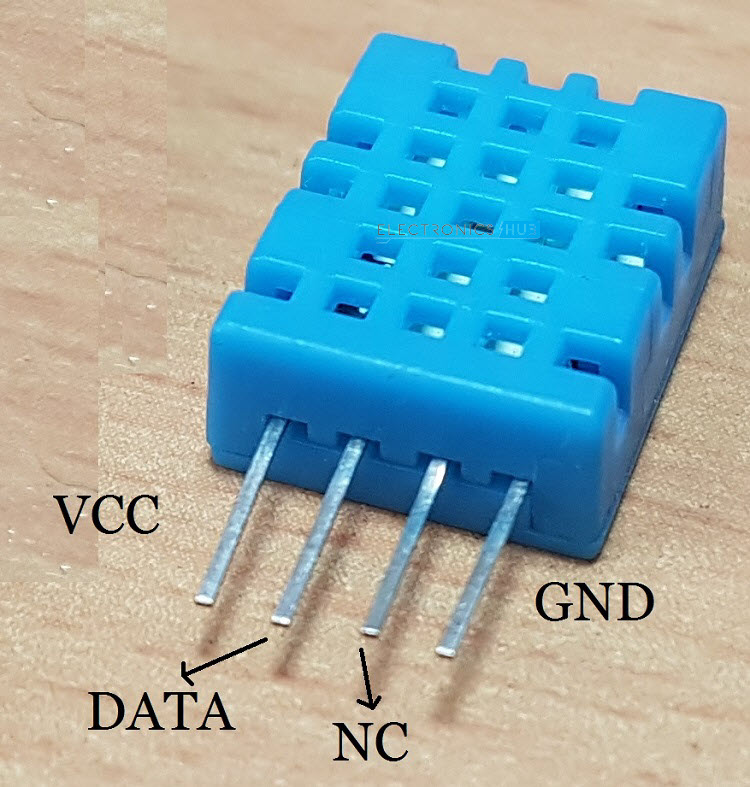
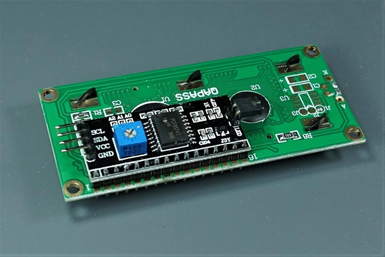
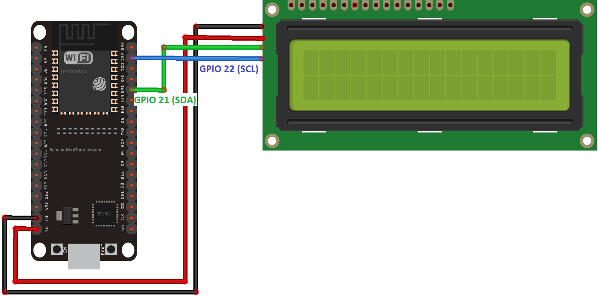

>[Torna a gateway I2C](gatewayi2c.md)

## **Gateway per DHT11 con display PCF8574**

### **Sensore digitale di temperatura, umidità DHT11**



### **Esempio di cablaggio**


### **Display I2C PCF8574**



**Testo statico**

Di seguito è riportato un riepilogo delle funzioni per manipolare e scrivere caratteri sul display:
- lcd.init(): inizializza il display
- lcd.backlight(): accende la retroilluminazione del display LCD
- lcd.setCursor(int column, int row): imposta il cursore nella posizione specificata da column e row
- lcd.print(String message): visualizza il messaggio nel display
- lcd.clear(): cancella il display

Il codice seguente permette di impostare un oggetto lcd le cui proprietà sono l'indirizzo sul BUS I2C del display e il numero di righe e di colonne di cui è dotato.
```C++
int lcdColumns = 16;
int lcdRows = 2;
LiquidCrystal_I2C lcd(0x27, lcdColumns, lcdRows);
```
Si può stampare su due righe impostando prima lcd.setCursor(0, 0), scrivere sulla prima riga e dopo impostando lcd.setCursor(0,1) scrivere sulla seconda. 

Si può utilizzare una schedulazione del tempo con delay() o millis() per realizzare una scrittura di contenuti lunghi su più pagine consecutive. Il contenuto corrente di una pagina si imposta con lcd.print("Un messaggio..."), mentre quello vecchio si cancella con lcd.clear().

**Testo dinamico**
Se il messaggio da stampare è più lungo del numero massimo di colonne del display (ad esempio 16 caratteri) allora è utile una funzione di scroll per visualizare il contenuto in forma scorrevole su una riga. 

```C++
// Function to scroll text
// The function acepts the following arguments:
// row: row number where the text will be displayed
// message: message to scroll
// lcdColumns: number of columns of your LCD
void scrollText(int row, String message, int delayTime, int lcdColumns) {
  for (int i=0; i < lcdColumns; i++) {
    message = " " + message;  
  } 
  message = message + " "; 
  for (int pos = 0; pos < message.length(); pos++) {
    lcd.setCursor(0, row);
    lcd.print(message.substring(pos, pos + lcdColumns));
  }
}
```
La funzione va schedulata nel tempo o con con delay() o millis() per impostare la velocità di scorrimento (vanno bene 250 mSec). 

**Caratteri custom**

In un diaplay LCD 16×2 ci stanno 32 blocchi dove visualizzare un carattere. Ciascun blocco è composto di una matrice di pixel 5×8.

Per generare dei caratteri personalizzati si può usare un apposito editor online che genera la codifica corrispondente all'icona disegnata: https://omerk.github.io/lcdchargen/

A questo punto si istanzia una variabile globale con il risultato dell'editor:
```C++
byte heart[8] = {
  0b00000,
  0b01010,
  0b11111,
  0b11111,
  0b11111,
  0b01110,
  0b00100,
  0b00000
};
```

Nel setup() si visualizza il carattere impostando prima la sua posizione:

```C++
lcd.setCursor(0, 0);
lcd.write(0);
```

### **Esempio di cablaggio**


Dal **punto di vista SW** seve **4 librerie** da scaricare dentro la solita cartella **libraries**:
- **DHT sensor library**. Si scarica da https://github.com/adafruit/DHT-sensor-library come DHT-sensor-library-master.zip da scompattare e rinominare semplicemente come **DHT sensor library**
- **Adafruit Unified Sensor**. Si scarica da https://github.com/adafruit/Adafruit_Sensor come Adafruit_Sensor-master.zip da scompattare e rinominare semplicemente come **Adafruit_Sensor**
- **LiquidCrystal_I2C**. Si scarica da https://github.com/johnrickman/LiquidCrystal_I2C come LiquidCrystal_I2C-master.zip da scompattare e rinominare semplicemente come **LiquidCrystal_I2C**

### **Gateway I2C-MQTT con un sensore DHT11 collegato a stella su porta digitale e un display PCF8574 su BUS I2C**

Il codice di seguito interroga periodicamente (ogni 2 sec) un sensore DHT11 collegato su una porta digitale. Dopo ogni lettura le misure di temperatura e umidità vengono: mostrate sul display PCF8574 collegato sul BUS I2C, inviate via MQTT ad un server applicativo sotto forma di messaggio JSON. 

La libreria MQTT è asincrona per cui non bloccante. E' adoperabile sia per **ESP8266** che per **ESP32**.

```C++
//#include <WiFiClientSecure.h>
//#include <ESP8266WiFi.h> per ESP8266
#include <AsyncMqttClient.h>
#include <Ticker.h>
#include <DHT.h>
#include <Wire.h> 
#include <LiquidCrystal_I2C.h>

#include <WiFi.h>       // per ESP32

// Raspberry Pi Mosquitto MQTT Broker
//#define MQTT_HOST IPAddress(192, 168, 1, 254)
#define MQTT_HOST "test.mosquitto.org"
// For a cloud MQTT broker, type the domain name
//#define MQTT_HOST "example.com"
#define MQTT_PORT 1883

#define WIFI_SSID "casafleri"
#define WIFI_PASSWORD "fabseb050770250368120110$"

//Temperature MQTT Topic
#define MQTT_PUB "esp/mpu6050/"
#define MAXNDEVICES 4

#define SCREEN_WIDTH 128 // OLED display width, in pixels
#define SCREEN_HEIGHT 64 // OLED display height, in pixels
#define DHT11PIN 16

Ticker mqttReconnectTimer;
Ticker wifiReconnectTimer;

DHT dht(DHT11PIN, DHT11);
LiquidCrystal_I2C lcd(0x3F, 16, 2);
byte degree_symbol[8] = 
              {
                0b00111,
                0b00101,
                0b00111,
                0b00000,
                0b00000,
                0b00000,
                0b00000,
                0b00000
              };

String datastr = "";

AsyncMqttClient mqttClient;

unsigned long previousMillis = 0;   // Stores last time temperature was published
const long interval = 2000;        // Interval at which to publish sensor readings
byte count = 0;
unsigned short nDevices = 0;
unsigned short addresses[MAXNDEVICES];

unsigned long previusMillis = 0;
bool sensor1 = false;
float t1, h1;

void connectToWifi() {
  Serial.println("Connecting to Wi-Fi...");
  WiFi.mode(WIFI_STA);
  //WiFi.disconnect();
  WiFi.begin(WIFI_SSID, WIFI_PASSWORD);
}

void connectToMqtt() {
  Serial.println("Connecting to MQTT...");
  mqttClient.connect();
}

void WiFiEvent(WiFiEvent_t event) {
  Serial.printf("[WiFi-event] event: %d\n", event);
  switch(event) {
    case SYSTEM_EVENT_STA_GOT_IP:
      Serial.println("WiFi connected");
      Serial.println("IP address: ");
      Serial.println(WiFi.localIP());
      connectToMqtt();
      break;
    case SYSTEM_EVENT_STA_DISCONNECTED:
      Serial.println("WiFi lost connection");
      mqttReconnectTimer.detach(); // ensure we don't reconnect to MQTT while reconnecting to Wi-Fi
      wifiReconnectTimer.once_ms(2000, connectToWifi);
      break;
  }
}

void onMqttConnect(bool sessionPresent) {
  Serial.println("Connected to MQTT.");
  Serial.print("Session present: ");
  Serial.println(sessionPresent);
}

void onMqttDisconnect(AsyncMqttClientDisconnectReason reason) {
  Serial.println("Disconnected from MQTT.");
  if (WiFi.isConnected()) {
    mqttReconnectTimer.once_ms(2000, connectToMqtt);
  }
}

void onMqttPublish(uint16_t packetId) {
  Serial.println("Publish acknowledged.");
  Serial.print("  packetId: ");
  Serial.println(packetId);
}

void addrSearch()
{
  byte error, address;
  int nDevices;
  Serial.println("Scanning...");
  nDevices = 0;
  for(address = 1; address < 127 && nDevices < MAXNDEVICES; address++ )
  {
    // The i2c_scanner uses the return value of
    // the Write.endTransmisstion to see if
    // a device did acknowledge to the address.
    Wire.beginTransmission(address);
    error = Wire.endTransmission();
    if (error == 0)
    {
      Serial.print("I2C device found at address 0x");
      if (address<16)
        Serial.print("0");
      Serial.print(address,HEX);
      Serial.println("  !");
	  addresses[nDevices] = address;
      nDevices++;
    }
    else if (error==4)
    {
      Serial.print("Unknown error at address 0x");
      if (address<16)
        Serial.print("0");
      Serial.println(address,HEX);
    }    
  }
  if (nDevices == 0)
    Serial.println("No I2C devices found\n");
  else
    Serial.println("done\n");
  //delay(5000);           // wait 5 seconds for next scan
}

void busInit(){
	// join I2C bus (I2Cdev library doesn't do this automatically)
	Wire.begin();
	addrSearch();
	// initialize device
	delay(2000);
	Serial.println("Initializing I2C devices...");
	dht.begin();
	delay(2000);
    lcd.init();
    lcd.backlight();
    lcd.createChar(0, degree_symbol);
    lcd.setCursor(0,0);
    lcd.print("  DHT11   with ");
    lcd.setCursor(0,1);
    lcd.print("  ESP32 DevKit ");
    delay(2000);
    lcd.clear();
}

void setup() {
  Serial.begin(115200);
  Serial.println();
  Serial.println();

  WiFi.onEvent(WiFiEvent);

  mqttClient.onConnect(onMqttConnect);
  mqttClient.onDisconnect(onMqttDisconnect);
  mqttClient.onPublish(onMqttPublish);
  mqttClient.setServer(MQTT_HOST, MQTT_PORT);
  // If your broker requires authentication (username and password), set them below
  //mqttClient.setCredentials("REPlACE_WITH_YOUR_USER", "REPLACE_WITH_YOUR_PASSWORD");
  connectToWifi();
  count = 0;
  while (WiFi.status() != WL_CONNECTED && count < 10) {
    delay(500);
    count++;
    Serial.print(".");
  }
  busInit();  
}

void packData(String &str){    
	str = "{\"temp1\":\"";
	str += t1;
	str += "\",\"humidity1\":\"";
	str += h1;
	str += "\"}";
}

void loop() {
  unsigned long currentMillis = millis();
  if (currentMillis - previousMillis >= interval) {
      previousMillis = currentMillis;
	  
	  Serial.print("Requesting data...");
	  t1 = dht.readTemperature();
	  h1 = dht.readHumidity();
	  Serial.println("DONE");
	  
      lcd.setCursor(0,0);
	  lcd.print("Temp = ");
	  lcd.print(t1);
	  lcd.write(0);
	  lcd.print("C");
	  lcd.setCursor(0,1);
	  lcd.print("Humidity = ");
	  lcd.print(h1);
	  lcd.print("%");
	  
	  packData(datastr);
	    
      // Publish an MQTT message on topic esp32/ds18b20/temperature    
	  uint16_t packetIdPub1 = mqttClient.publish(MQTT_PUB, 1, true, datastr.c_str(), datastr.length());                        
      Serial.print("Pubblicato sul topic %s at QoS 1, packetId: ");
	  Serial.println(MQTT_PUB);
      Serial.println(packetIdPub1);
	  Serial.print("Messaggio inviato: ");
	  Serial.println(datastr); 
  }
}

```
**Sitografia:**
- https://randomnerdtutorials.com/esp32-esp8266-i2c-lcd-arduino-ide/
- https://www.electronicshub.org/esp32-i2c-lcd/
- https://www.electronicshub.org/esp32-dht11-tutorial/


>[Torna a gateway I2C](gatewayi2c.md)
