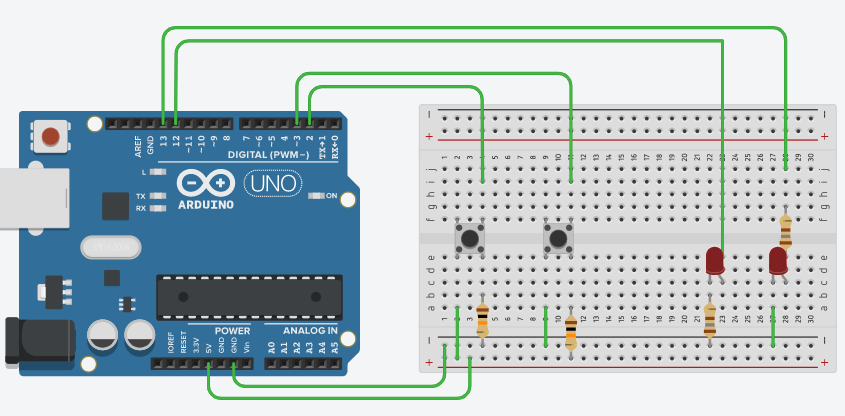

>[Torna all'indice](indexpulsanti.md)
## **GESTIONE ELETTRICA DEI PULSANTI**

Un pulsante è un **contatto** che **chiude** un circuito alla **pressione** esercitata dall’esterno su di un **pistoncino** e che ritorna automaticamente ad una **posizione di riposo** di circuito **aperto** per effetto di una molla interna di richiamo. In sostanza, un pulsante è un interruttore che quando è **premuto** si chiude mentre quando **non è premuto** diventa, **da solo**, aperto.

Il pulsante è **senza stato** nel senso che non “ricorda” né elettricamente nè meccanicamente lo stato della sua impostazione **precedente**.

Il **contatto** che si chiude alla pressione del pulsante è in realtà **uno solo** e unisce **due terminali** indicati in figura con a-b e c-d (le due striscette verdi in figura):

- A **circuito aperto** i terminali sono collegati a coppie. **Visivamente** le “gambine” che si guardano l’una con l’altra **di faccia** (a-b e c-d) sono quelle **già collegate** internamente anche a circuito aperto (strisce verdi), quelle che sono **affiancate di taglio** (a-d e b-c) sono quelle **sempre scollegate** a circuito aperto.

- A **circuito chiuso** i terminali sono collegati tutti insieme. I **terminali** a-b e c-d sono **cortocircuitati** **all’interno** del pulsante, in pratica diventano lo **stesso terminale** (conduttori equipotenziali con un voltaggio comune).

Per **cablare** un pulsante ad un ingresso digitale di un microcontrollore sono possibili due schemi (topologie) di collegamento: **pullup** e **pulldown**.

**Pull** vuol dire tirare per cui lo scopo dei due metodi di collegamento è letteralmente “tirare in alto” e “tirare in basso”.

- **“tirare" chi?** Evidentemente **l’ingresso** **digitale** del microcontrollore, specificatamente il parametro elettrico **tensione**, quello che si misura in **volt.** I valori possibili possono essere tutti quelli compresi tra la tensione **GND** (normalmente 0V) e quella di alimentazione della scheda (**5V** per Arduino, **3,3V** per dispositivi più piccoli). Valori diversi da quelli compresi entro questo range potrebbero essere tollerati fino ad un certo limite superato il quale si danneggia irreversibilmente la porta o, nel caso peggiore, tutta la scheda.

-  **“tirare" dove?** O in **UP** alla **Vcc** (ad esempio 5V), cioè l’ingresso del microcontrollore viene portato alla alimentazione positiva della scheda, oppure in **DOWN** ovvero **GND** cioè l’ingresso del microcontrollore viene portato al potenziale zero, cioè è **virtualmente** cortocircuitato verso massa.

-  **“tirare" quando?** La topologia rappresentata dal collegamento (pull up o pull down) fotografa la situazione in cui il pulsante **non è premuto**, cioè la situazione del pulsante che realizza un **circuito aperto** tra i suoi terminali.

- **“tirare" come?”** Il piedino di ingresso del microcontrollore non è **mai** collegato direttamente in su alla Vcc o in giù al GND ma indirettamente **tramite una resistenza** di valore opportuno (1-10K Ohm).

**Porte digitali di ingresso**

Ogni **porta** di ingresso del microcontrollore possiede internamente un circuito in grado di "leggere" la **tensione** in ingresso e **interpretarla**, cioè tradurla in un **valore digitale** in base al superamento o meno di una certa **soglia**. La soglia è posta a circa **metà** della tensione di alimentazione. Se la tensione è **sotto** la soglia l'ingresso viene interpretato come uno **0 (LOW)**, altrimenti, se è **sopra** la soglia, esso vale digitalmente un **1 (HIGH)**.

**Situazione di pulsante aperto**

- **Ruolo della resistenza** è quello di polarizzare la **tensione** sulla porta digitale che sta **nell'unico percorso** possibile per la corrente per arrivare a massa. Poiché il micro, in prima approssimazione, non consuma corrente (in realtà e trascurabile), la caduta di tensione sulla resistenza è nulla e pertanto il potenziale ai suoi capi è il medesimo (differenza di potenziale nulla). In altre parole, la resistenza è assimilabile ad un pezzo di **filo** che collega l’ingresso del micro **in alto a Vcc (pullup)** o **in basso a GND (pulldown).**

- **Ruolo del pulsante** è lasciare l’ingresso al suo valore di default (Vcc nel caso del **pullup** o GND nel caso del **pulldown**) polarizzato mediante la **resistenza**. Dal **microcontrollore** questi valori sono codificati rispettivamente, con lo stato logico alto **HIGH** (normalmente vale1) e **LOW** (di solito vale 0)

**Situazione di pulsante chiuso**

A pulsante chiuso i terminali del pulsante sono tutti allo stesso potenziale, lo stesso del filo.

- **Ruolo della resistenza** è quello di limitare la **corrente** che scorre nel **pulsante** quando questo viene chiuso. Infatti, per effetto della sua **chiusura**, su di esso scorre la corrente generata dalla tensione che si viene a determinare **ai capi** della resistenza pari in genere a **Vcc**. Se la resistenza fosse stata semplicemente **un filo** (resistenza nulla) la corrente sarebbe quella di **cortocircuito** (teoricamente infinita). Se la resistenza fosse stata semplicemente un **circuito aperto** l’ingresso non sarebbe stato **preventivamente tirato** al suo valore di default.
- **Ruolo del pulsante** è quello di cortocircuitare, cioè polarizzare, l’ingresso del microcontrollore a potenziale GND nel caso della polarizzazione **pullup**, o a potenziale **Vcc** nel caso di quella **pulldown**. L’effetto è evidentemente quello di **invertire** lo stato logico di default (determinato, a pulsante aperto, dalla resistenza).

In **definitiva**, la **polarizzazione** in tensione della porta di ingresso digitale è realizzata:
- a pulsante aperto, dalla **resistenza**
- a pulsante chiuso, dal **filo** tramite il **pulsante** 

**Valori della resistenza** troppo bassi o troppo alti determinano vantaggi e svantaggi:

- **Molto bassi** hanno il **vantaggio** di garantire una buona **immunità** **ai disturbi** (EMI e RFI) ma lo **svantaggio** di determinare potenzialmente un **consumo di corrente eccessivo** (eccessivo consumo delle batterie)

- **Molto alti** hanno il **vantaggio** di garantire **un basso consumo** di corrente a riposo (lunga durata delle batterie ma lo **svantaggio** di determinare potenzialmente una **predisposizione ad assorbire rumore** di tipo EMI o RFI.

Un valore di **compromesso** spazia da qualche KOhm fino a 50 KOhm (tipicamente **10 KOhm**).

**Riassumendo,** lo **stato logico** dei pulsanti nelle due configurazioni è:

-  **PULL UP** –> Interruttore aperto –> HIGH  
**PULL UP** –> Interruttore chiuso –> LOW

- **PULL DOWN** –> Interruttore aperto –> LOW  
**PULL DOWN** –> Interruttore chiuso –> HIGH

Di seguito è riportato lo schema di un **possibile collegamento** di due pulsanti in pulldown (a sinistra) e in pullup (a destra) su una breadboard:

**Proposta di cablaggio sulla basetta**

Il pulsante a sinistra è collegato in configurazione Pull Down mentre quello a destra in configurazione Pull Up:

- I pulsanti sono **disposti** orientando i terminali **già uniti** internamente a circuito aperto (a-b) e (c-d) a cavallo del **solco** grande tra le due zone della basetta.

- A ciascuna **porta** digitale di ingresso corrisponde il suo **pulsante**. Una porta **va collegata** (tramite un filo) ad uno di quei terminali che in un pulsante sono posti **in alto**. Il terminale corrispondente posto **in basso** si collega alla resistenza di **pull** (UP o DOWN). Questa specifica connessione serve, in definitiva, a collegare insieme la porta digitale ad un terminale del pulsante e ad **un capo** della resistenza di pull.

- La resistenza di **pull** nel disegno ha quindi un **primo terminale** sempre verso la porta ed un **secondo terminale** sempre verso una delle alimentazioni (positiva nel pull up, negativa in caso di pull down).

- Il terminale del pulsante che, a pulsante aperto, **non è collegato** alla resistenza (a sinistra della resistenza nel disegno) va collegato all'alimentazione positiva in caso di **pull down** o all'alimentazione negativa in caso di **pull up**. Questo perchè, a **pulsante chiuso**, la funzione di **pull** della porta digitale, alla **tensione contraria** a quella di riposo, è svolta, tramite un filo, proprio **dallo stesso pulsante**.

>[Torna all'indice](indexpulsanti.md)
<!--stackedit_data:
eyJoaXN0b3J5IjpbLTEwNzE0MzIzOTldfQ==
-->
