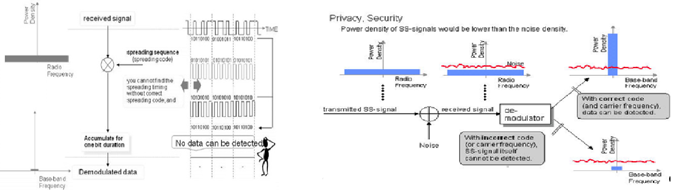
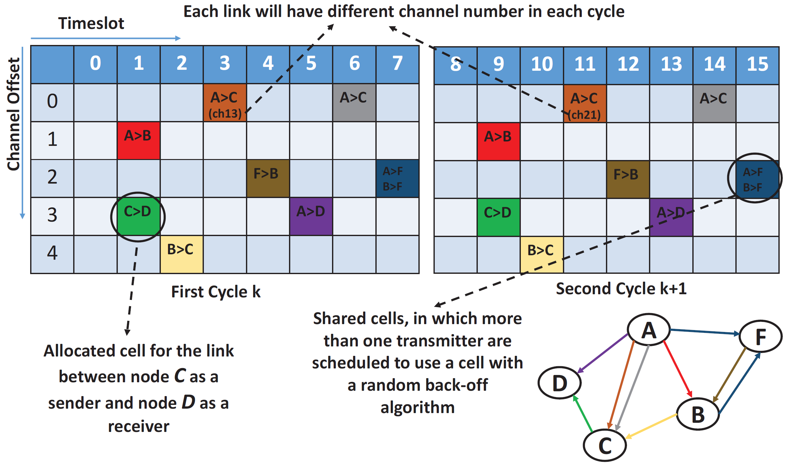

>[Torna a reti di sensori](sensornetworkshort.md#servizi-di-accesso-radio-per-WSN)

# **Tecnologie di accesso al canale radio**

## **FDM**

### **Segnale in banda base (BB)**

Il **segnale** di una qualsiasi comunicazione viene **generato** a partire da una operazione di **trasduzione** (trasformazione da **grandezza fisica** a **segnale elettrico**) a cui poi segue, nel mondo digitale, una operazione di **campionamento** e **quantizzazione** per trasformarlo, dal mondo doppiamente **infinito** del tempo e dello spazio, a quello doppiamente **discreto** (finito) dei **campioni** e dei **livelli**, questi ultimi numerati e **codificati** in **bit**. 


Ogni bit viene poi **codificato** in opportuni segnali aventi una forma adatta alla banda base (tipicamente la **NRZ**). Dopo il segnale digitale in banda base viene convertito in **radiofrequenza** tramite **modulazioni digitali**, che **alterano** un segnale RF ad alta frequenza in funzione dei valori dei bit contenuti nel segnale in banda base. Le modulazioni più note sono ASK, FSK e PSK, di cui i dettagli, però, esulano da questa trattazione (vedi corso di telecoumunicazioni).

**Riassumendo**, la **banda base** è la porzione dello **spettro radio** in cui il segnale viene **generato**. E' detta **banda base** proprio perchè è la casa natia da cui parte il segnale prima di affrontare il suo viaggio nello **spazio libero** di propagazione delle **onde radio**. E' una **banda** perchè le informazioni sono concentrate su un intervallo di frequenza **limitato** e quindi non avrebbe senso trasmettere anche le altre frequenze. 

La **banda base** di un sistema è per larga parte sovrapponibile a quella di molti altri sistemi analoghi ma questi normalmente non si intereferiscono tra loro perchè separati grazie alla divisione di spazio (SDM), essendo confinati su dispositivi diversi con cablaggi diversi.

### **Segnale FDM**

Un **segnale in banda base** è generato a partire dalla frequenza nulla fino ad una frequenza massima finita. La frequenza massima è finita perchè tutti i sistemi fisici, senza eccezione alcuna, sono considerati **passa basso**, cioè tendono **naturalmente** ad **attenuare** il segnale generato all'**aumentare** della **frequenza**. Al **di sotto** di un certo **limite** il valore del segnale è considerato fisicamente **trascurabile** (approssimazione pratica). La frequenza in cui il segnale vale la **metà** del valore a centro banda viene detta **frequenza di taglio** o frequenza a 3dB (decibel). La **frequenza di taglio** è il limite **convenzionale** della larghezza di banda di tutti i segnali in **banda base**.

Molte tecnologie di accesso al **canale radio** mirano a trasferire **più** segnali in **banda base**, provenienti da sorgenti di informazione diverse, sul mezzo radio di uno **stesso luogo**, nello **stesso tempo** ma su **frequenza diverse**, utilizzando una tecnica **FDM**. Queste tecnologie presuppongono la **traslazione del segnale** da trasmettere dalla sua frequenza originale (detta **banda base**), dove viene **generato**, a quella di **trasmissione** (detta banda **traslata**), dove viene **trasmesso**. 

L'operazione è analoga a quella di prelevare dalla **finestra** di un montacarichi (la banda base) dei **libri** (il segnale) per poi disporli in diversi **scomparti** (le bande) di uno scaffale di una **libreria** (lo spettro). Si noti che i libri (persino i più grandi) hanno una **numero di pagine** finito, esattamente come i segnali in banda base hanno una **larghezza di banda** (a 3dB) finita.

L'**intero spettro radio** è diviso convenzionalmente in **bande di frequenza** che sono riservate ad una certa **categoria di servizi**. Ogni banda di frequenza è divisa in **canali** che sono allocati ad una certa **comunicazione** (sorgente), secondo **politiche** che possono essere **statiche** o **dinamiche**:
- Quelle **statiche** rimangono **fisse** per tutta la durata della comunicazione e la loro allocazione è stabilita nella fase di **apertura** di questa (protocolli connessi). **No**n viene **modificata** la frequenza della comunicazione finchè questa resta aperta.
- Quelle **dinamiche** vengono allocate, senza impegno preordinato, al momento della **trasmissione** (protocolli non connessi). La **frequenza centrale** del canale potrebbe essere modificata anche durante la comunicazione (**frequency hopping**).


### **Demodulazione del segnale FDM**

Tutte le tecniche di demodulazione di un segnale RF (a radiofrequenza) presuppongono in ricezione la **traslazione** (contaria a quella effettuata in trasmissione) del segnale dalla banda traslata alla **banda base**, dove poi il segnale viene campionato per ricostruire il **valore originale** dei singoli bit. Questa operazione è possibile solo se il segnale possiede un'**ampiezza sufficiente** per **discriminarlo** dal **rumore** che può essere causato:
- da sorgenti di disturbo elettromagnetiche, dette **EMI** (Electromagnetic Interference), sempre presenti in un mezzo trasmissivo (disturbi impulsivi, impianto elettrico).
- dal rumore generato dalle interferenze di altre sorgenti detto **RFI** (Radio Frequency Interference).


Un segnale in **banda base**, per essere correttamente decodificato, deve diventare un segnale a **banda stretta** avente:
- un numero limitato di frequenze
- un livello di energia sufficientemente alto, cioè al di sopra del rumore, in tutte le sue componenti spettrali (frequenze). In altre parole, il segnale deve avere un **rapporto segnale/rumore** complessivo (S/N ratio) sufficiente.

Anche in assenza delle suddette sorgenti di rumore, esiste una sorgente di rumore ineliminabile costituita dalla **radiazione di fondo** dell'universo avente una intensità di circa -144 dBm/Hz.

## **DSSS**

In realtà DSSS più che una tecnica di  **multiplazione** per l' **accesso al canale radio** è una vera e propria tecnica di **modulazione numerica** complementare alle tradizionali ASK, PSK, FSK, ecc.).

Nel **CDM** la sorgente viene:
- **traslata**: cioè portata dalla sua frequenza in **banda base** (centrata sulla frequenza nulla) alla **frequenza centrale** della **banda** di trasmissione (operazione di **conversione** in banda traslata).
- **espansa**: cioè trasformata da segnale a **banda stretta** a segnale che occupa **tutta** la banda di lavoro detto segnale a **banda espansa** (operazione di **spreading** su tutta la banda).  

Nei sistemi DSSS (Direct Sequence Spread Spectrum), il **fattore di spreading** è la lunghezza della sequenza di spreading che si riflette nel numero di chip per ciascun simbolo di modulazione.

### **Fase di trasmissione**

L'**espansione in frequenza** si ottiene trasformando artificialmente un segnale **lentamente variabile** nel tempo in uno **rapidamente variabile** nel tempo moltiplicandolo, **in trasmissione**, per un segnale ad **alta frequenza** che occupa tutta la banda del canale detto **chirp**. Ad **ogni sorgente** è associato un **codice di espansione** che caratterizza la sequenza dei **bit veloci** del chirp (quella contenuta in un **singolo bit lento** della sorgente). 


La **proprietà** che viene **divisa** fisicamente è la **potenza** di trasmissione. La proprietà che viene suddivisa logicamente è un insieme di **codici ortogonali**
**In TX** la sorgente viene espansa: cioè trasformata da segnale a banda stretta a segnale che occupa tutta la banda di lavoro, detto segnale a spettro espanso.  

L’**espansione** in frequenza di un segnale:
- mantiene **immutata l’energia** complessiva del segnale originale, cioè l’area sottesa al segnale nel diagramma potenza – frequenza rimane la stessa (si allarga la base del segnale ma, nel contempo, si diminuisce l’altezza).
- si **ottiene nel dominio del tempo** moltiplicando il segnale di partenza per un altro segnale di frequenza **molto maggiore** detto **chirp (o spreading code)**. L’**energia** viene così **diffusa** su **tutte** le frequenze della banda ma con una **ampiezza** molto bassa. La **moltiplicazione** trasforma un segnale lentamente variabile in uno rapidamente variabile **sostituendo** il **bit originale** con una **sequenza di bit** veloci detti **chirp**. Un **chirp** è, quindi, una sequenza che **marchia** in maniera univoca i **bit** di una certa sorgente rendendoli, in ricezione, distinguibili da quelli di qualsiasi altra.



### **Fase di ricezione**

Nel CDM le **sorgenti** occupano e **condividono** tutta la **banda** di frequenza nello **stesso tempo** e in **tutto lo spazio** sovrapponendo l’energia di una con quella dell’altra (interferenza completa). Il **ricevitore** riceve i segnali di più sorgenti sotto **forma espansa** e sovrapposti tra loro (segnali interferenti) che sono, in pratica, indistinguibili.

**In ricezione** la moltiplicazione nel tempo di un segnale ricevuto per lo **stesso chirp** (o spreading code) con cui era stato espanso in trasmissione, riporta il segnale ricevuto a **banda stretta**, permettendone la **decodifica dei bit**. La moltiplicazione con quel codice avviene anche con gli **altri segnali ricevuti** ma, essendo questo diverso dal loro spreading code, li lascia a spettro espanso (proprietà di **ortogonalità**). 


### **Controllo della sensibilità**

**Aumentando** sufficientemente il **fattore di spreading** è possibile portare la **sensibilità** sotto la soglia di **rumore di fondo** dell'universo rendendo, di fatto, le comunicazioni inintercettabili. Inoltre si riesce a far lavorare il sistema in ambienti molto disturbati, persino con rapporti **segnale/rumore negativi**.

**Riassumendo**, lo spettro espanso è un mezzo di trasmissione in cui il segnale occupa una larghezza di banda superiore al minimo necessario per inviare l'informazione; l'allargamento della banda avviene mediante un codice indipendente dai dati, e per il despreading e il successivo recupero dei dati viene utilizzata una ricezione sincronizzata con il codice del ricevitore.

E' una tecnica di accesso usata dal protocollo **Zigbee** e **6LowPan** (IEEE 802.15.4).

## **FHSS**

Anche FHSS potrebbe essere vista come una tecnica di **modulazione numerica**.

Alcune **tecnologie radio** realizzano un **accesso multiplo** al canale radio, **apparentemente** allocando **molti canali** nello **stesso istante**. In realtà la tecnica  alloca un canale alla volta ma **saltando** da uno all'altro con una **velocità** che **alla sorgente** appare **istantanea**. Questo fenomeno ha l'effetto di sparpagliare (**spreading**) l'energia di un canale su **tutta la banda** disponibile. Si tratta di una **variante di CDM** ottenuta per altra via. Infatti, la **sequenza di saltellamento** è diversa per ogni comunicazione ed è associata ad un **SSID**. Le **sequenze** sono **ortogonali** e quindi permettono la ricostruzione in ricezione della **comunicazione originale**. Anche una eventuale **multiplazione TDM** effettuata dentro il canale FDM non si accorgerebbe del saltellamento e procederebbe come al solito, assegnando **diversi slot** temporali a **comunicazioni diverse**. Un messaggio potrebbe **partire** in un canale, passare ad altri 7 e completarsi solo nell' ottavo canale, ovvero l'ultimo visitato. La tecnica si chiama **Frequency hopping** o anche detta **FHSS**. La **distribuzione** della comunicazione su una **gamma ampia** di frequenze rende questo tipo di modulazione **meno sensibile** alle **interferenze**.

Esistono **due tipi** di salto di frequenza:
- **Slow Frequency Hopping (SFH)**. In questo caso **uno o più bit** di dati vengono trasmessi **all'interno** di un **salto**. Il segnale **non** è a **spettro espanso** ma cambia la sua frequenza nel tempo abbastanza rapidamente da perdere solo un numero limitato di bit in caso di fading selettivo in frequenza. Spesso, i sistemi che utilizzano l'hopping lento impiegano anche una codifica di controllo e **correzione** degli errori (burst) per ripristinare la perdita di (più) bit in un hop dovuta ad un eventuale **fading** selettivo in frequenza..
- **Fast Frequency Hopping (FFH)**. **Un bit** di dati è **suddiviso** in più salti. Il sistema è, in pratica, a spettro espanso e un **fading selettivo** in frequenza normalmente **non intacca** il **riconoscimento** dei bit. Principalmente viene utilizzata la modulazione FSK o MFSK.

In ogni caso, la **sequenza dei salti** per un bit (o per una certo **numero di bit**) è una caratteristica **univoca** di una certa comunicazione che non permette di decodificarene un'altra (codici **ortogonali**).

Nei sistemi FHSS (Frequency Hopping Spread Spectrum), il **fattore di spreading** è il numero di frequenze portanti su cui salta un simbolo di modulazione.


<video src="img/fhss.mp4" width="320" height="240" controls></video>

Video di simulazione [video FHSS](https://www.renishaw.com/media/video/en/82d4eb96c7504aa395f4a9150190e247.mp4)

E' una tecnica di accesso usata dal protocollo **Bluetooth LBE**

## **LoRa**
Uno degli svantaggi di un sistema DSSS è il fatto che richiede un orologio di riferimento altamente accurato (e costoso). La tecnologia LoRa Chirp Spread Spectrum (CSS) di Semtech offre un'alternativa DSSS a basso costo e a basso consumo, ma robusta, che non richiede un clock di riferimento altamente accurato.

La tecnologia di livello fisico chiamata LoRa utilizza una forma **custom** (e non resa di dominio pubblico) di **spettro espanso** per modulare le comunicazioni nella banda ISM sub-GHz. LoRa utilizza bande **ISM** senza licenza. Per realizzare fisicamente la comunicazione viene utilizzata una modulazione **CSS (Chirp Spread Spectrum)**, che **espande** un segnale a **banda stretta** su un canale a larghezza di banda più ampia.

FSK            |  CSS
:-------------------------:|:-------------------------:
  |  

Un **chirp** è un segnale in cui la frequenza aumenta (**up-chirp**) o diminuisce (**down-chirp**) con continuità. Nelle modulazioni QPSK, BPSK e in molti altri tipi di modulazione digitale, vengono usate onde sinusoidali per **codificare simboli**, ma il **CSS** usa i chirp, che sono segnali che non variano tensione/potenza nel tempo, ma cambiano la **frequenza nel tempo**.

Le modulazioni (digitali o analogiche) possono essere indagate separatamente nel tempo e nella frequenza o tramite particolari diagrammi che mostrano come la **frequenza varia** nel tempo, detti **spettrogrammi**. Da destra a sinistra ci stanno gli incrementi positivi di frequenza, dall'alto in basso quelli positivi del tempo. In uno spettrogramma:
- una **variazione discreta** tra due frequenza fisse che codificano i bit 1 e 0 (FSK) appare come una successione nel tempo di singole linee verticali che rappresentano due frequenze costanti diverse (dette armoniche).
- una **variazione continua** di frequenza detta scivolamento o chirp appare come un **segmento inclinato** con pendenza crescente nel tempo nel caso di un upchirp o decrescente nel tempo nel caso di un downchirp.


Definizioni:
- **Larghezza di banda**: larghezza dello spettro occupato dal chirp.
- **Fattore di spreading (diffusione)**: numero di bit codificato per simbolo (stato RF)
- **Chirp rate**: derivata prima della frequenza del chirp

Un segnale di **chirp** può essere suddiviso in 2^SF valori (128) che **codificano**, nella frequenza, il simbolo da trasmettere. Ad **un simbolo** corrisponde, nel tempo, una certa **sequenza lunga SF** di bit da trasmettere che può essere ricostruita **in ricezione** misurando la **lunghezza in frequenza** del chirp nello sprettogramma (mediante FFT) dove ha un valore compreso tra [0, 2^SF]. 

La **pendenza** (slope) del chirp nello spettrogramma è sempre tale da ottenere uno scivolamento di B Hertz nel tempo in cui si raccolgono SF bit, cioè un un simbolo, e questo per tutti i valori di SF. Per effetto di ciò, in corrispondenza di un fattore di spreading SF, i singoli bit verranno diffusi di 2^SF/SF nella frequenza.

I segnali di chirp con uguale SF non sono ortogonali tra loro per cui potenzialmente si interferiscono, mentre i segnali di chirp con **SF differente** sono effettivamente **ortogonali** per cui non si interferiscono anche se presenti nello stesso momento sullo stesso canale. Chiaramente, un numero elevato di segnali ortogonali interferenti tendenzialmente degrada il rapporto segnale rumore del canale.
 
L'ampiezza di banda B del canale rappresenta il chip rate. Il reciproco del chip rate rappresenta la lunghezza del chip nel tempo.

Il numero di simboli al secondo trasmessi rappresenta il symbol rate. Il reciproco del symbol rate rappresenta la lunghezza del simbolo nel tempo.

CHIP RATE         |  SYMBOL RATE  |  BIT RATE  | CHIP DURATION        |  SYMBOL DURATION   
:-------------------------:|:-------------------------:|:-------------------------:|:-------------------------:|:-------------------------:
  |     |     |   |  

La larghezza di banda B equivale al **chip rate**, ovvero al numero di segnali elementari al secondo, è la larghezza del canale. Un simbolo di frequenza massima si chiama **chip**. 

Lo **Spreading Factor (SF)** in LoRa è definito come il numero di bit per simbolo e indica il numero di volte che il segnale viene **allargato in frequenza** rispetto alla larghezza originale in banda stretta. Ad esempio, con SF7, il segnale viene allargato di 2^7/7 volte rispetto alla larghezza di banda originale, un incremento pressochè **esponenziale**.

In ogni momento vale la relazione: ```Rc > Rb > Rs```.

DR         |  SF
:-------------------------:|:-------------------------:
  |  

Il **data rate (DR)** varia da 0 a 5 ed è inversamente proporzionale allo **spreading factor (SF)** che varia da 7 a 12.

Aumentando lo spreading factor, si aumentano le componenti di frequenza dello spettro totale del segnale. In altre parole, l’energia del segnale totale è ora distribuita su una gamma più ampia di frequenze, consentendo al ricevitore di discernere un segnale con un rapporto segnale-rumore (SNR) più basso (cioè peggiore).


La **trama Lora** è composta da un preambolo di 8 chirp di sincronizzazione più un chirp di SOF che indica l'inizio della trama. I primi sono codificati con 8 upchirp di seguito mentre la sequenza SOF è codificata con 2 downchirp.


In **ricezione**, viene effettuato il cosidetto **dechirping** generando localmente dei segnali upchirp e downchirp con appropriato chirp rate e moltiplicandoli per i segnali ricevuti con pendenza opposta. Per effetto di ciò si ottengono nello spettrogramma dei segnali a frequenza costante che rappresentano singole righe spettrali. Quelle del **preambolo** hanno frequenza sempre uguale per tutti i messaggi mentre quelle del **payload** hanno frequenze diverse per ogni simbolo e la loro posizione nello spettro rappresenta il **valore** della codifica del simbolo, da cui è possibile risalire alla sequenza degli SF bit corrispondenti che sono stati trasmessi. 

Altre **operazioni numeriche** coperte da brevetto e ricostruibili solamente mediante reverse ingegnering permettono di completare la decodifica effettiva dei bit. In totale sono riconducibili a 4 fasi:
1. **Symbol “gray indexing”**, aggiunge tolleranza agli errori
2. **Data whitening**. Introduce randomizzazione dei bit trasmessi
3. **Interleaving**. Realizza proprietà di oscuramento dei bit 
4. **Forward Error Correction**, aggiunge dei bit di parità

Una funzione aggiuntiva del protocollo LoraWAN è il **Telegram splitting**: questo metodo suddivide un segnale a banda ultrastretta in numerosi sottopacchetti più piccoli, trasmettendoli successivamente come brevi burst radio a varie frequenze e intervalli di tempo. Per ridurre al minimo il potenziale di collisione con altri sottopacchetti, utilizza tempi di trasmissione brevi e pseudo-casualità. Questo approccio migliora sia la robustezza che la scalabilità riducendo al contempo le interferenze

Altre **caratteristiche positive** di Lora sono:
- realizzazione di collegamenti con link budget molt elevati
- Resilienza alle interferenze
- Prestazioni a basso consumo
- Resistenza agli effetti multi-percorso
- Resistenza all'effetto Doppler (applicazioni mobili)

Può essere adoperato da solo, implementando su di esso uno **stack custom**, oppure come parte della pila **LoraWAN** mantenuta dalla Lora Alliance, purchè l'accesso radio rispetti le regolamentazioni valide per la banda **ISM** per cui è nato.

## **TSCH**

Il **Time Slotted Channel Hopping** è una tecnologia radio che realizza un **accesso al canale singolo**, nel senso che l sorgente invia **per intero** un messaggio **in un canale** per un tempo stabilito da una **schedulazione TDM** costante e preordinata ma, alla **trama successiva** quello **slot** temporale sarà assegnato ad **un'altra frequenza** per tutta la sua durata e così accade per tutti gli altri slot di quella trama. Così, in caso di trasmissione **non riuscita** a causa di interferenze esterne o dissolvenza multi-percorso, la sua **ritrasmissione** avviene su una frequenza diversa, spesso con una migliore probabilità di successo rispetto all'utilizzo della stessa frequenza di prima. Si noti che, identificando una comunicazione con i suoi dispositivi endpoint, allora accade che tutti questi dispositivi, per ogni trama, devono condividere lo stesso slot e lo stesso canale.  La tecnica si chiama **Time Slotted Channel Hopping** o anche detta **TSCH**. Gli hop sono **più lenti** del **segnale modulato** per cui non è considerabile come una tecnica di modulazione del segnale portante. 

TSCH può essere visto come una combinazione dei meccanismi di accesso multiplo a **divisione di tempo** e di accesso multiplo a **divisione di frequenza** poiché utilizza la **diversità** di tempo e frequenza insieme per fornire affidabilità agli strati superiori della rete. 

TSCH è progettato per fornire una pianificazione **deterministica** del tempo e delle frequenze utilizzate per la trasmissione dei dati. Questo significa che il protocollo utilizza uno schema predefinito di slot temporali e canali radio, garantendo che le trasmissioni avvengano in modo prevedibile e **senza collisioni**. Questo aspetto deterministico è importante per garantire una comunicazione affidabile e a **bassa latenza** nelle reti IoT.

Benchè si possa adoperare in reti LPWA, il suo utilizzo è più comune in **reti mesh**.



A causa della natura **TDM** della comunicazione in una rete TSCH, i nodi devono mantenere una **stretta sincronizzazione**. Si presuppone che tutti i nodi siano dotati di orologi per tenersi sincronizzati tra di loro. Però, poichè gli orologi in nodi diversi **derivano** l'uno rispetto all'altro, i nodi adiacenti devono periodicamente **risincronizzarsi**.

Ogni nodo deve sincronizzare periodicamente il proprio orologio di rete con un altro nodo e fornisce anche il tempo di rete ai suoi vicini.
Spetta all'ente che gestisce la pianificazione assegnare una sorgente di sincronizzazione vicina a ciascun nodo detta "time source neighbor". Durante l'impostazione del "time source neighbor", è importante evitare cicli nei percorsi di sincronizzazione, che potrebbero comportare la formazione di gruppi indipendenti di nodi sincronizzati.

E' usata dal protocollo IEEE 802.15.4g/e, livello fisico degli stack **RIIoT**, **OpenWSN** e dalle ultime versioni di **Zigbee** e **6LowPan**.

## **TSMA**

**Telegram Splitting Multiple Access** (TSMA) è una tecnica in cui un telegramma o un pacchetto viene suddiviso in molti sottopacchetti. Questi sottopacchetti vengono quindi distribuiti in modo pseudo-casuale sulla frequenza e sul tempo. Ciò rende la trasmissione resistente agli interferenti. Alcuni sottopacchetti potrebbero andare persi ma i dati possono ancora essere recuperati grazie alla correzione degli errori di inoltro (FEC). Telegram Splitting Ultra Narrow Band (TS-UNB) è una famiglia di protocolli che adotta TSMA.


Mentre TSCH è noto per il suo determinismo nella pianificazione delle trasmissioni, TSMA tende ad essere più stocastico nel suo approccio, utilizzando **strategie probabilistiche** per coordinare l'accesso al canale radio tra i dispositivi come quelle basate su protocolli di accesso multiplo quali CSMA/CA (Carrier Sense Multiple Access/Collision Avoidance) o ALOHA (con backoff).

In breve, la realizzazione pratica del Telegram Splitting coinvolge la suddivisione dei dati in **telegrammi più piccoli** e l'utilizzo di **protocolli di accesso multiplo** per gestire le trasmissioni **concorrenti** sui canali radio.

## **OFDM**

E' una tecnologia in cui i bit di una comunicazione, tramite una conversione seriale-parallelo, vengono inviati contemporaneamente su **più porzioni** di un canale di grande ampiezza (20 Mhz per il WiFi) dette **sottoportanti** (o anche **toni**). Le sottoportanti non solo sono vicine ma si **sovrappongono** in parte di uno spiazzamento stabilito. Lo **spiazzamento calibrato** opportunamente fornisce la proprietà di **ortogonalità** che garantisce alle sottoportanti di **non interferirsi** nonostante le sovrapposizioni reciproche. In pratica una **comunicazione veloce** viene suddivisa in più **comunicazioni lente** che hanno il pregio di poter essere gestite in maniera **meno critica** rispetto ai problemi associati ad un'unica veloce. 

La **distribuzione uniforme** delle sottoportanti lungo tutta la banda fa si che, per effetto di una **interferenza distruttiva** o di un **fading** improvviso (attenuazione) in corrispondenza di una certa sottoportante, si perderanno, o nel caso del fading si amplificheranno, le informazioni trasmesse su quella ma non le rimanenti trasmesse sulle altre sottoportanti. Questo perchè, in ricezione, le sottoportanti vengono demodulate separatamente e solo dopo i bit ricevuti sono ricomposti in un unico flusso. E' il criterio dei **compartimenti stagni** di una nave (le **sottoportanti**) applicato al **canale** di una sorgente (l'intera **nave**). 

All'**interno** del canale OFDM viena fatta una multiplazione **TDM** a contesa (tipicamente CSMA/CA) sia per renderlo **full duplex** sia per consentire l'**accesso multiplo** al canale da parte di più sorgenti, per cui, al variare del tempo, sullo  **stesso canale** verranno allocate **sorgenti diverse**. In ogni caso la trasmissione di **una sorgente** avviene sempre su **tutte** le sottoportanti (**no FDM**).

Le **sorgenti lente** impiegheranno un certo **tempo** per recuperare un numero sufficiente di bit per alimentare adeguatamente tutte le sottoportanti, ne consegue che la loro trasmissione sarà caratterizzata da **brevi impulsi** distanziati da **lunghi ritardi** e saranno pure trasmessi con grande spreco di **potenza**.

Oppure potrebbero esserci molte **trasmissioni brevi** che competono per il canale mediante il TDM a contesa **CSMA/CA**. Questa situazione genera uno scambio di **messaggi di controllo** aventi **dimensione** analoga a quella dei **messaggi dati**. Vuol dire che il canale potrebbe essere **più occupato** dai messaggi necessari per portare avanti il protocollo CSMA /CA che dai messaggi dati (**overhead eccessivo del CSMA/CA**).


E' adoperato dal **WiFi 5** e dalla telefonia mobile **4G**. Ha la proprietà di trasmettere dati ad **alta velocità** in ambienti con **forti interferenze**. 


## **OFDMA**

Realizza una **parallelizzazione** dell'accesso al canale radio da parte di **più sorgenti** abbinando alla multiplazione nel tempo anche una multiplazione nella frequenza **FDM**. 
Infatti, nell'OFDM può accadere che la multiplazione TDM applicata a sorgenti di velocità molto diverse determini che le sorgenti più lente vengano trasmesse con brevi messaggi che, avendo i bit spalmati su tutte le sottoportanti, sono inviati sul canale radio alla massima velocità da questo consentita. L'effetto è quella di una trasmissione di brevi burst inviati, con forte ritardo, su slot molto lontani nel tempo (il tempo necessario per accumulare il numero di bit sufficiente a riempire uno slot). Se non si volesse aspettare, per diminuire il ritardo, si dovrebbe accettare di trasmettere in ogni slot lasciandolo sempre mezzo vuoto.

L'**analogia del canale** è quella dei **TIR** che in **giorni diversi** portano poco carico quando il **carico complessivo** dei tre giorni avrebbe potuto benissimo essere accomodato su **un unico TIR**, direttamente al primo giorno, **riducendo** i **tempi di attesa**. 
**Servono** per far ciò: 
- la possibilità di inviare, nello **stesso slot** temporale, messaggi di **sorgenti diverse** su **sottoportanti diverse** dello stesso canale (multiplazione FDM), realizzando una parallelizzazione della trasmissione delle sorgenti.
- una **schedulazione efficace** che sappia **riordinare** i messaggi sulle sottoportanti (slot FDM) cercando di rispettare le **richieste di servizio** in termini di **latenza** che erano state **prenotate** per ogni sorgente in fase di **setup** della connessione. 


La **principale differenza** tra un sistema **OFDM** e un sistema **OFDMA** (Orthogonal Frequency Division Multiple Access) sta nel fatto che nella OFDM l'utente è allocato nel dominio del **tempo soltanto**. Durante l'utilizzo di un **sistema OFDMA**, invece, l'utente viene allocato sia **in base al tempo** che **in base alla frequenza**. Il sistema in un **certo istante** è in grado di trasmettere o ricevere comunicazioni di **più dispositivi** in **parallelo** (su sottoportanti diverse) diminuendo i **tempi di attesa**. Le **sottoportanti** di un **canale** (256 nello OFDMA di WiFi 6) sono dinamicamente **distribuite** su un certo numero di **sottocanali**. Ogni **sottocanale** è assegnato ad una **sorgente** alla volta. Il **numero dei sottocanali** è **variabile** e dipende da quante sottoportanti vengono assegnate a ciascuno di essi. La **ripartizione viene**, per **ogni slot** temporale, modificata e ottimizzata da uno **scheduler**.

Di seguito sono elencati **tutti i sottocanali allocabili** con il **numero** delle sottoportanti da essi **occupate**. Sono possibili anche **combinazioni di ampiezza diversa**. L'unico **vincolo** è che la **somma complessiva delle sottoportanti** allocate dai vari **sottocanali** in un certo **slot temporale** non superi mai il **numero complessivo** delle sottoportanti dati (242 per il WiFi 6). Dal grafico si evince chiaramente che possono essere allocate, ad esempio, 9 sottocanali da 26 sottoportanti ciascuno. Oppure un sottocanale da 106 sottoportanti più 2 da 52. Se, in un certo slot temporale, si vuole utilizzare il massimo della banda disponibile allora si alloca, per un'unica sorgente, un unico sottocanale da 242 sottoportanti.


OFDMA divide lo spettro in **unità di risorse (RU)** tempo-frequenza, cioè una sorta di **calendario** (misurato in **slot** invece che in giorni) dove, **per ogni slot**, sono segnate **le sottoportanti** che confluiranno nei sottocanali da **assegnare** alle **sorgenti** che, in quello slot, devono essere **trasmesse in parallelo**. Le **RU** sono proprio i **sottocanali** che sono stati allocati in un certo **slot temporale** alle **sorgenti** da trasmettere in **parallelo**. Un'**entità di coordinamento centrale** (lo scheduler dell'AP in 802.11ax) assegna le RU per la ricezione o la trasmissione a non più di **una sorgente** alla volta. La **pianificazione centralizzata** delle RU permette, inviando più messaggi brevi contemporaneamente sul mezzo radio, di evitare un **sovraccarico** (overhead) di contesa CSMA del canale, il che aumenta l'efficienza in contesti **affollati** di brevi messaggi come le **reti IoT**. OFDMA in, sostanza, **scala** meglio le risorse adattandole a differenti **mix di traffico**, nel contempo, **riducendo l'overhead** delle comunicazioni. Per l'utente un **minore overhead** si traduce in un **ritardo** di ricezione più basso.


Si potrebbe anche pianificare la **QoS** in base alla **frequenza**. Ad esempio, sarebbe possibile sfruttare il fatto che l'utente  potrebbe avere una **migliore qualità** del collegamento radio su specifiche sottoportanti della banda disponibile, evitando di trasmettere sulle altre che in quel momento sono molto disturbate. 


Nelle trasmissioni asincrone **a contesa** (WiFi 6), l'**allocazione delle RU** alle varie stazioni (sorgenti) che intendono trasmettere **in parallelo** è inviata all'**inizio** della comunicazione tramite un **messaggio di controllo** multicast detto **trigger**. Ricevuto il trigger, le stazioni **rispondono in parallelo** e l'avvenuta ricezione da parte dell'AP viene confermata con un unico **ack multicast**. Il trigger contiene anche la **potenza** del segnale che l'AP si aspetta di ricevere da ogni stazione, tramite questa informazione ciascun client può regolare la potenza della propria trasmissione.


**OFDMA è adoperato** dal **downlink** di **WiFi 6**, telefonia mobile **5G** e **NB IoT**.

## **SC-FDMA**

**SC-FDMA** ha attirato grande attenzione come **alternativa** interessante a OFDMA, specialmente nelle **comunicazioni uplink** poiché il rapporto di potenza di picco su potenza media (**PAPR**) basso avvantaggia notevolmente **il terminale mobile** in termini di efficienza della potenza di trasmissione e costi ridotti dell'amplificatore di potenza. È stato adottato come schema di accesso multiplo del 5G e del NB-IoT.

Il segnale iniziale viene processato da **due blocchi**. Il **secondo** è un normale **OFDMA** mentre **il primo** si chiama **DFT** ed è una **elaborazione numerica** il cui effetto finale è di **convertire** i simboli dei dati dal dominio del tempo trasportandoli nel dominio della frequenza. Il **risultato** è che essi sono **disposti in frequenza** allo stesso modo in cui erano prima **disposti nel tempo**. Una volta nel dominio della frequenza, vengono trasportati nella posizione desiderata nella larghezza di banda complessiva del canale. 

Nella **figura** sottostante, **4 simboli**, con **4 colori diversi**, erano **inizialmente** trasmessi **in parallelo** su **4 sottoportanti** diverse ma con **ampiezze nel tempo** molto **variabili**. Dopo il **blocco DFT**, hanno **ampiezza costante** nel tempo ma variabile nella frequenza. Inoltre la DFT, di fatto, ha effettuato una **conversione** dei simboli **da parallelo a seriale** perché vengono **trasmessi nel tempo in serie**, uno dopo l'altro.


E' adoperato dall'**uplink** di **WiFi 6**, della telefonia mobile **5G** e **NB IoT**.


[Dettaglio TDM statico su mezzi punto-punto](tdmstatico.md) 

[Dettaglio TDM statistico su mezzi punto-punto](tdmstatistico.md) 

[Dettaglio ISO/OSI](isoosi.md)

Sitografia:
- https://datatracker.ietf.org/doc/html/rfc7554
- https://en.wikipedia.org/wiki/Time_Slotted_Channel_Hopping
- https://static1.squarespace.com/static/54cecce7e4b054df1848b5f9/t/57489e6e07eaa0105215dc6c/1464376943218/Reversing-Lora-Knight.pdf
- https://wirelesspi.com/understanding-lora-phy-long-range-physical-layer/
- https://thesis.unipd.it/retrieve/d813d8b9-9d45-4158-acbc-eada172983c8/Chinta_Venkata_Rajesh.pdf
- https://interline.pl/Information-and-Tips/What-Technology-Behind-LoRa-Frequency
- https://lora-developers.semtech.com/documentation/tech-papers-and-guides/lora-and-lorawan/
- https://medium.com/kgxperience/what-happens-in-lora-lorawan-communication-ab32d56dfc71
- https://electronics.stackexchange.com/questions/278192/understanding-the-relationship-between-lora-chips-chirps-symbols-and-bits
- https://pdos.csail.mit.edu/archive/decouto/papers/pickholtz82.pdf
- https://devopedia.org/telegram-splitting-ultra-narrow-band
- https://www.etsi.org/deliver/etsi_gs/LTN/001_099/002/01.01.01_60/gs_LTN002v010101p.pdf
- http://www.wirelesscommunication.nl/reference/chaptr05/spreadsp/fh.htm
- https://dl.acm.org/doi/10.1145/3546869
- https://datatracker.ietf.org/meeting/100/materials/slides-100-lpwan-i-etsi-erm-tg28-00

>[Torna a reti di sensori](sensornetworkshort.md#servizi-di-accesso-radio-per-WSN) 


