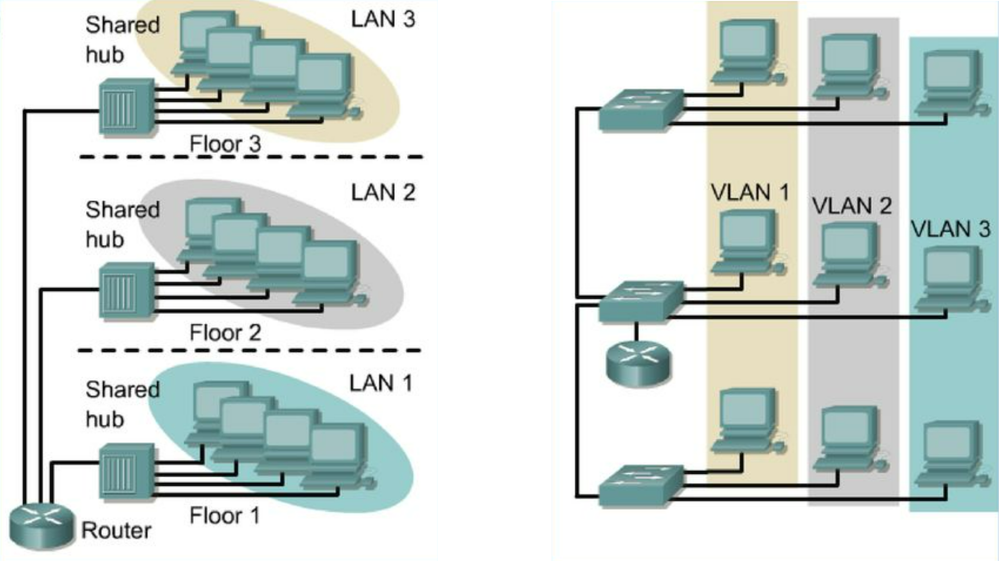

>[Torna a reti ethernet](archeth.md)

- [Dettaglio architettura Zigbee](archzigbee.md)
- [Dettaglio architettura BLE](archble.md)
- [Dettaglio architettura WiFi infrastruttura](archwifi.md)
- [Dettaglio architettura WiFi mesh](archmesh.md) 
- [Dettaglio architettura LoraWAN](lorawanclasses.md) 

## **Albero degli apparati attivi**

### **Albero degli apparati attivi e armadi**

Gli apparati attivi non fanno tecnicamente parte della definizione delle norme del cablaggio strutturato perché quella riguarda solo i componenti passivi (non alimentati) dello stesso.
In ogni caso, i dispositivi attivi sono progettati per essere interfacciati con gli elementi del cablaggio strutturato e in più i loro fattori di forma (combinazioni delle loro tre dimensioni) sono fatti per essere alloggiati nel rack di un armadio:
- La loro altezza è pari o multipla di una unità
- La loro larghezza sugli ancoraggi è esattamente di 19’’
- La loro profondità varia generalmente da 45 a 100 cm
- Persino i normali PC tower hanno una larghezza standard di 3 unità.

Normalmente (ma potrebbero esserci eccezioni) un armadio contiene uno o più SW così distribuiti:
- Uno o più CS (core switch) dentro un CD
- Uno o più DS (distribution switch) dentro un BD
- Uno o più AS (access switch) dentro un FD

Gli AS sono diventati i concentratori dei dispositivi client fissi per cui posseggono un numero elevato di porte (24 - 72).

I DS di base destinati a commutare dorsali e potrebbero essere realizzati:
- Con gli stessi SW in uso negli AS e in questo caso sono dei DS/AS
- Con SW dedicati solo alle dorsali con meno porte ma più prestanti (ad es. da 10Gbps), realizzate in RJ45 oppure in SFP

I CS sono i concentratori dei dispositivi server (sistema e business) e delle dorsali principali di campus e potrebbero essere realizzati:
- Con gli stessi SW in uso negli AS e in questo caso sono dei CD/AS
- Con gli stessi SW in uso nei DS e in questo caso sono dei CD/DS
- Con SW speciali dedicati solo alle dorsali con meno porte ma più prestanti (ad es. da 10Gbps), realizzate in RJ45 oppure in SFP. Spesso hanno anche funzioni di routing (SW L3) e assommano molti servizi di sistema ad uso di tutti i dispositivi della rete (DHCP, DNS).

### **Configurazioni switch tipiche**

- Il cablaggio orizzontale è in genere a 1Gbps
- Il cablaggio verticale di edificio è almeno a 10Gbps in fibra (MMF o SMF) o a 10Gbps in rame (UTP cat 6A o UTP cat 7A) 
- Il cablaggio verticale di campus è almeno a 10Gbps in fibra (MMF o SMF)

Switch di core CS:
- 12P 10Gbps + 4P SFP+ 
- 12P 10Gbps + 12P SFP+ 
- 24P 1Gbps + 4P SFP+ 
- 24P 1Gbps + 2P 10Gbps + 2P SFP+ 

Switch di distribuzione DS:
- 12P 10Gbps + 2P SFP+ 
- 12P 10Gbps + 12P SFP+ 
- 24P 1Gbps + 2P SFP+ 
- 24P 1Gbps + 2P 10Gbps + 2P SFP+ 

- Switch di accesso AS:
- 24P 1Gbps + 2P SFP 
- 24P 1Gbps + 2P 10Gbps + 2P SFP+ 

### **Albero degli apparati attivi e subnetting**

Per realizzarlo è opportuno eseguire un subnetting della rete tenendo conto:
- Che ogni link fisico o virtuale di un router genera una subnet
- Che gruppi di indirizzi come le subnet dovrebbero essere allocati a funzioni aziendali che tendenzialmente utilizzano, per la maggior parte del tempo, risorse a loro dedicate.

La realizzazione di un inter VLAN routing obbliga a far corrispondere (mappare) ogni VLAN ad una dorsale verso il router (virtuale o fisica) e quindi ad una corrispondente subnet.

Un **subnetting** definisce **sei proprietà** di una **subnet**:
- **VLAN ID** della vlan x (se previste le VLAN)
- **ISx**: indirizzo base della subnet x
- **SMx**: subnet mask della subnet x. E’ collegato a NSx (numero di indirizzi della sub. X)
- **BCx**: indirizzo di broadcast della subnet x
- **GWx**: indirizzo di gateway della subnet 
- **RNGx**: intervallo tra il primo indirizzo e l’ultimo indirizzo assegnabile ai client della subnet x

### **Indirizzi IP di client e server**

L’albero degli apparati attivi contiene dispositivi alimentati e dotati di indirizzo IP, indicati genericamente come host, sono:
- PC client fissi o portatili
- Server di vario tipo per funzioni di sistema o di business
- NAS (network Attached Storage) assimilabile ad un server di file condivisi tramite il protocollo NFS (Network File System) oppure tramite Samba (SMB).
- Telefoni IP
- Telefoni personali collegati alla rete wifi
- Tablet
- Videocamere IP
- Dispositivi IoT per sensoristica o telerilevamento

Normalmente i dispositivi client ottengono automaticamente l’indirizzo IP tramite il servizio DHCP. Al limite, gli indirizzi dei dispositivi fissi possono essere assegnati staticamente per ragioni di troubleshooting.

I dispositivi server posseggono indirizzi statici per poter essere associati più facilmente all’url di dominio presso cui i client possono connettersi per raggiungere i servizi che essi pubblicano. I loro indirizzi vanno sempre segnati sull’albero.

## **Divisione in gruppi di utenti o servizi**

### **Link che generano subnet**

- Il centro stella è sempre un router da cui si dirama una subnet a partire da ogni suo link fisico
- La possibilità di realizzare subnet mappate su LAN (stub o transit) può essere estesa anche alle VLAN
- La novità è che adesso da un router si può diramare una subnet anche a partire da un link virtuale
- Poiché più link virtuali possono condividere uno stesso collegamento fisico, esiste la possibilità di dislocare le subnet a «macchia di leopardo», cioè in modo che i loro dispositivi siano sparsi potenzialmente ovunque all’interno dell’infrastruttura fisica della rete (cade il vincolo di vicinanza fisica dei dispositivi di una subnet).

### **Modalità di segmentazione**

La **segmentazione** di una rete LAN parte sempre da un **router** che, essendo un **dispositivo L3**, è in grado di **bloccare** le trame MAC provenienti da dispositivi di livello inferiore come gli SW e i Bridge ad L2 oppure gli Hub ad L1.

Un router **reimbusta** le trame MAC su nuovi pacchetti IP ogni volta che effettua un **inoltro** su una porta di uscita. L'operazione di **inoltro** è **vincolata** ad alcune limitazioni che possono essere utili per la sicurezza:
- la **presenza di una rotta** nella routing table del router per l'indirizzo di destinazione del pacchetto. In **caso contrario**, il pacchetto viene **scartato**.
- la **presenza di una o più ACL** (Access Control List) che filtrino l'accesso da e verso alcune porte in base ad alcuni **criteri**. Ad ogni **porta** corrisponde un **link** e ad ogni link corrisponde univocamente una **subnet**. Le **ACL** sono pertanto **liste di regole** che permettono o bloccano il **passaggio** di un pacchetto IP da una **subnet ad un'altra**. Poichè le subnet tipicamente raggruppano utenti, si può dedurre che, le ACL basate sugli indirizzi IP, sono un metodo efficace per **limitare**, **permettere** o **bloccare** del tutto il traffico tra gruppi di utenti.
- 

- Una **VLAN** è una infrastruttura LAN speciale in grado di dividere una stessa LAN fisica in gruppi di host **separati logicamente** ma non fisicamente 
- Le LAN tradizionali, per dividere gli utenti in gruppi, devono utilizzare **LAN fisiche differenti**, cioè disposte in **luoghi diversi**
- Raggruppare logicamente significa scegliere un criterio di raggruppamento. Nelle LAN normali il **criterio di raggruppamento** è la **vicinanza fisica** degli host.
- Le VLAN invece organizzano i raggruppamenti solo in base alla **funzione** o al tipo di **servizio** (e non in base alla posizione nello spazio):
     - persone dello stesso dipartimento che sono dislocate su più sedi fisicamente separate (collegare logicamente host fisicamente separati)
     - Persone nello stesso luogo che devono essere selezionate per confluire in dipartimenti separati (separare logicamente host fisicamente collegati)

Per il dettaglio sulla segmentazione della rete per gruppi di utenti vedi [Segmentazione rete](segmentazgruppi.md). 

>[Torna a reti ethernet](archeth.md)

- [Dettaglio architettura Zigbee](archzigbee.md)
- [Dettaglio architettura BLE](archble.md)
- [Dettaglio architettura WiFi infrastruttura](archwifi.md)
- [Dettaglio architettura WiFi mesh](archmesh.md) 
- [Dettaglio architettura LoraWAN](lorawanclasses.md) 
