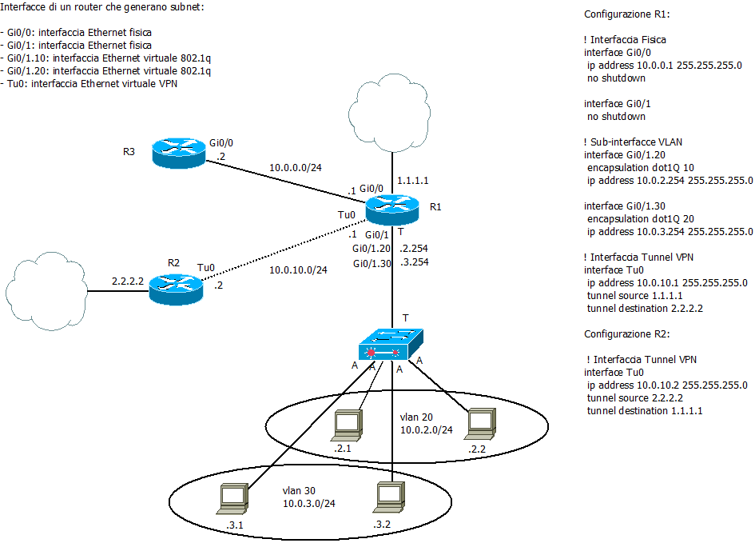
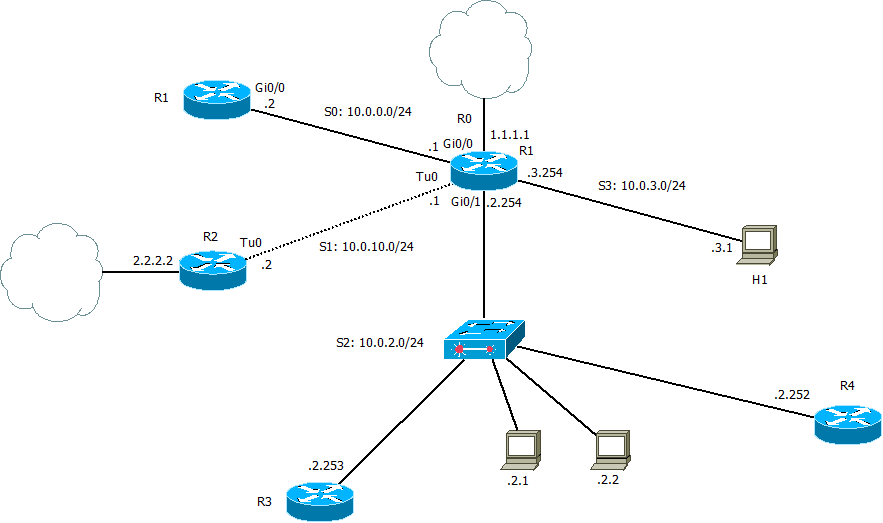
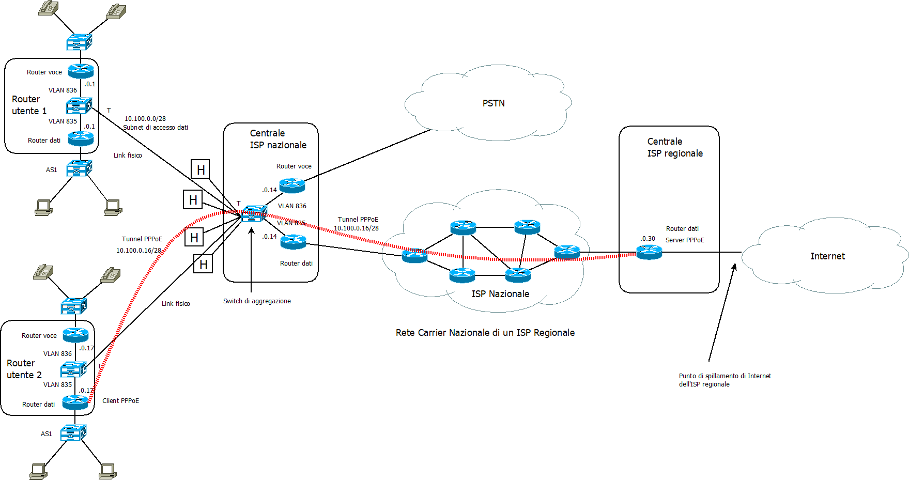
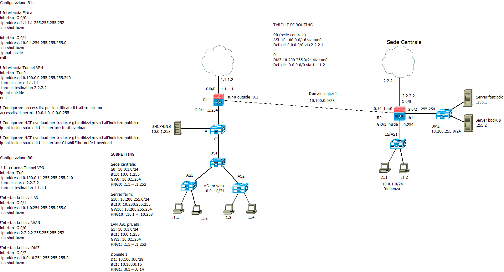
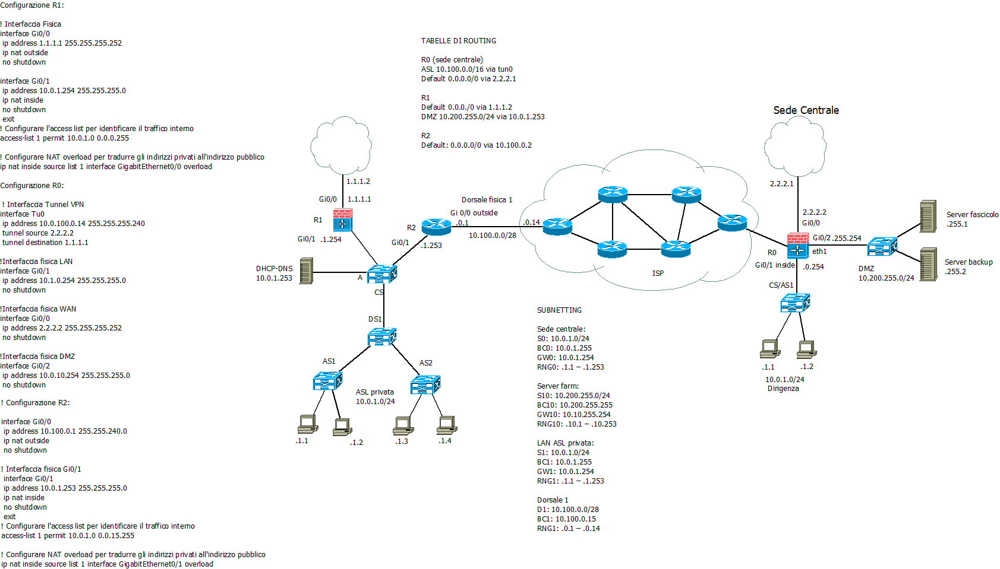

>[Torna a reti ethernet](archeth.md#documentazione)

- [Dettaglio architettura Zigbee](archzigbee.md)
- [Dettaglio architettura BLE](archble.md)
- [Dettaglio architettura WiFi infrastruttura](archwifi.md)
- [Dettaglio architettura WiFi mesh](archmesh.md) 
- [Dettaglio architettura LoraWAN](lorawanclasses.md) 


# **Le reti ai capi del router perimetrale**

Le reti di nostro interesse principale per la **progettazione** sono le reti che stanno ai due capi del router perimetrale di una LAN:
- la **rete locale** di ufficio o di campus detta LAN (Local Area Network), è realizata tipicamente con degli **switch** e ha, di base, un'**architettura ad albero** 
- la rete di un **fornitore di servizi** di connessione o **ISP** (Internet Service Provider), è realizata tipicamente con dei **router** e ha, di base, un'**architettura a maglia**


Per entrambe le tipologie di rete, è possibile isolare delle aree con funzioni simili:Normalmente il modem è in realtà
- un'**area di core** realizzata dai dispositivi di smistamento (switch o router) e dai link **più veloci** e su cui si attestano i **servizi** (server farm) che vengono distribuiti dalla rete.
- un numero limitato di **aree di distribuzione** realizzate da dispositivi di smistamento (switch o router) e da link **mediamente veloci** che si occupano di smistare i pacchetti tra le aree di accesso e di realizzare la connettività di queste con i servizi. Questi dispositivi sono caratterizzati da avere un numero limitato di porte perchè tipicamente realizzano le **dorsali** verso le aree di accesso.
- un numero elevato di **aree di accesso** realizzate da dispositivi di smistamento (switch o router) e dai link **meno veloci** che si occupano di smistare i pacchetti tra gli host attestati su una stessa area e di realizzare la connettività di questi con l'area di distribuzione più vicina. Nelle aree di accesso ci stanno i **dispositivi di aggregazione**, access switch (**AS**) nel caso delle LAN, **router di aggregazione** nel caso delle MAN ISP. Questi dispositivi sono caratterizzati dal fatto di avere un **numero elevato di porte** perchè realizzano i link fisici (talvolta logici) verso l'utente. 

Sono possibili, soprattutto nel caso delle LAN delle **ibridazioni**, nel senso che un DS (Distribution Switch) potrebbe pure avere il ruolo di AS (Access Switch) e quindi presentare un numero elevato di porte. Lo stesso vale per il CS (Core Switch). Nel caso delle reti magliate, invece, la gerarchia viene sostanzialmente rispettata.

In **entrambi gli scenari** di rete, va stabilita qualità e numero dei dispositivi, **caratteristiche** peculiari di ciascuno quali i **protocolli** che devono sostenere, il **numero di porte**, le **funzioni** (autenticazione, DHCP, DNS, ecc.) e i **processi** di filtraggio/traduzione (NAT, firewall) devono realizzare. Per i dispositivi IP va anche realizzato il **piano di indirizzamento** di tutti e vanno **assegnati gli indirizzi** a tutti gli **IS** (Intermediate Systems) di livello 3 o superiore, ad **alcuni client** significativi (criterio del range), e a tutti i **server**. 

Possono essere pure affrontate a livello architetturale tematiche relative alla **separazione in gruppi** degli utenti, per questo vedi [Segmentazione rete](segmentazgruppi.md).

## **Albero degli apparati attivi LAN**

### **Albero degli apparati attivi e armadi**

Per esempi di **topologie di apparati attivi** e per il **dettaglio sulla segmentazione** della rete per gruppi di utenti vedi [Segmentazione rete](segmentazgruppi.md). 

Gli apparati attivi non fanno tecnicamente parte della definizione delle norme del cablaggio strutturato perché quella riguarda solo i componenti passivi (non alimentati) dello stesso.
In ogni caso, i dispositivi attivi sono progettati per essere interfacciati con gli elementi del cablaggio strutturato e in più i loro fattori di forma (combinazioni delle loro tre dimensioni) sono fatti per essere alloggiati nel rack di un armadio:
- La loro altezza è pari o multipla di una unità
- La loro larghezza sugli ancoraggi è esattamente di 19’’
- La loro profondità varia generalmente da 45 a 100 cm
- Persino i normali PC tower hanno una larghezza standard di 3 unità.

Normalmente (ma potrebbero esserci eccezioni) un armadio contiene uno o più SW così distribuiti:
- Uno o più CS (core switch) dentro un CD
- Uno o più DS (distribution switch) dentro un BD
- Uno o più AS (access switch) dentro un FD

Gli AS sono diventati i concentratori dei dispositivi client fissi per cui posseggono un numero elevato di porte (24 - 72).

I DS di base destinati a commutare dorsali e potrebbero essere realizzati:
- Con gli stessi SW in uso negli AS e in questo caso sono dei DS/AS
- Con SW dedicati solo alle dorsali con meno porte ma più prestanti (ad es. da 10Gbps), realizzate in RJ45 oppure in SFP

I CS sono i concentratori dei dispositivi server (sistema e business) e delle dorsali principali di campus e potrebbero essere realizzati:
- Con gli stessi SW in uso negli AS e in questo caso sono dei CD/AS
- Con gli stessi SW in uso nei DS e in questo caso sono dei CD/DS
- Con SW speciali dedicati solo alle dorsali con meno porte ma più prestanti (ad es. da 10Gbps), realizzate in RJ45 oppure in SFP. Spesso hanno anche funzioni di routing (SW L3) e assommano molti servizi di sistema ad uso di tutti i dispositivi della rete (DHCP, DNS).

## **Configurazioni switch tipiche**

- Il cablaggio orizzontale è in genere a 1Gbps
- Il cablaggio verticale di edificio è almeno a 10Gbps in fibra (MMF o SMF) o a 10Gbps in rame (UTP cat 6A o UTP cat 7A) 
- Il cablaggio verticale di campus è almeno a 10Gbps in fibra (MMF o SMF)

Switch di core CS:
- 12P 10Gbps + 4P SFP+ 
- 12P 10Gbps + 12P SFP+ 
- 24P 1Gbps + 4P SFP+ 
- 24P 1Gbps + 2P 10Gbps + 2P SFP+ 

Switch di distribuzione DS:
- 12P 10Gbps + 2P SFP+ 
- 12P 10Gbps + 12P SFP+ 
- 24P 1Gbps + 2P SFP+ 
- 24P 1Gbps + 2P 10Gbps + 2P SFP+ 

- Switch di accesso AS:
- 24P 1Gbps + 2P SFP 
- 24P 1Gbps + 2P 10Gbps + 2P SFP+ 

## **Tabella delle subnet**

Per realizzarla è opportuno eseguire un **subnetting** della rete tenendo conto:
- Che ogni **link** (fisico o virtuale) di un router **genera** una **subnet**
- Che **gruppi di indirizzi** come le subnet potrebbero essere **allocati**:
    - a **funzioni aziendali** differenti che tendenzialmente utilizzano risorse private a loro dedicate e che non dovrebbero essere esposte in altre subnet. In questo caso, l'**isolamento** delle subnet è un **requisito** e può essere soddisfatta agendo sulle **tabelle di routing** e sulle **ACL** del router che genera le subnet.
    - a **gruppi di macchine** dislocate nello **stesso ambiente** delle quali gli **indirizzi** sono allocati in base ad un **ordine prestabilito** che ne permetta un **troubleshooting efficace**. Una prassi molto comune è quella di far coincidere il **prefisso di host** dell'indirizzo con il **numero della porta** ethernet a muro, numero che normalmente coincide anche con il numero assegnato alla **posizione** delle macchine nel locale che le ospita. In questo caso, l'**isolamento** delle subnet potrebbe non essere un **requisito**, per cui il subnetting rimane più che altro come una maniera di **organizzare gli indirizzi** di macchine **fisicamente vicine** che è complementare al **cablaggio strutturato** per la realizzazione di un **troubleshooting efficace**.
 
Gli **attributi minimi** di una **subnet** sono:
- **VLAN ID** della vlan x (opzionale, se previste le VLAN)
- **ISx**: indirizzo base della subnet x
- **SMx**: subnet mask della subnet x. E’ collegato a NSx (numero di indirizzi della sub. X)
- **BCx**: indirizzo di broadcast della subnet x
- **GWx**: indirizzo di gateway della subnet 
- **RNGx**: intervallo tra il primo indirizzo e l’ultimo indirizzo assegnabile ai client della subnet x


## **Indirizzi IP di client e server**

L’albero degli apparati attivi contiene dispositivi alimentati e dotati di indirizzo IP, indicati genericamente come host, sono:
- PC client fissi o portatili
- Server di vario tipo per funzioni di sistema o di business
- NAS (network Attached Storage) assimilabile ad un server di file condivisi tramite il protocollo NFS (Network File System) oppure tramite Samba (SMB).
- Telefoni IP
- Telefoni personali collegati alla rete wifi
- Tablet
- Videocamere IP
- Dispositivi IoT per sensoristica o telerilevamento

Gli **attributi minimi** di una **interfaccia IP** sono:
- **VLAN ID** della vlan x (opzionale, se l'interfaccia fisica è di Trunk)
- **ISx**: indirizzo base della subnet x
- **SMx**: subnet mask della subnet x.
- **GWx**: indirizzo di gateway della subnet. E' l'indirizzo che possiede il **router** di confine sul **link** verso la subnet che ospita l'host.

Normalmente i dispositivi client ottengono automaticamente l’indirizzo IP tramite il servizio DHCP. Al limite, gli indirizzi dei dispositivi fissi possono essere assegnati staticamente per ragioni di troubleshooting.

I dispositivi server posseggono indirizzi statici per poter essere associati più facilmente all’url di dominio presso cui i client possono connettersi per raggiungere i servizi che essi pubblicano. I loro indirizzi vanno sempre segnati sull’albero.

## **Indirizzi IP dei router**

### **Convenzioni di nominazione delle interfacce Cisco**

Convenzioni di nominazione delle interfacce **estese**
- **Ethernet**: Ethernet0, Ethernet1, ecc.
- **Fast Ethernet**: FastEthernet0/0, FastEthernet0/1, ecc.
- **Gigabit Ethernet**: GigabitEthernet0/0, GigabitEthernet0/1, ecc.
- **Serial**: Serial0/0, Serial0/1, ecc.
- **Tunnel**: Tunnel0, Tunnel1, ecc.

Convenzioni di nominazione delle Interfacce **abbreviate**
- **Ethernet**: Eth0, Eth1, ecc.
- **Fast Ethernet**: Fa0/0, Fa0/1, ecc.
- **Gigabit Ethernet**: Gi0/0, Gi0/1, ecc.
- **Serial**: Se0/0, Se0/1, ecc.
- **Tunnel**: Tu0, Tu1, ecc.

### **Tipi di interfacce che generano subnet**

Le **subnet IPv4** sono **contenitori di indirizzi IP** derivati da contenitori di indirizzi IP più grandi, partendo dal **partizionamento** della **parte di host** dell'indirizzo. Ogni **prefisso** di subnet può essere poi associato a un **gruppo** di host diverso.

I **router** sono i dispositivi che **allocano fisicamente nello spazio** le subnet permettendo di raggiungere i **gruppi di host** ad esse associati. Le **interfacce** di un **router** che possono **generare subnet** sono tutte quelle L3 o superiori, sia fisiche che virtuali e tipicamente sono:
- interfacce **fisiche IP** che generano subnet di host **fisicamente vicini**
- interfacce **virtuali IP** di tipo 802.1q (trunk T) che generano subnet di host **fisicamente sparsi** (VLAN)
- interfacce **virtuali IP** di tipo tunnel che generano subnet di **dorsali VPN** punto-punto

Di seguito è riportato un esempio che le **riassume** tutte:
 - .
  

Per dettagli sulla creazione e impostazione di tunnel e vpn vedi [tunnel e vpn](ethvpn.md)

## **Divisione in gruppi di utenti o servizi**

### **Link che generano subnet**

- Il centro stella è sempre un router da cui si dirama una subnet a partire da ogni suo link fisico
- La possibilità di realizzare subnet mappate su LAN (stub o transit) può essere estesa anche alle VLAN
- La novità è che adesso da un router si può diramare una subnet anche a partire da un link virtuale
- Poiché più link virtuali possono condividere uno stesso collegamento fisico, esiste la possibilità di dislocare le subnet a «macchia di leopardo», cioè in modo che i loro dispositivi siano sparsi potenzialmente ovunque all’interno dell’infrastruttura fisica della rete (cade il vincolo di vicinanza fisica dei dispositivi di una subnet).


### **Modalità di segmentazione**

La **segmentazione** di una rete LAN parte sempre da un **router** che, essendo un **dispositivo L3**, è in grado di **bloccare** le trame MAC provenienti da dispositivi di livello inferiore come gli SW e i Bridge ad L2 oppure gli Hub ad L1.

Un router **reimbusta** le trame MAC su nuovi pacchetti IP ogni volta che effettua un **inoltro** su una porta di uscita. L'operazione di **inoltro** è **vincolata** ad alcune limitazioni che possono essere utili per la sicurezza:
- l'**assenza di una rotta** verso la zona proibita nella routing table del router. Se l'indirizzo di destinazione del pacchetto non trova una corrispondenza (matching), il pacchetto viene **scartato**.
- la **presenza di una o più ACL** (Access Control List) che filtrino l'accesso da e verso alcune porte in base ad alcuni **criteri**. Ad ogni **porta** corrisponde un **link** e ad ogni link corrisponde univocamente una **subnet**. Le **ACL** sono pertanto **liste di regole** che permettono o bloccano il **passaggio** di un pacchetto IP da una **subnet ad un'altra**. Poichè le subnet tipicamente raggruppano utenti, si può dedurre che, le ACL basate sugli indirizzi IP, sono un metodo efficace per **limitare**, **permettere** o **bloccare** del tutto il traffico tra gruppi di utenti.
- 


- Una **VLAN** è una infrastruttura LAN speciale in grado di dividere una stessa LAN fisica in gruppi di host **separati logicamente** ma non fisicamente 
- Le LAN tradizionali, per dividere gli utenti in gruppi, devono utilizzare **LAN fisiche differenti**, cioè disposte in **luoghi diversi**
- Raggruppare logicamente significa scegliere un criterio di raggruppamento. Nelle LAN normali il **criterio di raggruppamento** è la **vicinanza fisica** degli host.
- Le VLAN invece organizzano i raggruppamenti solo in base alla **funzione** o al tipo di **servizio** (e non in base alla posizione nello spazio):
     - persone dello stesso dipartimento che sono dislocate su più sedi fisicamente separate (collegare logicamente host fisicamente separati)
     - Persone nello stesso luogo che devono essere selezionate per confluire in dipartimenti separati (separare logicamente host fisicamente collegati)


## **Subnetting**

E’ il **processo** di suddividere (partizionare) gli indirizzi allocabili della subnet di partenza in più gruppi di indirizzi aventi a comune un prefisso dell’indirizzo IP.

Un indirizzo IPv4 si divide in una parte di network (immutabile) ed in una parte di host (partizionabile) che contiene tutti gli indirizzi degli host della subnet di partenza.
Gli **indirizzi allocabili** di una subnet sono contenuti nella sua **parte di host**. Le subnet hanno un **prefisso** che è legato alla **posizione fisica** della subnet nello spazio, cioè raggruppa host con la caratteristica di essere vicini nello spazio (contiguità fisica).

In definitiva esistono:
- Un prima del subnetting: parte di network + parte di host
- Un dopo il subnetting: parte di network + parte di subnet + parte di host


Il processo si può iterare ulteriormente partizionando ancora la residua parte di host

### **Metodologie di calcolo**

Esistono essenzialmente **due metodologie** di calcolo del subnetting in base a quale sia il **criterio di allocazione** adottato:
- criterio di **allocazione in base agli host**. Si **inizia** il calcolo cercando di allocare prima gli indirizzi per gli **host**, una volta soddisfatta questa esigenza, si **verifica**, a posteriori, se il numero di bit della parte di subnet è sufficiente ad allocare il numero pianificato per **la rete**.
- criterio di **allocazione in base alle subnet**. Si **inizia** il calcolo cercando di allocare prima gli indirizzi per le **subnet**, una volta soddisfatta questa esigenza, si **verifica**, a posteriori, se il numero di bit della parte di host è sufficiente ad allocare il numero pianificato per **ciascuna subnet**.

### **Classificazione del subnetting**

Fondamentalmente sono possibili alcune **tipologie di subnetting**:
- **FLSM (Fixed Length Subnet Mask)**. Prevede subnet tutte di uguale dimensione che in virtù di questa proprietà posseggono quella di avere tutte la stessa subnet mask. Si possono ulteriormente classificare in base alla posizione del taglio tra parte di subnet e parte di host:
    - **FLSM Classful**. Prevede che il taglio sia posizionato in corrispondenza di uno degli ottetti, cioè, la parte di host comincia in corrispondenza dell’inizio di un ottetto. Tre possibili tagli: /8, /16, /24 che determinano subnet di dimensioni fisse pari rispettivamente a 16.777.216 indirizzi, 65536 indirizzi, 256 indirizzi. E’ il subnetting più semplice in assoluto
    - **FLSM Classless**. Prevede ancora subnet tutte di uguale dimensione ma senza vincoli sul taglio che adesso può essere posizionato ovunque, cioè, la parte di host può cominciare in un punto qualsiasi nel mezzo di un ottetto. Ha una complessità intermedia tra subnetting FLSM classful e VLSM.
- **VLSM (Variable Length Subnet Mask)**. Prevede la presenza di subnet di dimensione diversa e in virtù di ciò ne consegue che possono possedere subnet mask differenti tra loro. E’ il subnetting in assoluto più complesso.

### **Subnetting classful veloce**

Processo rapido per stabilire le subnet in base al **numero di host**:
- decidere **quanti** indirizzi servono:
    - **pochi**: scegliere taglio classful /24 (per semplicità usare ```10.0.X.0/24``` dove ```X``` è il **prefisso** della subnet)
    - **molti**: scegliere taglio classful /16 (per semplicità usare ```10.X.0.0/16``` dove ```X``` è il **prefisso** della subnet)
- identificare le **subnet**:
    - sono **tante** quanti sono i **link** dei vari router
    - ogni **link diretto** a comune tra **due router** si conta **una sola volta**
    - tutti i **link** che creano un **percorso indiretto** tra **più router** con in mezzo uno o più **switch** di transito, si contano **una sola volta** (lo switch mette a comune i link)
- per le **subnet** che contengono **host** calcolare:
    - **VLAN ID** della vlan x (se previste le VLAN)
    - **ISx**: indirizzo base della subnet x
    - **SMx**: subnet mask della subnet x. E’ collegato a NSx (numero di indirizzi della sub. X), in niotazione decimale o in notazione CIDR dopo ISx
    - **BCx**: indirizzo di broadcast della subnet x
    - **GWx**: indirizzo di gateway della subnet 
    - **RNGx**: intervallo tra il primo indirizzo e l’ultimo indirizzo assegnabile ai client della subnet x
    - **DHCPx**: intervallo tra il primo indirizzo e l’ultimo indirizzo assegnabile ai client della subnet x mediante protocollo DHCP
- per le **dorsali** (contengono solo router) calcolare:
    - **VLAN ID** della vlan x (se previste le VLAN)
    - **ISx**: indirizzo base della subnet x
    - **SMx**: subnet mask della subnet x. E’ collegato a NSx (numero di indirizzi della sub. X), in niotazione decimale o in notazione CIDR dopo ISx
    - **BCx**: indirizzo di broadcast della subnet x
    - **Ra**: indirizzo del primo router del link
    - **Rb**: indirizzo del secondo router del link

#### **Esempio 1 di subnetting classful**

Dati 4 router R0, R1, R2, R3 dove R0 è un centro stella degli altri tre. Inoltre ogni router ha una interfaccia ulteriore collegata ad una LAN creata da uno switch. Immaginare subnet con **pochi host**.



##### **Subnetting classful veloce gruppi di host**
<table>
<tr><td></td><td> Ind. subnet </td><td> Broadcast </td><td> Ind. gateway </td><td> Range host </td><td> Range dhcp </td></tr>
<tr>
<td> 
  S0
</td>
<td>
 10.0.0.0/24    
</td>
<td>
10.0.0.255/24
</td>
<td>
10.0.0.254/24
</td>
<td> 
.0.1 - .0.253
</td>
<td> 
.0.100 - .0.253
</td>
</tr>
     
<tr>
<td> 
  S1
</td>
<td>
 10.0.1.0/24    
</td>
<td>
10.0.1.255/24
</td>
<td>
10.0.1.254/24
</td>
<td> 
.1.1 - .1.253
</td>
<td> 
.1.100 - .1.253
</td>
</tr>

<tr>
<td> 
  S2
</td>
<td>
 10.0.2.0/24    
</td>
<td>
10.0.2.255/24
</td>
<td>
10.0.2.254/24
</td>
<td> 
.2.1 - .2.253
</td>
<td> 
.2.100 - .2.253
</td>
</tr>

<tr>
<td> 
  S3
</td>
<td>
 10.0.3.0/24    
</td>
<td>
10.0.3.255/24
</td>
<td>
10.0.3.254/24
</td>
<td> 
.3.1 - .3.253
</td>
<td> 
.3.100 - .3.253
</td>
</tr>
</table>

##### **Subnetting classful veloce dorsali**

```C++     
D1: 10.0.10.0/24
BC1:10.0.10.255
R0: 10.0.10.1
R1: 10.0.10.2

D2: 10.0.20.0/24
BC1:10.0.20.255
R0: 10.0.20.1
R2: 10.0.20.2

D3: 10.0.30.0/24
BC1:10.0.30.255
R0: 10.0.30.1
R3: 10.0.30.2
```

#### **Esempio 2 di subnetting classful**

Dati 4 router R0, R1, R2, R3 dove R0 è un centro stella degli altri tre. Inoltre ogni router ha una interfaccia ulteriore collegata ad una LAN creata da uno switch. Immaginare subnet con **molti host**.

##### **Subnetting classful veloce gruppi di host**
<table>
<tr><td></td><td> Ind. subnet </td><td> Broadcast </td><td> Ind. gateway </td><td> Range host </td><td> Range dhcp </td></tr>
<tr>
<td> 
  S0
</td>
<td>
 10.0.0.0/16    
</td>
<td>
10.0.255.255/24
</td>
<td>
10.0.255.254/24
</td>
<td> 
.0.0.1 - .0.255.253
</td>
<td> 
.0.0.100 - .0.255.253
</td>
</tr>
     
<tr>
<td> 
  S1
</td>
<td>
 10.1.0.0/16    
</td>
<td>
10.1.255.255/24
</td>
<td>
10.1.255.254/24
</td>
<td> 
.1.0.1 - .1.255.253
</td>
<td> 
.1.0.100 - .1.255.253
</td>
</tr>

<tr>
<td> 
  S2
</td>
<td>
 10.2.0.0/16    
</td>
<td>
10.2.255.255/24
</td>
<td>
10.2.255.254/24
</td>
<td> 
.2.0.1 - .2.255.253
</td>
<td> 
.2.0.100 - .2.255.253
</td>
</tr>

<tr>
<td> 
  S3
</td>
<td>
 10.3.0.0/16    
</td>
<td>
10.3.255.255/24
</td>
<td>
10.3.255.254/24
</td>
<td> 
.3.0.1 - .3.255.253
</td>
<td> 
.3.0.100 - .3.255.253
</td>
</tr>
</table>

##### **Subnetting classful veloce dorsali**

```C++     
D1: 10.10.0.0/24
BC1:10.10.0.255
R0: 10.10.0.1
R1: 10.10.0.2

D2: 10.20.0.0/24
BC1:10.20.0.255
R0: 10.20.0.1
R2: 10.20.0.2

D3: 10.30.0.0/24
BC1:10.30.0.255
R0: 10.30.0.1
R3: 10.30.0.2
```

Se si desidera, è possibile allocare solo per le subnet di dorsale un subnetting /24 analogo all'esempio precedente per sprecare meno indirizzi. In ogni caso posso coesistere sullo stesso router subnet con classi di indirizzo e tagli di parte di subnet differenti.

Per esempi di **topologie di apparati attivi** e per il **dettaglio sulla segmentazione** della rete per gruppi di utenti vedi [Segmentazione rete](segmentazgruppi.md). 

## **Rete regionale fascicolo sanitario**

Si vuole realizzare un ISP che connetta tra loro aziende sanitarie pubbliche e private per consentire loro di accedere al fascicolo sanitario personale dei cittadini di una regione italiana. 

Le aziende sanitarie pubbliche sono clienti di due servizi: l'accesso al fascicolo e l'accesso ad Internet.

Le aziende sanitarie private sono clienti di un solo servizio: l'accesso al fascicolo. Per ottenere l'accesso ad Internet devono rivolgersi ad un altro provider.

Gli indirizzi per connettersi alla infrastruttura di distribuzione, cioè quelli da utilizzare per accedere al router più vicino dell'infrastruttura, sono privati nel range 10.0.0.0/8. 
Una sottorete del range di partenza, la 10.100.0.0/16 è assegnata alla infrastrutture private. Dimensionare le subnete per consentire l'accesso ad almeno 2000 sedi sanitarie private, lasciando dei margini adeguati per eventuali espansioni future.

### **Metodologia di subnetting**

Il **processo** di calcolo più adeguato in questa situazione è quello che stabilisce per gli indirizzi un criterio di **allocazione in base alle subnet**.

Per contare 2000 subnet di accesso ai router dello ISP servono almeno 11 bit che possono contare fino a 2048 indirizzi, per incontrare l'esigenza di espansioni future aggiungiamo un ulteriore bit arrivando a 12 bit di subnet, portando la potenzialità di conteggio fino a 4096 indirizzi.

Il taglio tra la parte di subnet e quella di host dell'indirizzo si porta così a /28 (16+12), posizione che lascia appena 4 bit nella parte di host portando il numero dei corrispondenti indirizzi allocabili a 16. Sono 16 indirizzi che possono essere ripartititi così:
- 2 per indirizzo di subnet e di brosdcast
- 2 per i due router collegati da un link fisico (il router dell'azienda sanitaria e il router dello ISP)
- 12 indirizzi per allocare eventuali servizi pubblicati dalla ASL

### **Subnetting rete di aggregazione**

Il **subnetting** appena calcolato fa parte del piano di indirizzamento dell'Internet Service Provider (ISP) regionale ma non si riferisce ai collegamenti tra gli IS (intermediate systems) della sua rete ma solamente ai **collegamenti terminali** tra gli IS e i potenziali ES (End systems) dell'utente. La porzione della rete di un ISP che realizza questi collegamenti prende il nome di **rete di aggregazione**. 


In realtà, il più delle volte, al posto degli ES ci sta il **router perimetrale** di confine della rete locale (LAN) che **condivide** gli indirizzi **IPv4** assegnati dal subnetting con i **dispositivi interni** alla LAN tramite un dispositivo di **traduzione PNAT**. Per gli indirizzi **IPv6** la traduzione non è necessaria in quanto il subnetting di aggregazione, di base, fornisce almeno 16 bit per la **parte di host** dell'indirizzo, che sono normalmente sufficienti ad allocare gli indirizzi per **tutti gli host** di una LAN.

### **Subnetting azienda sanitaria privata**
Le aziende sanitarie private hanno a disposizione un solo prefisso, il prefisso 100, con estensione di 12 bit che quindi è utile a contare 4096 subnet, lasciando 4 bit per la parte di host che rimane utile a contare 16 indirizzi.

<table>
<tr><td></td><td> Ind. subnet </td><td> Broadcast </td><td> Ind. gateway </td><td> Range host </td><td> Range dhcp </td></tr>
<tr>
<td> 
  S1
</td>
<td>
10.100.0.0/28 
</td>
<td>
10.100.0.15
</td>
<td>
10.100.0.14
</td>
<td> 
.0.1 - .0.13
</td>
<td> 
.0.9 - .0.13
</td>
</tr>
     
<tr>
<td> 
  S2
</td>
<td>
10.100.0.16/28  
</td>
<td>
10.100.0.31
</td>
<td>
10.100.0.30
</td>
<td> 
.0.17 - .0.29
</td>
<td> 
.0.25 - .0.29
</td>
</tr>

<tr>
<td> 
  S3
</td>
<td>
10.100.0.32/28     
</td>
<td>
10.100.0.47
</td>
<td>
10.100.0.46
</td>
<td> 
.0.33 - .0.45
</td>
<td> 
.2.41 - .0.45
</td>
</tr>

<tr>
<td> 
  ...................
</td>
<td>
.....................     
</td>
<td>
.....................
</td>
<td>
.....................
</td>
<td> 
.....................
</td>
<td> 
.....................
</td>
</tr>

<tr>
<td> 
  S4096
</td>
<td>
10.100.255.240/28     
</td>
<td>
10.100.255.255
</td>
<td>
10.100.255.254
</td>
<td> 
.255.241 - .255.253
</td>
<td> 
.255.249 - .255.253
</td>
</tr>
</table>

### **Subnetting azienda sanitaria pubblica**
Ipotizziamo che il piano di indirizzamento per le aziende private ricalchi quello preesistente già utilizzato per gli altri enti, per cui le aziende sanitarie private hanno a disposizione un prefisso con estensione di 12 bit che quindi è utile a contare 4096 subnet, lasciando 4 bit per la parte di host che rimane utile a contare 16 indirizzi. Sono ammissibili tutti i prefissi tranne il 100 e, data la loro estensione, sono tutti spalmati su due ottetti (il secondo e parte del terzo).

<table>
<tr><td></td><td> Ind. subnet </td><td> Broadcast </td><td> Ind. gateway </td><td> Range host </td><td> Range dhcp </td></tr>
<tr>
<td> 
  S1
</td>
<td>
10.101.0.0/28 
</td>
<td>
10.101.0.15
</td>
<td>
10.101.0.14
</td>
<td> 
.0.1 - .0.13
</td>
<td> 
.0.9 - .0.13
</td>
</tr>
     
<tr>
<td> 
  S2
</td>
<td>
10.101.0.16/28  
</td>
<td>
10.101.0.31
</td>
<td>
10.101.0.30
</td>
<td> 
.0.17 - .0.29
</td>
<td> 
.0.25 - .0.29
</td>
</tr>

<tr>
<td> 
  S3
</td>
<td>
10.101.0.32/28     
</td>
<td>
10.101.0.47
</td>
<td>
10.101.0.46
</td>
<td> 
.0.33 - .0.45
</td>
<td> 
.2.41 - .0.45
</td>
</tr>

<tr>
<td> 
  ...................
</td>
<td>
.....................     
</td>
<td>
.....................
</td>
<td>
.....................
</td>
<td> 
.....................
</td>
<td> 
.....................
</td>
</tr>

<tr>
<td> 
  S4096
</td>
<td>
10.101.255.240/28     
</td>
<td>
10.101.255.255
</td>
<td>
10.101.255.254
</td>
<td> 
.255.241 - .255.253
</td>
<td> 
.255.249 - .255.253
</td>
</tr>
</table>

### **Tipi di collegamento verso un ISP**

Spesso accade che gli ISP regionali affittino l'infrastruttura di rete dei un ISP nazionale al quale possono collegare i loro router in una o più centrali. I link **interni alla rete**, cioè quelli tra i router dell'ISP regionale potrebbero essere **logici** e sono ottenuti attraverso varie tecniche didatticamente assimilabili ad un **tunnelling** (tunnel GRE, tunnel PPPoE, VPN Trusted, VPN Untrusted MPLS).

Il **link esterni** alla rete ISP regionale, cioè quelli verso il router/firewall utente che **non** sono di **transito** verso altri router dello ISP, potrebbero essere:
- **fisici** se il router/modem si collega direttamente alla rete dell'ISP regionale con un link fisico. In questo caso il router di confine della LAN si collega direttamente al router dell'ISP regionale.
- **logici** se il router/modem si collega direttamente alla rete dell'ISP regionale con un link logico normalmente realizzato con:
    - un **tunnnel L3** (tunnel PPPoE, VPN Untrusted MPLS, VPN Trusted, ecc) sul collegamento fisico. Il tunnel permette un collegamento **diretto virtuale** tra il router installato nella sede del cliente e il router dell'ISP regionale posto in centrale, ottenuto tramite una cascata di collegamenti fisici lungo i router dell'ISP nazionale.
    - un **tunnnel L2**, ottenuto generalmente mediante la tecnica delle VLAN, che collega gli switch in centrale con il modem dal cliente in cui vengono realizzati **due bridge**:
        - quello della **vlan 835** con una o più porte fisiche verso un router dedicato per i dati
        - quello della **vlan 836** con una o più porte fisiche, diverse dalle precedenti, verso un router dedicato per il voip (ad es. centralino FreePBX).

### **Architettura fisica della rete di accesso ad un ISP**

I **router dedicati**, per tipologie di traffico diverse, sono allocati su **porte di accesso** delle due VLAN ad entrambi i capi della connessione (quella locale utente e quella in centrale). Le connessioni in **fibra** avvengono tra due componenti passive:
- L'**ONT** (Optical Network Terminal) è il dispositivo (borchia ottica) che riceve il segnale ottico dalla fibra ottica e lo converte in un segnale elettrico utilizzabile dai dispositivi dell'utente finale.
- **OLT** (Optical Line Terminal) è il dispositivo di terminazione che collega la rete di accesso ottico alla rete di core del provider. Si occupa di aggregare il traffico proveniente da molte ONT e trasmetterlo verso la rete centrale dell'ISP.

Le **VLAN** sono usate per realizzare la **multiplazione TDM** (a divisione di tempo)  dei due flussi di traffico dati e voce su un'**unica connessione fisica** in fibra. Le VLAN sono configurate sui dispositivi di rete come l'OLT (Optical Line Terminal) e l'ONT, permettendo di mantenere separati i flussi di dati e voce e di applicare politiche di QoS (Quality of Service) specifiche.

In **sostanza**, grazie alla **bassa attenuazione per km** delle fibre ottiche, è possibile realizzare un lungo **canale passivo** che parte dall'**ONT utente** (dislocato nella sua sede fisica) fino ad arrivare all'**OLT in centrale**, su cui transitano trame MAC colorate (di **livello L2** della pila ISO/OSI). A valle dell'OLT, si trovano i **link** verso il **router di confine dello ISP** che **generano** le **subnet di aggregazione** su cui si attestano i **dispositivi attivi utente** (host o router/firewall perimetrale).


In **centrale**, il traffico viene splittato in traffico dati e traffico voce in base alle vlan:
- **Traffico dati**: Il **BNG** (Broadband Network Gateway) autentica gli utenti e instrada il traffico dati verso Internet. In sintesi: OLT -> Aggregation Switch -> BNG -> Internet.
- **Traffico voip**: Il **VoIP Gateway** gestisce la segnalazione e la commutazione delle chiamate VoIP lungo il percorso. Il gateway può inoltrare le chiamate verso la **rete PSTN** telefonica tradizionale verso cui esegue la **transcodifica**, cioè la trasformazione della voce da pacchetto a circuito, oppure può inoltrare i pacchetti voip verso una **rete** di distribuzione **completamente ip**, magari basata su Internet. In sintesi: OLT -> Aggregation Switch -> VoIP Gateway -> PSTN/Internet.

### **Ibridazioni**

Sono possibili ibridazioni tra le tecniche precedenti, per cui usuale vedere un tunnel PPPoE all'interno della LAN di centrale realizzata dalla VLAN 835.



Normalmente il modem è in realtà anche uno switch in cui l'unica connessione fisica, terminata in centrale presso un OLT, viene **demultiplata** in due connessioni logiche L2 che sono terminate sul dispositivo utente su due **porte Ethernet** separate, una per VLAN 835 e l'altra per la VLAN 836. All'interno di ciascuna viene realizzato il link L3 (basato su IP) verso il **router in centrale**, con due **varianti**:
- Se questo **coincide** col **link fisico** fino in centrale allora il link L3 è terminato sul **primo router** che in centrale sta a valle dell'OLT.
- se **non coincide** col **link fisico**, vuol dire che questo è stato sostituito da una connessione L2, detta **link carrier**, formata dalla **trame MAC** della rete nazionale. La rete viene percorsa attraversando **molti router**, fino ad arrivare nella centrale del gestore della **connessione payload**, dove questa viene **sbustata** da quella carrier e **terminata** su un **router**. Dello **sbustamento** in centrale si occupa un **server PPPoE**, mentre dell'**inbustamento** nella sede utente si occupa un **client PPPoE** installato sul **modem/router** fornito dal **gestore** della connessione payload.

Per dettagli sulla creazione e impostazione di un tunnel PPPoE vedi [Configurazione di una tunnel PPPoE CISCO](pppoe.md)


### **Sede sanitaria locale privata con link logico verso ISP**

In questo caso si può utilizzare lo stesso firewall perimetrale dell'utente purchè esso sia capace delle forme di tunnelling richieste dallo ISP regionale. Nello specifico si potrebbe ipotizzare un tunnel generico (GRE) o un tunnel PPPoE. Nel client PPPoE vengono inserite le credenziali di autenticazione dell'utente con le quali può esssere riconosciuto e la connessione approvata, magari attraverso un server di autenticazione quali RADIUS o DIAMETER.

In questo caso l'ISP regionale non fornisce un apparecchio ma la possibilità di utilizzare una terminazione logica del **tunnel PPPoE** sul firewall perimetrale dell'utente.



Per dettagli sulla creazione e impostazione di tunnel e vpn vedi [tunnel e vpn](ethvpn.md) 

### **Sede sanitaria locale privata con link fisico verso ISP**

In questo caso la connessione verso il router di confine dell'ISP regionale potrebbe essere sia fisica che logica (nel disegno si è **immaginata fisica**), in ogni caso, il **router perimetrale** dell'utente **non si accorge** della differenza dato che lui si limita ad inoltrare il traffico verso la subnet del fascicolo elettronico verso il router fornito dall'ISP regionale.

L'ISP regionale potrebbe usare lo stesso piano di indirizzamento dell'ISP nazionale e utilizzare appieno le capacità di routing della sua infrastruttura, oppure potrebbe utilizzare varie forme di incapsulamento (tunnelling). Una molto comune perchè garantisce la **QoS** (Quality of Service) è la tecnologia **MPLS**:
- In una configurazione L3VPN, i pacchetti vengono **incapsulati** con **etichette MPLS** all'ingresso nella rete del provider e **decapsulati** all'uscita. Questo crea un **tunnel logico** attraverso la rete MPLS (dello ISP nazionale).
- Il **tunneling MPLS** avviene instradando i pacchetti lungo **percorsi fissi** basati sulle etichette, senza dover analizzare gli indirizzi IP di destinazione detti Label Switching Path (**LSP**). Gli LSP sono **percorsi predefiniti** attraverso la rete MPLS. Ogni pacchetto che attraversa la rete MPLS viene etichettato con un'identificatore che indica il suo LSP, questo migliora l'efficienza e la velocità di instradamento.



Se non si desidera far percorrere due volte il traffico in andata e ritorno allo stesso link si potrebbe, in alternativa, collegare il router R2 direttamente ad un porta del router R1, ad esempio a quella della DMZ, direttamente o tramite uno switch di transito che aggreghi altri servizi. Il link, chiaramente, diventa un'altra subnet che deve essere allocata con indirizzi privati.

### **Sede sanitaria locale privata con tunnel + vlan**

In questo scenario si immagina che sia direttamente l'ISP regionale a fornire il router perimetrale della LAN dell'azienda sanitaria privata. Il firewall fornito dal provider potrebbe realizzare direttamente lui internamente il routing tra le subnet aziendali e la subnet di connessione al router di confine dell'ISP. Il link di questa connessione può essere, al solito, sia fisico che logico.

Le subnet sulle due vlan possono essere gestite con **autorizzazioni diverse** impostate sul router che realizza l'intervaln routing, ad esempio la subnet del fascicolo potrebbe essere autorizzata a accedere ai servizi del fascicolo sanitario mentre le altre della struttura no. Tutte possono accedere ad internet mediante la rotta di default. Le autorizzazzioni si possono impostare con delle **acl** associate ad una o più interfacce del **router firewall perimetrale**.


Per dettagli sulla creazione e impostazione di tunnel e vpn vedi [tunnel e vpn](ethvpn.md)

### **Sede sanitaria locale privata con tunnel + bridge**

In questo scenario si immagina che sia direttamente l'ISP regionale a fornire il router perimetrale della LAN dell'azienda sanitaria privata. Il firewall fornito dal provider potrebbe realizzare direttamente lui internamente il routing tra le subnet aziendali e la subnet di connessione al router di confine dell'ISP. Il link di questa connessione può essere, al solito, sia fisico che logico.

Uno scenario, insolito ma possibile, consentito da questa architettura potrebbe essere quello di fare il **bridging** tra la porta WAN e una o più  porte del router esponendo così la subnet verso il router di confine. Potrebbe essere usata per collegare questa subnet su una **VLAN separata** su cui collegare dei **server** che pubblichino qualcosa di utile per la ASL centrale oppure per collegare al fascicolo elettronico solo **pochi PC**, separati logicamente dal resto dell'infrastruttura, per **massimizzare la privacy**.


Per dettagli sulla creazione e impostazione di tunnel e vpn vedi [tunnel e vpn](ethvpn.md)

Sitografia:
- https://miro.medium.com/v2/resize:fit:1400/1*SHNEn-wqJPRxdYf2s_yapg.png
- https://community.cisco.com/t5/networking-knowledge-base/how-to-configure-a-gre-tunnel/ta-p/3131970
- https://www.fibermall.com/blog/epon-gpon-10g-epon-10g-gpon-olt-how-to-work.htm
- https://xxxamin1314.medium.com/an%C3%A1lisis-de-pon-qu%C3%A9-es-olt-onu-ont-y-odn-8e78eb25e4bb


>[Torna a reti ethernet](archeth.md#documentazione)

- [Dettaglio architettura Zigbee](archzigbee.md)
- [Dettaglio architettura BLE](archble.md)
- [Dettaglio architettura WiFi infrastruttura](archwifi.md)
- [Dettaglio architettura WiFi mesh](archmesh.md) 
- [Dettaglio architettura LoraWAN](lorawanclasses.md)


