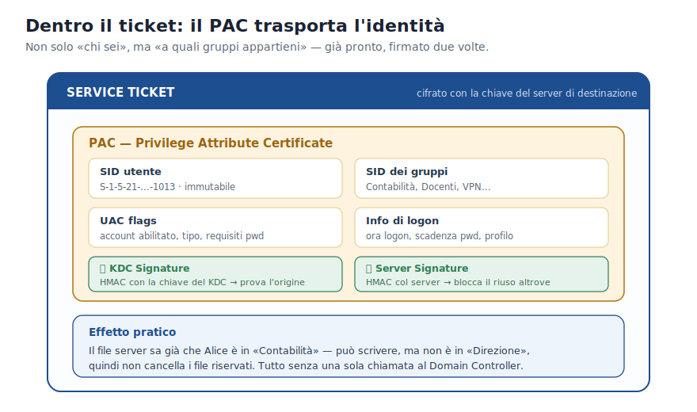
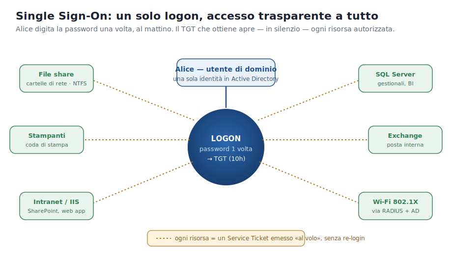
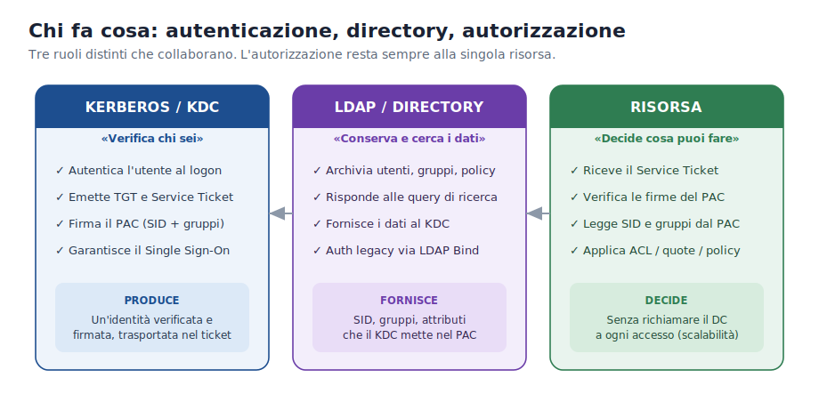

>[Torna a reti di sensori](../sensornetworkshort.md)>[Torna a reti ethernet](../archeth.md)

- [Dettaglio architettura Zigbee](../archzigbee.md)
- [Dettaglio architettura BLE](../archble.md)
- [Dettaglio architettura WiFi infrastruttura](../archwifi.md)
- [Dettaglio architettura WiFi mesh](../archmesh.md) 
- [Dettaglio architettura LoraWAN](../lorawanclasses.md) 

# Autenticazione in LAN con Active Directory e Kerberos

**Sistemi e Reti — Classe 5ª Informatica**
*Guida al ruolo di KDC, PAC, LDAP, DNS e GPO in una rete aziendale moderna.*

---

## Come è organizzata questa dispensa

Questo documento principale contiene la **spiegazione essenziale**: cosa fa ogni
componente, con analogie e linguaggio semplice. L'obiettivo è capire *“cosa
succede”*, non ancora *“come succede”* nei minimi dettagli tecnici.

Ogni argomento ha un **approfondimento** dedicato in un file separato, per chi
vuole vedere i meccanismi interni (firme crittografiche, record DNS, file di
configurazione reali, query LDAP…). I link sono raccolti qui sotto e ripetuti
alla fine di ogni capitolo.

| Approfondimento | Contenuto |
| --- | --- |
| [01 · Kerberos e il KDC](01_kerberos_kdc.md) | AS, TGS, i tre scambi, mutua autenticazione, RFC 4120 |
| [02 · Il PAC](02_pac.md) | Struttura interna, doppia firma, MS14-068, Golden Ticket |
| [03 · Wi-Fi, RADIUS e 802.1X](03_radius_wifi.md) | EAP, NPS/FreeRADIUS, VLAN dinamica, config reale Univention |
| [04 · LDAP e la directory](04_ldap.md) | LDAP vs SQL, DIT, attributi, `member`/`memberOf`, connettori |
| [05 · DNS, il sistema nervoso di AD](05_dns.md) | Record SRV, A/PTR, DNS integrato in AD |
| [06 · Le GPO](06_gpo.md) | GPC/GPT, ordine LSDOU, Computer vs Utente, SYSVOL |
| [07 · Il Single Sign-On nei prodotti Microsoft](07_sso_microsoft.md) | Cosa significa davvero l'SSO, SPN, file share, IIS, SQL, Exchange, delega |

---

## 1. Kerberos e il KDC: la filosofia di fondo

Immagina di lavorare in un grande edificio aziendale. Quando entri la mattina
mostri il badge alla reception: il receptionist verifica chi sei e ti consegna
un **pass giornaliero**. Con quel pass apri le porte delle stanze a cui hai
diritto, senza tornare ogni volta alla reception.

Kerberos funziona esattamente così in una rete informatica:

- il **receptionist** è il **KDC** (Key Distribution Center), che gira sul Domain Controller;
- il **pass giornaliero** è il **TGT** (Ticket Granting Ticket);
- i **biglietti per le singole stanze** sono i **Service Ticket**;
- le **stanze** sono le risorse di rete: cartelle, stampanti, applicazioni.

> **🔑 Concetto chiave.** La password **non viaggia mai** sulla rete. Il KDC
> verifica chi sei una volta sola e rilascia i ticket. Ogni risorsa si fida dei
> ticket perché sono firmati dal KDC.

➡️ *Approfondimento:* [come funzionano AS, TGS e i tre scambi](01_kerberos_kdc.md)

---

## 2. Il PAC: l'identità viaggia dentro il ticket

Ogni ticket non contiene solo *“chi sei”*, ma anche *“a quali gruppi
appartieni”*. Questa informazione si chiama **PAC** (Privilege Attribute
Certificate).

Grazie al PAC, quando Alice accede a una cartella di rete il file server sa già
— senza chiedere nulla al Domain Controller — che Alice è nel gruppo
*Contabilità* e può scrivere, ma non è nel gruppo *Direzione*, quindi non può
cancellare i file riservati.

> **📌 In pratica.** Kerberos **trasporta** l'identità (chi sei e a che gruppi
> appartieni). La singola risorsa **usa** quell'identità per decidere cosa ti è
> permesso fare.

➡️ *Approfondimento:* [dentro il PAC: firme, MS14-068 e Golden Ticket](02_pac.md)

---

## 3. Risorse tipiche e come vengono protette

In una LAN con Active Directory, le risorse di tutti i giorni sono protette
dallo **stesso meccanismo**: Kerberos verifica l'identità, poi ogni risorsa
decide da sola cosa l'utente può fare.

| Risorsa | Autenticazione | Autorizzazione |
| --- | --- | --- |
| Desktop (logon) | Kerberos · NTLM come fallback | Token Windows costruito dal PAC; permessi NTFS sul profilo |
| File share (cartelle di rete) | Kerberos — ST per `cifs/fileserver` | ACL NTFS: i SID del PAC confrontati coi permessi cartella |
| Quote disco | Kerberos (stesso flusso del file share) | FSRM / quote NTFS confrontano il SID utente con le soglie |
| Stampante di rete | Kerberos | Permessi coda di stampa basati sui gruppi AD del PAC |
| Intranet / IIS | Kerberos via HTTP (SPNEGO) | Gruppi AD del PAC usati dall'app web |
| SQL Server | Kerberos | Login SQL mappati a gruppi AD |
| VPN / accesso remoto | EAP-TLS o MS-CHAPv2 (Kerberos non disponibile fuori rete) | Dopo la VPN tutto torna a funzionare via Kerberos |

### 3.1 Accesso Wi-Fi aziendale tramite RADIUS e AD

Anche il Wi-Fi moderno è integrato con Active Directory: niente password
condivise su un foglio, ogni utente si connette con le **stesse credenziali del
dominio**. Il “custode” che fa da tramite tra l'access point e AD si chiama
**RADIUS**:

1. l'utente si avvicina con il dispositivo a un **Access Point (AP)**;
2. l'AP non verifica da solo le credenziali: le **inoltra** al server RADIUS;
3. il server RADIUS chiede ad AD *“Quest'utente esiste ed è autorizzato?”*;
4. se AD risponde sì, RADIUS dà l'ok all'AP e l'utente si connette.

> **📶 In pratica.** Un docente usa le stesse credenziali per entrare in Windows
> al mattino, aprire le cartelle di rete, accedere a Moodle e connettersi al
> Wi-Fi. AD è l'**unica fonte di verità** per tutte queste risorse.

RADIUS può anche assegnare automaticamente la **VLAN** giusta in base al gruppo
AD: docenti e studenti usano la stessa rete Wi-Fi ma finiscono in reti separate,
senza toccare nulla sull'access point.

➡️ *Approfondimento:* [802.1X, EAP, NPS/FreeRADIUS e la config reale dell'Istituto Marconi](03_radius_wifi.md)

---

## 4. Il ruolo di LDAP in Active Directory

Active Directory deve memorizzare da qualche parte le informazioni su utenti,
computer, gruppi e policy. Quel “database” si chiama **directory**, e il
linguaggio per interrogarla è **LDAP** (Lightweight Directory Access Protocol).

> **📖 Analogia.** Se Active Directory è l'elenco telefonico dell'azienda, LDAP
> è il modo per consultarlo: *“dammi tutti gli utenti del Marketing”* oppure
> *“dammi il numero di Alice Rossi”*.

Kerberos e LDAP hanno ruoli **diversi e complementari**:

- **Kerberos** → *autentica* (verifica chi sei) ed emette i ticket;
- **LDAP** → *cerca e legge* le informazioni nella directory.

LDAP è ottimizzato quasi solo per la **lettura**: in un dominio gli utenti si
autenticano decine di volte al giorno (molte letture), ma un nuovo utente viene
creato di rado (poche scritture). Questa asimmetria spiega perché LDAP è molto
più veloce di un database come MySQL per questo tipo di operazioni.

### 4.1 I due modi di rappresentare l'appartenenza ai gruppi

| Metodo A — `member` (sul gruppo) | Metodo B — `memberOf` (sull'utente) |
| --- | --- |
| Nell'oggetto **gruppo** c'è la lista di tutti i membri. *“Dammi tutti gli utenti dei Docenti.”* | Nell'oggetto **utente** c'è la lista dei gruppi a cui appartiene. *“Alice è nei Docenti?”* |

> **📌 Concetto chiave.** Le due informazioni coesistono in AD e restano coerenti
> automaticamente: quando aggiungi Alice ai Docenti, AD aggiorna entrambe.

### 4.2 Connettori LDAP esterni: Moodle e WordPress

App web come Moodle o WordPress possono delegare il login al Domain Controller
via LDAP, invece di gestire utenti e password propri. La scuola ha i gruppi
`GRP_Docenti` e `GRP_Studenti`: il connettore legge il gruppo dell'utente e
assegna il ruolo corretto (professore o studente) **senza creare account
separati**.

➡️ *Approfondimento:* [LDAP vs SQL, DIT, attributi e configurazione dei connettori](04_ldap.md)

---

## 5. DNS: il sistema nervoso di Active Directory

In una LAN con AD, il DNS non serve solo a tradurre `www.google.com` in un IP:
è il meccanismo con cui ogni computer **trova il Domain Controller**. Senza DNS
funzionante nessuno si autentica, nessun ticket viene emesso, nessuna cartella
di rete si apre.

> **💡 Analogia.** Il DNS di AD è come la segreteria di un edificio: prima di
> fare qualsiasi cosa devi chiedere in quale ufficio si trova il responsabile.
> Solo allora puoi presentarti.

I client di dominio devono avere come **DNS primario l'indirizzo del Domain
Controller**, non quello del router. I record più importanti sono i **record
SRV**: indicano dove si trovano i servizi di autenticazione, LDAP e Global
Catalog.

➡️ *Approfondimento:* [record SRV, A/PTR e DNS integrato in AD](05_dns.md)

---

## 6. Le GPO: gestire migliaia di PC da un unico punto

Configurare a mano 200 computer (sfondo, blocco del Pannello di Controllo,
antivirus, stampante della classe) richiederebbe settimane. Le **GPO** (Group
Policy Objects) risolvono il problema: impostazioni definite **una volta sola**
sul Domain Controller e applicate **automaticamente** a tutti i computer e
utenti del dominio.

Le GPO si applicano in base a dove si trova l'utente o il computer nella
struttura AD (le **Organizational Unit**): gli studenti della 3ª A sono in una
OU diversa dai docenti, quindi ricevono GPO diverse. Ogni GPO ha due sezioni:
una per il **computer** e una per l'**utente**.

Comandi utili: `gpupdate /force` (forza il ricalcolo) e `gpresult /r` (mostra le
GPO applicate).

➡️ *Approfondimento:* [GPC/GPT, ordine LSDOU, Computer vs Utente, SYSVOL](06_gpo.md)

---

## 7. Che cos'è davvero il Single Sign-On (SSO)

Il **Single Sign-On** è il cuore dell'esperienza in una LAN d'ufficio: l'utente
**digita la password una volta sola**, al logon del mattino, e da lì in poi
accede a tutte le risorse autorizzate **senza più reinserire le credenziali**.

Perché funziona? Al logon il PC ottiene il **TGT** e lo tiene in cache. Ogni
volta che serve una risorsa nuova (una cartella, l'intranet, il database),
Windows usa silenziosamente il TGT per chiedere al KDC il **Service Ticket** di
quella risorsa e lo presenta — il tutto **senza interazione dell'utente**. È il
meccanismo che Microsoft chiama *Integrated Windows Authentication*: il browser
e i servizi negoziano Kerberos in background (header `Negotiate`/SPNEGO).

**In una LAN d'ufficio, in generale**, l'SSO copre praticamente tutto ciò che
l'utente tocca: accesso a Windows, cartelle condivise, stampanti, intranet,
gestionali, posta interna. Il limite naturale è la rete: per ottenere ticket il
client deve **raggiungere il Domain Controller**. Fuori dalla rete aziendale
(per esempio da casa) l'SSO Kerberos puro non funziona, e serve un ponte: una
**VPN**, oppure soluzioni cloud come **Microsoft Entra ID** (l'ex Azure AD) con
*hybrid join* o *cloud Kerberos trust*.

**Sui prodotti Microsoft, in particolare**, l'SSO Kerberos è il protocollo di
default ed è integrato in:

- **Logon a Windows** e accesso a **file share (SMB/CIFS)** e **stampanti**;
- **IIS / SharePoint** tramite Integrated Windows Authentication (provider
  *Negotiate*, con NTLM come fallback);
- **SQL Server** con la *Windows Authentication*;
- **Exchange** (Outlook e Outlook on the web) tramite IWA;
- **Remote Desktop** e molti servizi interni.

Il “collante” che permette al KDC di emettere il ticket giusto per ogni servizio
è lo **SPN** (Service Principal Name): un nome univoco che identifica il servizio
in AD (es. `HTTP/portale.dom`, `MSSQLSvc/sql.dom:1433`). Quando un servizio deve
accedere a un secondo servizio *a nome dell'utente* (es. SharePoint che legge un
database SQL), entra in gioco la **delega** (Kerberos Constrained Delegation) —
un'operazione che con il vecchio NTLM non sarebbe possibile.

➡️ *Approfondimento:* [SSO, SPN, double-hop, delega e integrazione con Entra ID](07_sso_microsoft.md)

---

## 8. Schema riassuntivo: chi fa cosa

> **🎯 Il principio fondamentale.** **Kerberos** gestisce l'**autenticazione** e
> il **trasporto dell'identità** (tramite il PAC). L'**autorizzazione** è sempre
> responsabilità della **singola risorsa**, che usa i gruppi AD contenuti nel
> PAC per decidere cosa è permesso — senza dover chiamare il DC a ogni accesso.

---

## 9. Glossario rapido

| Termine | Significato |
| --- | --- |
| **Active Directory (AD)** | Servizio Microsoft che centralizza utenti, computer e policy in un dominio Windows. |
| **Domain Controller (DC)** | Server che ospita AD, il KDC e il servizio LDAP. |
| **KDC** | Key Distribution Center: gestisce l'autenticazione Kerberos (comprende AS e TGS). |
| **AS / TGS** | Authentication Service (rilascia il TGT) e Ticket Granting Service (rilascia i Service Ticket). |
| **TGT** | Ticket Granting Ticket: il “pass generale” ottenuto al logon, valido di norma 10 ore. |
| **Service Ticket (ST)** | Ticket specifico per accedere a una risorsa; contiene il PAC. |
| **PAC** | Privilege Attribute Certificate: SID utente, SID gruppi e firme, trasportati dentro il ticket. |
| **SID** | Security Identifier: codice univoco e immutabile di un utente o gruppo. |
| **SPN** | Service Principal Name: nome univoco di un servizio in AD (es. `cifs/fileserver`). |
| **LDAP** | Protocollo per interrogare la directory AD (porta 389 / 636), ottimizzato per la lettura. |
| **RADIUS** | Fa da tramite tra gli Access Point Wi-Fi e AD per l'autenticazione degli utenti. |
| **GPO / OU** | Group Policy Object (impostazioni applicate automaticamente) / Organizational Unit (cartella logica in AD). |
| **DNS / SRV** | Risoluzione dei nomi; i record SRV permettono ai client di trovare il Domain Controller. |
| **SYSVOL** | Cartella condivisa su ogni DC che contiene i file delle GPO, replicata tra i DC. |
| **SSO** | Single Sign-On: un solo logon dà accesso trasparente a tutte le risorse autorizzate. |

---

*Versione integrata e ampliata a partire dalle dispense “Base” e “Completa”.
Per i dettagli tecnici di ciascun argomento consulta gli [approfondimenti](#come-è-organizzata-questa-dispensa).*
