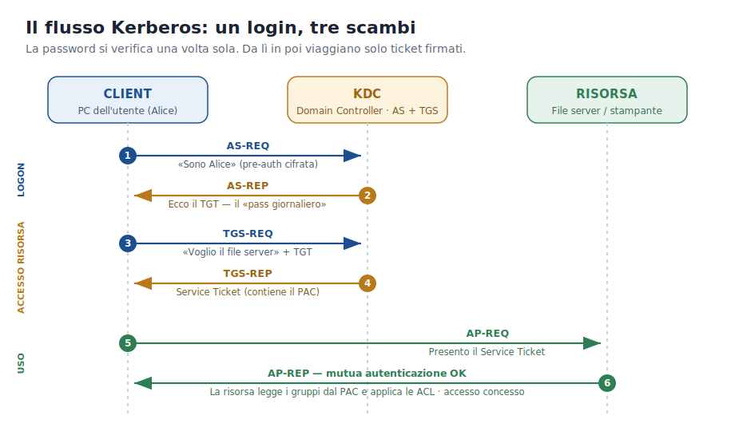

# Approfondimento 01 — Kerberos e il KDC

← [Torna al documento principale](00_dispensa_principale.md)

---

Kerberos (definito nella **RFC 4120**, evoluzione della v5 del 1993) è un
protocollo di autenticazione basato su **crittografia simmetrica** e su una
**terza parte fidata**, il KDC. L'obiettivo è permettere a due entità di
autenticarsi reciprocamente **senza mai trasmettere la password** sulla rete.

## Le due anime del KDC

Il KDC è composto da due sotto-servizi logici, entrambi in esecuzione su ogni
Domain Controller:

| Componente | Ruolo |
| --- | --- |
| **AS — Authentication Service** | Riceve le credenziali al logon e, se corrette, emette il **TGT** cifrato con la chiave del KDC. |
| **TGS — Ticket Granting Service** | Riceve il TGT e una richiesta per una risorsa specifica; emette un **Service Ticket** cifrato con la chiave del server di destinazione. |

## I tre scambi

1. **AS-REQ / AS-REP** → login: il client prova la propria identità (pre-auth) e
   ottiene il TGT.
2. **TGS-REQ / TGS-REP** → richiesta di un Service Ticket per una risorsa
   specifica, presentando il TGT.
3. **AP-REQ / AP-REP** → presentazione del Service Ticket alla risorsa; accesso
   concesso.

## Cosa garantisce il protocollo

- **Mutua autenticazione:** client e server si verificano a vicenda (l'AP-REP
  prova alla workstation che il server è autentico, non un impostore).
- **Scadenza dei ticket:** ogni ticket ha una validità limitata (default **10
  ore** in AD), che riduce la finestra utile a un eventuale furto.
- **Single Sign-On:** un solo logon dà accesso a tutte le risorse autorizzate.
- **Scalabilità:** le risorse **non** devono interrogare il DC a ogni accesso —
  tutto ciò che serve è dentro il ticket.

> **Perché la crittografia simmetrica?** Ogni principal (utente o servizio)
> condivide una chiave segreta con il KDC, derivata dalla password o dall'account
> di servizio. Il KDC, conoscendo tutte le chiavi, può cifrare un ticket in modo
> che **solo** il destinatario previsto sia in grado di decifrarlo. È questo che
> rende un Service Ticket utilizzabile su un solo server.

## Kerberos e NTLM

In un dominio Windows moderno Kerberos è il protocollo **predefinito**; **NTLM**
resta come *fallback* per scenari legacy o quando Kerberos non è disponibile
(per esempio accesso a una risorsa tramite indirizzo IP anziché nome, o SPN
mancante). NTLM è più lento, meno sicuro e — soprattutto — **non supporta la
delega** delle credenziali tra server (vedi
[approfondimento 07](07_sso_microsoft.md)).

---

← [Torna al documento principale](00_dispensa_principale.md) ·
➡️ Prossimo: [02 · Il PAC](02_pac.md)
