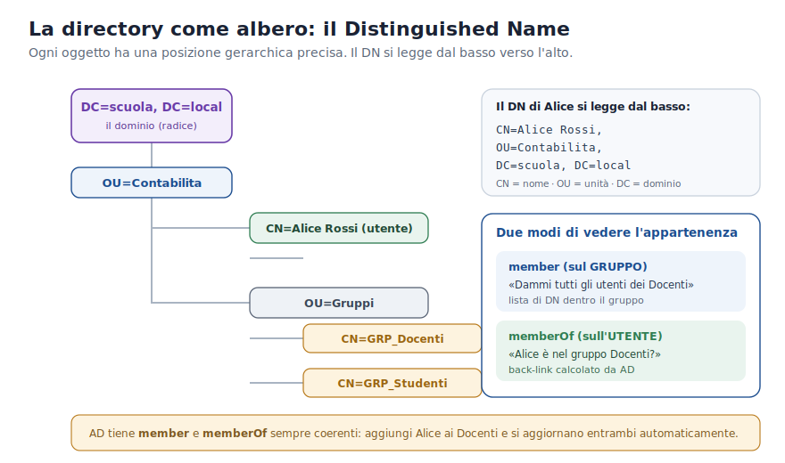

# Approfondimento 04 — LDAP e la directory

← [Torna al documento principale](00_dispensa_principale.md)

---

LDAP (**RFC 4511**) è un protocollo client-server che opera sulla porta **389**
(LDAP) o **636** (LDAPS, cifrato con TLS). In Active Directory ogni Domain
Controller espone un endpoint LDAP che dà accesso alla directory *X.500-like*
del dominio.



## LDAP vs database relazionali: perché due strumenti diversi

| Caratteristica | LDAP (Active Directory) | Database relazionale (MySQL) |
| --- | --- | --- |
| Modello dati | Albero gerarchico (DIT): ogni oggetto è un nodo con attributi. | Tabelle piatte; le relazioni si esprimono con JOIN. |
| Ottimizzazione | **Lettura**. Indici nativi su `cn`, `sAMAccountName`, `objectSID`. Autenticazione O(log n) anche con milioni di oggetti. | Bilanciato lettura/scrittura; ottimo per query complesse e transazioni ACID. |
| Scrittura | Semplice e poco frequente; niente transazioni multi-operazione complesse. | Scritture frequenti e complesse, transazioni ACID native. |
| Schema | Rigido ma estensibile (`objectClass`); cambiarlo in AD è rischioso e irreversibile. | Modificabile con `ALTER TABLE`, operazione standard. |
| Replica | Multi-master nativa tra tutti i DC (eventual consistency). | Master-slave o cluster Galera; più complessa da distribuire in scrittura. |
| Caso d'uso | Autenticazione, autorizzazione, rubrica, policy: letto migliaia di volte al giorno, scritto di rado. | App web, e-commerce, gestionali: dati che cambiano spesso. |

> **📊 Perché LDAP è più veloce in lettura.**
> 1. **Struttura ad albero** — navigare `OU=Docenti,DC=scuola,DC=local` è diretto
>    come scorrere un percorso di filesystem, senza JOIN.
> 2. **Indici specializzati** — AD mantiene indici B-tree su tutti gli attributi
>    marcati come *indexed*; cercare un utente tra 50.000 oggetti richiede poche
>    decine di millisecondi.
> 3. **Connessioni persistenti** — il client apre una sessione TCP autenticata e
>    fa più query su di essa, senza riaprire la connessione a ogni operazione.

## Il Distinguished Name (DN)

La directory è organizzata ad albero (**DIT — Directory Information Tree**): ogni
oggetto ha un DN univoco che ne descrive la posizione gerarchica.

```text
CN=Alice Rossi,OU=Contabilita,DC=azienda,DC=local
   │            │             └── DC = Domain Component (il dominio)
   │            └── OU = Organizational Unit
   └── CN = Common Name
```

## Gli attributi più importanti di un utente

| Attributo | Significato |
| --- | --- |
| `sAMAccountName` | Username di login (es. `alice.rossi`). |
| `userPrincipalName` | UPN in formato email (`alice.rossi@azienda.local`). |
| `objectSID` | Il SID dell'utente — è ciò che finisce nel PAC. |
| `memberOf` | Lista dei gruppi a cui appartiene. |
| `userAccountControl` | Flag: account abilitato/disabilitato, cambio password richiesto… |
| `pwdLastSet` | Data ultimo cambio password — usata per la validità del TGT. |

## Il punto di contatto tra LDAP e Kerberos

Al logon il KDC usa LDAP **internamente** per leggere SID, gruppi, UAC flags e
scadenza password, e li inserisce nel **PAC**. Da lì in poi le risorse non fanno
più query LDAP. LDAP resta però indispensabile per:

- app che cercano utenti/gruppi in tempo reale (es. autocomplete di una webmail);
- il *provisioning* (creazione utenti, modifica gruppi, gestione OU);
- query amministrative (*“quanti account disabilitati?”*, *“chi è nel gruppo VPN?”*);
- l'autenticazione **LDAP Bind** usata da app legacy che non parlano Kerberos.

> **LDAP Bind vs Kerberos.** Un *Simple Bind* invia username+password al DC, che
> risponde sì/no. Funziona, ma è meno sicuro: su LDAP normale (389) la password
> viaggia in chiaro; va quindi forzato su **LDAPS (636)**. In una LAN moderna si
> preferisce comunque Kerberos.

## `member` e `memberOf` in dettaglio

| Attributo | Natura |
| --- | --- |
| `member` (sul gruppo) | Multi-valore sull'oggetto `group`. Ogni valore è il DN completo di un membro. |
| `memberOf` (sull'utente) | Attributo **calcolato** (back-link), aggiornato da AD automaticamente. **Non scrivibile** direttamente: si aggiunge un utente a un gruppo modificando `member`, non `memberOf`. |

| Approccio | Query LDAP tipica | Quando usarlo |
| --- | --- | --- |
| Cerca nel gruppo (`member`) | `(&(objectClass=group)(cn=Docenti))` | Ottenere la lista completa dei membri (sincronizzare ruoli/classi). |
| Cerca nell'utente (`memberOf`) | `(&(objectClass=user)(sAMAccountName=alice)(memberOf=CN=Docenti,OU=Gruppi,DC=scuola,DC=local))` | Verificare se un singolo utente è in un gruppo (autorizzazione al login). |

## Connettori esterni (Moodle, WordPress): scelte di configurazione

| Aspetto | `member` (query sul gruppo) | `memberOf` (attributo utente) |
| --- | --- | --- |
| Parametro | Base DN del gruppo + filtro sul CN | Filtro sull'utente con `memberOf` |
| Query al login | 2 (autenticazione + verifica gruppo) | 1 (autenticazione + lettura `memberOf`) |
| Scalabilità | Problematica con gruppi grandi (migliaia di DN) | Ottima: si legge solo l'attributo dell'utente |
| Gruppi annidati | Richiede la ricerca ricorsiva `1.2.840.113556.1.4.1941` | `memberOf` è flat (non riflette l'annidamento senza la OID) |

> **🛠️ Raccomandazione pratica.** Per Moodle/WordPress in ambiente scolastico:
> preferire **`memberOf`** per la mappatura dei ruoli al login (più efficiente
> con poche centinaia di utenti); usare la query su **`member`** per le
> sincronizzazioni batch (es. importare un'intera classe in un corso); usare
> **sempre LDAPS** per non far viaggiare le credenziali in chiaro.

> **Nota sui gruppi annidati.** Se `GRP_Personale` contiene `GRP_Docenti`, un
> membro dei Docenti è membro *indiretto* del Personale. Con `member` serve la
> OID ricorsiva di Microsoft (`LDAP_MATCHING_RULE_IN_CHAIN`); con `memberOf` in
> AD l'appartenenza ai gruppi padre è già pre-calcolata, ma solo nello stesso
> dominio.

---

← [03 · Wi-Fi, RADIUS e 802.1X](03_radius_wifi.md) ·
➡️ Prossimo: [05 · DNS](05_dns.md)
