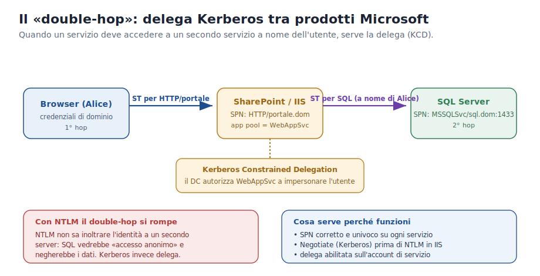

# Approfondimento 07 — Il Single Sign-On nei prodotti Microsoft

← [Torna al documento principale](00_dispensa_principale.md)

---

## Cosa significa davvero «Single Sign-On»

Single Sign-On non vuol dire *“una sola password per tutti i sistemi”*: vuol dire
**una sola autenticazione**. L'utente prova la propria identità **una volta**
(al logon di Windows) e da quel momento accede a tutte le risorse autorizzate
**senza più reinserire le credenziali** e, idealmente, **senza accorgersene**.

Il meccanismo, in una LAN d'ufficio, è quello visto nel
[documento principale](00_dispensa_principale.md#7-che-cosè-davvero-il-single-sign-on):

1. al logon il client ottiene il **TGT** e lo conserva in cache;
2. quando serve una risorsa nuova, Windows usa il TGT per chiedere al KDC il
   **Service Ticket** di *quella* risorsa;
3. il ticket viene presentato e l'accesso concesso — tutto in background.

Microsoft chiama questo comportamento **Integrated Windows Authentication (IWA)**:
finché l'utente è loggato a un computer di dominio con le sue credenziali, non
viene più interrogato quando si collega a una web application, a un database o a
una cartella. Per le applicazioni web il dialogo Kerberos avviene dentro lo
scambio HTTP tramite l'estensione **SPNEGO/Negotiate** (intestazioni
`WWW-Authenticate: Negotiate` / `Authorization`).

## Il confine dell'SSO Kerberos: dentro la rete

Il KDC gira su tutti i Domain Controller e **non viene pubblicato su Internet**.
Di conseguenza l'SSO Kerberos *puro* funziona solo quando il client **può
raggiungere un DC** — cioè all'interno della rete aziendale (o tramite VPN, o
attraverso un *trust* verso un altro dominio). Per estendere l'SSO oltre il
perimetro si usano altre tecnologie, descritte più sotto (Entra ID, Application
Proxy, federazione).

## L'ingrediente chiave: lo SPN (Service Principal Name)

Perché il KDC possa emettere un Service Ticket per un servizio, quel servizio
deve essere registrato in AD con un nome univoco: lo **SPN**. È lo SPN che il
client mette nella richiesta TGS, ed è la chiave dell'account di servizio che il
KDC usa per cifrare il ticket — così solo quel servizio potrà aprirlo.

| Servizio | Esempio di SPN |
| --- | --- |
| File share (SMB/CIFS) | `cifs/fileserver.dom` |
| Sito IIS / SharePoint | `HTTP/portale.dom` |
| SQL Server | `MSSQLSvc/sql.dom:1433` |
| Stampa | `host/printserver.dom` |

Lo SPN si registra con `setspn`, e **deve essere univoco** nel dominio: SPN
duplicati su account diversi sono una delle cause più comuni di Kerberos che non
funziona e ripiega su NTLM. In IIS, inoltre, va impostato l'ordine dei provider
con **Negotiate prima di NTLM** perché Kerberos venga tentato per primo.

## I prodotti Microsoft che usano l'SSO Kerberos

Kerberos è il protocollo di autenticazione integrata **predefinito** in Windows
e nei suoi servizi. Lo si ritrova in:

- **Logon a Windows**, accesso a **file share (SMB/CIFS)** e **stampanti** di rete;
- **IIS / SharePoint** tramite IWA (provider *Negotiate*, NTLM come fallback);
- **SQL Server** con la *Windows Authentication* (login mappati a gruppi AD);
- **Exchange** — Outlook e Outlook on the web — tramite IWA;
- **Remote Desktop** e molti servizi applicativi interni.

> Kerberos è considerato il protocollo di autenticazione integrata **più robusto**
> di Windows e supporta funzioni avanzate come la cifratura **AES** e la **mutua
> autenticazione** di client e server.

## Il «double-hop» e la delega

Molte applicazioni Microsoft sono a più livelli: il browser parla con SharePoint
(IIS), e SharePoint deve poi leggere i dati da **SQL Server** *a nome
dell'utente*. Questo richiede **due hop** di autenticazione.

- Con **NTLM** il double-hop **si rompe**: NTLM non sa inoltrare l'identità a un
  secondo server, quindi SQL vedrebbe un accesso anonimo e negherebbe i dati.
- Con **Kerberos** è possibile la **delega**: l'account di servizio di SharePoint
  viene autorizzato (dal DC) a **impersonare** l'utente verso SQL. Il front-end
  ottiene un Service Ticket per SQL *per conto* dell'utente, e SQL applica i
  permessi di quell'utente, non quelli del servizio.

La forma moderna e raccomandata di questa autorizzazione è la **Kerberos
Constrained Delegation (KCD)**: l'account di servizio può impersonare l'utente
**solo verso i servizi esplicitamente indicati** (es. solo verso quel SQL
Server), riducendo il rischio rispetto alla vecchia delega non vincolata.

Perché tutto funzioni servono tre condizioni: **SPN corretti e univoci** su ogni
servizio, **Negotiate prima di NTLM** in IIS, e la **delega abilitata**
sull'account di servizio del front-end.

## Oltre la LAN: Microsoft Entra ID

Quando l'utente è fuori dalla rete (smart working, dispositivi cloud-joined),
l'SSO non scompare: cambia il modo di costruire il TGT.

- **Dispositivi Microsoft Entra joined** si appoggiano alle informazioni di
  dominio sincronizzate da **Entra ID Connect**; lo UPN e la password vengono
  usati per richiedere un TGT Kerberos verso un DC raggiungibile, ottenendo l'SSO
  alle risorse on-premise.
- Il **cloud Kerberos trust** (consigliato con **Windows Hello for Business**)
  permette di ottenere un TGT per l'SSO anche con accesso *passwordless* (PIN,
  biometria, security key).
- L'**Application Proxy** di Entra ID usa la **KCD** per dare SSO ad applicazioni
  on-premise basate su IWA, esponendole in sicurezza verso Internet senza aprire
  porte sul firewall.

> In pratica: l'identità resta una sola (l'account AD/Entra), e l'SSO viene
> esteso oltre il perimetro della LAN tramite la sincronizzazione e i *trust*
> cloud, anziché obbligare l'utente a una VPN per ogni accesso.

---

## Fonti consultate

Materiale verificato e sintetizzato (giugno 2026) a integrazione delle dispense
originali:

- Microsoft Learn — *Use Kerberos for single sign-on (SSO) with Microsoft Entra
  Private Access*: <https://learn.microsoft.com/en-us/entra/global-secure-access/how-to-configure-kerberos-sso>
- Microsoft Learn — *Kerberos Constrained Delegation for SSO with Application
  Proxy*: <https://learn.microsoft.com/en-us/entra/identity/app-proxy/how-to-configure-sso-with-kcd>
- Microsoft Learn — *Plan for Kerberos authentication in SharePoint Server*:
  <https://learn.microsoft.com/en-us/sharepoint/security-for-sharepoint-server/kerberos-authentication-planning>
- Microsoft Learn / TechNet — *Using Kerberos for SharePoint Authentication*
  (flusso IIS → SQL e ruolo dello SPN): <https://learn.microsoft.com/en-us/previous-versions/technet-magazine/ee914605(v=msdn.10)>
- Windows OS Hub — *Configuring Kerberos Authentication on IIS Website*
  (SPN, `setspn`, ordine dei provider): <https://woshub.com/configuring-kerberos-authentication-on-iis-website/>

---

← [06 · Le GPO](06_gpo.md) ·
[Torna al documento principale](00_dispensa_principale.md)
