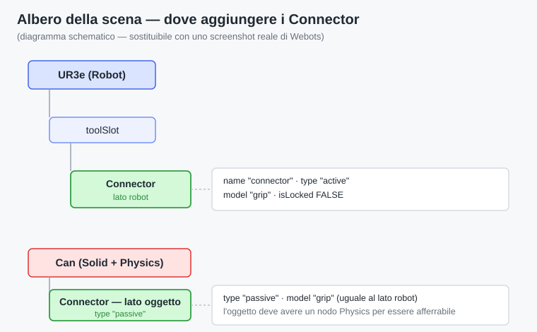
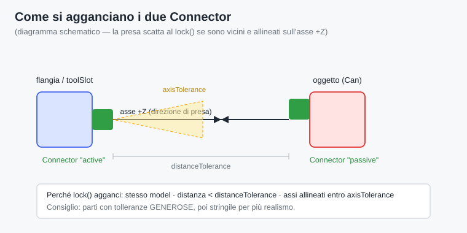

# Wrapper UR3 "URScript-fedele" per Webots — Tutorial

Un wrapper Python che permette di **riprodurre in Webots, in modo approssimato, i movimenti che progetti in URScript / PolyScope**. Pensato per imparare e visualizzare i programmi di un Universal Robots UR3 senza il braccio fisico.

---

## 1. Obiettivi

- **Imparare la sintassi UR** (URScript e la logica di PolyScope) vedendo la scena reagire in un simulatore con oggetti, nastri e pinza.
- **Prototipare programmi pick & place** e verificarne la *struttura logica* prima di portarli sul robot vero o su URSim.
- Mantenere il codice **leggibile come URScript**, così un programma scritto qui si ritrova quasi identico sul teach pendant.

Questo wrapper **non** è un gemello digitale fedele: è uno strumento didattico. Per la fedeltà al comportamento reale (timing, dinamica, firmware) si usa **URSim** o il robot vero — vedi la sezione *Limiti* e *Passi successivi*.

---

## 2. Caratteristiche

- **Comandi in stile URScript**: `movej`, `movel`, `speedj`, `stopj`, `get_inverse_kin`, `get_forward_kin`, `get_actual_joint_positions`, `get_actual_tcp_pose`, `set_tcp`, `get_digital_in`, `set_digital_out`, `sleep`, `textmsg`.
- **Convenzioni fedeli a UR**: pose espresse come `[x, y, z, rx, ry, rz]` con la rotazione in **vettore asse-angolo** (non RPY); default corretti (`movej` a=1.4 / v=1.05 ; `movel` a=1.2 / v=0.25).
- **`movej` sincronizzato**: i giunti finiscono insieme, come sul robot vero (non a velocità indipendenti).
- **IK agganciata alla configurazione attuale**: evita i "salti" tra le 8 soluzioni cinematiche dell'UR.
- **Backend IK sostituibile**: di default usa `ikpy` (numerica); puoi collegare `ur_ikfast` / `ur3_ikfastpy` (analitica) riscrivendo due metodi.
- **Pinza con un solo metodo `grip()`**: due modalità selezionabili — *Connector* (presa "magnetica" robusta) o *Robotiq* (presa per contatto reale a motori).
- **Nessuna dipendenza per giunti + I/O**: la parte nello spazio dei giunti gira in Webots senza installare nulla.

---

## 3. Struttura del progetto

```
controllers/mio_controller/
├── ur3_wrapper.py     # il wrapper principale (classe UR3)
├── gripper.py         # modulo pinza (grip): Connector o Robotiq
├── pick_place.py      # esempio: traduzione di un programma PolyScope
└── ur3e.urdf          # (per i MoveL) URDF dell'UR3e, per l'IK
```

In Webots ogni controller vive in una cartella dentro `controllers/`. Il file con il `__main__` che vuoi eseguire va assegnato al robot nel campo `controller`.

---

## 4. Installazione

### Prerequisiti
- **Webots** (usa una versione recente; annota quale, perché i nomi dei dispositivi possono variare tra versioni).
- **Python 3** configurato come linguaggio dei controller in Webots.

### Passi

1. **Copia i file** `ur3_wrapper.py`, `gripper.py`, `pick_place.py` nella cartella del tuo controller.
2. **Solo per i movimenti cartesiani** (`movel`, `get_inverse_kin`): installa le dipendenze
   ```bash
   pip install numpy ikpy
   ```
   e procurati la **URDF dell'UR3e** (dai pacchetti ROS di Universal Robots, oppure esportandola dal PROTO). Imposta `URDF_PATH` in cima a `ur3_wrapper.py`.
   > Se ti bastano giunti + I/O, salta questo passo e avvia con `UR3(use_ik=False)`.
3. **Parti dalla sample world** dei Universal Robots di Webots (ha già UR3e, nastro, oggetti e pinza Robotiq): è il punto di partenza più rapido.
4. **Verifica i nomi dei dispositivi** con *View PROTO Source* sulla tua scena e aggiornali nei blocchi CONFIG in cima ai file:
   - motori dei giunti (`JOINT_NAMES`) e relativi sensori (`<giunto>_sensor`);
   - sensore del nastro (`DIGITAL_IN_SENSORS`);
   - Connector o motori della pinza (`gripper.py`).

---

## 5. Utilizzo

### Corrispondenza URScript → wrapper

| URScript / PolyScope           | Wrapper                                  | Note |
|--------------------------------|------------------------------------------|------|
| `movej(q, a, v)`               | `ur.movej(q, a=1.4, v=1.05)`             | q = 6 angoli giunto [rad] |
| `movej(p[...])` (via posa)     | `ur.movej(ur.get_inverse_kin(pose))`     | come su URScript |
| `movel(pose, a, v)`            | `ur.movel(pose, a=1.2, v=0.25)`          | richiede IK (ikpy) |
| `movec` / blend `r`            | — (non supportato fedelmente)            | vedi Limiti |
| `speedj(qd, a, t)`             | `ur.speedj(qd, a, t)`                    | velocità giunti |
| `stopj(a)`                     | `ur.stopj(a)`                            | |
| `get_actual_joint_positions()` | `ur.get_actual_joint_positions()`        | |
| `get_actual_tcp_pose()`        | `ur.get_actual_tcp_pose()`               | richiede IK |
| `get_inverse_kin(pose)`        | `ur.get_inverse_kin(pose, q_near)`       | agganciata a q_near |
| `set_tcp(pose)`                | `ur.set_tcp(pose)`                       | |
| `set_digital_out(n, b)`        | `ur.set_digital_out(n, b)` / `ur.grip()` | pin 0 = pinza |
| `get_digital_in(n)`            | `ur.get_digital_in(n)`                   | pin 0 = sensore nastro |
| `sleep(t)`                     | `ur.sleep(t)`                            | |
| `textmsg(...)`                 | `ur.textmsg(...)`                        | stampa in console |

### Convenzione delle pose
Una posa è `[x, y, z, rx, ry, rz]`: posizione in **metri**, orientazione come **vettore asse-angolo** in radianti (identico a URScript). Esempio: utensile che punta verso il basso ≈ `[x, y, z, 0, 3.14159, 0]`.

### Pinza
```python
ur.grip(close=True)    # chiudi / afferra
ur.grip(close=False)   # apri / rilascia
```
La modalità (`connector` o `robotiq`) si sceglie con `GRIPPER_MODE` in `gripper.py`.

### Glossario PolyScope

Se parti dall'albero del teach pendant (PolyScope) invece che da URScript testuale, ecco i termini chiave e come si mappano sul wrapper:

- **Waypoint** — un punto memorizzato (una posizione del robot). Può essere salvato come configurazione di **giunti** o come **posa** cartesiana.
- **MoveJ** — movimento nello spazio dei giunti verso i waypoint: rapido, senza problemi di singolarità, ma il TCP **non** segue una retta. → `ur.movej(...)`.
- **MoveL** — movimento **lineare**: il TCP percorre una retta nello spazio cartesiano. → `ur.movel(...)`.
- **MoveP** — movimento di processo a velocità costante con raccordi circolari (blend). *Non riprodotto fedelmente* dal wrapper.
- **Ereditarietà del tipo di movimento** — i waypoint sono **figli** di un nodo Move ed ereditano il suo tipo (J/L/P). Lo stesso punto, quindi, viene raggiunto in modo diverso a seconda del Move sotto cui è annidato. È il dettaglio che spiega perché nell'albero "pick" sotto un MoveL significa *raggiungi pick in lineare*.
- **Wait** — attesa, per tempo o per segnale. `Wait: 0.5` → `ur.sleep(0.5)`.
- **BeforeStart** — sezione eseguita **una volta sola** all'avvio, prima del ciclo. → chiamata prima del `while`.
- **Robot Program** — il corpo principale, eseguito **in loop**. → il `while True`.
- **Blend radius (`r`)** — raggio attorno al waypoint entro cui il moto si raccorda al successivo senza fermarsi. *Non implementato* in Webots (vedi Limiti).
- **TCP** (Tool Center Point) — il punto dell'utensile che comandi/segui. → `ur.set_tcp(...)`.

---

## 6. Limiti (da conoscere bene)

Il wrapper è fedele alla **logica**, non alla **fisica**. In particolare:

- **Timing e profili di velocità approssimati**: le durate reali dei movimenti non coincidono con quelle del robot.
- **Raggio di blend (`r`) non implementato**: Webots non fonde i segmenti; i raccordi tra movimenti sono netti.
- **`movel` insegue la retta a waypoint**: la traccia è corretta, ma la dinamica lungo il percorso è semplificata.
- **IK numerica (ikpy)**: dà una sola soluzione; la scelta di configurazione può differire da quella del controller UR (per avvicinarti usa l'IK analitica `ur_ikfast`).
- **Geometria UR3 vs UR3e**: il modello Webots è un **UR3e**; se il tuo braccio reale è un UR3 "liscio", le pose cartesiane hanno un piccolo scostamento. Per farle coincidere, usa la URDF del *tuo* UR3.
- **Presa idealizzata (Connector)**: aggancio rigido, non simula la forza di presa; la Robotiq a motori è più realistica ma va tarata (attrito, masse).
- **Singolarità e limiti di giunto**: non gestiti come sul firmware UR.

> Regola pratica: usa questo wrapper per imparare *come si costruisce* un programma; usa URSim per verificare *come gira davvero*.

---

## 7. Programmi di prova

### Prova A — Giunti + I/O (nessuna dipendenza)

Verifica che robot e I/O rispondano. Gira con `use_ik=False`, senza numpy/ikpy.

```python
import math
from ur3_wrapper import UR3

ur = UR3(use_ik=False)

HOME = [0.0, -math.pi/2,  math.pi/2, -math.pi/2, -math.pi/2, 0.0]
POSA = [0.5, -math.pi/3,  math.pi/2, -math.pi/2, -math.pi/2, 0.0]

ur.movej(HOME)
ur.textmsg("Giunti attuali:", ur.get_actual_joint_positions())

ur.movej(POSA)              # muoviti a una seconda configurazione
ur.sleep(0.5)

ur.set_digital_out(0, True)  # chiudi pinza (o stampa se non configurata)
ur.sleep(0.5)
ur.set_digital_out(0, False) # apri

# leggi il sensore del nastro come ingresso digitale
ur.textmsg("Pezzo sul nastro?", ur.get_digital_in(0))

ur.movej(HOME)
```

### Prova B — Pick & place con pinza (richiede ikpy + URDF)

Traduzione dell'albero PolyScope *approccio → scendi → prendi → risali*, per pick e place.

```python
import math
from ur3_wrapper import UR3

ur = UR3(use_ik=True)

# waypoint MoveJ in giunti [rad] — da tarare sulla tua scena
riposo         = [0.0, -math.pi/2,  math.pi/2, -math.pi/2, -math.pi/2, 0.0]
approccioPick  = [0.3, -math.pi/3,  math.pi/2, -math.pi/2, -math.pi/2, 0.0]
approccioPlace = [-0.6, -math.pi/3, math.pi/2, -math.pi/2, -math.pi/2, 0.0]

# waypoint MoveL come pose [x,y,z,rx,ry,rz] — da tarare
pick  = [0.30, -0.20, 0.05, 0.0, math.pi, 0.0]
place = [-0.30, -0.20, 0.05, 0.0, math.pi, 0.0]

def approach_of(pose, dz=0.10):
    p = list(pose); p[2] += dz; return p

# BeforeStart: una volta sola
ur.movej(riposo)

# Robot Program: ciclo
while True:
    # --- PICK ---
    ur.movej(approccioPick)
    ur.movel(pick)
    ur.grip(close=True)          # presa
    ur.sleep(0.5)
    ur.movel(approach_of(pick))

    # --- PLACE ---
    ur.movej(approccioPlace)
    ur.movel(place)
    ur.grip(close=False)         # rilascio
    ur.sleep(0.5)
    ur.movel(approach_of(place))
```

### Prova C — Scenario nastro (loop guidato dal sensore)

Il pick & place parte **a ogni pezzo che arriva sul nastro**. Il nastro (`ConveyorBelt`) e i pezzi fanno parte della scena Webots; il **sensore di distanza** montato sopra il nastro è letto come ingresso digitale 0: quando un pezzo gli passa sotto, `get_digital_in(0)` diventa `True` e fa scattare la presa.

```python
import math
from ur3_wrapper import UR3

ur = UR3(use_ik=True)

riposo      = [0.0, -math.pi/2, math.pi/2, -math.pi/2, -math.pi/2, 0.0]  # giunti
sopraNastro = [0.30, -0.20, 0.15, 0.0, math.pi, 0.0]   # posa sopra il punto di presa
preleva     = [0.30, -0.20, 0.05, 0.0, math.pi, 0.0]   # posa sul pezzo
sopraCassa  = [-0.30, -0.20, 0.15, 0.0, math.pi, 0.0]  # posa sopra la cassa
deposita    = [-0.30, -0.20, 0.08, 0.0, math.pi, 0.0]  # posa di rilascio

ur.movej(riposo)                       # BeforeStart

while True:                            # Robot Program
    # 1) attendi che un pezzo arrivi sotto il sensore del nastro
    ur.textmsg("In attesa di un pezzo sul nastro...")
    while not ur.get_digital_in(0):
        ur.sleep(0.05)

    # 2) preleva dal nastro (approccio -> scendi -> prendi -> risali)
    ur.movel(sopraNastro)
    ur.movel(preleva)
    ur.grip(close=True)
    ur.sleep(0.3)
    ur.movel(sopraNastro)

    # 3) deposita nella cassa
    ur.movel(sopraCassa)
    ur.movel(deposita)
    ur.grip(close=False)
    ur.sleep(0.3)
    ur.movel(sopraCassa)

    # 4) torna in attesa del prossimo pezzo
    ur.movej(riposo)
```

> Suggerimento: se il robot preleva più volte lo stesso pezzo, alza la soglia del sensore o aggiungi una piccola attesa dopo la presa, così il pezzo esce dal campo del sensore prima del ciclo successivo.

---

## 8. Risoluzione problemi

| Sintomo | Causa probabile | Rimedio |
|---|---|---|
| `getDevice` restituisce `None` | nome dispositivo errato | controlla con *View PROTO Source*; aggiorna i CONFIG |
| Il braccio non raggiunge la posa | `timeout` troppo basso o posa irraggiungibile | aumenta il timeout / verifica i limiti di giunto |
| `movel` dà errore | ikpy/URDF mancanti o `URDF_PATH` errato | `pip install numpy ikpy`, imposta il percorso URDF |
| Il TCP cade nel punto sbagliato | geometria UR3 vs UR3e o URDF errata | usa la URDF del tuo braccio; verifica `set_tcp` |
| `grip()` non afferra (Connector) | Connector non vicini/allineati, `model` diverso, tolleranze strette | avvicina i punti; stessa stringa `model`; allarga le tolleranze |
| L'oggetto scivola (Robotiq) | attrito/forza/massa da tarare | aumenta attrito o forza di chiusura; alleggerisci l'oggetto |

---

## 9. Passi successivi

1. **Tara i waypoint** con i valori reali letti dal teach pendant (o insegnati nella scena).
2. **Scenario nastro**: usa `get_digital_in(0)` per attendere il pezzo e avvia il pick & place a ogni arrivo.
3. **Fedeltà**: riscrivi lo stesso programma in **URScript su URSim** (Docker, gratis) e confrontalo riga per riga — lì il comportamento è quello del firmware reale.
4. **IK migliore**: passa a `ur_ikfast` / `ur3_ikfastpy` (analitica) per soluzioni cinematiche coerenti con il robot vero.

---

## 10. Aggiungere il nodo Connector alla scena

La presa in modalità `connector` funziona con **due** Connector che si riconoscono: uno **attivo** sulla punta del braccio e uno **passivo** su ogni oggetto da afferrare. Sono come due calamite che si accoppiano lungo il proprio asse +Z.

> I diagrammi seguenti sono schematici: puoi sostituirli con screenshot reali di Webots mantenendo lo stesso nome file in `img/`.

### 10.1 Dove metterli nell'albero



1. **Lato robot** — seleziona il campo `toolSlot` del braccio, aggiungi un nodo **Connector** e imposta: `name "connector"`, `type "active"`, `model "grip"`, `isLocked FALSE`. Posizionalo sulla punta con una piccola `translation`, asse +Z verso l'oggetto.
2. **Lato oggetto** — l'oggetto da prendere deve essere un **Solid con un nodo Physics**. Aggiungi un Connector figlio con `type "passive"` e lo stesso `model "grip"`, sulla superficie di presa, asse +Z verso l'esterno.

### 10.2 Come avviene l'aggancio



Perché `grip(close=True)` → `lock()` afferri davvero, al momento della presa i due Connector devono avere lo **stesso `model`**, essere **più vicini di `distanceTolerance`** e **allineati entro `axisTolerance`**. È per questo che i waypoint `approccioPick`/`pick` devono portare la punta proprio sopra e affacciata all'oggetto.

> **Consiglio:** parti con tolleranze **generose** (distanza qualche cm, angoli larghi) finché la presa è affidabile, poi stringile se vuoi più realismo. È molto più facile che il contrario.

---

## 11. Checklist di taratura (prima prova)

Da spuntare in ordine la prima volta che porti il wrapper su una scena nuova:

- [ ] **Nomi dispositivi** verificati con *View PROTO Source* e aggiornati nei CONFIG (giunti, sensori `<giunto>_sensor`, sensore nastro, pinza).
- [ ] **Prova A** (giunti + I/O, `use_ik=False`) eseguita: il braccio si muove e gli I/O rispondono.
- [ ] **IK attiva** solo se serve: `numpy` + `ikpy` installati, `URDF_PATH` corretto, `get_actual_tcp_pose()` restituisce valori sensati.
- [ ] **Waypoint reali** inseriti (giunti per i MoveJ, pose per i MoveL) al posto dei valori d'esempio.
- [ ] **Connector**: due nodi (active/passive), stesso `model`, oggetto con `Physics`, tolleranze inizialmente generose.
- [ ] **Presa provata**: `grip(close=True)` aggancia, l'oggetto segue la mano, `grip(close=False)` rilascia.
- [ ] **Scenario nastro** (Prova C): `get_digital_in(0)` diventa `True` all'arrivo del pezzo e fa partire il ciclo.
- [ ] **Confronto con URSim** (facoltativo): stessa logica riscritta in URScript per verificare il comportamento fedele.

---

## Licenze degli strumenti citati
- **Webots** — open source (Apache 2.0), gratis.
- **URSim** — freeware (proprietario UR), gratis.
- **ikpy**, **ur3_ikfastpy** — open source.
- **RoboDK** (alternativa integrata URScript + mondo) — commerciale, con prezzo educational.
