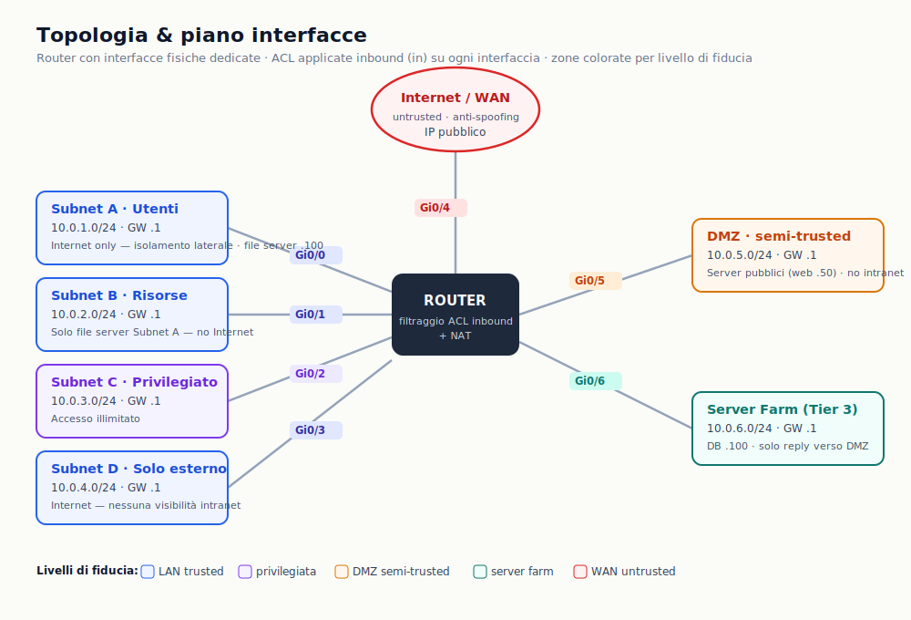
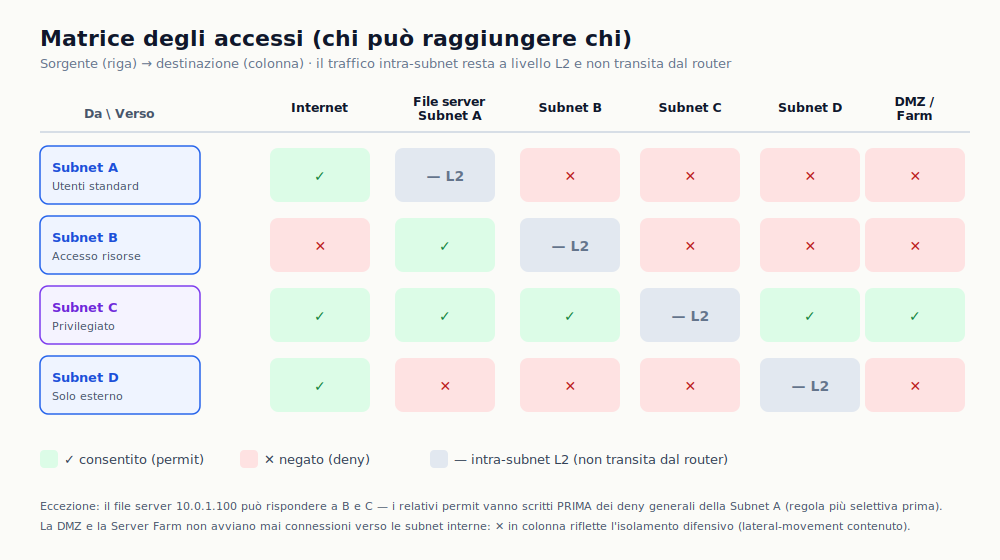
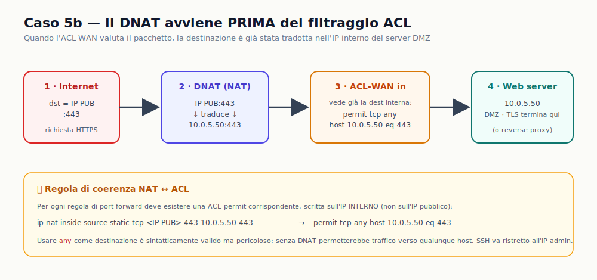
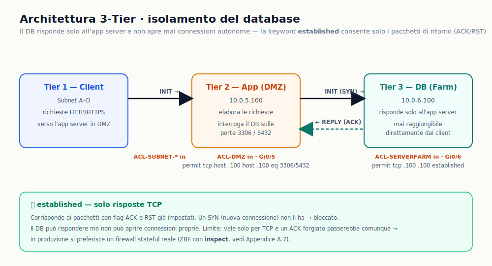
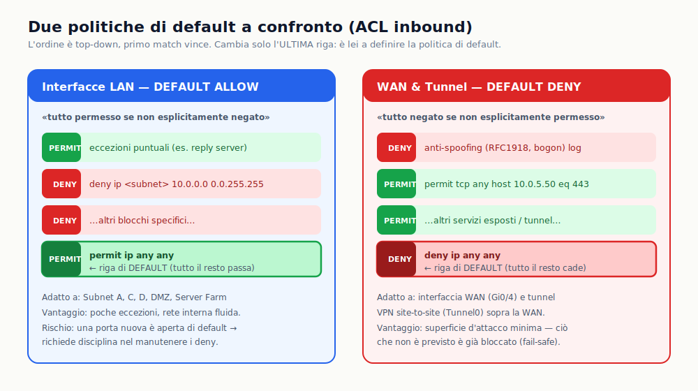

>[Torna a reti di sensori](../../sensornetworkshort.md)>[Torna a reti ethernet](../../archeth.md)

- [Dettaglio architettura Zigbee](../../archzigbee.md)
- [Dettaglio architettura BLE](../../archble.md)
- [Dettaglio architettura WiFi infrastruttura](../../archwifi.md)
- [Dettaglio architettura WiFi mesh](../../archmesh.md) 
- [Dettaglio architettura LoraWAN](../../lorawanclasses.md) 


# Sistemi e Reti — Politiche di Accesso e Configurazione ACL

> Router con interfacce fisiche · 6 casi · 3-Tier · ZBF · iptables/UFW/Shorewall · Quesito DMZ
> **Parte C (nuova):** politiche di default differenziate — LAN *default-allow*, WAN e tunnel *default-deny*.

Tutte le ACL sono **estese, con nome, applicate inbound (`in`)** sulle interfacce. I diagrammi sono in file SVG separati nella stessa cartella.

---

# Parte A — ACL su router con interfacce fisiche

## 1 · Introduzione

Il documento illustra le politiche fondamentali di controllo degli accessi tra subnet tramite ACL estese Cisco applicate **inbound** sulle interfacce fisiche di un router. La rete comprende quattro subnet (Gi0/0–Gi0/3), un'interfaccia WAN (Gi0/4) e una DMZ (Gi0/5). Le stesse ACL si applicano invariate in topologia *router-on-a-stick* (§3).

## 2 · Piano di indirizzamento

Il file server condiviso risiede nella Subnet A all'indirizzo `10.0.1.100`, raggiungibile a livello L2 dai propri client senza passare dal router.

| Subnet | Nome | Rete | Gateway | Interfaccia | Profilo |
|---|---|---|---|---|---|
| **A** | Utenti Standard | 10.0.1.0/24 | 10.0.1.1 | Gi0/0 | Internet only — isolamento laterale |
| **B** | Accesso Risorse | 10.0.2.0/24 | 10.0.2.1 | Gi0/1 | Solo server Subnet A — no internet |
| **C** | Privilegiato | 10.0.3.0/24 | 10.0.3.1 | Gi0/2 | Accesso illimitato |
| **D** | Solo Esterno | 10.0.4.0/24 | 10.0.4.1 | Gi0/3 | Internet — no intranet |
| **DMZ** | Semi-trusted | 10.0.5.0/24 | 10.0.5.1 | Gi0/5 | Server pubblici — no intranet |
| **WAN** | Internet / ISP | IP pubblico | — | Gi0/4 | Anti-spoofing — ingresso da internet |

## 3 · Topologia



Lo schema usa interfacce fisiche dedicate. In alternativa (*router-on-a-stick*) si usano subinterface 802.1Q su un link trunk: il corpo delle ACL è identico, cambia solo il nome dell'interfaccia.

### 3.1 Interfaccia fisica

```cisco
Router(config)#    interface GigabitEthernet0/0
Router(config-if)#  description Subnet-A Utenti Standard
Router(config-if)#  ip address 10.0.1.1 255.255.255.0
Router(config-if)#  ip access-group ACL-SUBNET-A in
Router(config-if)#  no shutdown
```

### 3.2 Subinterface 802.1Q

```cisco
Router(config)#    interface GigabitEthernet0/0.10
Router(config-if)#  encapsulation dot1Q 10
Router(config-if)#  ip address 10.0.1.1 255.255.255.0
Router(config-if)#  ip access-group ACL-SUBNET-A in
Router(config-if)#  exit
Router(config)#    interface GigabitEthernet0/0.20
Router(config-if)#  encapsulation dot1Q 20
Router(config-if)#  ip address 10.0.2.1 255.255.255.0
Router(config-if)#  ip access-group ACL-SUBNET-B in
```

> 💡 **Router-on-a-stick:** 1) porta fisica in trunk mode; 2) ogni subinterface aggiunge `encapsulation dot1Q <vlan-id>`; 3) il numero dopo il punto e il VLAN ID per convenzione coincidono; 4) le ACL sono identiche — cambia solo il nome dell'interfaccia.

## 4 · Matrice degli accessi



✅ = consentito · ❌ = negato · — = intra-subnet L2 (non transita dal router).

| Da \ Verso | Internet | Server Subnet A | Subnet B | Subnet C | Subnet D |
|---|---|---|---|---|---|
| **Subnet A — Utenti Standard** | ✅ SÌ | — | ❌ NO | ❌ NO | ❌ NO |
| **Subnet B — Accesso Risorse** | ❌ NO | ✅ SÌ | — | ❌ NO | ❌ NO |
| **Subnet C — Privilegiato** | ✅ SÌ | ✅ SÌ | ✅ SÌ | — | ✅ SÌ |
| **Subnet D — Solo Esterno** | ✅ SÌ | ❌ NO | ❌ NO | ❌ NO | — |

## 5 · Caso 1 — Isolamento laterale con uscita Internet

**Gi0/0 · Subnet A · 10.0.1.0/24.** Internet libero, nessuna comunicazione laterale. Le risposte del server (10.0.1.100) verso B e C devono essere permesse **prima** dei deny generali (regola più selettiva prima).

| # | Sorgente | Destinazione | Proto | Azione | Note |
|---|---|---|---|---|---|
| 1 | 10.0.1.100 | 10.0.2.0/24 | IP | ✅ PERMIT | Server risponde a Subnet B |
| 2 | 10.0.1.100 | 10.0.3.0/24 | IP | ✅ PERMIT | Server risponde a Subnet C |
| 3 | 10.0.1.0/24 | 10.0.2.0/24 | IP | ❌ DENY | Blocco Subnet B |
| 4 | 10.0.1.0/24 | 10.0.3.0/24 | IP | ❌ DENY | Blocco Subnet C |
| 5 | 10.0.1.0/24 | 10.0.4.0/24 | IP | ❌ DENY | Blocco Subnet D |
| 6 | 10.0.1.0/24 | qualsiasi | IP | ✅ PERMIT | Uscita Internet via NAT |

```cisco
Router> enable
Router# configure terminal
! Risposte server: permit PRIMA dei deny generali
Router(config)# ip access-list extended ACL-SUBNET-A
Router(config-ext-nacl)# permit ip host 10.0.1.100  10.0.2.0 0.0.0.255
Router(config-ext-nacl)# permit ip host 10.0.1.100  10.0.3.0 0.0.0.255
! Isolamento laterale
Router(config-ext-nacl)# deny   ip 10.0.1.0 0.0.0.255  10.0.2.0 0.0.0.255
Router(config-ext-nacl)# deny   ip 10.0.1.0 0.0.0.255  10.0.3.0 0.0.0.255
Router(config-ext-nacl)# deny   ip 10.0.1.0 0.0.0.255  10.0.4.0 0.0.0.255
! Uscita Internet
Router(config-ext-nacl)# permit ip 10.0.1.0 0.0.0.255  any
Router(config-ext-nacl)# exit
Router(config)# interface GigabitEthernet0/0
Router(config-if)# ip address 10.0.1.1 255.255.255.0
Router(config-if)# ip access-group ACL-SUBNET-A in
Router(config-if)# no shutdown
Router(config-if)# end
Router# write memory
```

## 6 · Caso 2 — Whitelist chiusa a host specifici

**Gi0/1 · Subnet B · 10.0.2.0/24.** Unica destinazione lecita: il server Subnet A (10.0.1.100). Deny finale esplicito per rendere visibile la policy e abilitare il contatore.

| # | Sorgente | Destinazione | Proto | Azione | Note |
|---|---|---|---|---|---|
| 1 | 10.0.2.0/24 | 10.0.1.100 | IP | ✅ PERMIT | Unica destinazione: server Subnet A |
| 2 | qualsiasi | qualsiasi | IP | ❌ DENY | Blocco esplicito finale |

```cisco
Router(config)# ip access-list extended ACL-SUBNET-B
Router(config-ext-nacl)# permit ip 10.0.2.0 0.0.0.255  host 10.0.1.100
Router(config-ext-nacl)# deny   ip any any
Router(config-ext-nacl)# exit
Router(config)# interface GigabitEthernet0/1
Router(config-if)# ip address 10.0.2.1 255.255.255.0
Router(config-if)# ip access-group ACL-SUBNET-B in
Router(config-if)# no shutdown
```

## 7 · Caso 3 — Accesso privilegiato illimitato

**Gi0/2 · Subnet C · 10.0.3.0/24.** ACL degenere: una sola `permit any any`. Mantenerla esplicita documenta la scelta e permette future restrizioni senza creare una nuova lista da zero.

| # | Sorgente | Destinazione | Proto | Azione | Note |
|---|---|---|---|---|---|
| 1 | qualsiasi | qualsiasi | IP | ✅ PERMIT | Accesso illimitato |

```cisco
Router(config)# ip access-list extended ACL-SUBNET-C
Router(config-ext-nacl)# permit ip any any
Router(config-ext-nacl)# exit
Router(config)# interface GigabitEthernet0/2
Router(config-if)# ip address 10.0.3.1 255.255.255.0
Router(config-if)# ip access-group ACL-SUBNET-C in
Router(config-if)# no shutdown
```

## 8 · Caso 4 — Accesso esterno selettivo senza intranet

**Gi0/3 · Subnet D · 10.0.4.0/24.** Deny esplicito per ogni subnet interna; permit finale per Internet. Logica opposta al Caso 1: nessuna eccezione per server locali.

| # | Sorgente | Destinazione | Proto | Azione | Note |
|---|---|---|---|---|---|
| 1 | 10.0.4.0/24 | 10.0.1.0/24 | IP | ❌ DENY | Blocco A |
| 2 | 10.0.4.0/24 | 10.0.2.0/24 | IP | ❌ DENY | Blocco B |
| 3 | 10.0.4.0/24 | 10.0.3.0/24 | IP | ❌ DENY | Blocco C |
| 4 | 10.0.4.0/24 | qualsiasi | IP | ✅ PERMIT | Internet e servizi remoti |

```cisco
Router(config)# ip access-list extended ACL-SUBNET-D
Router(config-ext-nacl)# deny   ip 10.0.4.0 0.0.0.255  10.0.1.0 0.0.0.255
Router(config-ext-nacl)# deny   ip 10.0.4.0 0.0.0.255  10.0.2.0 0.0.0.255
Router(config-ext-nacl)# deny   ip 10.0.4.0 0.0.0.255  10.0.3.0 0.0.0.255
Router(config-ext-nacl)# permit ip 10.0.4.0 0.0.0.255  any
Router(config-ext-nacl)# exit
Router(config)# interface GigabitEthernet0/3
Router(config-if)# ip address 10.0.4.1 255.255.255.0
Router(config-if)# ip access-group ACL-SUBNET-D in
Router(config-if)# no shutdown
```

## 9 · Caso 5 — Anti-spoofing in ingresso da Internet

**Gi0/4 · WAN · IP pubblico.** Blocca sorgenti impossibili (RFC 1918, loopback, multicast) con `log` e nega tutto il resto con un **default deny esplicito**. La WAN è la frontiera esterna: nulla entra se non esplicitamente permesso.

| # | Sorgente | Destinazione | Proto | Azione | Note |
|---|---|---|---|---|---|
| 1 | 0.0.0.0 | qualsiasi | IP | ❌ DENY | Spoofing default-GW — log |
| 2 | 127.0.0.0/8 | qualsiasi | IP | ❌ DENY | Loopback — log |
| 3 | 10.0.0.0/8 | qualsiasi | IP | ❌ DENY | RFC 1918 A — log |
| 4 | 172.16.0.0/12 | qualsiasi | IP | ❌ DENY | RFC 1918 B — log |
| 5 | 192.168.0.0/16 | qualsiasi | IP | ❌ DENY | RFC 1918 C — log |
| 6 | 224.0.0.0/4 | qualsiasi | IP | ❌ DENY | Multicast sorgente — log |
| 7 | qualsiasi | qualsiasi | IP | ❌ DENY | **Default Deny** — tutto il non permesso viene scartato |

```cisco
Router(config)# ip access-list extended ACL-WAN
Router(config-ext-nacl)# deny   ip host 0.0.0.0  any log
Router(config-ext-nacl)# deny   ip 127.0.0.0 0.255.255.255  any log
Router(config-ext-nacl)# deny   ip 10.0.0.0  0.255.255.255  any log
Router(config-ext-nacl)# deny   ip 172.16.0.0 0.15.255.255  any log
Router(config-ext-nacl)# deny   ip 192.168.0.0 0.0.255.255  any log
Router(config-ext-nacl)# deny   ip 224.0.0.0 15.255.255.255 any log
! Default deny: nulla entra dall'esterno se non esplicitamente permesso
Router(config-ext-nacl)# deny   ip any any
Router(config-ext-nacl)# exit
Router(config)# interface GigabitEthernet0/4
Router(config-if)# ip address <IP-PUBBLICO> <MASK-ISP>
Router(config-if)# ip nat outside
Router(config-if)# ip access-group ACL-WAN in
Router(config-if)# no shutdown
```

## 10 · Caso 6 — DMZ: zona semi-trusted con server pubblici

**Gi0/5 · DMZ · 10.0.5.0/24 · Web server HTTPS: 10.0.5.50.** La DMZ ospita i server accessibili da Internet (web, mail, DNS). Devono essere raggiungibili dall'esterno ma **non** devono mai comunicare con le subnet interne. La policy è asimmetrica: il traffico legittimo *entra* nella DMZ dall'esterno (gestito da ACL-WAN + NAT, Caso 5b), mentre il traffico che *esce* dalla DMZ verso l'interno è bloccato da questa ACL inbound su Gi0/5.

> 🛡️ **Difesa in profondità:** anche se un server DMZ viene compromesso, l'attaccante resta in zona isolata e non può raggiungere le subnet interne né il file server — il *lateral movement* è contenuto.

**Host nella DMZ**

| Host | IP | Servizi esposti | Ruolo |
|---|---|---|---|
| Gateway DMZ (Gi0/5) | 10.0.5.1 | — | Default gateway degli host DMZ |
| **Web server HTTPS** | **10.0.5.50** | HTTP :80, HTTPS :443, SSH :22 | Destinazione del NAT WAN (Caso 5b) |

**ACL inbound Gi0/5 — traffico in uscita dalla DMZ**

| # | Sorgente | Destinazione | Proto | Azione | Note |
|---|---|---|---|---|---|
| 1 | 10.0.5.0/24 | 10.0.1.0/24 | IP | ❌ DENY | No A |
| 2 | 10.0.5.0/24 | 10.0.2.0/24 | IP | ❌ DENY | No B |
| 3 | 10.0.5.0/24 | 10.0.3.0/24 | IP | ❌ DENY | No C |
| 4 | 10.0.5.0/24 | 10.0.4.0/24 | IP | ❌ DENY | No D |
| 5 | 10.0.5.0/24 | qualsiasi | IP | ✅ PERMIT | Internet: aggiornamenti, DNS, NTP |

```cisco
Router(config)# ip access-list extended ACL-DMZ
Router(config-ext-nacl)# deny   ip 10.0.5.0 0.0.0.255  10.0.1.0 0.0.0.255
Router(config-ext-nacl)# deny   ip 10.0.5.0 0.0.0.255  10.0.2.0 0.0.0.255
Router(config-ext-nacl)# deny   ip 10.0.5.0 0.0.0.255  10.0.3.0 0.0.0.255
Router(config-ext-nacl)# deny   ip 10.0.5.0 0.0.0.255  10.0.4.0 0.0.0.255
Router(config-ext-nacl)# permit ip 10.0.5.0 0.0.0.255  any
Router(config-ext-nacl)# exit
Router(config)# interface GigabitEthernet0/5
Router(config-if)# description DMZ-Server-Pubblici
Router(config-if)# ip address 10.0.5.1 255.255.255.0
Router(config-if)# ip access-group ACL-DMZ in
Router(config-if)# no shutdown
```

---

# Parte B — Caso 5b: esposizione di servizi in DMZ

> **Scenario.** Una piccola azienda dispone di un collegamento a banda larga con **un solo IP pubblico statico**. Nella DMZ esiste un web server HTTPS (10.0.5.50) da rendere accessibile via HTTP/HTTPS e gestibile da remoto via SSH. Descrivere la configurazione del router, motivando le scelte ed elencando i comandi.

## 11 · Relazione tra Caso 5 e Caso 5b

Il Caso 5 blocca tutto il traffico in ingresso dalla WAN (antispoofing + default deny): è la *baseline* corretta per qualsiasi interfaccia WAN. Il Caso 5b la estende aggiungendo `permit` selettivi per i servizi da esporre. Stessa struttura antispoofing, stesso default deny finale.

> 🔄 **Caso 5:** antispoofing → `deny ip any any` (rete chiusa). **Caso 5b:** antispoofing → permit selettivi per ogni servizio esposto → `deny ip any any`.

## 11.1 · Regola di coerenza NAT ↔ ACL



Il port-forward (DNAT) avviene **prima** del filtraggio: quando l'ACL valuta il pacchetto in ingresso sulla WAN, la destinazione è già stata tradotta dall'IP pubblico all'IP interno del server DMZ.

| Regola NAT (port-forward) | ACE corrispondente nell'ACL WAN | Note |
|---|---|---|
| `tcp <IP-PUB> 80  → 10.0.5.50 80` | `permit tcp any host 10.0.5.50 eq 80` | HTTP — dest già = 10.0.5.50. Serve anche per HTTP-01 di Let's Encrypt |
| `tcp <IP-PUB> 443 → 10.0.5.50 443` | `permit tcp any host 10.0.5.50 eq 443` | HTTPS — servizio principale; TLS termina su 10.0.5.50 |
| `tcp <IP-PUB> 22  → 10.0.5.50 22` | `permit tcp host <IP-ADMIN> host 10.0.5.50 eq 22` | SSH — ristretto all'IP admin (con `any` → brute-force) |
| (nessuna regola NAT) | — | Ogni altra porta resta bloccata dal default deny finale |

> ⚠️ Usare `any` come destinazione è sintatticamente corretto ma pericoloso: senza DNAT permetterebbe traffico verso qualsiasi host.

## 11.2 · ACL WAN — Caso 5b (tabellare)

| # | Azione | Proto | Origine | Destinazione | P. dest. | Descrizione |
|---|---|---|---|---|---|---|
| | **SEZIONE 1 — Antispoofing (deny)** | | | | | |
| 1 | ❌ DENY | IP | RFC 1918 (10/8, 172.16/12, 192.168/16) | * | * | Sorgente privata da WAN |
| 2 | ❌ DENY | IP | bogon / non IANA | * | * | Indirizzi non routable |
| 3 | ❌ DENY | TCP | * | qualsiasi | 23 | Blocco Telnet |
| 4 | ❌ DENY | TCP | * | qualsiasi | 3389 | Blocco RDP |
| | **SEZIONE 2 — Permit (su IP interno, DNAT già applicato)** | | | | | |
| 5 | ✅ PERMIT | TCP | * | 10.0.5.50 | 80 | HTTP → server DMZ |
| 6 | ✅ PERMIT | TCP | * | 10.0.5.50 | 443 | HTTPS → server DMZ |
| 7 | ✅ PERMIT | TCP | IP Admin | 10.0.5.50 | 22 | SSH — solo da IP fidato |
| 8 | ✅ PERMIT | ICMP | * | qualsiasi | echo-request | Ping diagnostico (opzionale) |
| | **SEZIONE 3 — Default Deny** | | | | | |
| 9 | ❌ DENY | IP | * | * | * | Nessun match = DROP |

## 11.3 · Tabella NAT — Port Forwarding verso DMZ

| Proto | IP WAN | Porta WAN | IP interno (DMZ) | Porta | Servizio |
|---|---|---|---|---|---|
| TCP | IP pubblico statico | 80 | 10.0.5.50 | 80 | HTTP → web server / reverse proxy |
| TCP | IP pubblico statico | 443 | 10.0.5.50 | 443 | HTTPS → web server / reverse proxy |
| TCP | IP pubblico statico | 22 | 10.0.5.50 | 22 | SSH gestione remota |

## 11.4 · Configurazione completa

**Fase 1 · Port Forwarding / DNAT**

```cisco
Router(config)# ip nat inside source static tcp <IP-PUBBLICO> 80  10.0.5.50 80
Router(config)# ip nat inside source static tcp <IP-PUBBLICO> 443 10.0.5.50 443
Router(config)# ip nat inside source static tcp <IP-PUBBLICO> 22  10.0.5.50 22
Router(config)# interface GigabitEthernet0/5
Router(config-if)# ip nat inside
Router(config-if)# exit
Router(config)# interface GigabitEthernet0/4
Router(config-if)# ip nat outside
Router(config-if)# exit
```

**Fase 2 · ACL WAN — Caso 5b** (struttura del Caso 5 + 3 permit in Sezione 2)

```cisco
Router(config)# ip access-list extended ACL-WAN
! SEZIONE 1 — Antispoofing (identico al Caso 5)
Router(config-ext-nacl)# deny   ip host 0.0.0.0  any log
Router(config-ext-nacl)# deny   ip 127.0.0.0 0.255.255.255  any log
Router(config-ext-nacl)# deny   ip 10.0.0.0  0.255.255.255  any log
Router(config-ext-nacl)# deny   ip 172.16.0.0 0.15.255.255  any log
Router(config-ext-nacl)# deny   ip 192.168.0.0 0.0.255.255  any log
Router(config-ext-nacl)# deny   ip 224.0.0.0 15.255.255.255 any log
! SEZIONE 2 — Permit selettivi (destinazione = IP interno, DNAT già applicato)
Router(config-ext-nacl)# permit tcp any host 10.0.5.50 eq 80
Router(config-ext-nacl)# permit tcp any host 10.0.5.50 eq 443
Router(config-ext-nacl)# permit tcp host <IP-ADMIN> host 10.0.5.50 eq 22
! SEZIONE 3 — Default deny (identico al Caso 5)
Router(config-ext-nacl)# deny   ip any any
Router(config-ext-nacl)# exit
Router(config)# interface GigabitEthernet0/4
Router(config-if)# ip access-group ACL-WAN in
Router(config-if)# end
Router# write memory
```

**Fase 3 · Certificato TLS.** Il server 10.0.5.50 deve avere un certificato valido. Con Let's Encrypt il rinnovo è automatico ogni 90 giorni; la porta 80 deve essere raggiungibile durante la validazione HTTP-01. Il redirect HTTP→HTTPS si gestisce **lato server** (es. Nginx `return 301 https://$host$request_uri`), non lato NAT.

**Fase 4 · Verifica**

```cisco
Router# show ip nat translations     ! le sessioni NAT si creano correttamente
Router# show access-lists ACL-WAN    ! conta i match per ACE (0 match = possibile problema)
Router# debug ip nat                 ! traccia le traduzioni (solo in lab)
```

## 11.5 · Il server DMZ come reverse proxy

L'indirizzo 10.0.5.50 può essere un reverse proxy (Nginx, HAProxy, Traefik) che riceve tutto il traffico 80/443 e lo smista ai backend interni. Il router non cambia: il NAT punta sempre solo a 10.0.5.50:443. Permette virtual host, path-based routing e SSL termination centralizzata con un solo certificato wildcard.

```text
Internet → [Router Gi0/4  DNAT→ACL] → [Reverse Proxy 10.0.5.50 :443] → Backend A / B / C …
```

---

# Appendice A — Architettura 3-Tier: DMZ e Server Farm



## A.1 Descrizione

- **Tier 1 — Client** (subnet A–D): inviano richieste HTTP/HTTPS verso l'app server in DMZ.
- **Tier 2 — App server** (DMZ 10.0.5.100): elabora le richieste, interroga il DB.
- **Tier 3 — DB server** (Server Farm 10.0.6.100): risponde solo all'app server, mai raggiungibile direttamente.

> 🔒 L'unico host autorizzato a parlare con il DB è 10.0.5.100, su porte DB specifiche. Anche un client compromesso non raggiunge mai il database.

## A.2 Nuova subnet: Server Farm

| Subnet | Nome | Rete | Gateway | Interfaccia | Profilo |
|---|---|---|---|---|---|
| **F** | Server Farm | 10.0.6.0/24 | 10.0.6.1 | Gi0/6 | Solo risposte verso DMZ — no Internet, no subnet interne |

## A.3 Il problema del traffico Tier 2 → Tier 3 con ACL stateless

| Direzione | Sorgente | Destinazione | ACL che filtra e perché |
|---|---|---|---|
| **INIT** | 10.0.5.100 (app) | 10.0.6.100 (DB) | ACL-DMZ in Gi0/5: permit TCP verso 10.0.6.0 sulle porte DB |
| **REPLY** | 10.0.6.100 (DB) | 10.0.5.100 (app) | ACL-SERVERFARM in Gi0/6: `established` → solo risposte (ACK/RST), non nuove connessioni |

> 🔑 **`established`** corrisponde ai pacchetti con flag ACK o RST. Un SYN (nuova connessione) non li ha → bloccato. Il DB risponde ma non apre connessioni autonome. Limite: vale solo per TCP.

## A.4 ACL-DMZ aggiornata — Gi0/5 (Tier 2 → Tier 3)

| # | Sorgente | Destinazione | Proto | Azione | Note |
|---|---|---|---|---|---|
| 1 | 10.0.5.0/24 | 10.0.1.0/24 | IP | ❌ DENY | No A |
| 2 | 10.0.5.0/24 | 10.0.2.0/24 | IP | ❌ DENY | No B |
| 3 | 10.0.5.0/24 | 10.0.3.0/24 | IP | ❌ DENY | No C |
| 4 | 10.0.5.0/24 | 10.0.4.0/24 | IP | ❌ DENY | No D |
| 5 | 10.0.5.100 | 10.0.6.100:3306 | TCP | ✅ PERMIT | App→DB MySQL |
| 6 | 10.0.5.100 | 10.0.6.100:5432 | TCP | ✅ PERMIT | App→DB PostgreSQL |
| 7 | 10.0.5.0/24 | 10.0.6.0/24 | IP | ❌ DENY | Resto DMZ no server farm |
| 8 | 10.0.5.0/24 | qualsiasi | IP | ✅ PERMIT | Internet |

```cisco
Router(config)# ip access-list extended ACL-DMZ
Router(config-ext-nacl)# deny   ip 10.0.5.0 0.0.0.255  10.0.1.0 0.0.0.255
Router(config-ext-nacl)# deny   ip 10.0.5.0 0.0.0.255  10.0.2.0 0.0.0.255
Router(config-ext-nacl)# deny   ip 10.0.5.0 0.0.0.255  10.0.3.0 0.0.0.255
Router(config-ext-nacl)# deny   ip 10.0.5.0 0.0.0.255  10.0.4.0 0.0.0.255
Router(config-ext-nacl)# permit tcp host 10.0.5.100  host 10.0.6.100  eq 3306
Router(config-ext-nacl)# permit tcp host 10.0.5.100  host 10.0.6.100  eq 5432
Router(config-ext-nacl)# deny   ip 10.0.5.0 0.0.0.255  10.0.6.0 0.0.0.255
Router(config-ext-nacl)# permit ip 10.0.5.0 0.0.0.255  any
Router(config-ext-nacl)# exit
Router(config)# interface GigabitEthernet0/5
Router(config-if)# ip access-group ACL-DMZ in
```

## A.5 ACL Server Farm — Gi0/6 (Tier 3 → router)

| # | Sorgente | Destinazione | Proto | Azione | Note |
|---|---|---|---|---|---|
| 1 | 10.0.6.100 | 10.0.5.100 | TCP established | ✅ PERMIT | Risposte DB (solo conn. già aperte) |
| 2 | 10.0.6.0/24 | qualsiasi | IP | ❌ DENY | Il DB non avvia connessioni autonome |

```cisco
Router(config)# ip access-list extended ACL-SERVERFARM
Router(config-ext-nacl)# permit tcp host 10.0.6.100  host 10.0.5.100  established
Router(config-ext-nacl)# deny   ip any any
Router(config-ext-nacl)# exit
Router(config)# interface GigabitEthernet0/6
Router(config-if)# ip address 10.0.6.1 255.255.255.0
Router(config-if)# ip access-group ACL-SERVERFARM in
Router(config-if)# no shutdown
```

## A.6 Flusso completo: client → app → DB → risposta

| Step | Interfaccia | Pacchetto | ACL | Esito |
|---|---|---|---|---|
| 1 | Client→Gi0/0 | src 10.0.1.x → IP-pub | ACL-SUBNET-A | deny interne, permit any → WAN dopo NAT |
| 2 | WAN→Gi0/4 | src IP-pub → 10.0.5.100 | ACL-WAN | antispoofing OK, permesso, NAT→DMZ |
| 3 | DMZ→Gi0/5 | src 10.0.5.100 → 10.0.6.100:3306 | ACL-DMZ reg.5 | permit TCP host→host eq 3306 |
| 4 | Farm→Gi0/6 | src 10.0.6.100 → 10.0.5.100 ACK | ACL-FARM reg.1 | permit TCP established → risposta OK |

## A.7 Alternativa stateful: Zone-Based Policy Firewall (ZBF)

Le ACL stateless con `established` hanno un limite: un pacchetto con flag ACK ma senza connessione preesistente viene comunque permesso. ZBF mantiene una vera tabella di stato.

| Caratteristica | ACL stateless + established | ZBF stateful (inspect) |
|---|---|---|
| Tracciamento connessione | NO — solo flag TCP | SÌ — tabella di stato |
| ACK senza conn. preesistente | PERMESSO (vettore di attacco) | BLOCCATO |
| Traffico di ritorno | serve `established` esplicito | automatico |
| Porte dinamiche (FTP, SIP) | difficile | supportate con inspect |
| Raccomandato per | lab, reti semplici | produzione |

```cisco
! Passo 1: zone
Router(config)# zone security INSIDE
Router(config)# zone security DMZ
Router(config)# zone security SERVERFARM
Router(config)# zone security OUTSIDE
! Passo 2: assegnazione interfacce
Router(config)# interface GigabitEthernet0/0
Router(config-if)# zone-member security INSIDE
Router(config)# interface GigabitEthernet0/4
Router(config-if)# zone-member security OUTSIDE
Router(config)# interface GigabitEthernet0/5
Router(config-if)# zone-member security DMZ
Router(config)# interface GigabitEthernet0/6
Router(config-if)# zone-member security SERVERFARM
! Passo 3: class-map e policy-map (inspect = stateful)
Router(config)# class-map type inspect match-any CM-DMZ-TO-FARM
Router(config-cmap)# match protocol tcp
Router(config)# policy-map type inspect PM-DMZ-TO-FARM
Router(config-pmap)# class type inspect CM-DMZ-TO-FARM
Router(config-pmap-c)# inspect
! Passo 4: zone-pair
Router(config)# zone-pair security ZP-DMZ-FARM source DMZ destination SERVERFARM
Router(config-sec-zone-pair)# service-policy type inspect PM-DMZ-TO-FARM
! Il traffico senza zone-pair è SEMPRE bloccato (nessun deny esplicito necessario)
```

---

# Appendice B — Firewall personale sul server Tier 3

## B.1 Due livelli di filtraggio indipendenti

L'ACL Cisco su Gi0/6 filtra **prima** che il pacchetto raggiunga la NIC del server (controllo di rete). Il firewall host filtra **dopo** che il kernel Linux ha ricevuto il pacchetto (controllo di host). Un pacchetto deve superare entrambi.

> 🔒 Perché servono entrambi: 1) errore nell'ACL → l'host firewall è l'ultima difesa; 2) movimento laterale intra-subnet (L2, non passa dall'ACL Cisco); 3) PCI-DSS / ISO 27001 richiedono firewall host esplicito.

## B.2 iptables

```bash
# DB server 10.0.6.100 — iptables
iptables -F INPUT && iptables -F OUTPUT
iptables -P INPUT DROP && iptables -P OUTPUT DROP
# Loopback
iptables -A INPUT  -i lo -j ACCEPT
iptables -A OUTPUT -o lo -j ACCEPT
# Connessioni già stabilite (stateful via conntrack)
iptables -A INPUT  -m conntrack --ctstate ESTABLISHED,RELATED -j ACCEPT
iptables -A OUTPUT -m conntrack --ctstate ESTABLISHED,RELATED -j ACCEPT
# Porte DB solo dall'app server della DMZ
iptables -A INPUT -p tcp -s 10.0.5.100 --dport 3306 -m conntrack --ctstate NEW -j ACCEPT
iptables -A INPUT -p tcp -s 10.0.5.100 --dport 5432 -m conntrack --ctstate NEW -j ACCEPT
# SSH solo dalla Subnet C (privilegiata)
iptables -A INPUT -p tcp -s 10.0.3.0/24 --dport 22 -m conntrack --ctstate NEW -j ACCEPT
# Log dei pacchetti droppati
iptables -A INPUT -j LOG --log-prefix "IPT-DB-DROP: " --log-level 4
# Persistenza
iptables-save > /etc/iptables/rules.v4
```

## B.3 UFW

```bash
ufw default deny incoming && ufw default deny outgoing
ufw allow from 10.0.5.100 to any port 3306 proto tcp   # MySQL
ufw allow from 10.0.5.100 to any port 5432 proto tcp   # PostgreSQL
ufw allow from 10.0.3.0/24 to any port 22  proto tcp   # SSH da Subnet C
ufw allow out to any port 53     # DNS
ufw allow out to any port 80     # apt update
ufw allow out to any port 443    # apt update HTTPS
ufw enable && ufw status verbose
```

## B.4 Shorewall

```text
# /etc/shorewall/zones
fw  firewall
net ipv4        # tutto il traffico esterno
dmz ipv4        # zona DMZ (da cui arriva l'app server)

# /etc/shorewall/policy
dmz  fw  DROP info
net  fw  DROP info
fw   all ACCEPT
all  all DROP info

# /etc/shorewall/rules
ACCEPT dmz:10.0.5.100  fw tcp 3306    # MySQL
ACCEPT dmz:10.0.5.100  fw tcp 5432    # PostgreSQL
ACCEPT net:10.0.3.0/24 fw tcp 22      # SSH da Subnet C
```

## B.5 Confronto

| Caratteristica | iptables | UFW | Shorewall |
|---|---|---|---|
| Livello astrazione | basso (netfilter diretto) | alto (human-readable) | alto (dichiarativo per zona) |
| Flessibilità | massima | limitata | alta |
| Concetto di zona | no | no | sì (analogo ZBF Cisco) |
| Persistenza reboot | manuale (`iptables-save`) | automatica | automatica |
| Analogia Cisco | ACL estese manuali | wizard ACL | ZBF |

---

# Parte C — Politiche di default differenziate (variante richiesta)



## C.1 Principio

Un'ACL inbound è valutata **dall'alto verso il basso, primo match vince**. È **l'ultima riga** a definire la *politica di default*, cioè cosa accade al traffico che non corrisponde a nessuna regola precedente:

- **Interfacce LAN — *default-allow*** («tutto permesso se non esplicitamente negato»): si elencano i `deny` (le eccezioni) e si chiude con `permit ip any any`.
- **Interfaccia WAN e tunnel sulla WAN — *default-deny*** («tutto negato se non esplicitamente permesso»): si elencano i `permit` (i servizi ammessi) e si chiude con `deny ip any any`.

Convenzione: per non sovrascrivere le ACL della Parte A, le liste della variante hanno suffisso `-DA` (default-allow) o `-DD` (default-deny). Le interfacce LAN aggregano tutta l'intranet in un'unica riga `10.0.0.0 0.0.255.255` (copre 10.0.1.0 – 10.0.6.0).

## C.2 LAN — *default-allow* (`permit ip any any` finale)

### C.2.1 Subnet A — Gi0/0 (Internet only, isolamento laterale)

| # | Sorgente | Destinazione | Proto | Azione | Note |
|---|---|---|---|---|---|
| 1 | 10.0.1.100 | 10.0.2.0/24 | IP | ✅ PERMIT | Eccezione: reply file server → B (prima dei deny) |
| 2 | 10.0.1.100 | 10.0.3.0/24 | IP | ✅ PERMIT | Eccezione: reply file server → C |
| 3 | 10.0.1.0/24 | 10.0.0.0/16 | IP | ❌ DENY | Blocco di tutta l'intranet (A–F) |
| 4 | qualsiasi | qualsiasi | IP | ✅ PERMIT | **DEFAULT ALLOW** → uscita Internet |

```cisco
Router(config)# ip access-list extended ACL-SUBNET-A-DA
Router(config-ext-nacl)# permit ip host 10.0.1.100  10.0.2.0 0.0.0.255
Router(config-ext-nacl)# permit ip host 10.0.1.100  10.0.3.0 0.0.0.255
Router(config-ext-nacl)# deny   ip 10.0.1.0 0.0.0.255  10.0.0.0 0.0.255.255
Router(config-ext-nacl)# permit ip any any
Router(config-ext-nacl)# exit
Router(config)# interface GigabitEthernet0/0
Router(config-if)# ip access-group ACL-SUBNET-A-DA in
```

### C.2.2 Subnet C — Gi0/2 (privilegiato)

Default-allow puro: nessuna eccezione, una sola riga.

| # | Sorgente | Destinazione | Proto | Azione | Note |
|---|---|---|---|---|---|
| 1 | qualsiasi | qualsiasi | IP | ✅ PERMIT | **DEFAULT ALLOW** — accesso illimitato |

```cisco
Router(config)# ip access-list extended ACL-SUBNET-C-DA
Router(config-ext-nacl)# permit ip any any
Router(config-ext-nacl)# exit
Router(config)# interface GigabitEthernet0/2
Router(config-if)# ip access-group ACL-SUBNET-C-DA in
```

### C.2.3 Subnet D — Gi0/3 (Internet, no intranet)

| # | Sorgente | Destinazione | Proto | Azione | Note |
|---|---|---|---|---|---|
| 1 | 10.0.4.0/24 | 10.0.0.0/16 | IP | ❌ DENY | Blocco di tutta l'intranet |
| 2 | qualsiasi | qualsiasi | IP | ✅ PERMIT | **DEFAULT ALLOW** → Internet |

```cisco
Router(config)# ip access-list extended ACL-SUBNET-D-DA
Router(config-ext-nacl)# deny   ip 10.0.4.0 0.0.0.255  10.0.0.0 0.0.255.255
Router(config-ext-nacl)# permit ip any any
Router(config-ext-nacl)# exit
Router(config)# interface GigabitEthernet0/3
Router(config-if)# ip access-group ACL-SUBNET-D-DA in
```

### C.2.4 DMZ — Gi0/5 (no intranet, sì Internet)

| # | Sorgente | Destinazione | Proto | Azione | Note |
|---|---|---|---|---|---|
| 1 | 10.0.5.100 | 10.0.6.100:3306 | TCP | ✅ PERMIT | Eccezione 3-Tier: App→DB MySQL |
| 2 | 10.0.5.100 | 10.0.6.100:5432 | TCP | ✅ PERMIT | Eccezione 3-Tier: App→DB PostgreSQL |
| 3 | 10.0.5.0/24 | 10.0.0.0/16 | IP | ❌ DENY | Blocco di tutta l'intranet (incl. resto Server Farm) |
| 4 | qualsiasi | qualsiasi | IP | ✅ PERMIT | **DEFAULT ALLOW** → Internet (update, DNS, NTP) |

```cisco
Router(config)# ip access-list extended ACL-DMZ-DA
Router(config-ext-nacl)# permit tcp host 10.0.5.100  host 10.0.6.100 eq 3306
Router(config-ext-nacl)# permit tcp host 10.0.5.100  host 10.0.6.100 eq 5432
Router(config-ext-nacl)# deny   ip 10.0.5.0 0.0.0.255  10.0.0.0 0.0.255.255
Router(config-ext-nacl)# permit ip any any
Router(config-ext-nacl)# exit
Router(config)# interface GigabitEthernet0/5
Router(config-if)# ip access-group ACL-DMZ-DA in
```

> ⚠️ **Subnet B (Gi0/1) è l'eccezione che conferma la regola.** Il suo profilo è *whitelist* stretta (solo il file server, niente Internet): esprimerlo come *default-allow* richiederebbe di negare esplicitamente «tutto il mondo tranne 10.0.1.100», cosa impossibile da enumerare. La Subnet B resta quindi un'isola **default-deny** anche in questa variante (vedi C.5).

## C.3 WAN — *default-deny* (`deny ip any any` finale)

Identica al Caso 5 / 5b: la WAN è già nativamente default-deny. La riportiamo come `ACL-WAN-DD` per coerenza di nomenclatura.

| # | Azione | Proto | Origine | Destinazione | P. dest. | Note |
|---|---|---|---|---|---|---|
| 1–6 | ❌ DENY | IP | 0.0.0.0, 127/8, 10/8, 172.16/12, 192.168/16, 224/4 | * | * | Anti-spoofing (con `log`) |
| 7 | ✅ PERMIT | TCP | * | 10.0.5.50 | 80 | HTTP esposto (se Caso 5b) |
| 8 | ✅ PERMIT | TCP | * | 10.0.5.50 | 443 | HTTPS esposto |
| 9 | ✅ PERMIT | TCP | IP Admin | 10.0.5.50 | 22 | SSH ristretto |
| 10 | ❌ DENY | IP | * | * | * | **DEFAULT DENY** |

```cisco
Router(config)# ip access-list extended ACL-WAN-DD
! Anti-spoofing
Router(config-ext-nacl)# deny   ip host 0.0.0.0  any log
Router(config-ext-nacl)# deny   ip 127.0.0.0 0.255.255.255  any log
Router(config-ext-nacl)# deny   ip 10.0.0.0  0.255.255.255  any log
Router(config-ext-nacl)# deny   ip 172.16.0.0 0.15.255.255  any log
Router(config-ext-nacl)# deny   ip 192.168.0.0 0.0.255.255  any log
Router(config-ext-nacl)# deny   ip 224.0.0.0 15.255.255.255 any log
! Permit selettivi (solo se si espongono servizi — Caso 5b)
Router(config-ext-nacl)# permit tcp any host 10.0.5.50 eq 80
Router(config-ext-nacl)# permit tcp any host 10.0.5.50 eq 443
Router(config-ext-nacl)# permit tcp host <IP-ADMIN> host 10.0.5.50 eq 22
! Default deny esplicito
Router(config-ext-nacl)# deny   ip any any
Router(config-ext-nacl)# exit
Router(config)# interface GigabitEthernet0/4
Router(config-if)# ip access-group ACL-WAN-DD in
```

## C.4 Tunnel sulla WAN — *default-deny* (VPN site-to-site)

Scenario aggiunto: un tunnel **GRE/IPsec site-to-site** verso una filiale (LAN remota `10.1.10.0/24`). L'ACL inbound sul tunnel deve essere *default-deny*: si ammettono solo i flussi previsti tra le sedi, tutto il resto cade. Questo vale anche se il tunnel cifra il traffico — la cifratura protegge la riservatezza, non l'autorizzazione: serve comunque filtrare *cosa* la filiale può raggiungere.

| # | Azione | Proto | Origine (filiale) | Destinazione | P. dest. | Note |
|---|---|---|---|---|---|---|
| 1 | ✅ PERMIT | TCP | 10.1.10.0/24 | 10.0.1.100 | 445 | Accesso file server (SMB) |
| 2 | ✅ PERMIT | TCP | 10.1.10.0/24 | 10.0.5.50 | 443 | Intranet web in DMZ |
| 3 | ✅ PERMIT | ICMP | 10.1.10.0/24 | 10.0.0.0/16 | echo | Diagnostica inter-sede |
| 4 | ❌ DENY | IP | * | * | * | **DEFAULT DENY** |

```cisco
! ACL inbound sul tunnel (default-deny)
Router(config)# ip access-list extended ACL-TUNNEL-DD
Router(config-ext-nacl)# permit tcp  10.1.10.0 0.0.0.255 host 10.0.1.100 eq 445
Router(config-ext-nacl)# permit tcp  10.1.10.0 0.0.0.255 host 10.0.5.50  eq 443
Router(config-ext-nacl)# permit icmp 10.1.10.0 0.0.0.255 10.0.0.0 0.0.255.255 echo
Router(config-ext-nacl)# deny   ip any any
Router(config-ext-nacl)# exit
! Interfaccia tunnel (esempio GRE; con IPsec si aggiunge tunnel protection)
Router(config)# interface Tunnel0
Router(config-if)# ip address 172.31.0.1 255.255.255.252
Router(config-if)# tunnel source GigabitEthernet0/4
Router(config-if)# tunnel destination <IP-PUB-FILIALE>
Router(config-if)# ip access-group ACL-TUNNEL-DD in
```

> 📌 La WAN fisica (Gi0/4) e il tunnel logico (Tunnel0) sono due frontiere distinte: entrambe *default-deny*, ma con permit diversi. Sulla WAN si permette il traffico Internet verso i servizi pubblici; sul tunnel si permette solo il traffico inter-sede autorizzato.

## C.5 Quando default-allow e quando default-deny (sintesi didattica)

| | default-allow (LAN) | default-deny (WAN, tunnel, DMZ-verso-interno) |
|---|---|---|
| Riga finale | `permit ip any any` | `deny ip any any` |
| Filosofia | fiducia di base, blocco le eccezioni | sfiducia di base, apro le eccezioni |
| Si manutiene elencando | i **deny** | i **permit** |
| Errore tipico | dimenticare un deny → fuga di traffico | dimenticare un permit → servizio irraggiungibile |
| Modo di fallire | *fail-open* (insicuro) | *fail-safe* (sicuro) |
| Adatto a | reti interne fidate con pochi blocchi | frontiere e zone non fidate |

Regola pratica: **default-deny ovunque ci sia un confine di fiducia** (WAN, tunnel, DMZ→interno, accesso al DB); **default-allow solo all'interno di una zona già fidata** dove serve fluidità e le eccezioni sono poche.

## C.6 Verifica

```cisco
Router# show access-lists                       ! tutte le ACL con i contatori di match
Router# show ip interface GigabitEthernet0/0    ! quale ACL e in che direzione
Router# show ip access-lists ACL-WAN-DD         ! 0 match su un permit = regola mai usata
```

---

# Note tecniche

## Regola più selettiva prima

❌ **Sbagliato** — il deny generale blocca anche le risposte del server prima della permit specifica:

```cisco
deny   ip 10.0.1.0 0.0.0.255  10.0.2.0 0.0.0.255
permit ip host 10.0.1.100  10.0.2.0 0.0.0.255   ← mai raggiunta!
```

✅ **Corretto** — il permit specifico precede il deny generale:

```cisco
permit ip host 10.0.1.100  10.0.2.0 0.0.0.255   ← valutata per prima
deny   ip 10.0.1.0 0.0.0.255  10.0.2.0 0.0.0.255
```

## Wildcard mask

| CIDR | Subnet mask | Wildcard mask | Esempio Cisco |
|---|---|---|---|
| /24 | 255.255.255.0 | 0.0.0.255 | `10.0.1.0 0.0.0.255` |
| /25 | 255.255.255.128 | 0.0.0.127 | `10.0.1.0 0.0.0.127` |
| /26 | 255.255.255.192 | 0.0.0.63 | `10.0.1.0 0.0.0.63` |
| /16 | 255.255.0.0 | 0.0.255.255 | `10.0.0.0 0.0.255.255` |
| /32 | 255.255.255.255 | 0.0.0.0 | `host 10.0.1.100` |

## Implicit deny

Ogni ACL estesa Cisco termina con un `deny ip any any` **implicito**. Nelle liste default-deny lo si scrive comunque esplicito per renderlo visibile e abilitare il contatore di match. Nelle liste default-allow, invece, il `permit ip any any` finale **neutralizza** l'implicit deny: è proprio questo a realizzare la politica «tutto permesso se non negato».

# Riferimenti didattici online — ACL, DMZ, VPN (Sistemi e Reti)

> Sitografia ragionata a supporto della dispensa. I link sono stati verificati tramite ricerca; alcune attività Cisco
> sono accessibili solo dentro la piattaforma ufficiale (netacad.com), gli altri siti ne riportano svolgimento/soluzioni.

## A · Cisco Networking Academy — laboratori Packet Tracer

Le attività numerate (es. *5.5.1*) provengono dai corsi CCNA della Cisco Networking Academy
(*Switching, Routing and Wireless Essentials* / *Enterprise Networking, Security and Automation*).
Fonte primaria: **netacad.com** (richiede iscrizione al corso). I link qui sotto sono svolgimenti pubblici utili come traccia.

| Attività | A cosa serve in classe | Link |
|---|---|---|
| **5.5.1 — IPv4 ACL Implementation Challenge** | Esercizio di sintesi: lo studente scrive ACL estese, standard named ed extended named per soddisfare requisiti dati, scegliendo posizione e direzione. Ottimo come compito finale. | https://itexamanswers.net/5-5-1-packet-tracer-ipv4-acl-implementation-challenge-answers.html · https://infraexam.com/5-5-1-packet-tracer-ipv4-acl-implementation-challenge-answers/ |
| **5.4.12 — Configure Extended IPv4 ACLs (Scenario 1)** | Introduce le ACL estese e mostra esplicitamente l'*implicit deny* (nessun `deny any any` finale, ma il traffico non corrispondente cade). | https://itexamanswers.net/5-4-12-packet-tracer-configure-extended-ipv4-acls-scenario-1-answers.html |
| **5.3.4 — Configuring Extended ACLs** | Filtraggio per rete di classe C con wildcard mask, blocco Telnet, applicazione su interfaccia. Buono per consolidare le wildcard. | https://itexamanswers.net/5-3-4-packet-tracer-configuring-extended-acls-answers.html |

> Nota: itexamanswers / infraexam sono "answer key". Usali come guida per il docente o per la correzione, non come materiale da consegnare già risolto agli studenti.

## B · Esame di Stato ITT Informatica/Telecomunicazioni — tracce e soluzioni

| Risorsa | Contenuto utile | Link |
|---|---|---|
| **Soluzioni simulazioni II prova** (A. Centinaro) | Soluzioni svolte con DMZ, firewall, VPN site-to-site; le topologie sono disegnate con draw.io. | https://www.alfredocentinaro.it/lezioni/esami-di-stato/soluzione-simulazione-ii-prova-istituti-tecnici-informatica-parte-sistemi-e-reti-2-aprile-2019/ · https://www.alfredocentinaro.it/lezioni/esami-di-stato/soluzione-simulazione-ii-prova-istituti-tecnici-telecomunicazioni-sistemi-e-reti-2016/ |
| **Preparazione prova scritta Sistemi e Reti** (Giselda) | Checklist passo-passo: server in DMZ tipici, VPN, piano di indirizzamento, sezione ACL sul router. Buon canovaccio per impostare un tema. | https://giselda.altervista.org/prepsistemi.php |
| **Guida allo svolgimento dell'Esame di Stato — Sistemi e Reti** (DeAScuola, PDF) | Tracce con quesiti su accesso remoto e VPN per aziende multi-sede; utile per i quesiti della seconda parte. | https://deascuola-nephila-bucket-staging.s3.amazonaws.com/cms/filer_public/04/51/0451d0aa-012b-4f79-b35e-2f60cafd6b4b/guida_allo_svolgimento_dell_esame_di_stato_sistemi_e_reti.pdf |
| **Studocu — corso Sistemi e Reti (5° anno)** | Raccolta di appunti, tra cui "Firewall, Proxy, ACL e DMZ" e "VLAN 802.1Q"; materiale di ripasso per gli studenti. | https://www.studocu.com/it/course/sistemi-e-reti-tecnologico-informatica-e-telecomunicazioni/6157232 |

## C · Tutorial ACL / DMZ con Packet Tracer

| Risorsa | A cosa serve | Link |
|---|---|---|
| **IPCisco — Standard & Extended ACL su Packet Tracer** | Due lezioni guidate (standard 1–99, extended 100–199) con topologia e spiegazione di wildcard e implicit deny. Buone per la prima introduzione. | https://ipcisco.com/lesson/standard-access-list-configuration-with-packet-tracer-2/ · https://ipcisco.com/lesson/extended-access-list-configuration-with-packet-tracer-2/ |
| **PacketTracerNetwork — ACL tutorial** | Riepilogo dei tipi di ACL, posizionamento (standard vicino alla destinazione, extended vicino alla sorgente) e `access-class` sulle VTY. | https://www.packettracernetwork.com/tutorials/packet-tracer-acls.html |
| **Mowry — ACL Laboratory Experiment 9** (PDF) | Laboratorio completo standard + extended named per filtrare Telnet e servizi server (WEB/DHCP). | https://www.ccri.edu/faculty_staff/comp/jmowry/Cisco%20Bridge/ACL%20Laboratory%20Experiment%209.pdf |
| **GitHub — network-security-acl** | Lab NetAcad di ACL estese pubblicato come progetto; esempio di documentazione di un'esercitazione. | https://github.com/lukegtyler/network-security-acl |

## D · Strumenti per le topologie

- **Cisco Packet Tracer** — simulatore ufficiale per i laboratori (download dalla Networking Academy).
- **draw.io / diagrams.net** — per disegnare schemi di rete e DMZ nelle relazioni (usato anche nelle soluzioni d'esame del punto B).
- **GNS3 / EVE-NG** — emulazione con IOS reale, per chi vuole spingersi oltre Packet Tracer (ZBF, IPsec).

## Collegamento con la dispensa

- L'**implicit deny** mostrato in 5.4.12 è il fondamento della Parte C (`permit ip any any` vs `deny ip any any` come riga di default).
- Le tracce del punto B (server in DMZ + VPN site-to-site) corrispondono a Parte B (Caso 5b) e Parte C.4 (tunnel default-deny).
- La **5.5.1 Implementation Challenge** è un buon compito per far riprodurre agli studenti la matrice degli accessi del §4 da zero.
