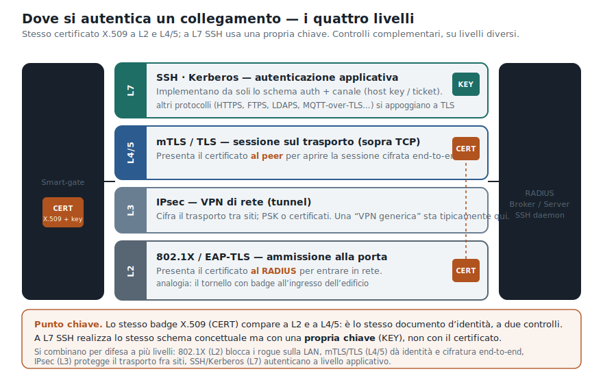

# Autenticazione di un collegamento — Guida alla scelta della tecnologia

> Materiale didattico di supporto alla **sezione "autenticazione"** di un compito di Sistemi e Reti.
> Risponde a una sola domanda: *dato un collegamento, quale meccanismo di autenticazione scelgo e perché?*

---

## Premessa: "autenticazione" non è un asse solo

L'errore più comune nei compiti è trattare l'autenticazione come una scelta unica fra protocolli (es. "802.1X **oppure** mTLS"). In realtà vanno tenuti separati **tre assi ortogonali**:

1. **Chi/cosa** autentichi — una macchina/dispositivo terminale, un utente umano, un servizio/processo.
2. **Dove** lo fai — il livello dello stack: ammissione alla rete (L2), canale (L3), sessione applicativa (L7).
3. **Quanto forte** è il metodo — debole / media / forte, riconducibile ai fattori ISO 27001 e ai livelli di garanzia LoA-eIDAS.

Solo dopo aver fissato i tre assi si sceglie la tecnologia. La maggior parte delle combinazioni "sbagliate" nasce dal confondere l'asse 2 (dove) con l'asse 3 (forza).

---

## 1. I fattori di autenticazione (asse della forza)

  

La forza di un'autenticazione dipende da quanti e quali **fattori** usa. Un singolo fattore dà un'autenticazione debole/media; combinarne due di tipo diverso (2FA) dà un'autenticazione forte. L'efficacia di ogni fattore dipende sempre dalla **protezione del segreto**: nella sua conservazione (archivi sicuri, hash+salt) e nella sua comunicazione (meglio non trasmetterlo affatto, vedi sfida/risposta).

---

## 2. Il punto chiave: stesso certificato, punti diversi

802.1X e mTLS **sembrano** alternativi perché possono usare lo stesso certificato X.509 e la stessa PKI. Ma autenticano cose diverse, a livelli diversi, verso interlocutori diversi: sono **complementari**.

  

| | Presenta il certificato a… | Livello | Cosa impedisce |
|---|---|---|---|
| **802.1X / EAP-TLS** | RADIUS (NAC) | L2 — ammissione alla porta | accesso rogue alla LAN (scansioni, ARP spoofing, attacco agli apparati che non parlano mTLS) |
| **mTLS** | il peer applicativo (es. broker) | L7 — sessione | client fasullo verso il servizio; garantisce cifratura end-to-end attraverso la WAN |

Per questo in un progetto serio coesistono: il **tornello con badge** all'ingresso (802.1X) **e** il controllo del documento nella stanza dove parli (mTLS).

---

## 3. Tabella — macchine / dispositivi terminali

| Metodo | Fattore (cosa "ha" la macchina) | Livello | Mutua? | Forza | Esempio tipico |
|---|---|---|:---:|:---:|---|
| **802.1X / EAP-TLS** | certificato X.509 + chiave privata | L2 | sì | forte | NAC sulle porte degli switch, anti-rogue |
| **802.1X + MAB/profiling** | indirizzo MAC + euristiche | L2 | no | debole | fallback per dispositivi legacy |
| **mTLS (X.509 bilaterale)** | certificato + chiave privata | L7 | sì | forte | dispositivo ↔ broker MQTT; nodo edge ↔ join server |
| **TLS server-side + credenziale device** | cert lato server + segreto device | L7 | no | media | client MQTT con username/password su TLS |
| **Pre-shared key (PSK)** | segreto simmetrico condiviso | L2/L3/L7 | sì | media | LoRaWAN OTAA: AppKey 128 bit → AppSKey/NwkSKey |
| **MIC / AES-CMAC sul frame** | chiave di sessione (NwkSKey) | L2 (LoRaWAN) | implicita | media-forte | autenticazione + integrità del frame |
| **IPsec (PSK o certificati)** | PSK oppure certificato | L3 | sì | media/forte | VPN site-to-site di backup |

> **Nota.** PSK e certificati sono fattori diversi e **nessuno dei due è "mTLS" di per sé**. LoRaWAN autentica i nodi via PSK (AppKey) e MIC, senza PKI sul lato radio; mTLS compare solo più in alto, sul canale IP edge↔backend.

---

## 4. Tabella — utenti / servizi / processi (livello applicativo)

| Metodo | Fattore | Mutua? | Forza / LoA | Esempio tipico |
|---|---|:---:|:---:|---|
| **Password (PAP)** su canale già sicuro | sai | no | debole — LoA1/2 | account utente; password con bcrypt/argon2 |
| **Challenge-response (CHAP)** | sai + nonce | no (no auth server) | media | autenticazione senza inviare il segreto in chiaro |
| **2FA / TOTP** | sai + hai | no di per sé | forte — LoA3 | MFA sulle funzioni che muovono denaro |
| **OAuth 2.0 + OpenID Connect** | token su password/MFA | no (federata) | media-forte | login app, `Authorization: Bearer <JWT>`, Auth Code + PKCE |
| **Asimmetrica, sfida firmata (TLS server)** | hai (chiave privata) | no | forte | il server si autentica con cert + firma sulla sfida |
| **mTLS / asimmetrica mutua** | hai (chiave privata) su entrambi i lati | sì (3-way) | forte — LoA4 | servizio↔servizio; utente solo in contesti ad alta garanzia (smartcard/CIE) |
| **DH effimero firmato (DHE/ECDHE)** | hai + nonce DH firmati | sì | forte + **PFS** | autenticazione *e* chiave di sessione effimera insieme |

> **Attenzione alla formulazione.** Per servizi/processi mTLS è lo standard forte. Per gli **utenti umani**, al livello applicativo, la norma è **token federati (OAuth/OIDC) + MFA**; il certificato client sull'utente compare solo al LoA4 (chiave su hardware tamper-resistant). Quindi: *forte ≠ automaticamente mTLS*, nemmeno per gli utenti.

---

## 5. Matrice: livello × forza

La stessa informazione delle due tabelle, vista come griglia. Utile per capire al volo che lo **stesso certificato** vive in celle diverse (EAP-TLS a L2, mTLS a L7).

  

---

## 6. Forza e livelli di garanzia (LoA / eIDAS)

L'asse della forza si aggancia ai livelli di garanzia normati:

| Forza | LoA | eIDAS | Tipico requisito |
|---|:---:|---|---|
| Debole | LoA1 | — | nessuna verifica identità; password anche su canale da rendere sicuro |
| Media | LoA2 | basso | qualche verifica identità; singolo fattore; resistenza a replay/intercettazione |
| Forte | LoA3 | substantial | multi-fattore; crittografia contro intercettazione, replay, MITM |
| Forte+ | LoA4 | high | verifica identità in presenza; **chiavi in hardware tamper-resistant** (TPM/smartcard) |

La regola di scelta è **legata al rischio**: maggiore è il danno potenziale di un'autenticazione errata (perdita finanziaria, dati sensibili, sicurezza personale), più alto il LoA richiesto.

---

## 7. Albero decisionale

  

**Come usarlo nel compito**, in quattro mosse:

1. **L2 e L7 si sommano**, non si escludono: ammissione in rete (802.1X) *più* sessione applicativa (mTLS).
2. **Canale insicuro** (Internet/WAN) → serve autenticazione **forte** (asimmetrica/certificati); la password va solo dentro un tunnel cifrato.
3. **Movimenti di denaro o dati sensibili** → alza il LoA: MFA per gli utenti, hardware sicuro per le chiavi (LoA4).
4. **Certificato ≠ mTLS**: lo stesso certificato può servire EAP-TLS (L2), TLS lato-server (L7) o mTLS (L7 mutuo).

---

## 8. Come funziona l'autenticazione mutua forte

Quando il compito chiede l'autenticazione **forte e mutua** (tipica di mTLS e dei servizi), il meccanismo è uno scambio sfida/risposta a tre vie basato sulla firma asimmetrica.

  

Idea di fondo: chi verifica invia una **sfida fresca** (nonce); solo chi possiede la **chiave privata** può produrre la firma corretta. Il certificato (firmato da una CA fidata) serve solo ad autenticare la chiave pubblica con cui si verifica la firma. Con sfide Diffie-Hellman effimere (DHE/ECDHE) si ottiene anche la **Perfect Forward Secrecy**.

---

## 9. Errori da evitare nel compito

- ❌ "Uso 802.1X **oppure** mTLS." → Sono a livelli diversi: spesso si usano **entrambi**.
- ❌ "Metto un certificato, quindi è mTLS." → Il certificato è una credenziale; mTLS è *come e dove* la si usa (mutua, a L7).
- ❌ "Autentico con PAP/password su Internet." → La password va solo su canale già sicuro o dentro un tunnel.
- ❌ "CHAP autentica anche il server." → No: CHAP non realizza l'autenticazione del server.
- ❌ "I sensori LoRaWAN fanno mTLS." → Sul lato radio usano PSK (AppKey) + MIC; mTLS è sul canale IP a valle.
- ❌ "LoA4 = password molto lunga." → LoA4 richiede multi-fattore e **chiavi in hardware anti-manomissione**.

---

## 10. Glossario rapido delle sigle

| Sigla | Significato |
|---|---|
| **802.1X** | controllo d'accesso alla rete port-based (L2), basato su EAP |
| **EAP-TLS** | metodo EAP con autenticazione tramite certificati |
| **MAB** | MAC Authentication Bypass: ammissione basata sul solo MAC |
| **NAC** | Network Access Control |
| **RADIUS** | server AAA che decide l'ammissione in rete |
| **mTLS** | mutual TLS: autenticazione bilaterale a certificati a L7 |
| **PSK** | Pre-Shared Key, chiave segreta simmetrica condivisa |
| **MIC** | Message Integrity Code (in LoRaWAN, via AES-CMAC) |
| **OTAA** | Over-The-Air Activation (provisioning chiavi LoRaWAN) |
| **PAP / CHAP** | protocolli password / sfida-risposta |
| **OTP / TOTP** | one-time password / OTP basata sul tempo |
| **OAuth 2.0 / OIDC** | delega di autorizzazione / livello di identità sopra OAuth |
| **MFA / 2FA** | autenticazione a più / due fattori |
| **PFS** | Perfect Forward Secrecy (chiavi di sessione effimere) |
| **DHE / ECDHE** | Diffie-Hellman effimero (anche su curve ellittiche) |
| **LoA** | Level of Assurance (garanzia dell'autenticazione) |
| **eIDAS** | regolamento UE sui livelli di identità elettronica |
| **TPM / HSM** | moduli hardware sicuri per la custodia delle chiavi |
