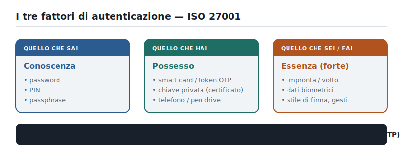
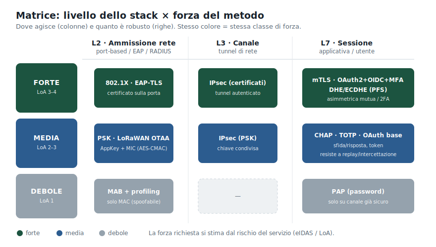
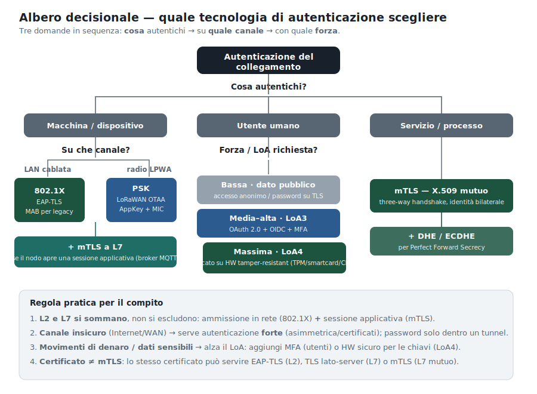
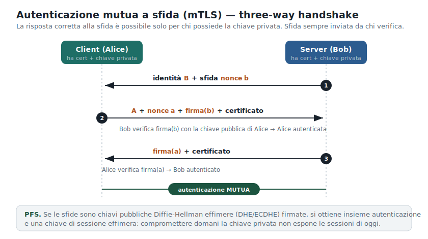
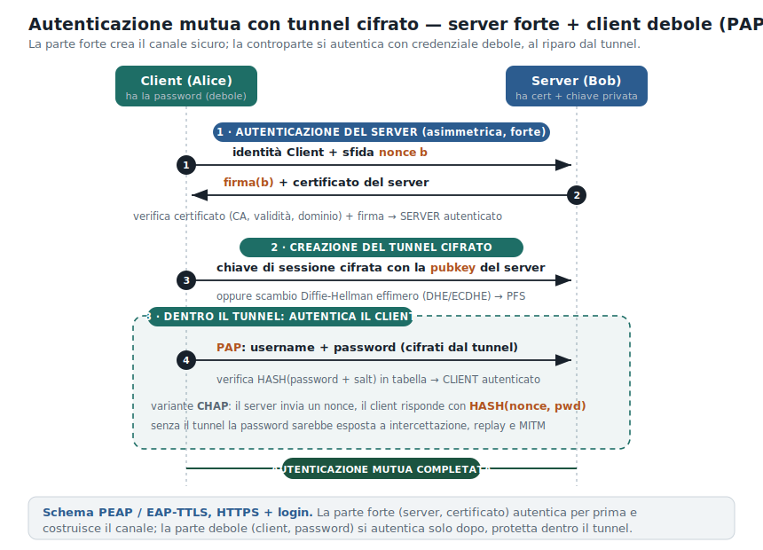

>[Torna a reti di sensori](../sensornetworkshort.md)>[Torna a reti ethernet](../archeth.md)

- [Dettaglio architettura Zigbee](../archzigbee.md)
- [Dettaglio architettura BLE](../archble.md)
- [Dettaglio architettura WiFi infrastruttura](../archwifi.md)
- [Dettaglio architettura WiFi mesh](../archmesh.md) 
- [Dettaglio architettura LoraWAN](../lorawanclasses.md) 

# Autenticazione di un collegamento — Guida alla scelta della tecnologia

> Materiale didattico di supporto alla **sezione "autenticazione"** di un compito di Sistemi e Reti.
> Risponde a una sola domanda: *dato un collegamento, quale meccanismo di autenticazione scelgo e perché?*

---

## Premessa: "autenticazione" non è un asse solo

L'errore più comune nei compiti è trattare l'autenticazione come una scelta unica fra protocolli (es. "802.1X **oppure** mTLS"). In realtà vanno tenuti separati **tre assi ortogonali**:

1. **Chi/cosa** autentichi — una macchina/dispositivo terminale, un utente umano, un servizio/processo.
2. **Dove** lo fai — il livello dello stack: ammissione alla rete (L2), canale (L3), sessione applicativa (L7).
3. **Quanto forte** è il metodo — debole / media / forte, riconducibile ai fattori ISO 27001 e ai livelli di garanzia LoA-eIDAS.

Solo dopo aver fissato i tre assi si sceglie la tecnologia. La maggior parte delle combinazioni "sbagliate" nasce dal confondere l'asse 2 (dove) con l'asse 3 (forza).

---

## 1. I fattori di autenticazione (asse della forza)

  

La forza di un'autenticazione dipende da quanti e quali **fattori** usa. Un singolo fattore dà un'autenticazione debole/media; combinarne due di tipo diverso (2FA) dà un'autenticazione forte. L'efficacia di ogni fattore dipende sempre dalla **protezione del segreto**: nella sua conservazione (archivi sicuri, hash+salt) e nella sua comunicazione (meglio non trasmetterlo affatto, vedi sfida/risposta).

---

# Autenticazione reciproca dei nodi di infrastruttura

L'autenticazione del Punto 4 riguarda gli **utenti**; qui si tratta l'autenticazione **fra apparati e servizi**, che è di natura **mutua** (nessuna delle due parti è "il browser di un umano" da fidare a senso unico) e va realizzata **su canali insicuri** (l'aria del Wi-Fi/mesh, Internet fra cantiere e sede, la rete IP edge↔backend). A seconda della qualità dei nodi:
- dove i nodi lo supportano si usa l'**autenticazione forte asimmetrica (a certificati)**;
- sui **nodi a risorse limitate** che non reggono una PKI/TLS, tipicamente i **sensori** sul lato radio, si ricorre all'**autenticazione mutua a chiave pre-condivisa (PSK)**.

I meccanismi non si escludono: vivono a **livelli diversi** dello stack (802.1X a L2, mTLS/TLS a L4/5, IPsec a L3, SSH/Kerberos a L7) e tipicamente **coesistono**.

## 2. Autenticazione PSK

Due modi di gestire la chiave sui nodi IoT (livello di accesso):

- **A — PSK condivisa:** un'unica passphrase **uguale per tutti** i nodi che si associano
  all'access point. Semplicissima, ma fragile: se il segreto trapela, **cadono tutti insieme**.
- **B — Chiave per-dispositivo:** ogni nodo ha la **sua** chiave, diversa dalle altre. È il modello
  di **LoRaWAN**: ogni device possiede una chiave radice unica e, tramite la procedura di **join
  OTAA** gestita dal **Join Server**, ne derivano chiavi di sessione distinte. Si ottengono
  **isolamento** e **revoca per singolo nodo** tipici della PKI, restando però nel mondo simmetrico,
  leggero e adatto ai dispositivi vincolati.

  

Ecco una versione astratta, con due sole chiavi: una **radice** (segreta, condivisa in anticipo) e una **di sessione** (derivata).

**Idea di fondo:** la chiave di sessione non si trasmette mai — si *ricalcola* uguale ai due estremi a partire da un segreto che già condividono.

1. **All'inizio** il dispositivo e il server conoscono la stessa **chiave radice K**, unica per quel dispositivo.
2. **Al collegamento** i due si scambiano un **numero casuale fresco** (un *nonce*).
3. **Ognuno per conto suo** calcola la **chiave di sessione** così:
   `K_sessione = AES(K, nonce)`

**Perché funziona:** il risultato è identico sui due lati (stessi ingredienti, stessa funzione), ma non viaggia mai in chiaro; cambia a ogni collegamento (il nonce è nuovo) ed è diverso per ogni dispositivo (la radice K è unica). La radice resta segreta e non si consuma mai.

In una riga: *da una chiave segreta fissa + un numero casuale → una chiave usa-e-getta per la sessione.*

## 3. Autenticazione asimmetrica forte 

Può essere realizzata a vari livelli della pila ISO/OSI e addirittura utilizzando lo stesso certificato in punti diversi.

802.1X e mTLS **sembrano** alternativi perché possono usare lo stesso certificato X.509 e la stessa PKI. Ma autenticano cose diverse, a livelli diversi, verso interlocutori diversi: sono **complementari**.

  

| | Presenta il certificato a… | Livello | Cosa impedisce |
|---|---|---|---|
| **802.1X / EAP-TLS** | RADIUS (NAC) | L2 — ammissione alla porta | accesso rogue alla LAN (scansioni, ARP spoofing, attacco agli apparati che non parlano mTLS) |
| **mTLS** | il peer applicativo (es. broker) | L4/5 — sessione sul trasporto | client fasullo verso il servizio; garantisce cifratura end-to-end attraverso la WAN |

Per questo in un progetto serio coesistono: 
- controllo di **accesso alla rete LAN** (802.1X), metafora umana: il **tornello con badge** all'ingresso dell'edificio.
- il controllo di **accesso al servizio specifico** (mTLS), metafora umana: controllo del documento prima di accedere alla sala di pulizia dei gioielli della  corona.

La figura colloca anche gli altri due piani: 
- **L3** è dove vive la classica **VPN** (IPsec)
- **L7** è dove **SSH** e **Kerberos** autenticano a livello applicativo con una chiave propria, non con il certificato X.509.

---

## 4. Tabella — macchine / dispositivi terminali

| Metodo | Fattore (cosa "ha" la macchina) | Livello | Mutua? | Forza | Esempio tipico |
|---|---|---|:---:|:---:|---|
| **802.1X / EAP-TLS** | certificato X.509 + chiave privata | L2 | sì | forte | NAC sulle porte degli switch, anti-rogue |
| **802.1X + MAB/profiling** | indirizzo MAC + euristiche | L2 | no | debole | fallback per dispositivi legacy |
| **mTLS (X.509 bilaterale)** | certificato + chiave privata | L4/5 | sì | forte | dispositivo ↔ broker MQTT; nodo edge ↔ join server |
| **TLS server-side + credenziale device** | cert lato server + segreto device | L4/5 | no | media | client MQTT con username/password su TLS |
| **Pre-shared key (PSK)** | segreto simmetrico condiviso | L2/L3/L7 | sì | media | LoRaWAN OTAA: AppKey 128 bit → AppSKey/NwkSKey |
| **MIC / AES-CMAC sul frame** | chiave di sessione (NwkSKey) | L2 (LoRaWAN) | implicita | media-forte | autenticazione + integrità del frame |
| **IPsec (PSK o certificati)** | PSK oppure certificato | L3 | sì | media/forte | VPN site-to-site di backup |

> **Nota.** PSK e certificati sono fattori diversi e **nessuno dei due è "mTLS" di per sé**. LoRaWAN autentica i nodi via PSK (AppKey) e MIC, senza PKI sul lato radio; mTLS compare solo più in alto, sul canale IP edge↔backend.

---

## 5. Tabella — utenti / servizi / processi (livello applicativo)

| Metodo | Fattore | Mutua? | Forza / LoA | Esempio tipico |
|---|---|:---:|:---:|---|
| **Password (PAP)** su canale già sicuro | sai | no | debole — LoA1/2 | account utente; password con bcrypt/argon2 |
| **Challenge-response (CHAP)** | sai + nonce | no (no auth server) | media | autenticazione senza inviare il segreto in chiaro |
| **2FA / TOTP** | sai + hai | no di per sé | forte — LoA3 | MFA sulle funzioni che muovono denaro |
| **OAuth 2.0 + OpenID Connect** | token su password/MFA | no (federata) | media-forte | login app, `Authorization: Bearer <JWT>`, Auth Code + PKCE |
| **JWT / bearer token** (OAuth2 Client Credentials) | hai (token; o firma con chiave privata) | no (bearer) | media → forte | servizio↔servizio M2M; `Authorization: Bearer <JWT>` |
| **Asimmetrica, sfida firmata (TLS server)** | hai (chiave privata) | no | forte | il server si autentica con cert + firma sulla sfida |
| **mTLS / asimmetrica mutua** | hai (chiave privata) su entrambi i lati | sì (3-way) | forte — LoA4 | servizio↔servizio; utente solo in contesti ad alta garanzia (smartcard/CIE) |
| **DH effimero firmato (DHE/ECDHE)** | hai + nonce DH firmati | sì | forte + **PFS** | autenticazione *e* chiave di sessione effimera insieme |

> **Attenzione alla formulazione.** Per servizi/processi mTLS è lo standard forte. Per gli **utenti umani**, al livello applicativo, la norma è **token federati (OAuth/OIDC) + MFA**; il certificato client sull'utente compare solo al LoA4 (chiave su hardware tamper-resistant). Quindi: *forte ≠ automaticamente mTLS*, nemmeno per gli utenti.

> **JWT per i servizi (M2M).** Un web service si autentica spesso con un **JWT** ottenuto via OAuth 2.0 *Client Credentials*, presentato come `Authorization: Bearer <JWT>`. Differenza chiave rispetto a mTLS: il JWT è un *bearer* — **viaggia sul filo** e chi lo possiede lo può usare, quindi è replayabile fino alla scadenza se trafugato. Mitigazioni: TTL breve, validazione di `issuer`/`audience`, TLS, e soprattutto i token *sender-constrained* (**DPoP**, RFC 9449; o **mTLS-bound**, RFC 8705) che legano il token a una chiave. La forza sale a forte se il servizio si autentica con `private_key_jwt` (firma asimmetrica, RFC 7523). mTLS e JWT non si escludono: tipicamente **mTLS = identità del servizio**, **JWT = autorizzazione (claims/scope)**.

---

## 6. Matrice: livello × forza

La stessa informazione delle due tabelle, vista come griglia. Utile per capire al volo che lo **stesso certificato** vive in celle diverse (EAP-TLS a L2, mTLS a L4/5).

  

> **Precisazione sui livelli OSI.** TLS/mTLS **non** è un protocollo applicativo: opera **sopra TCP**, a livello **sessione/presentazione (L4/5)**, e mette in sicurezza il trasporto su cui poi viaggiano i protocolli di L7. **SSH** invece è di **L7** e implementa *al proprio interno* lo stesso schema concettuale (autenticazione asimmetrica del server → canale cifrato → autenticazione del client). Stessa idea, livelli diversi.
>
> A L7 i protocolli che reimplementano questo schema da soli sono pochi: **SSH** è il principale; **Kerberos** è l'altro grande protocollo di autenticazione nativo di L7 (ma a *ticket* tramite KDC, non "canale-poi-credenziale"). Quasi tutti gli altri protocolli applicativi (**HTTPS, FTPS, LDAPS, SMTPS, AMQPS, MQTT-over-TLS, gRPC**) non reinventano nulla: si appoggiano a TLS di L4/5. I token applicativi (**OAuth/JWT**) sono anch'essi di L7, ma *bearer*, non un handshake di canale.

---

## 7. Forza e livelli di garanzia (LoA / eIDAS)

L'asse della forza si aggancia ai livelli di garanzia normati:

| Forza | LoA | eIDAS | Tipico requisito |
|---|:---:|---|---|
| Debole | LoA1 | — | nessuna verifica identità; password anche su canale da rendere sicuro |
| Media | LoA2 | basso | qualche verifica identità; singolo fattore; resistenza a replay/intercettazione |
| Forte | LoA3 | substantial | multi-fattore; crittografia contro intercettazione, replay, MITM |
| Forte+ | LoA4 | high | verifica identità in presenza; **chiavi in hardware tamper-resistant** (TPM/smartcard) |

La regola di scelta è **legata al rischio**: maggiore è il danno potenziale di un'autenticazione errata (perdita finanziaria, dati sensibili, sicurezza personale), più alto il LoA richiesto.

---

## 8. Albero decisionale

  

**Come usarlo nel compito**, in quattro mosse:

1. **I livelli si sommano**, non si escludono: ammissione in rete (802.1X, L2) *più* sessione cifrata (mTLS, L4/5).
2. **Canale insicuro** (Internet/WAN) → serve autenticazione **forte** (asimmetrica/certificati); la password va solo dentro un tunnel cifrato.
3. **Movimenti di denaro o dati sensibili** → alza il LoA: MFA per gli utenti, hardware sicuro per le chiavi (LoA4).
4. **Certificato ≠ mTLS**: lo stesso certificato può servire EAP-TLS (L2), TLS lato-server (L4/5) o mTLS (L4/5 mutuo).

---

## 9. Come funziona l'autenticazione mutua forte

Quando il compito chiede l'autenticazione **forte e mutua** (tipica di mTLS e dei servizi), il meccanismo è uno scambio sfida/risposta a tre vie basato sulla firma asimmetrica.

  

Idea di fondo: chi verifica invia una **sfida fresca** (nonce); solo chi possiede la **chiave privata** può produrre la firma corretta. Il certificato (firmato da una CA fidata) serve solo ad autenticare la chiave pubblica con cui si verifica la firma. Con sfide Diffie-Hellman effimere (DHE/ECDHE) si ottiene anche la **Perfect Forward Secrecy**.

> **Lo stesso schema, livelli diversi.** Questo handshake è quello di **TLS/mTLS** a **L4/5**. Lo **stesso schema concettuale** è realizzato da **SSH** a **L7**: SSH autentica il server con la *host key*, costruisce il canale cifrato e poi autentica il client (chiave pubblica o password). Cambia il livello OSI, non la logica.

### 9.1 Autenticazione mutua col tunnel (server forte + client debole dentro)

Non sempre entrambe le parti hanno un certificato. Il caso più frequente sul web è asimmetrico: il **server** è forte (certificato), il **client/utente** è debole (password). La soluzione è far autenticare per prima la parte forte, che **crea il canale cifrato**, e far autenticare la parte debole **dentro** quel tunnel.

  

Le tre fasi:

1. **Autenticazione del server (asimmetrica, forte).** Il client invia una sfida; il server risponde con la firma sulla sfida e il proprio certificato. Il client lo valida (CA fidata, periodo di validità, dominio = URL) e verifica la firma → server autenticato.
2. **Creazione del tunnel cifrato.** Il client invia una chiave di sessione cifrata con la chiave pubblica del server (semplice, ma *senza* PFS), oppure le due parti eseguono uno scambio Diffie-Hellman effimero (DHE/ECDHE) ottenendo una chiave di sessione effimera (*con* PFS).
3. **Autenticazione del client dentro il tunnel.** Solo ora il client invia la credenziale debole: **PAP** (username + password) cifrati dal tunnel, oppure **CHAP** (il server invia un nonce, il client risponde con `HASH(nonce, password)`). Il server verifica e l'autenticazione mutua è completa.

È esattamente lo schema di **PEAP / EAP-TTLS** e di **HTTPS + login** (TLS a L4/5), ed è anche quello di **SSH con password** a L7 (host key → canale → password del client): il livello esterno autentica il server e costruisce il canale, il metodo interno (password) autentica il client al riparo. Senza il tunnel, PAP sarebbe esposto a intercettazione, replay e MITM — per questo PAP/CHAP "da soli" vanno usati solo su canale già sicuro.

---

## 10. Errori da evitare nel compito

- ❌ "Uso 802.1X **oppure** mTLS." → Sono a livelli diversi: spesso si usano **entrambi**.
- ❌ "Metto un certificato, quindi è mTLS." → Il certificato è una credenziale; mTLS è *come e dove* la si usa (mutua, a L4/5).
- ❌ "Autentico con PAP/password su Internet." → La password va solo su canale già sicuro o dentro un tunnel.
- ❌ "CHAP autentica anche il server." → No: CHAP non realizza l'autenticazione del server.
- ❌ "I sensori LoRaWAN fanno mTLS." → Sul lato radio usano PSK (AppKey) + MIC; mTLS è sul canale IP a valle.
- ❌ "LoA4 = password molto lunga." → LoA4 richiede multi-fattore e **chiavi in hardware anti-manomissione**.

---

## 10. Hardware tamper-resistant per la chiave privata

[#10-hardware-tamper-resistant-per-la-chiave-privata](#10-hardware-tamper-resistant-per-la-chiave-privata)

> Approfondimento del concetto introdotto al §6 (LoA4, «chiavi in hardware tamper-resistant»): finora la dispensa lo cita senza spiegare *cosa* sia e *con quali tecnologie* si realizzi.

Tutta la guida ruota su una frase: *solo chi possiede la chiave privata può produrre la firma corretta* (§8). Ma questa garanzia vale **quanto vale la protezione della chiave**. Una chiave RSA/ECC in un file `.pem` sul disco è forte come una password scritta su un foglietto: chi prende il file prende l'identità. Per questo ai livelli alti (LoA4 / **AAL3** del NIST) non basta *avere* una chiave: la chiave deve **nascere dentro un chip sicuro, non uscirne mai** (*non-exportable*), e tutte le operazioni crittografiche devono avvenire **a bordo** del chip. Il software vede solo il risultato (la firma), mai il segreto.

La protezione fisica si gradua su tre livelli, di robustezza crescente:

| Grado | Cosa fa | Esempio |
| ----------------------- | ----------------------------------------------------------------- | ----------------------------------------------- |
| **Tamper-evident** | lascia traccia visibile della manomissione (rivestimenti, sigilli) | involucri opachi dei TPM |
| **Tamper-resistant** | rende difficile l'effrazione senza distruggere il dispositivo | mesh anti-probing, schermature di bus/memoria |
| **Tamper-responsive** | reagisce alla manomissione **azzerando** le chiavi (*zeroization*) | HSM di fascia alta, FIPS 140-3 Livello 3/4 |

---

### Le tecnologie usate oggi

Sono tutte varianti della stessa idea — *custodire la chiave ed eseguire la crittografia in hardware* — declinata per costo, forma e contesto d'uso.

| Tecnologia | Dove vive | Uso tipico | Certificazione tipica |
| --------------------------------------------- | --------------------------------------- | ---------------------------------------------------------------- | ------------------------------------------------ |
| **HSM** (di rete, PCIe, USB) | server, datacenter | chiavi di **CA**, code signing, terminazione TLS, QSCD remoto | FIPS 140-3 L3 (L4 per alta sicurezza), CC EN 419 221-5 |
| **TPM 2.0** (discreto o *firmware* fTPM) | PC, server, gateway IoT | secure boot, *attestation*, identità di dispositivo, secure storage | FIPS 140-3 / FIPS 140-2 |
| **Secure Element (SE)** | microcontrollori, IoT (bus I²C/SPI) | identità di dispositivo (IDevID), Matter DAC; costo ~0,5–5 $/pezzo | Common Criteria |
| **Secure Enclave / StrongBox / TEE-TrustZone** | smartphone (iOS/Android) | passkey, firma, **QSCD** del wallet EUDI | CC / certificazione QSCD |
| **Smartcard / token PIV-CAC** | utente umano | autenticazione forte in presenza, accesso ad alta garanzia | FIPS 140-3, CC |
| **Chiave di sicurezza FIDO2 / passkey device-bound** (es. YubiKey) | utente umano | login phishing-resistant, **AAL3** | FIPS 140-3 |
| **PUF** (*Physically Unclonable Function*) | silicio del dispositivo | chiave derivata dalle micro-variazioni del chip: *non c'è una chiave da rubare* | — |

> **Il punto che conta per il compito.** È **questo** che distingue il LoA4 dal LoA3: non «una password più lunga» né «un certificato in più», ma il fatto che la chiave privata **non sia estraibile** dal modulo. Lo stesso certificato X.509 usato per EAP-TLS (§2/§3) o mTLS (§4) diventa *forte+* solo quando la chiave corrispondente sta in un TPM, una smartcard o un SE, e non in un file. **HSM e TPM** sono già nel glossario finale come «moduli hardware sicuri per la custodia delle chiavi»: questa sezione spiega *perché*.

---

### Le certificazioni (come si misura «quanto è sicuro»)

Non basta dire «hardware»: la robustezza si certifica con due famiglie di standard.

- **FIPS 140-3** (NIST). È lo standard federale USA per i moduli crittografici, e **sostituisce FIPS 140-2** (tutti i certificati 140-2 passano alla *Historical List* il **21 settembre 2026**). Quattro livelli fisici crescenti: L1 nessun requisito fisico; **L2** tamper-evident; **L3** rilevazione/risposta con azzeramento delle chiavi; **L4** involucro di protezione completo. La maggior parte degli HSM commerciali punta al **L3**.
- **Common Criteria** (EAL) e, in ambito UE, i *Protection Profile* dedicati — in particolare **EN 419 221-5** («Cryptographic Module for Trust Services»), il profilo richiesto ai moduli che reggono i servizi fiduciari europei (firme qualificate, ecc.).

---

### Cosa sta cambiando: NIST, NIS2, eIDAS/GDPR

L'hardware tamper-resistant sta passando da «buona pratica» a **requisito normativo esplicito**. Tre fronti in evoluzione proprio nel 2025–2026:

**NIST — Stati Uniti (rilevante anche in UE come riferimento de facto)**
- **FIPS 140-3**: transizione di fatto obbligatoria entro **settembre 2026** per i nuovi sistemi federali; i fornitori si stanno già adeguando (TPM, HSM Luna, YubiHSM 2 e YubiKey FIPS sono tra i primi moduli validati 140-3).
- **SP 800-63-4** (versione finale **luglio/agosto 2025**): irrigidisce gli *Authenticator Assurance Level*. L'**AAL3** richiede ora esplicitamente un autenticatore **hardware con chiave privata non esportabile** e **resistenza al phishing** (FIDO2/passkey *device-bound*, PIV/smartcard); l'**AAL2** deve almeno **offrire** un'opzione phishing-resistant. Le *passkey sincronizzabili* (cloud) sono ammesse solo fino ad AAL2 — per l'AAL3 serve la chiave legata all'hardware.
- **Post-quantum (PQC)**: i nuovi standard **FIPS 203 / 204 / 205** (ML-KEM, ML-DSA, SLH-DSA) stanno entrando negli HSM e nel TPM 2.0 via aggiornamento firmware (*crypto-agility*); molti Secure Element attuali, invece, non li supportano ancora — vincolo da considerare per i dispositivi IoT a vita lunga.

**Unione Europea**
- **eIDAS 2.0** (Reg. UE **2024/1183**): conferma e rafforza il concetto di **QSCD** (*Qualified Signature Creation Device*), che per definizione deve garantire che la **chiave privata non sia estraibile né copiabile** e sia utilizzabile solo con un'**azione volontaria** del firmatario. Novità chiave: il **Wallet europeo di identità digitale (EUDI Wallet)**, che ogni Stato membro deve rendere disponibile **entro dicembre 2026**, può fungere da QSCD usando il **secure enclave / StrongBox dello smartphone** — la firma qualificata «esce» dalla smartcard fisica e si appoggia all'hardware del telefono. La validità della certificazione di un QSCD è inoltre **limitata a 5 anni**.
- **NIS2** (Dir. UE **2022/2555**): per le entità «essenziali» e «importanti» impone misure di gestione del rischio che includono l'**autenticazione forte/MFA**; la custodia hardware delle chiavi è una delle misure tecniche con cui si dimostra l'adeguatezza.
- **GDPR**: non parla di hardware in modo esplicito, ma l'**art. 32** («sicurezza del trattamento … tenuto conto dello stato dell'arte») e la **privacy-by-design** dell'**art. 25** rendono la protezione hardware della chiave una **misura tecnica difendibile** in caso di audit o data breach. eIDAS 2.0, NIS2 e GDPR sono pensati per essere **allineati**: il Wallet EUDI, ad esempio, incorpora per progetto sia la *data minimization* del GDPR sia i requisiti di sicurezza NIS2.

> **Errore da evitare (da aggiungere idealmente al §9).** ❌ «LoA4/AAL3 = certificato + password robusta.» → No: serve una **chiave non esportabile in hardware tamper-resistant**. La regola mnemonica: *la chiave deve nascere e morire dentro il chip*.

---

### Voci da aggiungere al glossario finale

| Sigla | Significato |
| ------------------ | ----------------------------------------------------------------------------------------------- |
| **HSM** | Hardware Security Module: modulo dedicato che genera/custodisce chiavi ed esegue crittografia a bordo |
| **TPM** | Trusted Platform Module: chip sicuro per secure boot, attestation e custodia chiavi su PC/server |
| **SE** | Secure Element: chip tamper-resistant a basso costo per identità di dispositivo (IoT) |
| **Secure Enclave / StrongBox / TEE** | aree hardware isolate dello smartphone per chiavi e operazioni crittografiche |
| **PUF** | Physically Unclonable Function: chiave derivata dalle variazioni fisiche del silicio |
| **FIPS 140-3** | standard NIST sui moduli crittografici (4 livelli fisici); sostituisce FIPS 140-2 dal 21/09/2026 |
| **Common Criteria / EAL** | schema internazionale di valutazione della sicurezza (EN 419 221-5 per i trust service UE) |
| **non-exportable key** | chiave che non può uscire dal modulo hardware: vi si firma, ma non la si può copiare |
| **QSCD** | Qualified Signature Creation Device: dispositivo certificato per la firma qualificata eIDAS |
| **EUDI Wallet** | European Digital Identity Wallet (eIDAS 2.0), disponibile in ogni Stato UE entro dicembre 2026 |
| **PQC** | Post-Quantum Cryptography: FIPS 203/204/205 (ML-KEM, ML-DSA, SLH-DSA) |
| **NIS2** | Direttiva UE 2022/2555 sulla cybersicurezza di entità essenziali e importanti |

---

## 11. Glossario rapido delle sigle

| Sigla | Significato |
|---|---|
| **802.1X** | controllo d'accesso alla rete port-based (L2), basato su EAP |
| **EAP-TLS** | metodo EAP con autenticazione tramite certificati |
| **MAB** | MAC Authentication Bypass: ammissione basata sul solo MAC |
| **NAC** | Network Access Control |
| **RADIUS** | server AAA che decide l'ammissione in rete |
| **mTLS** | mutual TLS: autenticazione bilaterale a certificati; opera a **L4/5**, sopra TCP |
| **PSK** | Pre-Shared Key, chiave segreta simmetrica condivisa |
| **MIC** | Message Integrity Code (in LoRaWAN, via AES-CMAC) |
| **OTAA** | Over-The-Air Activation (provisioning chiavi LoRaWAN) |
| **PAP / CHAP** | protocolli password / sfida-risposta |
| **OTP / TOTP** | one-time password / OTP basata sul tempo |
| **OAuth 2.0 / OIDC** | delega di autorizzazione / livello di identità sopra OAuth |
| **JWT** | JSON Web Token: token con claim firmati, usato come credenziale (spesso bearer) |
| **bearer token** | credenziale "di chi la possiede"; va protetta in transito (TLS) e con scadenza breve |
| **Client Credentials** | flusso OAuth2 per autenticazione service-to-service (M2M) |
| **mTLS-bound / DPoP** | token *sender-constrained*, legati a una chiave per impedirne il riuso se rubati |
| **SSH** | protocollo di **L7** che cifra e autentica (host key + auth del client); stesso schema di TLS ma applicativo |
| **Kerberos** | protocollo di autenticazione mutua di **L7** a *ticket*, con terza parte fidata (KDC) |
| **MFA / 2FA** | autenticazione a più / due fattori |
| **PFS** | Perfect Forward Secrecy (chiavi di sessione effimere) |
| **DHE / ECDHE** | Diffie-Hellman effimero (anche su curve ellittiche) |
| **LoA** | Level of Assurance (garanzia dell'autenticazione) |
| **eIDAS** | regolamento UE sui livelli di identità elettronica |
| **TPM / HSM** | moduli hardware sicuri per la custodia delle chiavi |
