>[Torna a reti di sensori](../sensornetworkshort.md)>[Torna a reti ethernet](../archeth.md)

- [Dettaglio architettura Zigbee](../archzigbee.md)
- [Dettaglio architettura BLE](../archble.md)
- [Dettaglio architettura WiFi infrastruttura](../archwifi.md)
- [Dettaglio architettura WiFi mesh](../archmesh.md) 
- [Dettaglio architettura LoraWAN](../lorawanclasses.md) 

# Autenticazione Utente — Tecniche e protocolli

## 1. Fasi di una autenticazione

  - Si autenticano gli utenti della comunicazione svolgendo in sequenza le due fasi:
    .1 fase di scambio e registrazione delle credenziali
    .2 fase di verifica delle credenziali
  - Credenziali:
       - informazioni univoche associate ad un certo utente
       - Sono direttamente o indirettamente collegate ad un segreto condiviso

## 2. Fattori di autenticazione: classificazione

- In base a ISO 27001, il processo di autenticazione di un utente che vuole accedere alle risorse di un sistema può avvenire in base a tre criteri possibili :
  - La conoscenza di un segreto (quello che l’utente sa: una password, un PIN)
  - Il possesso di un segreto (quello che l’utente ha: smart card,  pen drive, telefonino)
  - L’essenza propria o autenticazione “forte” (quello che l’utente è o fa : impronta digitale, dati biometrici, stile della firma, movimenti, ecc.)
- L’efficacia di tutti i criteri dipende dalla protezione del segreto che deve essere sempre garantita anche nel caso dei dati biometrici:
  - Dalla sua conservazione: deve essere memorizzato in archivi sicuri
  - Dalla sua comunicazione: deve essere adeguatamente protetta (meglio ancora se si evita il più possibile di comunicarlo)

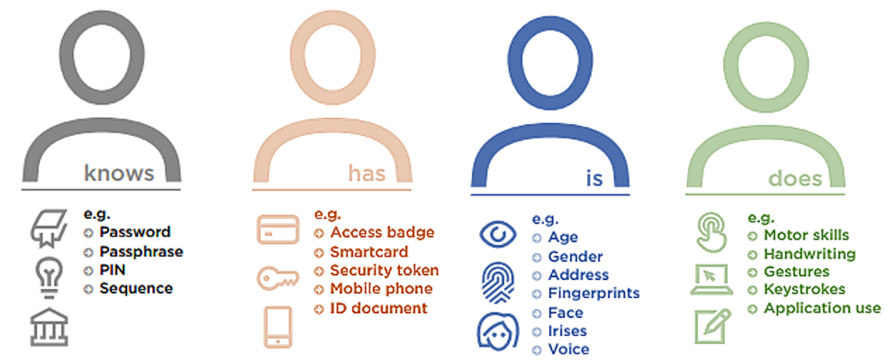

## 3. Attacchi informatici

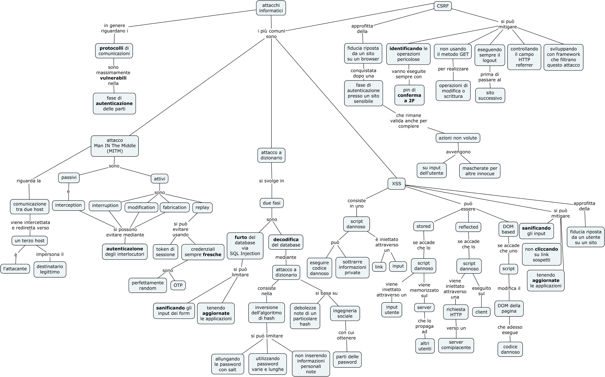
 

### 3.1 Tipi di attacco

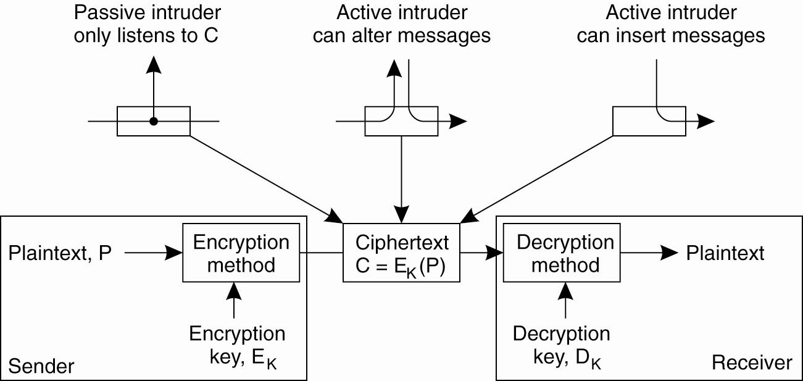

- Anche se gli algoritmi di cifratura sono molto sicuri spesso i protocolli di sicurezza che li utilizzano lo sono molto meno: se un messaggio non può essere decifrato le parti che lo scambiano possono essere imbrogliate
- Punto debole: fase di autenticazione delle parti

**Attori e ruoli in un attacco:**
- Alice and Bob. Generalmente Alice vuole mandare un messaggio a Bob.
- Carol o Charlie, è il terzo partecipante alla comunicazione.
- Chuck, un terzo partecipante avente intenzioni fraudolente.
- Dave, il quarto partecipante, e così avanti in ordine alfabetico.
- Eve, (eavesdropper), è di solito un attaccante passiva. Può ascoltare i messaggi tra Alice e Bob, ma non può modificarli. Nella crittografia quantistica Eve può rappresentare l'ambiente (environment).
- Isaac è l'ISP (Internet Service Provider)
- Mallory, intruso che attacca la rete in maniera attiva. A differenza di Eve inserisce pacchetti nella rete, ascolta e eventualmente modifica la comunicazione tra Alice e Bob (attacco Man in the middle)
- Pat o Peggy, fornisce le prove
- Trent, figura di arbitro neutrale di cui tutti si fidano (in genere rappresenta una Certification Authority)
- Trudy, (intruder), un intruso
- Victor, è un verifier, verifica le prove fornite da Peggy

### 3.3 Attacco MITM

- Il **MITM** consiste nel dirottare il traffico generato durante la comunicazione tra due host verso un terzo host (attaccante) il quale fingerà di essere l’end-point legittimo della comunicazione.

#### Tipi di attacco MITM (Man In The Middle)

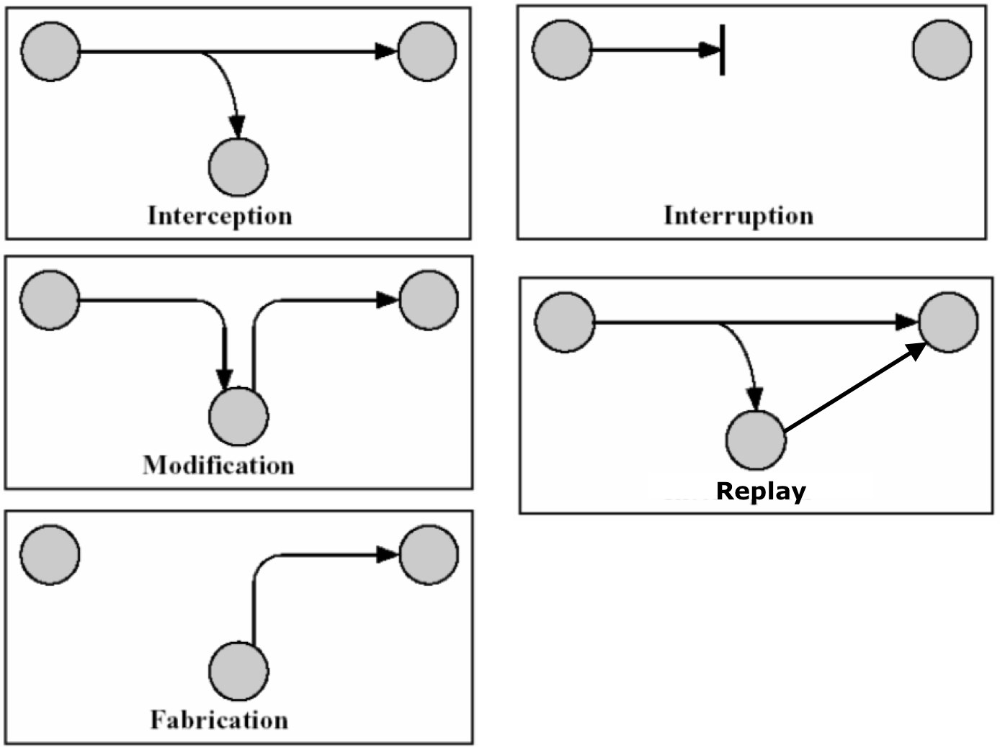

**Soluzioni**:
- Token di sessione per l’attacco replay
- Autenticazione degli interlocutori per tutti gli altri attacchi

#### Attacchi MTM: scenario bellico

- **Interception**: avviene ascoltando una comunicazione. Immagina qualcuno che ascolta i segreti nazionali.
- **Interruption**: ricezione dei messaggi e impedimento al destinatario di riceverli. Il mittente crederà che il destinatario ha ricevuto il messaggio ma il destinatario non l'ha ricevuto. Supponiamo di voler sparare un missile, ma il software missilistico non sta ricevendo i tuoi comandi, e la cosa peggiore è che tu pensi che il missile sia stato sparato.
- **Modification**: l'uomo nel mezzo riceve il messaggio, lo modifica e quindi lo invia al destinatario effettivo. Immagina se l'obiettivo del missile viene cambiato nel tuo stesso paese…
- **Replay**: l'uomo nel mezzo potrebbe ricevere i tuoi dati .. e quindi continuare a inviarli al destinatario (il ricevitore penserà che tu abbia inviato di nuovo i dati) .. Più missili vengono lanciati di quanti tu ne abbia ordinato
- **Fabrication**: l'uomo nel mezzo fabbricherà un nuovo messaggio e lo invierà al destinatario. Il destinatario crederà che il messaggio provenga dal mittente. A questo punto, immagina che un missile venga improvvisamente da te sparato contro una tua nazione amica….

### 3.4 Attacco replay

Questo attacco permette operazioni fraudolente come falsa autenticazione e/o transazioni duplicate, senza dover necessariamente decrittare la password, ma soltanto ritrasmettendola in un tempo successivo.

A differenza dell'attacco di tipo MTM di tipo modification che opera sempre in tempo reale, il replay attack può operare anche in modo asincrono quando la comunicazione originale è terminata.

**Contromisure**: utilizzo di un token (un id) di sessione sempre diverso

**Fasi tipiche** dell’attacco:
- **Mallory** intercetta la comunicazione tra Alice, che si sta autenticando con Bob e ne conserva il messaggio con la chiave cifrata.
- In un momento successivo Mallory apre una nuova comunicazione con Bob spacciandosi per Alice
- Quando Bob chiede a Mallory (convinto di parlare con Alice) una chiave d'autenticazione, Mallory prontamente invia quella (mai in  realtà decifrata) di Alice, instaurando così la comunicazione.

## 4 Passwords

### 4.1 Criticità di una password

- Una password è una informazione segreta che identifica un utente, possiede le seguenti criticità:
  - La sua **comunicazione**: può essere intercettata
  - La sua **memorizzazione**: può essere letta
  - La sua **costruzione**: può essere scoperta

#### Costruzione della password

- Una password “ben formata” dovrebbe seguire un certo numero di criteri che ne rafforzano la inviolabilità:
  - **Lunghezza** sufficiente (ad es. 8 caratteri)
  - Sequenza **diffusa** (ad es. un misto di caratteri alfabetici, numerici e caratteri speciali)
  - Sequenza **confusa** (stringhe senza significato nella lingua naturale o correlazioni semplici con informazioni sul proprietario come nomi propri di parenti, età, ecc.)

#### Conservazione della password

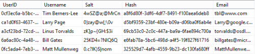

- La conservazione di una password in un archivio può essere resa sicura:
  - Proteggendo l’archivio da accessi non autorizzati
  - Criptando l’intero archivio
  - Criptando la password con una funzione di hash
- In genere si rafforza ulteriormente la password tramite la tecnica del salt che allunga la password con una sequenza di riempimento casuale (il salt per l’appunto) che rende il database più immune ad un eventuale attacco a dizionario

#### Comunicazione della password

- Una password può essere scambiata:
  - in una **rete sicura**: allora può essere in chiaro
  - In una **rete insicura**: allora deve essere cifrata

### 4.4 Attacco a dizionario

**Prerequisito**: l’attaccante deve rubare in qualche modo il database delle password. Ciò può accadere, per esempio, con la tecnica dello **SQL Injection**.

**Meccanismo**: l'**attacco a dizionario** avviene sul **PC dell'attaccante** agento sul **database delle password sottratte** con qualche forma di **Injection**. Una volta che l’attaccante ha tutto il DB in locale sul proprio PC, l’hacker può tentare un attacco a forza bruta sul DB che, essendo in locale, non è più protetto dall’IDS/IPS del firewall aziendale.

Per sbrigarsi prima l’hacker può decidere di effettuare un più efficiente attacco a dizionario utilizzando:
  - Debolezze note dell’algoritmo di hash usato per ottenere le impronte
  - Tecniche di ingegneria sociale per ottenere sottosequenze della password
- Protezione possibile:
  - Salt per allungare password
  - Password sufficientemente varia e abbastanza lunga
  - Evitare di usare informazioni personali note all’interno della password

# 5 Autenticazione utente

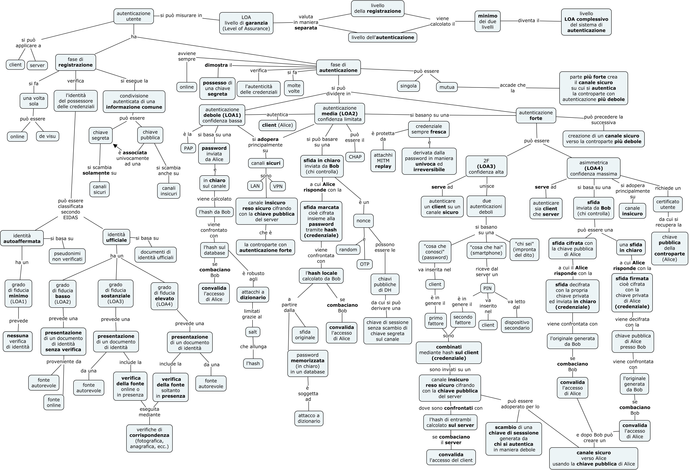

## 5.1 Autenticazione debole

- Client e server devono eseguire:
  - Una fase di registrazione dell’account: condividere in partenza un segreto, la coppia di valori username e password detta account o credenziali, attraverso un canale diretto e sicuro (privatezza ed autenticazione)
  - Più fasi di autenticazione dell’utente: scambiarsi il segreto (la password) attraverso un canale indiretto (la rete) sicuro o reso sufficientemente tale
  - Non è adatta alla comunicazione della password su canali insicuri perché è vulnerabile ad attacchi replay di tipo man-in-the-middle
  - È adatta a autenticazione locale ad un sistema (OS, server)
  - Sono in genere ritenuti canali sicuri LAN aziendali protette (trusted), connessioni PPP, tunnel VPN, sessioni HTTPS
  - Il canale sicuro su cui effettuare l’autenticazione debole è già stato creato (con crittografia ibrida) da una controparte che si era già in precedenza autenticata su un canale insicuro mediante una autenticazione forte.
- In questo contesto la segretezza della password ha due criticità principali (la comunicazione della password non è considerata una criticità):
  - La costruzione della password
  - La conservazione della password in un archivio

### 5.1.1 Autenticazione PAP

Il Password Authentication Protocol è un protocollo di autenticazione base di un utente che chiede un accesso ad un sistema che prevede lo scambio del segreto ad ogni autenticazione.
Va usato su un canale sicuro perché è esposto ad attacco replay.

#### **Fase di Registrazione Protocollo PAP**

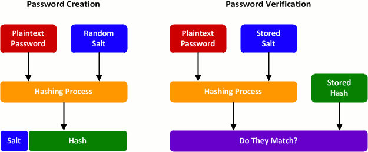

- Il **PAP (Password Authentication Protocol)** in realtà si compone di **due fasi**:
  - **Identificazione dell’utente** e creazione della password: è il momento in cui viene **registrato** un nuovo utente sul sistema. Si esegue una sola volta all’inizio. Viene calcolata e memorizzata l’impronta sul database.
  - **Verifica della password**: è l’**autenticazione** vera e propria di un utente e si esegue tutte le volte che un utente richiede un accesso.

#### **Fasi di Autenticazione Protocollo PAP**

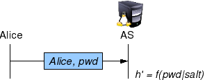

  1. Alice manda al server di autenticazione AS (Bob) le sue credenziali, cioè il suo nome utente e la password (in chiaro o criptata, ad esempio, con MD5). Fase di scambio.
  2. Bob cerca nella tabella il nome utente (username) di Alice
  3. Se il nome utente viene trovato nel DB, Bob preleva il salt, lo combina con la password  ricevuta e lo usa all'interno di una funzione di HASH (ad esempio MD5).
  4. Bob fa un confronto tra il risultato della funzione e il digest in memoria e, se i numeri sono uguali, l'autenticazione ha successo. Fase di verifica.

 Il **server di autenticazione** ha memorizzati in una **tabella** di un DB:
  - il **nome utente** di Alice
  - un **numero casuale** di bit, detto **salt**.
  - una **trasformazione (digest)** di password (in chiaro o criptata) e salt insieme;

## 5.2 Autenticazione su canali insicuri

Come realizzare la garanzia dell’autenticazione su canali insicuri:
- Autenticazione media
- Autenticazione forte

### 5.2.1 La sfida (o challenge)

- Le credenziali oltre a essere irreversibili ed autenticate hanno pure l’esigenza di dover essere uniche per proteggersi da attacchi di tipo replay
- La sfida è un numero che rende unico una credenziale e serve a verificare l’autenticazione per proteggersi da attacchi MITM di tipo replay
- deve sempre essere fresca cioè non deve essere mai stata usata: se così non fosse, gli attacchi di tipo replay diventerebbero facilissimi.
- La sfida deve essere anche univocamente associata al segreto diventando essa stessa parte delle credenziali (mediante cifratura con il segreto).
- La sfida (o challange) può essere:
  - una nonce, cioè un numero casuale usato una sola volta. Deve essere inviato da chi vuole autenticare a chi si deve autenticare che, a sua volta, la deve restituire uguale.
  - un numero di sequenza, cioè un contatore che continua ad aumentare ad ogni ciclo di autenticazione; Deve essere inviato solamente da chi si deve autenticare.
  - un timestamp, il tempo corrente. Deve essere inviato solo da chi si deve autenticare.
- Usare un numero di sequenza o il tempo permette di evitare la trasmissione della sfida sulla rete e quindi una sua eventuale intercettazione, però il protocollo diventa più difficile da implementare:
  - nel caso dei numeri di sequenza, questi devono essere uguali per Alice e Bob, il che non è banale (che accade se Alice usa computer diversi?);
  - nel caso del tempo, il problema è che gli orologi di Alice e Bob devono essere sincronizzati, soluzione perlomeno costosa.

## 5.3 Autenticazione media sfida/risposta

- Sfida/risposta è ritenuto un metodo di autenticazione a media sicurezza e si basa su:
  - Fase di registrazione: attraverso un canale diretto e sicuro (confidenziale) o suo equivalente avviene la condivisione, integra e autenticata di una informazione privata: il segreto tra Alice e Bob (la password)
  - Una o più fasi di autenticazione: avviene lo scambio protetto, lungo un canale insicuro, di una informazione derivata dal segreto in maniera  non invertibile (credenziali)
  - Le credenziali, ad ogni autenticazione, zono rese uniche attraverso una sfida random o basata sul tempo

### 5.3.1 Protocollo di autenticazione sfida/risposta CHAP

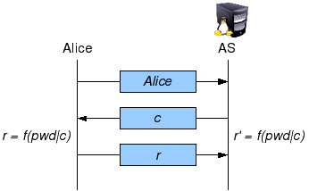

- È il PAP protetto dagli attacchi MITM replay con un nonce
- Ha un punto debole: le password nel database sono più sensibili ad un attacco a dizionario poiché non si può utilizzare il metodo del salt per rafforzare la password
- Come per il PAP è meglio impiegarlo in un canale sicuro. Le sue fasi sono:
  - Alice manda al server di autenticazione AS (Bob) il suo nome utente
  - Bob genera al momento un numero casuale non ripetibile detto nonce (number used once, rappresenta la sfida)
  - Alice genera come l’HASH di nonce e password insieme e la invia a Bob (response r). Credenziali irreversibili ed uniche = HASH(password, c).
  - Bob genera una copia locale della risposta r’ calcolando l’HASH della combinazione di sfida (da lui prima generata)  e password (memorizzata in tabella)
  - Bob confronta la copia locale con la risposta ricevuta e, se sono uguali, autentica Alice.

- Il server di autenticazione ha memorizzati in una tabella:
  - il nome utente di Alice
  - La password in chiaro o criptata senza salt
- Non realizza l’autenticazione del serverL’utente ha una finestra temporale

## 5.4 Autenticazione forte a due fattori (2FA)

- si basa sull'utilizzo congiunto di due metodi di autenticazione individuali deboli che realizzano complessivamente un’autenticazione più affidabile (detta forte).
- Le più comuni forme di autenticazione a due fattori usano:
  - "una cosa che conosci" (una password come primo dei due fattori,
  - mentre come secondo fattore viene utilizzato o "una cosa che hai" (un oggetto fisico come un telefonino) o "una cosa che sei" (una caratteristica biometrica come una impronta digitale).

**Meccanismo**:
- Il **possesso** dell’oggetto fisico è provato inviando una **password temporanea** che può essere visualizzata soltanto sul suo schermo detta **OTP (one time pad token)**.
- L’utente ha una **finestra temporale** (tipicamente 2 minuti) all’interno della quale può leggere la password temporanea dal dispositivo di **controllo del possesso** e inserirla in un campo dell’interfaccia del dispositivo di **autenticazione** (ad esempio sul PC) dopo che è stata già validata la **conoscenza della password**.

**Fasi**:
1. A partire dal codice OTP e dal tempo, dispositivo utente e server di autenticazione **generano indipendentemente** una impronta **hash**
2. L’impronta del client di autenticazione viene inviata al server di autenticazione tramite un **canale sicuro**, o  insicuro, reso sicuro tramite un tunnel cifrato.
3. Il server confronta la copia **generata localmente** con quella **ricevuta** e, se combaciano, **convalida** l’autenticazione.

### 5.4.1 TOTP su canale insicuro

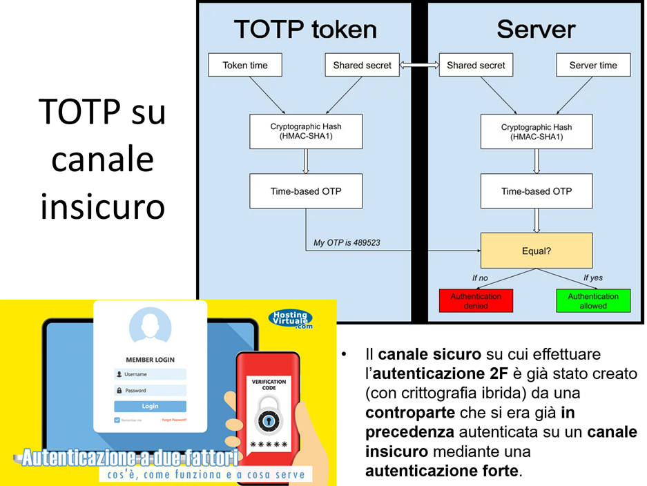

  - Il canale sicuro su cui effettuare l’autenticazione 2F è già stato creato (con crittografia ibrida) da una controparte (il server di autenticazione) che si era già in precedenza autenticata su un canale insicuro mediante una **autenticazione forte**, analogamente a quanto accade con il PAP o con il CHAP.

## 5.5 Autenticazione su canali insicuri

L’**autenticazione asimmetrica** e l’**autenticazione con Diffie-Helman** sono ritenuti metodio di **autenticazione forte** e si basano su:
- **Fase di  verifica dell'identità** che può essere diretta o indiretta:
    - Verifica diretta in **fase di registrazione dell'identità**: condivisione integra tra Alice e Bob lungo un canale insicuro (non confidenziale) di informazioni pubbliche a ciascuno di essi **associate in maniera univoca** cioè la **chiave pubblica**. Si fa una sola volta **presso ogni servizio**, è il caso ad esempio di SSH.
    - Verifica indiretta in **fase di presentazione dell'identità**: condivisione integra tra Alice e Bob lungo un canale insicuro (non confidenziale) di informazioni pubbliche a ciascuno di essi **associate in maniera univoca** cioè il **certificato utente**. Si può fare più volte, contestualmente all'autenticazione, è il caso ad esempio di TLS con certificati X509. La registrazione dell'identità non avviene più presso il servizio perchè ci si fida dell'unica fase di registrazione dell'utente già avvenuta presso una CA. L'**identità** rimane in seguito garantita **presso un servizio** proprio grazie al **certificato utente**. 
- Una o più **fasi di autenticazione**: scambio, lungo un canale insicuro, di una informazione derivata dal segreto in maniera non invertibile che dimostri che chi si autentica sia effettivamente in possesso del segreto.

Le **credenziali** sono rese uniche attraverso una sfida random. Poichè la **fase di registrazione** scambia solo **chiavi pubbliche** cade il **vincolo della sua unicità**, cioè può essere ripetuta più volte. Unico vincolo: devono sempre essere scambiate chiavi autenticate.

In una **autenticazione mutua** spesso **la parte più forte** crea il **canale sicuro** su cui si autentica la controparte con autenticazione più debole

## 5.6 Certificato utente

**Cosa certifica?**: Certifica il proprietario (titolare) di una certa chiave pubblica, in altre parole, autenticano una chiave pubblica.

**Come si chiama?** Si chiama certificato utente o certificato cliente (client certificate)

**Cosa contiene?** E’, a sua volta, un particolare documento che essenzialmente consiste in:
- **Chiave pubblica** in chiaro di un utente (in genere registrato in una CA)
- Informazioni inerenti all’**identità** associata alla **chiave pubblica**: nome di un utente o  nome di una CA sotto forma di **CN (Common Name)**.
- **Firma digitale** in calce (a seguire) da parte di un ente terzo fidato (in genere una CA) che è l’**emittente (issuer)** del certificato.

**Da chi è firmato?** E’ firmato **dalla CA** con la sua chiave privata detta anche (insieme alla controparte pubblica) chiave di certificazione (firma un certificato).

**Qual’è lo scopo del certificato?** **Contenere** e **autenticare** una chiave pubblica come appartenente al suo proprietario (**identificato da un CN**) per mezzo della garanzia (firma) di uno terzo utente fidato (in genere una CA).

### 5.6.1 Scambio delle chiavi pubbliche

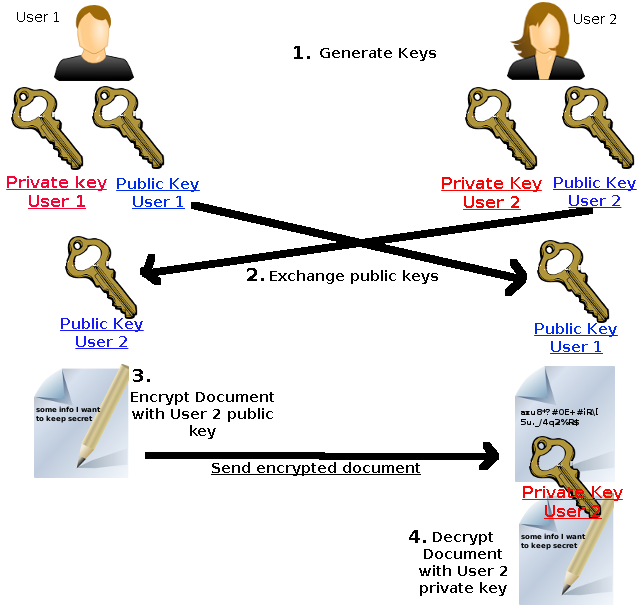

- Avviene una o più volte anche su canali insicuri
- Necessità di associazione autenticata tra l’utente e la chiave pubblica ottenuta mediante una procedura di autenticazione della chiave pubblica (prevenzione di un attacco Man-In-The-Middle)
- Metodo possibile: chiave pubblica e nome firmati da uno o più utenti fidati (web of trust)
- Metodo più efficace: uso di un certificato rilasciato da una CA

### 5.6.2 Attacco MITM e chiavi pubbliche

- La modifica MITM durante uno scambio di chiavi pubbliche può essere arginata con l’autenticazione reciproca delle chiavi pubbliche delle due parti
- L’autenticazione reciproca si può realizzare con:
  - Uso di chiave segreta condivisa tra le parti (Pre-shared-key) come ad esempio una password, mediante la quale crittografare il primo dei messaggi scambiati (contiene una chiave pubblica).
  - Uso di chiavi pubbliche firmate da un ente terzo (CA o utente fidato)
  - **Fiducia nel momento dello scambio iniziale** (si confida che durante lo scambio non sia presente un attaccante). Il modello teorico di riferimento è il "resurrecting duckling": il dispositivo si "imprinta" sulla prima chiave che riceve, come un anatroccolo sul primo essere che vede:
       - *Trust On First Use* (TOFU): alla prima connessione si accetta e memorizza la chiave pubblica della controparte, fidandosi di quel primo contatto — è il modello usato da **SSH** con le host key.
       - *Finestra temporale limitata*: il pairing è possibile solo entro un breve intervallo (es. ~2 minuti dopo la pressione di un pulsante), come in **WPS** (Wi-Fi Protected Setup) o nel pairing **Bluetooth**.

## 5.7 Autenticazione forte asimmetrica

- Nessun uso di password, un algoritmo di cifratura asimmetrico permette l’autenticazione degli utenti
- Chi deve verificare l’autenticazione della controparte invia una sfida
- Si fa uso degli algoritmi di crittografia asimmetrica, mediante l’invio di:
  - Sfida cifrata con chiave pubblica, la risposta con la sfida in chiaro autentica chi risponde
  - Sfida in chiaro, la risposta con la sfida firmata con chiave privata, autentica chi risponde
- In entrambi i casi la risposta corretta alla sfida (credenziali) è possibile solo per colui che dimostri di possedere la chiave privata, cioè l’utente da autenticare.
- Chiavi pubbliche scambiate una sola volta in una fase di registrazione reciproca oppure più volte nella fase di setup di ogni connessione
- L’associazione autenticata tra chiave pubblica e utente è garantita dal certificato di una CA recuperato :
  - presso un key server
  - direttamente dalla controparte in fase di setup della connessione
- L’autenticazione mutua necessita di un protocollo a tre vie (Three-Way-Handshake)

### 5.7.1 Certificati vs credenziali

- Va rimarcato che lo scambio di certificati, di per se, non autentica gli utenti ma solamente autentica la loro chiave pubblica, cioè garantisce l’identità dell’intestatario (subject) dei certificati.
- Poiché l’associazione tra una chiave pubblica e la sua chiave privata è unica, un certificato indirettamente autentica anche la chiave privata corrispondente come chiave associata allo stesso intestatario.
- Lo scambio di credenziali, qualora sia possibile dimostrare che queste sono derivate dalla chiave privata autenticata dal certificato, invece, autentica a tutti gli effetti un utente, poiché solo il detentore del segreto (chi ha la chiave privata) è in grado di esibire le credenziali corrette.
- Certificati e credenziali sono complementari nella realizzazione dell’autenticazione di un utente che accede ad una risorsa.

### 5.7.2 Autenticazione singola asimmetrica con sfida in chiaro (ad es. TLS)

  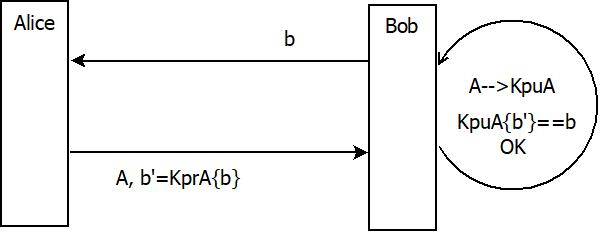

1. Bob manda ad Alice un messaggio contenente la sua identità ***B*** e la nonce che ha scelto lui, ***b***.
2. Alice risponde mandando la sua identità e la propria firma sulla sfida b; Fase  scambio credenziali (Credenziali = sfida firmata). Il nome utente A serve a Bob per ricavare da un DB la chiave pubblica corrispondente. Se la trova il processo di autenticazione prosegue, altrimenti si interrompe e l'utente A Alice viene lasciato fuori.
3. Bob autentica Alice se riesce a verificare la firma posta sulla sfida, ovvero se  decifrando la firma con la chiave pubblica di Alice, ritrova la sfida originale di Bob (Fase di verifica delle credenziali).
4. La sfida è inviata sempre da chi deve verificare l’autenticazione, in questo caso Bob.

Questo è l'**handshake di autenticazione** tipico di protocolli come SSH che recuperano la **chiave pubblica** da un file utilizzando come chiave di ricerca lo **username** dell'utente. Il file ha il significato di **elenco di chiavi pubbliche autenticate**. 

### 5.7.3 Autenticazione mutua asimmetrica con sfida in chiaro (ad es. mTLS)

  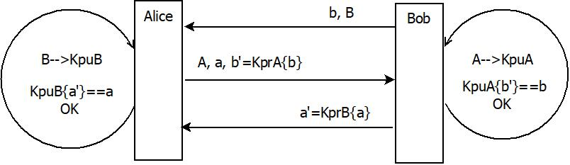

1. Bob manda ad Alice un messaggio contenente la sua identità ***B*** è la nonce che ha scelto lui, ***b***;
2. Alice risponde mandando la sua identità ***A*** e la sua nonce ***a*** e la propria firma sulla nonce di B); Fase di scambio credenziali (Credenziali = sfida firmata). Il nome utente A serve a Bob per ricavare da un DB la chiave pubblica corrispondente. Se la trova il processo di autenticazione prosegue, altrimenti si interrompe e l'utente A Alice viene lasciato fuori.
3. Bob autentica Alice se riesce a verificare la firma posta sulla sfida, ovvero se  decifrando la firma con la chiave pubblica di Alice, ritrova la sfida originale di Bob (Fase di verifica delle credenziali).
4. Bob chiude il protocollo di autenticazione mutua inviando la sua firma sulla grandezza sulla sfida di A.
5. Analogamente, Alice autentica Bob se riesce a trovare la chiave pubblica di Bob sul suo DB e, in caso positivo, se riesce a verificare la firma posta sulla sfida (Fase di verifica delle credenziali).

Nello scenario esaminato la chiave pubblica viene utilizzata sia come credenziale di **autenticazione** che come credenziale di **autorizzazione** all'accesso reciproco. Se la chiave pubblica non è stata **preventivamente registrata** nel sistema non è possibile nè autenticare l'utente che la possiede e neppure autorizzarlo all'accesso, le due funzioni di **AA**, di fatto, **coincidono**.

### 5.7.4 Autorizzazione di client e server

Nel caso di un **server pubblico**, normalmente la **fase di registrazione** della sua **identità** non è locale sul client ma è **delegata ad una CA** che ne **certifica l'identità** e lo **autorizza** ad **esercitare** il servizio. Per cui il client non deve conservare la chiave pubblica corrispondente, questa viene **inviata dal server** al seguito della sfida firmata e contenuta all'interno di un **certificato autenticato** da una CA. Il client deve solamente autenticare il server usando la chiave pubblica garantita dalla CA.

Nel caso di **autenticazione di un client**, il fatto che il **certificato sia valido** non dice ancora se l'utente sia **effettivamente autorizzato** ad **accedere** al servizio. Per questo il server deve **mappare il certificato a un account**, e qui ci sono varie **strategie** comuni:
- **Tramite i campi identitari del certificato**: il Subject DN (es. il Common Name) oppure il Subject Alternative Name (email, UPN). Il server estrae questo valore e cerca l'**utente corrispondente** nel database. È l'**approccio più diffuso**.
- **Tramite l'impronta del certificato o la chiave pubblica**: il server salva il **fingerprint** (thumbprint) o la **chiave pubblica** e lo **associa** rigidamente a un **account specifico** (una forma di pinning a livello applicativo).
- **Tramite serial number + issuer**: combinazione che identifica univocamente quel certificato emesso da quella CA.

La **chiave pubblica**, in questi protocolli, viaggia sempre **autenticata** (cioè **certamente associata** ad un certo CN) dentro un **certificato utente** garantito dalla **firma di una CA** (ente terzo fidato). 

Il **certificato utente** viene sempre inviato da colui che si deve autenticare **contestualmente alla sfida firmata**, cioè in allegato alla sfida firmata. Colui che deve **autenticare** l'utente sbusta la chiave pubblica dal certificato (dopo aver convalidato la firma della CA che lo autentica) e, con quella, **convalida la firma** sulla sfida.

I **soli certificati** che vengono memorizzati nel sistema sono i **certificati radice** delle CA che firmano i certificati utente. I certificati radice devono comunque essere **preinstallati** (non li invia mai il server) e devono essere inseriti nell'elenco dei **certificati radice attendibili** per una **certa operazione** (HTTPS, RADIUS, VPN, ecc).

## 5.8 Autenticazione mutua con tunnel 

E' una **autenticazione ibrida** nel senso che è **forte asimmetrica** quando autentica il server, mentre è **debole** (PAP) o media (CHAP) quando si autentica il client. 

Nonostante che l'**autenticazione del client** sia formalmente di **tipo debole** (PAP o CHAP) essa si svolge all'interno di un **tunnel cifrato** generato come sottoprodotto dell'**autenticazione del server**, procedimento che termina con la generazione di una chiave di **sessione simmetrica** effimera (temporanea) che può essere usata per scambiare dati in **maniera sicura** in entrambe le direzioni.

Il protocollo di **autenticazione del client**, avvenendo **all'interno del tunnel** cifrato, gode di tutte le **proprietà di sicurezza** introdotte da questo, compresa la protezione dagli **attacchi replay** garantita dai meccanismi del tunnel (numero di sequenza dei record e chiave di sessione temporanea).

 Ricapitolando le **fasi in breve**:
1. **Autenticazione del server**. Di fatto, significa **autenticare sia una sfida che una chiave pubblica** mediante algoritmi di **firma digitale**, questo è il solito meccanismo alla base dell'**autenticazione asimmetrica forte singola**. A questo punto il client può usare la **chiave pubblica del server** per scambiare una **chiave effimera di sessione** da lui creata (non gode di PFS) oppure sia il client che il server utilizzano l'**algoritmo di Diffie-Helman** per ottenere indipendentemente due chiavi di sessione effimere uguali su entrambi i lati (gode di PFS).
2. **Creazione del tunnel cifrato**. Da questo momento in poi, sia il client che il server posseggono la **medesima chiave di sessione** che possono utilizzare per **cifrare i dati** in entrambe le direzioni.
3. **Autenticazione del client**. Si realizza all'interno del tunnel cifrato utilizzando un protocollo di autenticazione debole come PAP o medio come CHAP.

  

### 5.8.1 Autenticazione forte con Diffie-Helman

 
- **DH** permette a ciascuna parte di **generare autonomamente** la propria **sfida da firmare** (il proprio esponenziale) invece di riceverla dalla controparte come nello schema challenge/response classico. La sfida viene poi inviata **firmata tramite RSA** in modo da autenticare l'utente. I **nonce** sono proprio le **chiavi pubbliche di DH** che, basate sui numeri random privati a e b, sono esse stesse **random**.
- Le **chiavi pubbliche di DH** sono gli **esponenziali** YA= ga mod p e YB= gb mod p che hanno la proprietà di essere **chiavi pubbliche a breve termine** contemporaneamente **random e effimere**, cioè usa e getta: ne viene generata una coppia nuova per **ogni sessione**.
- Lo scambio DH, da solo, è **anonimo** (vulnerabile a MITM): è la **firma** apposta sugli esponenziali a fornire l'autenticazione. Ciascuna parte firma con la propria **chiave privata RSA a lungo termine** la **coppia** di esponenziali (il proprio e quello ricevuto), in modo da legarli tra loro.
- le **chiavi pubbliche** utili per verificare la firma sono inserite in **certificati utente firmati da una CA**.
- Anche in questo caso le chiavi pubbliche, e i certificati che le autenticano, sono scambiate o una sola volta in fase di registrazione o «al volo» in fase di setup della connessione
- L'utilizzo di DH ha il vantaggio di realizzare contemporaneamente sia l'**autenticazione dell'utente** (tramite la **firma** sul nonce) sia la **generazione di una chiave effimera** di sessione, ottenendo così anche la **Perfect Forward Secrecy**.

  

I tre messaggi numerati sono il cuore del protocollo:

1. Il client manda il proprio esponenziale `YA`.
2. Il server risponde con `YB` **più la firma su entrambi gli esponenziali** `(YA, YB)` e il certificato. La firma copre la coppia, non solo `YB`. Questo lega i due esponenziali e impedisce a un MITM di sostituirne uno.
3. Il client chiude mandando a sua volta la firma sulla coppia, col proprio certificato.

I due blocchi ambra ("verifica firma") sono il punto in cui scatta l'**autenticazione**: ciascuno estrae la chiave pubblica dal certificato della controparte (validato dalla CA) e controlla che la firma torni. Senza questo passaggio, lo scambio DH sarebbe anonimo e attaccabile.

Il blocco verde finale è il doppio risultato di DH: entrambi arrivano alla **stessa** chiave `K = g^(ab) mod p` calcolandola per conto proprio — la chiave non viaggia mai sulla rete. E poiché `a` e `b` sono effimeri (buttati a fine sessione), anche se un domani rubassero la chiave privata RSA non potrebbero ricostruire `K`: è questa la **Perfect Forward Secrecy**.

In una riga: DH fa nascere la chiave, RSA firma per autenticare, e i due esponenziali firmati insieme sono ciò che blocca il MITM.

# 6 Autenticazione di un server

## 6.1 Autenticazione del server

Autenticare un server, di fatto, significa **autenticare una sfida** e **autenticare una chiave pubblica** mediante algoritmi di **firma digitale**, questo è il solito meccanismo alla base dell'**autenticazione asimmetrica forte singola**.

  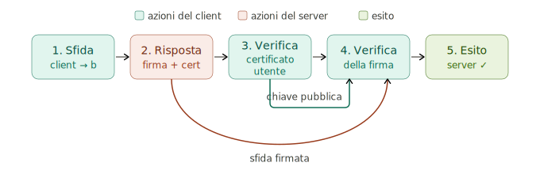

Un riassunto delle fasi dell’**autenticazione** asimmetrica forte **di un server** potrebbe essere:
- Il Client manda al server un messaggio contenente la sua identità è la sfida OTP che ha scelto lui, b.
- Il server risponde mandando la propria identità  A e la propria firma sulla sfida b. E’ la fase di scambio delle credenziali (Credenziali = sfida firmata) in cui il server, contestualmente, invia pure la propria chiave pubblica (contenuta in un certificato utente). In definitiva il server si presenta al client con la sua sfida firmata e un certificato utente ad essa allegato.
- Il client **autentica il server** secondo l'ordine "prima stabilisci la fiducia, poi usala", non ha senso fidarsi di una chiave prima di aver verificato a chi appartiene:
  1. Se riesce ad **autenticare la chiave pubblica** attraverso l'**autenticazione del certificato utente**.
  2. riesce a ***convalidare la firma dell'utente (dominio) posta sulla sfida***, ovvero se  decifrando la firma con la chiave pubblica del server, ritrova la sfida originale del client (Fase di verifica delle credenziali).

### **Variante con sfide di Diffie-Helman**

  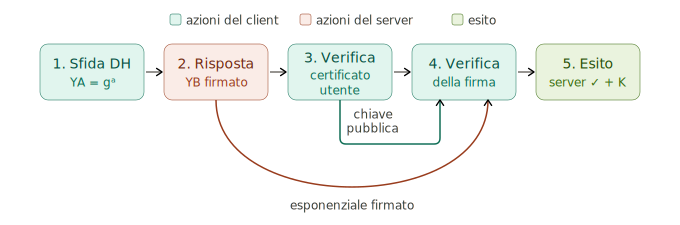

La **sfida** ora è l'esponenziale `YA = gᵃ mod p`: la chiave pubblica DH del client funge da nonce. Il server risponde col proprio `YB = gᵇ mod p` **firmato** con la sua chiave privata RSA — la credenziale autenticata è proprio "l'esponenziale firmato". Il client lo verifica esattamente come prima: valida il **certificato utente**, ne estrae la **chiave pubblica** RSA fidata e con quella controlla la firma.

Il vantaggio che rende DH interessante, e che lo schema RSA puro non dà, è nel blocco **Esito**: gli **stessi** esponenziali scambiati servono a *due* cose contemporaneamente. Da un lato sono le nonce firmate che **autenticano**; dall'altro permettono a entrambi di calcolare in modo indipendente la **chiave di sessione effimera** `K = gᵃᵇ mod p`. E poiché i segreti `a` e `b` sono temporanei e vengono cancellati a fine sessione, si ottiene la **Perfect Forward Secrecy**: la firma RSA serve solo ad autenticare lo scambio, non a cifrare la chiave.

## 6.2 Autenticazione del certificato utente

Un riassunto delle fasi dell’**autenticazione di un certificato utente** potrebbe essere:

  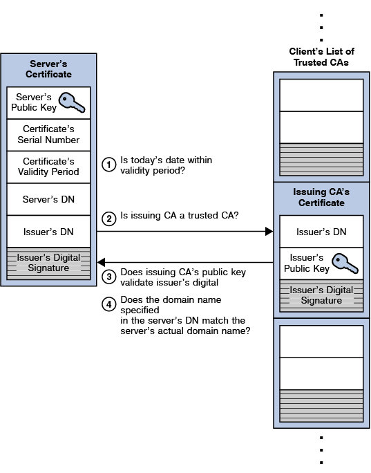

- Un server si **presenta** con una **credenziale firmata** e con un **certificato utente**
- Il controllo si basa sul presupposto che il client che controlla possegga un certificato CA che validi la firma sul certificato da controllare.
- A questo punto il **certificato utente** di un server è valido se passa tutte le seguenti verifiche:
  - La data corrente sia all’interno del periodo di validità del certificato
  - La CA proprietaria del certificato sia fidata (trusted), cioè esista un suo certificato nella lista dei certificati attendibili nel PC
  - sia ***valida la firma della CA posta sul certificato utente***. Per far ciò, si verifica che la chiave pubblica della CA in questione, prelevata da un **certificato CA radice** conservato sul PC client, effettivamente decifri la firma del certificato. **È il controllo principale**.
  - Che il nome di dominio (subject) dichiarato nel certificato del server da controllare coincida col nome di dominio dell’url del server
- Se il certificato è valido, la chiave pubblica in esso contenuta può decifrare la credenziale del server autenticandolo

## 6.3 Perfect Forward Secrecy (PFS)

La **Perfect Forward Secrecy** (o *Forward Secrecy*) è una proprietà cruciale dei protocolli crittografici che garantisce che la compromissione di una chiave privata a **lungo termine** non comprometta la riservatezza delle sessioni **passate**.

In pratica, se un attaccante intercettasse e registrasse il traffico crittografato oggi, non sarebbe in grado di decifrarlo in futuro, anche se riuscisse a ottenere la chiave privata del server.

### 6.3.1 Senza PFS (Scenario basato solo su RSA)

In questo scenario, la sicurezza delle sessioni dipende interamente dalla chiave privata del server:

* **Meccanismo:** La chiave di sessione viene cifrata dal client utilizzando la chiave pubblica RSA del server.
* **Vulnerabilità:** Se in futuro la chiave privata RSA del server viene sottratta, l'attaccante può usare quella chiave per decifrare tutte le chiavi di sessione registrate in passato, rendendo leggibili tutte le comunicazioni storiche.

### 6.3.2 Con PFS (Diffie-Hellman Effimero - DHE/ECDHE)

L'introduzione di scambi di chiavi temporanei risolve il problema della dipendenza dalla chiave statica:

* **Meccanismo:** Per ogni singola sessione vengono generate nuove chiavi temporanee (effimere) tramite lo scambio **Diffie-Hellman**.
* **Ruolo di RSA:** La chiave privata RSA viene utilizzata **esclusivamente per autenticare** lo scambio di chiavi, non per cifrare la chiave di sessione stessa.
* **Resilienza:** La chiave di sessione deriva dallo scambio DH effimero. Poiché i valori segreti utilizzati nello scambio DH sono temporanei e vengono cancellati dalla memoria al termine della sessione, anche se la chiave privata RSA venisse compromessa in futuro, le chiavi di sessione passate resterebbero **irrecuperabili**.

# 7. Identità digitale

- E’ l’identità di una persona in Internet.
- Internet però è per sua natura sostanzialmente anonima nel senso che l’identità digitale può non corrispondere all’identità reale.
- **Identità autoaffermata** (Self-asserted identity) basata su attributi personali auto-definiti. Una persona può scegliere di proteggere le proprie informazioni personali utilizzando pseudonimi per accedere ai servizi che non richiedono una identità del mondo reale. Può essere sufficiente per webmail, social network, siti di notizie, account eCommerce, ecc. La fase di registrazione dell’utente è tipicamente molto debole.
- **Identità ufficiale** (Official digital identity) è basata su documenti ufficiali del mondo reale. La fase di registrazione dell’utente è molto più forte e realizza una corrispondenza affidabile tra mondo online e mondo fisico. Le persone sono tenute a presentare un documento di identità ufficiale del mondo reale (certificato di nascita, passaporto ecc.) per autenticare la propria identità prima del rilascio della credenziali utilizzabili online.

## 7.1 Aspetti critici di una autenticazione

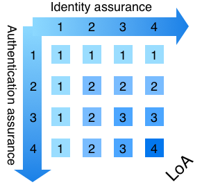

La **fiducia** o il **grado di confidenza** in una corretta autenticazione deriva dalla forza (misurata in livelli) dei processi di:
- **registrazione dell’utente**, ad esempio la prova dell'identità, la sua verifica e la sua autenticazione. Altrimenti indicato come garanzia dell'identità (identity assurance)
- **rilascio e gestione delle credenziali** (token), che riguarda, ad esempio, l'entità che rilascia la credenziale e la procedura che essa segue per rilasciarla
- **autenticazione online**. Altrimenti indicato come garanzia dell’autenticazione (authentication assurance).

## 7.2 Livelli di garanzia di una autenticazione

- Secondo il regolamento eIDAS (recepito da tutti gli stati UE) esistono tre livelli di garanzia (asurance levels):
- Il **livello di affidabilità basso (low)** si riferisce a mezzi di identificazione elettronica che forniscono un grado di sicurezza limitato riguardo all'identità pretesa o dichiarata di una persona. (Lieve diminuzione del rischio di uso abusivo o alterazione dell'identità)
- Il **livello di affidabilità significativo (substantial)** si riferisce a mezzi di identificazione elettronica che forniscono un grado di sicurezza significativo riguardo all'identità, pretesa o dichiarata, di una persona. (Significativa diminuzione del rischio di uso abusivo o alterazione dell'identità)
- Il **livello di affidabilità elevato (high)** si riferisce a un mezzo di identificazione elettronica che fornisce riguardo all'identità, pretesa o dichiarata, di una persona un grado di sicurezza molto elevato. (Eliminazione del rischio di uso abusivo o alterazione dell'identità)

### 7.2.1 Scelta dei livelli legata al rischio

- Il livello di garanzia richiesto può essere stimato in base a:
- l'importanza dei dati e i potenziali danni se tali dati dovessero essere ottenuti o modificati da utenti non autorizzati
- Il rischio associato ad una o più autenticazioni errate deve essere valutato per poter decidere quale livello di garanzia è necessario per un certo servizio:
  - inconvenienti, imbarazzo, disagio o danno alla posizione o alla reputazione (breve, medio o lungo periodo);
  - Perdita finanziaria (insignificante per una delle parti, grave perdita per una delle parti,  grave o catastrofica per qualsiasi parte);
  - Danno ai programmi di una agenzia pubblica o agli interessi pubblici (livello di compromissione di funzioni primarie in qualità e durata, livello di danno a risorse e interessi pubblici)
  - Rilascio non autorizzato di informazioni sensibili (livello di rilascio di informazioni di natura personale, governativa o commerciale);
  - Sicurezza personale, danni alla salute (danni che non richiedono trattamenti medici, danni che richiedono trattamenti, danni che richiedono seri trattamenti o possono comportare la morte)
  - Violazioni civili o penali.
- Dal punto di vista di un fallimento nel controllo dell’identità, ci sono due dimensioni di potenziale fallimento:
  - L'impatto di fornire un servizio al soggetto sbagliato (ad esempio, un utente malintenzionato si dimostra con successo come qualcun altro).
  - L’impatto di un’eccessiva verifica dell’identità (ovvero, la raccolta e l’archiviazione sicura di più informazioni su una persona di quelle necessarie per fornire con successo il servizio digitale).

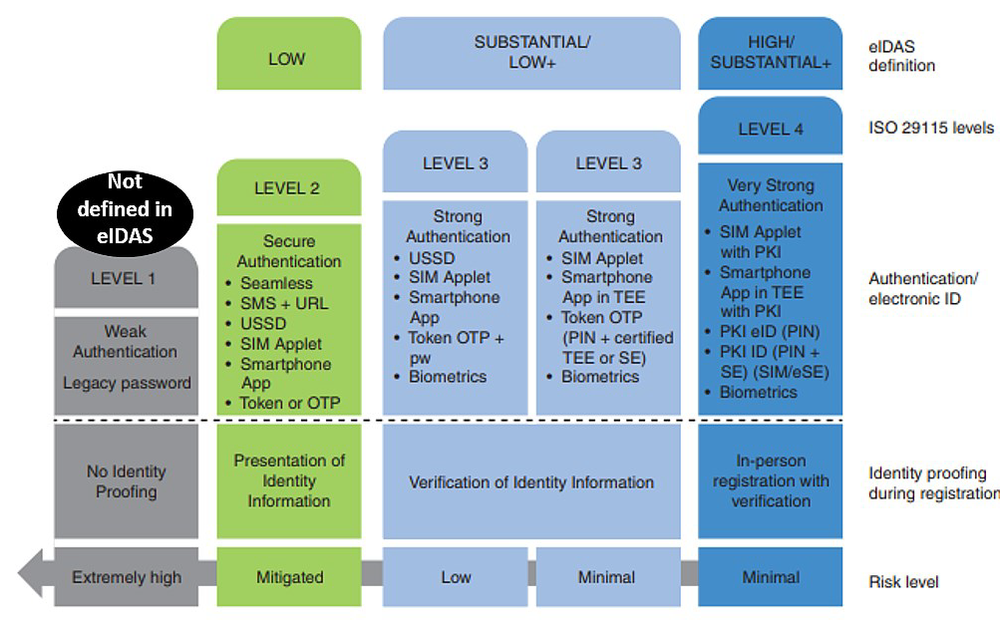

## 7.3 LOA1

- In LoA1, c'è una fiducia minima (cioè poca o nessuna) nell'identità dichiarata dall’utente, ma una certa sicurezza che l’utente sia identificabile come lo stesso su eventi di autenticazione consecutivi.
- Non ha un livello corrispondente nella definizione eIDAS.
- In fase di registrazione non c’è il requisito di verifica dell'identità
- In fase di autenticazione è consentito l'utilizzo di un'ampia gamma di credenziali dalla password in chiaro ai protocolli sfida/risposta.
- Un’autenticazione con successo richiede che la persona dimostri di avere il possesso delle credenziali di autenticazione (es. password).
- I protocolli di autenticazione possono essere basici senza l’implementazione di meccanismi complessi di protezione della comunicazione ma la trasmissione della password in chiaro su un canale insicuro non è consigliabile (meglio un tunnel cifrato).

## 7.4 LOA2

- È equivalente al livello basso secondo la definizione eIDAS, che fa riferimento a una credenziale di identificazione elettronica che fornisce un grado limitato di fiducia nell'identità dichiarata di una persona.
- In fase di registrazione viene introdotta una qualche forma di verifica dell'identità, che richiede la presentazione (anche online) di informazioni di identificazione provenienti da una fonte autorevole.
- La fase di autenticazione utilizza un singolo fattore che potrebbe essere una password o un PIN. La riuscita dell'autenticazione richiede che la possa persona dimostrare di avere il controllo/possesso della credenziale di autenticazione.
- I protocolli di autenticazione devono proteggere da intercettazioni, attacchi replay, ecc.

## 7.5 LOA3

- È equivalente al livello sostanziale secondo la definizione eIDAS, che fa riferimento a una credenziale di identificazione elettronica che fornisce un grado sostanziale di fiducia nell'identità dichiarata di una persona.
- In fase di registrazione viene introdotta una verifica dell'identità, che richiede la presentazione (in presenza o  online) di informazioni di identificazione provenienti da una fonte autorevole che devono essere verificate e controllate dall’autorità di registrazione.
- La fase di autenticazione fornisce un’alta confidenza che l’utente che rivendica l’identità sia lo stesso a cui in precedenza essa è stata assegnata provandola con tecniche a più fattori ad es. token OTP e PIN o dati biometrici come l’impronta digitale rilevati su un telefono cellulare.
- I protocolli di autenticazione devono implementare meccanismi crittografici sufficienti per proteggere l'intera infrastruttura di autenticazione dalla compromissione includendo intercettazioni, attachi replay, attacchi man-in-the-middle, ecc.
- LoA3 viene utilizzato quando associato ad un'autenticazione errata è associata un rischio sostanziale .

## 7.6 LOA4

- Rappresenta il più alto livello di garanzia definito dalla norma ISO/IEC 2915. È equivalente al livello alto secondo la definizione eIDAS, che fa riferimento a una credenziale di identificazione elettronica che fornisce un grado elevato di fiducia nell'identità dichiarata di una persona.
- In fase di registrazione viene introdotta una forma forte di verifica dell'identità, che richiede la presentazione in presenza di informazioni di identificazione provenienti da una fonte autorevole che devono essere verificate e controllate dall’autorità di registrazione.
- In fase di autenticazione, in considerazione del livello massimo di sicurezza e fiducia richiesto è opportuno utilizzare la crittografia asimmetrica per garantire la confidenzialità, l'integrità e l'autenticità delle informazioni scambiate tra le parti.
- E’ anche suggerito l’uso di un codice PIN personale come secondo fattore di autenticazione.
- LoA4 impone anche l'uso di dispositivi hardware a prova di manomissione (tamper-resistant) per l'archiviazione di tutte le chiavi crittografiche segrete o private (ad esempio, su un PC, all’interno di moduli TPM).
- I protocolli di autenticazione devono implementare meccanismi per l'archiviazione sicura e la trasmissione sicura di credenziali e altri dati sensibili che devono essere protetti da attacchi come interception, replay, man-in-the-middle ecc.
- È usato quando un alto rischio è associato a una eventuale autenticazione errata.

# 8. Links

- https://tecadmin.net/install-lets-encrypt-create-ssl-ubuntu/
- https://www.digitalocean.com/community/tutorials/how-to-secure-apache-with-let-s-encrypt-on-ubuntu-18-04
- https://certbot.eff.org/lets-encrypt/ubuntubionic-apache
- https://it.wikipedia.org/wiki/Autenticazione_a_due_fattori
- https://aaltodoc.aalto.fi/bitstream/handle/123456789/34352/master_Agbede_Oluwabunmi_2018.pdf?sequence=1&isAllowed=y
- https://en.wikipedia.org/wiki/Station-to-Station_protocol
- https://www.rfc-editor.org/rfc/rfc5246#section-7.3
- https://pages.nist.gov/800-63-3/sp800-63-3.html

