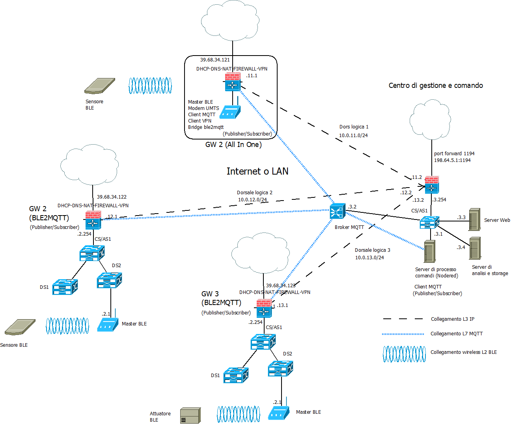
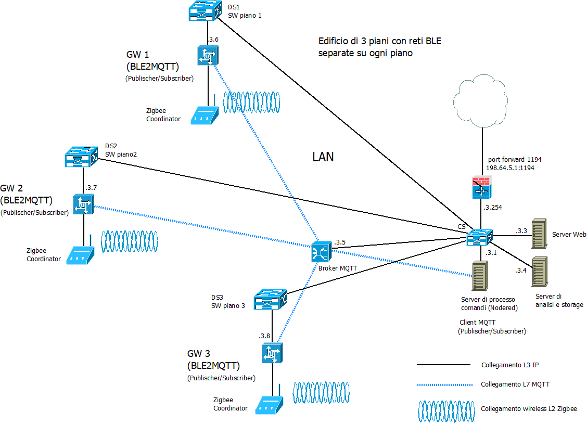

>[Torna a reti ethernet](../archeth.md)

- [Dettaglio architettura Zigbee](../archzigbee.md)
- [Dettaglio architettura BLE](../archble.md)
- [Dettaglio architettura WiFi infrastruttura](../archwifi.md)
- [Dettaglio architettura WiFi mesh](../archmesh.md) 
- [Dettaglio architettura LoraWAN](../lorawanclasses.md) 

## **Architettura di una rete di reti** 

Di seguito è riportata l'architettura generale di una **rete di reti** di sensori. Essa è composta, a **livello fisico**, essenzialmente di una **rete di accesso** ai sensori e da una **rete di distribuzione** che fa da collante di ciascuna rete di sensori.

### **Rete di distribuzione** 

I **gateway** utilizzano la **rete internet** e/o una **LAN** per realizzare un collegamento verso il **broker MQTT**, per cui, in definitiva, la topologia risultante è, **fisicamente**, quella di più **reti di accesso** con tecnologia e topologia differente (a maglia nel caso di BLE) tenute insieme da una **rete di distribuzione** qualsiasi purchè sia di tipo TCP/IP (LAN o Internet).

Avere a disposizione una **rete di distribuzione IP** per i comandi e le letture è utile perchè permette di creare interfacce web o applicazioni per smartphone o tablet per:
- eseguire, in un'unica interfaccia (form), comandi verso attuatori posti su reti con tecnologia differente.
- riassumere in un'unica interfaccia (report) letture di sensori provenienti da reti eterogenee per tecnologia e topologia

Il **gateway All-In-One** potrebbe essere un dispositivo con **doppia interfaccia**, modem **UMTS** per l'accesso alla rete di distribuzione su **Internet**, **BLE** verso la **rete di sensori**. Può essere utile per realizzare un **gateway BLE da campo** da adoperare:
- in **contesti occasionali** (fiere, eventi sportivi, infrastrutture di emergenza, grandi mezzi mobili).
- in contesti simili ma **dispersi** in aree geografiche molto distanti tra loro e coperte solo dalla **rete cellulare** terrestre della telefonia mobile o dai **satelliti in orbita bassa (LEO)**.
  
## **Documentazione logica della rete (albero degli apparati attivi)** 

### **Federazione di reti BLE in Internet** 

L'albero degli **apparati attivi** di una rete di sensori + rete di distribuzione **in Internet** + server di gestione e controllo che potrebbe rappresentare **tre edifici** distanti domotizzati tramite **BLE** e federati tramite **Internet**: 

Il **bridge BLE** (in realtà è un **gateway** e quindi pure un router) è normalmente anche il **master o centrale** della rete di sensori. 

Il **broker MQTT** può essere installato in cloud, in una Virtual Private network, oppure On Premise direttamente nel centro di gestione e controllo. 

Il **gateway**, quando collegato direttamente ad **Internet**, è normalmente anche un **firewall** (con funzioni di NAT se si adopera IPv4), mentre se collegato alla **LAN** (attraverso uno SW o un HUB wiereless) ha solamente la **funzioni** di:
- **router applicativo** che **traduce** i messaggi da una rete IP (la LAN) ad una non IP (la rete di sensori).
- **client MQTT** con funzione di **publisher** (sul topic di stato e traduce **da** i dispositivi) e di **subscriber** (sui topic di comando e configurazione e traduce **verso** i dispositivi).

### **Federazione di reti BLE su LAN** 

#### **Partizionamento e ridondanza** 

Per quanto riguarda il **numero dei gateway** in una stessa **LAN**, il numero minimo necessario perchè la rete BLE funzioni è **uno**. Un gateway avente anche funzione di **master** nelle rete di sensori. Però, data la **criticità** di eventuali **guasti** su questo dispositivo (la rete di sensori diventa nel suo complesso **inaccessibile**), potrebbe essere opportuno prevedere:
- localmente la **ridondanza dei gateway**. Almeno 2 gateway per ogni rete di sensori. Uno master attivo di default, e uno slave che entra in azione quando sente che il proprio master è non raggiungibile.
- globalmente un **partizionamento della rete** di sensori in più settori con frequenze diverse e gestiti da coordinatori diversi inseriti in **più gateway sparsi** in **zone diverse** dell'impianto.
  
La **partizione** di una rete BLE può essere utile in determinate situazioni, specialmente se si hanno un **gran numero** di dispositivi o se si vuole **separare** i dispositivi **per zone** o **per scopi** diversi. Ecco alcune **situazioni** in cui potrebbe essere vantaggioso partizionare una rete BLE:

- **Servizi e profili**: Nelle reti BLE, i dispositivi comunicano attraverso **servizi** e **profili** Bluetooth standardizzati. Puoi organizzare i dispositivi in **gruppi** basati su **servizi simili** o scopi simili. Ad esempio, potresti avere un gruppo di dispositivi BLE che forniscono dati di monitoraggio della salute e un altro gruppo di dispositivi che controllano i dispositivi domestici intelligenti.

- **Partizionamento fisico**: Si possono dividere fisicamente le reti BLE in base alla loro **posizione** o alla loro **area di copertura**. Ad esempio, potresti avere un insieme di dispositivi BLE all'interno di un'abitazione e un altro insieme di dispositivi all'esterno. In questo caso, potresti usare **più gateway** o controller per gestire le diverse parti della rete.

- **Rilevanza dei dati**: Si possono configurare i  dispositivi BLE per trasmettere solo i dati rilevanti per una particolare area o scopo. Ad esempio, in un grande magazzino, si potrebbe voler raccogliere solo i dati dai sensori nelle aree attive durante un determinato momento anziché da tutti i dispositivi nell'intero magazzino.

- **Gestione del traffico**: Si potrebbe pianificare la distribuzione dei dispositivi BLE in modo da evitare congestioni di traffico e interferenze. Ad esempio, si potrebbe evitare di sovraccaricare una specifica area con troppi dispositivi BLE che trasmettono contemporaneamente.

Il partizionamento delle reti BLE può essere utile per migliorare l'efficienza, la sicurezza e la gestibilità di una infrastruttura IoT. Per **partizionare** una rete BLE, si potrebbero creare **più centrali** BLE, cioè più **gateway**, ciascuno con la propria rete di sensori da gestire, e utilizzare una **LAN** (compoasta da switch) per collegare le reti tra loro. 

