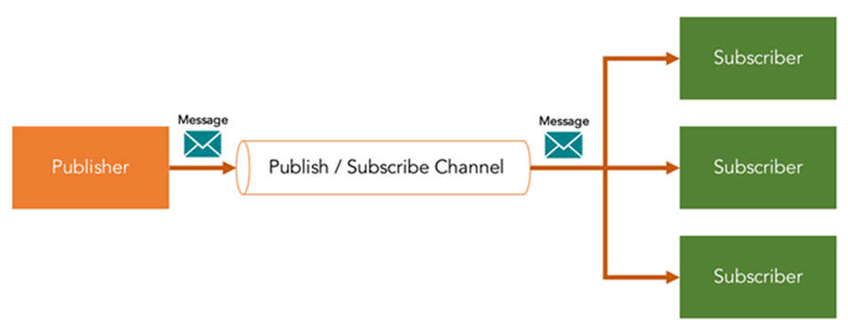
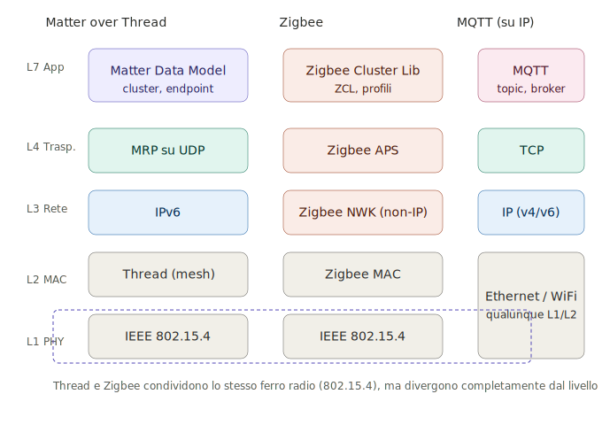
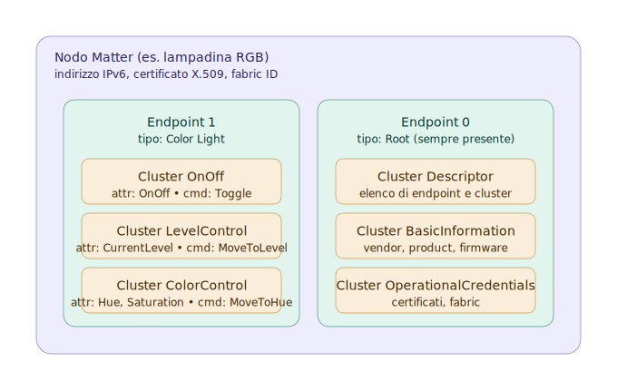
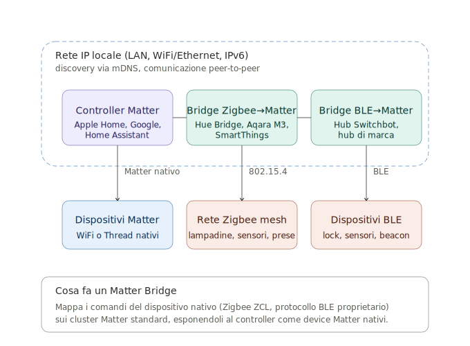

>[Torna a reti di sensori](../sensornetworkshort.md)>[Torna a reti ethernet](../archeth.md)

- [Dettaglio architettura Zigbee](../archzigbee.md)
- [Dettaglio architettura BLE](../archble.md)
- [Dettaglio architettura WiFi infrastruttura](../archwifi.md)
- [Dettaglio architettura WiFi mesh](../archmesh.md) 
- [Dettaglio architettura LoraWAN](../lorawanclasses.md) 


## **Broker MQTT** 

Il **broker MQTT** è solo una delle tante soluzioni possibili per realizzare un **canale multicast** di livello **applicativo** tramite cui un utente col ruolo di **publisher** è in grado di notificare una **replica** dello stesso messaggio a più **subscribers**. E' utile per:
- inoltro dei comandi da un **sensore di comando** su una rete di tipo A (ad es. LoRaWAN) ad un attuatore su una rete diversa di tipo B (ad es. Zigbee)
- inoltro di una **misura** da un **sensore ambientale** su una rete di tipo A (ad es. LoRaWAN) ad un **pannello di controllo** su una rete diversa di tipo B (tipicamente IP)
- inoltro di una **misura** da un **sensore ambientale** su una rete di tipo A (ad es. LoRaWAN) ad un **server di gestione** su una rete diversa di tipo B (tipicamente IP)

Il **canale applicativo** su cui vengono inviati i messaggi sono quindi i **topic**. Su un certo **topic** il dispositivo con il ruolo di **output** agisce come un **publisher**, mentre quello con il ruolo di **input** agisce come un **subscriber**.

Gli utenti, in ogni caso, si comportano tutti come **client** poiché sono loro che **iniziano la connessione** con il broker e non il viceversa. 


**Fasi** del protocollo:
1. Il **Subscriber** dichiara presso il broker il proprio interesse a ricevere notifiche riguardo ad un certo argomento (topic) effettuando una chiamata **subscribe()**
2. il **publisher** pubblica un messaggio che riguarda un **certo topic** effettuando una chiamata **publish()**
3. Il **broker** inoltra il messaggio a tutti i subscriber interessati a **quel topic**

L'**ID MQTT** è un identificativo che permette di individuare un dispositivo ma non è un indirizzo di livello 3, non individua la macchina host in base al suo IP, piuttosto è un indirizzo di livello applicativo noto solo ad un server centrale, cioè il broker. Un dispositivo IoT non è tenuto a conoscere l'IP di tutti gli altri dispositivi ma solamente quello del broker. Il broker soltanto sa gli indirizzi di tutti i dispositivi, conoscenza che acquisisce durante la fase di **connessione** di un client al broker, momento in cui avviene anche il recupero del'**socket remoto** del client.

Il **broker**, dal canto suo, **associa** ogni **topic** con tutti gli **ID** che sono registrati presso di esso come **subscriber**. Questa associazione è utilizzata per smistare tutti i messaggi che arrivano con un certo topic verso tutti gli ID che ad esso sono associati. Il topic diventa così un **indirizzo di gruppo**. La particolarità di questo indirizzo è che è **gerarchico** secondo una struttura ad **albero**, cioè gruppi di dispositivi possono essere suddivisi in **sottogruppi** più piccoli estendendo il nome del path con un **ulteriore prefisso**, diverso per ciascun sottogruppo. L'operazione può essere ripetuta ulteriormente in maniera **ricorsiva**.

**Ad esempio**, posso individuare le lampade della casa con il path ```luci``` e accenderle e spegnerle tutte insieme, ma posso sezionarle ulteriormente con il path ```luci/soggiorno``` con il quale accendere o spegnere solo quelle del soggiorno oppure con il path ```luci/soggiorno/piantane``` con il quale fare la stessa cosa ma solo con le piantane del soggiorno.

Osservando l'albero degli **apparati attivi**, si vede bene che, nelle **reti WiFi**, il **client MQTT** (con il ruolo di **publisher** o di **subscriber**) è sempre il **dispositivo IoT**. 

In **generale**, su reti **non IP**, i **client MQTT** (con il ruolo di **publisher** o di **subscriber**) sono sempre i **gateway di confine** della **rete di sensori**. Le uniche reti di sensori che non hanno bisogno di un gateway di confine che sia, nel contempo anche client MQTT, sono le reti IP. Esistono ancora i gateway nelle **reti IP** ma con **scopi diversi** da quello di **realizzare** un **client MQTT**. Nelle **reti IP**, il **client MQTT** è, normalmente, direttamente **a bordo** del **dispositivo** sensore dotato di indirizzo IP (**MCU**).

Il **vantaggio** del **broker MQTT** è quello di poter gestire in modo semplice e **standardizzato** lo **smistamento** (inoltro) delle **misure** e dei **comandi** tra i vari portatori di interesse (stakeholder) di un **cluster** di reti di sensori, siano essi utenti umani, interfacce grafiche, server applicativi diversi o altri dispositivi IoT.

### **Rappresentazione astratta come canale**

Un canale MQTT si può vedere come un canale bidirezionale realizzabile come unione di due canali simplex in direzioni opposte.

Fornisce un canale multicast di livello applicativo (L7) tramite cui un utente col ruolo di publisher è in grado di notificare una replica dello stesso messaggio a più subscribers **identificati** mediante un topic, assimilabile ad un **indirizzo di gruppo di sorgente** per un subscriber o ad un **indirizzo di gruppo di destinazione**  per un publisher. Se si volesse identificare un **solo dispositivo** allora sono possibili due alternative:
- un **topic unico** che lo individua univocamente, magari all'interno di un topic che individua gerarchicamente il suo gruppo: /soggiorno/comandi/mydevice1-98F4ABF298AD/{"toggle":"true"}
- un **topic comune** che identifica una classe di dispositivi all'interno della quale si individua un certo dispositivo mediante una proprietà univoca contenuta nel messaggio JSON (deviceid): /soggiorno/comandi/{"deviceid":"01", "toggle":"true"}



Non è un modello Client/Server classico, in questo caso tutti gli utenti sono dei client con ruoli diversi: produttore di informazione il publisher, consumatore di informazione il subscriber.

Le connessioni sono iniziate dai client dall’interno delle reti locali di appartenenza per cui non è necessario modificare firewall perimetrali per esporre servizi all’esterno.


### **Alternative ad MQTT**

Esistono molte altre soluzioni che magari sono più semplici e graficamente accattivanti ma che passano per portali proprietari o per servizi cloud a pagamento e nulla aggiungono di didatticamente rilevante ai nostri discorsi. Normalmente sono basate su webservices realizzati con protocolli Request/Response quali **HTTPS** e **COAP**.


## **Matter come alternativa applicativa ad MQTT**

**Matter** è uno **standard applicativo** sviluppato dalla **Connectivity Standards Alliance** (la stessa organizzazione che cura Zigbee) per realizzare un **linguaggio comune** tra dispositivi smart home di marche diverse. Come MQTT, opera al **livello applicativo (L7)** su una rete IP, ma con un approccio architetturalmente opposto: laddove MQTT fornisce un **trasporto generico** su cui ogni applicazione definisce il proprio schema dati, Matter fornisce un **modello dati standardizzato** insieme al trasporto, all'autenticazione e alla scoperta dei dispositivi.



Osservando lo stack a confronto, si nota un punto chiave: **Matter e Zigbee non condividono nulla al di sopra del livello fisico**. Thread e Zigbee usano entrambi la stessa radio IEEE 802.15.4, ma da lì in su parlano linguaggi diversi: Thread porta IPv6 fino al dispositivo finale, Zigbee usa il proprio stack proprietario non-IP. MQTT, dal canto suo, vive interamente nel mondo IP tradizionale, sopra TCP.

### **Differenze architetturali rispetto ad MQTT**

A differenza di MQTT, **Matter non utilizza un broker centrale**. La comunicazione è **peer-to-peer** tra i dispositivi all'interno della stessa rete IP locale, con scoperta automatica tramite **mDNS/DNS-SD** (lo stesso meccanismo usato da Bonjour/Avahi). Ogni dispositivo Matter è raggiungibile tramite il suo indirizzo IPv6 e una porta UDP dedicata.

Il **trasporto** di Matter si basa su **MRP (Message Reliability Protocol)** su **UDP**, con crittografia **end-to-end obbligatoria** tramite certificati X.509. Non esistono messaggi in chiaro, né è possibile disattivare la sicurezza, a differenza di MQTT dove TLS è opzionale.

Il **modello dati** è il vero cuore di Matter: ogni dispositivo è descritto come una collezione di **endpoint** (ad es. una lampadina RGB ha un endpoint), ciascuno dei quali implementa uno o più **cluster** standard (OnOff, LevelControl, ColorControl, Thermostat, OccupancySensing, ecc.). Questo significa che un controller Matter sa *a priori* come parlare con una qualunque lampadina certificata, senza bisogno di sapere chi l'ha prodotta.



Come si vede dalla struttura, il **nodo** è il dispositivo fisico, gli **endpoint** sono le sue "funzioni" logiche (una lampadina RGB ha tipicamente un endpoint 0 di root e un endpoint 1 per la luce), e i **cluster** sono blocchi standard di funzionalità con i loro **attributi** (lo stato leggibile) e **comandi** (le azioni eseguibili). Tutto questo è definito dalla CSA, quindi un controller riconosce il cluster *ColorControl* allo stesso modo su qualunque marca certificata.

### **Confronto strutturale**

|                              | MQTT                                  | Matter                                |
|------------------------------|---------------------------------------|---------------------------------------|
| Livello                      | Applicativo (L7)                      | Applicativo (L7)                      |
| Topologia                    | Stella (via broker)                   | Peer-to-peer su LAN                   |
| Indirizzamento               | Topic gerarchico (gruppo)             | IPv6 + endpoint + cluster             |
| Modello dati                 | Libero (payload arbitrario)           | Standardizzato (cluster CSA)          |
| Discovery                    | Manuale (configurazione topic)        | Automatica (mDNS)                     |
| Sicurezza                    | TLS opzionale                         | E2E obbligatoria, certificati X.509   |
| Interoperabilità tra marche  | Solo se ci si accorda sullo schema    | Out-of-the-box per cluster certificati|
| Dominio applicativo          | Generico (IoT, industriale, custom)   | Smart home consumer                   |

### **Matter come collante tra reti eterogenee**

Come MQTT, anche Matter può essere usato come **esperanto** tra reti di sensori eterogenee, ma con un meccanismo diverso. Mentre un broker MQTT smista messaggi tra gateway che traducono ciascuno il proprio protocollo (Zigbee↔MQTT, LoRaWAN↔MQTT, ecc.) lasciando al progettista il compito di definire i topic e il formato JSON, in Matter il ruolo equivalente è svolto dai **Matter Bridge**: dispositivi che espongono device non-Matter (tipicamente Zigbee, ma anche BLE proprietario) come se fossero device Matter nativi, mappandone le funzionalità sui cluster standard.



Si noti la simmetria con l'architettura MQTT descritta in precedenza: anche qui esiste un **gateway di confine** (il bridge) che funge da traduttore tra una rete non-IP e la rete IP locale. La differenza è che il bridge Matter non si limita a "inoltrare" messaggi, ma **ripresenta** i dispositivi della rete sottostante come device Matter nativi, completi di endpoint, cluster, attributi e comandi standardizzati. Il controller Matter, di fatto, non distingue tra un dispositivo Matter nativo e uno bridgato.

Il vantaggio rispetto ad una soluzione MQTT-based è che il controller **non deve essere programmato** per conoscere il significato dei messaggi: scopre i dispositivi tramite mDNS, ne legge la lista di cluster supportati e sa già come comandarli. Lo svantaggio è la **rigidità**: se un dispositivo non rientra in una categoria prevista dal data model Matter, non può essere esposto, mentre con MQTT basta inventarsi un topic e un JSON.

### **Reti non supportate da Matter**

Matter richiede che il dispositivo (o il bridge che lo rappresenta) sia **raggiungibile via IPv6** con comunicazione **bidirezionale a bassa latenza**. Questo esclude tutte le reti che non rispettano questi vincoli:

- **LoRaWAN**: non-IP nello stack base, finestre di downlink limitate (Classe A/B), duty cycle ETSI dell'1% in banda 868 MHz, MTU di poche decine di byte. Gli handshake e i certificati di Matter sono incompatibili con questi limiti.
- **Sigfox**: stessi limiti di LoRaWAN, anche più stringenti sull'uplink.
- **Reti di sensori proprietarie non-IP** senza un gateway IP.

In tutti questi casi, **MQTT resta la soluzione obbligata** come canale di interoperabilità, tipicamente con il gateway di confine della rete LPWAN che agisce da client MQTT (publisher per le misure, subscriber per i comandi), come già descritto nelle sezioni precedenti.

### **Quando usare MQTT, quando Matter, quando entrambi**

- **Solo MQTT**: reti eterogenee con dispositivi non-standard, telemetria custom, integrazione con reti LPWAN (LoRaWAN, Sigfox), dispositivi industriali, payload arbitrari, comunicazione verso server cloud applicativi.
- **Solo Matter**: smart home residenziale con dispositivi commerciali certificati, esigenza di interoperabilità immediata tra ecosistemi consumer (Apple Home, Google Home, Alexa), nessun backend custom.
- **Entrambi insieme**: scenari realistici in cui un controller come **Home Assistant** funge contemporaneamente da broker MQTT (per sensori LoRaWAN, ESPHome, Zigbee2MQTT) e da controller/bridge Matter (per dispositivi consumer certificati), aggregando i due mondi in un'unica interfaccia di automazione.

Un'osservazione importante: Matter e MQTT **non sono in competizione diretta**. MQTT è un **trasporto orizzontale** generico applicabile a qualunque dominio; Matter è uno **standard verticale** completo per la smart home consumer. Nelle architetture reali si trovano spesso convivere, ciascuno nel proprio dominio di competenza.

