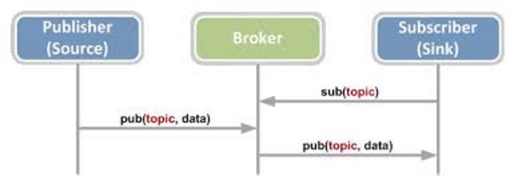

>[Torna a reti di sensori](../sensornetworkshort.md)>[Torna a reti ethernet](../archeth.md)

- [Dettaglio architettura Zigbee](../archzigbee.md)
- [Dettaglio architettura BLE](../archble.md)
- [Dettaglio architettura WiFi infrastruttura](../archwifi.md)
- [Dettaglio architettura WiFi mesh](../archmesh.md) 
- [Dettaglio architettura LoraWAN](../lorawanclasses.md) 


## **Broker MQTT** 

Il **broker MQTT** è solo una delle tante soluzioni possibili per realizzare un **canale multicast** di livello **applicativo** tramite cui un utente col ruolo di **publisher** è in grado di notificare una **replica** dello stesso messaggio a più **subscribers**. E' utile per:
- inoltro dei comandi da un **sensore di comando** su una rete di tipo A (ad es. LoRaWAN) ad un attuatore su una rete diversa di tipo B (ad es. Zigbee)
- inoltro di una **misura** da un **sensore ambientale** su una rete di tipo A (ad es. LoRaWAN) ad un **pannello di controllo** su una rete diversa di tipo B (tipicamente IP)
- inoltro di una **misura** da un **sensore ambientale** su una rete di tipo A (ad es. LoRaWAN) ad un **server di gestione** su una rete diversa di tipo B (tipicamente IP)

Il **canale applicativo** su cui vengono inviati i messaggi sono quindi i **topic**. Su un certo **topic** il dispositivo con il ruolo di **output** agisce come un **publisher**, mentre quello con il ruolo di **input** agisce come un **subscriber**.

Gli utenti, in ogni caso, si comportano tutti come **client** poiché sono loro che **iniziano la connessione** con il broker e non il viceversa. 



**Fasi** del protocollo:
1. Il **Subscriber** dichiara presso il broker il proprio interesse a ricevere notifiche riguardo ad un certo argomento (topic) effettuando una chiamata **subscribe()**
2. il **publisher** pubblica un messaggio che riguarda un **certo topic** effettuando una chiamata **publish()**
3. Il **broker** inoltra il messaggio a tutti i subscriber interessati a **quel topic**

L'**ID MQTT** è un identificativo che permette di individuare un dispositivo ma non è un indirizzo di livello 3, non individua la macchina host in base al suo IP, piuttosto è un indirizzo di livello applicativo noto solo ad un server centrale, cioè il broker. Un dispositivo IoT non è tenuto a conoscere l'IP di tutti gli altri dispositivi ma solamente quello del broker. Il broker soltanto sa gli indirizzi di tutti i dispositivi, conoscenza che acquisisce durante la fase di **connessione** di un client al broker, momento in cui avviene anche il recupero del'**socket remoto** del client.

Il **broker**, dal canto suo, **associa** ogni **topic** con tutti gli **ID** che sono registrati presso di esso come **subscriber**. Questa associazione è utilizzata per smistare tutti i messaggi che arrivano con un certo topic verso tutti gli ID che ad esso sono associati. Il topic diventa così un **indirizzo di gruppo**. La particolarità di questo indirizzo è che è **gerarchico** secondo una struttura ad **albero**, cioè gruppi di dispositivi possono essere suddivisi in **sottogruppi** più piccoli estendendo il nome del path con un **ulteriore prefisso**, diverso per ciascun sottogruppo. L'operazione può essere ripetuta ulteriormente in maniera **ricorsiva**.

**Ad esempio**, posso individuare le lampade della casa con il path ```luci``` e accenderle e spegnerle tutte insieme, ma posso sezionarle ulteriormente con il path ```luci/soggiorno``` con il quale accendere o spegnere solo quelle del soggiorno oppure con il path ```luci/soggiorno/piantane``` con il quale fare la stessa cosa ma solo con le piantane del soggiorno.

Osservando l'albero degli **apparati attivi**, si vede bene che, nelle **reti WiFi**, il **client MQTT** (con il ruolo di **publisher** o di **subscriber**) è sempre il **dispositivo IoT**. 

In **generale**, su reti **non IP**, i **client MQTT** (con il ruolo di **publisher** o di **subscriber**) sono sempre i **gateway di confine** della **rete di sensori**. Le uniche reti di sensori che non hanno bisogno di un gateway di confine che sia, nel contempo anche client MQTT, sono le reti IP. Esistono ancora i gateway nelle **reti IP** ma con **scopi diversi** da quello di **realizzare** un **client MQTT**. Nelle **reti IP**, il **client MQTT** è, normalmente, direttamente **a bordo** del **dispositivo** sensore dotato di indirizzo IP (**MCU**).

Il **vantaggio** del **broker MQTT** è quello di poter gestire in modo semplice e **standardizzato** lo **smistamento** (inoltro) delle **misure** e dei **comandi** tra i vari portatori di interesse (stakeholder) di un **cluster** di reti di sensori, siano essi utenti umani, interfacce grafiche, server applicativi diversi o altri dispositivi IoT.

### **Alternative ad MQTT**

Esistono molte altre soluzioni che magari sono più semplici e graficamente accattivanti ma che passano per portali proprietari o per servizi cloud a pagamento e nulla aggiungono di didatticamente rilevante ai nostri discorsi. Normalmente sono basate su webservices realizzati con protocolli Request/Response quali **HTTPS** e **COAP**.
