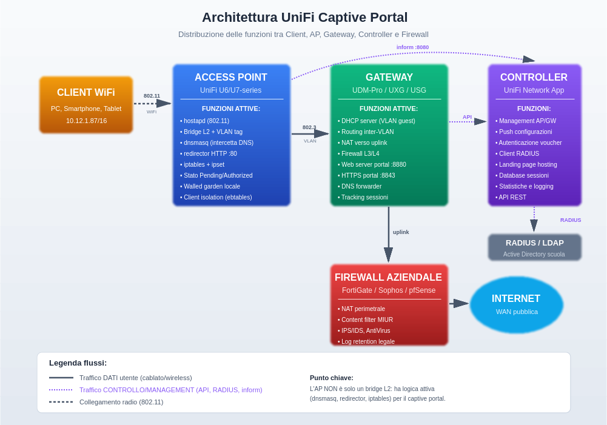
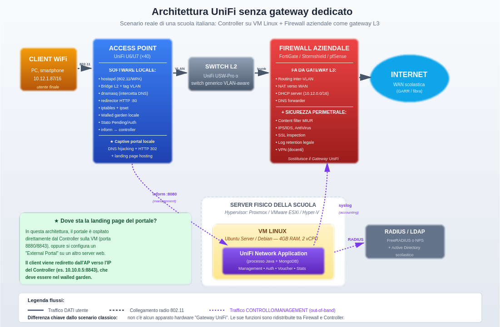
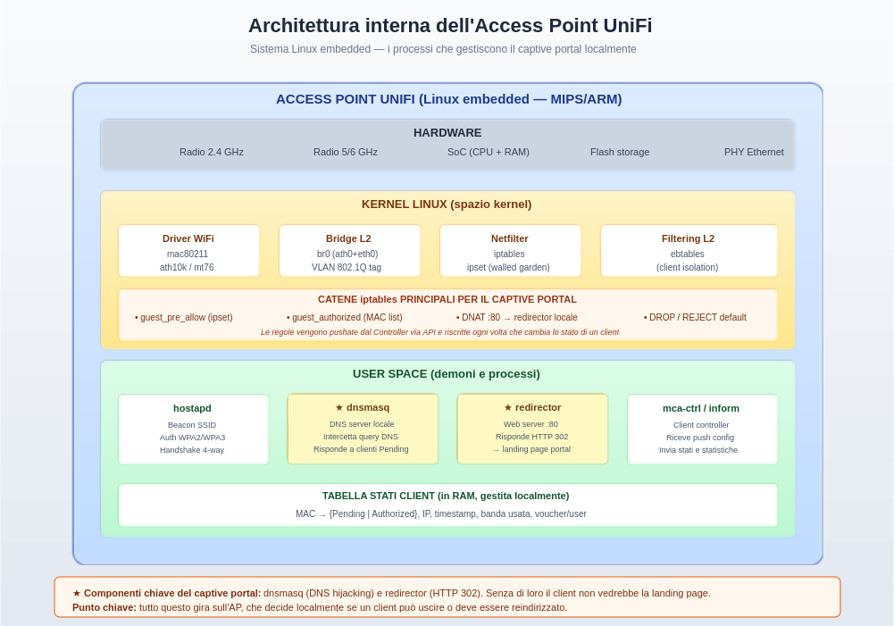
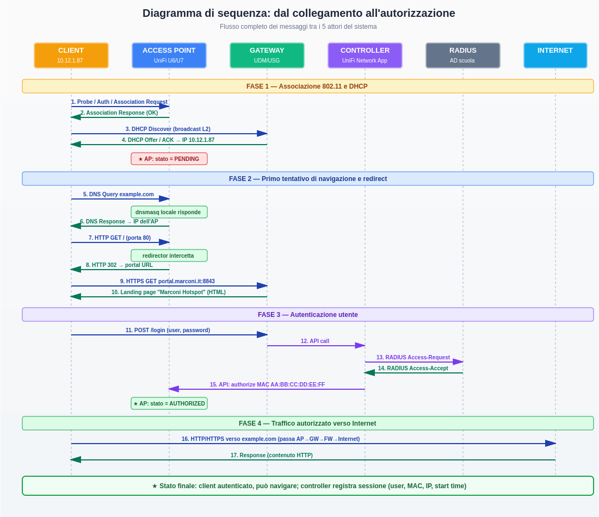

>[Torna a rete wifi infrastruttura](../archwifi.md#autenticazione-utente-presso-un-ap)>[Torna su autenticazione 802.1X](../radius.md)

# Il Captive Portal Ubiquiti UniFi

## Architettura, funzionamento e flusso dei messaggi

**Dispensa per il quinto anno — Indirizzo Informatica e Telecomunicazioni**

*Modulo: Reti wireless e sistemi di accesso autenticato*

> **Prerequisiti:** pila TCP/IP, modello OSI, NAT e firewall, DNS, HTTP, 802.11, VLAN

---

## Indice

1. [Introduzione: cos'è un captive portal e perché serve](#1-introduzione-cosè-un-captive-portal-e-perché-serve)
2. [L'architettura UniFi a colpo d'occhio](#2-larchitettura-unifi-a-colpo-docchio)
2-bis. [Variante reale: l'architettura SENZA gateway UniFi dedicato](#2-bis-variante-reale-larchitettura-senza-gateway-unifi-dedicato)
3. [I cinque attori del sistema](#3-i-cinque-attori-del-sistema)
   - 3.1 Il client
   - 3.2 L'Access Point
   - 3.3 Il Gateway
   - 3.4 Il Controller
   - 3.5 Il firewall aziendale
4. [Come funziona internamente l'Access Point](#4-come-funziona-internamente-laccess-point)
5. [Il flusso completo dei messaggi](#5-il-flusso-completo-dei-messaggi)
   - 5.1 Fase 1 — Associazione 802.11 e DHCP
   - 5.2 Fase 2 — Primo tentativo di navigazione e redirect
   - 5.3 Fase 3 — Autenticazione utente
   - 5.4 Fase 4 — Traffico autorizzato
6. [Il "walled garden" e la pre-autorizzazione](#6-il-walled-garden-e-la-pre-autorizzazione)
7. [Considerazioni sullo scaling e sui colli di bottiglia](#7-considerazioni-sullo-scaling-e-sui-colli-di-bottiglia)
8. [Aspetti di sicurezza e tracciabilità](#8-aspetti-di-sicurezza-e-tracciabilità)
9. [Caso di studio: l'output ipconfig di un client in Pending](#9-caso-di-studio-loutput-ipconfig-di-un-client-in-pending)
10. [Glossario tecnico](#10-glossario-tecnico)
11. [Domande di autoverifica](#11-domande-di-autoverifica)

---

## 1. Introduzione: cos'è un captive portal e perché serve

Un **captive portal** è un meccanismo di controllo dell'accesso a una rete (tipicamente WiFi) che intercetta il primo tentativo di navigazione web di un utente e lo costringe a passare per una pagina di autenticazione prima di concedergli accesso a Internet. Lo trovi ovunque: hotel, aeroporti, treni, scuole, biblioteche, esercizi commerciali. La pagina che vedi quando ti connetti al WiFi del bar e ti chiede di accettare i termini di servizio o di inserire un codice è esattamente questo.

Il captive portal nasce per risolvere quattro esigenze pratiche che le reti WiFi pubbliche o semi-pubbliche hanno sempre avuto:

- **Identificazione degli utenti:** sapere chi sta usando la rete, per ragioni di sicurezza, tracciabilità legale o personalizzazione del servizio.
- **Accettazione di termini d'uso:** trasferire all'utente la responsabilità dell'uso lecito della rete (importante in Italia per proteggere il fornitore del servizio).
- **Limitazione delle risorse:** contingentare banda, durata della sessione, quota di traffico, in modo equo tra gli utenti.
- **Marketing e branding:** personalizzare la landing page con il logo dell'organizzazione, raccogliere email, promuovere servizi.

La sfida tecnica è apparentemente paradossale: come si fa a permettere a un dispositivo di esistere sulla rete (avere un IP, risolvere nomi DNS, raggiungere il server di autenticazione) ma allo stesso tempo bloccare tutto il resto? La soluzione è giocare contemporaneamente su livelli diversi della pila di rete, lasciando passare ciò che è strettamente necessario al funzionamento del portale e bloccando tutto il resto.

> 💡 **Idea chiave**
>
> Il captive portal funziona perché la pila TCP/IP è stratificata. L'AP può lasciar passare DHCP (L2 broadcast), ARP (L2), e DNS verso il proprio resolver, mentre blocca o redireziona HTTP/HTTPS finché il client non si autentica. Senza la stratificazione del modello OSI, un meccanismo del genere sarebbe impossibile.

### Le tre architetture possibili di un captive portal

Esistono tre filosofie implementative principali per costruire un captive portal:

1. **Tutto sul gateway (architettura tradizionale):** un unico apparato centrale fa DHCP, NAT, firewall e gestisce il portale. Gli AP sono semplici antenne. È l'approccio dei vecchi router consumer e di alcuni firewall enterprise come pfSense.

2. **Tutto sul cloud (architettura cloud-managed):** gli AP stabiliscono un tunnel verso un controller cloud che gestisce tutto. È l'approccio di Cisco Meraki, Mist (Juniper), Aruba Central.

3. **Distribuita (architettura UniFi):** gli AP fanno enforcement locale del portale (DNS, redirect, firewall L3 limitato), il gateway gestisce DHCP/NAT/uplink, il controller fa solo management e autenticazione. Ogni componente ha un ruolo preciso e il carico è distribuito.

Questa dispensa analizza in dettaglio la terza architettura, quella di Ubiquiti UniFi, perché è il sistema effettivamente installato in molte scuole italiane (compreso il vostro istituto) e perché rappresenta un esempio didatticamente ricco di come si distribuiscono le funzioni in una rete moderna.

---

## 2. L'architettura UniFi a colpo d'occhio

Prima di entrare nei dettagli, vediamo l'architettura complessiva. Una rete UniFi con captive portal coinvolge cinque componenti principali, ciascuno con una responsabilità precisa. Il diagramma seguente li mostra tutti insieme con i flussi di traffico:



*Figura 1 — Architettura completa di un captive portal UniFi: client, AP, gateway, controller, RADIUS, firewall.*

Una nota di lettura: i flussi sono di due tipi:

- **Traffico DATI utente** (linee continue): è il traffico applicativo del cliente, che attraversa AP → switch → gateway → firewall → Internet.
- **Traffico CONTROLLO/MANAGEMENT** (linee tratteggiate viola): sono le comunicazioni tra i componenti UniFi (AP → controller via protocollo `inform` sulla porta 8080, controller → gateway via API, controller → RADIUS per l'autenticazione).

> 🔑 **Punto chiave dell'architettura**
>
> L'Access Point UniFi **NON è un semplice bridge L2 stupido**. È una macchina Linux embedded con processi attivi che gestiscono parte significativa della logica del captive portal localmente. Questa è una caratteristica distintiva di UniFi rispetto ad architetture controller-based più tradizionali (come Cisco WLC), e ha implicazioni importanti sullo scaling e sul comportamento della rete.

---

## 2-bis. Variante reale: l'architettura SENZA gateway UniFi dedicato

L'architettura mostrata nella Figura 1 è il modello "completo" che vedi nei materiali commerciali Ubiquiti, con tutti i pezzi in casa. Ma nelle reti reali — **specialmente nelle scuole italiane** — è molto comune incontrare uno scenario diverso: **non c'è alcun gateway UniFi**. Il routing, il NAT e il DHCP vengono fatti dal firewall aziendale (FortiGate, Stormshield, pfSense) che già esisteva prima dell'installazione del WiFi UniFi, mentre il **Controller UniFi gira come applicazione software dentro una macchina virtuale Linux** ospitata su un server di virtualizzazione della scuola.

Questo è esattamente lo scenario reale del nostro istituto, ed è importante capirlo perché molti diagrammi standard non lo mostrano.



*Figura 1-bis — Architettura reale di una scuola italiana: nessun apparato hardware "Gateway UniFi", funzioni redistribuite tra Firewall e Controller-su-VM.*

### 2-bis.1 Cosa cambia rispetto allo scenario "completo"

Le differenze concrete sono tre:

**1. Il Firewall aziendale assorbe le funzioni di gateway L3.**
Tutto quello che nello scenario completo era affidato al Gateway UniFi (USG/UDM/UXG) — DHCP server della VLAN guest, routing inter-VLAN, NAT verso WAN, DNS forwarder — viene fatto dal firewall di terze parti. Per il client, il default gateway `10.12.0.1` non è un apparato Ubiquiti ma un FortiGate/Stormshield/pfSense. Funzionalmente non cambia nulla dal punto di vista del client: continua a ricevere il suo IP via DHCP e a uscire verso Internet attraverso quel default gateway.

**2. Il Controller gira come VM, non come hardware dedicato.**
La UniFi Network Application è un'applicazione Java (con database MongoDB embedded) che può essere installata su qualsiasi sistema Linux, Windows o macOS. Tipicamente nelle scuole si crea una VM Ubuntu Server o Debian con 4 GB di RAM e 2 vCPU, sopra un hypervisor scolastico (Proxmox, VMware ESXi, o Hyper-V). La VM riceve un IP della rete di management, e da lì comunica con tutti gli AP via protocollo `inform` sulla porta 8080.

**3. La landing page del portale è ospitata dal Controller stesso.**
Nello scenario completo la pagina HTML del portale era servita dal Gateway UniFi sulle porte 8880/8843. Senza gateway, il Controller stesso fa da web server per la landing page. Quando l'AP fa il redirect HTTP 302, l'header `Location` punta all'IP del Controller (es. `https://10.10.0.5:8843/...`) invece che all'IP del gateway. L'IP del Controller deve quindi essere inserito nel walled garden, altrimenti i client in stato Pending non potrebbero raggiungerlo.

### 2-bis.2 Confronto tabellare delle due architetture

| Funzione | Con Gateway UniFi | Senza Gateway UniFi |
|---|---|---|
| Routing L3 / NAT | Gateway UniFi | Firewall aziendale |
| DHCP server | Gateway UniFi | Firewall aziendale |
| Hosting landing page portale | Gateway UniFi (:8880/:8843) | Controller su VM (:8880/:8843) |
| DNS hijacking + redirect HTTP | AP UniFi (uguale) | AP UniFi (uguale) |
| Walled garden enforcement | AP UniFi (uguale) | AP UniFi (uguale) |
| Stato Pending/Authorized | AP UniFi (uguale) | AP UniFi (uguale) |
| Autenticazione / vouchers / RADIUS | Controller | Controller (su VM) |
| Content filter MIUR / IPS | Firewall aziendale | Firewall aziendale (uguale) |
| Identità del Controller | Cloud Key / UDM-Pro | VM Linux (Ubuntu/Debian) |
| Protocollo AP → Controller | `inform` :8080 | `inform` :8080 (uguale) |

Nota importante: **le funzioni dell'AP non cambiano**. `dnsmasq`, `redirector`, `iptables`, `ipset`, lo stato Pending/Authorized — tutto questo gira sull'AP a prescindere dal fatto che esista o meno un gateway UniFi. È questo che rende l'architettura UniFi flessibile: la "logica intelligente" è distribuita sugli AP e non dipende dalla presenza di hardware Ubiquiti centrale.

### 2-bis.3 Vantaggi e svantaggi di questa architettura

**Vantaggi:**

- **Riuso dell'investimento esistente.** Le scuole spesso hanno già un firewall enterprise acquistato in precedenza con bandi pubblici o convenzioni Consip; non ha senso comprare un secondo apparato di gateway UniFi quando il firewall già fa il lavoro.
- **Content filtering serio.** I firewall enterprise hanno sistemi di filtraggio dei contenuti molto più maturi di quelli integrati nei gateway UniFi (categorie MIUR-compliant, aggiornamento automatico delle blacklist, SSL inspection, ecc.).
- **Gestione separata dei domini di responsabilità.** L'amministratore del WiFi gestisce il Controller; l'amministratore della sicurezza perimetrale gestisce il firewall. Sono spesso persone diverse con competenze diverse.
- **Flessibilità del Controller.** Una VM è facile da migrare, snapshottare, backuppare. Una Cloud Key hardware no.

**Svantaggi:**

- **Più punti da configurare correttamente.** Bisogna assicurarsi che la VLAN guest sia raggiungibile dal Controller (per il management) e che gli AP sappiano dove trovare il Controller (tipicamente via opzione DHCP 43 o via DNS).
- **Walled garden più articolato.** L'IP del Controller deve essere esplicitamente aggiunto al walled garden, altrimenti il redirect non funziona. Spesso i tecnici inesperti dimenticano questo passo.
- **Single point of failure software.** Se la VM del Controller cade (es. l'host di virtualizzazione si spegne), gli AP continuano a far funzionare le configurazioni che hanno già in cache, ma nuove autenticazioni guest possono fallire perché il portale non risponde. Soluzione: backup automatico della VM e high availability.
- **Doppia configurazione DHCP.** Il DHCP del firewall deve essere configurato per fornire le opzioni che gli AP UniFi cercano (in particolare l'opzione 43 con l'IP del Controller, in formato esadecimale specifico).

> 💡 **Come fanno gli AP a trovare il Controller?**
>
> Quando un AP UniFi viene acceso per la prima volta, deve "scoprire" dove sta il Controller. Ci sono tre meccanismi possibili, in ordine di preferenza:
>
> 1. **DHCP Option 43:** il server DHCP (sul firewall) include nelle risposte DHCP un campo speciale che contiene l'IP del Controller. Gli AP lo leggono e si connettono direttamente.
> 2. **Record DNS:** se esiste un record DNS chiamato `unifi.<dominio-locale>`, gli AP lo risolvono e si connettono. Per la vostra scuola sarebbe `unifi.marconicloud.it`.
> 3. **Adoption manuale via SSH:** in mancanza dei due meccanismi automatici, un tecnico deve collegarsi via SSH a ogni AP e dirgli manualmente l'IP del Controller con il comando `set-inform`.
>
> Le scuole serie usano l'opzione 43 perché è completamente automatica: appena un AP viene acceso, riceve l'IP del Controller già nella risposta DHCP e si "adopta" da solo.

### 2-bis.4 Implicazioni per il flusso del captive portal

Tutto il diagramma di sequenza che vedremo nel Capitolo 5 rimane valido, con due piccole differenze:

- Negli step 3-4 (DHCP), il server DHCP che risponde è il **firewall**, non il gateway UniFi.
- Negli step 9-10 (HTTPS GET portal + landing page), il server HTTPS che risponde è il **Controller sulla VM Linux**, non il gateway UniFi.
- Lo step 12 (API call al controller) diventa una chiamata interna del Controller a sé stesso (è già lui che ha ricevuto la POST del login).

Tutto il resto rimane identico: l'AP è sempre il punto chiave dove avviene il DNS hijacking, il redirect HTTP, e l'enforcement dello stato Pending/Authorized.

---

## 3. I cinque attori del sistema

Vediamo ora ciascun componente nel dettaglio: cosa fa, come è fatto, quali protocolli parla.

### 3.1 Il client

Il client è il dispositivo dell'utente finale: un PC portatile, uno smartphone, un tablet. Dal suo punto di vista, il captive portal è quasi trasparente: si connette a un SSID WiFi, riceve un indirizzo IP, e non appena prova a navigare viene reindirizzato a una pagina di login.

Tutti i sistemi operativi moderni implementano una funzione chiamata **Captive Portal Detection** (o CNA, Captive Network Assistant, su Apple). All'associazione, il dispositivo invia automaticamente una richiesta HTTP a un URL ben noto del produttore:

| Sistema operativo | URL di test | Risposta attesa |
|---|---|---|
| Windows 10/11 | `www.msftconnecttest.com/connecttest.txt` | Microsoft Connect Test |
| macOS / iOS | `captive.apple.com/hotspot-detect.html` | `<HTML>...Success...</HTML>` |
| Android | `connectivitycheck.gstatic.com/generate_204` | HTTP 204 No Content |
| Linux (NetworkManager) | `nmcheck.gnome.org/check_network_status.txt` | NetworkManager is online |

Se la risposta è quella attesa, il sistema operativo conclude che la rete è "libera" e procede normalmente. Se invece arriva qualcosa di diverso (un redirect HTTP 302 verso il portale, o una pagina HTML diversa), capisce che c'è un captive portal e apre automaticamente una finestra di browser dedicata per permettere il login. Questo è il motivo per cui, quando ti connetti al WiFi della scuola, la pagina di login compare "da sola" senza che tu debba aprire il browser.

### 3.2 L'Access Point

Gli Access Point UniFi (modelli U6-Lite, U6-Pro, U6-LR, U7-Pro, ecc.) sono dispositivi alimentati via PoE (Power over Ethernet) montati a soffitto o a parete. Internamente sono piccoli computer Linux embedded con queste caratteristiche tecniche tipiche:

- CPU SoC ARM o MIPS (dipende dal modello): MediaTek MT7621, Qualcomm IPQ40xx/IPQ807x, Atheros AR9xxx sui modelli più datati.
- RAM da 128 MB a 512 MB.
- Flash storage da 16 MB a 256 MB con SquashFS read-only + JFFS2/UBIFS per la configurazione.
- Sistema operativo basato originariamente su OpenWrt, oggi su un derivato proprietario di Ubiquiti.
- Una o più radio 802.11 (WiFi 5/6/7) e una porta Ethernet (1 o 2.5 Gbps).

Le funzioni che l'AP esegue sono molte più di quelle che ci si potrebbe aspettare:

- **Funzioni radio:** `hostapd` gestisce l'invio dei beacon dell'SSID, l'associazione dei client, l'handshake WPA2/WPA3 a 4-way, la cifratura/decifratura dei frame.
- **Funzioni di forwarding:** il kernel Linux con il modulo bridge (`br0`) collega l'interfaccia radio e quella Ethernet, applica il tagging VLAN 802.1Q al traffico in uscita, isola i client tra loro tramite `ebtables`.
- **Funzioni di captive portal:** `dnsmasq` intercetta le query DNS dei client non autenticati, un piccolo web server chiamato "redirector" risponde sulla porta 80 con un redirect HTTP 302 verso la landing page, `iptables` con `ipset` implementa il walled garden.
- **Funzioni di management:** il demone "inform" mantiene un canale di comunicazione persistente con il controller, riceve aggiornamenti di configurazione e invia statistiche/eventi.

### 3.3 Il Gateway

Il gateway UniFi (modelli USG, UDM, UDM-Pro, UXG-Pro, UXG-Max) è il cuore L3 della rete. È anch'esso una macchina Linux, ma con CPU più potente (ARM o x86_64) e funzionalità di routing/firewall di livello enterprise. I suoi compiti sono:

- **DHCP server:** assegna gli indirizzi IP ai client. Nel tuo caso, il client ha ricevuto `10.12.1.87` con subnet mask `/16` da un pool gestito dal gateway.
- **Routing inter-VLAN:** instrada il traffico tra le diverse VLAN configurate (es. didattica, docenti, studenti guest, server).
- **NAT:** maschera gli IP privati delle VLAN dietro l'IP del gateway verso l'uplink.
- **Firewall L3/L4:** applica regole iptables tra le VLAN e verso Internet.
- **Web server del portale:** ospita la landing page "Marconi Hotspot" sulla porta 8880 (HTTP) e 8843 (HTTPS).
- **DNS forwarder:** inoltra le query DNS dei client autenticati ai DNS upstream (Google `8.8.8.8`, Cloudflare `1.1.1.1`, o DNS scolastici).

### 3.4 Il Controller

Il Controller (UniFi Network Application) è il cervello di management dell'intera rete. Può girare su:

- Una Cloud Key Gen2/Gen2+ (apparato dedicato Ubiquiti)
- Una macchina x86 self-hosted (Linux/Windows/macOS)
- Direttamente integrato sui gateway UDM/UDM-Pro/UXG (più comune oggi)

Il controller **non è in linea con il traffico dati degli utenti**: il suo ruolo è esclusivamente di management e orchestrazione. Comunica con AP e gateway via protocolli proprietari ("inform" su porta 8080) per:

- Pushare configurazioni (SSID, VLAN, regole firewall, walled garden).
- Ricevere telemetria (client connessi, statistiche traffico, errori).
- Gestire l'autenticazione del captive portal (parlando con server RADIUS esterni o validando voucher contro il proprio DB interno).
- Ospitare la dashboard web di amministrazione.

### 3.5 Il firewall aziendale

In una rete enterprise seria (e una scuola lo è, dal punto di vista delle responsabilità legali), oltre al gateway UniFi c'è un firewall perimetrale dedicato a monte: tipicamente FortiGate, Sophos XG, Palo Alto, Stormshield, o pfSense. Questo apparato fa il lavoro "pesante" di sicurezza:

- **Content filtering:** blocca categorie di siti (gambling, pornografia, violenza). Per le scuole italiane è obbligatorio applicare filtri MIUR-compliant per tutelare i minori.
- **SSL inspection:** decifratura del traffico HTTPS per analizzarlo (con tutte le implicazioni privacy).
- **IPS/IDS:** rilevamento di intrusioni e pattern di attacco noti.
- **Antivirus di rete:** scansione dei file scaricati in transito.
- **Logging legale:** conservazione dei log di navigazione per il tempo previsto dalla normativa (in genere 6-12 mesi).
- **VPN:** accesso remoto sicuro per docenti e amministratori.

La separazione tra gateway UniFi e firewall aziendale è una buona pratica di sicurezza: ogni apparato fa quello per cui è ottimizzato, e un eventuale compromissione di uno non porta automaticamente alla compromissione dell'altro.

---

## 4. Come funziona internamente l'Access Point

L'Access Point è il componente più sottovalutato dell'architettura UniFi. La maggior parte degli studenti (e anche di molti professionisti) lo considera una semplice "antenna intelligente", ma in realtà contiene una stack software complessa che gestisce localmente molte funzioni del captive portal. Vediamo come è organizzato internamente:



*Figura 2 — Architettura interna dell'Access Point UniFi: hardware, kernel Linux, user space.*

### 4.1 Lo stack hardware

Alla base ci sono i componenti hardware: due o tre radio WiFi (una a 2.4 GHz, una o due a 5/6 GHz), un SoC con CPU e RAM, una flash di storage e un PHY Ethernet. Niente di particolarmente speciale rispetto a un router consumer: la differenza la fa il software.

### 4.2 Lo stack kernel

Nel kernel Linux girano i moduli che fanno il lavoro "di basso livello":

- **Driver WiFi:** `mac80211` + driver specifico (`ath10k` per Atheros, `mt76` per MediaTek). Si occupano della comunicazione fisica con la radio.
- **Bridge L2:** `br0` collega l'interfaccia radio (es. `ath0`) all'interfaccia Ethernet (`eth0`). Tutto il traffico WiFi viene "tradotto" in traffico Ethernet e viceversa, applicando i tag VLAN 802.1Q se configurati.
- **Netfilter (iptables):** il sottosistema di firewall del kernel. Sull'AP UniFi viene usato per implementare le regole del captive portal, con catene specifiche per il traffico guest.
- **ipset:** un'estensione di iptables che permette di gestire grandi liste di IP, MAC o reti in modo efficiente. UniFi lo usa per il "walled garden": ogni IP dei domini pre-autorizzati viene aggiunto a un set chiamato `guest_pre_allow`.
- **ebtables:** l'equivalente di iptables ma a livello L2. Serve per implementare il client isolation, cioè impedire che due client guest sulla stessa rete WiFi si vedano tra loro a livello ARP/broadcast.

### 4.3 Le catene iptables del captive portal

Quando un client si connette alla rete guest, vengono attivate sull'AP catene iptables specifiche. Le principali sono:

> 📋 **Catene iptables tipiche su un AP UniFi**
>
> - `guest_pre_allow`: ipset di IP a cui è permesso accedere PRIMA dell'autenticazione (walled garden). Tipicamente contiene gli IP del controller, del portale, dei provider di OAuth se usati.
> - `guest_authorized`: tabella dei MAC address autorizzati. Quando un client completa l'autenticazione, il suo MAC viene aggiunto qui.
> - `DNAT su porta 80 → redirector locale`: tutto il traffico HTTP dei client non autorizzati viene riscritto e dirottato verso il web server locale dell'AP.
> - `DROP/REJECT default`: tutto il resto (ICMP, porte non standard, ecc.) viene scartato. È il motivo per cui il ping al gateway fallisce quando sei in stato Pending.

### 4.4 I demoni in user space

Sopra il kernel, in user space, girano alcuni processi dedicati:

- **hostapd:** gestisce tutto il lato 802.11. Invia i beacon con l'SSID, accetta le richieste di associazione, gestisce l'handshake a 4-way per WPA2/WPA3, controlla il roaming 802.11k/v/r.
- **dnsmasq (★ chiave):** è un DNS server + DHCP server leggero. Sull'AP UniFi viene usato come DNS server LOCALE per i client in stato Pending. Quando un client non autenticato fa una query DNS, dnsmasq la intercetta e risponde con l'IP dell'AP stesso, indipendentemente dal nome richiesto (DNS hijacking benigno). Questo "forza" il client a connettersi all'AP per qualsiasi nome di dominio richiesto.
- **redirector (★ chiave):** è un piccolo web server in ascolto sulla porta 80 dell'AP. Quando il client (ingannato dal DNS) prova a fare HTTP verso un sito qualsiasi, finisce sull'AP. Il redirector risponde con un HTTP 302 verso l'URL del portale ospitato sul gateway. Questo è il meccanismo che fa apparire la pagina "Marconi Hotspot".
- **mca-ctrl / inform agent:** mantiene la connessione persistente con il controller. È il canale attraverso cui l'AP riceve aggiornamenti di configurazione (es. "questo MAC è ora autorizzato, applica le regole") e invia telemetria.

> 💡 **Perché DNS e redirect sull'AP e non sul gateway?**
>
> La scelta di Ubiquiti di mettere `dnsmasq` e il redirector sull'AP (e non sul gateway) ha vantaggi importanti di scalabilità: il traffico dei client non autenticati viene "intercettato" già al primo hop, senza saturare il gateway centrale. In una scuola con 40 AP, ciascuno gestisce localmente i propri client Pending, distribuendo il carico. Il gateway riceve solo il traffico legittimo dei client autorizzati.

---

## 5. Il flusso completo dei messaggi

Vediamo ora come funziona il sistema in azione, seguendo passo passo cosa succede quando un utente si connette per la prima volta al WiFi e si autentica. Il diagramma di sequenza che segue mostra TUTTI i messaggi scambiati tra i cinque attori, divisi in quattro fasi temporali distinte:



*Figura 3 — Diagramma di sequenza completo: dal collegamento all'autenticazione all'accesso a Internet.*

### 5.1 Fase 1 — Associazione 802.11 e DHCP

Quando l'utente seleziona l'SSID "Marconi Hotspot" sul proprio dispositivo, parte una sequenza di scambi puramente di livello 2 (link layer):

1. **Probe + Authentication + Association Request:** il client invia all'AP una serie di frame 802.11 che corrispondono alla "stretta di mano" iniziale. Per le reti aperte (senza password) la fase di authentication è banale; per le reti WPA2/WPA3 c'è anche il 4-way handshake per stabilire le chiavi di cifratura.
2. **Association Response:** l'AP accetta l'associazione e assegna al client un AID (Association ID) interno. Da questo momento il client è agganciato all'AP a livello radio.
3. **DHCP Discover:** il client, ora connesso al livello 2, invia un broadcast DHCP Discover per ottenere un indirizzo IP. Questo broadcast attraversa il bridge dell'AP, viene taggato con la VLAN guest, e raggiunge il gateway.
4. **DHCP Offer + Request + ACK:** il gateway (DHCP server) risponde con un'offerta. Dopo gli scambi DHCP standard, il client riceve l'IP `10.12.1.87`, la subnet mask `255.255.0.0` (`/16`), il default gateway `10.12.0.1` e i DNS server.

> ⚠️ **★ Stato del client: PENDING**
>
> A questo punto, sull'AP, il MAC del client viene inserito automaticamente nella tabella interna dei "client guest in attesa". Tutte le regole iptables di pre-autorizzazione vengono applicate al suo traffico: solo DHCP, DNS verso l'AP stesso, e il traffico verso il walled garden possono passare. Tutto il resto (incluso il ping al gateway!) viene droppato. Questo spiega perché il ping che hai fatto è andato in timeout.

### 5.2 Fase 2 — Primo tentativo di navigazione e redirect

Subito dopo l'associazione, il sistema operativo del client (o l'utente che apre il browser) tenta di accedere a un sito. Qui scatta il meccanismo del captive portal:

5. **DNS Query:** il client invia una query DNS per risolvere, ad esempio, `www.google.com`. La query è destinata al DNS configurato (`10.12.0.1`, il gateway) ma viene intercettata dall'AP.
6. **dnsmasq risponde:** il processo `dnsmasq` locale sull'AP riconosce che il client è in stato Pending e risponde alla query con l'IP dell'AP stesso, ignorando il nome richiesto. È un DNS hijacking deliberato.
7. **HTTP GET /:** il client, ora convinto che `google.com` sia all'IP dell'AP, manda una richiesta HTTP GET sulla porta 80. La richiesta finisce sul redirector dell'AP.
8. **redirector intercetta:** il redirector accetta la connessione TCP, legge la richiesta HTTP, e risponde con un HTTP 302 Found contenente nell'header Location l'URL del portale (es. `https://portal.marconi.it:8843/?mac=AA:BB:CC:DD:EE:FF&ap=...`).
9. **HTTPS GET portal:** il browser del client segue il redirect e si connette al gateway sulla porta 8843 (HTTPS). Questa connessione È permessa dalle regole pre-auth perché l'IP del gateway è nel walled garden.
10. **Landing page:** il gateway risponde con la pagina HTML del portale "Marconi Hotspot", contenente il form di login.

> ⚠️ **Il problema HTTPS**
>
> Il meccanismo di redirect HTTP 302 funziona solo per richieste HTTP non cifrate. Se il client tenta direttamente HTTPS verso un sito esterno, l'AP non può fare redirect perché il traffico è cifrato e qualsiasi tentativo di intercettazione genererebbe un errore di certificato sul browser. In quel caso l'AP semplicemente droppa la connessione, e il browser mostra un errore di rete. La soluzione è il **Captive Portal Detection** del sistema operativo: i moderni OS fanno una richiesta HTTP IN CHIARO a un URL noto subito dopo l'associazione, e quando vedono il redirect aprono automaticamente il portale.

### 5.3 Fase 3 — Autenticazione utente

L'utente compila il form della landing page con username e password (oppure inserisce un voucher) e preme Login:

11. **POST /login:** il browser invia una richiesta POST al gateway con le credenziali nel body.
12. **API call al controller:** il gateway non valida direttamente le credenziali: le inoltra al controller via API REST interna. Il controller è la "fonte di verità" per le policy di autenticazione.
13. **RADIUS Access-Request:** se la WLAN è configurata per usare un server RADIUS esterno (tipico nelle scuole con Active Directory), il controller invia una richiesta RADIUS al server. Il pacchetto contiene username, password (cifrata), MAC address del client, e altri attributi. Il server RADIUS valida le credenziali contro il database utenti (LDAP, AD, MySQL, ecc.).
14. **RADIUS Access-Accept:** se le credenziali sono valide, il server RADIUS risponde con un Access-Accept, opzionalmente con attributi (gruppo utente, banda massima, durata sessione).
15. **API: authorize MAC:** il controller comunica all'AP (via il canale inform) che il MAC del client è ora autorizzato. L'AP riceve il messaggio, aggiorna le regole iptables locali e sposta il client dalla tabella "Pending" a quella "Authorized".

> ✅ **★ Stato del client: AUTHORIZED**
>
> Da questo momento, sull'AP, il MAC del client appartiene alla tabella dei client autorizzati. Le regole iptables di pre-autorizzazione non si applicano più: il traffico passa liberamente verso il gateway e da lì verso Internet (subordinatamente alle regole del firewall aziendale). Il controller registra la sessione nel proprio database con: username, MAC, IP, AP di connessione, timestamp di start, banda assegnata.

### 5.4 Fase 4 — Traffico autorizzato

A questo punto il client può navigare normalmente. Il traffico segue il percorso classico di una rete enterprise:

16. **HTTP/HTTPS verso Internet:** il client manda richieste verso `example.com` (o qualsiasi altro sito). I pacchetti attraversano: AP (forwarding L2) → switch (forwarding VLAN) → gateway (NAT, routing) → firewall aziendale (content filter, SSL inspection, log) → uplink → Internet.
17. **Response:** la risposta torna indietro per la stessa strada, attraversando NAT inverso e arrivando al client.

Il client rimane autorizzato fino a quando:

- Si disconnette dall'SSID (esplicitamente o per uscita dalla copertura).
- Scade il timer di sessione configurato sul controller (es. 8 ore).
- L'amministratore lo disconnette manualmente dalla dashboard.
- Il client supera la quota di banda o di traffico assegnata (se configurate).

Dopo la disconnessione, alla riconnessione successiva il client torna in stato Pending e deve riautenticarsi. Alcune implementazioni usano la persistenza basata su MAC per saltare l'autenticazione se l'utente si riconnette entro un certo intervallo di tempo ("auto-login" via MAC caching), ma questo è meno sicuro e va abilitato esplicitamente.

---

## 6. Il "walled garden" e la pre-autorizzazione

Un concetto fondamentale dei captive portal moderni è il **walled garden** ("giardino recintato"): l'insieme di destinazioni che un client NON ancora autenticato può comunque raggiungere. Questo è necessario per far funzionare il portale stesso e per supportare alcuni metodi di autenticazione moderni.

### Cosa va nel walled garden

Tipicamente il walled garden include:

- **L'IP del portale stesso** (altrimenti il client non potrebbe raggiungerlo per autenticarsi).
- **L'IP del controller** (per le API di autorizzazione).
- **DNS server** (se si usano resolver esterni invece di quello interno).
- **Provider OAuth/social login** (`facebook.com`, `accounts.google.com`, `login.microsoftonline.com`) se la scuola/azienda permette il login tramite social.
- **Gateway di pagamento** (`stripe.com`, `paypal.com`) se si usa il portale per accesso a pagamento.
- **Domini per il Captive Portal Detection** dei sistemi operativi (per evitare che il browser apra il portale prima che il sistema operativo lo rilevi).

### Come è implementato tecnicamente

Su UniFi, il walled garden è gestito attraverso una combinazione di `dnsmasq` e `ipset`:

1. **Configurazione:** l'amministratore inserisce nel controller la lista di domini/IP del walled garden (es. `portal.marconi.it`, `accounts.google.com`).
2. **Push agli AP:** il controller propaga questa lista a tutti gli AP via il canale inform.
3. **Risoluzione DNS:** `dnsmasq` sull'AP risolve i nomi del walled garden tramite i DNS upstream e ottiene gli IP correnti.
4. **Aggiunta a ipset:** ogni IP risolto viene aggiunto al set `guest_pre_allow`.
5. **Regola iptables:** una regola di firewall permette il traffico verso qualsiasi IP nel set `guest_pre_allow` anche per i client in stato Pending.

> 🔄 **Il problema degli IP che cambiano**
>
> Domini come Facebook o Google usano CDN e load balancer: lo stesso nome può risolvere a IP diversi nel tempo. Per gestire questo, `dnsmasq` sull'AP fa caching DNS e "congela" gli IP nel set ipset per la durata del TTL, aggiornandoli quando cambiano. Inoltre, il client che ha già risolto un IP all'inizio della sessione potrebbe trovarsi a parlare con un IP diverso da quello attualmente in walled garden. Per evitare problemi, i walled garden moderni includono spesso intere subnet (CIDR) invece di singoli IP, oppure usano hostname matching nel TLS SNI a livello di firewall.

---

## 7. Considerazioni sullo scaling e sui colli di bottiglia

Una rete WiFi enterprise non è solo "compriamo 40 AP e li attacchiamo": va dimensionata con cura. Vediamo quali sono i punti critici di una rete UniFi con 40 AP.

### 7.1 Capacità del gateway

Anche se gli AP fanno enforcement locale del captive portal, tutto il traffico autorizzato dei client passa comunque dal gateway (per il NAT verso Internet). Il throughput del gateway è quindi un limite fondamentale:

| Modello gateway | Throughput firewall | Adatto a |
|---|---|---|
| UDM (base) | ~ 850 Mbps | Piccoli uffici, max 10-15 AP |
| USG | ~ 250-500 Mbps con IPS | Reti home/small business |
| UDM-Pro | ~ 3.5 Gbps | Scuole medie/grandi (40-100 AP) |
| UXG-Pro / UDM-SE | ~ 5 Gbps | Aziende medie (100+ AP) |
| UXG-Max | ~ 10 Gbps | Grandi installazioni |

### 7.2 Capacità dell'uplink Internet

Quasi sempre il vero collo di bottiglia non è il gateway ma la connessione Internet. Per una scuola italiana le opzioni tipiche sono:

- Fibra **FTTC (VDSL):** 100-200 Mbps down, 20-50 Mbps up. Limitante con 300+ studenti attivi.
- Fibra **FTTH business:** 1 Gbps simmetrico. Adeguato per scuole medie.
- Connessione **GARR** (rete della ricerca/istruzione italiana): 100 Mbps - 10 Gbps a seconda della convenzione. Soluzione più professionale per le scuole.

Con 300 client attivi su 200 Mbps si ha meno di 1 Mbps a testa nelle ore di picco, e si percepisce. Con 1 Gbps simmetrico la situazione è confortevole. Per questo i fondi PNRR Scuola 4.0 hanno spinto molto sull'upgrade della connettività delle scuole italiane.

### 7.3 Capacità per-AP

Ogni AP ha un limite teorico di client che può servire bene contemporaneamente. Le specifiche dei produttori parlano spesso di "200 client per AP", ma la realtà è molto meno generosa:

- Un AP WiFi 6 di fascia media gestisce bene 30-50 client contemporanei con traffico tipico (chat, web, video leggero).
- Oltre i 50-70 client per AP la latenza cresce, le ritrasmissioni aumentano, l'esperienza degrada.
- In un'aula con 30 studenti tutti collegati, un singolo AP può iniziare a soffrire se tutti fanno video streaming.

Per questo si distribuiscono molti AP a bassa potenza piuttosto che pochi AP a piena potenza: meglio avere 40 AP che servono 8-10 studenti ciascuno che 10 AP che cercano di gestire 40 studenti ciascuno.

### 7.4 Spectrum management

Un aspetto sottovalutato: la radio WiFi è un mezzo condiviso. Anche con 40 AP fisicamente distribuiti, devono essere configurati su canali diversi per non interferire tra loro. La banda 2.4 GHz ha solo 3 canali non sovrapposti (1, 6, 11), quindi è praticamente inutile in installazioni dense. La banda 5 GHz ha 19-25 canali (DFS inclusi), che permettono una pianificazione più seria. La banda 6 GHz (WiFi 6E/7) ha ancora più canali ed è il futuro delle installazioni dense.

Il controller UniFi ha funzionalità di RF Optimization automatica che assegna canali e potenze di trasmissione agli AP per minimizzare le interferenze, ma una pianificazione manuale di un wireless engineer rimane spesso superiore in scenari complessi.

---

## 8. Aspetti di sicurezza e tracciabilità

Per una rete scolastica italiana, gli aspetti normativi della tracciabilità sono importanti. Vediamo i punti principali.

### 8.1 Il quadro normativo italiano

La tracciabilità degli accessi a Internet in contesti pubblici/semi-pubblici in Italia è regolata da diverse fonti normative:

- **Decreto Pisanu (2005, abrogato nel 2013):** imponeva l'identificazione preventiva degli utenti per gli hotspot pubblici. Oggi non c'è più obbligo formale di identificazione, ma rimane fondamentale la tracciabilità.
- **Codice della Privacy (D.Lgs. 196/2003) e GDPR:** richiedono misure di sicurezza appropriate e trattamento corretto dei dati personali (inclusi log di navigazione).
- **D.Lgs. 109/2008 (data retention):** impone la conservazione dei dati di traffico per 6-24 mesi, in caso di richiesta dall'autorità giudiziaria.
- **Provvedimento Garante 2008 (amministratori di sistema):** regola la nominazione e il monitoraggio degli amministratori IT.

### 8.2 Cosa devono tracciare le scuole

In pratica, una scuola deve essere in grado di rispondere a una richiesta della Polizia Postale del tipo: *"chi era connesso all'IP X.X.X.X il giorno Y alle ore Z?"*. Per farlo servono:

- Log di autenticazione del captive portal (username + MAC + IP + timestamp).
- Log del firewall perimetrale (IP origine/destinazione + porta + timestamp delle connessioni).
- NTP sincronizzato su tutti gli apparati per allineare i timestamp.
- Conservazione dei log per il periodo richiesto (generalmente 6-12 mesi).

### 8.3 Limitazioni dell'architettura UniFi standard

Quando il captive portal è configurato solo sul controller UniFi (e non integrato col firewall aziendale), ci sono alcune limitazioni:

- **Double NAT:** il traffico passa attraverso due livelli di NAT (UniFi gateway + firewall aziendale). Il firewall vede solo l'IP del gateway, non quello del singolo studente. Per identificare l'utente bisogna correlare i log dei due sistemi.
- **Persistenza dei log:** il controller UniFi conserva i log per un tempo limitato (giorni o settimane). Per la conservazione legale a lungo termine bisogna esportarli su un server syslog esterno.
- **Identità non propagata:** il firewall non sa quale username corrisponde a quale connessione, perché vede solo IP del gateway. Senza integrazione (RADIUS Accounting o syslog correlato) non si possono fare policy identity-based al firewall.

Le soluzioni più professionali risolvono questi problemi con:

- **RADIUS Accounting:** il controller invia gli eventi di login/logout al firewall, che mantiene una tabella IP → username aggiornata.
- **Syslog centralizzato:** entrambi i sistemi inviano log a un server SIEM (Splunk, Graylog, ELK) per correlazione automatica.
- **Bridge mode del gateway UniFi:** eliminare il NAT su UniFi e farlo solo sul firewall, che vede gli IP reali.

---

## 9. Caso di studio: l'output ipconfig di un client in Pending

Concludiamo con un esempio reale: l'output del comando `ipconfig` di un PC connesso al WiFi della scuola, prima dell'autenticazione, e l'analisi di cosa significano i vari valori.

```
C:\Users\studente> ipconfig

Scheda LAN wireless Wi-Fi:
   Suffisso DNS specifico per connessione: marconicloud.it
   Indirizzo IPv6 locale rispetto al collegamento . : fe80::bb3b:7b8c:f76b:9a52%16
   Indirizzo IPv4. . . . . . . . . . . . : 10.12.1.87
   Subnet mask . . . . . . . . . . . . . : 255.255.0.0
   Gateway predefinito . . . . . . . . . : 10.12.0.1

C:\Users\studente> ping 10.12.0.1
Esecuzione di Ping 10.12.0.1 con 32 byte di dati:
Richiesta scaduta.
Richiesta scaduta.
Richiesta scaduta.
```

### 9.1 Analisi dell'output

- `Indirizzo IPv4: 10.12.1.87`: il client ha ricevuto un IP nella rete privata `10.0.0.0/8`. La VLAN guest del Marconi usa il blocco `10.12.0.0/16` (capace di ~65000 host, sovradimensionato volutamente).

- `Subnet mask: 255.255.0.0 (/16)`: maschera a 16 bit. Tutti gli host con IP da `10.12.0.1` a `10.12.255.254` sono nello stesso dominio di broadcast. Una scuola di 1000 studenti ha tantissimo "spazio" di indirizzamento.

- `Gateway predefinito: 10.12.0.1`: è l'IP del gateway UniFi sulla VLAN guest. È il default route per uscire dalla rete locale.

- `Suffisso DNS: marconicloud.it`: dominio DNS della scuola, inviato dal DHCP. Permette query short-form (es. `server` anziché `server.marconicloud.it`).

- `ping 10.12.0.1: Richiesta scaduta`: questo è il comportamento interessante. Il gateway è raggiungibile a livello L2 (l'host esiste, ARP funziona) ma il pacchetto ICMP echo viene scartato. Questo NON è un problema del gateway, ma una regola di firewall sull'AP che droppa ICMP per i client in stato Pending.

### 9.2 Cosa NON vedi nell'output

L'output di `ipconfig` non mostra:

- **Lo stato di autenticazione:** Windows non ha modo di sapere che il PC è in stato Pending sull'AP. Da Windows tutto sembra normale, fino a quando non si prova a navigare.
- **Il MAC dell'AP:** non è esposto al client. Per saperlo servono strumenti di analisi 802.11 (wireshark in monitor mode).
- **Le regole iptables sull'AP:** sono completamente trasparenti al client.
- **La VLAN ID:** il tagging 802.1Q viene tolto dall'AP prima di consegnare il frame al client; il PC vede solo Ethernet untagged.

### 9.3 Esercizio diagnostico

Prova a fare i seguenti test prima e dopo l'autenticazione, e confronta i risultati:

| Comando | Pre-auth (Pending) | Post-auth (Authorized) |
|---|---|---|
| `ipconfig` | Mostra IP | Mostra IP (uguale) |
| `ping 10.12.0.1` | Timeout (ICMP bloccato) | Probabilmente timeout* |
| `ping 8.8.8.8` | Timeout | Risposta |
| `nslookup google.com` | Risposta dall'AP locale | Risposta dal DNS reale |
| `curl http://example.com` | 302 verso portale | Pagina di example.com |
| `tracert 8.8.8.8` | Bloccato al primo hop | Mostra tutti gli hop |

\* Anche dopo l'autenticazione, ICMP verso il gateway potrebbe rimanere bloccato per policy di sicurezza dell'amministratore (è una scelta comune per le reti guest).

---

## 10. Glossario tecnico

| Termine | Definizione |
|---|---|
| **AP (Access Point)** | Dispositivo wireless che fa da bridge tra rete radio (802.11) e rete cablata (802.3). |
| **BSS (Basic Service Set)** | L'insieme di un AP e dei client a esso associati. |
| **Captive Portal** | Pagina web che intercetta il primo accesso degli utenti a una rete WiFi e li costringe ad autenticarsi. |
| **Client Isolation** | Funzione che impedisce ai client connessi allo stesso AP di comunicare tra loro a livello L2. |
| **DHCP** | Dynamic Host Configuration Protocol: assegna automaticamente IP, subnet mask, gateway e DNS ai client. |
| **DNAT** | Destination NAT: riscrittura dell'IP destinazione di un pacchetto. Usato per il redirect verso il portale. |
| **dnsmasq** | Server DNS+DHCP leggero usato negli AP UniFi per intercettare le query DNS dei client Pending. |
| **ebtables** | Firewall L2 di Linux. Su UniFi serve per l'isolamento dei client. |
| **GARR** | Rete della ricerca e dell'istruzione italiana, fornisce connettività alle scuole convenzionate. |
| **hostapd** | Demone Linux che gestisce l'AP 802.11 (beacon, autenticazione, handshake WPA2/WPA3). |
| **inform** | Protocollo proprietario UniFi per la comunicazione tra AP/gateway e controller. |
| **iptables** | Firewall L3/L4 di Linux. Implementa le regole del captive portal sugli AP UniFi. |
| **ipset** | Estensione di iptables per gestire grandi insiemi di IP/MAC. Usato per il walled garden. |
| **NAT** | Network Address Translation: traduzione di indirizzi IP, tipicamente da privati a pubblici. |
| **RADIUS** | Protocollo di autenticazione (Remote Authentication Dial-In User Service) usato per validare credenziali contro Active Directory o altri DB utenti. |
| **redirector** | Web server locale sull'AP UniFi che risponde alle richieste HTTP dei client Pending con un HTTP 302 verso il portale. |
| **SSID** | Service Set Identifier: il nome della rete WiFi (es. "Marconi Hotspot"). |
| **VLAN** | Virtual LAN: segmentazione logica di una rete fisica. Identificata da un tag 802.1Q nel frame Ethernet. |
| **Walled Garden** | Insieme di destinazioni accessibili dai client non autenticati. Necessario per far funzionare il portale stesso. |
| **WPA2/WPA3** | Standard di sicurezza WiFi che cifrano il traffico tra client e AP. WPA3 è più moderno e sicuro. |

---

## 11. Domande di autoverifica

Verifica la tua comprensione rispondendo alle seguenti domande. Le risposte corrette sono argomentate nella dispensa.

### Domande di base

1. Perché un client riceve correttamente un IP dal DHCP anche se non si è ancora autenticato al captive portal?
2. Cosa succede se un client in stato Pending fa una query DNS verso `google.com`?
3. Perché il redirect HTTP 302 funziona solo per richieste in chiaro e non per HTTPS?
4. Quale processo sull'AP UniFi è responsabile dell'invio dei beacon dell'SSID?
5. Cosa contiene la tabella ipset chiamata `guest_pre_allow`?

### Domande di analisi

6. In una scuola con 40 AP UniFi, perché il gateway non collassa nonostante tutti i client passino attraverso di esso?
7. Spiega in che modo il "captive portal detection" del sistema operativo permette di superare il problema HTTPS.
8. Se un'amministratrice scolastica deve identificare lo studente che ha visitato un certo sito web, quali log deve correlare e perché?
9. Perché Ubiquiti ha scelto di mettere `dnsmasq` sull'AP invece che sul gateway centrale?
10. Cosa succede se aggiungi accidentalmente `facebook.com` al walled garden? Quali sono le conseguenze?

### Domande di progettazione

11. Disegna lo schema di una scuola di 600 studenti con 30 AP, indicando dove posizioneresti gateway, firewall, controller, switch core. Specifica le bande necessarie.
12. Come modificheresti l'architettura se la scuola volesse poter applicare regole di firewall identity-based (es. "i docenti possono accedere a YouTube, gli studenti no")?
13. Spiega quali rischi normativi (privacy, data retention) corre una scuola che non conserva i log di autenticazione del captive portal.
14. Confronta i pro e i contro di tre architetture di captive portal: tutto sul gateway, distribuita (UniFi), cloud-managed.
15. Un client riesce a navigare anche in stato Pending verso un dominio specifico. Quali ipotesi fai sul perché? Come lo verifichi?

---

*— Fine della dispensa —*

**Buono studio!**
