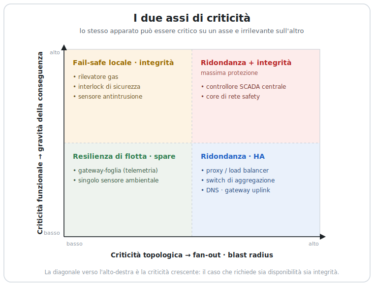
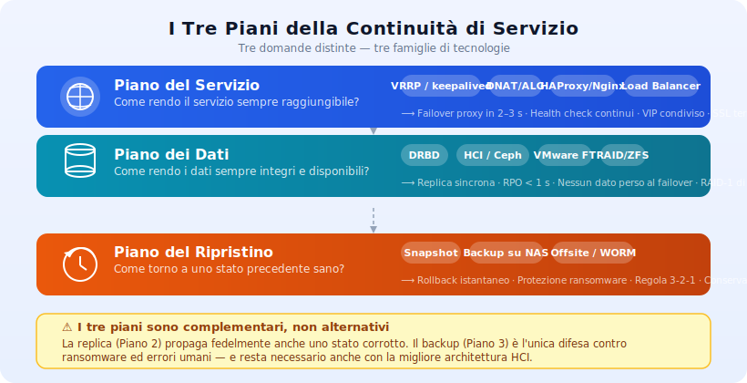
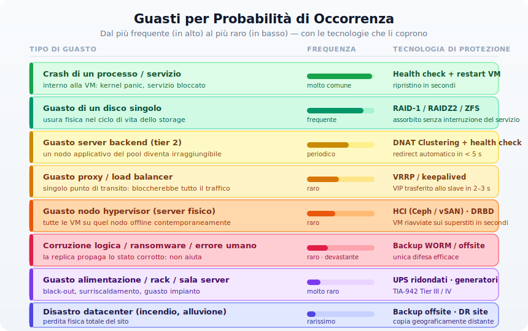
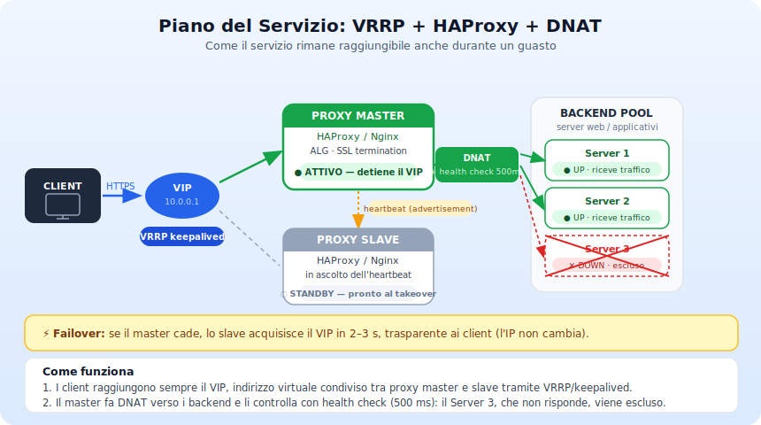
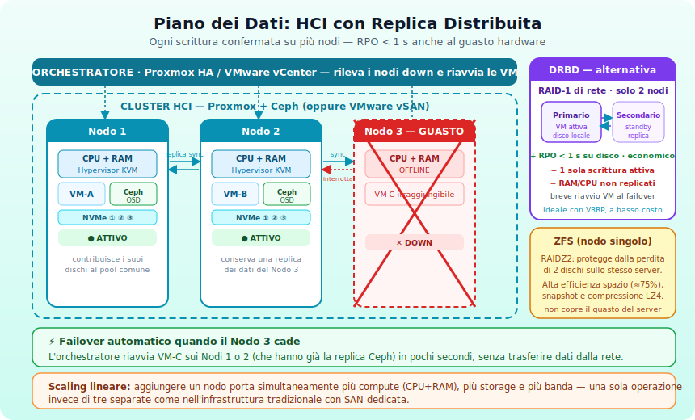
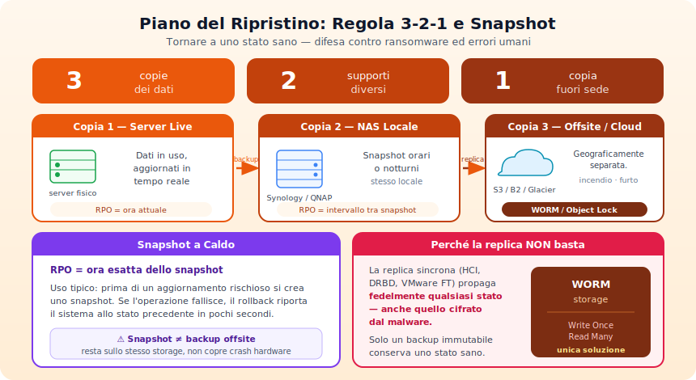
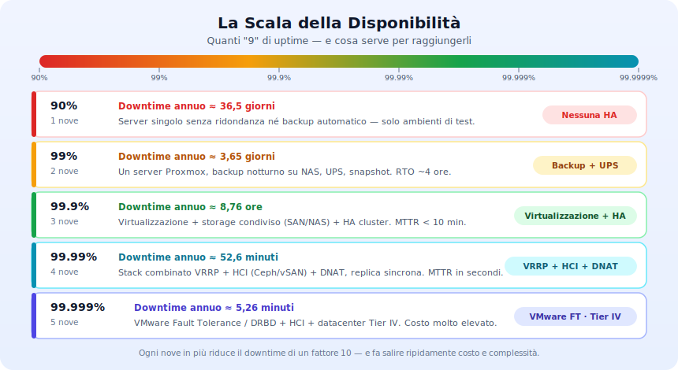
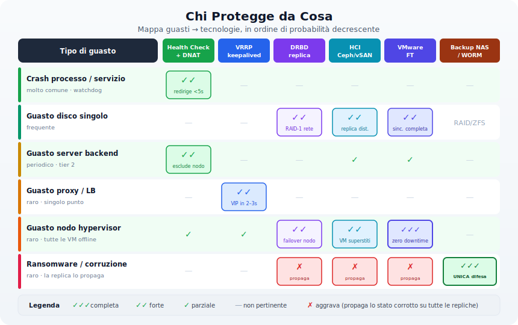
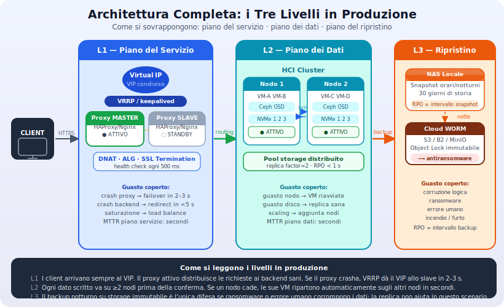

>[Torna a reti di sensori](../sensornetworkshort.md)>[Torna a reti ethernet](../archeth.md)

- [Dettaglio architettura Zigbee](../archzigbee.md)
- [Dettaglio architettura BLE](../archble.md)
- [Dettaglio architettura WiFi infrastruttura](../archwifi.md)
- [Dettaglio architettura WiFi mesh](../archmesh.md) 
- [Dettaglio architettura LoraWAN](../lorawanclasses.md) 

# Continuità di Servizio
## Guida Pratica alle Tecnologie per l'Alta Disponibilità

> Una mappa visiva per orientarsi tra tecnologie, gradi di disponibilità e tipi di guasto — senza perdersi nei parametri SLA.

# 0. Chi Va Protetto, e Perché

> Prima di chiedersi *come* garantire la continuità, bisogna chiedersi *a chi* — e con quale criterio. È la domanda che precede ogni scelta tecnologica: confondere i criteri porta a sovra-proteggere ciò che non conta e a lasciare scoperto ciò che conta davvero.

[](img/00_due_assi.svg)

Le sezioni successive descrivono *come* mantenere un servizio raggiungibile, i dati integri e il ripristino possibile. Ma quelle tecniche hanno un costo — economico e operativo — che cresce rapidamente. Applicarle a tappeto è insostenibile; applicarle a caso è pericoloso. Serve un filtro a monte: **quali apparati sono critici, e per quale ragione lo sono.**

---

## 0.1 Due Assi di Criticità

La criticità non è una proprietà del *tipo* di apparato, ma di due caratteristiche indipendenti che possono presentarsi insieme o separatamente. Lo stesso identico dispositivo può essere critico su un asse e irrilevante sull'altro.

**Criticità topologica (architetturale).** Un apparato è critico per *dove* sta: è un punto di concentrazione o di aggregazione il cui guasto si propaga a valle. È il classico *single point of failure*. La metrica non è la mole di traffico in sé — quella è solo un indizio — ma il **fan-out**: quanti servizi, nodi o utenti dipendono da lui. Un centro-stella può essere critico anche con traffico modesto se tutto vi transita; esiste inoltre una *criticità da dipendenza* (DNS, NTP, autenticazione, default gateway) che è core-like pur senza grandi volumi.

**Criticità funzionale.** Un apparato è critico per *cosa fa*: eroga una funzione di sicurezza, sorveglianza o controllo, indipendentemente dalla sua posizione in rete. Qui la metrica non è quanti altri nodi dipendono da lui, ma **la conseguenza di non erogare quella funzione** — che può arrivare al danno fisico o ambientale.

| | **Criticità topologica** | **Criticità funzionale** |
| --- | --- | --- |
| **Critico per…** | *dove* sta (posizione in rete) | *cosa* fa (funzione svolta) |
| **La domanda** | Quanti dipendono da lui? | Cosa succede se la funzione manca? |
| **Metrica** | Fan-out / blast radius | Gravità della conseguenza |
| **Esempi** | Proxy/load balancer, switch di aggregazione, gateway uplink, DNS | Rilevatore gas, interlock di sicurezza, controllore SCADA, sensore antintrusione |
| **Rimedio dominante** | Ridondanza, HA, eliminazione del SPOF | Logica fail-safe locale, integrità |

La distinzione è operativa: i due assi non solo identificano apparati diversi, ma **portano a rimedi diversi**. La criticità topologica si combatte con la ridondanza (gli strumenti del resto di questa dispensa). La criticità funzionale, come vedremo, spesso *non* si combatte con la ridondanza.

---

## 0.2 Quattro Tipi di Sistema Critico

La letteratura sui sistemi critici offre un vocabolario preciso, utile per assegnare a ogni apparato la sua classe e calibrare di conseguenza RPO, RTO e SLA.

| Tipo | Se fallisce… | Cosa domina | Esempio tipico |
| --- | --- | --- | --- |
| **Safety-critical** | Danno a persone o ambiente | Integrità (fail-safe) | Interlock, rilevatore gas/fumo |
| **Mission-critical** | L'obiettivo non viene raggiunto | Disponibilità | Controllo di processo, navigazione |
| **Business-critical** | Perdita economica significativa | Disponibilità | E-commerce, CRM, gestionale |
| **Security-critical** | Perdita o furto di dati sensibili | Riservatezza/integrità | Sistemi di autenticazione, log |

Gli apparati a criticità *funzionale* (l'edge di sicurezza/controllo) cadono per lo più nelle classi **safety** e **security**. Quelli a criticità *topologica* (il core) nelle classi **mission** e **business**. Non è una corrispondenza rigida, ma orienta la scelta: per i primi conta che il sistema fallisca *bene*, per i secondi che *non fallisca*.

---

## 0.3 Disponibilità ≠ Integrità

> Tutta questa dispensa ragiona in "nove": come tenere un servizio *su*. Ma per un apparato safety-critical l'obiettivo può essere l'opposto — fermarsi in stato sicuro. È la differenza tra **disponibilità** (continuare a erogare) e **integrità** (erogare solo correttamente, altrimenti spegnersi).

Questa distinzione smonta l'istinto "raddoppio e sto tranquillo", e va tenuta presente prima di applicare VRRP, HCI o load balancing a un nodo di sicurezza:

- **La ridondanza dà disponibilità, non integrità.** Avere un percorso ridondante non implica alta disponibilità a meno che il failover sia automatico — e comunque due copie di un nodo safety ne aumentano l'*uptime*, non la *correttezza*. Per quel nodo conta che fallisca in stato sicuro, non che resti acceso.
- **Più componenti, più modi di guasto.** Aggiungere uno slave introduce nuove modalità di guasto e guasti di causa comune. Su un nodo di sicurezza, uno slave che "tiene su" il sistema in uno stato dubbio può essere peggio di uno spegnimento netto.
- **Il framework di riferimento cambia.** Per le funzioni di sicurezza non si ragiona in nove di disponibilità ma in livelli di integrità (SIL, IEC 61508), su probabilità di *guasto pericoloso* e modalità di domanda (bassa domanda vs. continua).

In sintesi: il resto della dispensa vale per gli apparati **mission/business-critical**; per i **safety-critical** è un paradigma complementare, dove la freccia punta a *localizzare e far fallire in sicurezza*, non a *ridondare*.

---

## 0.4 Come si Assegna la Criticità

Il metodo canonico per individuare i destinatari della continuità è la **Business Impact Analysis (BIA)**: si elencano funzioni e apparati, si classificano per *conseguenza del guasto*, e si concentrano le risorse dove serve.

- **Classificazione a tier (ABC).** Ogni apparato riceve una classe — mission-critical, importante, minore — in base all'impatto del suo guasto. La classe determina poi quanti "nove" e quale piano di ripristino gli spettano.
- **FMEA.** L'analisi dei modi di guasto e dei loro effetti rende esplicito *cosa* accade quando il singolo apparato cade, prima ancora di decidere come proteggerlo.
- **Principio 80/20.** Tipicamente un ~20% di apparati genera l'80% dell'impatto. Identificarlo evita di spalmare ridondanza ovunque.

> **Approfondisci:** [BIA e criticità degli asset — NIST IR 8286](https://csrc.nist.gov/pubs/ir/8286/d/final) · [Tassonomia dei sistemi critici](https://en.wikipedia.org/wiki/Mission_critical) · [Sicurezza funzionale — IEC 61508](https://it.wikipedia.org/wiki/IEC_61508)

---

## 0.5 Un Caso Pratico: Ridondare un Gateway?

Il criterio diventa concreto sul caso più frequente in una rete di sensori: un gateway tra mille, va ridondato?

Il punto di partenza è che **"uno su mille" è già metà della risposta**. Un gateway-foglia in una flotta ampia, con celle di copertura sovrapposte, ha per costruzione criticità topologica *bassa*: il suo blast radius è una singola cella. Il default, sull'asse missione, è quindi *non* ridondarlo — la resilienza si costruisce a livello di flotta (copertura ridondante, mesh, store-and-forward) con spare a magazzino e monitoraggio. Ridondare ciascuno dei mille gateway è antieconomico e di solito risolve un problema che non si ha.

La criticità funzionale può ribaltare il verdetto, ma la risposta corretta a un requisito di sicurezza **non è quasi mai ridondare il gateway**: è togliere il gateway dal loop, rendendo locale la decisione di sicurezza. Si ridonda solo nei due casi in cui il nodo *non è davvero* una foglia: quando è un aggregatore travestito (alto fan-out), o quando porta una funzione di sicurezza non localizzabile.

```
Questo gateway va ridondato?

   È una foglia o un aggregatore?
      Aggregatore (alto fan-out)  ──────── Ridonda (è un nodo core)
      Foglia (1 su N, copertura sovrapposta) → prosegui

   Cosa trasporta?
      Solo telemetria  ────────────────── No ridondanza · resilienza di flotta
      Safety / controllo → prosegui

   La decisione sicura è localizzabile?
      Sì  ─────────────────────────────── No ridondanza · autonomia edge + fail-safe locale
      No (gateway nel loop) → prosegui

   Conseguenza grave E finestra cieca > tempo-al-danno?
      Sì  ─────────────────────────────── Ridonda (o ridisegna per localizzare)
      No  ─────────────────────────────── Spare + monitoraggio rapido
```

Lo stesso hardware, due verdetti nella stessa flotta: un gateway che riporta solo la temperatura ambiente → no ridondanza. Un gateway che è l'*unica* via di una linea antintrusione perimetrale o di un rilevatore gas *senza trip locale* → o lo ridondi, o (preferibile) gli affianchi la logica di fail-safe locale, così che la rilevazione non dipenda più dal round-trip verso il centro.

Nell'ultimo ramo dell'albero, la decisione finale pesa tre fattori insieme: la **conseguenza** nella finestra cieca, la **frequenza** con cui la funzione viene richiesta in quella finestra (un allarme demandato di rado tollera una finestra diversa da un controllo continuo), e la **durata della finestra cieca** stessa — che è il MTTR di sostituzione. Se mandare un tecnico con uno spare dà un MTTR molto inferiore al tempo-al-danno, lo spare basta: la ridondanza a caldo aggiunge costo ×1000, non sicurezza.

---

---

## 1. I Tre Piani della Continuità

Prima di tutto: non esiste una tecnologia che fa tutto. La continuità di servizio risponde a **tre domande distinte**, e confonderle porta invariabilmente a scegliere la soluzione sbagliata.



| Piano | La domanda | Cosa non fa |
|---|---|---|
| **Servizio** | Come rendo il servizio sempre *raggiungibile*? | Non protegge i dati |
| **Dati** | Come rendo i dati sempre *integri e disponibili*? | Non protegge da corruzione logica |
| **Ripristino** | Come *torno* a uno stato precedente sano? | Non è HA — agisce *dopo* il danno |

La replica sincrona (piano 2) propaga fedelmente qualsiasi stato del sistema — incluso uno stato cifrato da ransomware. Il backup (piano 3) è l'unica difesa contro la corruzione logica, e rimane necessario anche nell'architettura più sofisticata.

---

## 2. I Guasti: dalla Più Probabile alla Più Rara

Il principio guida è semplice: investire prima nella protezione dai guasti più frequenti, poi salire verso quelli più rari man mano che il costo aumenta.



Leggendo dal basso verso l'alto:

**Crash di un processo o servizio** — il guasto più comune, spesso quotidiano. Basta un health check automatico (HAProxy, systemd watchdog) per rilevarlo e ridirigere il traffico in pochi secondi.

**Guasto di un disco singolo** — si verifica regolarmente nel ciclo di vita di ogni storage. Il RAID (o ZFS/RAIDZ) lo assorbe completamente senza interruzione del servizio.

**Guasto di un server backend** — periodico, coperto dal clustering DNAT con health check: il proxy smette di inviare traffico al nodo irraggiungibile e lo dirige verso quelli sani.

**Guasto del proxy / load balancer** — raro ma catastrofico se non coperto: è il singolo punto di guasto dell'intero piano del servizio. VRRP trasferisce il Virtual IP allo slave in 2–3 secondi.

**Guasto di un nodo hypervisor** — tutte le VM su quel nodo scompaiono contemporaneamente. HCI (Ceph/vSAN) o DRBD permettono il riavvio automatico sui nodi superstiti in pochi secondi.

**Corruzione logica / ransomware** — raro ma devastante, e invisibile alla replica. Unica difesa: backup su storage immutabile (WORM).

**Guasto dell'alimentazione / sala server** — richiede ridondanza fisica (UPS, generatori, TIA-942).

**Disastro del datacenter** — richiede un sito geograficamente separato con backup offsite.

---

## 3. Piano del Servizio: Sempre Raggiungibile

Il piano del servizio è costruito su due livelli sovrapposti, non alternativi.



### Livello 1 — Ridondanza del proxy (VRRP / keepalived)

Due proxy (HAProxy o Nginx) condividono un **Virtual IP (VIP)**: i client raggiungono sempre lo stesso indirizzo. Il protocollo VRRP, gestito da keepalived, monitora i nodi tramite heartbeat periodici. Se il master smette di rispondere, lo slave acquisisce il VIP in **2–3 secondi** — in modo completamente trasparente ai client, che non cambiano indirizzo.

VRRP non sa nulla di cosa il proxy fa al traffico: si occupa solo di garantire che ci sia sempre un proxy attivo.

### Livello 2 — Distribuzione del traffico (DNAT / ALG)

Il proxy attivo distribuisce le connessioni in ingresso ai server backend attraverso **DNAT** (riscrittura dell'indirizzo di destinazione a livello pacchetto). Tre modalità principali:

- **Clustering / Load Balancing** — le connessioni vengono distribuite su un pool di server identici, migliorando prestazioni e resilienza ai guasti singoli.
- **Alta Disponibilità** — health check ogni 500 ms; il server irraggiungibile viene escluso automaticamente dal pool.
- **ALG (Application Level Gateway)** — routing basato sul path URL o sull'hostname. Richiede SSL termination perché il proxy deve leggere il contenuto HTTP.

**SSL Termination**: il proxy apre due connessioni TCP separate — HTTPS col client, HTTP (o HTTPS separato) con i backend. Questo alleggerisce i server dal carico crittografico e permette il routing L7 su traffico cifrato.

> **Approfondisci:** [VRRP e keepalived](tecniche/vrrp_keepalived.md) · [DNAT, clustering e load balancing](tecniche/dnat_load_balancing.md)

---

## 4. Piano dei Dati: Mai Perdere un Byte

Che il servizio sia raggiungibile non implica che i dati siano al sicuro. Se il nodo che acquisisce il VIP non ha una copia aggiornata dei dati, il servizio riparte ma con un database vuoto.



### HCI — Iperconvergenza (Proxmox + Ceph, VMware vSAN)

L'iperconvergenza porta lo storage **dentro** ogni nodo di compute. I dischi di tutti i nodi vengono visti come un unico pool distribuito, accessibile da qualsiasi VM del cluster. Ogni scrittura viene confermata su almeno N nodi fisici diversi prima di essere completata (replica sincrona).

Vantaggi chiave:
- **RPO < 1 secondo** per i dati storage
- Guasto di un nodo → VM riavviate automaticamente sui superstiti, senza trasferire dati dalla rete
- **Data locality**: la VM gira sullo stesso nodo che contiene la copia primaria dei suoi dati, eliminando la latenza SAN
- **Scaling lineare**: aggiungere un nodo porta simultaneamente più compute, più storage e più banda

### DRBD — RAID-1 di rete

DRBD (Distributed Replicated Block Device) è una soluzione più semplice ed economica: replica i blocchi di un disco su un secondo nodo remoto, in modalità **Protocol C** (sincrona — ogni scrittura confermata sul secondario prima di completarsi). RPO < 1 secondo per i dati disco. Limite: solo memoria e registri CPU non vengono replicati — al failover è necessario un breve riavvio della VM (decine di secondi). Funziona bene in combinazione con VRRP/keepalived.

### ZFS — Protezione intra-nodo

ZFS con RAIDZ2 protegge dalla perdita di fino a 2 dischi sullo **stesso server fisico**, con alta efficienza dello spazio (≈75% su 8 dischi). Aggiunge snapshot atomici, compressione LZ4 e deduplicazione. Limite strutturale: non protegge dal guasto dell'intero server.

In Proxmox, ZFS e Ceph si usano insieme: ZFS per le prestazioni di I/O locali e gli snapshot, Ceph per la ridondanza tra nodi.

### VMware Fault Tolerance — L'eccezione

VMware FT sincronizza non solo i dati disco ma **tutto lo stato della VM** — memoria, registri CPU, stato dei dispositivi. La VM slave è già in esecuzione in parallelo sul nodo secondario. Al guasto il failover avviene senza riavvio e senza interruzione. RPO e MTTR entrambi prossimi a zero. Costo: consumo di banda significativo e obbligo di host fisicamente separato.

> **Approfondisci:** [DRBD](tecniche/drbd.md) · [HCI e Ceph](tecniche/hci_ceph.md) · [RAID e ZFS](tecniche/zfs_raid.md) · [VMware Fault Tolerance](tecniche/vmware_ft.md)

---

## 5. Piano del Ripristino: Tornare a uno Stato Sano

Il backup non è la rete di sicurezza dell'infrastruttura poco seria — è lo strato indispensabile che completa qualsiasi architettura, per difendersi dalla corruzione logica che nessuna replica può coprire.



### La Regola 3-2-1

La struttura minima di un piano di backup resiliente:

**3 copie** dei dati — la copia live sul server, una copia locale su NAS, una copia offsite.

**2 supporti diversi** — almeno due tecnologie di storage fisicamente distinte, così un singolo tipo di guasto (es. bug firmware SAN) non cancella tutte le copie.

**1 copia fuori sede** — fisicamente separata dall'edificio principale. Protegge da incendio, alluvione e furto.

### Backup WORM / Immutabile

Per la protezione specifica contro il ransomware, la copia offsite deve essere **immutabile**: i dati non possono essere modificati né cancellati prima di un periodo definito (WORM — Write Once, Read Many). Soluzioni: storage S3 con Object Lock, MinIO in modalità immutabile, Backblaze B2 con versionamento.

### Snapshot a Caldo

Lo snapshot cattura l'intero stato del sistema — disco, memoria, configurazione — senza spegnere il server. Uso ideale: subito prima di un aggiornamento rischioso. Se qualcosa va storto, il rollback riporta il sistema allo stato pre-operazione in pochi secondi. Lo snapshot rimane sullo stesso storage (non protegge da guasti hardware) e non sostituisce il backup offsite.

### Frequenza e RPO

Il Recovery Point Objective (la massima perdita di dati accettabile) dipende direttamente dalla frequenza del backup. Esempi pratici:

| Frequenza backup | RPO massimo | Scenario tipico |
|---|---|---|
| Replica sincrona (HCI/DRBD) | < 1 secondo | E-commerce, ospedale, CRM |
| Snapshot orario | ~59 minuti | Studio professionale, PA media |
| Backup notturno | ~23 ore | Scuola, servizi interni |

> **Approfondisci:** [Backup, regola 3-2-1, snapshot e WORM](tecniche/backup_321_worm.md)

---

## 6. La Scala della Disponibilità

Quanti "nove" vuole il contratto — e cosa serve per raggiungerli?



La scala della disponibilità è utile perché mette in relazione diretta il downtime annuo tollerato con la complessità e il costo dell'infrastruttura. Non esiste una soluzione giusta in assoluto: esiste la soluzione giusta per il profilo di rischio specifico.

Da 99% a 99.9% il salto principale è l'aggiunta della virtualizzazione con HA (failover automatico in minuti). Da 99.9% a 99.99% si aggiungono VRRP, HCI e DNAT per portare il MTTR a secondi. Oltre i quattro nove si entra nel territorio di VMware FT e dei datacenter TIA-942 Tier IV, con costi proporzionalmente molto più elevati.

> **Un caveat importante:** la scala lega la disponibilità alla *tecnologia*, ma il 99.99% reale dipende almeno quanto dalla **maturità operativa** — monitoraggio efficace, runbook scritti, test di failover periodici, gestione corretta delle finestre di manutenzione. Una tecnologia da "quattro nove" mal gestita rende facilmente molto meno; viceversa, processi disciplinati spremono il massimo da un'architettura modesta. La tecnologia pone il tetto; le operations decidono quanto ci si avvicina.

---

## 7. Chi Protegge da Cosa

La mappa completa: quale tecnologia risponde a quale tipo di guasto.



La colonna più importante è quella del ransomware/corruzione logica: tutte le tecnologie di replica (DRBD, HCI, VMware FT) mostrano **✗** perché propagano fedelmente qualsiasi stato, incluso quello corrotto. Solo backup e WORM mostrano **✓✓✓** in quella riga.

---

## 8. Come si Combinano: Architettura Completa

I tre livelli non si escludono — si sovrappongono e si completano.



In un'architettura di produzione completa:

**Livello 1 (Piano del Servizio)** — I client arrivano sempre al Virtual IP condiviso. Il proxy attivo distribuisce le richieste ai backend sani via DNAT. Se il proxy crasha, VRRP dà il VIP allo slave in 2–3 secondi.

**Livello 2 (Piano dei Dati)** — Ogni dato scritto da una VM viene confermato su almeno 2 nodi fisici prima della risposta al client. Se un nodo cade, le sue VM vengono riavviate automaticamente sui nodi superstiti (già in possesso delle repliche) in pochi secondi, senza trasferire nulla dalla rete.

**Livello 3 (Piano del Ripristino)** — Il backup notturno su storage WORM offsite è l'unica difesa se ransomware o errore umano corrompono i dati: in quel caso la replica si trasforma da risorsa in problema, avendo propagato lo stato corrotto ovunque.

---

## 9. Guida Rapida alla Scelta

Una domanda alla volta per trovare il livello giusto.

```
Qual è il downtime annuo massimo accettabile?

   Giorni/ore  ──────────── Backup NAS + UPS + VM Proxmox
                            (scuola, PA, servizi interni)

   Ore/minuti  ──────────── Virtualizzazione con HA cluster
                            (storage condiviso SAN/NAS)

   Minuti/secondi ────────── VRRP + HCI (Ceph/vSAN) + DNAT
                             (e-commerce, ospedale, CRM)

   Secondi/zero ──────────── VMware Fault Tolerance + datacenter ridondato
                             (trading, controllo industriale, pagamenti)
```

```
Il servizio tratta dati personali o ha obblighi normativi?

   Sì (GDPR / NIS2)  ──────  Backup WORM offsite obbligatorio
                             RTO < 72 ore (obbligo notifica GDPR/NIS2)
                             Crittografia a riposo e in transito

   No  ────────────────────  Proporzionale al rischio economico
```

```
Quale guasto preoccupa di più?

   Crash processo/servizio  ──── Health check HAProxy + restart automatico
   Guasto disco             ──── RAID/ZFS (già incluso in qualsiasi NAS)
   Guasto server backend    ──── DNAT Clustering
   Guasto proxy             ──── VRRP / keepalived
   Guasto nodo hypervisor   ──── HCI (Ceph/vSAN) o DRBD
   Ransomware / corruzione  ──── Backup WORM — unica soluzione
   Disastro datacenter      ──── Sito DR geograficamente separato
```

---

## Approfondimenti per Tecnica

Per uno studio in profondità, ogni tecnica ha una scheda dedicata con meccanismo di funzionamento, modalità di guasto, configurazione di massima e link alla documentazione ufficiale:

- [VRRP e keepalived](tecniche/vrrp_keepalived.md) — ridondanza del punto di ingresso
- [DNAT, clustering e load balancing](tecniche/dnat_load_balancing.md) — distribuzione del traffico, L4/L7, ALG, SSL termination
- [DRBD](tecniche/drbd.md) — replica a blocchi, split-brain, quorum, STONITH
- [HCI e Ceph](tecniche/hci_ceph.md) — storage distribuito, CRUSH, OSD, replica vs erasure coding
- [RAID e ZFS](tecniche/zfs_raid.md) — protezione dei dischi nel nodo, RAIDZ, checksum
- [VMware Fault Tolerance](tecniche/vmware_ft.md) — continuità senza riavvio
- [Backup, 3-2-1, snapshot e WORM](tecniche/backup_321_worm.md) — il piano del ripristino e la difesa anti-ransomware
- [HA geografica](tecniche/ha_geografica.md) — active-active, active-passive e quorum tra datacenter (oltre il singolo sito)

---

## Riferimenti Tecnologici Rapidi

| Tecnologia | Cosa fa | Piano | Scope |
|---|---|---|---|
| **VRRP / keepalived** | Condivide un Virtual IP tra proxy master e slave | Servizio | Proxy HA |
| **DNAT Clustering** | Distribuisce connessioni su pool di backend; health check automatici | Servizio | Backend HA |
| **HAProxy / Nginx** | Proxy con routing L4/L7, SSL termination, health check | Servizio | Load balancer |
| **DRBD** | RAID-1 di rete tra due nodi, replica blocchi a livello kernel | Dati | 2 nodi |
| **HCI / Ceph / vSAN** | Storage distribuito su N nodi, replica sincrona, data locality | Dati | Cluster |
| **ZFS / RAIDZ** | Protezione da perdita di dischi sullo stesso server, snapshot | Dati | Nodo singolo |
| **VMware FT** | Replica completa VM (disco + memoria + CPU) su host secondario | Dati | 2 host dedicati |
| **Snapshot a caldo** | Immagine istantanea dello stato VM per rollback rapido | Ripristino | Locale |
| **Backup su NAS** | Immagini VM periodiche su storage locale separato | Ripristino | Locale |
| **Backup WORM offsite** | Copie immutabili su cloud o sito fisicamente separato | Ripristino | Offsite |

---

*Dispensa — Continuità di Servizio e Alta Disponibilità*
