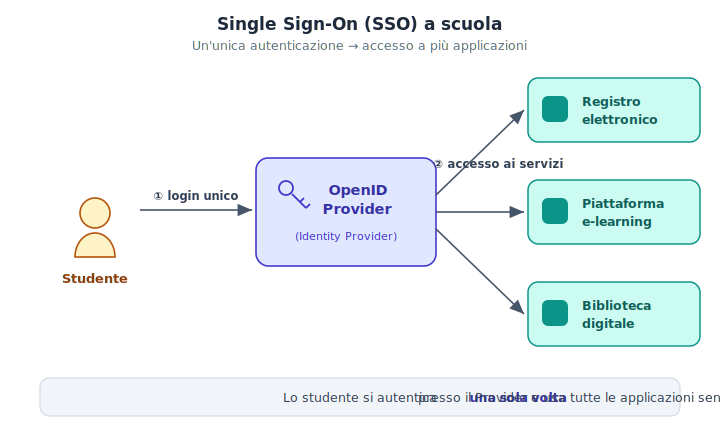
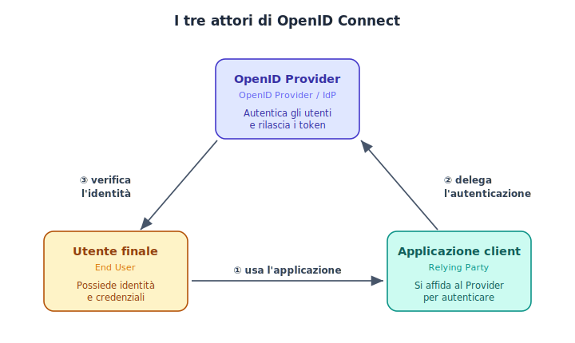
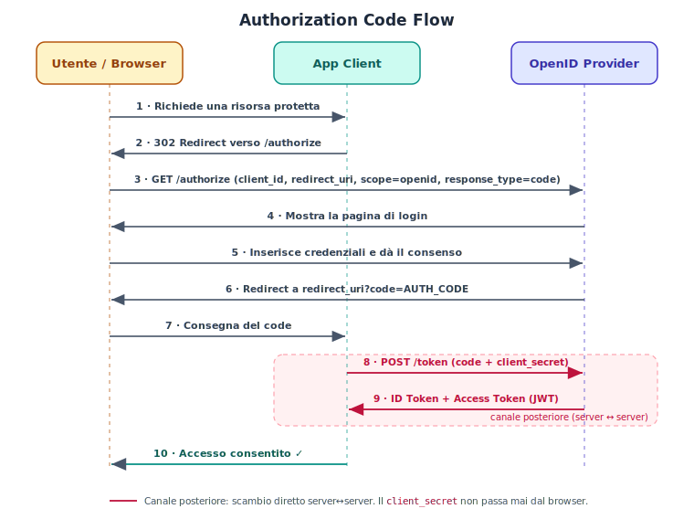
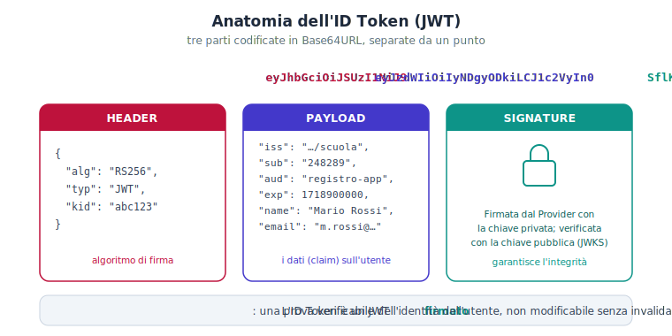
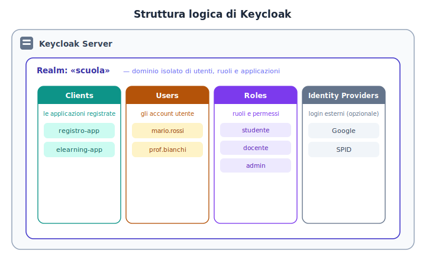

>[Torna a reti di sensori](../sensornetworkshort.md)>[Torna a reti ethernet](../archeth.md)

- [Dettaglio architettura Zigbee](../archzigbee.md)
- [Dettaglio architettura BLE](../archble.md)
- [Dettaglio architettura WiFi infrastruttura](../archwifi.md)
- [Dettaglio architettura WiFi mesh](../archmesh.md) 
- [Dettaglio architettura LoraWAN](../lorawanclasses.md) 

# Dispensa pratica — Installare e configurare un servizio OpenID

> **Cosa significa "OpenID" oggi.** Quando si parla di *servizio OpenID* si intende **OpenID Connect (OIDC)**, lo standard di autenticazione costruito sopra **OAuth 2.0**. (Il vecchio "OpenID 2.0" è deprecato e non si usa più.) In questa dispensa usiamo come Identity Provider concreto **Keycloak**, software open source, installato con **Docker**. I concetti valgono però per qualsiasi provider (Google, Microsoft Entra, Auth0, SPID…).

**Indice**

1. Il caso d'uso
2. I tre attori
3. Concetti chiave (token, endpoint, scope)
4. Il flusso: Authorization Code Flow
5. Anatomia dell'ID Token (JWT)
6. La struttura di Keycloak
7. Installazione di Keycloak con Docker
8. Configurazione passo-passo (realm, client, utente)
9. File di configurazione di esempio
10. Test e verifica
11. Sicurezza
12. Domande tipiche d'esame (con risposte)
13. Glossario ed errori frequenti

---

## 1. Il caso d'uso

**Problema.** Una scuola ha più applicazioni web: il **registro elettronico**, una **piattaforma e-learning**, una **biblioteca digitale**. Senza una soluzione unica, ogni studente dovrebbe avere username e password *diversi* per ogni applicazione, e ogni applicazione dovrebbe gestire (e proteggere) le password per conto suo. È scomodo per gli utenti e rischioso per la sicurezza.

**Soluzione: Single Sign-On (SSO).** Si centralizza l'autenticazione in un unico servizio, l'**OpenID Provider**. Lo studente si autentica **una sola volta** presso il Provider; le applicazioni non vedono mai la password, ma ricevono dal Provider una prova firmata dell'identità.

<p align="center"></p>

**Vantaggi:**

- **Per l'utente:** un solo account, un solo login.
- **Per le applicazioni:** non gestiscono né memorizzano password; delegano tutto al Provider.
- **Per l'amministratore:** utenti, password, blocchi e ruoli si gestiscono in un unico posto.

---

## 2. I tre attori

OpenID Connect mette in relazione tre soggetti. È fondamentale tenerli distinti.

<p align="center"></p>

| Attore | Nome tecnico | Ruolo |
|---|---|---|
| **Utente finale** | *End User* | Possiede l'identità e le credenziali. |
| **Applicazione client** | *Relying Party* (RP) | L'app che vuole sapere "chi è l'utente"; si fida del Provider. |
| **OpenID Provider** | *OpenID Provider* / Identity Provider (IdP) | Autentica l'utente e rilascia i token. |

> **Autenticazione vs autorizzazione.** *Autenticazione* = stabilire **chi sei** (compito di OpenID Connect, tramite l'**ID Token**). *Autorizzazione* = stabilire **cosa puoi fare** (compito di OAuth 2.0, tramite l'**Access Token**). OIDC usa entrambi.

---

## 3. Concetti chiave

**I due token.**

- **ID Token** — un **JWT** che contiene i dati dell'identità (chi è l'utente). È la novità di OpenID Connect rispetto a OAuth 2.0.
- **Access Token** — il "biglietto" con cui il client accede alle risorse/API protette per conto dell'utente.

**Gli endpoint del Provider.** Ogni realm espone URL standard:

| Endpoint | A cosa serve |
|---|---|
| **Discovery** `/.well-known/openid-configuration` | Documento JSON che elenca tutti gli altri URL e le capacità del Provider. |
| **Authorization** `/auth` | Dove si manda l'utente per il login. |
| **Token** `/token` | Dove il client scambia il `code` con i token. |
| **UserInfo** `/userinfo` | Restituisce i dati dell'utente dato un Access Token. |
| **JWKS** `/certs` | Le **chiavi pubbliche** con cui verificare la firma dei token. |

**Gli scope.** Indicano *quali informazioni* il client richiede:

- `openid` → **obbligatorio**, attiva OpenID Connect e l'ID Token;
- `profile` → nome, cognome, username…
- `email` → indirizzo email.

---

## 4. Il flusso: Authorization Code Flow

È il flusso standard e più sicuro per le applicazioni web con un backend. L'idea: i passaggi "pubblici" avvengono nel **browser** (canale anteriore), mentre lo scambio del codice con i token avviene **direttamente fra server** (canale posteriore), dove viaggia il segreto del client.

<p align="center"></p>

**In parole:**

1. L'utente chiede una pagina protetta dell'app client.
2. Il client lo **reindirizza** all'endpoint `/authorize` del Provider (passando `client_id`, `redirect_uri`, `scope=openid`, `response_type=code`).
3. Il browser raggiunge il Provider.
4. Il Provider mostra la **pagina di login**.
5. L'utente inserisce le credenziali e dà il consenso.
6. Il Provider rimanda il browser alla `redirect_uri` allegando un **codice di autorizzazione** monouso (`?code=…`).
7. Il browser consegna il `code` al client.
8. Il client chiama `/token` **dal proprio server**, presentando `code` + `client_secret`. ← *canale posteriore*
9. Il Provider risponde con **ID Token** e **Access Token**.
10. Il client crea la sessione: accesso consentito.

> **Perché due passaggi (code poi token)?** Il `code` viaggia nel browser, esposto; ma da solo è inutile. I token veri si ottengono solo conoscendo il `client_secret`, che resta sul server e **non passa mai dal browser**. Questo è il cuore della sicurezza del flusso.

---

## 5. Anatomia dell'ID Token (JWT)

L'ID Token è un **JWT** (JSON Web Token): tre parti codificate in Base64URL e separate da un punto.

<p align="center"></p>

- **Header** — l'algoritmo di firma (es. `RS256`) e l'identificativo della chiave (`kid`).
- **Payload** — i **claim**, cioè i dati: `iss` (chi ha emesso), `sub` (id univoco utente), `aud` (per quale client), `exp` (scadenza), `name`, `email`…
- **Signature** — la **firma** calcolata dal Provider con la sua chiave **privata**; il client la verifica con la chiave **pubblica** (presa da `/certs`, il JWKS).

> Il payload **non è cifrato**, è solo codificato: chiunque può leggerlo. Ma non può essere **modificato** senza invalidare la firma. La fiducia nasce dalla firma, non dalla segretezza.

---

## 6. La struttura di Keycloak

Prima di installare, ecco come Keycloak organizza le cose: un **server** contiene uno o più **realm**; ogni realm è un dominio isolato con i propri utenti, ruoli e applicazioni.

<p align="center"></p>

- **Realm** — il contenitore isolato (es. `scuola`). Utenti e client di realm diversi non si "vedono".
- **Clients** — le applicazioni registrate (il registro, l'e-learning…).
- **Users** — gli account (studenti, docenti).
- **Roles** — ruoli/permessi (`studente`, `docente`, `admin`).
- **Identity Providers** — login esterni opzionali (Google, SPID…).

---

## 7. Installazione di Keycloak con Docker

**Prerequisiti:** Docker (e Docker Compose) installati; porta `8080` libera.

### Opzione A — comando singolo (rapido, per provare)

```bash
docker run --name keycloak -p 8080:8080 \
  -e KEYCLOAK_ADMIN=admin \
  -e KEYCLOAK_ADMIN_PASSWORD=admin \
  quay.io/keycloak/keycloak:25.0 start-dev
```

### Opzione B — Docker Compose (consigliata)

Crea un file `docker-compose.yml` (vedi §9) e avvia:

```bash
docker compose up -d        # avvia in background
docker compose logs -f      # segui i log finché vedi "started in ..."
```

Poi apri il browser su **`http://localhost:8080`** → *Administration Console* → entra con `admin` / `admin`.

> **Nota sulle versioni.** Su **Keycloak 26+** le variabili per l'admin iniziale sono `KC_BOOTSTRAP_ADMIN_USERNAME` e `KC_BOOTSTRAP_ADMIN_PASSWORD` (al posto di `KEYCLOAK_ADMIN*`). Verifica la versione che usi.
>
> **`start-dev`** usa un database in memoria (i dati si perdono al riavvio): perfetto per esercizi e dimostrazioni, **non** per la produzione, dove serve un database vero (es. PostgreSQL).

---

## 8. Configurazione passo-passo

Tutto dalla *Administration Console* (`http://localhost:8080`).

**8.1 — Creare il realm**
`Create realm` → **Realm name:** `scuola` → *Create*. In alto a sinistra assicurati di aver selezionato il realm `scuola` (non `master`).

**8.2 — Creare il client (l'applicazione)**
`Clients` → `Create client`:

- **Client type:** *OpenID Connect*
- **Client ID:** `registro-app`
- *Next* → **Client authentication:** `On` (client *confidenziale*, cioè con segreto)
- **Authentication flow:** spunta *Standard flow* (= Authorization Code) → *Next*
- **Valid redirect URIs:** `http://localhost:3000/callback`
- **Web origins:** `http://localhost:3000`
- *Save*

Poi nella scheda **Credentials** del client copia il **Client secret**: ti servirà nella configurazione dell'app.

**8.3 — Creare un utente**
`Users` → `Add user` → **Username:** `mario.rossi`, email, nome, cognome → *Create*.
Scheda **Credentials** → `Set password` → scegli una password e metti *Temporary* = `Off`.

**8.4 — (Facoltativo) test rapido via browser**
Per provare subito enza scrivere codice, abilita nel client *Direct access grants* (lo useremo nel test con `curl` al §10).

---

## 9. File di configurazione di esempio

### 9.1 — `docker-compose.yml`

```yaml
services:
  keycloak:
    image: quay.io/keycloak/keycloak:25.0
    container_name: keycloak
    command: start-dev
    environment:
      KEYCLOAK_ADMIN: admin
      KEYCLOAK_ADMIN_PASSWORD: admin
      # Su Keycloak 26+ usa invece:
      # KC_BOOTSTRAP_ADMIN_USERNAME: admin
      # KC_BOOTSTRAP_ADMIN_PASSWORD: admin
    ports:
      - "8080:8080"
```

<details>
<summary><b>Variante con PostgreSQL (dati persistenti) — opzionale</b></summary>

```yaml
services:
  postgres:
    image: postgres:16
    environment:
      POSTGRES_DB: keycloak
      POSTGRES_USER: keycloak
      POSTGRES_PASSWORD: keycloak
    volumes:
      - kc_data:/var/lib/postgresql/data

  keycloak:
    image: quay.io/keycloak/keycloak:25.0
    command: start-dev
    environment:
      KEYCLOAK_ADMIN: admin
      KEYCLOAK_ADMIN_PASSWORD: admin
      KC_DB: postgres
      KC_DB_URL: jdbc:postgresql://postgres:5432/keycloak
      KC_DB_USERNAME: keycloak
      KC_DB_PASSWORD: keycloak
    ports:
      - "8080:8080"
    depends_on:
      - postgres

volumes:
  kc_data:
```
</details>

### 9.2 — Documento di *discovery* (esposto dal Provider)

URL: `http://localhost:8080/realms/scuola/.well-known/openid-configuration`

```json
{
  "issuer": "http://localhost:8080/realms/scuola",
  "authorization_endpoint": "http://localhost:8080/realms/scuola/protocol/openid-connect/auth",
  "token_endpoint":         "http://localhost:8080/realms/scuola/protocol/openid-connect/token",
  "userinfo_endpoint":      "http://localhost:8080/realms/scuola/protocol/openid-connect/userinfo",
  "jwks_uri":               "http://localhost:8080/realms/scuola/protocol/openid-connect/certs",
  "response_types_supported": ["code", "id_token", "token id_token"],
  "scopes_supported": ["openid", "profile", "email"],
  "id_token_signing_alg_values_supported": ["RS256"]
}
```

> Le librerie OIDC leggono **automaticamente** questo documento: basta dare loro l'`issuer` e trovano da sole tutti gli endpoint.

### 9.3 — Definizione del client (estratto di un *realm export* di Keycloak)

```json
{
  "clientId": "registro-app",
  "enabled": true,
  "protocol": "openid-connect",
  "publicClient": false,
  "standardFlowEnabled": true,
  "redirectUris": ["http://localhost:3000/callback"],
  "webOrigins": ["http://localhost:3000"],
  "defaultClientScopes": ["openid", "profile", "email"]
}
```

### 9.4 — Configurazione dell'applicazione client (`.env`)

```bash
# Identità del Provider
OIDC_ISSUER=http://localhost:8080/realms/scuola

# Credenziali del client (da Keycloak → Clients → registro-app → Credentials)
OIDC_CLIENT_ID=registro-app
OIDC_CLIENT_SECRET=Xy3aB...IL_TUO_SEGRETO...

# Dove il Provider rimanda dopo il login
OIDC_REDIRECT_URI=http://localhost:3000/callback
OIDC_SCOPE=openid profile email
```

### 9.5 — Client minimale (Node.js + Express, libreria `openid-client`)

```javascript
import express from "express";
import { Issuer, generators } from "openid-client";

const app = express();

// 1) Scopre gli endpoint dal documento di discovery
const issuer = await Issuer.discover(process.env.OIDC_ISSUER);
const client = new issuer.Client({
  client_id:     process.env.OIDC_CLIENT_ID,
  client_secret: process.env.OIDC_CLIENT_SECRET,
  redirect_uris: [process.env.OIDC_REDIRECT_URI],
  response_types: ["code"],
});

// 2) Avvia il login: reindirizza l'utente ad /authorize
app.get("/login", (req, res) => {
  const url = client.authorizationUrl({ scope: process.env.OIDC_SCOPE });
  res.redirect(url);
});

// 3) Callback: scambia il code con i token e legge l'identità
app.get("/callback", async (req, res) => {
  const params = client.callbackParams(req);
  const tokenSet = await client.callback(
    process.env.OIDC_REDIRECT_URI, params
  );
  const utente = tokenSet.claims();          // contenuto dell'ID Token
  res.send(`Benvenuto ${utente.name} (${utente.email})`);
});

app.listen(3000, () => console.log("Client su http://localhost:3000"));
```

> Lo stesso schema (discover → authorizationUrl → callback) vale per **PHP** (`jumbojett/openid-connect-php`), **Python** (`Authlib`), **Java/Spring Security**, ecc. Cambia la sintassi, non la logica.

### 9.6 — Client minimale (PHP, libreria `jumbojett/openid-connect-php`)

È la libreria OIDC più usata in PHP. Si installa con **Composer**:

```bash
composer require jumbojett/openid-connect-php
```

> **Prerequisito PHP:** deve essere attiva l'estensione **cURL** (`php-curl`). La libreria usa le **sessioni**, quindi parti sempre con `session_start()`.

Un'unica pagina protetta gestisce tutto il flusso. La chiamata `authenticate()` esegue da sola i passi 2–9 del §4 (redirect a `/authorize`, ritorno con il `code`, scambio con `/token`):

```php
<?php
// index.php — pagina protetta dell'applicazione
session_start();
require __DIR__ . '/vendor/autoload.php';

use Jumbojett\OpenIDConnectClient;

// 1) Configura il client con i dati del .env (§9.4)
$oidc = new OpenIDConnectClient(
    getenv('OIDC_ISSUER'),         // es. http://localhost:8080/realms/scuola
    getenv('OIDC_CLIENT_ID'),      // registro-app
    getenv('OIDC_CLIENT_SECRET')   // il segreto del client
);

// La redirect_uri DEVE coincidere con quelle registrate in Keycloak (§8.2)
$oidc->setRedirectURL('http://localhost:3000/index.php');
$oidc->addScope(['openid', 'profile', 'email']);

// 2) Avvia/gestisce il login. Se l'utente non è autenticato,
//    reindirizza al Provider; al ritorno scambia il code con i token.
$oidc->authenticate();

// 3) Identità verificata: leggi i claim
$name  = $oidc->requestUserInfo('name');
$email = $oidc->requestUserInfo('email');
$sub   = $oidc->getIdTokenPayload()->sub;   // id univoco dell'utente

echo "Benvenuto " . htmlspecialchars($name) .
     " (" . htmlspecialchars($email) . ") — id: " . htmlspecialchars($sub);
?>
```

Pagina di **logout** (chiude la sessione locale e quella sul Provider):

```php
<?php
// logout.php
session_start();
require __DIR__ . '/vendor/autoload.php';

use Jumbojett\OpenIDConnectClient;

$oidc = new OpenIDConnectClient(
    getenv('OIDC_ISSUER'),
    getenv('OIDC_CLIENT_ID'),
    getenv('OIDC_CLIENT_SECRET')
);

// reindirizza al login del Provider e poi torna alla home
$oidc->signOut(
    $_SESSION['id_token'] ?? '',
    'http://localhost:3000/index.php'
);
?>
```

Avvio rapido con il server PHP integrato (solo per prove):

```bash
php -S localhost:3000
```

> **Differenza rispetto a Node:** qui non scrivi a mano gli endpoint `/login` e `/callback`. La libreria usa **la stessa pagina** sia per partire sia per ricevere il ritorno: per questo la `setRedirectURL(...)` punta a `index.php` stesso, e tale URL va aggiunto fra le *Valid redirect URIs* del client in Keycloak.

---

## 10. Test e verifica

### 10.1 — Verifica che il Provider risponda

```bash
curl http://localhost:8080/realms/scuola/.well-known/openid-configuration
```

Deve restituire il JSON del §9.2.

### 10.2 — Ottenere un token (test rapido, richiede *Direct access grants* attivo)

```bash
curl -X POST \
  http://localhost:8080/realms/scuola/protocol/openid-connect/token \
  -d "grant_type=password" \
  -d "client_id=registro-app" \
  -d "client_secret=IL_TUO_SEGRETO" \
  -d "username=mario.rossi" \
  -d "password=LA_PASSWORD" \
  -d "scope=openid profile email"
```

Risposta (estratto):

```json
{
  "access_token": "eyJ...",
  "id_token":     "eyJ...",
  "expires_in":   300,
  "token_type":   "Bearer"
}
```

> *Direct access grants* (grant `password`) è comodo **solo per i test**: il flusso da usare nelle vere applicazioni web è l'**Authorization Code Flow** del §4.

### 10.3 — Leggere il contenuto dell'ID Token

Incolla il valore di `id_token` su **jwt.io**, oppure decodifica la parte centrale (payload):

```bash
echo "<PARTE_PAYLOAD_DEL_TOKEN>" | base64 -d
```

Vedrai i claim: `iss`, `sub`, `aud`, `exp`, `name`, `email`…

---

## 11. Sicurezza (punti da citare all'esame)

- **HTTPS sempre** in produzione: i token sono credenziali; in chiaro sono intercettabili.
- **Il `client_secret` resta sul server**, mai nel codice frontend o nel browser.
- **Verifica della firma** dell'ID Token con il JWKS, e controllo dei claim `iss`, `aud`, `exp`.
- **Scadenza breve** degli Access Token; rinnovo con il **refresh token**.
- **PKCE** (Proof Key for Code Exchange): protegge il flusso, obbligatorio per app pubbliche (SPA, mobile) che non possono custodire un segreto.
- **`redirect_uri` registrate esplicitamente**: impedisce di dirottare il codice verso siti malevoli.

---

## 12. Domande tipiche d'esame (con risposte)

**D: Differenza tra OAuth 2.0 e OpenID Connect?**
R: OAuth 2.0 è un protocollo di **autorizzazione** (delega l'accesso a risorse, tramite Access Token). OpenID Connect è uno strato di **autenticazione** costruito sopra OAuth 2.0: aggiunge l'**ID Token** per dire *chi è* l'utente.

**D: Cos'è il Single Sign-On?**
R: Un meccanismo per cui l'utente si autentica **una volta** presso un Provider e accede a più applicazioni senza nuovi login.

**D: Perché il flusso usa prima un `code` e poi i token?**
R: Il `code` transita nel browser (canale anteriore) ma è inutile da solo; i token si ottengono solo dal server presentando il `client_secret` (canale posteriore), che non è mai esposto.

**D: Cos'è un JWT e come si verifica?**
R: Header.Payload.Signature in Base64URL. Si verifica ricalcolando/controllando la **firma** con la chiave pubblica del Provider (JWKS) e validando i claim `iss`, `aud`, `exp`.

**D: A cosa serve lo scope `openid`?**
R: È obbligatorio per attivare OpenID Connect: senza di esso il Provider non emette l'ID Token.

**D: Cos'è un realm in Keycloak?**
R: Un dominio isolato che raggruppa utenti, ruoli e client; realm diversi non condividono nulla.

**D: Client confidenziale vs pubblico?**
R: *Confidenziale* = ha un `client_secret` e gira su un server (app web con backend). *Pubblico* = non può custodire segreti (SPA, app mobile) e si protegge con PKCE.

---

## 13. Glossario ed errori frequenti

**Glossario rapido**

- **IdP / OpenID Provider** — chi autentica e rilascia i token.
- **Relying Party / Client** — l'app che si fida del Provider.
- **Claim** — singola informazione dentro un token (es. `email`).
- **Discovery** — documento `.well-known` che pubblica gli endpoint.
- **JWKS** — insieme delle chiavi pubbliche per verificare le firme.
- **Scope** — insieme di dati/permessi richiesti.

**Errori frequenti**

| Sintomo | Causa tipica |
|---|---|
| `Invalid redirect uri` | La `redirect_uri` dell'app non coincide **esattamente** con quella registrata nel client. |
| Login ok ma nessun ID Token | Manca lo scope `openid`. |
| `invalid_client` | `client_id`/`client_secret` errati, o client impostato come *pubblico*. |
| Firma non valida | `issuer` sbagliato o chiavi non aggiornate dal JWKS. |
| Dati persi dopo il riavvio | Si sta usando `start-dev` (DB in memoria): serve un database persistente. |
```
