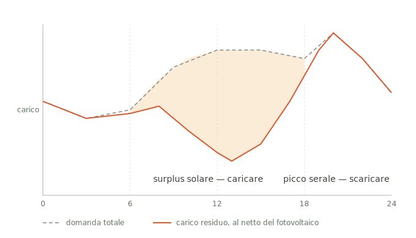
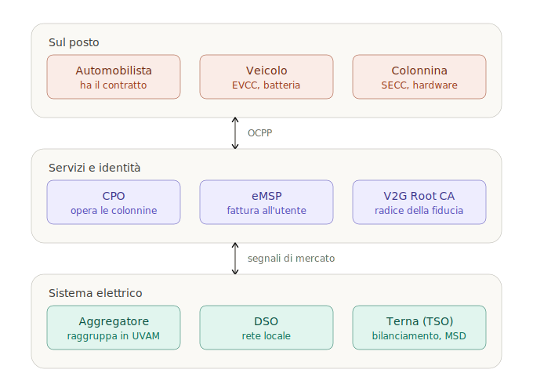
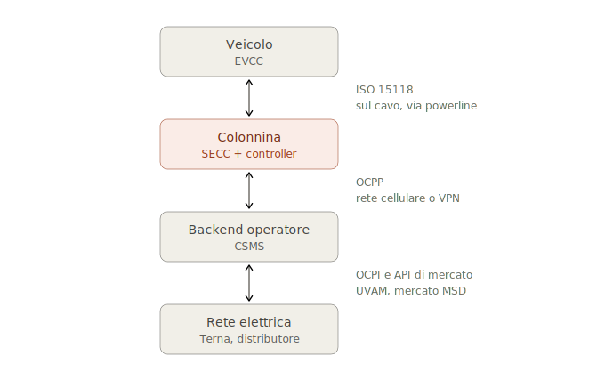
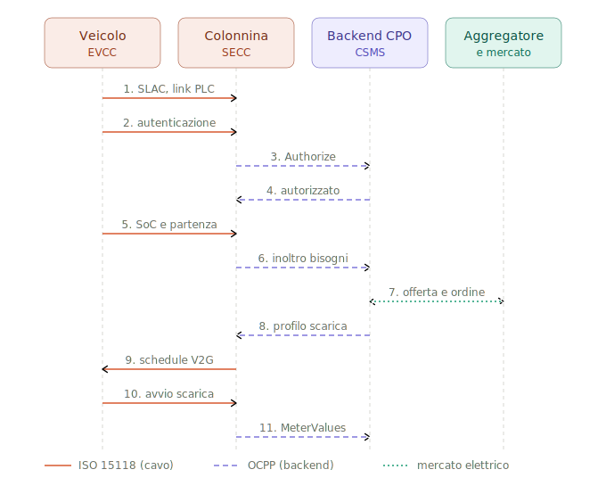
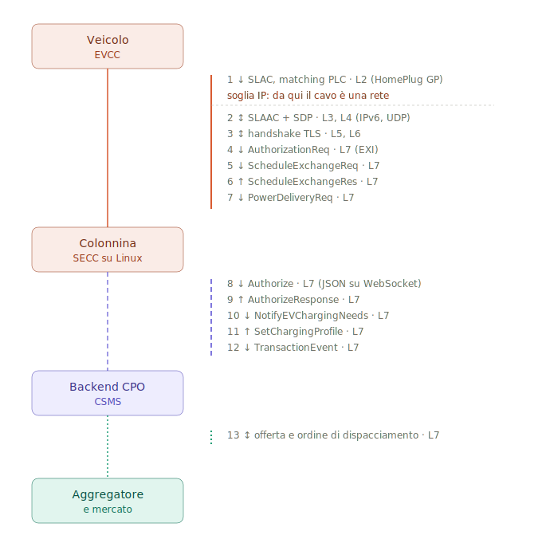

# V2G, modulazione della domanda e sicurezza

### Dispensa introduttiva

---

## Premessa

Questa dispensa nasce da una domanda semplice: come è possibile che un'infrastruttura definita "critica" — le colonnine di ricarica elettrica — presenti vulnerabilità elementari come credenziali di default `root:root` raggiungibili dal cavo di ricarica?

La risposta breve è che il settore non è nato come infrastruttura critica: ci è diventato. La risposta lunga richiede di capire tre cose insieme — perché serve il V2G, come è fatta l'architettura che lo rende possibile, e dove quella architettura lascia scoperti i fianchi.

Le tre parti si leggono in sequenza, ma la Parte IV (*Quello che manca al quadro*) è probabilmente la più utile a chi ha già familiarità con i primi due argomenti: raccoglie i vincoli economici, regolatori e di privacy che nel dibattito tecnico vengono sistematicamente sottovalutati e che, allo stato attuale, pesano sull'adozione più della tecnologia stessa.

**Nota sulle cifre.** Dove riporto numeri quantitativi (efficienze, ricavi, tempi di degrado) li segnalo come indicativi. Sono grandezze in movimento e fortemente dipendenti dal contesto regolatorio nazionale; vanno verificate su fonti primarie prima di essere usate in una valutazione economica.

---

# Parte I — Il problema energetico

## 1.1 Perché serve modulare la domanda

Una rete elettrica deve mantenere in ogni istante l'equilibrio fra energia immessa e energia prelevata. Non è una preferenza gestionale: è un vincolo fisico. Uno squilibrio si manifesta come deviazione della frequenza dal valore nominale (50 Hz in Europa), e deviazioni sufficientemente ampie provocano il distacco automatico di generatori e carichi, a cascata, fino al blackout.

Storicamente l'equilibrio si è mantenuto agendo sull'**offerta**: la domanda era considerata un dato esogeno da inseguire, e si accendevano o spegnevano centrali per seguirla. Questo funzionava perché le centrali termoelettriche sono dispacciabili — si comanda quanta potenza erogano.

Le rinnovabili non lo sono. Il sole e il vento producono quando ci sono, non quando serve. Più cresce la loro quota, più diventa necessario agire sull'altro lato dell'equazione: rendere la **domanda** flessibile, e accumulare l'energia in eccesso per restituirla quando manca.

## 1.2 La curva dell'anatra e la rampa serale

Il fenomeno che rende urgente questo cambio di paradigma ha un nome pittoresco: la *duck curve*, la curva dell'anatra. Descrive l'andamento del carico residuo — la domanda che resta da coprire con generazione tradizionale dopo aver sottratto il fotovoltaico.

In una rete con molto solare:

- **Mattina** — il carico residuo è alto, il sole è basso.
- **Mezzogiorno** — il fotovoltaico produce al massimo, il carico residuo crolla. In presenza di sovrapproduzione i prezzi zonali possono scendere a zero o diventare negativi, e si ricorre al *curtailment*: si spengono impianti rinnovabili perfettamente funzionanti perché la loro energia non ha dove andare.
- **Tramonto** — il fotovoltaico va a zero nell'arco di un paio d'ore, proprio mentre i consumi domestici salgono. Il carico residuo risale con una pendenza ripidissima.

<figure>

<figcaption><em>Fig. 1 — La curva dell'anatra. L'area ombreggiata è il contributo del fotovoltaico. Schema qualitativo, non dati reali.</em></figcaption>
</figure>

Quest'ultimo tratto — la **rampa serale**, orientativamente fra le 18 e le 22 in Italia — è il vero problema. Non è la quantità di energia a mancare: è la velocità con cui bisogna procurarla. Coprire una rampa richiede impianti capaci di variare potenza in fretta, che sono i più costosi e i più inquinanti del parco.

> **Punto chiave.** Il valore di un accumulo non sta nel quanto immagazzina, ma nel *quando* restituisce. Un'ora di scarica alle 19 vale molto più di dieci ore di scarica alle 3 del mattino.

Questo ribalta un'intuizione diffusa. La vecchia logica "carico l'auto di notte quando l'energia costa poco" apparteneva a una rete a carbone e nucleare, dove il problema era smaltire la produzione di base notturna. In una rete a forte penetrazione solare la logica corretta è l'opposta: **caricare intorno a mezzogiorno, scaricare al tramonto**.

## 1.3 Il caso italiano e meridionale

L'Italia presenta questa dinamica in forma accentuata, e il Mezzogiorno ancora di più. La Sicilia in particolare combina:

- irraggiamento fra i più alti d'Europa e una forte crescita del fotovoltaico, sia utility-scale sia distribuito;
- una rete di trasmissione con capacità di interconnessione limitata verso il continente, che rende difficile esportare i surplus;
- conseguente esposizione al curtailment e a prezzi zonali molto volatili.

È esattamente il profilo in cui un accumulo distribuito ha il massimo valore teorico: c'è energia in eccesso da assorbire di giorno e un picco serale da coprire, sullo stesso territorio.

## 1.4 L'auto elettrica come candidato accumulo

Perché proprio le auto? Tre ragioni.

**Sono ferme quasi sempre.** Un'automobile privata è parcheggiata per una percentuale del tempo che nelle stime correnti si colloca oltre il 90%. Per la maggior parte della sua vita è una batteria immobile e inutilizzata.

**Le batterie sono grandi.** Un veicolo moderno monta comunemente 50–80 kWh, contro i 5–15 kWh di un accumulo domestico tipico. Poche migliaia di auto equivalgono a un impianto di accumulo di scala industriale.

**Sono già pagate.** È il punto economicamente decisivo. La batteria è già stata acquistata per un'altra ragione — muovere il veicolo. Il costo marginale di usarla anche come accumulo di rete è molto inferiore al costo di costruire accumulo stazionario dedicato. Il V2G, in questa lettura, non è un investimento in accumulo: è la monetizzazione di un asset esistente sottoutilizzato.

**Il profilo tipico funziona.** Un'auto che arriva al parcheggio aziendale alle 8:30 e riparte alle 18 attraversa integralmente la finestra solare. Carica quando c'è surplus, e arriva a casa carica giusto in tempo per la rampa serale.

## 1.5 V1G e V2G: la distinzione fondamentale

Questa è la distinzione che nel dibattito pubblico viene più spesso confusa, e ha conseguenze pratiche enormi.

| | **V1G** (ricarica intelligente) | **V2G** (ricarica bidirezionale) |
|---|---|---|
| Flusso | Solo verso il veicolo | In entrambe le direzioni |
| Escursione su 15 kW | da 0 a +15 kW | da −15 a +15 kW |
| Hardware | Colonnina standard + logica di controllo | Convertitore bidirezionale, più costoso |
| Batteria | Nessun ciclo aggiuntivo | Cicli aggiuntivi, degrado da valutare |
| Garanzia veicolo | Nessun impatto | Possibili limitazioni del costruttore |
| Maturità | Disponibile ora | In sperimentazione |

Il V1G consiste semplicemente nel decidere **quando** e **a quale potenza** caricare. Non richiede hardware bidirezionale, non aggiunge cicli alla batteria, non pone problemi di garanzia, e cattura comunque una quota rilevante del valore di flessibilità: spostare un carico è utile alla rete quasi quanto invertirlo.

Questo spiega perché le roadmap di settore collocano il V1G a breve termine (2026–2027) e il V2G pubblico oltre il 2030. Chi presenta il V2G come imminente sta di norma parlando di V1G, o di una nicchia.

> **Regola pratica.** Prima di valutare un progetto V2G, chiedersi sempre: quanta parte del beneficio si otterrebbe con il solo V1G, a una frazione del costo e della complessità? Spesso la risposta è "la maggior parte".

## 1.6 La famiglia V2X: V2H, V2B, V2L

Il V2G in senso stretto — vendere energia al mercato elettrico nazionale — è solo un membro di una famiglia più ampia, e non necessariamente il più promettente nel breve periodo.

- **V2L** (*vehicle-to-load*) — alimentare apparecchi direttamente dall'auto tramite una presa. Già disponibile su diversi modelli in commercio. Nessuna integrazione di rete richiesta.
- **V2H** (*vehicle-to-home*) — alimentare l'abitazione. Utile per autoconsumo del proprio fotovoltaico e come continuità in caso di blackout.
- **V2B** (*vehicle-to-building*) — stessa logica su edifici commerciali, con in più il *peak shaving*: ridurre il picco di potenza prelevata, voce di costo significativa nelle bollette commerciali.
- **V2G** (*vehicle-to-grid*) — partecipazione ai mercati elettrici.

**Il V2H e il V2B sono economicamente più accessibili del V2G**, perché il valore che catturano — evitare di acquistare energia a prezzo di vendita al dettaglio, o abbassare il picco contrattuale — è tipicamente superiore a quello che si ottiene vendendo la stessa energia sui mercati all'ingrosso. Inoltre non richiedono aggregatori, qualificazione al mercato dei servizi, né coordinamento con il gestore di rete.

Una valutazione onesta del V2G dovrebbe sempre partire dal confronto con queste alternative più semplici.

---

# Parte II — L'architettura

## 2.1 Gli attori

L'ecosistema si articola su tre domini.

<figure>

<figcaption><em>Fig. 2 — Gli attori dell'ecosistema, raggruppati per dominio.</em></figcaption>
</figure>

**Dominio locale (sul posto)**

- **Automobilista** — titolare del contratto di ricarica, e proprietario della batteria che si intende usare.
- **Veicolo** — al suo interno l'*EVCC* (Electric Vehicle Communication Controller), il modulo che parla con la colonnina.
- **Colonnina** — al suo interno il *SECC* (Supply Equipment Communication Controller), tipicamente un sistema Linux embedded, più l'elettronica di potenza.

**Dominio dei servizi e dell'identità**

- **CPO** (*Charge Point Operator*) — possiede e gestisce fisicamente le colonnine, opera il backend (*CSMS*, Charging Station Management System).
- **eMSP** (*e-Mobility Service Provider*) — è il soggetto con cui l'utente ha il contratto e che emette la fattura.
- **Hub di roaming** — consente a un utente di caricare presso un CPO con cui non ha rapporto diretto. Protocollo di riferimento: OCPI.
- **V2G Root CA** — l'autorità di certificazione radice della catena di fiducia che rende possibile il Plug & Charge.

> **Attenzione: CPO ≠ eMSP.** Sono spesso aziende diverse. L'analogia utile è la telefonia mobile: chi possiede i ripetitori non è necessariamente il tuo operatore. Molta della complessità del settore nasce da questa separazione.

**Dominio elettrico**

- **Aggregatore / BSP** — raggruppa migliaia di punti in un'unica unità virtuale e la presenta al mercato. In Italia la figura regolatoria di riferimento è l'**UVAM** (Unità Virtuale Abilitata Mista).
- **DSO** — gestore della rete di distribuzione locale (in Italia prevalentemente e-distribuzione).
- **TSO** — gestore della rete di trasmissione, in Italia Terna, che acquista i servizi sul **MSD** (Mercato dei Servizi di Dispacciamento).

L'aggregatore è l'attore che il V2G introduce ex novo rispetto alla ricarica ordinaria. La sua esistenza è dettata da una soglia: nessuna singola auto ha rilevanza per il TSO, perché i requisiti minimi di partecipazione al mercato dei servizi si misurano in megawatt. L'aggregatore raccoglie la disponibilità, la vende, e si assume il rischio di inadempimento se un numero eccessivo di veicoli si scollega prima del previsto.

## 2.2 Lo stack protocollare

Tre protocolli coprono tre tratti distinti della catena. Non sono alternativi: sono complementari e mutuamente dipendenti.

<figure>

<figcaption><em>Fig. 3 — I tre tratti della catena e i protocolli che li governano.</em></figcaption>
</figure>

**ISO 15118** governa l'interfaccia veicolo–colonnina. Abilita tre funzioni: *Plug & Charge* (autenticazione automatica senza tessera né app), *smart charging* basato sui dati reali del veicolo, e trasferimento bidirezionale di potenza.

**OCPP** (*Open Charge Point Protocol*, gestito dalla Open Charge Alliance) governa l'interfaccia colonnina–backend.

**OCPI** governa l'interfaccia backend–backend, cioè il roaming.

### L'accoppiamento fra ISO 15118 e OCPP

I due protocolli non sono solo affiancati: sono strettamente accoppiati, e questa è la cosa che sfugge più spesso.

ISO 15118 gestisce l'handshake fra auto e colonnina, ma la colonnina **non può decidere da sola** se un certificato di contratto è valido: non ha visibilità sullo stato del credito né sulla revoca dei certificati. Deve girare la questione al backend. OCPP fornisce i messaggi che trasportano i certificati verso l'infrastruttura PKI e riportano l'esito.

Lo stesso vale per la schedulazione: l'auto dichiara i propri bisogni energetici via ISO 15118, la colonnina li inoltra al CSMS via OCPP, il backend calcola un profilo di carica (eventualmente su input del mercato) e lo rimanda indietro, la colonnina lo traduce in una schedule negoziata con il veicolo.

> **Conseguenza pratica.** Senza OCPP nella versione adeguata, molte funzioni di ISO 15118 non sono utilizzabili in un contesto commerciale reale. Il Plug & Charge, in particolare, resterebbe confinato a soluzioni proprietarie.

## 2.3 Anatomia di una sessione V2G

Sequenza semplificata di una sessione con Plug & Charge e scarica verso la rete. Una sessione reale scambia parecchi più messaggi, in particolare nell'handshake TLS e nel loop di erogazione.

<figure>

<figcaption><em>Fig. 4 — Diagramma di sequenza della sessione. Si noti l'alternanza fra i tre canali: nessuna decisione rilevante si risolve su un canale solo.</em></figcaption>
</figure>

**Sul cavo (ISO 15118)**

1. **SLAC** — *Signal Level Attenuation Characterization*. I due modem powerline si accoppiano misurando l'attenuazione del segnale, per garantire di parlare fra loro e non con il veicolo alla presa accanto.
2. **SLAAC + SDP** — autoconfigurazione dell'indirizzo IPv6 link-local e SECC Discovery Protocol. *Da questo punto esiste una rete IP sul cavo.*
3. **Handshake TLS**.
4. **AuthorizationReq** — il veicolo presenta il certificato di contratto.

**Verso il backend (OCPP)**

5. **Authorize** — la colonnina inoltra il certificato al CSMS, che ne verifica la catena di fiducia.
6. **AuthorizeResponse** — esito.

**Ancora sul cavo**

7. **ScheduleExchangeReq** — il veicolo dichiara stato di carica attuale, obiettivo di carica, ora di partenza desiderata e limiti impostati dal proprietario. È il messaggio che rende possibile lo smart charging: senza, la colonnina sa solo quanti ampere può erogare, non *quando* servono.

**Verso il backend e il mercato**

8. **NotifyEVChargingNeeds** — i bisogni del veicolo salgono al CSMS.
9. **Offerta / ordine di dispacciamento** — l'aggregatore usa la disponibilità aggregata per formulare un'offerta sul mercato, oppure riceve un ordine dal TSO.
10. **SetChargingProfile** — il backend impone un profilo, con potenza negativa in caso di scarica.

**Esecuzione**

11. **ScheduleExchangeRes** — il profilo torna al veicolo come schedule bidirezionale.
12. **PowerDeliveryReq** — avvio effettivo del flusso.
13. **TransactionEvent / MeterValues** — le misure che alimentano il settlement economico.

> **Due osservazioni.**
>
> **Il ping-pong fra canali.** Nessuna decisione rilevante avviene su un canale solo. L'autorizzazione parte sul cavo e si risolve nel backend; la schedule parte dall'auto ma viene determinata dal mercato. Una colonnina compromessa non è quindi un nodo passivo: è un *traduttore in mezzo*, e chi controlla il traduttore controlla ciò che le due estremità credono di essersi dette.
>
> **Dove sta il denaro.** Al messaggio 13. È l'unico punto in cui si misura l'energia realmente scambiata, e viene generato dalla colonnina. La manipolazione del metering non è vandalismo: è frode con un ritorno economico diretto e ripetibile.

## 2.4 I livelli OSI e la nascita di IP sul cavo

Questa sezione è la chiave di lettura di tutta la Parte III.

<figure>

<figcaption><em>Fig. 5 — Diagramma di collaborazione. La stessa sessione vista come topologia anziché come sequenza temporale, con il livello OSI di ciascun messaggio e la soglia in cui nasce IP.</em></figcaption>
</figure>

| Messaggio | Livello OSI | Note |
|---|---|---|
| Control Pilot (IEC 61851) | L1 | Segnale analogico PWM, presenza veicolo |
| SLAC | **L2** | Frame di gestione HomePlug Green PHY. **Nessun indirizzo IP esiste ancora** |
| — | — | ⟵ **soglia IP** |
| SLAAC + SDP | L3, L4 | IPv6 link-local, UDP |
| Handshake TLS | L5, L6 | |
| Messaggi V2G | L7 | Codifica EXI (XML binario) su TCP |
| Messaggi OCPP | L7 | JSON su WebSocket su TLS/TCP |

Il punto da assimilare è che **solo il primo messaggio è specificamente "automobilistico"**. SLAC vive interamente a livello 2: sono frame di gestione HomePlug scambiati fra i due modem, senza alcun indirizzo. Sotto c'è un ulteriore strato analogico, il Control Pilot, che dichiara la presenza del veicolo e abilita la modulazione sul cavo.

Completato il matching, i modem formano una rete logica, parte l'autoconfigurazione IPv6 e il SECC Discovery Protocol gira su UDP. **Da quel momento la colonnina espone un'interfaccia IPv6 instradabile rivolta verso il veicolo.** Nella nomenclatura dei sistemi embedded che equipaggiano le colonnine, si tratta di interfacce del tipo `qca0`, `qca1` — una per pistola.

Da lì in avanti lo stack è del tutto ordinario: TCP, TLS, un protocollo applicativo. Sul link OCPP la struttura è identica, solo con JSON su WebSocket al posto di EXI su V2GTP, e con la rete cellulare al posto della powerline. Stesso stack, mezzo fisico diverso.

> **La formulazione da ricordare:** *la presa di ricarica è una porta di rete.* Non metaforicamente. Letteralmente, dal punto di vista dello stack.

## 2.5 Lo stato dei protocolli e il muro dell'hardware

**OCPP 1.6** — di gran lunga il più diffuso nel parco installato. Non supporta il V2G: è progettato per la ricarica unidirezionale. Qualunque implementazione bidirezionale richiedeva estensioni proprietarie fuori standard.

**OCPP 2.0.1** — introduce sicurezza, gestione dei dispositivi e supporto a ISO 15118-2. La parte bidirezionale resta scoperta.

**OCPP 2.1** — chiude il cerchio. Aggiunge supporto nativo a ISO 15118-20 con trasferimento bidirezionale di potenza, un blocco funzionale dedicato alla ricarica bidirezionale (V2X), un blocco per il controllo delle risorse energetiche distribuite (DER), smart charging potenziato, e una modalità di controllo *Dynamic* in cui la stazione ha pieno controllo della potenza assorbita dal veicolo istante per istante.

**Il muro dell'hardware.** Il passaggio da 1.6 a 2.x non è un aggiornamento software. L'hardware deve gestire TLS, gestione crittografica dei certificati e payload JSON molto più grandi; la maggior parte dei microcontrollori montati sulle colonnine 1.6 non ha memoria né potenza di calcolo sufficienti.

> **Implicazione strategica.** L'enorme parco installato in OCPP 1.6 **non diventerà V2G con un aggiornamento firmware: va sostituito.** È una delle ragioni principali per cui le roadmap collocano il V2G pubblico oltre il 2030, ed è una voce di costo che raramente compare nelle presentazioni entusiaste.

**Scadenze regolatorie europee.** AFIR impone la conformità a ISO 15118-2 per tutti i nuovi punti di ricarica AC pubblici dall'8 gennaio 2026; dal 1° gennaio 2027 il requisito si estende a ISO 15118-20, con piena capacità V2G, per colonnine pubbliche e private.

**Quadro italiano.** Il decreto ministeriale del 30 gennaio 2020 ha stabilito criteri e modalità per favorire la diffusione del V2G, individuando i servizi erogabili (riserva terziaria, bilanciamento, risoluzione delle congestioni, e ove tecnicamente fattibile regolazione primaria e secondaria di frequenza e regolazione di tensione) e demandando ad ARERA l'integrazione nella regolazione del dispacciamento. La sperimentazione ARERA, avviata nel 2021, è stata prorogata più volte.

---

# Parte III — La sicurezza

## 3.1 Il caso di studio: XCharge C6

Nel giugno 2026 la società di sicurezza SaiFlow ha pubblicato una ricerca (CVE-2026-9039) su un modello di colonnina in commercio. I risultati, in sintesi:

- servizi SSH e Telnet in ascolto su **tutte** le interfacce di rete (`0.0.0.0` / `[::]`), incluse le interfacce powerline raggiungibili dal veicolo collegato;
- credenziali di default `root:root`, mai modificate prima del dispiegamento;
- nessun irrobustimento dell'autenticazione: niente rate limiting, niente blocco dopo tentativi falliti, niente autenticazione a più fattori.

Costo dell'hardware necessario a sfruttarla, secondo la ricerca: **circa 130 dollari** — un modem powerline compatibile, un microcomputer, e la capacità di pilotare il segnale Control Pilot.

Capacità post-sfruttamento documentate: furto del certificato SECC (con conseguente possibilità di impersonare la colonnina nel Plug & Charge), manipolazione dei limiti di potenza e del metering, installazione di backdoor persistenti, movimento laterale verso la rete del CPO attraverso la connessione VPN/APN, disabilitazione dei sistemi di sicurezza (raffreddamento, protezione da sovracorrente), rendere inservibile il dispositivo.

Gli autori indicano che il **pattern** — non il singolo prodotto — è diffuso nel settore.

> **Nota di lettura critica.** La ricerca è pubblicata da un'azienda che vende soluzioni di sicurezza per infrastrutture di ricarica, e ha quindi interesse a evidenziare il problema. Detto questo, la classe di vulnerabilità descritta (credenziali di default, servizi esposti su tutte le interfacce) è ampiamente documentata nel mondo IoT/OT da oltre un decennio, e la sostanza tecnica è coerente con problemi noti. Il consiglio è di trattare l'analisi come credibile e la valutazione d'impatto come da verificare.

## 3.2 Perché accade: le cause strutturali

Quattro fattori concorrenti.

**L'attenzione era rivolta altrove.** Il settore ha investito nella protezione del canale di backend — OCPP con TLS, VPN, profili di sicurezza, autenticazione mutua. Il cavo di ricarica non era percepito come vettore di attacco perché mentalmente è "solo un connettore di potenza". È un punto cieco classico: si blinda la porta d'ingresso e si lascia aperta la finestra sul retro.

**Sono dispositivi embedded, non computer gestiti.** Le colonnine girano su Linux minimali (BusyBox, Dropbear) pensati per l'affidabilità industriale, non per l'irrobustimento. Credenziali di default e servizi legati a `0.0.0.0` sono comodità di sviluppo e di produzione che spesso non vengono rimosse prima della messa in campo. Si accompagna un problema di dipendenze obsolete: nel caso studiato, una libreria V2G ferma a una versione del 2020, con vulnerabilità note.

**Gli incentivi di mercato spingono in senso contrario.** La ricarica è un settore in corsa: gli operatori vogliono installare più punti possibile in fretta, i costruttori competono su prezzo e time-to-market. La sicurezza costa e non vende.

**La maturità normativa è recente.** Settori critici tradizionali hanno decenni di regolamentazione e certificazione obbligatoria. La ricarica è troppo giovane. Gli standard tecnici esistono, ma coprono i protocolli, non l'irrobustimento del sistema operativo del dispositivo. Su questo si veda però la sezione 4.9: il quadro sta cambiando.

## 3.3 La lezione architetturale: difendere al livello giusto

Questo è il concetto centrale della dispensa, e generalizza ben oltre il caso specifico.

La sicurezza di ISO 15118 — certificati, TLS, catena di fiducia V2G — protegge i livelli 5, 6 e 7 **della conversazione V2G**. Non protegge l'interfaccia di rete.

SSH e Telnet sono altri due processi di livello 7 appoggiati sulla **stessa interfaccia di livello 3**. Di quella catena di fiducia non sanno nulla, e non ne sono vincolati.

Ne discende il fatto che rende l'attacco così economico: **l'attaccante si ferma al messaggio 2 della sequenza.** Non gli servono il TLS, né il certificato, né un contratto valido, né un'automobile vera. Gli serve completare SLAC e ottenere un indirizzo IPv6. Da lì, una sessione SSH è una sessione come un'altra.

> **Principio generalizzabile.** *La sicurezza applicativa di un servizio non protegge gli altri servizi che condividono la stessa interfaccia di rete.* Se il modello di minaccia è formulato in termini di protocolli anziché di interfacce, produce sistematicamente questo tipo di punto cieco.

Da cui la mitigazione corretta, che **non** può stare a L7 (rafforzare l'autenticazione applicativa) né a L6 (più TLS). Deve stare a **L3–L4**: vincolare i servizi amministrativi alla sola interfaccia di management, e filtrare sulle interfacce powerline. Una porta chiusa a livello 4 rende irrilevante quanto sia debole la password sopra di essa.

## 3.4 Modello di minaccia

Chi avrebbe interesse e capacità di sfruttare questo tipo di vulnerabilità, e con quale motivazione.

| Attore | Motivazione | Capacità richiesta | Scala plausibile |
|---|---|---|---|
| Utente opportunista | Ricarica gratuita | Bassa (hardware economico, istruzioni pubbliche) | Singolo punto |
| Criminalità organizzata | Frode sistematica sul metering, ransomware su flotte | Media | Rete di un operatore |
| Concorrente sleale | Sabotaggio reputazionale, disservizio | Media | Mirata |
| Attore statuale | Destabilizzazione di rete, prepositioning | Alta | Sistemica |

Le prime due categorie sono quelle realisticamente attive oggi. La frode sul metering merita attenzione particolare perché ha le caratteristiche che la rendono attraente: ritorno economico diretto, ripetibile, difficile da rilevare senza correlazione con misuratori indipendenti, e con un rischio legale percepito come basso.

## 3.5 Il rischio di scala: gli attacchi al carico

Qui sta il paradosso centrale del V2G dal punto di vista della sicurezza.

La proprietà che rende il V2G prezioso — la capacità di reagire in fretta e in modo **coordinato** su migliaia di punti — è esattamente la proprietà che lo rende un bersaglio strategicamente interessante.

Poter commutare simultaneamente decine di megawatt fra assorbimento ed erogazione è, in linea di principio, uno strumento di destabilizzazione della frequenza di rete. È una classe di attacco studiata in letteratura sotto il nome di *load-altering attacks* (e nella variante che sfrutta dispositivi IoT ad alto consumo, *MaDIoT*). Il meccanismo non richiede di compromettere la rete elettrica: richiede di compromettere abbastanza carichi.

Va detto con onestà che la fattibilità pratica di un attacco di questo tipo è dibattuta, e dipende criticamente dalla quota di carico controllabile rispetto alla riserva di sistema, oltre che dalle protezioni automatiche. Non è uno scenario imminente. È però la ragione per cui la sicurezza dei punti di ricarica va valutata come questione **sistemica** e non come somma di rischi individuali: la superficie di attacco non cresce linearmente con il numero di colonnine, perché ciò che conta è la potenza coordinabile.

## 3.6 Mitigazioni

**Per gli operatori (CPO)**

*Immediato*
- Monitorare le comunicazioni V2G e SLAC anomale attraverso i log diagnostici delle colonnine.
- Correlare i consumi con misuratori indipendenti, dove disponibili, per rilevare furto o manipolazione.
- Sorvegliare connessioni di rete inattese, fallimenti di autenticazione, irregolarità operative.
- Verificare che il firmware sia aggiornato all'ultima versione disponibile.

*Breve termine*
- Richiedere ai fornitori aggiornamenti che vincolino i servizi amministrativi alla sola interfaccia di management, usino credenziali univoche per dispositivo, e prevedano un utente dedicato non privilegiato.
- Implementare segmentazione di rete fra colonnine e sistemi di backend, per limitare il movimento laterale.

*Lungo termine*
- Includere contrattualmente l'obbligo di patch di sicurezza e di verifiche periodiche indipendenti (penetration test, security assessment) sui prodotti acquistati.

**Per i costruttori**

- Generare una password univoca per dispositivo in fase di produzione.
- **Non** derivare le password da informazioni conoscibili, come il numero di serie.
- Vincolare i servizi amministrativi alle sole interfacce di management, mai a `0.0.0.0`.
- Mantenere aggiornate le dipendenze di terze parti e pubblicare una distinta dei componenti software (SBOM).

> **Osservazione di fondo.** Nessuna di queste misure è tecnicamente difficile o costosa. Sono pratiche standard nel software da vent'anni. L'assenza non è un problema di competenza tecnica: è un problema di incentivi e di responsabilità. Vedi 4.9.

---

# Parte IV — Quello che manca al quadro

Le sezioni precedenti coprono il dibattito tecnico consueto. Quanto segue raccoglie i vincoli che vengono sistematicamente sottovalutati e che, allo stato attuale, pesano sull'adozione più della tecnologia.

## 4.1 Degrado della batteria ed efficienza di ciclo

**Il degrado.** È l'obiezione più frequente e la meno risolta. Le batterie al litio invecchiano per due meccanismi distinti: l'*invecchiamento calendariale* (semplice trascorrere del tempo, accelerato da temperatura e stato di carica elevato) e l'*invecchiamento ciclico* (energia fatta transitare).

Il V2G aggiunge cicli. Ma la letteratura non è univoca sull'entità dell'impatto, e alcuni lavori hanno suggerito che una strategia V2G **intelligente** possa in certi casi ridurre il degrado complessivo, mantenendo lo stato di carica lontano dagli estremi in cui l'invecchiamento calendariale è più rapido, invece di lasciare l'auto parcheggiata al 100% per ore.

La posizione onesta è: **la questione è aperta**, l'esito dipende fortemente dalla strategia di controllo, e i risultati di laboratorio non si trasferiscono automaticamente alle condizioni reali. Chi presenta il degrado come un non-problema, o come un ostacolo insormontabile, sta in entrambi i casi semplificando.

**La garanzia.** Indipendentemente dalla fisica, resta il fatto contrattuale: diversi costruttori limitano o annullano la garanzia sulla batteria in caso di uso bidirezionale non autorizzato. Questo è un ostacolo commerciale immediato, e la sua rimozione richiede accordi fra costruttori, aggregatori e assicuratori più che progressi tecnici.

**L'efficienza di ciclo.** Ogni conversione ha una perdita. Il percorso completo — rete in corrente alternata, conversione a continua, immagazzinamento, riconversione ad alternata — dissipa una quota non trascurabile dell'energia, indicativamente nell'ordine del 10–15% con hardware di buona qualità, a cui va aggiunto il consumo di standby dell'elettronica.

> **Conseguenza economica.** Perché il V2G sia conveniente non basta che il prezzo di vendita superi quello di acquisto: deve superarlo di un margine sufficiente a coprire le perdite di conversione, l'ammortamento dell'hardware bidirezionale e il costo (anche solo assicurativo) del degrado. Il differenziale di prezzo richiesto è quindi sensibilmente più alto di quanto suggerisca un confronto ingenuo fra tariffe.

## 4.2 L'economia reale e chi cattura il valore

I ricavi riportati dai progetti pilota per singolo veicolo sono, allo stato, modesti — nell'ordine delle centinaia di euro all'anno, con variabilità enorme in funzione del mercato, del regime tariffario e del numero di ore di connessione. *Questa grandezza va verificata su fonti aggiornate e specifiche per il mercato di riferimento: è la cifra che decide se un progetto ha senso.*

Contro questi ricavi vanno messi: il sovrapprezzo della colonnina bidirezionale rispetto a una normale, l'eventuale sovrapprezzo del veicolo, i costi di connessione e di qualificazione al mercato, e la quota trattenuta dall'aggregatore.

**La domanda politica sottostante è chi cattura il valore.** La batteria è dell'automobilista, ma il ricavo passa per l'aggregatore, il CPO e l'eMSP. Se la quota che arriva al proprietario del veicolo non compensa in modo percepibile la perdita di controllo sulla propria auto e il rischio (reale o percepito) sulla batteria, l'adozione non decolla, indipendentemente dalla bontà tecnica del sistema. È un problema di progettazione contrattuale almeno quanto di ingegneria.

## 4.3 Fiscalità e oneri di rete: il collo di bottiglia invisibile

Questo è forse il fattore singolo più sottovalutato.

In molti sistemi tariffari europei, l'energia **prelevata** dalla rete sconta imposte, accise e oneri di sistema, mentre l'energia **immessa** viene remunerata a un prezzo che non li include. Applicato all'accumulo, questo produce un esito perverso: la stessa energia viene gravata di oneri due volte — una quando entra nella batteria, una quando l'utente finale la preleva di nuovo — e il ciclo completo può risultare in perdita anche quando il differenziale di prezzo di mercato sarebbe favorevole.

Non è un dettaglio contabile: è una condizione che può da sola annullare la convenienza del V2G. Non a caso il decreto italiano prevede esplicitamente misure di riequilibrio degli oneri di acquisto rispetto ai prezzi di rivendita, ed è una questione aperta a livello europeo per tutte le tecnologie di accumulo.

> **Regola pratica.** In qualunque valutazione di un progetto V2G, il regime fiscale e tariffario applicabile va accertato **prima** dei calcoli tecnici. Determina l'esito più di qualunque parametro di efficienza.

## 4.4 Disponibilità e comportamento dell'utente

Il rischio operativo principale dell'aggregatore non è tecnico: è comportamentale.

L'aggregatore vende al mercato un impegno a fornire una certa potenza in una certa finestra. Quell'impegno si fonda su una previsione statistica di quante auto saranno collegate e con quale stato di carica. Se un numero superiore al previsto si scollega — perché è venerdì sera, perché fa freddo, perché c'è un evento — l'impegno salta e scattano le penali.

Questo genera un vincolo di progettazione contrattuale delicato: più il sistema garantisce all'utente la possibilità di riprendere il controllo in qualsiasi momento (necessaria per l'accettazione), meno l'aggregatore può impegnarsi con il mercato. Le soluzioni note — riserve di sicurezza sullo stato di carica, penali per l'utente che si sgancia, sovradimensionamento della flotta — hanno tutte un costo.

C'è poi il fattore psicologico dell'*ansia da autonomia*: la disponibilità a cedere il controllo della propria batteria è molto inferiore a quella a cedere il controllo di, poniamo, uno scaldabagno. Questa asimmetria è documentata nelle ricerche sull'accettazione ed è una delle ragioni per cui i casi d'uso aziendali e di flotta sono più promettenti di quelli privati.

## 4.5 Il conflitto DSO / TSO

Il TSO gestisce l'equilibrio nazionale del sistema e acquista servizi sul mercato del dispacciamento. Il DSO gestisce la rete locale in bassa e media tensione, e il suo problema non è il bilanciamento nazionale ma la tenuta fisica dei propri asset.

Sono esigenze che possono confliggere. Un segnale di mercato nazionale può chiedere a migliaia di veicoli di una stessa area di scaricare simultaneamente, proprio mentre quella porzione di rete locale non è in grado di gestire il flusso inverso — con sovratensioni, sovraccarico di cabine secondarie, o inversione di flusso non prevista dalle protezioni.

La conciliazione dei due livelli — quello che in letteratura si chiama coordinamento TSO-DSO, con meccanismi di prequalifica locale e mercati di flessibilità distrettuali — è **un problema aperto, non risolto in modo pulito in nessun sistema elettrico europeo.** È probabilmente il vincolo tecnico più serio alla diffusione del V2G su larga scala, e riceve una frazione dell'attenzione dedicata ai protocolli.

## 4.6 Privacy e protezione dei dati

Argomento quasi del tutto assente dal dibattito tecnico sul V2G, e non banale.

I messaggi che abilitano lo smart charging contengono, per necessità funzionale, dati comportamentali di alta risoluzione: stato di carica, ora di partenza desiderata, e per costruzione la localizzazione (la colonnina è a un indirizzo noto) e la durata della sosta. Una serie storica di sessioni di ricarica descrive con precisione dove una persona si trova, quando, per quanto tempo, e con quale regolarità.

Il Plug & Charge peggiora il quadro in un senso e lo migliora in un altro: elimina la tessera e l'app, ma lega ogni sessione a un certificato di contratto univoco e persistente, che funge da identificatore stabile attraverso tutta la rete di ricarica.

Le questioni aperte: chi è titolare del trattamento nella catena CPO-eMSP-aggregatore-roaming hub; quali sono le basi giuridiche per gli usi secondari; per quanto tempo si conservano i dati di sessione; come si gestisce la minimizzazione quando il dato di partenza desiderata è funzionalmente necessario. In ambito europeo si applica il GDPR, ma l'applicazione concreta a questa filiera è tutt'altro che consolidata.

## 4.7 Filiera di fornitura e aggiornamento del firmware

La ricerca citata elenca l'attacco alla filiera fra gli scenari d'impatto, e il punto merita un approfondimento.

Una colonnina è un dispositivo assemblato da componenti di più fornitori, con firmware che riceve aggiornamenti remoti per anni. Le domande rilevanti sono: chi firma crittograficamente il firmware; il dispositivo verifica la firma prima di installare; esiste un meccanismo di rollback in caso di aggiornamento difettoso; il canale di distribuzione degli aggiornamenti è a sua volta protetto; cosa succede quando il costruttore cessa il supporto o l'attività.

Quest'ultimo punto è particolarmente concreto in un settore giovane e in consolidamento: una colonnina ha una vita utile di dieci-quindici anni, superiore all'aspettativa di vita di molti operatori attualmente sul mercato. Il destino delle colonnine di un costruttore fallito è una questione di sicurezza pubblica, non solo commerciale.

Va aggiunto che l'esposizione descritta nella Parte III funziona in **entrambe le direzioni**: se una colonnina compromessa può attaccare la rete del CPO, può anche in linea di principio attaccare i veicoli che vi si collegano, che sono a loro volta sistemi informatici in rete. Il vettore auto-compromessa → colonnina → altre auto è una possibilità strutturale.

## 4.8 Modi di guasto e comportamento sicuro di default

Domanda che va posta in fase di progetto e che raramente viene posta: **cosa fa il sistema quando qualcosa si rompe?**

Se il backend dell'aggregatore diventa irraggiungibile a metà di un ordine di scarica, la colonnina deve interrompere, proseguire con l'ultimo profilo, o tornare a un comportamento predefinito? Se il segnale di mercato è manifestamente assurdo, esiste un limite di sanità che lo respinge? Se la comunicazione con il veicolo si interrompe durante la scarica, chi apre il contattore?

I sistemi elettrici tradizionali hanno una cultura consolidata di *fail-safe*: in caso di dubbio si va nello stato più sicuro. I sistemi informatici tendono al *fail-open* per non degradare il servizio. La ricarica bidirezionale sta all'incrocio delle due culture, e la scelta del comportamento predefinito è una decisione di sicurezza tanto quanto la scelta di un algoritmo crittografico — con la differenza che nessuno standard la impone esplicitamente.

## 4.9 Il quadro normativo cyber: la variabile che sta cambiando

Questa sezione risponde direttamente alla domanda da cui siamo partiti — *com'è possibile?* — perché individua il meccanismo che sta rimuovendo la causa.

Fino a oggi, un costruttore che spedisce colonnine con credenziali `root:root` non subiva alcuna conseguenza giuridica diretta. La responsabilità ricadeva di fatto sull'operatore che le installava. Il **Cyber Resilience Act** (Regolamento UE 2024/2847) ribalta questa allocazione.

Il CRA è il primo regime orizzontale europeo di cybersicurezza per i "prodotti con elementi digitali". Sposta la responsabilità della sicurezza sui soggetti che immettono i prodotti sul mercato, anziché lasciarla agli utenti, e la impone lungo l'intero ciclo di vita del prodotto attraverso il regime di marcatura CE. Fra i requisiti essenziali figurano la sicurezza fin dalla progettazione e — esplicitamente — il divieto di distribuire dispositivi con credenziali predefinite deboli.

**Cronologia:**

| Data | Evento |
|---|---|
| 10 dicembre 2024 | Entrata in vigore |
| 11 giugno 2026 | Si applicano le disposizioni sugli organismi di valutazione della conformità |
| **11 settembre 2026** | Obblighi di notifica di vulnerabilità sfruttate attivamente e di incidenti gravi |
| **11 dicembre 2027** | Piena applicazione della generalità degli obblighi |

Le sanzioni previste per violazione dei requisiti essenziali arrivano fino a 15 milioni di euro o al 2,5% del fatturato mondiale annuo, a seconda di quale sia superiore.

A questo si affiancano:

- la **direttiva NIS2**, che qualifica gli operatori del settore energetico come soggetti essenziali o importanti, con obblighi di gestione del rischio e di notifica degli incidenti — rilevante per i CPO più che per i costruttori;
- l'atto delegato alla **direttiva RED** sulla cybersicurezza degli apparecchi radio, applicabile ai dispositivi connessi.

> **Conclusione della sezione.** La domanda iniziale — *com'è possibile per infrastrutture così critiche?* — ha una risposta strutturale: era possibile perché nessuno ne rispondeva. Dal dicembre 2027, per il mercato europeo, questo non sarà più vero. Se la novità produrrà davvero un cambiamento dipenderà dall'efficacia della vigilanza di mercato, che è il punto debole storico dei regimi basati sulla marcatura CE.

## 4.10 Frammentazione degli standard

Ultima nota. Il quadro descritto in questa dispensa è quello europeo, incentrato su CCS2 e ISO 15118. Non è l'unico.

CHAdeMO supportava la ricarica bidirezionale prima di CCS, ed è la ragione per cui i primi progetti V2G al mondo hanno usato veicoli giapponesi. In Nord America il connettore NACS sta ridefinendo il panorama. La certificazione ISO 15118-20 è ancora in fase di maturazione, e l'interoperabilità reale fra implementazioni di costruttori diversi non va data per scontata: è, storicamente, il punto in cui gli standard di ricarica falliscono più spesso.

Chi progetta oggi deve assumere che l'interoperabilità vada verificata sul campo e non dedotta dalla conformità dichiarata.

---

# Parte V — Sintesi

## I dieci punti da portare a casa

1. **La finestra conta più della capacità.** In una rete a forte penetrazione solare la logica corretta è caricare a mezzogiorno e scaricare al tramonto, non il contrario.
2. **V1G prima di V2G.** La modulazione unidirezionale cattura gran parte del valore a una frazione del costo, della complessità e del rischio.
3. **Il V2H e il V2B sono spesso più convenienti del V2G puro**, perché evitano energia acquistata al dettaglio anziché venderla all'ingrosso.
4. **La presa di ricarica è una porta di rete.** Non metaforicamente: dopo SLAC esiste una rete IPv6 sul cavo.
5. **La sicurezza applicativa di un servizio non protegge gli altri servizi sulla stessa interfaccia.** Il modello di minaccia va formulato per interfacce, non per protocolli.
6. **La difesa va posta al livello 3–4**, non al 7. Vincolo di interfaccia e filtraggio, non password più lunghe.
7. **Il parco OCPP 1.6 non diventa V2G con un aggiornamento.** Va sostituito.
8. **Il regime fiscale e tariffario decide la convenienza** più di qualunque parametro tecnico.
9. **Il coordinamento TSO-DSO è il vincolo tecnico aperto più serio**, e riceve molta meno attenzione dei protocolli.
10. **Il Cyber Resilience Act sposta la responsabilità sul costruttore** a partire dal dicembre 2027. È il cambiamento strutturale più rilevante degli ultimi anni per questo settore.

## Domande aperte per approfondimento

- Qual è il valore economico netto del V2G per il proprietario del veicolo, nel regime tariffario italiano attuale, al netto di degrado, perdite di conversione e quota dell'aggregatore?
- Come si progetta un meccanismo di prequalifica locale che consenta al DSO di veto su ordini di dispacciamento nazionali senza rendere il servizio inaffidabile per il TSO?
- Chi è titolare del trattamento dei dati di sessione lungo la catena CPO-eMSP-aggregatore, e quali usi secondari sono leciti?
- La vigilanza di mercato prevista dal CRA sarà sufficiente a intercettare prodotti non conformi importati da fuori UE?
- Qual è l'impatto reale del V2G sul degrado di una batteria in condizioni operative, distinto dai risultati di laboratorio?

## Glossario

| Sigla | Significato |
|---|---|
| **AFIR** | Regolamento europeo sull'infrastruttura per i combustibili alternativi |
| **BSP** | Balance Service Provider, fornitore di servizi di bilanciamento |
| **CCS2** | Combined Charging System, standard europeo di connettore |
| **CPO** | Charge Point Operator, gestore delle colonnine |
| **CRA** | Cyber Resilience Act, Regolamento UE 2024/2847 |
| **CSMS** | Charging Station Management System, backend del CPO |
| **DER** | Distributed Energy Resources, risorse energetiche distribuite |
| **DSO** | Distribution System Operator, gestore della rete di distribuzione |
| **eMSP** | e-Mobility Service Provider, fornitore del servizio all'utente |
| **EVCC** | Electric Vehicle Communication Controller, lato veicolo |
| **EXI** | Efficient XML Interchange, codifica binaria di XML |
| **MSD** | Mercato dei Servizi di Dispacciamento |
| **OCPI** | Open Charge Point Interface, protocollo di roaming |
| **OCPP** | Open Charge Point Protocol, colonnina ↔ backend |
| **PLC** | Power Line Communication, comunicazione sulla linea di potenza |
| **SECC** | Supply Equipment Communication Controller, lato colonnina |
| **SLAC** | Signal Level Attenuation Characterization, accoppiamento powerline |
| **SoC** | State of Charge, stato di carica |
| **TSO** | Transmission System Operator, in Italia Terna |
| **UVAM** | Unità Virtuale Abilitata Mista |
| **V2G / V2H / V2B / V2L** | Vehicle-to-Grid / Home / Building / Load |

## Riferimenti essenziali

**Ricerca di sicurezza**
- SaiFlow, *The Hidden CCS2 Attack Surface on EV Chargers* (CVE-2026-9039) — https://www.saiflow.com/blog/the-hidden-ccs2-attack-surface-on-ev-chargers

**Standard e protocolli**
- Open Charge Alliance, documentazione OCPP — https://openchargealliance.org/protocols/open-charge-point-protocol/
- ISO 15118, serie multi-parte (parti 2 e 20 di riferimento)
- IEC 61851 per la segnalazione Control Pilot

**Normativa europea**
- Cyber Resilience Act, Regolamento (UE) 2024/2847 — https://digital-strategy.ec.europa.eu/en/policies/cyber-resilience-act
- Direttiva NIS2 (UE) 2022/2555
- Regolamento AFIR sull'infrastruttura per i combustibili alternativi

**Normativa italiana**
- Decreto MiSE 30 gennaio 2020 sul vehicle-to-grid
- Delibere ARERA sulla sperimentazione V2G e sulle UVAM

---

*Dispensa redatta il 22 luglio 2026. I riferimenti normativi e le scadenze regolatorie vanno riverificati alla data di utilizzo: si tratta di un quadro in rapida evoluzione.*
