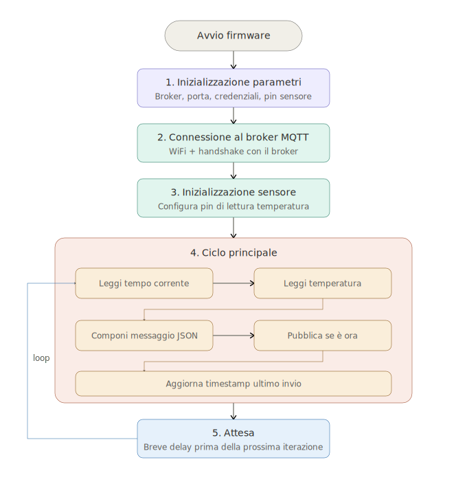
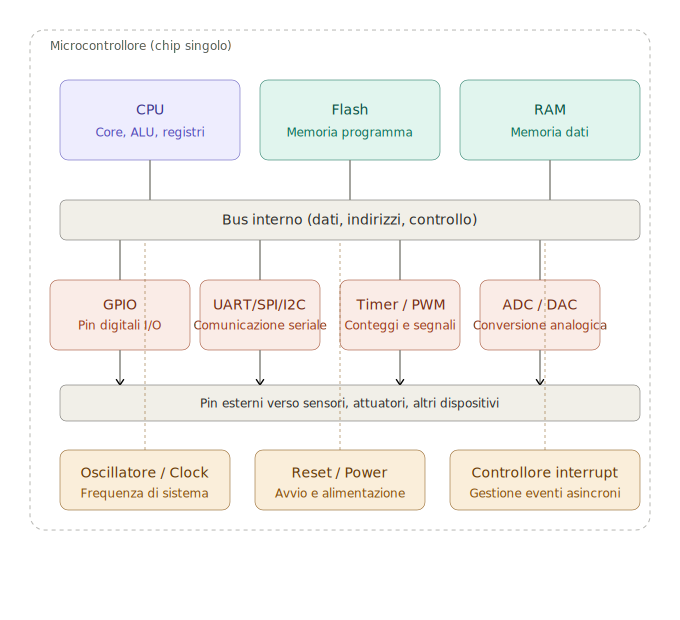
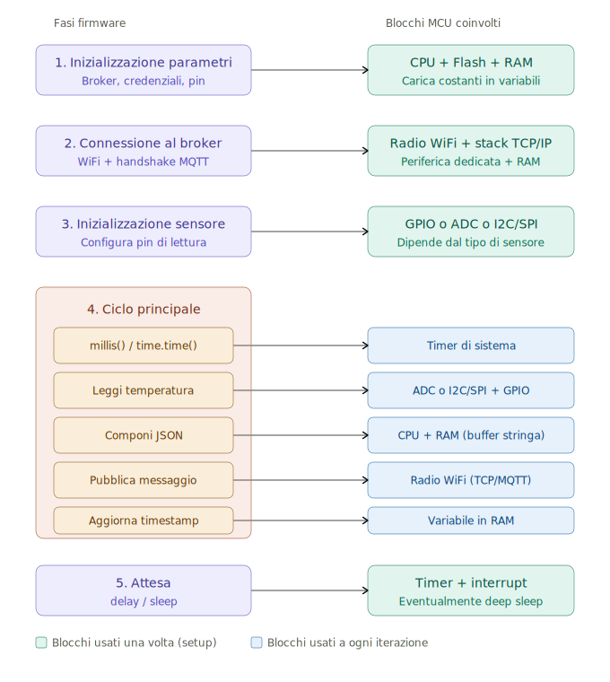
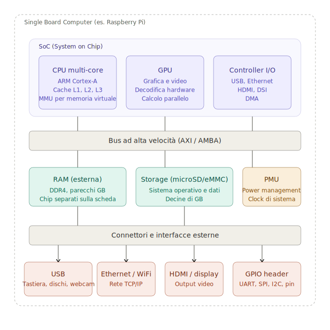
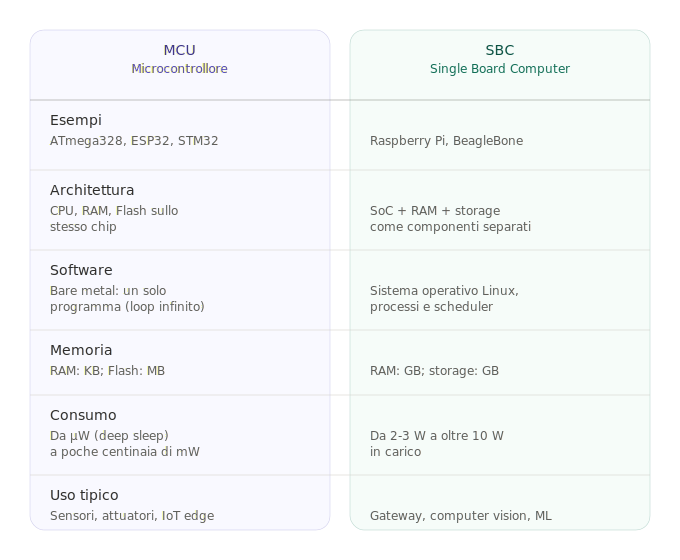

# Dispensa: dal firmware di un sensore MQTT all'architettura di una MCU

## Indice

1. [Premessa: MCU vs SBC](#premessa-mcu-vs-sbc)
2. [Fasi principali del firmware di un sensore MQTT](#fasi-principali-del-firmware-di-un-sensore-mqtt)
3. [Schema a blocchi di una MCU](#schema-a-blocchi-di-una-mcu)
4. [Mapping fasi firmware → blocchi MCU](#mapping-fasi-firmware--blocchi-mcu)
5. [Schema a blocchi di un SBC](#schema-a-blocchi-di-un-sbc)
6. [Confronto MCU vs SBC](#confronto-mcu-vs-sbc)
7. [Considerazioni progettuali](#considerazioni-progettuali)
8. [Riferimenti](#riferimenti)

---

## Premessa: MCU vs SBC

Prima di analizzare il firmware è importante chiarire una distinzione che spesso genera confusione.

Un **microcontrollore (MCU)** è un chip singolo che integra al suo interno CPU, memorie (Flash e RAM) e periferiche di I/O. Esempi tipici sono ATmega328 (Arduino UNO), ESP32, STM32. Si programma "bare metal", cioè senza un sistema operativo sottostante: il programma utente gira direttamente sull'hardware tramite un `loop()` infinito.

Un **Single Board Computer (SBC)** è invece una scheda che integra un microprocessore completo, memoria RAM esterna, storage esterno (tipicamente microSD) e periferiche. Esempi: Raspberry Pi, BeagleBone. Su un SBC gira un sistema operativo completo (Linux), e i programmi sono processi gestiti dallo scheduler del kernel.

Il documento di riferimento `sensorfw.md` mostra due implementazioni dello stesso firmware: una in Python (più adatta a un SBC) e una in C++ con `WiFi.h` e `PubSubClient` (schiettamente per MCU come ESP32). In questa dispensa ci concentriamo sulla seconda perché evidenzia meglio il rapporto diretto tra software e hardware.

---

## Fasi principali del firmware di un sensore MQTT

Il firmware di un nodo sensore che pubblica dati su un broker MQTT si articola in cinque fasi, schematizzate qui sotto.



### 1. Inizializzazione dei parametri di connessione

Si configurano i parametri necessari al funzionamento: indirizzo e porta del broker MQTT, username e password, pin del sensore di temperatura, intervallo di lettura. In C++ sono tipicamente costanti `const char*` o `#define`; in Python sono variabili a livello modulo.

```cpp
const char* mqtt_server = "broker_address";
const int mqtt_port = 1883;
const long interval = 60000;  // millisecondi
```

### 2. Connessione al broker MQTT

Si stabilisce prima la connessione di rete (su ESP32 tipicamente WiFi) e poi la connessione MQTT vera e propria, che include l'handshake del protocollo con il broker.

```cpp
WiFi.begin(ssid, password);
// ... attesa connessione WiFi ...
client.setServer(mqtt_server, mqtt_port);
client.connect("ArduinoClient", mqtt_user, mqtt_password);
```

### 3. Inizializzazione del sensore di temperatura

Si configura il pin o l'interfaccia di comunicazione con il sensore. Nel caso più semplice è una `pinMode()`; con sensori digitali come BME280 o DS18B20 servono librerie dedicate che gestiscono il protocollo specifico (I2C, SPI, 1-Wire).

### 4. Ciclo principale

È il cuore del firmware, eseguito ripetutamente nel `loop()`:

- ottenere il tempo corrente con `millis()`
- leggere il valore della temperatura
- comporre un messaggio JSON con sensor_id e valore
- pubblicare il messaggio al broker se è trascorso l'intervallo
- aggiornare il timestamp dell'ultimo invio

```cpp
unsigned long currentTime = millis();
if (currentTime - lastSentTime >= interval) {
    float temperature = read_temperature();
    snprintf(message, sizeof(message),
        "{\"sensor_id\": \"%s\", \"temperature\": %.2f}",
        sensor_id, temperature);
    client.publish(mqtt_topic, message);
    lastSentTime = currentTime;
}
```

Il pattern `currentTime - lastSentTime >= interval` è preferibile a un `delay(interval)` perché lascia la CPU libera di gestire altri compiti (come il `client.loop()` di MQTT che mantiene viva la connessione).

### 5. Attesa prima della prossima iterazione

Un breve `delay()` (tipicamente 1 secondo) o, nelle implementazioni a basso consumo, una modalità sleep più o meno profonda.

---

## Schema a blocchi di una MCU

Una MCU tipica contiene questi blocchi funzionali, tutti integrati nello stesso chip.



### Blocchi di elaborazione e memoria

| Blocco | Funzione |
|--------|----------|
| **CPU** | Core, ALU, registri. Esegue le istruzioni del programma. |
| **Flash** | Memoria non volatile che contiene il programma (firmware). |
| **RAM** | Memoria volatile per dati, stack, heap, variabili globali. |

Su un PC questi tre elementi sono fisicamente separati e collegati da bus esterni. Su una MCU sono tutti dentro lo stesso package, ed è proprio questa integrazione che rende il chip economico e adatto a sistemi embedded.

### Bus interno

Connette CPU, memorie e periferiche. Trasporta tre tipi di informazione: dati, indirizzi di memoria, segnali di controllo.

### Periferiche di I/O

| Blocco | Funzione |
|--------|----------|
| **GPIO** | Pin digitali general purpose: input o output, alti o bassi. |
| **UART / SPI / I2C** | Protocolli seriali per comunicare con sensori, display, altri chip. |
| **Timer / PWM** | Contatori hardware per misurare il tempo o generare segnali a duty cycle variabile. |
| **ADC / DAC** | Convertitori analogico-digitale e digitale-analogico per leggere o generare tensioni. |

Su MCU moderne come ESP32 si aggiungono blocchi radio integrati (WiFi, Bluetooth) che sono a tutti gli effetti periferiche dedicate.

### Blocchi di supporto

| Blocco | Funzione |
|--------|----------|
| **Oscillatore / Clock** | Genera il segnale di clock che scandisce tutte le operazioni. |
| **Reset / Power** | Gestisce l'avvio del chip e l'alimentazione. |
| **Controllore interrupt** | Permette alle periferiche di interrompere la CPU quando si verifica un evento, evitando il polling continuo. |

---

## Mapping fasi firmware → blocchi MCU

Ciascuna fase del firmware coinvolge blocchi hardware specifici. Comprendere questa corrispondenza è ciò che distingue chi sa "far funzionare" un firmware da chi sa progettarlo.



### Fase 1 — Inizializzazione parametri

**Blocchi coinvolti:** CPU, Flash, RAM.

Le costanti scritte nel codice sorgente finiscono in Flash al momento della programmazione. All'avvio, la CPU le copia (o vi accede direttamente, a seconda dell'architettura) e le rende disponibili come variabili in RAM.

### Fase 2 — Connessione al broker

**Blocchi coinvolti:** periferica radio WiFi, stack TCP/IP, RAM.

Su ESP32 il blocco radio è una periferica dedicata che gestisce in autonomia gran parte del protocollo. Lo stack TCP/IP gira sulla CPU principale (o su un secondo core, se presente) e usa RAM per buffer di rete. È la fase più "pesante" in termini di consumo energetico.

### Fase 3 — Inizializzazione del sensore

**Blocchi coinvolti:** GPIO, ADC, o I2C/SPI (dipende dal sensore).

Questa varia molto in funzione dell'hardware reale:

- **NTC, fotoresistore:** ADC, perché il sensore restituisce una tensione analogica
- **DS18B20:** GPIO con protocollo 1-Wire emulato in software
- **BME280, SHT31:** I2C o SPI

Nel codice del documento di riferimento la lettura è simulata con `random()`, quindi non viene effettivamente usato alcun blocco dedicato.

### Fase 4 — Ciclo principale

È la fase con il mapping più ricco:

| Sotto-fase | Blocco MCU |
|------------|-----------|
| `millis()` / `time.time()` | Timer di sistema |
| Lettura temperatura | ADC o I2C/SPI |
| Composizione JSON | CPU + RAM (buffer stringa) |
| Pubblicazione messaggio | Radio WiFi (stack TCP → MQTT) |
| Aggiornamento timestamp | Variabile in RAM |

Questi blocchi vengono attivati ad ogni iterazione, quindi sono i candidati principali per ottimizzazioni di consumo e prestazioni.

### Fase 5 — Attesa

**Blocchi coinvolti:** Timer, controllore interrupt, eventualmente blocco di gestione low-power.

Un semplice `delay()` lascia la CPU in idle ma alimentata. Un **deep sleep** spegne CPU, RAM e la maggior parte delle periferiche, lasciando attivo solo un timer a bassissima frequenza (RTC) che risveglia il chip al momento giusto.

---

## Schema a blocchi di un SBC

Per confronto, ecco l'architettura di un Single Board Computer come il Raspberry Pi.



La differenza principale rispetto alla MCU è la separazione fisica dei componenti.

### Il SoC

Il cuore della scheda è un **SoC (System on Chip)** che integra al suo interno:

| Blocco | Funzione |
|--------|----------|
| **CPU multi-core** | ARM Cortex-A a 1-2 GHz, con cache multi-livello e MMU per gestire la memoria virtuale richiesta dal sistema operativo. |
| **GPU** | Accelerazione grafica, decodifica video hardware, calcolo parallelo. Su alcuni SBC è usata anche per ML. |
| **Controller I/O** | Gestisce in hardware le interfacce USB, Ethernet, HDMI, DMA. |

### Memorie esterne

A differenza della MCU, RAM e storage sono **chip separati** sulla scheda, collegati al SoC tramite bus ad alta velocità:

- **RAM (DDR4):** parecchi GB, indispensabili per far girare un sistema operativo completo
- **Storage (microSD o eMMC):** decine di GB, contiene il filesystem del sistema operativo

### Interfacce esterne

Le periferiche di un SBC sono di natura diversa rispetto a quelle di una MCU. Mentre la MCU ha pin diretti verso sensori e attuatori, l'SBC espone:

- **USB** per periferiche standard del mondo PC (tastiere, dischi, webcam)
- **Ethernet/WiFi** per la rete TCP/IP
- **HDMI** per output video
- **GPIO header** per le interfacce hardware tipiche del mondo embedded (UART, SPI, I2C, pin digitali), che permettono all'SBC di "scendere" al livello della MCU quando serve

È proprio il GPIO header che rende il Raspberry Pi popolare nei progetti maker: dà accesso "stile MCU" pur avendo a disposizione tutta la potenza di un computer.

---

## Confronto MCU vs SBC



Stesso firmware MQTT, comportamento profondamente diverso:

| Aspetto | MCU (ESP32) | SBC (Raspberry Pi) |
|---------|-------------|---------------------|
| **Esecuzione** | `loop()` hardware-driven sul bare metal | Processo Python gestito dallo scheduler Linux |
| **`delay()` / `sleep()`** | Blocca tutto il programma | Rilascia la CPU ad altri processi |
| **MQTT** | Libreria linkata nel firmware | Può essere un servizio `systemd` indipendente |
| **Consumo minimo** | Pochi µA in deep sleep | Diversi watt sempre |
| **Tempo di avvio** | Millisecondi | 20-60 secondi (boot Linux) |
| **Costo unitario** | 2-10 € | 30-80 € |

Per applicazioni IoT "edge" semplici (un sensore che pubblica un valore), la MCU è quasi sempre la scelta giusta. Per applicazioni con elaborazione complessa (computer vision, ML on-device, gateway che aggregano dati da più nodi), un SBC è necessario.

Una configurazione tipica è proprio quella **ibrida**: nodi MCU sparsi nell'ambiente che misurano e pubblicano via MQTT, un SBC centrale che fa da broker, archivia i dati, espone dashboard.

---

## Considerazioni progettuali

### Efficienza energetica

In un nodo a batteria la differenza tra `delay()` e `deep sleep` è drammatica. Su ESP32:

| Stato | Consumo tipico |
|-------|----------------|
| CPU attiva con WiFi | 80–160 mA |
| CPU attiva senza WiFi | 20–30 mA |
| Light sleep | 0.8 mA |
| Deep sleep | 5–10 µA |

Per un sensore che pubblica ogni minuto, il pattern ottimale è: **deep sleep → wake up → misura → connetti WiFi → pubblica → torna in deep sleep**, tutto in 1-2 secondi di attività.

### Costo della radio

La radio WiFi è il blocco più costoso in termini energetici e temporali. La connessione iniziale (fase 2) può richiedere diversi secondi e centinaia di milliampere. Per questo motivo, in scenari batteria-critici si preferiscono protocolli a basso consumo come **Zigbee**, **BLE** o **LoRaWAN** rispetto a WiFi.

### Polling vs interrupt

Il pattern `currentTime - lastSentTime >= interval` è polling: la CPU controlla continuamente se è ora di agire. Un'alternativa più elegante è far scattare un timer hardware che genera un interrupt all'intervallo desiderato — la CPU può così dedicarsi ad altro (o dormire) finché l'interrupt non la sveglia.

### Quando scegliere cosa

- **Scegli una MCU** se: alimentazione a batteria, costo unitario basso, funzioni semplici e ripetitive, tempo di avvio rapido, affidabilità nel tempo (niente OS che si rompe).
- **Scegli un SBC** se: elaborazione complessa, necessità di un OS (per librerie, networking avanzato, container), interfaccia utente grafica, integrazione con servizi cloud non banali.

---

## Riferimenti

- Documento originale: [sensorfw.md su GitHub](https://github.com/sebastianomelita/ArduinoBareMetal/blob/master/sensorfw.md)
- Repo di riferimento: [ArduinoBareMetal](https://github.com/sebastianomelita/ArduinoBareMetal)
- Architetture correlate trattate nel repo: Zigbee, BLE, WiFi infrastruttura, WiFi mesh, LoRaWAN
