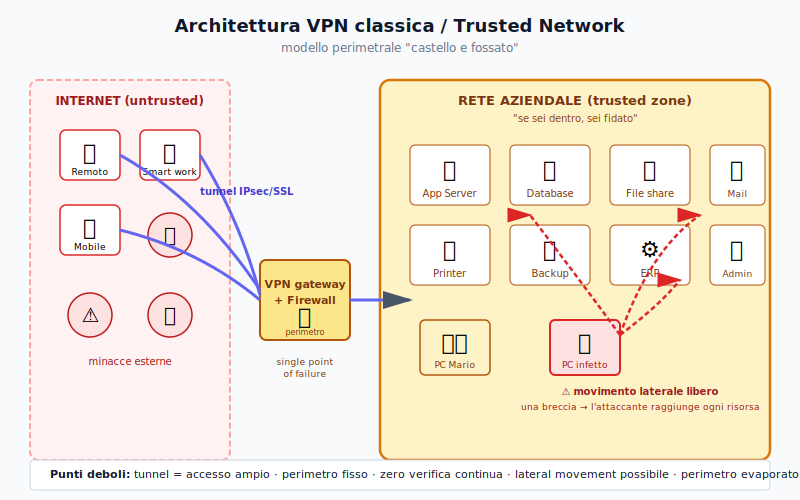
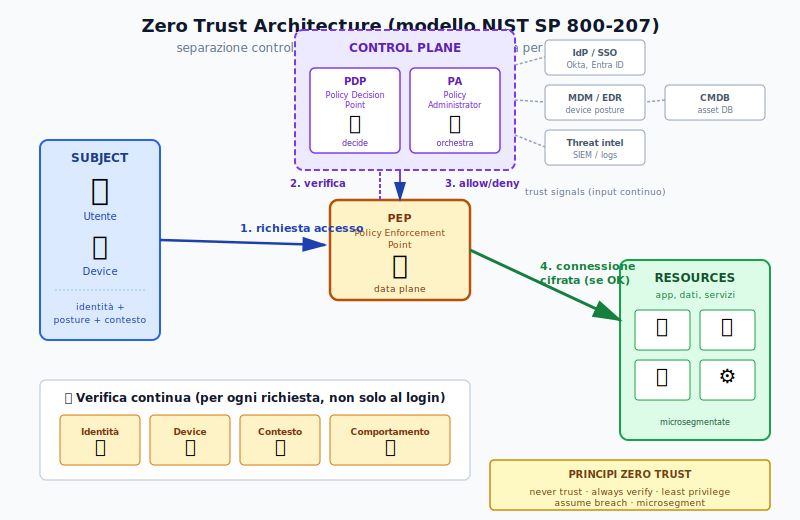
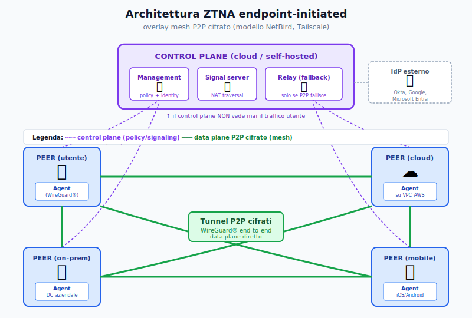
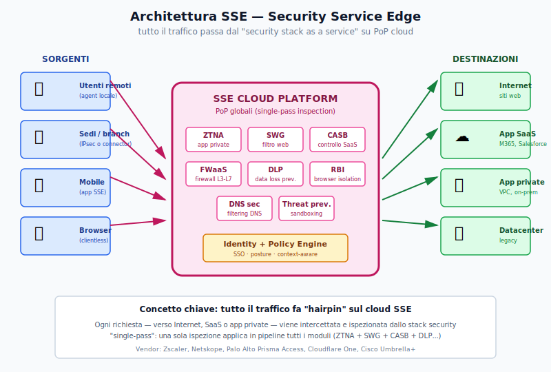
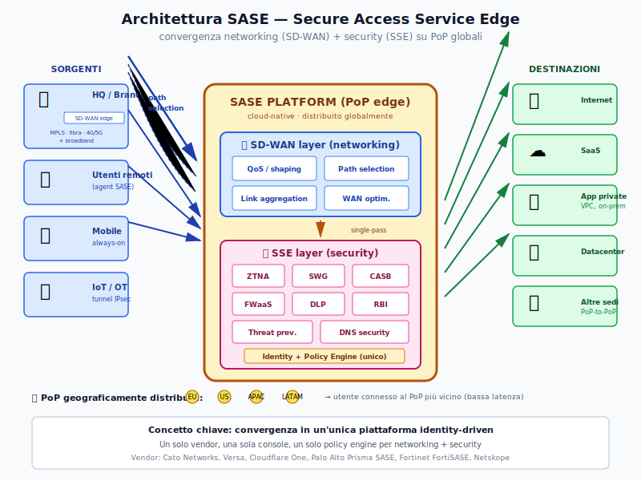
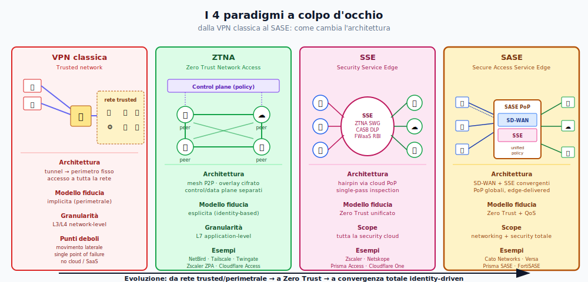

# Dispensa sintetica — Modelli emergenti di rete sicura

> Dal modello "Trusted Network" classico ai paradigmi moderni: Zero Trust, ZTNA, SSE e SASE.
> Una guida sintetica con diagrammi architetturali per orientarsi nel vocabolario della cybersecurity di rete contemporanea.

---

## 1. Il punto di partenza: il modello "Castello e Fossato" (VPN classica)

Per decenni la sicurezza di rete si è basata sul concetto di **perimetro fidato**: dentro la rete aziendale ci si fidava, fuori no. L'accesso remoto avveniva via VPN, che creava un tunnel verso la rete interna concedendo accesso di rete *ampio* a tutto ciò che stava "dentro".



### Caratteristiche dell'architettura

- **Perimetro fisso**: firewall + VPN gateway come "porta unica" tra esterno e interno
- **Tunnel network-level**: una volta autenticato, l'utente ha accesso a un'intera subnet/VLAN
- **Fiducia implicita** basata sulla posizione di rete (sei dentro = sei fidato)
- **Single point of failure**: se la VPN cade, nessuno lavora; se viene bucata, si entra ovunque

### Problemi strutturali

- **Movimento laterale**: un attaccante che compromette un endpoint (phishing, credenziali rubate) può raggiungere ogni risorsa interna
- **Perimetro evaporato**: cloud, SaaS e smart working hanno dissolto il confine aziendale tradizionale
- **Granularità troppo grossolana**: la VPN dà accesso "di rete", non "di applicazione"
- **Scalabilità limitata**: i concentratori VPN diventano colli di bottiglia con migliaia di utenti remoti

---

## 2. Il cambio di paradigma: Zero Trust Architecture

Nel 2010 Forrester (John Kindervag) propone il modello **Zero Trust**, formalizzato poi dal NIST con lo standard **SP 800-207** (2020).

> **Principio guida**: *"Never trust, always verify"* — non fidarti mai, verifica sempre.



### I componenti dell'architettura NIST

| Componente | Ruolo |
|---|---|
| **Subject** | L'entità che richiede accesso (utente + dispositivo + contesto) |
| **PEP** (Policy Enforcement Point) | Il "gate" sul data plane: applica le decisioni, blocca o consente |
| **PDP** (Policy Decision Point) | Il "cervello" sul control plane: decide se autorizzare |
| **PA** (Policy Administrator) | Orchestra le policy, comunica le decisioni al PEP |
| **Trust signals** | IdP/SSO, MDM/EDR, SIEM, CMDB: input continui che alimentano le decisioni |
| **Resources** | App, dati, servizi (microsegmentati, mai esposti direttamente) |

### Principi cardine

- **Separazione control plane / data plane**: chi decide non vede il traffico, chi instrada non decide
- **Verifica continua**: ogni richiesta è valutata ex-novo (non si "entra" una volta sola)
- **Least privilege**: accesso minimo necessario, per il minor tempo necessario
- **Assume breach**: progetta come se l'attaccante fosse già dentro
- **Microsegmentazione**: ogni risorsa è isolata, nessun trust laterale

Zero Trust è un **modello concettuale**, non un prodotto. Le tecnologie che lo implementano si chiamano **ZTNA, SSE, SASE**.

---

## 3. ZTNA — Zero Trust Network Access

**ZTNA** è la categoria di soluzioni che implementa Zero Trust per **l'accesso alle applicazioni**. È il sostituto moderno della VPN.

Esistono due architetture ZTNA:
- **Service-initiated**: connettore parte dalla rete privata verso un broker cloud (Zscaler ZPA, Cloudflare Access, Twingate)
- **Endpoint-initiated**: agent sul device crea tunnel diretti P2P (NetBird, Tailscale)

Mostro l'architettura **endpoint-initiated** perché è quella di NetBird e rappresenta il modello più moderno (no broker, no choke point):



### Caratteristiche architetturali

- **Control plane separato dal data plane**: il management dispensa policy e identità, ma NON vede mai il traffico utente (è end-to-end cifrato tra i peer)
- **Mesh P2P cifrato**: ogni peer (agent) stabilisce tunnel diretti con gli altri peer autorizzati, tipicamente via **WireGuard®**
- **Signal server**: aiuta i peer a "trovarsi" attraverso NAT (STUN-like)
- **Relay**: fallback usato solo se la connessione diretta P2P non è possibile (es. firewall restrittivi)
- **IdP esterno**: l'autenticazione si appoggia a SSO standard (Okta, Entra ID, Google)

### Cosa cambia rispetto alla VPN

| Aspetto | VPN classica | ZTNA |
|---|---|---|
| Topologia | Hub-and-spoke verso gateway centrale | Mesh P2P diretta |
| Accesso | Network-level (intera subnet) | Application-level (singola risorsa) |
| Visibilità delle risorse | Tutte visibili a chi entra | "Dark cloud": vedi solo ciò a cui sei autorizzato |
| Verifica | Una volta al login | Continua + posture check dinamici |
| Failure | Single point of failure (gateway) | Distribuita, no choke point |

---

## 4. SSE — Security Service Edge

Termine coniato da **Gartner nel 2021**. È la **suite di sicurezza cloud-delivered** che protegge l'accesso a Internet, SaaS e app private — passando *tutto* il traffico per uno stack di moduli cloud.

> SSE = **ZTNA + SWG + CASB + FWaaS + DLP** (e altri)



### Il concetto chiave: "hairpin via cloud"

A differenza di ZTNA dove il traffico viaggia direttamente tra peer, in SSE **tutto il traffico aziendale fa un'inversione su un PoP cloud** dove viene ispezionato da uno stack di moduli di sicurezza in pipeline.

Questa architettura è chiamata **single-pass inspection**: una sola ispezione applica tutti i moduli (ZTNA, SWG, CASB, FWaaS, DLP, RBI...) in sequenza, ottimizzando latenza e coerenza delle policy.

### I componenti SSE

| Componente | Cosa fa |
|---|---|
| **ZTNA** | Accesso Zero Trust ad app private (sostituisce VPN) |
| **SWG** (Secure Web Gateway) | Filtra traffico web in uscita, blocca siti malevoli, ispeziona TLS |
| **CASB** (Cloud Access Security Broker) | Visibilità e controllo su SaaS, shadow IT |
| **FWaaS** (Firewall as a Service) | Firewall L3-L7 erogato dal cloud |
| **DLP** (Data Loss Prevention) | Previene esfiltrazione dati sensibili |
| **RBI** (Remote Browser Isolation) | Browser in sandbox cloud, anti-malware web |
| **DNS Security** | Filtraggio a livello DNS, blocco C2 |

### Vendor principali

Zscaler (Zero Trust Exchange), Netskope, Palo Alto (Prisma Access), Cloudflare One, Cisco Umbrella+, Forcepoint, Skyhigh.

---

## 5. SASE — Secure Access Service Edge

Termine coniato da **Gartner nel 2019** (prima di SSE). È il framework più ampio: **converge networking + security** in un'unica piattaforma cloud-native distribuita su PoP globali.

> SASE = **SD-WAN + SSE**



### Cosa aggiunge SASE rispetto a SSE

SSE è solo security: gestisce *cosa* può fare l'utente, ma non *come* il traffico arriva. SASE integra anche il **layer di trasporto** (SD-WAN), che porta tre cose fondamentali:

- **Path selection intelligente** tra link multipli (MPLS, fibra, broadband, 4G/5G)
- **QoS e traffic shaping** per traffico critico (voce, video, applicazioni real-time)
- **Link aggregation e failover automatico** per alta affidabilità

### Caratteristiche dell'architettura SASE

- **Convergenza** networking + security in un'unica piattaforma, una sola console, un solo policy engine
- **Cloud-native**: niente appliance fisiche, tutto erogato da PoP distribuiti globalmente
- **Identity-driven**: le policy seguono l'utente, non l'IP o la location
- **Edge-delivered**: la sicurezza è applicata al PoP più vicino all'utente (bassa latenza)
- **Single-pass**: stessa pipeline di SSE, ma integrata col SD-WAN

### Vendor SASE single-vendor

Cato Networks, Versa Networks, Cloudflare One, Palo Alto Prisma SASE, Fortinet FortiSASE, Netskope (con NewEdge).

---

## 6. Confronto sintetico dei 4 paradigmi

Vediamo i 4 modelli affiancati per capire come è cambiata l'architettura nel tempo:



### Tabella comparativa

| Aspetto | VPN classica | ZTNA | SSE | SASE |
|---|---|---|---|---|
| **Modello fiducia** | Trusted (perimetrale) | Zero Trust | Zero Trust | Zero Trust |
| **Topologia** | Hub-and-spoke | Mesh P2P | Hairpin cloud | Convergenza edge |
| **Scope** | Tunnel di rete | Accesso applicazioni | Sicurezza complessiva | Sicurezza + Networking |
| **Granularità** | Network-level (L3) | App-level (L7) | App-level + traffico web/SaaS | Tutto il traffico aziendale |
| **Include QoS?** | No | No | No | **Sì** |
| **Delivery** | Appliance / agent | Cloud o self-hosted | Cloud-native | Cloud-native distribuito su PoP |
| **Sostituisce** | — | VPN | VPN + proxy + appliance | VPN + MPLS + proxy + FW + tutto |
| **Anno termine** | anni '90 | ~2019 | 2021 | 2019 |
| **Esempio vendor** | Cisco AnyConnect | NetBird, Tailscale | Zscaler, Netskope | Cato, Cloudflare One |

---

## 7. La gerarchia: come si incastrano i modelli

Visivamente, i tre paradigmi moderni sono "scatole cinesi":

```
SASE  =  SD-WAN  +  SSE
                     │
                     └─ SSE  =  ZTNA  +  SWG  +  CASB  +  FWaaS  +  DLP  +  (...)
```

- **ZTNA** è un **componente** (l'accesso alle app private)
- **SSE** è la **suite** di security cloud-delivered che include ZTNA
- **SASE** è il **framework totale** che aggiunge anche il networking (SD-WAN) a SSE

---

## 8. Quale modello scegliere?

### Linee guida pratiche

**PMI / startup / team distribuiti** → **ZTNA** è quasi sempre la scelta giusta. Costa poco, si installa in minuti, sostituisce la VPN.
Esempi: NetBird (open source, self-hostable), Tailscale, Twingate.

**Aziende medio-grandi con molti utenti che vanno su SaaS** → **SSE**. Quando hai bisogno di proteggere non solo l'accesso a risorse private ma anche il traffico web in uscita, l'uso di Office 365/Salesforce/Dropbox, e prevenire esfiltrazione di dati.

**Enterprise con molte sedi globali, traffico critico, esigenza di QoS** → **SASE**. Quando vuoi smantellare l'MPLS, convergere networking e security, e gestire migliaia di utenti distribuiti in tutto il mondo da un'unica console.

**Approccio progressivo (consigliato)** → si parte da ZTNA per le esigenze immediate (sostituire VPN), poi si aggiungono progressivamente componenti SSE (SWG, CASB), e infine si converge in SASE se serve.

---

## 9. Cosa NON è in questi modelli

Per evitare confusioni terminologiche frequenti:

| ❌ Confusione | ✅ Realtà |
|---|---|
| "SASE = SD-WAN versione 2" | No. SD-WAN è solo il componente *networking* di SASE |
| "ZTNA = VPN cloud" | No. La VPN dà accesso di rete, ZTNA accesso per singola app |
| "Zero Trust = un prodotto" | No. È un modello concettuale, non una tecnologia |
| "SSE include SD-WAN" | No. SSE è solo security. SD-WAN + SSE = SASE |
| "MPLS è Zero Trust" | No. MPLS è una rete trusted/perimetrale classica |
| "Trusted Network = Network sicura" | No. "Trusted" si riferisce al *modello* (fiducia implicita), non al livello di sicurezza |

---

## 10. Glossario rapido

- **Zero Trust** — modello di sicurezza basato su "never trust, always verify"
- **ZTNA** (Zero Trust Network Access) — accesso applicativo Zero Trust, sostituisce VPN
- **SSE** (Security Service Edge) — suite security cloud-delivered (ZTNA + SWG + CASB + FWaaS + ...)
- **SASE** (Secure Access Service Edge) — convergenza SD-WAN + SSE su PoP globali
- **SD-WAN** (Software-Defined WAN) — networking software-defined su link Internet multipli
- **SWG** (Secure Web Gateway) — proxy/filtro traffico web in uscita
- **CASB** (Cloud Access Security Broker) — visibilità e policy su SaaS
- **FWaaS** (Firewall as a Service) — firewall erogato dal cloud
- **DLP** (Data Loss Prevention) — prevenzione esfiltrazione dati
- **RBI** (Remote Browser Isolation) — esecuzione browser in sandbox cloud
- **MPLS** (Multiprotocol Label Switching) — servizio di trasporto carrier-grade legacy
- **PEP / PDP / PA** — componenti dell'architettura Zero Trust NIST (Enforcement / Decision / Administrator)
- **NIST SP 800-207** — standard di riferimento per Zero Trust Architecture
- **PoP** (Point of Presence) — datacenter/edge node distribuito geograficamente
- **Posture check** — verifica delle condizioni di sicurezza di un dispositivo
- **Hairpin** — pattern in cui il traffico fa un'inversione su un nodo cloud per essere ispezionato
- **Single-pass inspection** — ispezione del traffico una sola volta in pipeline da tutti i moduli security

---

## Riferimenti

- **NIST SP 800-207** — Zero Trust Architecture (2020)
- **Gartner** — *The Future of Network Security Is in the Cloud* (2019, definizione SASE)
- **Gartner** — *Magic Quadrant for Security Service Edge* (annuale, dal 2022)
- **Executive Order 14028** (USA, 2021) — Improving the Nation's Cybersecurity (mandato Zero Trust per agenzie federali)

---

*Dispensa sintetica · maggio 2026*
