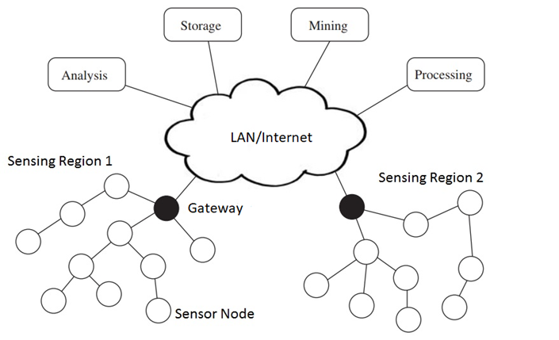
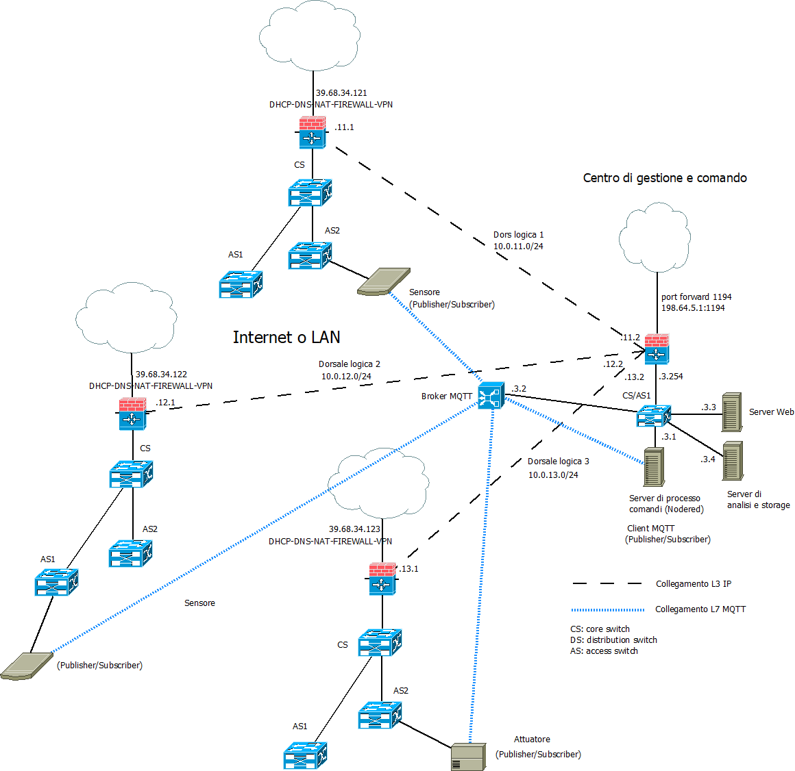

>[Torna a reti ethernet](../archeth.md)

- [Dettaglio architettura Zigbee](../archzigbee.md)
- [Dettaglio architettura BLE](../archble.md)
- [Dettaglio architettura WiFi infrastruttura](../archwifi.md)
- [Dettaglio architettura WiFi mesh](../archmesh.md) 
- [Dettaglio architettura LoraWAN](../lorawanclasses.md) 

## **Architettura di una rete di reti** 

Di seguito è riportata l'architettura generale di una **rete di reti** di sensori. Essa è composta, a **livello fisico**, essenzialmente di una **rete di accesso** ai sensori e da una **rete di distribuzione** che fa da collante di ciascuna rete di sensori.

### **Rete di distribuzione** 

La **rete di distribuzione**, in questo caso, **coincide** con una **rete di reti IP**, in definitiva direttamente con **Internet** se le reti wifi sono **federate** e **remote**, cioè in luoghi sparsi in Internet. 

In questo caso non è necessario avere dei gateway con funzione di traduzione dalla rete di ditribuzione IP a quella dei sensori, dato che questa è anch'essa una rete IP.

### **Schema logico** 

L'albero degli **apparati attivi** di una rete di sensori + rete di distribuzione + server di gestione e controllo potrebbe apparire:

Il **broker MQTT** può essere **pubblico** installato in **cloud**, in una **Virtual Private network**, oppure **On Premise** direttamente nel centro di gestione e controllo. 

Una rete di reti di sensori sparsi nel mondo può essere tenuta insieme tramite Internet utilizzando un broker pubblico MQTT. In alternativa è possibile, nel caso di reti di sensori Ethernet, emulare una stessa LAN che le unisce mediante la tecnologia delle VPN site-to-site. I vantaggi sono:
- la possibilità di poter usare un **broker privato** interno alla LAN
- la possibilità di poter scambiare informazioni su un **canale cifrato** con qualunque tipo di broker MQTT (non per forza basato sui web socket o protetto con TLS).
- la possibilità di poter adoperare **altri servizi** centralizzati oltre la messaggistica MQTT.
