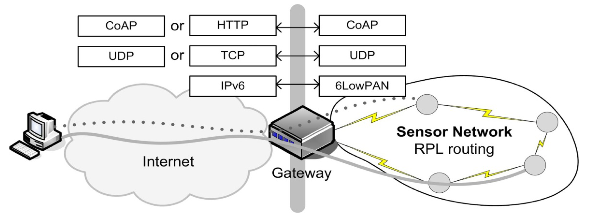
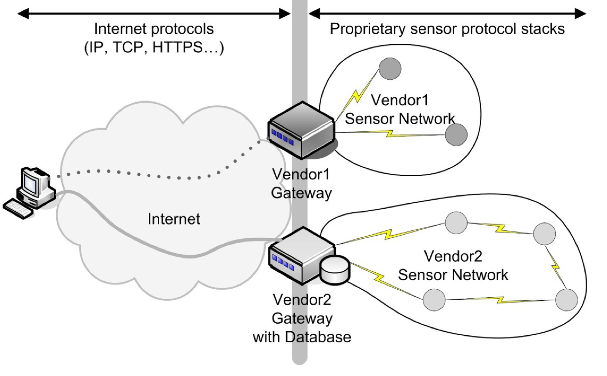

>[Torna a reti ethernet](../archeth.md)

### **Interoperabilità tra reti di sensori**

Riguardo all'**interoperabilità** tra reti diverse, questa è evidentemente impossibile ai livelli **fisico e di accesso**, cioè ai **primi due livelli** della pila OSI (**L1** e **L2**) dato che questi sono normalmente realizzati con tecnologie molto diverse tra loro. Ma potrebbe essere realizzata:
- a **livello di rete**, come già accade nelle LAN e in Internet col protocollo IP. In questo caso, il **comando** proveniente da un sensore (ad esempio di pressione) verrebbe imbustato su un pacchetto di livello 3 (in genere IPv6) che potrebbe essere smistato senza modifica alcuna attraverso i router di una o più reti di sensori, anche se queste sono fisicamente eterogenee, fino ad arrivare all'**attuatore** da comandare. La **proprietà** che viene garantita in questo caso è l'**inoltro** dello **stesso messaggio** su reti di sensori di **tipo fisico diverso**.
- Oppure, potrebbe essere realizzata anche solo a **livello applicativo** definendo per tutte le reti una semantica uniforme per misure e comandi (lo stesso oggetto tapparella con gli stessi comandi per tutte le reti, lo stesso oggetto lampada che si comanda con on e off ovunque, ecc...). La **proprietà** che viene garantita in questo caso è la **compatibilità** dei comandi tra dispositivi IoT della **stessa categoria** (ad esempio l'entità lampadina) e, se standardizzati, persino tra dispositivi che, oltre ad essere dello stesso tipo, sono anche di **marca diversa**.

Alla luce di quanto detto, l'**interoperabilità** tra reti diverse si può ottenere:
- **creando un'unica rete** utilizzando livelli di rete **compatibili** o **praticamente uguali** come sono **IPV6 e 6LowPan**. Lo stesso deve accadere per i **protocolli di routing** usando ad es. REPL. Lo stesso deve accadere per i **livelli superiori**. In particolare nell'ultimo, il **livello applicativo**, il **payload dell'applicazione**, cioè un comando, deve poter viaggiare **direttamente** dal **sensore** all'**attuatore**, dove poi verrà elaborato e utilizzato. Se viene inoltrato direttamente il pacchetto IPV6 (con il payload applicativo dentro) allora il gateway, tra le due reti di livello fisico differente, è tecnicamente un **semplice router**.
    - Se le condizioni di **uniformità** dei protocolli sono **soddisfatte solo parzialmente**, ad esempio mantenendo uguale protocollo di inoltro (6LowPAN) ma **protocolli di routing diversi** (OSPF nella rete di distribuzione e REPL in quella dei sensori), allora il router deve necessariamente possedere anche limitate funzionalità di **gateway**, in questo caso almeno per effettuare l'interoperabilità tra **dominii di routing** differenti.
    - i protocolli di livello fisico e data link (L1 e L2 OSI) sono generalmente diversi mentre quelli di livello di rete e trasporto (L3 e L4 della pila OSI) sono esattamente gli stessi. Per effetto di ciò, ad esempio, un **sensore** su una rete WiFi potrebbe comandare direttamente un **attuatore** posto su una rete Zigbee (o Thread) mediante un gateway posto a cavallo tra le due.
    - la **traduzione del livello applicativo** (L7 pila OSI), quella che adatta il formato dei messaggi (semantica) tra dispositivi dello **stesso tipo** (uguale entità lampadina), potrebbe non essere affatto necessaria se tutti i dispositivi condividono lo **stesso protocollo applicativo** (ad esempio Matter). Meglio ancora se questo sia addirittura **standardizzato** in modo che sia supportato da molti grandi attori di **marche diverse**, garantendo sia una maggiore compatibilità a lungo termine che aggiornamenti regolari dei formati.
    - la **standardizzazione** del livello applicativo possiede anche il vantaggio di poter associare senza sforzo un dispositivo IoT ad un **server applicativo** che ne comanda o gestisce molti altri semplicemente esibendo **nome e versione del protocollo** di presentazione. Sarà poi l'applicazione (ad es. OpenHab, Home Assistant) a cercare nel proprio database il **formato** definito dallo standard per quella particolare categoria (in gergo entità) a cui appartiene il dispositivo da associare.
  

- utilizzando un **gateway applicativo** per **compattare** o **tradurre** i messaggi:
     - se il routing non è compatibile ma il **livello di applicazione** nella rete di accesso **è libero**, non limitato a messaggi preordinati da uno standard, si può pensare ancora di utilizzare lo **stesso payload** in formato JSON della rete di distribuzione (definito dallo sviluppatore) richiamando le **primitive di servizio** di livello applicativo in uso nella rete dei sensori (ad es. send) per inviarlo. Ma il formato potrebbe essere troppo prolisso per dispositivi di capacità ridotta e quindi potrebbe essere necessario **comprimerlo** in un formato più compatto (normalmente binario). E' la situazione tipica dei messaggi in banda ISM a basso duty cycle come quelli di tipo LoraWAN.
     - se il livello di applicazione nella rete di accesso **non è customizzabile**, il gateway (detto talvolta **bridge**) ha adesso la funzione di **traduzione** dei messaggi tra il il formato in uso nella rete di distribuzione IP e quello in uso nella rete di accesso ai sensori.
     - la **traduzione del livello applicativo** (L7 pila OSI):
         - riguarda quelle reti di sensori che non si limitano solo ad inoltrare i messaggi ma che anche definiscono con esatezza il **formato dei comandi** dei propri dispositivi, formato che normalmente **non è modificabile** dallo sviluppatore.
         - serve ad adattare la **semantica applicativa** (formato di misure e comandi) tra reti che non posseggono lo stesso livello di presentazione. Normalmente è svolta sul **gateway di confine** tra la rete di sensori e la rete di distribuzione, dato che comunque il payload, nel passaggio attraverso un gateway, deve comunque essere **sbustato** dallo stack di protocolli della rete di provenienza per essere **reimbustato** in quello della rete di inoltro.
         - l'assenza di **standardizzazione** o l'**incompatibilità** dei livelli applicativi di reti di sensori diverse, costringe lo sviluppatore a definire un proprio **formato dei comandi**, in uso all'interno della **rete di distribuzione**, che garantisca l'**interoperabilità** tra le reti di sensori diverse mediante opportune traduzioni di questi comandi da parte dei vari **bridge di confine**. Un server applicativo che comanda o gestisce molti dispositivi diversi, con lo scopo di **associarne uno nuovo**, potrebbe:
             - **conoscere il bridge** a cui il dispositivo afferisce se questo è un SW conosciuto e diffuso. In questo caso, per **associare** un dispositivo bisogna fornire il **tipo di bridge** (ad es. zigbee2mqtt, ble2mqtt).
             - oppure potrebbe **importare** il **formato custom** dei messaggi MQTT che è stato definito per la rete di distribuzione dallo sviluppatore. In questo caso, per **associare** un dispositivo  bisogna importare sul server (ad esempio, HomeAssistant) la definizione del formato JSON in uso per i messaggi di una certa entità (categoria di dispositivi).

