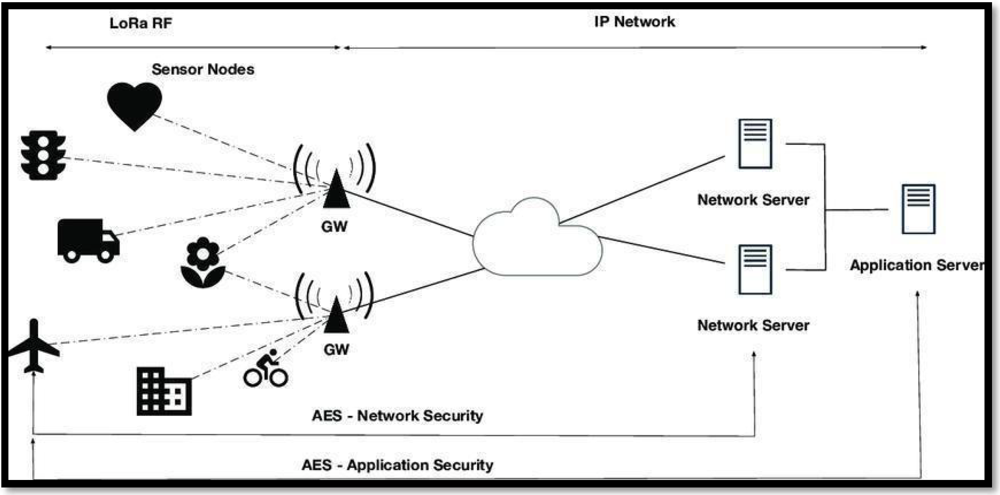
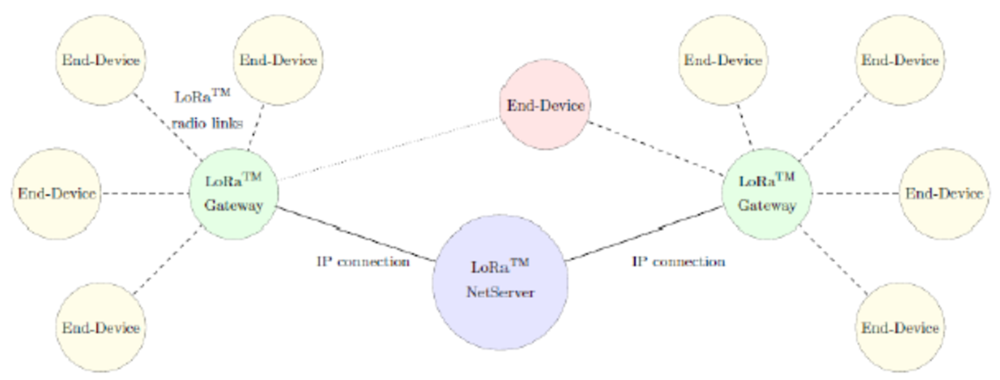
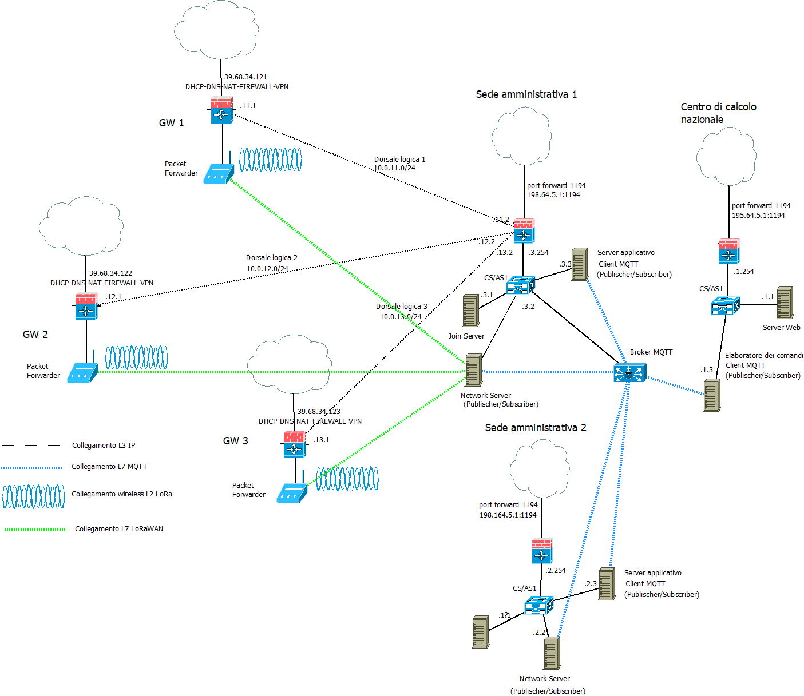

>[Torna a reti ethernet](../archeth.md)

- [Dettaglio architettura Zigbee](../archzigbee.md)
- [Dettaglio architettura BLE](../archble.md)
- [Dettaglio architettura WiFi infrastruttura](../archwifi.md)
- [Dettaglio architettura WiFi mesh](../archmesh.md) 
- [Dettaglio architettura LoraWAN](../lorawanclasses.md) 

## **Architettura di una rete di reti** 

Di seguito è riportata l'architettura generale **fisica** di una rete Lorawan. Essa è composta, a **livello fisico**, essenzialmente di una **rete di accesso** ai sensori e da una **rete di distribuzione** che fa da collante di ciascuna rete di sensori.

La rete di sensori **fisica** è a stella dove il centro stella è il gateway. Un sensore può anche essere associato a più gateway ed inviare dati a tutti i gateway a cui esso è associato. I dati normalmente arrivano ad un certo dispositivo attraverso un solo gateway.

I gateway utilizzano la rete internet (o una LAN) per realizzare un collegamento diretto **virtuale** con il network server, per cui, in definitiva, la topologia risultante è:
- **fisicamente** quella di più **reti di accesso** a stella tenute insieme da una **rete di distribuzione** qualsiasi purchè sia di tipo TCP/IP (LAN o Internet).
- **logicamente** quella di una stella di reti a stella. Il **centrostella** di livello gerarchico più alto è il **network server** ed aggrega solo gateways, gli altri centrostella sono realizzati dai **gateway** che aggregano solamente **dispositivi IoT**.

Avere a disposizione una **rete di distribuzione IP** per i comandi e le letture è utile perchè permette di creare interfacce web o applicazioni per smartphone o tablet per:
- eseguire, in un'unica interfaccia (form), comandi verso attuatori posti su reti con tecnologia differente.
- riassumere in un'unica interfaccia (report) letture di sensori provenienti da reti eterogenee per tecnologia e topologia

La **figura** sottostante riassume la rete LoRaWAN dal punto di osservazione di un **collegamento L7** (applicativo) sulla **rete di distribuzione**:

Si noti, che il canale che collega i dispositivi IoT ai gateway non supera mai il **livello 2** della pila ISO/OSI. Questi link hanno **topologia** a **stella** e possono collegare lo stesso sensore/attuatore a molti gateway. I dispositivi utilizzano un meccanismo di **routing** di livello L1 e quindi basato sul **flooding**. E' il  routing **più semplice** possibile, e anche il **più affidabile** ma possiede l'**incoveniente** di generare **pacchetti duplicati** nel loro percorso verso l'**applicazione**. Questo problema è gestito dal **network server**.

## **Documentazione logica (albero degli apparati attivi)**

Esempio di connessione alla rete di distribuzione IP tramite gateway dotati di client VPN:

  

Si noti che l'**architettura generale** è quella di una **federazione** di reti di sensori più o meno **isolate** e **sparpagliate** sul territorio, ognuna delle quali fa capo, con topologia a stella, ad un proprio **gateway**, deputato al **coordinamento** della stella. La federazione è **amministrata** da un unico **network server** che **inoltra** i dati provenienti dai gateway verso l'**applicazione** utilizzando i servizi di trasporto offerti da una WAN. I servizi di **autenticazione** e **cifratura** (normalmente assenti in Internet) possono essere offerti, oltre che dal protocollo LoRaWAN, anche da da una VPN. I gateway posseggono la componente lora-gateway-bridge che si occupa di inserire il messaggio LoRaWAN in un payload di servizio MQTT per il network server

Il **gateway All-In-One** potrebbe essere un dispositivo con **doppia interfaccia**, modem **UMTS** per l'accesso alla rete di distribuzione su **Internet**, **LoRaWAN** verso la **rete di sensori**. Può essere utile per realizzare un **gateway LoRaWAN da campo** da adoperare:
- in **contesti occasionali** (fiere, eventi sportivi, infrastrutture di emergenza, grandi mezzi mobili).
- in contesti simili ma **dispersi** in aree geografiche molto distanti tra loro e coperte solo dalla **rete cellulare** terrestre della telefonia mobile o dai **satelliti in orbita bassa (LEO)**.
