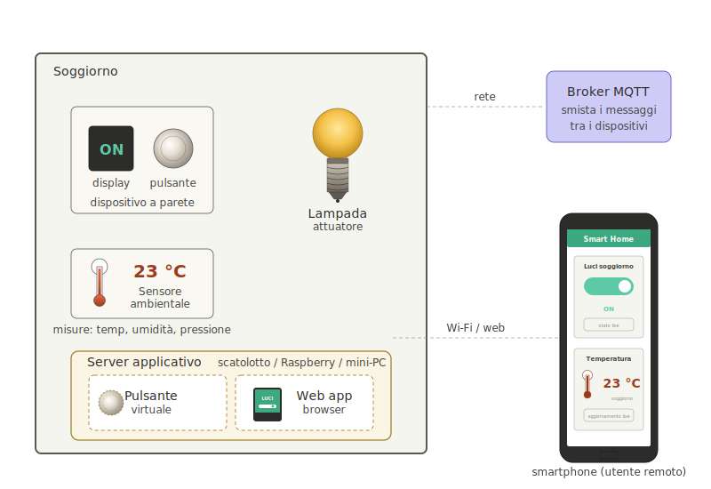
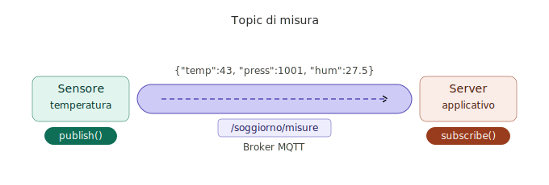
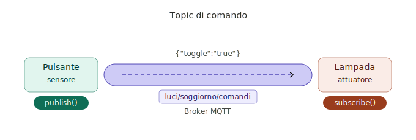
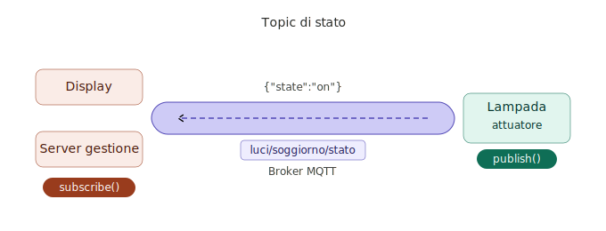
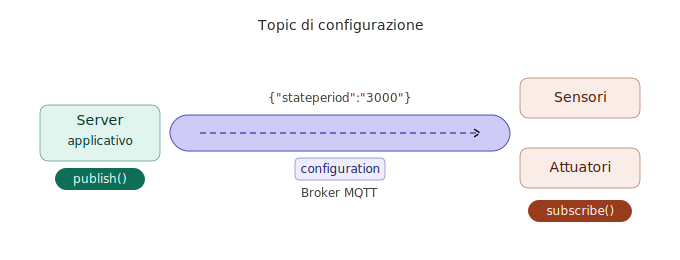

>[Torna a reti di sensori](../sensornetworkshort.md)>[Torna a reti ethernet](../archeth.md)

- [Dettaglio architettura Zigbee](../archzigbee.md)
- [Dettaglio architettura BLE](../archble.md)
- [Dettaglio architettura WiFi infrastruttura](../archwifi.md)
- [Dettaglio architettura WiFi mesh](../archmesh.md) 
- [Dettaglio architettura LoraWAN](../lorawanclasses.md) 


## **Messaggi MQTT**

### **Messaggi confermati**

La **conferma** dei messaggi inviati da parte del ricevente normalmente non è necessaria nel caso dei **sensori**. Infatti, se un invio da parte di un sensore non andasse a buon fine, è inutile richiedere la ritrasmissione di un dato che comunque a breve arriva con una misura più aggiornata. 

La conferma, invece, è prevista per funzioni di **comando** o **configurazione**.  Ad esempio  nel caso di pulsanti, rilevatori di transito o allarmi in cui l'invio del messaggiò avviene sporadicamente e in maniera del tutto **asincrona** (cioè non prevedibile dal ricevitore), potrebbe essere auspicabile avere un feedback da parte del protocollo mediante un meccanismo di conferma basato su **ack**. Ma non sempre ciò è possibile.

La **conferma**, però, potrebbe pure essere gestita soltanto dal **livello applicativo** (non dal protocollo) utilizzando un **topic di feeedback** (o stato) per inviare il valore dello stato corrente subito dopo che questo viene interessato da un comando in ingresso sul dispositivo. 



### **Definizione di topic e payload**

Molto spesso, nella rete di distribuzione IP è presente un server col ruolo di **broker MQTT** che potrebbe servire vari **scenari di comunicazione**. A titolo di esempio:
- su un **topic di misura** (/soggiorno/misure):
    - un dispositivo **sensore**, che è registrato sul broker col ruolo di **publisher**, vuole usare questo topic come canale di **output** per inviare le misure verso il **server applicativo** che le deve elaborare o visualizzare.
    - veceversa, il **server applicativo**, che è registrato come **subscriber**, vuole usare il topic /soggiorno/misure come canale di **input** perchè è interessato a ricevere le misure di **tutti** i sensori presenti nell'ambiente (soggiorno).
- su un **topic di attuazione (comando)**, ad esempio luci/soggiorno/comandi:
    - il dispositivo **sensore** col ruolo di pulsante è registrato sul broker col ruolo di **publisher** perchè vuole usare questo topic come canale di **output** per **inviare il comando** "toggle":"true" verso l'attuatore (la lampada). 
    - il dispositivo **attuatore** col ruolo di lampada è registrato sul broker con il ruolo di **subscriber** perchè vuole usare questo topic come canale di **input** per ricevere eventuali comandi di attuazione (toggle). 
-  su un **topic di feedback (stato)** ad esempio luci/soggiorno/stato, utile al server applicativo per ricevere la conferma dell'avvenuto cambio di stato dell'attuatore, ma anche utile all'utente per conoscere il nuovo stato:
    - il dispositivo **attuatore** (la lampada) è registrato sul broker con il ruolo di **publisher** perchè intende adoperare questo topic come canale di **output** per inviare il **feedback** con il proprio stato ad un **display** associato al sensore di comando.
    - il dispositivo **sensore**, ma meglio dire il dispositivo **display** associato ad esso (un led o uno schermo), è registrato sul broker con il ruolo di **subscriber** perchè vuole usare questo topic come canale di  **input** per ricevere eventuali **feedback** sullo stato dell'attuatore per **mostrarli** all'utente. In questo caso è demandato all'utente, e non al protocollo, **decidere** se e quante volte ripetere il comando, nel caso che lo stato del dispositivo non sia ancora quello voluto.
-  su un **topic di configurazione** (ad esempio configuration) dove può pubblicare solamente il server applicativo mentre tutti gli altri dispositivi IoT sono dei subscriber:
    - sia i dispositivi **sensori** che i dispositivi **attuatori** si registrano sul broker con il ruolo di **subscriber** perchè intendono adoperare questo topic come canale di **input** per ricevere **comandi di configurazione** quali, per esempio, attivazione/disattivazione, frequenza di una misura, durata dello stand by, aggiornamenti del firmware via wirelesss (modo OTA), ecc.
    - il **server applicativo** è registrato sul broker con il ruolo di **publisher** perchè vuole usare questo topic come canale di  **output** per inviare le impostazioni di configurazione ad uno o più dispositivi.

**In realtà**, il topic di configurazione, pur essendo teoricamente appropriato, potrebbe anche essere incorporato nel topic di comando, magari prevedendo un livello più alto di autorizzazione rispetto ai comandi relativi alle funzioni ordinarie.

### **Gestione dei topic di misura**

Potremmo a questo punto inserire la misura della temperatura e della pressione nel topic più generale delle misure che chiameremo ```misure``` e registrare il sensore di temperatura e presenza del soggiorno al topic ```/soggiorno/misure``` come publisher, mentre potremmo registrare il server di gestione al topic ```+/misure``` come subscriber delle misure di tutti gli ambienti. Il messaggio potrebbe essere il JSON  



``` Json
{
	"envSensor": {
		"temp": 43,
		"press": 1001,
		"hum": 27.5,
		"gas": 1400,
	},
	"deviceID": "01",
	"timestamp": "2024-07-20T09:43:27",
}
```
Se volessimo selezionare un solo dispositivo sono possibili due strade alternative:
- inserire il **prefisso mqtt** del dispositivo direttamente **nel path** ```/soggiorno/misure/mydevice1-98F4ABF298AD/{"envSensor": {....}}```
- inserire un **id** del dispositivo **nel JSON** ```/soggiorno/misure/{"deviceid":"01", "envSensor": {....},"deviceID": "01",}```, dove con ```01``` ci indica un indirizzo univoco solamente all'interno del sottogruppo ```/soggiorno/misure```. Con questa soluzione il dispositivo deve saper gestire un secondo livello di indirizzi indipendente dal meccanismo del path dei topic.

### **Gestione dei topic di comando**

Potremmo a questo punto inserire il comando delle luci nel topic più generale delle misure ed attuazioni che chiameremo ```comandi``` e registrare i pulsanti del soggiorno al topic ```luci/soggiorno/comandi``` come pubblisher, mentre potremmo registrare le attuazioni delle lampade allo stesso topic come subscriber. Il comando potrebbe essere il JSON  ```{"toggle":"true"}```, per cui alla fine tutto intero il path diventerebbe ```luci/soggiorno/comandi/{"toggle":"true"}```. 



Se volessimo selezionare un solo dispositivo sono possibili due strade alternative:
- inserire il **prefisso mqtt** del dispositivo direttamente **nel path** ```luci/soggiorno/comandi/mydevice1-98F4ABF298AD/{"toggle":"true"}```
- inserire un **id** del dispositivo **nel JSON** ```luci/soggiorno/comandi/{"deviceid":"01", "toggle":"true"}```, dove con ```01``` ci indica un indirizzo univoco solamente all'interno del sottogruppo ```luci/soggiorno```. Con questa soluzione il dispositivo deve saper gestire un secondo livello di indirizzi indipendente dal meccanismo del path dei topic.

### **Gestione dei topic di stato**

Questo canale viene utilizzato per inviare lo **stato** di un dispositivo a tutti coloro che ne sono interessati. 



L'interesse potrebbe nascere per più motivi:
- **Conferma** dell'avvenuta **attuazione**. Alla **ricezione** di un comando (ad esempio "on":"true"), l'**attuatore** potrebbe  **notificare spontaneamente** (in modalità PUSH), al **display** associato al sensore (e al **server di gestione**), il proprio **stato attuale**, in modo che l'**utente** (o il server di gestione) possa verificare l'effettiva **efficacia** dell'ultimo comando di attuazione.
- **Sincronizzazione PULL** del **server di gestione**. Il server di processo potrebbe **chiedere**, tramite un **comando di richiesta** come "getState" inviato sul topic comandi, che il dispositivo terminale invii lo **stato** degli attuatori sul topic di stato al fine di aggiornare un pannello generale di comando o per eseguire delle statistiche o per recuperare gli input di un algoritmo che deve eseguire.
- **Sincronizzazione PULL** di un **pannello di controllo** web. Un **quadro di controllo web** potrebbe **inviare** sul topic di comando la **richiesta** "getAllStates"  per  ottenere lo **stato** degli attuatori:
    -  una **sola volta**, all'inizio, quando la pagina è stata **caricata/ricaricata** dall'utente
    -  **periodicamente**, grazie ad un timer SW, per essere certi di avere sempre lo **stato più aggiornato**, anche a fronte di una eventuale **disconnessione** di rete che abbia impedito la registrazione dell'ultimo feedback da parte dell'attuatore.
- **Sincronizzazione PUSH**. Lo stesso attuatore potrebbe prendere l'iniziativa di **spedire periodicamente** sul topic di stato il proprio stato a tutti coloro che ne sono interessati (server di gestione o tutti i display web che lo comandano), senza che venga effettuata alcuna richiesta sul topic di comando, . E' un'**alternativa PUSH** alla sincronizzazione PULL periodica.

Un esempio di **canale MQTT di stato** potrebbe essere: 
- nel caso di **identificazione univoca** del dispositivo via  **path MQTT**: ```luci/soggiorno/stato/mydevice1-98F4ABF298AD/{"state":"on"}```
- nel caso di **identificazione univoca** del dispositivo nel **payload JSON**: ```luci/soggiorno/stato/{"deviceid":"01", "state":"on"}```

### **Gestione dei topic di configurazione**

Questo canale viene utilizzato per inviare **comandi di configurazione** al dispositivo da parte del server di processo. 



L'interesse potrebbe nascere per più motivi:
- effettuare un aggiornamento del FW di bordo via wireless.
- impostare qualche caratteristica nella definizione delle sue funzioni come, ad esempio, comportarsi come un apricancello o come comando per luci.
- impostare la frequenza di una misura, o l'intervallo di scatto di un allarme, ecc.
- cambiare la sintassi dei JSON di payload o quella di un path MQTT

Un esempio di **canale MQTT di configurazione** per, ad esempio, impostare il periodo di pubblicazione automatica dello stato potrebbe essere: 
- nel caso di **identificazione univoca** del dispositivo via  **path MQTT**: ```luci/soggiorno/config/mydevice1-98F4ABF298AD/{"stateperiod":"3000"}```
- nel caso di **identificazione univoca** del dispositivo nel **payload JSON**: ```luci/soggiorno/config/{"deviceid":"01", "stateperiod":"3000"}```
