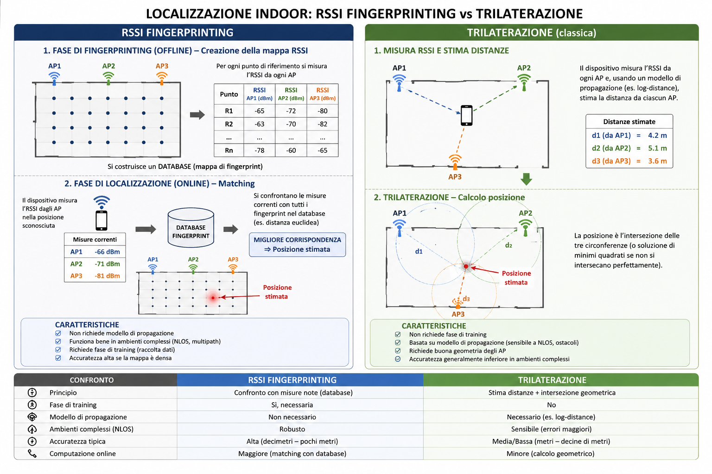
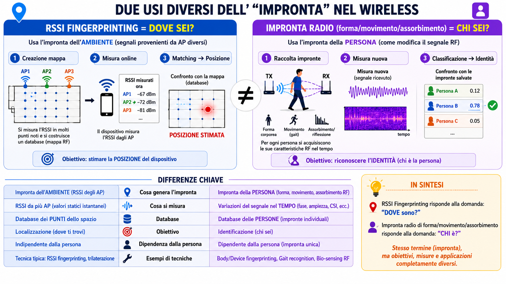
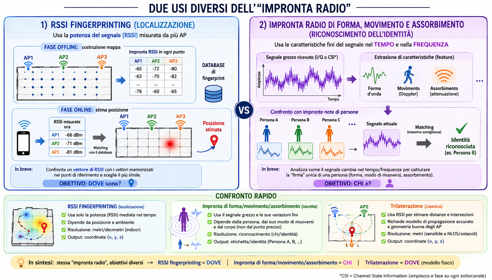

> [Torna alla dispensa principale RFID](../archrfid.md)>
> [Torna a reti di sensori](https://github.com/sebastianomelita/ArduinoBareMetal/blob/master/sensornetworkshort.md)

# Localizzazione Indoor: Trilaterazione e RSSI Fingerprinting

## Trilaterazione

La trilaterazione classica stima la posizione di un dispositivo misurando l'RSSI da almeno tre Access Point e convertendo questi valori in distanze tramite un modello di propagazione (tipicamente log-distance). La posizione viene poi calcolata come intersezione geometrica delle tre circonferenze corrispondenti — o tramite minimi quadrati quando non si intersecano perfettamente. Il metodo è computazionalmente leggero e non richiede alcuna fase di training, ma dipende fortemente dalla qualità del modello di propagazione e dalla geometria degli AP: in ambienti indoor, dove riflessioni, ostacoli e fenomeni NLOS (Non-Line-of-Sight) distorcono continuamente il segnale, la conversione RSSI→distanza diventa inaffidabile, portando a errori nell'ordine delle decine di metri.

## RSSI Fingerprinting

Il fingerprinting aggira il problema della modellazione fisica: in una fase offline si costruisce un database misurando l'RSSI da tutti gli AP visibili in ogni punto noto dello spazio; online, il vettore di RSSI misurato istantaneamente viene confrontato con quelli memorizzati (es. distanza euclidea) e si restituisce il punto più simile come posizione stimata. Non serve alcun modello di propagazione: l'ambiente complesso viene "assorbito" empiricamente nella mappa.

## Quando il Fingerprinting vince sulla Trilaterazione

Il fingerprinting si dimostra superiore proprio nei casi in cui la trilaterazione fallisce:

- **Ambienti NLOS e multipath densi** (corridoi, magazzini, edifici storici con muri spessi): le riflessioni rendono inutilizzabile la relazione RSSI→distanza, mentre il fingerprint impara implicitamente la firma RF di ogni angolo.
- **Geometria degli AP sfavorevole**: se tre AP sono quasi collineari, la trilaterazione produce un'intersezione mal condizionata con enorme incertezza ortogonale alla retta che li congiunge (*poor GDOP*). Il fingerprinting non risente di questo perché non esegue alcuna intersezione geometrica: cerca semplicemente il punto del database con la firma più vicina.
- **Ambienti con molti AP visibili ma irregolari**: più AP significano un vettore RSSI più ricco e discriminante per il matching, mentre per la trilaterazione AP aggiuntivi con propagazione distorta introducono solo rumore.

Il limite del fingerprinting resta il costo della raccolta dati e la sensibilità ai cambiamenti ambientali (mobili spostati, persone che si muovono), che richiedono aggiornamenti periodici della mappa.
