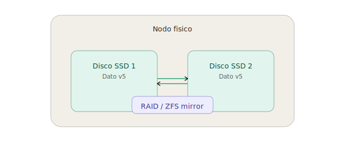
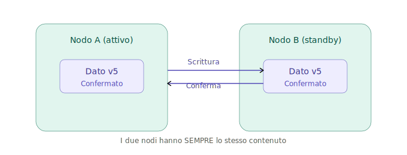
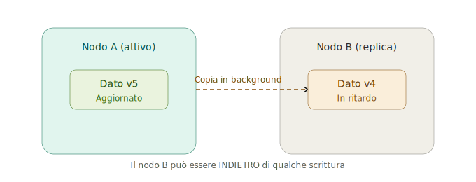

# Approfondimento: tipi di replica del disco

[← Torna alla dispensa principale](../dispensa_replica_storage_HA.md#1-tipi-di-replica-del-disco)

---

## 1. Replica locale (stesso nodo)

I dati vengono duplicati tra dischi fisici della stessa macchina. Il sistema operativo e le applicazioni non si accorgono di nulla — la replica avviene sotto di loro, a livello di blocchi.



### Come funziona

Il controller RAID (hardware) o il software (mdadm, ZFS) scrive ogni blocco su due o più dischi contemporaneamente. Se un disco si guasta, l'altro continua a servire i dati senza interruzione. Il disco guasto può essere sostituito "a caldo" (hot swap) e il RAID si ricostruisce automaticamente.

### Tecnologie

| Tecnologia | Tipo | Vantaggi | Limiti |
|-----------|------|----------|--------|
| **RAID hardware** | Controller dedicato con batteria | Prestazioni, indipendente dal SO | Costo, vendor lock-in, controller è SPOF |
| **mdadm** | RAID software Linux | Gratuito, flessibile | Consuma CPU, meno prestazioni |
| **ZFS mirror** | Filesystem con RAID integrato | Snapshot, compressione, auto-healing | Richiede RAM (1GB per TB), non nativo Windows |
| **ZFS RAIDZ** | RAID5/6 equivalente in ZFS | Più spazio utile del mirror | Resilver lento su dischi grandi |

### Livelli RAID comuni

| Livello | Dischi minimi | Spazio utile | Tolleranza | Uso tipico |
|---------|-------------|-------------|------------|------------|
| RAID 1 (mirror) | 2 | 50% | 1 disco | SO, database |
| RAID 5 | 3 | (N-1)/N | 1 disco | File server, NAS |
| RAID 6 | 4 | (N-2)/N | 2 dischi | Storage enterprise |
| RAID 10 | 4 | 50% | 1 per coppia | Database ad alte prestazioni |
| ZFS mirror | 2 | 50% | 1 disco | Proxmox, VM |
| RAIDZ1 | 3 | (N-1)/N | 1 disco | NAS, file server |
| RAIDZ2 | 4 | (N-2)/N | 2 dischi | Storage critico |

### Cosa protegge e cosa no

- **Protegge da:** guasto di un disco fisico
- **Non protegge da:** guasto del nodo intero (scheda madre, alimentatore, incendio), errore umano (`rm -rf`), ransomware

---

## 2. Replica sincrona di rete (tra nodi)

Ogni scrittura viene confermata solo quando **tutti** i nodi coinvolti hanno scritto il dato. La conferma al client arriva solo dopo che il dato è replicato. Nessun dato viene perso in caso di guasto di un nodo (RPO = 0).



### Come funziona

1. Il client invia una scrittura al nodo primario
2. Il nodo primario scrive il dato sul suo disco locale
3. Il nodo primario inoltra il dato al nodo secondario via rete
4. Il nodo secondario scrive il dato sul suo disco
5. Il nodo secondario conferma al primario
6. Solo ora il primario conferma al client

Il costo è la **latenza aggiuntiva**: ogni scrittura deve attendere il round-trip di rete. Su rete locale (< 1ms) è trascurabile. Tra datacenter distanti (10-50ms) può diventare un collo di bottiglia.

### Tecnologie

| Tecnologia | Nodi | Caso d'uso tipico |
|-----------|------|-------------------|
| **DRBD sincrono** | 2 | Failover active-passive tra 2 server dedicati |
| **Ceph RBD** | 3+ | Cluster virtualizzato Proxmox con HA |

### DRBD in dettaglio

DRBD (Distributed Replicated Block Device) replica un block device tra due nodi a livello kernel. È sostanzialmente un RAID 1 via rete.

- Si configura come dispositivo a blocchi (`/dev/drbd0`)
- Il filesystem (ext4, XFS) si monta sopra DRBD come fosse un disco normale
- In modalità **active-passive** (Protocol C): solo un nodo scrive, l'altro è standby
- Il failover è gestito da Pacemaker/Corosync: se il nodo attivo cade, il standby promuove il suo DRBD a primario e monta il filesystem

### Ceph RBD in dettaglio

Ceph RBD replica i blocchi su più OSD distribuiti nel cluster usando l'algoritmo CRUSH. A differenza di DRBD (che replica tra 2 nodi specifici), Ceph distribuisce le repliche su tutto il cluster secondo regole configurabili (nodi diversi, rack diversi, datacenter diversi).

Vedi [Approfondimento Ceph](ceph.md) per i dettagli su RADOS, CRUSH map e processo di scrittura.

---

## 3. Replica asincrona di rete (tra nodi)

La scrittura viene confermata subito sul nodo primario. La copia remota avviene dopo, in background. Se il nodo primario cade prima che la copia sia completata, le ultime scritture sono perse (RPO > 0).



### Come funziona

1. Il client invia una scrittura al nodo primario
2. Il nodo primario scrive e **conferma subito** al client
3. In background, il dato viene copiato al nodo secondario
4. Il nodo secondario può essere indietro di secondi, minuti, o ore

Il vantaggio è che la latenza non impatta le prestazioni. Lo svantaggio è che in caso di guasto del primario, i dati non ancora replicati sono persi.

### Tecnologie

| Tecnologia | Come si usa | RPO tipico |
|-----------|------------|------------|
| **ZFS send/receive** (sanoid/syncoid) | Script periodico che invia snapshot incrementali | Minuti-ore (dipende dalla frequenza) |
| **DRBD asincrono** (Protocol A) | DRBD configurato senza attesa di conferma | Secondi |
| **rsync** | Copia periodica file-level | Minuti-ore |
| **Proxmox Backup Server** | Backup incrementale schedulato | Minuti-ore |

### ZFS send/receive in dettaglio

ZFS può inviare uno snapshot (o la differenza tra due snapshot) a un altro pool ZFS via rete. Questo è il meccanismo più usato per la replica asincrona in ambienti Proxmox senza Ceph.

```bash
# Snapshot iniziale completo
zfs send rpool/data/vm-100-disk-0@base | ssh nodo-b zfs receive backup/vm-100

# Snapshot incrementale (solo le differenze)
zfs send -i @base @oggi rpool/data/vm-100-disk-0 | ssh nodo-b zfs receive backup/vm-100
```

Strumenti come **sanoid** e **syncoid** automatizzano questo processo con scheduling, retention policy, e gestione degli errori.

---

## Tassonomia riassuntiva

```
               Replica del disco
               ┌──────┴──────┐
           Locale          Di rete
          (1 nodo)       (più nodi)
        ┌────┴────┐     ┌────┴────┐
      RAID     ZFS    Sincrona  Asincrona
    hardware  mirror  (DRBD,    (ZFS send,
    (mdadm)  (RAIDZ)   Ceph)     rsync)
```

---

## Quando serve la replica del disco e quale tipo

### Due scenari di guasto

- **Guasto di un disco fisico (protezione locale).** Il disco si rompe, i dati devono sopravvivere su un altro disco nella stessa macchina. Tecnologie: RAID, ZFS mirror/RAIDZ. Esempi: disco di un DB su nodo singolo, disco di un file server, disco di sistema di un hypervisor.

- **Guasto di un nodo intero (protezione di rete).** Il nodo cade per un problema che non riguarda il singolo disco (alimentatore, scheda madre, incendio). I dati devono essere già presenti su un altro nodo fisico. Tecnologie: Ceph RBD, DRBD. Esempi: disco di una VM in cluster HA Proxmox, volume Kubernetes, replica DR su sito remoto.

### Sincrona vs asincrona

La differenza si riduce a una sola domanda: **posso permettermi di perdere le ultime scritture?**

La replica **sincrona** serve quando i dati sono **transazionali** — ogni scrittura ha valore e non è ricostruibile. La replica **asincrona** basta quando i dati sono **riacquisibili o tollerabili da perdere**.

| Dato | Tipo | Perché |
|------|------|--------|
| Transazioni bancarie | **Sincrona** | Ogni operazione è denaro reale, non ricostruibile |
| Disco VM in cluster HA | **Sincrona** | La VM deve ripartire con dati identici su un altro nodo |
| DB e-commerce (ordini, pagamenti) | **Sincrona** | Un ordine perso è un cliente perso |
| Backup offsite giornaliero | **Asincrona** | Si accetta di perdere fino a 24 ore di dati |
| Replica DR su sito remoto (100+ km) | **Asincrona** | La latenza inter-sito rende la sincrona troppo lenta |
| Log applicativi | **Asincrona** | Perdere qualche riga di log è tollerabile |
| Media e upload utenti | **Asincrona** | File riacquisibili dall'utente, non critici |

**La regola:** se il dato è una transazione (non ricostruibile, non ripetibile) → sincrona. Se il dato è riacquisibile o il costo della sua perdita è accettabile → asincrona.

[← Torna alla dispensa principale](../dispensa_replica_storage_HA.md#1-tipi-di-replica-del-disco)
