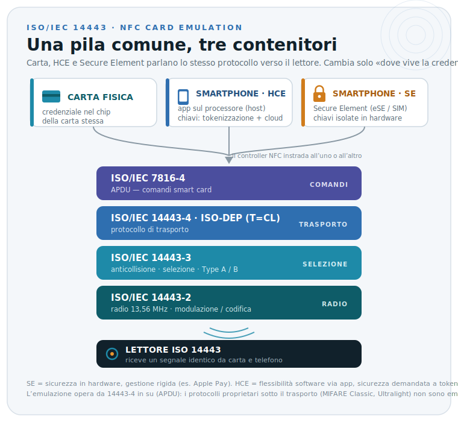

> [Torna a reti di sensori](https://github.com/sebastianomelita/ArduinoBareMetal/blob/master/sensornetworkshort.md) > [Torna alla dispensa principale RFID](../archrfid.md)


# **Standard RFID**

L'RFID è coperto da una galassia di standard. I più rilevanti per la **seconda prova** sono:

| Standard | Banda | Applicazione | Portata |
|---|---|---|---|
| **ISO 11784/11785** | LF (134.2 kHz) | Identificazione animali (FDX-B) | < 30 cm |
| **ISO 14443 A/B** | HF (13.56 MHz) | Carte contactless di prossimità (NFC card emulation, MIFARE, EMV contactless) | < 10 cm |
| **ISO 15693** | HF (13.56 MHz) | Vicinity card (libri, controllo accessi a media distanza) | fino 1 m |
| **ISO 18092 (NFCIP-1)** | HF (13.56 MHz) | NFC peer-to-peer / card emulation | < 10 cm |
| **ISO 18000-63 / EPC Gen2 v2** | UHF (860-960 MHz) | Logistica, retail, antitaccheggio | 1-12 m |
| **ISO 18000-3** | HF | RFID HF "vendor neutral" | < 1 m |
| **ISO 24730** | varie | RTLS (Real Time Location Systems) | > 30 m |

La **scelta dello standard** vincola tutto il resto del progetto: tag, reader, middleware, ecologia di fornitori. È uno degli **aspetti critici** da motivare in fase di progetto.

## **ISO 14443: cosa definisce davvero (e cosa no)**

Punto chiave da non sbagliare alla prova: **ISO 14443 definisce solo i livelli "bassi"** di una carta contactless di prossimità. È diviso in quattro parti:

1. **14443-1** — caratteristiche fisiche della carta.
2. **14443-2** — interfaccia radio a 13,56 MHz: modulazione, codifica, intensità di campo. È qui che lo standard si divide in **Type A** (= base di MIFARE) e **Type B**.
3. **14443-3** — inizializzazione e **anticollisione** (come il reader seleziona una carta quando ce n'è più di una nel campo).
4. **14443-4** — **protocollo di trasporto T=CL** (detto anche ISO-DEP), su cui viaggiano i comandi di livello applicativo.

Tutto ciò che gira *sopra* questi livelli (la logica della carta, la crittografia, i comandi) **non** fa parte di ISO 14443: è MIFARE, EMV o altro. Pensa a ISO 14443 come al "telaio e motore" comune, mentre MIFARE ed EMV sono carrozzerie e logiche applicative diverse costruite sopra.

## **MIFARE e DESFire: il ruolo rispetto a ISO 14443**

**MIFARE non è uno standard**, ma una **famiglia di prodotti proprietari NXP** che lavora su ISO 14443 **Type A**. La differenza tra i vari MIFARE sta in *quanta parte* dello standard usano e in *quale crittografia* mettono sopra.

| Prodotto | Livelli ISO 14443 usati | Crittografia | Modello memoria | Tipico impiego |
|---|---|---|---|---|
| **MIFARE Classic** | Solo parte 3 + **protocollo proprietario** | **Crypto1** (proprietaria, *violata*) | Settori/blocchi (flat) | Trasporti, accessi a basso costo |
| **MIFARE Ultralight** | Solo parte 3 | Nessuna o 3DES (Ultralight C) | Pochi byte | Biglietti usa-e-getta |
| **MIFARE Plus** | Parte 3 o 4 secondo il *Security Level* | Crypto1 → **AES-128** (in SL3) | Come Classic (migrazione facile) | Upgrade del Classic |
| **MIFARE DESFire** | **Parte 4 completa (T=CL)** + comandi tipo ISO 7816-4 | DES / 3DES / **AES-128** | **File system** (applicazioni + file) | Trasporti e accessi sicuri |

**MIFARE Classic** usa solo ISO 14443-3 e poi un protocollo proprietario con il cifrario **Crypto1**, che è stato pubblicamente violato (vulnerabilità note, attacchi side-channel e brute-force, persino "backdoor keys"): resta diffuso solo per il costo e la base installata, ma è inadatto ad applicazioni che richiedono sicurezza reale.

**MIFARE DESFire** è il termine di paragone "alto": è conforme a ISO 14443 parti 1-4 e a ISO/IEC 7816, usa crittografia standard (3DES e **AES-128** a partire dall'EV1), ha una **memoria a file system** (più applicazioni e file sulla stessa carta) e mutua autenticazione. Le generazioni sono **EV1 → EV2 → EV3** (più le varianti EV3C e DESFire Light); l'attuale **EV3** è certificato Common Criteria **EAL5+** e include protezioni come il *Proximity Check* contro gli attacchi relay. È la stessa logica di trasporto + APDU usata da **EMV contactless**: per questo DESFire è architetturalmente molto più vicino a una smart card "vera".

> **Nota sui *Security Level* di MIFARE Plus** (classico tranello d'esame): MIFARE Plus è la carta "ponte" tra Classic e DESFire. In **SL1/SL2** resta compatibile con i comandi Classic su ISO 14443-3 (anche con Crypto1), mentre passando a **SL3** comunica in modo standard ISO 14443-4 (T=CL) usando **solo AES**, abilitando funzioni come Random-ID, Virtual Card e Proximity Check. Vantaggio: stessa mappa di memoria del Classic, quindi migrazione applicativa semplice.

In sintesi: **stesso "telaio" radio (ISO 14443-A), prodotti diversi sopra**. Il Classic si ferma al livello 3 con cripto proprietaria debole; il DESFire sale fino al livello 4 con cripto standard (AES) e architettura a file.

## **Carta su smartphone: cosa può essere emulato come credenziale**

Lo standard che permette di usare **la stessa credenziale sia su una carta sia su uno smartphone** è **NFC** (ISO/IEC 18092, integrato dalle specifiche NFC Forum), nella sua **modalità di emulazione carta** (*Card Emulation*).

Il principio: il telefono **si finge una carta ISO 14443**. Il lettore (tornello, varco, POS) è un normale lettore ISO 14443 e non sa — né gli interessa — se dall'altra parte ci sia una tessera di plastica o un telefono. A livello radio sono **indistinguibili**, ed è per questo che **lo stesso lettore accetta entrambi**: il telefono ricostruisce la stessa pila di protocolli di una carta fisica.




L'emulazione "generica" (**HCE — Host Card Emulation**, introdotta da Android 4.4) copre **solo** ciò che vive sopra il trasporto: carte basate su **ISO-DEP (ISO 14443-4)** che scambiano **APDU ISO 7816-4**. In alternativa l'emulazione può avvenire tramite **Secure Element** (eSE o SIM/UICC), approccio usato per esempio da Apple Pay. Tutto ciò che usa **protocolli proprietari sotto il trasporto** non è emulabile in HCE generico.

### **HCE vs Secure Element: dove vive la credenziale**

Il telefono può emulare una carta in due modi, e la differenza di fondo è **dove risiedono chiavi e logica della carta**, cioè *chi* risponde al lettore. Nel grafico è il blocco più in alto: i livelli ISO 14443-2/3/4 e 7816-4 sono identici, cambia solo il "contenitore" della credenziale.

Con il **Secure Element (SE)** la credenziale sta in un **chip hardware dedicato e a prova di manomissione** (eSE saldato, SIM/UICC, microSD sicura). Quando il telefono è avvicinato al lettore, il controller NFC **instrada la comunicazione direttamente all'SE**, che esegue le applet e custodisce le chiavi in un ambiente isolato. È il livello di sicurezza più alto e può funzionare anche a telefono spento/scarico, ma è **rigido da gestire**: ogni credenziale va "provisionata" dentro l'SE con procedure controllate (storicamente gestite dagli operatori col modello SIM-SE, fonte di molti attriti). È l'approccio di Apple Pay.

Con l'**HCE (Host Card Emulation)** **non c'è secure element nel percorso**: il controller NFC inoltra le APDU a un'**app normale che gira sul processore principale ("host")** e le risposte tornano al lettore. La credenziale si **distribuisce come una qualunque app via store**, senza negoziare con produttore o operatore — enorme flessibilità. Il prezzo è che **le chiavi non stanno in hardware blindato**: per non tenerle in chiaro si usano **tokenizzazione**, chiavi a uso singolo/limitato, conferma con la cloud ed eventualmente un *Trusted Execution Environment* (TEE). In genere richiede telefono acceso e app raggiungibile.

| Aspetto | **Secure Element (SE)** | **HCE (Host Card Emulation)** |
|---|---|---|
| Dove stanno le chiavi | Chip sicuro isolato (eSE / SIM-UICC) | Processore principale (host), app dell'OS |
| Sicurezza | In **hardware** (massima) | In **software**: tokenizzazione + cloud / TEE |
| Distribuzione credenziale | "Provisioning" controllato nell'SE | Come una **app** dallo store |
| Flessibilità / gestione | Rigida (accordi con OEM/operatore) | Alta, autonoma per lo sviluppatore |
| Funziona a telefono spento | Sì (in molti casi) | No (serve OS/app attivi) |
| Esempio | Apple Pay | Google Wallet, molti trasporti/accessi |

In una riga: **SE = sicurezza in hardware, gestione rigida; HCE = flessibilità software, sicurezza demandata a tokenizzazione e cloud.** Per questo i pagamenti combinano spesso i due mondi (HCE + token + eventuale TEE), mentre Apple resta sul modello SE.

**Quali "carte" un telefono può emulare → e quindi abbinare a un tornello come credenziale:**

| Tecnologia della carta | Emulabile su telefono? | Come | Credenziale per tornello/varco? |
|---|---|---|---|
| **EMV contactless** (pagamento) | ✅ Sì | HCE o Secure Element (Apple/Google Pay) | ✅ Sì, su sistemi *open-loop* |
| **Smart card ISO 7816-4** / applet accessi | ✅ Sì | HCE o SE | ✅ Sì (soluzioni di mobile credential) |
| **MIFARE DESFire** (EV1/EV2/EV3) | ✅ Sì, via soluzione NXP | **MIFARE2GO / MIFARE4Mobile** (SE/cloud) | ✅ Sì — scenario tipico di trasporti e accessi |
| **MIFARE Classic / Ultralight** | ❌ No (protocollo proprietario sotto T=CL) | richiede migrazione a DESFire/AES | ⚠️ Solo dopo migrazione |
| **FeliCa** (Sony, NFC-F) | ◑ Solo su telefoni con SE FeliCa | Secure Element | ✅ dove supportato (es. Giappone) |

**In pratica, per un tornello:** se il sistema usa **EMV** o **DESFire/AES**, la stessa credenziale può stare sia sulla carta fisica sia sullo smartphone (HCE o SE) e il lettore le tratta allo stesso modo. Se invece il sistema è ancora su **MIFARE Classic**, il telefono **non** può fare da credenziale finché non si migra a una tecnologia conforme a ISO 14443-4 con cripto AES.

### **Tokenizzazione**

L'HCE è nato (Android 4.4, 2013) proprio per permettere l'emulazione di una carta contactless **senza** affidarsi a un Secure Element hardware: il controller NFC instrada i comandi APDU verso la CPU principale e l'app di pagamento, invece che verso un chip sicuro dedicato. Questo crea un problema di sicurezza evidente, perché la memoria normale del telefono non è un ambiente fidato e può essere compromessa (root, malware, ecc.). Per questo motivo le credenziali sensibili a lungo termine non vengono conservate sul dispositivo.

La soluzione adottata dai sistemi di pagamento HCE (il modello EMVCo *Cloud-Based Payments*) si basa su due meccanismi:

**Tokenizzazione.** Sul telefono non c'è il vero numero di carta (PAN) ma un token, il DPAN (Device PAN), gestito da un Token Service Provider. Il PAN reale resta lato server.

**Limited Use Keys (LUK).** Invece di una chiave master permanente, il telefono riceve dal cloud chiavi a uso limitato, valide per un numero ristretto di transazioni o per un breve periodo, che vengono rigenerate e riscaricate periodicamente. Anche se qualcuno riuscisse a estrarle, il danno sarebbe circoscritto perché scadono in fretta. La chiave master vera rimane sulla piattaforma HCE dell'emittente.

Quindi, riassumendo cosa sta dove: le chiavi/credenziali principali stanno **nel cloud** (emittente / Token Service Provider); sul telefono ci sono solo il token e chiavi a uso limitato, temporanee.

Un'ulteriore precisazione importante: molte implementazioni moderne **non** lasciano queste LUK nella memoria normale, ma le proteggono comunque con hardware del telefono, tipicamente il **TEE** (Trusted Execution Environment) o l'Android Keystore / StrongBox. Quindi nei dispositivi recenti hai spesso un modello ibrido — HCE per la logica di emulazione, più un appoggio hardware per custodire le chiavi temporanee. Questo è diverso dal modello "puro" con Secure Element fisico (come quello usato storicamente da Apple Pay), dove invece le credenziali stanno in un chip dedicato e isolato.

Se vuoi posso entrare nel dettaglio del flusso APDU o della differenza specifica tra HCE e Secure Element.

## **EPC Gen2: anatomia di una lettura**

Per la seconda prova è utile conoscere il funzionamento di **EPC Gen2**, lo standard UHF più diffuso. Il reader segue un ciclo composto da tre fasi:

1. **Select**: il reader invia un comando per selezionare il sottoinsieme di tag su cui operare (es. solo i tag con un certo prefisso EPC).
2. **Inventory**: il reader esegue una **slotted ALOHA** per identificare uno alla volta tutti i tag selezionati. Manda un comando `Query` con un parametro `Q` che determina il numero di slot temporali (2^Q). Ogni tag estrae un numero casuale tra 0 e 2^Q-1 e risponde solo nel proprio slot. Le collisioni vengono risolte aggiustando dinamicamente Q.
3. **Access**: una volta identificato un tag, il reader può leggerne/scriverne la memoria, autenticarsi con password, eseguire un kill.

L'inventory di EPC Gen2 è straordinariamente veloce: un buon reader può identificare **fino a ~700 tag/secondo**.

## **Standard EPCIS**

**EPCIS** (Electronic Product Code Information Services) è uno standard **GS1** che definisce **come** rappresentare e scambiare gli eventi RFID di business tra aziende. Dalla versione **EPCIS 2.0** (ratificata nel 2022) i tipi di evento "core" sono **cinque**:

- **ObjectEvent**: un singolo oggetto è stato osservato (es. "tag 123 letto al varco di ricezione").
- **AggregationEvent**: un oggetto è stato associato a un contenitore (es. "10 cartoni caricati su questo pallet").
- **TransactionEvent**: un oggetto è stato associato a una transazione di business (es. "questo articolo è parte dell'ordine #4567").
- **TransformationEvent**: un input è stato trasformato in output (es. "10 kg di farina + 5 L di acqua sono diventati 15 kg di pasta").
- **AssociationEvent** *(nuovo in 2.0)*: associazione/dissociazione "lasca" di oggetti con un oggetto genitore o una posizione (es. "un sensore di temperatura agganciato a un pallet").

EPCIS 2.0 ha inoltre introdotto il formato dati **JSON-LD** (oltre all'XML), una **REST API** per cattura e interrogazione, e una nuova dimensione **"How"** per i dati dei sensori IoT (es. catena del freddo). Per la **seconda prova** è sufficiente sapere che l'EPCIS è il "vocabolario standard" con cui le aziende si scambiano informazioni RFID nelle filiere globali.

## **Standard EPC: come si dà significato a un identificativo**

Lo standard **EPC** di GS1 introduce una **semantica strutturata** sopra l'identificativo binario. Un EPC SGTIN-96 (Serialized Global Trade Item Number) è composto da:

| Campo | Bit | Significato |
|---|---|---|
| Header | 8 | Tipo di EPC (es. 0x30 = SGTIN-96) |
| Filter | 3 | Tipo di unità logistica (item, case, pallet) |
| Partition | 3 | Indica come dividere i bit successivi tra Company Prefix e Item Reference |
| Company Prefix | 20-40 | Codice azienda assegnato da GS1 |
| Item Reference | 4-24 | Codice articolo all'interno dell'azienda |
| Serial Number | 38 | Numero seriale del singolo oggetto |

Esempio di rappresentazione URI:

```
urn:epc:id:sgtin:0614141.012345.62852
                  │       │      │
                  │       │      └── numero seriale del singolo capo
                  │       └────────  codice articolo (modello)
                  └────────────────  prefisso azienda GS1
```

Lo stesso codice si scrive in formato **binario tag** (96 bit, ciò che è effettivamente memorizzato sul tag) e in formato **EPC pure identity URI** (forma testuale leggibile usata dalle applicazioni). Il middleware si occupa della **conversione** tra le due rappresentazioni.

## **Protocollo LLRP**

Il **protocollo standard** tra reader e middleware è **LLRP** (Low Level Reader Protocol), uno standard **EPCglobal/GS1** (ratificato da EPCglobal nel 2007, versione 1.1 nel 2010). È un protocollo binario su TCP/IP, composto da quasi un centinaio di comandi standard, che permette al middleware di **configurare** i reader (potenza, antenne attive, modalità di inventory) e ricevere le letture in **formato standard**, indipendentemente dal vendor.

> ⚠️ **Attenzione:** LLRP **non** è "ISO 19762". ISO/IEC 19762 è tutt'altro — il vocabolario armonizzato delle tecniche AIDC. LLRP è uno standard EPCglobal/GS1.

In alternativa, molti reader moderni offrono direttamente:

- una **interfaccia REST** o **WebSocket** per integrazioni semplici.
- un **client MQTT** integrato che pubblica le letture su un broker.

> [Torna alla dispensa principale RFID](../archrfid.md)
