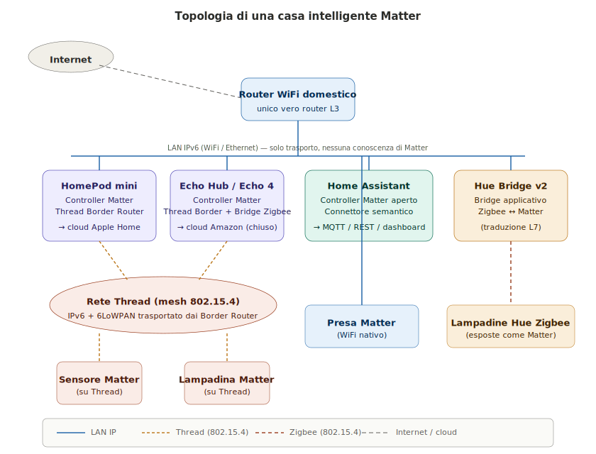
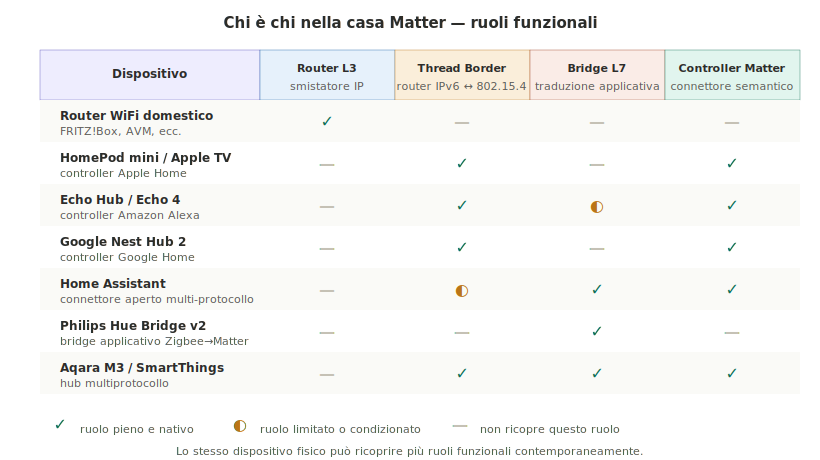

>[Torna a interoperabilità tra reti di sensori](interoperabilità_tra_reti_di_sensori.md)

### **Ruoli funzionali in una casa intelligente gestita con Matter**

Quando si analizza una casa intelligente reale gestita con **Matter**, la difficoltà più comune non è capire i protocolli, ma riconoscere **chi fa cosa** tra i dispositivi presenti. La confusione nasce dal fatto che lo stesso apparato fisico — un Echo, un HomePod, un'installazione di Home Assistant — **ricopre simultaneamente più ruoli funzionali**, ciascuno relativo a un livello diverso dello stack.

In questa sezione si distinguono quattro **ruoli funzionali** distinti e si mostra come vengono distribuiti sui dispositivi tipici di una casa Matter.

### **I quattro ruoli funzionali**

Riprendendo la classificazione introdotta nelle sezioni sull'interoperabilità, i ruoli rilevanti sono:

- **Router L3 (IP)**: apparato di **livello di rete** in senso ISO/OSI puro. Instrada pacchetti IPv6 tra segmenti diversi della LAN domestica e verso Internet, senza alcuna conoscenza del payload applicativo. Non sa nulla di Matter, di Zigbee, di MQTT: vede solo header IP.

- **Thread Border Router**: specializzazione del router L3 che mette in comunicazione la **rete Thread** (basata su 802.15.4) con la **LAN WiFi/Ethernet** domestica. Instrada pacchetti IPv6 attraverso 6LoWPAN ma **non tocca il payload Matter** che trasporta. È tecnicamente un router, non un gateway.

- **Bridge applicativo (L7)**: gateway di confine tra una rete **non-IP** (tipicamente Zigbee o BLE proprietario) e la rete IP. Effettua **traduzione semantica** del livello applicativo: mappa i comandi del protocollo nativo sui cluster Matter standard. È un vero gateway nel senso ISO/OSI completo, perché disimbusta dallo stack della rete di provenienza e reimbusta in quello di destinazione.

- **Controller Matter (connettore semantico)**: **endpoint applicativo legittimo** della fabric Matter. Possiede certificati propri, partecipa al CASE, decifra il TLV in arrivo e può consumarlo direttamente (eseguendo comandi su un attuatore Matter nativo) oppure **ripubblicarlo in altri formati** (JSON via MQTT, REST, dashboard, database time-series). Non è un gateway di rete: è un **client applicativo** alla pari degli altri nodi della fabric.

### **Topologia della casa intelligente Matter**

Lo schema mostra la distribuzione tipica dei ruoli in una casa che mescola dispositivi Matter nativi, dispositivi Zigbee legacy e controller di ecosistemi diversi. Si notino alcuni punti che chiariscono la struttura:

- L'**unico vero router L3** della casa è il **router WiFi domestico**. Tutti gli altri dispositivi sono **host applicativi** sulla LAN, non apparati di rete. Lo si dimentica facilmente perché parlano protocolli sofisticati, ma topologicamente sono semplici client/server sopra IP.

- **HomePod mini ed Echo Hub** sono allo stesso tempo **controller Matter** e **Thread Border Router**. Quando un dispositivo Matter su Thread riceve un comando da HomePod, il pacchetto viaggia come IPv6 dalla CPU del HomePod fino all'antenna 802.15.4 dello stesso HomePod, che lo inoltra come puro routing L3 sulla rete Thread mesh. La traduzione applicativa non esiste in questo percorso: è tutto IPv6 da capo a fondo.

- **Home Assistant** è il caso più interessante: è un **controller Matter aperto**, nel senso che non solo decifra il payload Matter, ma lo **ripubblica** su canali web-friendly (MQTT, REST, WebSocket). È il connettore semantico per eccellenza, l'unico punto della casa dove il payload Matter diventa accessibile al mondo applicativo locale.

- Il **Philips Hue Bridge v2** è invece un **bridge applicativo puro**: parla Zigbee verso le lampadine e Matter verso la LAN, mappando i cluster Zigbee ZCL sui cluster Matter standard. La crittografia end-to-end di Matter termina qui: dal bridge in giù vale la sicurezza Zigbee.

### **La matrice dei ruoli**

La matrice riassume in modo compatto chi ricopre quali ruoli. Tre osservazioni meritano evidenza:

- **Il router WiFi domestico ricopre un solo ruolo**, ma è quello più importante della rete: senza routing L3 niente Matter, niente cloud, niente nulla. Eppure non sa nemmeno che Matter esiste. È il principio **end-to-end** della rete IP applicato in modo perfetto.

- **Home Assistant non è Thread Border Router nativo**: richiede hardware aggiuntivo (un dongle come SkyConnect, oppure delegare il ruolo a un HomePod o Nest Hub presente in casa). Lo segniamo come ruolo "limitato" perché disponibile solo con configurazione esplicita.

- **Echo è bridge Zigbee limitato**: ha radio Zigbee e parla con dispositivi Zigbee, ma li espone solo internamente all'ecosistema Amazon, **non li ripubblica come Matter** verso altri controller. Per questo è segnato come ruolo parziale.

### **Un bridge Zigbee è sempre il coordinator della propria PAN**

Un'osservazione architetturale importante riguardo ai **bridge Zigbee**: la loro capacità di parlare con i dispositivi Zigbee della propria rete non è una "funzione aggiuntiva" che si appoggia su un coordinator esterno, ma deriva dal fatto che il **bridge incorpora — fisicamente o logicamente — il coordinator stesso della PAN** (Personal Area Network) Zigbee.

In una rete Zigbee esiste **uno e un solo coordinator** per PAN. Il coordinator è l'unico nodo che crea la rete, distribuisce le **network key**, gestisce il join/leave dei dispositivi, è sempre acceso (Full Function Device) e mantiene la tabella di routing della mesh. Un bridge che volesse parlare con dispositivi Zigbee senza essere coordinator non potrebbe né far entrare nuovi dispositivi nella rete (servirebbe la network key, distribuita solo dal coordinator) né accedere al traffico della PAN.

Per semplicità progettuale ed efficienza, dunque, il **bridge è il coordinator**. Sono fisicamente la stessa scatola.

Si distinguono due casi pratici:

- **Caso A — Bridge integrato** (Philips Hue Bridge v2, Aqara M3, SmartThings Station): l'hub commerciale è una singola scatola che contiene la radio 802.15.4, il firmware del coordinator Zigbee, la logica di traduzione applicativa ZCL → cluster Matter, e lo stack Matter completo verso la LAN IP. Tutto integrato.

- **Caso B — Distribuito (Zigbee2MQTT)**: in un'installazione tipica di Home Assistant con dongle USB (Sonoff, SkyConnect, ConBee II), la radio e il firmware NCP (Network Co-Processor) vivono nel dongle, mentre la logica di coordinator vera e propria gira nel software Zigbee2MQTT sul Raspberry Pi/PC. Dal punto di vista **logico** il coordinator resta uno solo: dongle + software insieme formano il bridge completo.

La **proprietà** che viene garantita in entrambi i casi è la stessa: il bridge ha **accesso privilegiato** alla PAN Zigbee in quanto coordinator, e su questo accesso costruisce la traduzione applicativa verso Matter, MQTT o altri protocolli di consumo.

**Conseguenze pratiche** di questa architettura:

- Un bridge Zigbee **non parla con dispositivi di altre PAN**: ogni PAN ha il suo coordinator e le PAN sono isolate. In una casa con Hue Bridge + Aqara M3, esistono due reti Zigbee separate che non si parlano tra loro a livello 802.15.4. Comunicano solo **attraverso la LAN IP**, dove entrambi i bridge ri-espongono i loro dispositivi via Matter.
- Un bridge Zigbee può avere difficoltà con dispositivi che usano **cluster proprietari** non standard (caso classico: Aqara su hub di altre marche). La radio li sente perfettamente, ma la traduzione applicativa non sa interpretarne i messaggi.
- Un bridge Zigbee non parla con dispositivi **Thread** o **BLE** o **Z-Wave**: ognuna di queste tecnologie richiede il proprio coordinator/master, e quindi il proprio bridge. Gli hub "multi-radio" (Aqara M3, SmartThings) ospitano semplicemente più coordinator nella stessa scatola.

Riassumendo in una formulazione precisa: **un bridge Zigbee è sempre in grado di parlare con i dispositivi della propria rete Zigbee, perché ne è il coordinator**. La traduzione applicativa verso Matter o MQTT è una funzione aggiuntiva che si appoggia su questo accesso privilegiato. Senza essere coordinator, un bridge Zigbee non avrebbe modo di entrare nella rete.

### **Alexa e Home Assistant: due connettori molto diversi**

Sia Alexa che Home Assistant sono **controller Matter**, ma con una differenza qualitativa fondamentale che vale la pena chiarire.

**Alexa è un connettore chiuso, con elaborazione delegata al cloud Amazon.** Il dispositivo Echo è effettivamente un controller Matter locale: ha certificati propri nella fabric, decifra il payload TLV in arrivo dai sensori, ed è in grado di inviare comandi Matter agli attuatori della LAN. Quello che però **non avviene localmente** è l'**elaborazione semantica** delle informazioni:

- Quando un sensore Matter pubblica una misura (es. "temperatura 22.5°C"), Echo decifra il TLV e **invia l'informazione al cloud Amazon** per essere processata insieme alla voce dell'utente, alle routine configurate e ai modelli di automazione di Alexa.
- Le **decisioni** vengono prese nel cloud Amazon: se un'utenza ha detto "Alexa, accendi le luci quando entro in casa", la logica vive nel cloud, non sull'Echo.
- Il **comando** che ne deriva (es. "accendi la lampadina del soggiorno") viene **rimandato** dal cloud all'Echo, che lo **ritrasforma in un comando Matter** e lo invia all'attuatore locale attraverso la fabric. L'attuatore riceve un normale `Invoke` Matter, senza sapere che la decisione è venuta dal cloud.

Il risultato è che il **payload originale dei sensori non è accessibile localmente**: non c'è un endpoint REST sulla tua LAN che ti permetta di leggere "la temperatura del soggiorno via Alexa", né un broker MQTT su cui Echo ripubblichi spontaneamente le misure. Per costruire una **dashboard custom** o un **server applicativo proprio** che reagisca direttamente alle misure di un sensore, Alexa non è la strada: il payload semantico transita per il cloud Amazon, non per la tua infrastruttura locale.

Va detto, per equilibrio, che il **percorso del comando** rimane comunque locale: la latenza Sensor → Echo → Cloud → Echo → Attuatore è ottimizzata da Amazon con il programma **"Local Voice Control"** e gli **Hub Routines** locali, che cercano di eseguire alcune logiche direttamente sull'Echo senza passare dal cloud. Ma la regola generale resta: **l'intelligenza decisionale di Alexa vive nel cloud**, e il payload Matter dei sensori non è disponibile per applicazioni esterne all'ecosistema Amazon.

**Home Assistant è un connettore aperto.** Decifra lo stesso payload Matter e lo **ri-espone localmente** su:
- **REST API** locale (`/api/states/sensor.soggiorno_temperatura`)
- **WebSocket API** per push real-time alla dashboard
- **MQTT broker** (se attivato l'add-on Mosquitto)
- **InfluxDB / database** per storico e statistiche
- **Webhook** per integrazioni con servizi esterni

Le decisioni di automazione possono essere prese **interamente in locale** (con le sue automazioni YAML o Node-RED), oppure delegate a servizi esterni a scelta dell'utente. L'utente ha pieno controllo del payload semantico.

In altre parole, Home Assistant realizza concretamente lo **Scenario 2** descritto nella sezione sull'interoperabilità: spacchetta il TLV di Matter in JSON e lo rende disponibile come fonte per applicazioni web, server applicativi, dashboard, sistemi di automazione complessi. Alexa, pur essendo tecnicamente un controller Matter equivalente, non offre questa **disponibilità del payload** verso il mondo applicativo locale, perché la sua catena decisionale passa dal cloud Amazon.

### **Multi-Admin: la coesistenza dei controller**

Una proprietà importante introdotta da Matter è il **Multi-Admin**: una stessa lampadina può essere commissionata simultaneamente in più fabric Matter, ognuna con i propri certificati. In una casa reale questo significa che la **stessa lampadina** può essere comandata in parallelo da:

- Apple Home (tramite HomePod)
- Amazon Alexa (tramite Echo)
- Google Home (tramite Nest Hub)
- Home Assistant

Le quattro fabric coesistono pacificamente, senza che nessuna prevalga sulle altre. Questa è una novità rispetto al mondo Zigbee, dove ogni dispositivo apparteneva esclusivamente a una sola PAN e un solo coordinator. Multi-Admin è ciò che rende possibile una casa **non-vincolata** a un singolo ecosistema commerciale.

### **Sintesi: chi è chi**

| Domanda | Risposta |
|---------|----------|
| Chi è il router IP della casa? | Il router WiFi domestico, e solo lui. |
| Chi fa da Thread Border Router? | HomePod, Apple TV, Nest Hub 2, Echo Hub/4, Aqara M3, SmartThings Station. Home Assistant solo con dongle aggiuntivo. |
| Chi fa da bridge applicativo? | Hue Bridge v2 (Zigbee), Aqara M3 (Zigbee/BLE), SmartThings (Zigbee/Z-Wave), Home Assistant via add-on. |
| Chi è connettore semantico aperto? | **Solo Home Assistant** (e in misura minore OpenHAB, Node-RED con plugin Matter). |
| Chi è connettore chiuso verso cloud proprietario? | HomePod (Apple), Echo (Amazon), Nest Hub (Google). |

La regola operativa che emerge è semplice: se nella casa ci sono **solo dispositivi consumer** e l'utente vuole solo controllarli con la voce o con l'app del produttore, qualunque controller commerciale basta. Se invece servono **dashboard custom, server applicativi, automazioni complesse, integrazione con reti LPWAN o protocolli industriali**, allora serve un **connettore aperto come Home Assistant** che faccia da pivot semantico tra Matter e il mondo applicativo libero.

Quest'ultimo è esattamente il modello dello Scenario 2 dell'interoperabilità: Matter come **payload IPv6** che attraversa la rete IP senza traduzione, e un connettore applicativo all'estremità che spacchetta il TLV in JSON per il consumo da parte di applicazioni web.
