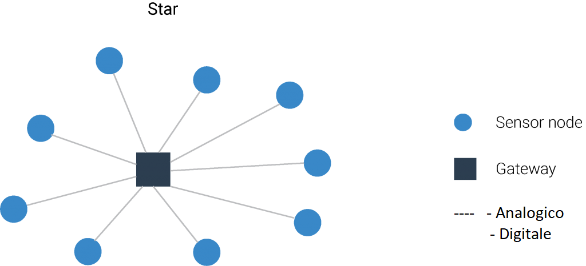
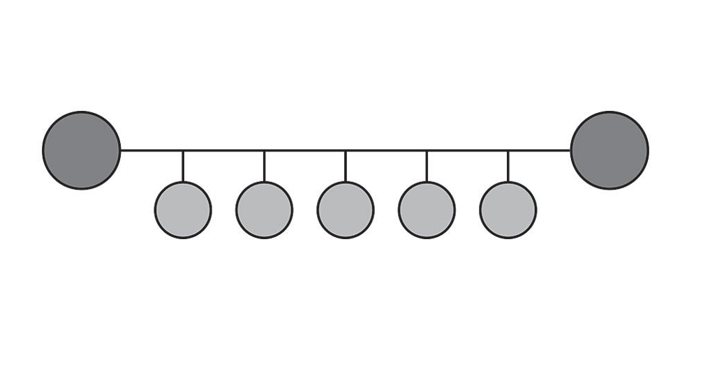
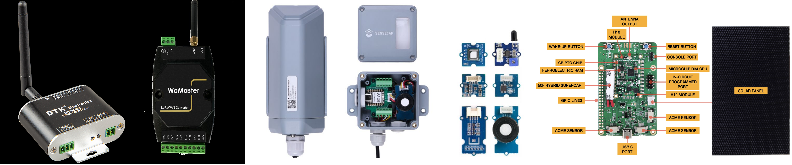

>[Torna a reti ethernet](../archeth.md)

- [Dettaglio architettura Zigbee](../archzigbee.md)
- [Dettaglio architettura BLE](../archble.md)
- [Dettaglio architettura WiFi infrastruttura](../archwifi.md)
- [Dettaglio architettura WiFi mesh](../archmesh.md) 
- [Dettaglio architettura LoraWAN](../lorawanclasses.md) 

## **Sensore**

### Fasi Principali del Firmware di un Sensore che Utilizza MQTT

1. **Inizializzazione dei Parametri di Connessione**
   - Configurare i parametri del broker MQTT (indirizzo, porta, username, password).
   - Configurare il pin del sensore di temperatura e l'intervallo di lettura.

2. **Connessione al Broker MQTT**
   - Stabilire la connessione con il broker MQTT utilizzando i parametri configurati.

3. **Inizializzazione del Sensore di Temperatura**
   - Configurare il pin del sensore per la lettura della temperatura.

4. **Ciclo Principale**
   - Ottenere il tempo corrente.
   - Leggere il valore della temperatura dal sensore.
   - Creare un messaggio con il valore della temperatura.
   - Inviare il messaggio al broker MQTT se è trascorso l'intervallo prefissato.
   - Aggiornare il timestamp dell'ultima lettura inviata.

5. **Attesa Prima della Prossima Iterazione**
   - Attendere un breve periodo (ad esempio, 1 secondo) prima di ripetere il ciclo.

Per il dettaglio sulla realizzazione del firmware vedi [Firmware](../sensorfw.md).

##  **Canali di comunicazione principali in una rete di sensori**

**In sintesi**, sono necessari almeno **due canali** di comunicazione che, insieme, complessivamente, realizzano la **comunicazione tra sensori e gestore** delle informazioni:
- **tra sensori e gateway** verso la LAN realizzato dalle **sottoreti dei sensori**:
    - **A filo** con accesso:,
        - **singolo dedicato**: un filo o un canale per sensore in tecnologia SDM o TDM (multiplexer, UART, porta analogica, porta digitale)
        - **multiplo condiviso** cioè tramite mezzo broadcast (BUS) con **arbitraggio** di tipo **master slave** (Modubus, Dallas, I2C, SPI) o **peer to peer** (CanBUS, KNX, ecc) o misto (ProfiBUS). 
        - Spesso **bidirezionale** specie se in presenza di attuatori
        
    - **Senza filo** cioè wireless con accesso:
        - **singolo dedicato**: link punto-punto analogico digitalizzato con AX25 oppure digitale con un radio modem (Yarm ACME Systems, 6LoWPAN, LoRa) resi full duplex con l'uso di multiplazioni FDM o TDM.
        - **Multiplo e condiviso** (BUS) di tipo half duplex reso bidirezionale (full duplex) tramite tecniche asincrone CSMA/CA (Zigbee, wifi, LoRa) o sincrone TDMA (Zigbee, Bluetooth).
- **Tra gateway e gestore** delle informazioni realizzato dalla **rete di distribuzione**:
     - Tipicamente tramite **LAN ethernet** e architettura **Client/Server**
     - Interazioni di tipo PUSH o PULL
     - Paradigma Request/Response (HTTPS, COAP), Publish/Subscriber (MQTT) oppure canale persistente bidirezionale (BSD socket o WebSocket)

##  **Interfacce dei dispositivi terminali (sensori/attuatori)** 

Nelle **reti industriali** sono molto comuni topologie complesse a molti livelli. Per le applicazioni di **nostro interesse** le **topologie** più adoperate sono:
- **nodo sensore di rete**. Dispositivo che in un unico **contenitore** ingloba **insieme** un certo numero di **sensori**, la **MCU**, la **scheda di rete** verso la **rete di accesso** ai sensori, la **batteria** di alimentazione. E' un nodo unico, con tutto quello che serve per misurare e comunicare nella rete di sensori.
- **nodo MCU con scheda di rete**. In questo caso il nodo è costituito da una MCU con delle interfacce digitali verso i sensori e una interfaccia di rete verso la rete dei sensori. Il dispositivo è quindi un **gateway** tra la **il link di campo**, porte analogiche/digitali o BUS, (vedi [bus di campo](cablatisemplici.md) per dettagli) e la rete di sensori (WiFi, Zigbee, LoraWAN, LAN, BLE, ecc.). Esistono due possibilità:
    -  L'**interfaccia sui sensori** usa un collegamento **digitale/analogico dedicato**, con un solo filo verso **ciascun** sensore, per cui l'**architettura** risultante dei loro collegamenti è a **stella**, avente la MCU come **centro  stella**.
      
    -  L'**interfaccia sui sensori** usa un collegamento **digitale a BUS** verso un **gruppo** di sensori, usando gli stessi fili in **condivisione** per tutti, per cui l'**architettura** risultante dei loro collegamenti è a **BUS**, avente la MCU come **master** del BUS di campo. 
        
        - [Dettagli su stack cablati specifici per domotica e sensoristica](stackcablati.md)
     
          
 Chiaramente, se la rete di sensori **coincide** con la **rete di distribuzione IP** (LAN o WiFi o Internet), allora il dispositivo con la MCU potrebbe anche **concettualmente** essere inteso come un **gateway** tra la rete di sensori a BUS di campo e la rete di distribuzione. Vedi [Cablaggio rete LAN di ufficio](archeth.md) per dettagli.     
 

 Dalla seconda figura, si vede chiaramente come, anche i dispositivi All In One, già equipaggiati con i sensori, adoperano internamente gli stessi collegamenti a BUS che adopererebbero i dispositivi senza sensore che, semplicemente, espongono il connettore del BUS all'esterno (vedi i connettori verdi delle prime due figure o il connettore ACME sensor dell'ultima figura).
 
 Nella **figura sotto**, si vedono **tre esempi** di prodotti commerciali per sensore **All In One** (a sinistra), **HUB di sensori** (al centro), **BUS di sensori** (a destra):
 
 

 Il **numero** dei dispositivi **collegabili** dipende dal **più critico** di molti fattori che potrebbero essere: il **numero di porte/indirizzi** disponibili, la **lunghezza dei collegamenti** ammissibile, la **lunghezza dei messaggi** trasmessi, il **duty cycle** disponibile in trasmissione, la **banda** disponibile in trasmissione.

### **Consumo dei nodi terminali**

Un'altra funzione **potenzialmente energivora**, dopo il **routing**, è il **polling dei sensori** ovvero la loro lettura periodica con annessa **trasmissione in remoto** dei dati. In questo caso se il **primo nodo** di smistamento della catena è parecchio distante (è il caso di tecnologie outdoor come LoraWan o Sigfox) o sebbene indoor si adopera una **trasmissione** in una **tecnologia  energivora** (come è in modalità standard il WiFi) allora sono possibili almeno due **soluzioni operative** per abbattere i consumi:
- **allungare l'intervallo di polling** facendolo passare dall'ordine dei secondi a quello dei minuti o delle ore.
- **memorizzare le misure in locale** sul dispositivo e, ad intervalli regolari adeguatamente lunghi, inviare dei **dati aggregati nel tempo** come **medie e varianze** o statistiche in genere.

Quasi **tutte le tecnologie wireless** poi permettono di mettere, nell'intervallo di tempo tra una misura e l'altra, il dispositivo in modalità di **sleep** o **standby** profondo che **rallenta** di molto il clock della CPU permettendo un grande **risparmio di energia**.

Il **consumo di energia** è generalmente proporzionale alla **velocità di trasmissione** e alla lunghezza dei messaggi. Tecnologie **general purpose** che sono **ottimizzate** per la trasmissione di **file o stream** più che di **brevi messaggi** in genere sono più complesse e esibiscono consumi **più elevati**.
  
[Topologia reti WSN](/wsn_topology.md)
