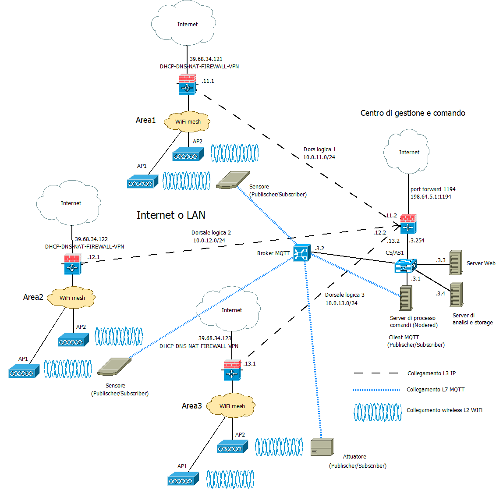

>[Torna a reti ethernet](../archeth.md)

- [Dettaglio architettura Zigbee](../archzigbee.md)
- [Dettaglio architettura BLE](../archble.md)
- [Dettaglio architettura WiFi infrastruttura](../archwifi.md)
- [Dettaglio architettura WiFi mesh](../archmesh.md) 
- [Dettaglio architettura LoraWAN](../lorawanclasses.md) 

## **Architettura di una rete di reti** 

Di seguito è riportata l'architettura generale di una **rete di reti** di sensori. Essa è composta, a **livello fisico**, essenzialmente di una **rete di accesso** ai sensori e da una **rete di distribuzione** che fa da collante di ciascuna rete di sensori.

### **Rete di distribuzione** 

La **rete di distribuzione**, in questo caso, **coincide** con una **rete di reti IP**, in definitiva direttamente con **Internet** se le reti wifi sono **federate** e **remote**, cioè in luoghi sparsi in Internet. 

In questo caso non è necessario avere dei gateway con funzione di traduzione dalla rete di ditribuzione IP a quella dei sensori, dato che questa è anch'essa una rete IP.

## **Rete di reti wifi** 

L'albero degli **apparati attivi** di una rete di sensori + rete di distribuzione + server di gestione e controllo potrebbe apparire:

Il **broker MQTT** può essere installato in cloud, in una Virtual Private network, oppure On Premise direttamente nel centro di gestione e controllo. 

Il **gateway All-In-One** potrebbe essere un dispositivo con **doppia interfaccia**, modem **UMTS** per l'accesso alla rete di distribuzione su **Internet**, **WiFi** verso la **rete di sensori**. Può essere utile per realizzare un **gateway WiFi da campo** da adoperare:
- in **contesti occasionali** (fiere, eventi sportivi, infrastrutture di emergenza, grandi mezzi mobili).
- in contesti simili ma **dispersi** in aree geografiche molto distanti tra loro e coperte solo dalla **rete cellulare** terrestre della telefonia mobile o dai **satelliti in orbita bassa (LEO)**.
