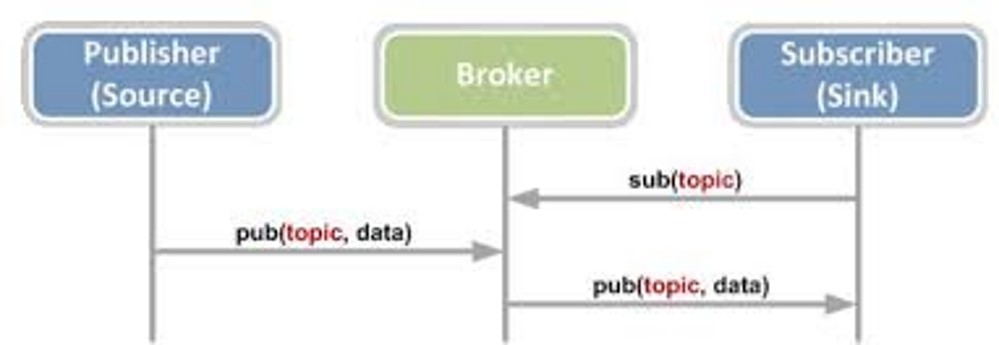
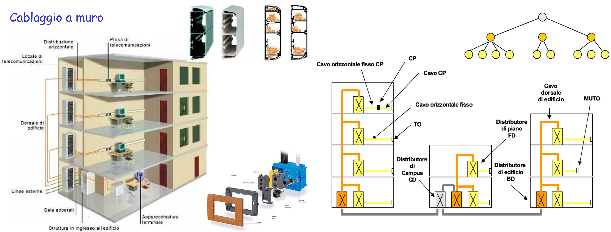
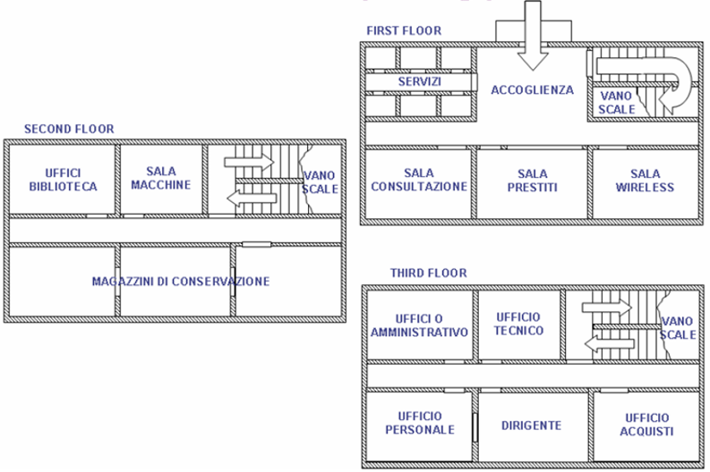
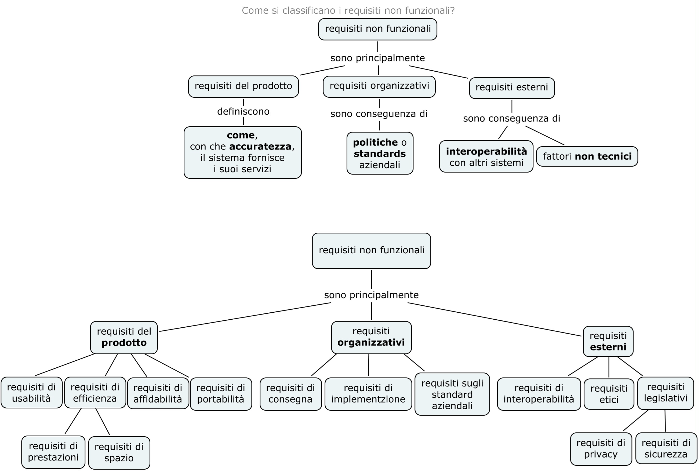

>[Torna a reti di sensori](sensornetworkshort.md#classificazione-delle-tecnologie-wsn-in-base-a-velocità-e-copertura)


Servizi:
- [VPN di reti Ethernet](ethvpn.md).
- [Firewall](firewall.md).
- [Backup](backup.md).
- [Autenticazione 802.1X](radius.md)
- [DNS](https://it.wikipedia.org/wiki/Domain_Name_System)
- [DHCP](https://it.wikipedia.org/wiki/Dynamic_Host_Configuration_Protocol)

## **Caso d'uso LAN Ethernet** 

Date le particolarità della tecnologia, i casi d'uso per la rete di sensori Ethernet sono quelli tipici per applicazioni **IoT indoor** a **medio raggio**, dove concorre con altre tecnologie di rete: Zigbee, BLE e, sotto certe condizioni, LoRaWAN. **Caratteristiche** della rete Ethernet di **tipo ufficio** sono essenzialmente:
- possibilità di realizzare **comandi** a distanza wireless anche relativamente piccoli con una **durata** delle batterie non troppo lunga rispetto ad altre tecnlogie ma con la possibilità di essere alimentati via POE (Power Over Ethernet).
- possibilità di realizzare **sensori** ambientali molto piccoli e alimentati via POE.
- **assenza di gateway** verso la rete LAN, essendo essi stessi collegati a questa.
- **rete di sensori** composta **dai dispositivi** della stessa rete LAN utilizzata per i **dati**. Gli unici dispositivi capaci di inoltro dei dati sono gli stessi della LAN (switch, router, bridge wifi).
- utilizzo di una rete **non ottimizzata** per la sensoristica ma pensata più per le prestazioni in bit rate elevate che per i bassi consumi. Consumi limitati si ottengono attivando funzioni di **deep sleep** di processore e radio tra un turno di misura dei sensori e il successivo.
- rete di sensori che ha la stessa **affidabilità** della rete dati.


### **Aspetti critici**

Elementi **critici** su cui **bilanciare convenienze** e saper fare delle **scelte argomentate** sono:
- schema fisico (**planimetria**) dell'infrastruttura con etichettatura univoca di tutti gli asset tecnologici di rete.
- tipologia di **divisione in gruppi** degli utenti.
- definizione delle **tecnologie dei dispositivi** chiave quali sensori/attuatori ([dispositivi terminali](sensornetworkshort.md#dispositivi-terminali-sensoriattuatori)), gateway, link (dual radio, three radio), accesso radio (allocazione di servizi sincroni TDM, asincroni CSMA/CA o a basso ritardo slotted CSMA/CA) e loro dimensionamento di  massima (quantità, numero di porte, banda, ecc.).
- eventuali vincoli normativi sulle tecnologie in uso come potenza, EIRP, ERP e duty cycle.
- schema logico (albero degli **apparati attivi**) di tutti i dispositivi di rete con il loro ruolo e i **link virtuali** astratti ai vari livelli della **pila ISO/OSI** (tipicamente L2, L3, L7)
- dislocazione di eventuali **gateway**.
- **subnetting** e definizione degli indirizzi dei vari gruppi di utenti, delle server farm, definizione degli indirizzi dei server.
- definizione del **tipo di routing** (statico o dinamico). In caso si scelga il **routing statico**, definizione delle **tabelle di routing** più significative.
- definizione della posizione del broker MQTT.
- definizione dei topic utili per i casi d'uso richiesti.
- definizione dei **messaggi JSON** per alcuni **dispositivi IoT** ritenuti significativi in merito a **comandi**, **stato** o **configurazione**.
- definizione (anche in pseudocodice) delle **funzioni del firmware** di bordo dei **dispositivi IoT**.

Per **maggiori dettagli** vedi [Punti critici cablaggio strutturato](punticablaggio.md).


L'albero degli **apparati attivi** di una rete di sensori + rete di distribuzione + server di gestione e controllo potrebbe apparire:


Il **broker MQTT** può essere **pubblico** installato in **cloud**, in una **Virtual Private network**, oppure **On Premise** direttamente nel centro di gestione e controllo. 

Una rete di reti di sensori sparsi nel mondo può essere tenuta insieme tramite Internet utilizzando un broker pubblico MQTT. In alternativa è possibile, nel caso di reti di sensori Ethernet, emulare una stessa LAN che le unisce mediante la tecnologia delle VPN site-to-site. I vantaggi sono:
- la possibilità di poter usare un **broker privato** interno alla LAN
- la possibilità di poter scambiare informazioni su un **canale cifrato** con qualunque tipo di broker MQTT (non per forza basato sui web socket o protetto con TLS).
- la possibilità di poter adoperare **altri servizi** centralizzati oltre la messaggistica MQTT.

Per il dettaglio sulle VPN pratiche vedi [VPN di reti Ethernet](ethvpn.md).

Per il dettaglio sulle impostazioni di un firewall [Firewall](firewall.md).

Per il dettaglio sulla realizzazione dei backup vedi [Backup](backup.md).

Per il dettaglio sulla realizzazione del firmware vedi [Firmware](sensorfw.md).

Per il dettaglio sulla realizzazione dell'autenticazione 802.1X vedi [Autenticazione 802.1X](radius.md)


##  **Canali di comunicazione principali in una rete di sensori**

**In sintesi**, sono necessari almeno **due canali** di comunicazione che, insieme, complessivamente, realizzano la **comunicazione tra sensori e gestore** delle informazioni:
- **tra sensori e gateway** verso la LAN realizzato dalle **sottoreti dei sensori**:
    - **A filo** con accesso:,
        - **singolo dedicato**: un filo o un canale per sensore in tecnologia SDM o TDM (multiplexer, UART, porta analogica, porta digitale)
        - **multiplo condiviso** cioè tramite mezzo broadcast (BUS) con **arbitraggio** di tipo **master slave** (Modubus, Dallas, I2C, SPI) o **peer to peer** (CanBUS, KNX, ecc) o misto (ProfiBUS). 
        - Spesso **bidirezionale** specie se in presenza di attuatori
        
    - **Senza filo** cioè wireless con accesso:
        - **singolo dedicato**: link punto-punto analogico digitalizzato con AX25 oppure digitale con un radio modem (Yarm ACME Systems, 6LoWPAN, LoRa) resi full duplex con l'uso di multiplazioni FDM o TDM.
        - **Multiplo e condiviso** (BUS) di tipo half duplex reso bidirezionale (full duplex) tramite tecniche asincrone CSMA/CA (Zigbee, wifi, LoRa) o sincrone TDMA (Zigbee, Bluetooth).
- **Tra gateway e gestore** delle informazioni realizzato dalla **rete di distribuzione**:
     - Tipicamente tramite **LAN ethernet** e architettura **Client/Server**
     - Interazioni di tipo PUSH o PULL
     - Paradigma Request/Response (HTTPS, COAP), Publish/Subscriber (MQTT) oppure canale persistente bidirezionale (BSD socket o WebSocket)
       
## **Broker MQTT** 

Il **broker MQTT** è solo una delle tante soluzioni possibili per realizzare un **canale multicast** di livello **applicativo** tramite cui un utente col ruolo di **publisher** è in grado di notificare una **replica** dello stesso messaggio a più **subscribers**. E' utile per:
- inoltro dei comandi da un **sensore di comando** su una rete di tipo A (ad es. LoRaWAN) ad un attuatore su una rete diversa di tipo B (ad es. Zigbee)
- inoltro di una **misura** da un **sensore ambientale** su una rete di tipo A (ad es. LoRaWAN) ad un **pannello di controllo** su una rete diversa di tipo B (tipicamente IP)
- inoltro di una **misura** da un **sensore ambientale** su una rete di tipo A (ad es. LoRaWAN) ad un **server di gestione** su una rete diversa di tipo B (tipicamente IP)

Il **canale applicativo** su cui vengono inviati i messaggi sono quindi i **topic**. Su un certo **topic** il dispositivo con il ruolo di **output** agisce come un **publisher**, mentre quello con il ruolo di **input** agisce come un **subscriber**.

Gli utenti, in ogni caso, si comportano tutti come **client** poiché sono loro che **iniziano la connessione** con il broker e non il viceversa. 



**Fasi** del protocollo:
1. Il **Subscriber** dichiara presso il broker il proprio interesse a ricevere notifiche riguardo ad un certo argomento (topic) effettuando una chiamata **subscribe()**
2. il **publisher** pubblica un messaggio che riguarda un **certo topic** effettuando una chiamata **publish()**
3. Il **broker** inoltra il messaggio a tutti i subscriber interessati a **quel topic**

L'**ID MQTT** è un identificativo che permette di individuare un dispositivo ma non è un indirizzo di livello 3, non individua la macchina host in base al suo IP, piuttosto è un indirizzo di livello applicativo noto solo ad un server centrale, cioè il broker. Un dispositivo IoT non è tenuto a conoscere l'IP di tutti gli altri dispositivi ma solamente quello del broker. Il broker soltanto sa gli indirizzi di tutti i dispositivi, conoscenza che acquisisce durante la fase di **connessione** di un client al broker, momento in cui avviene anche il recupero del'**socket remoto** del client.

Il **broker**, dal canto suo, **associa** ogni **topic** con tutti gli **ID** che sono registrati presso di esso come **subscriber**. Questa associazione è utilizzata per smistare tutti i messaggi che arrivano con un certo topic verso tutti gli ID che ad esso sono associati. Il topic diventa così un **indirizzo di gruppo**. La particolarità di questo indirizzo è che è **gerarchico** secondo una struttura ad **albero**, cioè gruppi di dispositivi possono essere suddivisi in **sottogruppi** più piccoli estendendo il nome del path con un **ulteriore prefisso**, diverso per ciascun sottogruppo. L'operazione può essere ripetuta ulteriormente in maniera **ricorsiva**.

**Ad esempio**, posso individuare le lampade della casa con il path ```luci``` e accenderle e spegnerle tutte insieme, ma posso sezionarle ulteriormente con il path ```luci/soggiorno``` con il quale accendere o spegnere solo quelle del soggiorno oppure con il path ```luci/soggiorno/piantane``` con il quale fare la stessa cosa ma solo con le piantane del soggiorno.

Osservando l'albero degli **apparati attivi**, si vede bene che, in una **rete IP**, il **client MQTT** (con il ruolo di **publisher** o di **subscriber**) è sempre il **dispositivo IoT**. 

In **generale**, su reti **non IP**, i **client MQTT** (con il ruolo di **publisher** o di **subscriber**) sono sempre i **gateway di confine** della **rete di sensori**. Le uniche reti di sensori che non hanno bisogno di un gateway di confine che sia, nel contempo anche client MQTT, sono le reti IP. Esistono ancora i gateway nelle **reti IP** ma con **scopi diversi** da quello di **realizzare** un **client MQTT**. Nelle **reti IP**, il **client MQTT** è, normalmente, direttamente **a bordo** del **dispositivo** sensore dotato di indirizzo IP (**MCU**).

Il **vantaggio** del **broker MQTT** è quello di poter gestire in modo semplice e **standardizzato** lo **smistamento** (inoltro) delle **misure** e dei **comandi** tra i vari portatori di interesse (stakeholder) di un **cluster** di reti di sensori, siano essi utenti umani, interfacce grafiche, server applicativi diversi o altri dispositivi IoT.


## **Rete Ethernet (LAN)** 

Gli **elementi** di base di una rete LAN sono:
- **Modem/Router** connesso all'ISP (Internet Service Provider) per l'accesso a Internet.
- **Router** connesso al modem per distribuire l'accesso a Internet e gestire il traffico di rete.
- **Switch di core** connesso al router per ampliare la capacità della rete, permettendo la connessione di più dispositivi.
- **Access Point** connesso al router o allo switch per fornire connettività wireless. 
- **Dispositivi finali** (computer, stampanti, smartphone) connessi al router/switch/access point tramite cavi Ethernet o connessione Wi-Fi.
- **Firewall** per la protezione della rete da minacce esterne.
- **Server di sistema** per la gestione delle risorse di rete, come DNS, DHCP, file server, e print server.
- un **controller** degli AP. E' un **server** che si occupa della creazione e gestione dei bridge nei vari AP, della impostazione centralizzata di interfacce logiche e parametri radio, della assegnazione centralizzata degli indirizzi IP, dell'assegnazione automatica dei canali in modo da minimizzare le interferenze reciproche tra gli AP, dell'aggiornamento centralizzato dei FW dei vari AP, della gestione dei protocolli di autenticazione, delle funzioni di logging, delle funzioni di firewall, della creazione di hotspot, ecc..

Gli **AP (Access Point)**, sono dei dispositivi di **aggregazione** dei client della rete LAN (PC, dispositivi IoT, smartphone, tablet, ecc.) che, attraverso gli AP, ottengono un accesso alla rete LAN aziendale. In modo infrastruttura, gli AP sono in realtà assimilabili a 2 dispositivi distinti:
- un **HUB wireless** che realizza un **mezzo broadcast** (multipunto) dove i client accedono mediante il protocllo **CSMA/CA** e sue ottimizzazioni per il WiFi (vedi [CSMA/CA](protocollidiaccesso.md#csmaca) per dettagli)
- un **bridge** tra l'hub wireless e una LAN cablata (vedi [Bridge AP](archwifi.md#bridge-group)). Un **bridge** è uno dispositivo di **commutazione** simile ad uno **switch** ma realizzato in **SW**, che **inoltra**, a livello L2, trame MAC dall'HUB alla LAN cablata e viceversa. Questi bridge, per ogni AP, possono essere più di uno e, in questo caso, sono tanti quante le **interfacce logiche** dell'AP e mappano ogni intefaccia su una **VLAN diversa**.

## **Architettura cablaggio**

Il **cablaggio** è articolato, come prevedono gli **standard TIA/EIA 568**B ed **ISO/IEC11801**, in: 
- centro stella di **comprensorio** (primo livello gerarchico), detto armadio CD o campus distributor, da cui si diramano le **dorsali di comprensorio**.
- centro stella di **edificio** (secondo livello gerarchico), detto armadio BD o building distributor, da cui si diramano le **dorsali di edificio**.
- centro stella (armadio) di **piano** (terzo livello gerarchico), detto armadio FD o floor distributor, da cui si diramano le **dorsali di piano**, dette anche **cablaggio orizzontale**.
- Prese, dette **TO** o telecommunication outlet.



Tendenzialmente, per risparmiare filo, vale la regola che gli armadi devono essere tutti in **posizione baricentrica** (non sempre rispettata nel disegno come nei progetti):
- L’**armadio di campus** deve essere al baricentro degli armadi di edificio
- L’**armadio di edificio** deve essere al baricentro degli armadi di piano
- L’**armadio di piano** deve essere al baricentro delle prese TO


## **Documentazione**

Consiste nell'**ordine**:
1. Planimetria senza cablaggio
2. [Planimetria con cablaggio](planimetriacon.md)
3. [Albero degli apparati passivi](dorsaliarmadi.md#albero-degli-apparati-passivi)
4. [Tabella delle dorsali](dorsaliarmadi.md#tabella-delle-dorsali)
5. [Albero degli apparati attivi](albapparatiattivi.md)
6. [Schema degli armadi](dorsaliarmadi.md#schema-degli-armadi)

### **Scopo**

Lo scopo è realizzare un **guida univoca** (priva di ambiguità) per il personale **installatore** per definire:
- **posa dei cavi** affinchè si possa stabilire nel dettaglio **posizione** di **armadi** e **prese TO** e **percorsi delle canalizzazioni** all’interno dell’edificio
- Acquisizione di **qualità** e **quantità** dei materiali coinvolti in **fase di progettazzione** di un impianto

Per il personale che si occupa della **ordinaria manutenzione** della rete è una guida per:
- Determinare l’allocazione dei dispositivi attivi nella struttura dell’impianto in quanto vengono definiti la loro posizione (nell’edificio e dentro gli armadi), la loro architettura di collegamento e i loro indirizzi IP 
- Il **trouble shooting** in caso di guasti, in quanto l'insieme di **subnetting fisico** e di **cablaggio strutturato** permette di  determinare la **posizione fisica** di un dispositivo guasto (nell’edificio e dentro gli armadi) una volta **noto** il suo **indirizzo IP**. 

### **Scelta dei documenti da compilare**

Non tutti i documenti sono necessari per la **definizione** di un **nuovo progetto**:
- **servono tutti** se si progetta il **cablaggio strutturato** di un **edificio** o di un **campus** e se si è direttamente responsabili della acquisizione, gestione e manutenzione delle macchine installate.
- serve essenzialmente solo lo **schema degli apparati attivi** se si progetta una rete in **ambito cloud** dove la maggior parte dei sistemi sono in pratica **virtualizzati** e gestiti **da remoto** secondo il modello cloud [IasS](https://cloud.google.com/learn/what-is-iaas?hl=it)
- servono essenzialmente **planimetria** e **schema degli apparati attivi** in contesti di **reti WiFi Mesh** o di **reti LPWA** o di reti dove però, è sempre importante definire con precisione la **posizione** dei vari **gateway** verso la rete pubblica (Internet) o privata (LAN) di distribuzione.
- servono essenzialmente **planimetria** e **schema degli apparati attivi** in ambito indoor o outdoor **Zigbee** se non è richiesto di definire il resto della rete ma, anche in questo caso, vanno definiti con precisione la **posizione** dei vari **gateway** verso la rete pubblica (Internet) o privata (LAN) di distribuzione.
- servono essenzialmente solo la **planimetria** e un **blando schema** degli **apparati attivi** in ambito indoor o outdoor **BLE con beacon fissi** se non è richiesto di definire il resto della rete ma, anche in questo caso, vanno definiti con precisione la **posizione** dei vari **gateway** verso la rete pubblica (Internet) o privata (LAN) di distribuzione.
- potrebbe servire grossomodo **definire tutto** nel caso di **reti BLE con listener** fissi dato che questi si configurano come veri e propri dispositivi di rete che vanno cablati assieme a tutto il resto. Una eccezione potrebbe essere realizzare l'infrastruttura in WIFi Mesh o modem LTE e allora potrebbero bastare **planimetrie** e **apparati attivi**.

### **Coerenza tra documenti**

Chiaramente i documenti di un cablaggio non sono scorrelati e, per di più, la definizione di alcuni è la base per la definizione dei successivi. L'**ordine** è essenzialmente quello proposto, con maggiore o minore enfasi su una parte piuttosto che su un'altra. Aspetti importanti sono:
- coerenza
- completezza
- assenza di ambiguità

Se queste **proprietà dovessero mancare** si potrebbero generare **inconsistenze** nella **documentazione** di parti dell'impianto che rimarrebbe quindi **non utilizzabile** per la **progettazione** di quelle parti.

### **Conclusioni**

**Riassumendo**, la **base** è sempre lo schema dettagliato del **cablaggio strutturato** con tutti i suoi documenti. A seconda del **contesto**, l'**enfasi** si sposta su alcuni documenti invece che su altri o perchè l'**infrastruttura è wireless** piuttosto che cablata o perchè la **responsabilità** di gestione di parte dell'infrastruttura è **delegata ad altri** (per esempio un cloud).

## **Planimetria** 

### **Planimetria senza cablaggi**

Serve a dare una indicazione sulla destinazione d’uso degli ambienti, ovvero, le funzioni aziendali che li si svolgono da cui si potrebbero dedurre le esigenze degli utenti coinvolti (stakeholders).
Le esigenze dell’utente diventano i requisiti del sistema HW e SW che deve essere realizzato.



I requisiti del sistema si dividono in funzionali e non funzionali:
- I requisiti funzionali definiscono il «cosa» il sistema deve fare per l’utente e grossomodo impattano principalmente nella definizione del SW.
- I requisiti non funzionali definiscono il «come» il sistema deve realizzare le sue funzioni e sono caratterizzati per:
    - Essere di solito definiti dal cliente soltanto in maniera qualitativa
    - Riguardare essenzialmente le prestazioni e l’accuratezza con cui le funzioni vengono fornite. 



La maggior parte dei sistemi HW e SW è composta da moduli distribuiti, cioè delocalizzati, che collaborano comunicando in rete. Per cui, i requisiti non funzionali, oltre che sul SW, impattano molto proprio sui requisiti dell’infrastruttura di rete. 

### **Pagine correlate:**

- [Dettaglio architettura Zigbee](archzigbee.md)
- [Dettaglio architettura BLE](archble.md)
- [Dettaglio architettura WiFi infrastruttura](archwifi.md)
- [Dettaglio architettura WiFi mesh](archmesh.md) 
- [Dettaglio architettura LoraWAN](lorawanclasses.md) 

### **Sitografia**:
- https://cloud.google.com/learn/what-is-iaas?hl=it

>[Torna a reti di sensori](sensornetworkshort.md#classificazione-delle-tecnologie-wsn-in-base-a-velocità-e-copertura)
