## **TECNOLOGIA WSN BLE**

>[Torna a reti di sensori](sensornetworkshort.md#classificazione-delle-tecnologie-wsn-in-base-a-velocità-e-copertura)

- [Dettaglio architettura Ethernet](archeth.md)
- [Dettaglio architettura zigbee](archzigbee.md)
- [Dettaglio architettura WiFi infrastruttura](archwifi.md)
- [Dettaglio architettura WiFi mesh](archmesh.md) 
- [Dettaglio architettura LoraWAN](lorawanclasses.md) 
- [Dettaglio architettura 5G/6G](ranprivata.md)
- [Dettaglio architettura RFID](archrfid.md)

Servizi:
- [DNS](https://it.wikipedia.org/wiki/Domain_Name_System)
- [DHCP](https://it.wikipedia.org/wiki/Dynamic_Host_Configuration_Protocol)
- [PVLAN](/approfondimenti/private_vlan.md)
- [VPN di reti Ethernet](ethvpn.md).
- [Secure network moderne](/approfondimenti/dispensa_reti_moderne.md)
- [Firewall](firewall.md)
- [ACL](approfondimenti/acl/dispensa_sistemi_reti.md)
- [Autenticazione 802.1X](radius.md)
- [Autenticazione SSO Active Directory](/approfondimenti/00_dispensa_principale.md)
- [Autenticazione utente](/approfondimenti/autenticazione_utente.md)
- [Autenticazione di un link](/approfondimenti/autenticazione_collegamento_guida.md)
- [Autenticazione SSO OpenId](/approfondimenti/dispensa-openid.md)
- [Continuità di servizio](/approfondimenti/continuita_di_servizio.md)
- [Backup](backup.md)
- [Spillamento fibra](/esempi/progetti/dettaglio_spillamento_fibra.md) 
- [Subnetting Ipv6](/esempi/progetti/svolgimento_smart_road.md)

---

## **Caso d'uso BLE** 

Date le particolarità della tecnologia, i casi d'uso per la rete di sensori sono quelli tipici applicazioni **IoT indoor** a **corto/medio raggio**, dove concorre con altre tecnologie di rete: WIFi, Zigbee e, sotto certe condizioni, LoRaWAN. Per la sensoristica Indoor ha praticamente gli stessi punti di forza di Zigbee con il quale è praticamente intercambiambile (ma non interoperabile).

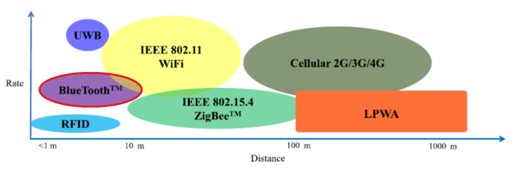

Esiste però un ambito nel quale il BLE è attualmente **senza rivali** rispetto alle tecnologie BLE, WiFi e LoRaWAN: il **tracciamento indoor** degli asset aziendali e la **localizzazione indoor** degli utenti. Il meccanismo che consente queste funzioni si basa sulla trasmissione di particolari messaggi periodici detti **beacon**. 

La tecnologia dei **beacon** è **comune** a quasi tutti i protocolli wireless moderni, compresi BLE, WiFi e LoRaWAN, che quindi sono in parte capaci anche loro delle funzioni di localizzazne suddette, ma in maniera molto **meno precisa** e versatile.

## **Aspetti critici**

- [Aspetti critici comuni per tutte le tecnologie](approfondimenti/aspetti_critici_generali.md)
- **Aspetti particolari per BLE**
    - Posizionamento in planimetria dei **nodi** con relativa etichetta, avendo cura di posizionare tra essi
  almeno **un gateway** che permetta l'accesso a una rete IP. Progettare dei **percorsi alternativi
  (backup)** in caso di guasto del gateway principale.
    - Tecnologie dei dispositivi: definizione della **tipologia di servizio** (polling sincrono,
  comando asincrono, ecc.).
    - Gestire eventuali **vincoli di prossimità** (mediante controllo di potenza o gestione del roaming)
  ed eventuali **vincoli di posizionamento** (mediante trilaterazione).
    - Definizione del percorso dei dati tra sensori ed eventuali attuatori per stabilire la
  **sede dell'elaborazione dei comandi** più opportuna (locale/edge sul gateway vs remota on-premise/cloud).

[Rete di reti BLE](/approfondimenti/ble_federation.md)
       
[Broker MQTT](/approfondimenti/broker_mqtt.md)

[Messaggi MQTT](/approfondimenti/messaggi_mqtt.md)

[Server di gestione](/approfondimenti/server_di_gestione.md)

[Sensori](/approfondimenti/sensore.md)

[Cheat Sheet](/cheatsheet/cheatsheet.md)

---

## **Semantica applicativa standard**

La **semantica** delle **entità** BLE definisce:
- le **categorie** degli oggetti che le entità possono gestire (lampade piuttosto che pulsanti)
- gli **attributi** che esse posseggono (acceso, spento, stato)
- gli **oggetti** che possono svolvere certe **azioni** su altri oggetti (un pulsante accende una lampada)

Si può comprendere, quindi, come una **rete BLE** non si limiti a trasmettere, tra dispositivi sensori e attuatori, dei **messaggi generici** di cui lo stack di protocolli non capisce il **significato** e non conosce la **struttura** ma,  bensì, trasmette proprio messaggi di comando e messaggi di stato ritagliati per una certa categoria di dispositivi domotici modellata dal protocollo. Essendo parte del protocollo, questi messaggi hanno la proprietà di essere **standard**, per cui sono **comuni** a dispositivi di **marca diversa** purchè siano dello **stesso tipo** previsto dallo standard.

E' una differenza sostanziale con una rete **LoraWAN** o **IP**:
- una **rete IP** e una **rete LoRaWAN** scambiano **messaggi** generici **non strutturati** arrivando fino al **livello 4** della pila **ISO/OSI**. In pratica, scambiano **sequenza di bit**.
- **BLE** scambia messaggi con una **struttura** ed **significato** (semantica) entrambi **stabiliti a priori** dallo standard fino al **livello 6 (presentazione)** della pila **ISO/OSI**. In pratica, scambiano oggetti domotici strutturati, in un certo senso, analoghi a documenti quali Word, Powerpoint, XML, HTML, ecc...

### **Esempio di Servizio Lampadina BLE**

Ogni servizio, caratteristica e descrittore ha un UUID (Universaly Unique Identifier). Un UUID è un numero univoco a 128 bit (16 byte). 

```
Service: Lampadina
UUID: 12345678-1234-5678-1234-56789abcdef0

Characteristic: On/Off
UUID: 12345678-1234-5678-1234-56789abcdef1
Properties: Read, Write, Notify
Value: Boolean (true = On, false = Off)
```

### **Scenario d'Uso**

Immaginiamo di avere un'applicazione di controllo della casa intelligente che deve interagire con una lampadina BLE.

#### **Accendere la Lampadina:**
- Scrittura del valore true alla caratteristica On/Off
```Json
{
  "ServiceUUID": "12345678-1234-5678-1234-56789abcdef0",
  "CharacteristicUUID": "12345678-1234-5678-1234-56789abcdef1",
  "Value": true
}
```

#### **Spegnere la Lampadina:**
- Scrittura del valore false alla caratteristica On/Off.
```Json
{
  "ServiceUUID": "12345678-1234-5678-1234-56789abcdef0",
  "CharacteristicUUID": "12345678-1234-5678-1234-56789abcdef1",
  "Value": false
}
```

#### **Leggere lo Stato della Lampadina:**
- l'applicazione può anche leggere lo stato attuale della lampadina leggendo il valore della caratteristica On/Off.
```Json
{
  "ServiceUUID": "12345678-1234-5678-1234-56789abcdef0",
  "CharacteristicUUID": "12345678-1234-5678-1234-56789abcdef1",
  "Operation": "Read"
}
```
---

## **Gateway**

### **Ruolo del gateway** 

**Riassumendo**, alla **rete di distribuzione IP** si collegano, quindi, una o più **reti secondarie** che servono da **rete di accesso** per i dispositivi sensori o attuatori con **interfacce** spesso di tipo **non ethernet** che necessitano di un **gateway** di confine con possibili funzioni di:     
  - **Inoltro**, cioè smistamento dei messaggi da un tipo di rete all'altro di tipo L3 (**routing**) o di tipo L2 (**bridging**). L'inoltro del messaggio di un sensore può essere:
       - **diretto** nella rete di distribuzione tramite link fisico verso il dispositivo di smistamento (router o switch) più vicino.
           - Nel caso di una LAN il gateway possiede un indirizzo IP privato.
           - Nel caso di una WAN il gateway possiede un indirizzo IP pubblico.
       - **indiretto** tramite una dorsale virtuale, cioè un **tunnel**, verso il network server o verso un router di una WAN privata, realizzato, ad esempio, in maniera cifrata tramite un **client di VPN**, oppure in maniera non cifrata tramite un client di tunnel generico **GRE**. In questo caso il **gateway** possiede:
         - un indirizzo **IP pubblico** nell'interfaccia in **Internet**. 
         - un **IP privato** nell'interfaccia sul **tunnel cifrato**. Il tunnel cifrato, per VPN L3, è gestito con una subnet IP **separata** per ogni tunnel.
  - **Traduzione di formato** dei messaggi da rete **BLE** a rete **ethernet** con eventuale realizzazione del **bridge** L4 tra il livello applicativo in uso nella rete di sensori BLE e quello in uso nella rete di distribuzione IP.
  - **Interrogazione periodica** (polling) dei dispositivi nella rete di sensori (master di una architettura master/slave)
  - **Raccolta e memorizzazione** delle informazioni per essere trasferite in un **secondo momento** al server di gestione
  - **Protezione della rete di sensori**, cioè di firewall, soprattutto quando questa, tramite il gateway, si connette direttamente alla rete **Internet** mediante un **IP pubblico**.

Il **gateway** è uno **snodo nevralgico** dei messaggi, per cui la sua posizione dovrebbe essere **ben nota** e accuratamente **riportata in planimetria** per permettere una sua rapida manutenzione/sostituzione.

E' il dispositivo posto a cavallo tra la rete di accesso ai sensori e la rete di distribuzione. 

Il **gateway** ha tante **schede di interfaccia** quanti sono i **tipi diversi di rete** a cui si collega. Inoltre il **gateway** deve possedere almeno **una interfaccia** capace di traffico ethernet (cablata o wifi) che lo colleghi alla **rete di distribuzione**. 

### **Gateway come router ci confine**

Il gateway è anche il **router di confine** della rete BLE, cioè il primo router che si collega con gli altri nodi router della rete di sensori. Per migliorare l'affidabilità sarebbe opportuno che questo nodo realizzi collegamenti verso nodi diversi della rete BLE creando **più percorsi fisici** con funzione di **ridondanza**. Con questo intento potrebbe essere utile posizionare il gatreway in una **locazione densa di router** nelle vicinanze, quale un corridoio con molte lampade lampade.

#### **Gateway come Client MQTT**

In **generale**, su reti **non IP**, i **client MQTT** (con il ruolo di **publisher** o di **subscriber**) sono sempre i **gateway di confine** della **rete di sensori**. Le uniche reti di sensori che non hanno bisogno di un gateway di confine che sia, nel contempo anche client MQTT, sono le reti IP. Esistono ancora i gateway nelle **reti IP** ma con **scopi diversi** da quello di **realizzare** un **client MQTT**. Nelle **reti IP**, il **client MQTT** è, normalmente, direttamente **a bordo** del **dispositivo** sensore dotato di indirizzo IP (**MCU**).

#### **Gateway come MCU hub di sensori**

La **parola gateway** potrebbe talvolta portare a **fraintendimenti** dovuti al diverso significato nei **diversi contesti** in cui la si usa. **Spesso**, con il **termine gateway** si intente anche il **dispositivo IoT** che potrebbe essere, **a sua volta**, un **gateway** tra la il **link di campo**, porte analogiche/digitali o BUS, (vedi [bus di campo](cablatisemplici.md) per dettagli) e la **rete di sensori** (WiFi, BLE, LoraWAN, LAN, BLE, ecc.). Vedi ([dispositivi terminali](sensornetworkshort.md#dispositivi-terminali-sensoriattuatori)) per approfondimenti.
#### **Gateway come router L7**

### **Gateway come router L7**

Avendo più interfacce su reti di tipo diverso sia in L1 che in L2, ha anche le funzioni di **router**. Se la rete di distribuzione è pubblica come **Internet** dovrebbe possedere pure le funzioni di **firewall**. 

Ma la funzione **più importante** che possiede nel contesto di una rete di dispositivi IoT è la **traduzione** della **semantica**, cioè del significato degli oggetti, dalla rete **BLE** al livello applicativo **MQTT** che smista i messaggi nella rete IP. Questa funzione rende il gateway un **bridge di traduzione** di comandi da un ambiente all'altro.

**Misure** e **comandi** sono definiti due volte:
- nella **rete di distribuzione** sotto forma di **oggetti JSON** in formato ASCII. Questo dovrebbe garantire da un lato l'interoperabilità tra reti di sensori diverse, dall'altro l'interoperabilità con sistemi terzi che si occupano della pubblicazione dei dati o della loro eleborazione statistica. Il fatto che il formato scelto sia chiaro, testuale ed autoesplicativo è sicuramente un vantaggio nella rete di **distribuzione**.
- nella **rete di sensori** (BLE) dove hanno una loro rappresentazione che normalmente non coincide con quella in uso nella rete di distribuzione.

In ogni caso, per gli **oggetti BLE**, la semantica dei comandi e dello stato è **standardizzata**, nel senso che dispositivi di **marche diverse** si possono **comandare** allo **stesso modo**. Tutti i dispositivi di **ugual tipo** si rappresentano come uno **stesso oggetto** BLE, avente gli **stessi attributi** per tutti i dispositivi di quel tipo.

Gli oggetti JSON scambiati nella rete di distribuzione vanno **progettati** in modo tale da includere la **semantica** di tutti i dispositivi IoT coinvolti nelle reti di sensori collegate, che di volta in volta, poi andrà **tradotta** nella **semantica applicativa standard** prevista nello stack della rete di accesso BLE.

--- 

### **Formato dei messaggi**

**Misure** e **comandi** sono attualmente definiti sotto forma di **oggetti JSON** in formato ASCII. Questo dovrebbe garantire da un lato l'interoperabilità tra reti di sensori diverse, dall'altro l'interoperabilità con sistemi terzi che si occupano della pubblicazione dei dati o della loro eleborazione statistica. Il fatto che il formato scelto sia chiaro, testuale ed autoesplicativo è sicuramente un vantaggio nella rete di **distribuzione**. 

Gli oggetti JSON scambiati nella rete di distribuzione vanno **progettati** in modo tale da includere la **semantica** di tutti i dispositivi IoT coinvolti nelle reti di sensori collegate, che di volta in volta, poi andrà **tradotta** nella **semantica applicativa standard** prevista nello stack della rete di accesso BLE.

Per Bluetooth Low Energy (BLE), i dispositivi sono spesso strutturati utilizzando servizi e caratteristiche (characteristics). Per una lampadina BLE, potremmo avere un servizio che consente di controllare lo stato di accensione e spegnimento della lampadina. Di seguito viene fornito un esempio di come potrebbe essere strutturato un servizio BLE per una lampadina, con le operazioni di accensione e spegnimento.

### **Traduzione della semantica applicativa** 

**Ble2mqtt** è un software open-source progettato per permettere ai dispositivi BLE di comunicare direttamente con un server MQTT (Message Queuing Telemetry Transport) senza la necessità di un hub proprietario.  [Ble2mqtt](https://github.com/devbis/ble2mqtt)

BLE è uno standard di comunicazione wireless utilizzato anche per il controllo e l'automazione domestica, mentre MQTT è un protocollo di messaggistica leggero utilizzato per il trasferimento di dati tra dispositivi. Utilizzando BLE2mqtt, gli utenti possono integrare facilmente dispositivi BLE di diversi produttori in un sistema di automazione domestica basato su MQTT, con un alto livello di flessibilità e controllo. 

Il bridge **ble2mqtt** opera a livello di **presentazione** della pila OSI ed esegue, nell'ordine, le seguenti **operazioni**:
1. **sbusta** tutti i messaggi provenienti dall'interfaccia BLE uno dopo l'altro, a partire dal **livello fisico** fino ad arrivare al **livello di presentazione**, dove BLE realizza la sua **rappresentazione semantica** dell'oggetto comandato/attuato/configurato, completa di **attributi** e corrispondenti **valori**.
2. a questo punto **traduce** il **payload BLE** in un **payload JSON** che contiene gli stessi attributi con gli stessi valori. 
3. dopo di che **smista** il **JSON** così costruito sull'**interfaccia IP** del gateway, dove viene imbustato come **payload** del protocollo **MQTT** ed **inviato** fino al **broker**.

Ble2mqtt funge da **ponte** tra la rete BLE e il broker MQTT, consentendo agli utenti di interagire con i dispositivi BLE tramite messaggi MQTT. 

La **traduzione** è resa possibile perchè le reti BLE definiscono per ogni dispositvo la **semantica applicativa standard** che abbiamo visto sopra (una lampadina ha gli stessi comandi, lo stesso stato e la stessa configurazione per tutte le lampadine BLE mai prodotte da chiunque). Compito del bridge **Ble2mqtt** è **tradurre** gli **oggetti standard** BLE in **JSON** e inserirli in un **messaggio MQTT**.

#### **Funzionamento di ble2mqtt** 
Ecco una descrizione di come funziona ble2mqtt:

1. **Scansione dei Dispositivi BLE**: ble2mqtt esegue una scansione per rilevare dispositivi BLE nelle vicinanze. Questo include sensori, attuatori, lampadine, termostati, ecc.
2. **Connessione ai Dispositivi BLE**: una volta individuati, ble2mqtt si connette ai dispositivi BLE per leggere e scrivere dati. Può interagire con i servizi e le caratteristiche esposte dai dispositivi.
3. **Pubblicazione su MQTT**: i dati letti dai dispositivi BLE vengono convertiti in messaggi MQTT e pubblicati su un broker MQTT. Questo può includere dati di stato, misurazioni di sensori, ecc.
4. **Sottoscrizione a Comandi MQTT**: ble2mqtt si iscrive anche a determinati topic MQTT per ricevere comandi. Quando un comando MQTT viene ricevuto, ble2mqtt lo traduce in un'operazione BLE e lo invia al dispositivo appropriato.

#### **Configurazione di ble2mqtt** 

Per controllare tre lampadine diverse sotto lo stesso topic stanzetta usando BLE2mqtt, è possibile configurare un approccio che permetta di inviare comandi a tutte e tre le lampadine contemporaneamente o individualmente. Un modo efficace per farlo è usare un payload JSON che includa informazioni specifiche per ciascuna lampadina.

```Python
mqtt:
  base_topic: ble2mqtt
  server: 'mqtt://localhost'
  user: 'MQTT_USERNAME'
  password: 'MQTT_PASSWORD'

devices:
  'C4:7C:8D:6A:95:BD':
    friendly_name: lampadina1
  'D0:52:A8:00:67:AB':
    friendly_name: lampadina2
  'F0:99:B6:43:55:AC':
    friendly_name: lampadina3
```

Ora, configurando un singolo topic BLE2mqtt/stanzetta/set per inviare comandi a tutte e tre le lampadine, possiamo usare un payload JSON per specificare lo stato desiderato di ogni lampadina.

#### **Accendere tutte le Lampadine:**

```Bash
#!/bin/bash

# Accendere lampadina1
mosquitto_pub -h localhost -t 'BLE2mqtt/lampadina1/set' -m '{"state": "ON"}'

# Accendere lampadina2
mosquitto_pub -h localhost -t 'BLE2mqtt/lampadina2/set' -m '{"state": "ON"}'

# Accendere lampadina3
mosquitto_pub -h localhost -t 'BLE2mqtt/lampadina3/set' -m '{"state": "ON"}'
```

#### **Spegnere tutte le Lampadine:**

```Bash
#!/bin/bash

# Accendere lampadina1
mosquitto_pub -h localhost -t 'BLE2mqtt/lampadina1/set' -m '{"state": "OFF"}'

# Accendere lampadina2
mosquitto_pub -h localhost -t 'BLE2mqtt/lampadina2/set' -m '{"state": "OFF"}'

# Accendere lampadina3
mosquitto_pub -h localhost -t 'BLE2mqtt/lampadina3/set' -m '{"state": "OFF"}'
```

#### **Comandare le Lampadine Singolarmente:**

```Bash
#!/bin/bash

# Accendere lampadina1
mosquitto_pub -h localhost -t 'BLE2mqtt/lampadina1/set' -m '{"state": "ON"}'

# Accendere lampadina2
mosquitto_pub -h localhost -t 'BLE2mqtt/lampadina2/set' -m '{"state": "OFF"}'

# Accendere lampadina3
mosquitto_pub -h localhost -t 'BLE2mqtt/lampadina3/set' -m '{"state": "ON"}'
```
#### **Utilizzo dei topic**

Puoi definire una gerarchia di topic MQTT per raggruppare le lampadine. Ad esempio, potresti avere un topic per ciascun ambiente della tua casa o per ciascun piano dell'edificio. Ecco un esempio di come potrebbe apparire la gerarchia dei topic:

```Bash
casa/
  └── soggiorno/
      ├── lampadina1/
      │   ├── comandi
      │   └── stato
      ├── lampadina2/
      │   ├── comandi
      │   └── stato
      └── lampadina3/
          ├── comandi
          └── stato
```
In questo esempio, ```casa``` è il prefisso di tutti i tuoi topic MQTT. All'interno di questo prefisso, hai un sotto-topic per il soggiorno chiamato ```soggiorno```, e all'interno di questo sotto-topic hai i sotto-topic per ciascuna delle tue lampadine, ciascuno dei quali ha due sotto-topic: ```cmd``` e ```stato```.

```Bash
mqtt:
  base_topic: casa
  server: 'mqtt://localhost'
  user: 'MQTT_USERNAME'
  password: 'MQTT_PASSWORD'
serial:
  port: '/dev/ttyUSB0'
devices:
 'F0:99:B6:43:55:AC':
    friendly_name: lampadina1
    state_topic: 'soggiorno/lampadina1/stato'
    set_topic: 'soggiorno/lampadina1/comandi'
 'C4:7C:8D:6A:95:BD':
    friendly_name: lampadina2
    state_topic: 'soggiorno/lampadina2/stato'
    set_topic: 'soggiorno/lampadina2/comandi'
 'D0:52:A8:00:67:AB':
    friendly_name: lampadina3
    state_topic: 'soggiorno/lampadina3/stato'
    set_topic: 'soggiorno/lampadina3/comandi'
```

#### **Accendere una lampadina del Soggiorno**
```Bash
mosquitto_pub -h localhost -t 'casa/soggiorno/lampadina1/cmd' -m '{"state": "ON"}'
```

#### **Accendere tutte le Lampadine nel Soggiorno**
```Bash
mosquitto_pub -h localhost -t 'casa/soggiorno/cmd' -m '{"state": "ON"}'
```

#### **Spegnere tutte le Lampadine nel Soggiorno**
```Bash
mosquitto_pub -h localhost -t 'casa/soggiorno/cmd' -m '{"state": "OFF"}'
```
---

## **Reti BLE per tracciamento e localizzazione** 

Si tratta di un utilizzo diverso da quello di una normale rete di sensori poichè l'obiettivo finale non è creare una rete di dispositivi domotici composta da sensori e attuatori ma creare una rete di dispositivi per la **localizzazione** e il **tracciamento**, nel **tempo** e nello **spazio**, della posizione di **altri dispositivi**.

L'**iBeacon di Apple** è stata la prima tecnologia BLE Beacon a essere pubblicata, quindi la maggior parte dei beacon si ispira al formato dati iBeacon. Gli iBeacon sono abilitati in molti SDK di Apple e possono essere letti e trasmessi da qualsiasi iDevice abilitato per BLE. IBeacon è uno standard proprietario e chiuso. 
I beacon trasmettono quattro informazioni:
- Un UUID che identifica il beacon.
- Un numero maggiore che identifica un sottoinsieme di beacon all'interno di un grande gruppo.
- Un numero minore che identifica un beacon specifico.
- Un livello di potenza TX in complemento di 2, che indica la potenza del segnale a un metro dal dispositivo. Questo numero deve essere calibrato per ciascun dispositivo dall'utente o dal produttore.
  
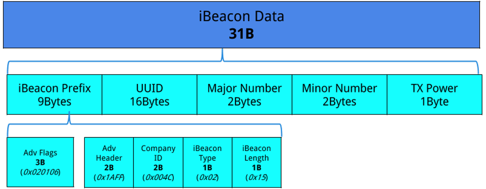

Un'applicazione di scansione legge l'UUID, il numero maggiore e il numero minore e li usa come riferimento per ottenere informazioni sul beacon da un database; 
il beacon stesso non porta informazioni descrittive, richiede che questo database esterno sia raggiungibile. 
Il campo di potenza TX viene utilizzato con l'intensità del segnale misurata per determinare la distanza del dispositivo beacon dallo smartphone. Si noti che TxPower deve essere calibrato dall'utente per raggiungere una buona precisione.

### **Scopo iBeacon** 
Questo innovativo uso della tecnologia fa principalmente leva su due concetti chiave: 
- **Micro-location**: è noto che uno dei punti di forza dei Beacon che sfruttano Bluetooth LE è la possibilità di una localizzazione a corto raggio precisa e rapida (complementare al GPS):
     - **Posizionamento assoluto**, i GPS forniscono una posizione assoluta in termini di latitudine e longitudine ma ha difficoltà a raccogliere i segnali dei satelliti GPS all’interno degli edifici, soprattutto a più piani. Per questo il sistema di GPS è inadatto per fornire una localizzazione precisa in un raggio di 15-20 metri,
     - **Posizionamento relativo**. La Micro-location lavora semplicemente con la distanza relativa del device dai punti noti dove sono posizionati i Beacon. La geolocalizzazione basata su Ibeacon è ad un alto livello di granularità ed è appunto definita convenzionalmente con il termine «Micro-location».
     - **Possibilità di tracciamento**. Gli iBeacons sono traccianti, quando un device lascia l'area da loro coperta, sono capaci di monitorare la sua posizione nel tempo. Una rete di beacon può **tracciare** gli **spostamenti** di **persone** e **manufatti** in un intero edificio o **sito aziendale**.
- **Interaction/Engagement/Context**:
     - I segnali degli iBeacons possono interagire con le Apps, inviando notifiche (sia al sistema che all’utente) e facendo eseguire a queste ultime **azioni specifiche** in un **tempo** ed una **locazione specifica**. 
     - Sostanzialmente, il servizio fornito dai Beacons è quello di fornire un **contesto esterno** all'**applicazione**, che può ora conoscere **cosa** realmente **circonda l'utilizzatore** del device. Per questo motivo viene aperta la possibilità di far **interagire** le applicazioni mobili con il **mondo fisico** circostante senza alcuno sforzo (in maniera **trasparente** all’utente), in modo che l'utente finale possa davvero percepire il collegamento tra la realtà ed il device che tiene tra le mani. 

Importante sottolineare alcune **proprietà** peculiari del BLE: 
- **Trasparenza dell’utente**. Ogni device con una connessione Bluetooth attiva e l'App adeguata **reagirà automaticamente**, in tempo reale, ai Beacon circostanti, senza la necessità che l'**utente intervenga**, per esempio estraendo lo smartphone dalla tasca. E' come se l'app avesse dei **sensi** che le permettono di reagire **autonomamente** in maniera adeguata al **contesto** in cui si trova. L’attivazione del consenso all'utilizzo dei beacon da parte di una app dovrebbe essere eseguita esplicitamente dall’utente in maniera tale da evitare di autorizzare **inconsapevolmente** azioni pericolose per la privacy.
- **Tracciamento spaziale e temporale**. Il negoziante inoltre potrà monitorare le **aree** di maggior **interesse** dei propri clienti ancora prima che questi acquistino qualcosa, in quanto i Beacon possono tracciare ogni spostamento all'interno del negozio, permettendo al sistema di determinare gli scaffali davanti ai quali i clienti si fermano di più. Queste informazioni di **navigazione** degli **scaffali** di un **negozio** sono analoghe a quelle fornite dai cookie durante la **navigazione** delle **pagine** di un **browser** e, pertanto, sono informazioni altrettanto utili in termini di **marketing**. Ma i **beacon** possono anche essere usati per fornire all'utente **contenuti associati** al **luogo** in cui l'**app** si trova, come ad esempio la **descrizione** di un'opera d'arte in un museo o la **visualizzazione di una interfaccia** di comando o configurazione di un impianto tecnologico.
- **Interfacce di comando universale**. Gli hardware iBeacon saranno sempre più piccoli e ed economici: possono essere programmati non solo per essere degli Advertiser ma anche degli Scanner, cosìcché un semplice Smartphone, che è a tutti gli effetti un Beacon, possa inviare comandi ai dispositivi installati per esempio in casa, per accendere luci o altri elettrodomestici a distanza. 
- **Struttura autonoma**. Un altro punto fondamentale è che non è mai richiesta una connessione ad Internet: anche se poter accedere a risorse su cloud tramite la rete potrebbe ampliare ancora di più il range di attività possibili con BLE.

**In definitiva**, gli iBeacon utilizzano Bluetooth Low Energy per creare un'infrastruttura smart, orientata alla localizzazione, che i dispositivi mobili possono utilizzare per ricavare **informazioni contestuali** basate sull'**ambiente stesso** in cui si **muovono**, in **tempo reale**. 

Le applicazioni possono ora sapere esattamente dove si trovano e cosa le circonda, aprendo la strada ad un nuovo livello di interazione col mondo, senza bisogno di una connessione ad Internet.


### **Schema di cablagggio a beacon fisso** 

È l’approccio più comune. I beacon sono posizionati in **posizioni fisse** e note, rispetto a una **mappa interna**.  

I dispositivi mobili (**listener**) abilitati Bluetooth **riconoscono** i beacon quando questi si trovano all'interno del **raggio** della loro **portata** (variabile dal metro alle decine di metri) e determinano la **posizione assoluta** (latitudine e longitudine) del dispositivo sulla mappa, stimata grazie a misure di **distanza**:
- con la **distanza** stimata da un **1 beacon** si stabilisce solo il **raggio di presenza** del beacon
- con la **distanza** stimata da almeno **3 beacon** si stabilisce la **posizione puntuale** del beacon nel piano, è il meccanismo della **trilaterazione**
- con la **distanza** stimata da almeno **4 beacon** si stabilisce la **posizione puntuale** del beacon nello spazio (viene introdotta l'altezza), è il meccanismo della **trilaterazione** + altezza

I **dati di tracciamento** raccolti da ciascun **dispositivo mobile** possono quindi essere inviati, via wifi o modem UMTS, a un **sistema centralizzato** a scopo analitico e ad altri servizi come la **mappatura** delle presenze in tempo reale, o delle **localizzazioni** in tempo reale.

Si noti che in questo **approccio** i **dispositivi da localizzare** hanno il ruolo di listener e devono essere essere **collegati alla rete**, mentre i **dispositivi fissi** no.

La particolarità di questo approccio è:
- un **numero elevato** di beacon a basso costo installati sulle zone da presidiare
- l'**assenza** di una infrastruttura di **rete** per i beacon che sono, a tutti gli effetti, **dispositivi isolati**.
- la **responsabilità** dell'elaborazione e del collegamento al server **delegata** al **listener** che si **sposta**.

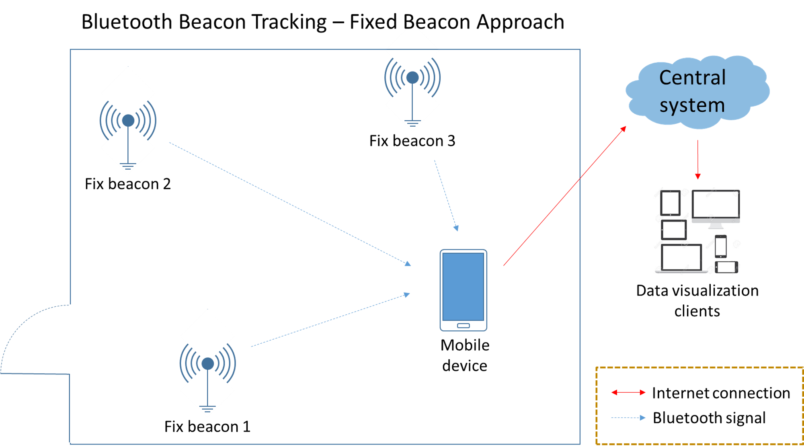

**Esempio**: tour digitale in un museo, in cui ogni stanza o attrazione potrebbe avere un beacon fisso che emette un tag BLE specifico. Se una persona sceglie di installare l'app mobile del museo, il suo telefono, ogni qualvolta cammina **vicino a un beacon**, legge il **tag** e le informazioni pertinenti e mirate sull'esposizione potrebbero essere recuperate da ciascun dispositivo tramite il tag, consentendo un'esperienza più istruttiva e coinvolgente per i visitatori.

**Esempio ambulatorio.**

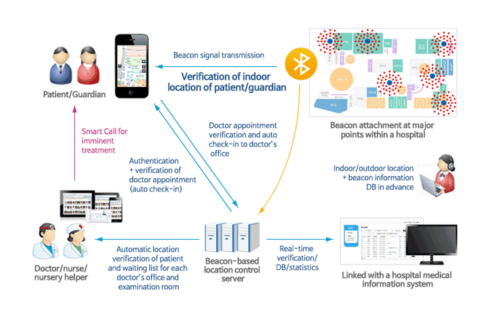

**Esempio shopping.**

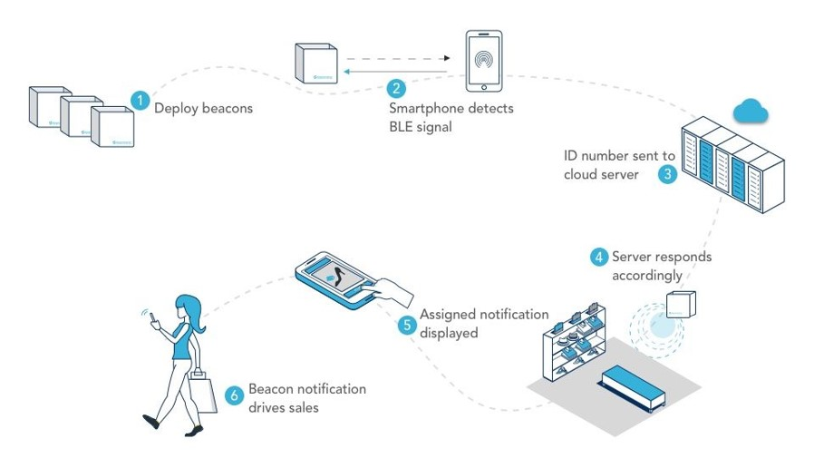

**Esempio ospedale.**


### **Schema di cablagggio a scanner fisso** 

È un’approccio sempre più diffuso. Questi "**ascoltatori**" fissi raccolgono gli **identificativi** di tutti i beacon Bluetooth alla loro **portata** e sono loro stessi che **trasmettono** le informazioni raccolte a un **sistema centralizzato** per l'analisi, invece che un **dispositivo mobile** collegato alla rete.

Il **sistema centrale** applicherà alcuni filtri digitali e, in base alla posizione degli ascoltatori fissi nota sistema, determinerà la posizione dei beacon mediante la **trilaterazione**. 

Utilizzando **questo approccio**, invece di tracciare o localizzare  un **dispositivo mobile** costoso (smartphone) , si effettua il tracciamento dei **singoli beacon** che, grazie al **costo irrisorio** e alle **ridodittissime dimensioni**, consentono una serie di casi d'uso nuovi e innovativi.

Si noti che in questo **approccio** i **dispositivi fissi** hanno il ruolo di listener e devono essere essere **collegati alla rete**, mentre i **dispositivi da localizzare** no.

Questo **approccio** è però molto più **oneroso** per l'infrastruttura perchè adesso serve una **rete di distribuzione** delle informazioni di tracciamento raccolte dai **listener** che deve essere **estesa** almeno quanto tutta l'**area da presidiare**.

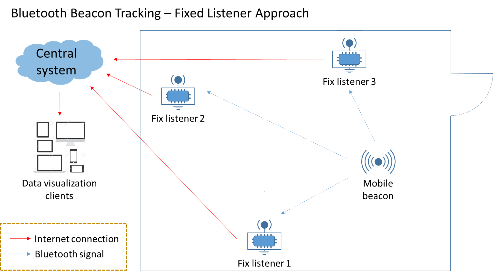

**Esempi**:
- **Tracciamento** di **risorse** in una **fabbrica** (materie prime o prodotti) o in un **cantiere** (utensili, macchinari spostabili, attrezzature in genere) identificate da un **tag univoco**. **Beacon** solidali alle risorse e **listener** installati lungo la linea di produzione forniscono **dati di tracciamento** in **tempo reale** non solo rispetto alla **posizione** ma anche a **quantità di tempo** (ad esempio, il tempo in cui alcuni pezzi rimangono in un reparto di una fabbrica).
- **Tracciamento** partecipanti di una **fiera** a cui sono stati dati dei piccoli beacon BLE grandi come una moneta da portare con sé, che possono interagire con gli **"ascoltatori"** BLE posizionati presso gli stand dimostrativi e nelle sale riunioni dell'evento. A seconda dell'occasione, del caso d'uso e dell'obiettivo aziendale, tale sistema è in grado di:
    - raccogliere solo **metriche anonime** e **aggregate**, quali numero di presenze e analisi di eventi in tempo reale 
    - gestire **code e appuntamenti**, potrebbe anche essere utile ai partecipanti (i gestori di beacon) che, una volta **in prossimità** di un evento, potrebbero tramite un'**app** interrogare il sistema centrale per **prenotare** i posti e **accodarsi** virtualmente in tempo reale senza mettersi **fisicamente** in fila.
    - raccogliere **informazioni puntuali** e personali. Con l’esplicito accordo degli utenti, e solo nei limiti di dove sono stati collocati gli "ascoltatori", si potrebbe tracciare in tempo reale la posizione di **specifiche persone**.

Nell'architettura a **scanner fissi** i dispositivi BLE sono analoghi ai gateway dell'infrastruttura BLE Mesh solo che adesso lo scopo è radicalmente diverso, non servono a connettere l'intera rete di sensori alla LAN, ma a mandare ad un server una **informazione di tracciamento** da parte del listener che la ha raccolta. Poichè il **beacon si muove** nello spazio, potenzialmente in tutti gli ambienti, è necessario installare **molti scanner** lungo i percorsi che si desiderano tracciare e **non pochi gateway** soltanto.

#### **Posizionamento listener (scanner)**

Nell'architettura a **scanner fissi** i dispositivi BLE **non** possono restare **isolati** ma devono comunicare le informazioni sui beacon di passaggio nelle vicinanze ad un **server centrale** e, per far questo, hanno necessità di una rete da utilizzare come infrastruttura di **comunicazione**. Esistono alcune **alternative**:
- utilizzare la **rete LAN cablata** a cui i gateway BLE si collegano fisicamente mediante una presa Ethernet (RJ45). Il **prerequisito** di questa soluzione è un **ambiente cablato** in maniera uniforme e capillare.
- utilizzare una **rete di AP WiFi** a cui collegare i gateway come client. **Presuppone** una rete wifi con una copertura adeguata.
- utilizzare una **rete BLE mesh** realizzata dagli scanner e da altri dispositivi eventualmente presenti nell'ambiente con altri scopi (sensori o attuatori). Il **prerequisito** è avere una rete BLE mesh distribuita in maniera **sufficientemente capillare** negli ambienti dove si intende realizzare un servizio di **tracciamento** o **localizzazione indoor**.

**Esempio tracking assets industriali**

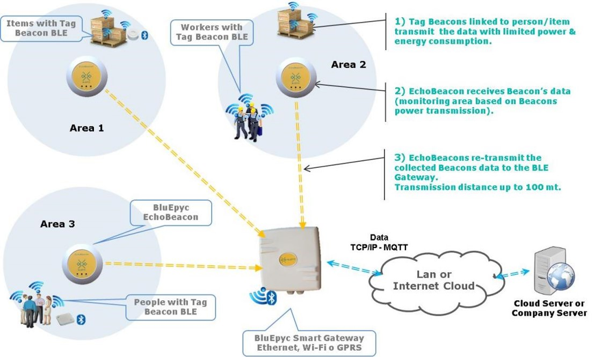

### **Rete di sensori BLE** 

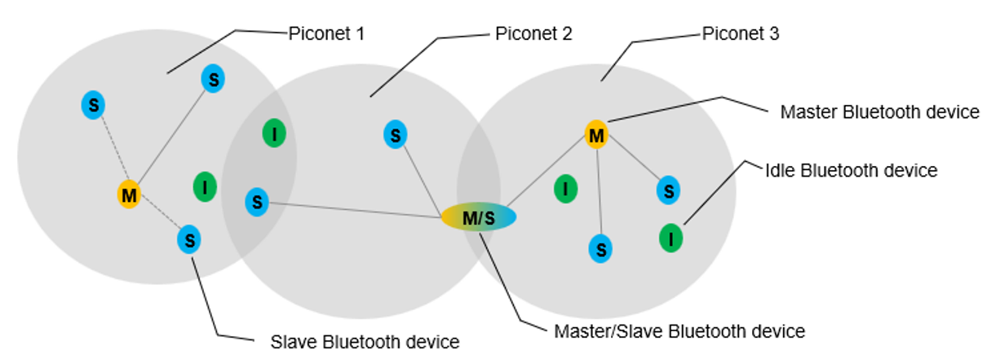

E' una architettura a stella gerarchica (albero). E' realizzata da un solo dispositivo master. Un master può essere contemporaneamente pure slave di un'altra piconet.

Ecco l'adattamento della trattazione per il **BLE (Bluetooth Low Energy)**, mantenendo la stessa struttura logica e lo stesso livello di dettaglio tecnico per analizzare come questa tecnologia gestisce le collisioni e l'accesso al mezzo radio.

---

## **Collisioni nel BLE (Bluetooth Low Energy)**

La tratta tra un dispositivo periferico (es. un sensore) e un dispositivo centrale (es. uno smartphone o un gateway) in una rete BLE è un collegamento radio che, operando su un **mezzo broadcast** condiviso nella banda ISM a 2.4 GHz, è per sua natura soggetta al fenomeno delle collisioni.

Nel BLE, le collisioni vengono mitigate in modo estremamente efficiente separando il traffico in base allo stato del dispositivo: la fase di **scoperta/annuncio (Advertising)** adotta una logica probabilistica, mentre la fase di **connessione (Connection)** adotta una logica puramente deterministica, sfruttando tutte le dimensioni dello spettro.

Esistono due **direzioni** di trasmissione all'interno di una connessione:

* **uplink** (da Peripheral a Central)
* **downlink** (da Central a Peripheral)


### **SDM: Limitazione del raggio e riuso spaziale**

Il BLE è progettato nativamente come tecnologia a corto o cortissimo raggio (Personal Area Network). L'**attenuazione di spazio libero** viene sfruttata in modo aggressivo mantenendo potenze di trasmissione molto basse (tipicamente tra -20 dBm e +10 dBm).

* Dispositivi situati in stanze diverse o separati da pochi metri attenuano il segnale a tal punto da permettere il riuso simultaneo degli stessi canali radio senza causare interferenze distruttive.
* Questa forte localizzazione spaziale riduce drasticamente il numero di nodi che competono all'interno della stessa "cella" radio effettiva.

### **FDM: Canali dedicati e Adaptive Frequency Hopping (AFH)**

Lo spettro a 2.4 GHz viene suddiviso dal BLE in **40 canali a radiofrequenza** spaziati di 2 MHz. La gestione del canale (FDM) è una delle armi principali del BLE e si divide nettamente tra due modalità:

* **Canali di Advertising (37, 38, 39):** Sono 3 canali speciali, posizionati strategicamente in punti dello spettro non sovrapposti ai canali Wi-Fi più utilizzati (1, 6, 11). Vengono usati dai dispositivi non connessi per inviare beacon o per farsi trovare.
* **Canali di Data (da 0 a 36):** Sono 37 canali utilizzati esclusivamente quando una connessione è attiva. Durante una connessione, il BLE non rimane fisso su un canale, ma implementa il **Frequency Hopping** dinamico: i due dispositivi cambiano canale frequenziale *per ogni singolo pacchetto* seguendo una sequenza pseudo-casuale.
* Se un canale è disturbato (es. a causa del Wi-Fi), interviene l'**Adaptive Frequency Hopping (AFH)**: il dispositivo Central mappa i canali d'accordo con il Peripheral, "sospende" quelli danneggiati e continua il salto di frequenza solo sui canali puliti, azzerando le collisioni persistenti.

### **Modulazione e Robustezza (GFSK e LE Coded)**

Il BLE standard utilizza una modulazione **GFSK (Gaussian Frequency Shift Keying)**, che non prevede codici ortogonali simultanei (niente CDM puro).

Tuttavia, a partire da BLE 5, è stata introdotta la modalità **LE Coded** dedicata al lungo raggio. Questa modalità introduce la codifica FEC (Forward Error Correction) associata a un meccanismo di *Pattern Mapping* (S=2 o S=8). Pur non trattandosi di un accesso multiplo a divisione di codice, questo sistema espande virtualmente il segnale nel tempo, offrendo un forte **guadagno di processo**. Il ricevitore riesce così a decodificare il messaggio corretto anche se parzialmente sovrapposto a rumore o a un'interferenza collisionale meno potente (effetto cattura).

### **ALOHA e TDM: Separazione nel tempo e stati operativi**

La gestione della dimensione temporale nel BLE è dicotomica e dipende dallo stato del link:

* **Fase Non Connessa (Simil-ALOHA con advDelay):** Quando un dispositivo invia pacchetti di annuncio (Beacon/Advertising), lo fa in modo asincrono. Per evitare che due beacon vicini, avviati nello stesso istante, continuino a collidere ciclicamente all'infinito, lo standard impone l'aggiunta di un ritardo casuale chiamato **`advDelay`** (un tempo randomico da 0 a 10 ms) dopo ogni intervallo di trasmissione nominale (`advInterval`). Questo meccanismo, del tutto analogo all'Aloha, introduce il disallineamento temporale necessario a risolvere le collisioni successive. [Dettaglio ALOHA](protocollidiaccesso.md#aloha) 
* **Fase Connessa (TDM Deterministico):** Una volta stabilita una connessione, il rischio di collisione interna viene **azzerato**. Il tempo viene diviso in slot rigidi governati dal Central.

## **L'Evento di Connessione e la Sincronizzazione**

Nel BLE non esiste una supertrama classica legata a un beacon broadcast aperto a tutti durante la connessione. Il coordinamento avviene tramite l'**Evento di Connessione (Connection Event)**, che si ripete ciclicamente a intervalli regolari stabiliti dal Central (chiamati *Connection Interval*).

Il pacchetto iniziale inviato dal Central per aprire l'evento funge da **sequenza di sincronizzazione**: permette al Peripheral di riallineare il proprio clock interno, compensando il naturale sfasamento dei quarzi (clock drift) e permettendogli di dormire nei periodi di inattività per risparmiare energia.

All'interno di ogni Evento di Connessione, l'accesso al mezzo è rigorosamente regolato in modalità master/slave (Central/Peripheral) tramite una politica di **polling deterministico**:

* L'evento inizia sempre con il **Central che trasmette** sul canale frequenziale designato dal frequency hopping.
* Il **Peripheral ascolta** e, solo dopo aver ricevuto il pacchetto del Central ed essere trascorsi esattamente 15 microsecondi (IFS - *Inter-Frame Space*), può rispondere in uplink.
* I due dispositivi continuano a scambiarsi pacchetti alternandosi nel tempo (approccio Time Division Duplex) finché uno dei due non decide di chiudere l'evento o non ci sono più dati da inviare.

In questa fase, nessuna contesa è ammessa: nessun altro dispositivo esterno sa su quale frequenza e in quale microsecondo avverrà lo scambio, blindando la comunicazione da collisioni intra-cella.

*(Nota: Per i beacon broadcast puri, BLE 5 introduce anche il **Periodic Advertising**, dove l'emettitore trasmette a intervalli temporali rigidamente deterministici e i ricevitori si sincronizzano sulla sua scansione temporale, creando una ricezione programmata priva di contesa).*

--- 

## **Topologie di connessione**

### **Beacon**

I beacon sono delle **sequenze di sincronizzazione** (dette preambolo) in grado sia di sincronizzare gli **orologi** dei dispositivi (Tx e Rx) che si accingono ad iniziare una comunicazione, ma anche di **indentificare** in maniera univoca i dispositivi che li emettono. Per dei dettagli vedi [preambolo di sincronizzazione](protocolli.md#preambolo-di-sincronizzazione).

La trama dati compresa tra **due beacon** consecutivi viene detta **supertrama** (superframe) ed è generalmente divisa in due zone con **politiche di accesso** al canale diverse:  
- una **deterministica** al riparo dalle collisioni detta **CFP** (Contention Free Period) e regolata dalla multiplazione statica TDMA, che viene usata per trasmettere i dati delle comunicazioni **unicast**.
- una **probabilistica** a contesa, in cui i tentativi di accesso dei dispositivi sono soggetti al **rischio di collisione** perchè regolata da un protocollo di tipo **CSMA/CA**, che invece serve per trasmettere delle particolari informazioni **broadcast** dette **advertisement**.

Nel contesto di BLE, un **centrale** può assumere un ruolo di **coordinamento**, simile a quello svolto dal PCF in una rete Wi-Fi, gestendo l'accesso al canale in modo master/slave in cui il centrale ha il ruolo di **master** che stabilisce **quale** stazione deve parlare, **quando** e **per quanto** tempo usando una politica di **turnazione** delle stazioni (**polling**).

Tutti i **dispositivi BLE** emettono beacon per cui il nome di beacon alla fine è finito per identificare anche un **generico dispositivo BLE**.

Le **superframe BLE** sono divise principalmente in tre zone:

- **Advertising Zone** (Zona di pubblicità): In questa zona, i dispositivi BLE trasmettono pacchetti di advertising per annunciare la propria presenza e offrire servizi ai dispositivi circostanti. Questa zona è utilizzata per l'inizializzazione delle connessioni e per il broadcasting di informazioni.

- **Connection Establishment Zone** (Zona di stabilità della connessione): Quando un dispositivo BLE desidera stabilire una connessione con un altro dispositivo, utilizza questa zona per scambiare pacchetti di connessione. Una volta stabilita la connessione, si passa alla terza zona.

- **Connection Events Zone** (Zona degli eventi di connessione): In questa zona avvengono gli eventi di trasmissione e ricezione di dati tra i **dispositivi connessi**. La struttura temporale di questa zona può variare in base alle necessità di trasmissione dei dati e al risparmio energetico.

Queste zone sono organizzate in un **ciclo temporale** (la supertrama) che si ripete periodicamente per consentire la comunicazione tra i dispositivi BLE in modo efficiente e sincronizzato.

### **Topologia broadcast**

Il **beacon non collegabile** è un dispositivo Bluetooth (broadcaster) a bassa energia in modalità di trasmissione. Trasmette semplicemente informazioni **statiche** archiviate internamente **senza ricevere** alcunchè da un eventuale observer. Dato che la trasmissione è **non connettibile** non attiva alcuna risorsa HW di ricezione, per cui ha il **minor consumo** energetico possibile. Il dispositivo deve semplicemente svegliarsi, trasmettere (pochi) dati e tornare a dormire (modalità radiofaro).  Ciò comporta l'inconveniente che gli unici dati **dinamici** sono limitati a ciò che è noto al dispositivo o a ciò che è disponibile tramite altri canali di cui è dotato il dispositivo quali interfacce seriali RS232 (UART), periferiche 4-wire (SPI), bus seriale universale (USB) e così via.

Gli **attori** di questa modalità sono quindi **due**:
- il **Broadcaster**: Invia periodicamente pacchetti di **advertise** non connettibili a chiunque sia disposto a riceverli. 
- l'**Osservatore** (observer): Esegue ripetutamente la **scansione** delle frequenze predefinite per ricevere eventuali pacchetti di advertisement non connettibili attualmente trasmessi (**scanning passivo**).

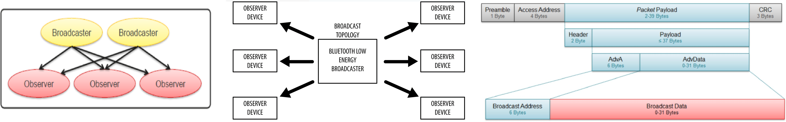

I pacchetti di **advertisement** sono periodici e sono messaggi di beacon trasmessi in broadcast da dispositivi broadcaster detti, per l’appunto, essi stessi beacon. Da questi l’osservatore ricava informazioni minimali (tag). 

### **Topologia connessa**
Il **beacon collegabile** (o periferica) è un dispositivo Bluetooth a bassa energia in **modalità periferica**, il che significa che può non solo trasmettere, ma anche **ricevere** e quindi potrebbe anche essere **interrogato periodicamente** per interagire con i **servizi** implementati sul dispositivo beacon effettuando:
- **letture (R)**. Il beacon potrebbe essere interrogato per effettuare, ad esempio, il polling di alcuni sensori, o per conoscere lo stato delle sue batterie.
- **notifiche (N)**. Il master (centrale o Client) potrebbe **registrarsi** per ottenere la notifica di qualche evento gestito dal beacon, ad esempio un segnale quando un valore di interesse scende sotto una certa soglia.
- **scritture (W)**. I servizi forniscono una o più caratteristiche che potrebbero essere modificate da un dispositivo peer. Un esempio di queste caratteristiche potrebbe essere la stringa di dati che rappresenta le informazioni trasmesse dal beacon. In questo modo è possibile avere un **beacon configurabile** che può essere facilmente aggiornato via etere proprio attraverso il bluetooth.

Gli **attori** di questa modalità sono sempre **due**:
- **Dispositivo master o centrale**: Esegue periodicamente la scansione delle frequenze predefinite alla ricerca di pacchetti pubblicitari connettibili e, se ne trova uno adatto, avvia una connessione (scanning attivo). Una volta stabilita la connessione, il **dispositivo centrale** gestisce i tempi e avvia gli scambi periodici di dati, diventa, cioè, il **master** della comunicazione.
- **Dispositivo slave o periferica**: un dispositivo che invia periodicamente pacchetti pubblicitari (advertisement beacon) connettibili in broadcast e **accetta** connessioni in entrata. Una volta iniziata una connessione, la periferica segue i tempi del master centrale e scambia regolarmente dati con esso, quindi, dopo la connessione, assume il ruolo di **slave** della comunicazione.

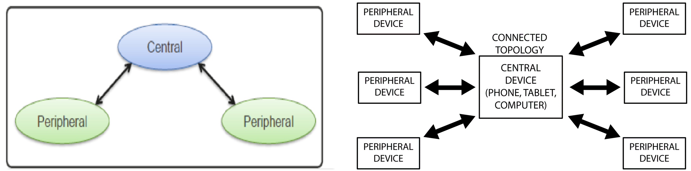

La differenza tra la scansione dei beacon effettuata da un dispositivo **centrale** e quella effettuata da un semplice **observer** sta nel fatto che la prima è una ricerca che è abilitata ad instaurare una connessione **bidirezionale** con i dispositivi beacon periferici, mentre la seconda è una scansione che permette l’attivazione di connessioni di **sola ricezione**. 

### **Topologia mista**

Stanno iniziando a comparire dispositivi dual-mode e single-mode più avanzati, dispositivi in ​​grado di combinare più ruoli contemporaneamente. Ciò consente loro di partecipare a più connessioni contemporaneamente, mentre usano gli advertisement per trasmettere informazioni in broadcast.

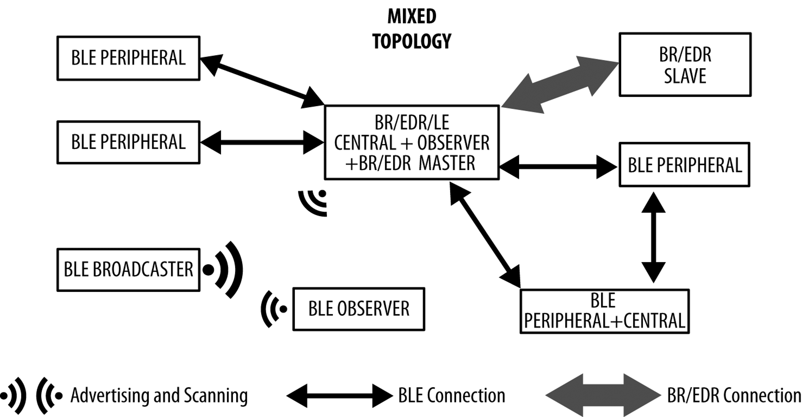

---

## **GATT**

I dispositivi BLE, dal punto di vista SW, si dividono in dispositivi **Client** e in dispositivi **Server**:

- Un **BLE client** è un dispositivo che inizia una connessione con un BLE server e richiede informazioni o servizi da quest'ultimo. Il client invia richieste specifiche al server e riceve le risposte pertinenti. Il client è anche uno scanner, cioè **scansiona** i dispositivi nelle vicinanze per scoprire i server BLE disponibili. Una volta trovato un server desiderato, il client stabilisce una **connessione** e invia **richieste** di lettura, scrittura o notifica per i dati offerti dal server. **In sostanza**, se **connesso** il BLE client è un **centrale/master**, se **non connesso** è un **observer**.
- Un **BLE server** è un dispositivo che contiene dati e servizi a cui i client possono accedere. Il server fornisce le risposte alle richieste del client e può anche inviare notifiche ai client registrati. Il server **pubblicizza** la sua **presenza** e le sue **capacità** attraverso pacchetti di **advertising**. I client nelle vicinanze possono quindi scoprire questi pacchetti, stabilire una connessione e interagire con il server per accedere ai servizi offerti. **In sostanza**, se **connesso** il BLE server è una **periferica/slave**, se **non connesso** è un **broadcaster**.

**Esempi**:
- **BLE Client**. Gli **smartphone**, i **tablet** e i **computer** sono comunemente utilizzati come BLE client, in quanto tendono a essere i dispositivi che **richiedono** informazioni da sensori, dispositivi indossabili o altri dispositivi periferici.
- **BLE Server**. **Sensori** intelligenti o termostati agiscono come server, offrendo informazioni sullo stato della casa o accettando comandi per modificare le impostazioni, ricevuti da un'applicazione mobile client.

I **servizi BLE** sono stati nel tempo **standardizzati** e sono raggruppati per **profili**, cioè per categorie di servizi, all'interno dei quali i **tipi** di servizio hanno **comandi**, **stato** e **configurazioni** standardizzati. Questo **approccio** fa si che un **comando** inviato da un dispositivo di una marca X possa essere recepito dall'**attuatore** di una marca Y con la garanzia che venga **intepretato correttamente**. In sostanza viene garantita la piena **interoperabilità** tra dispositivi **analoghi** anche se di marca diversa.

Nel caso particolare dei **beacon**, è però prassi comune introdurre dei **servizi custom** che possono essere diversi da un costruttore all'altro a patto, però, che il loro identificativo globale, l'**UIID** sia unico e diverso da quello già assegnato ad altri servizi.

**GATT** sta per Generic Attributes e definisce una **struttura dati** gerarchica esposta ai dispositivi BLE collegati. Ciò significa che GATT definisce il modo in cui due dispositivi BLE inviano e ricevono messaggi standard. 

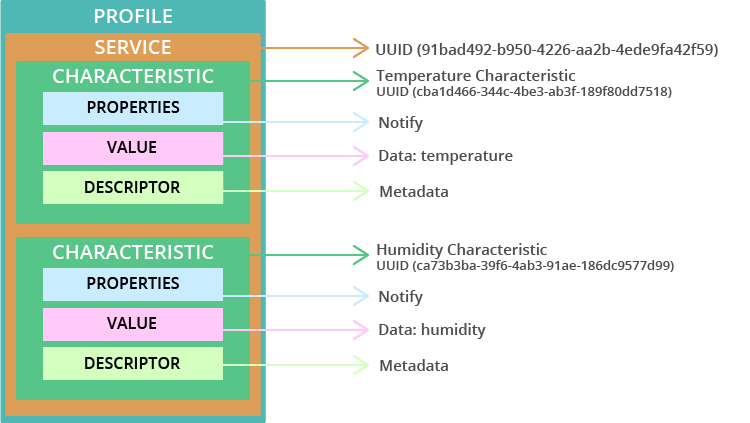

- **Profilo**: BLE utilizza profili standardizzati per specifiche applicazioni, come il profilo di monitoraggio della salute, il profilo di controllo della luce, e molti altri. Questi profili definiscono i servizi e le caratteristiche specifiche che i dispositivi devono supportare per garantire l'interoperabilità.
- **Servizio**: raccolta di informazioni correlate al servizio, come letture dei sensori, livello della batteria, frequenza cardiaca, ecc.;
- **Caratteristica**: è dove vengono salvati i dati effettivi nella gerarchia (valore);
- **Descrittore**: metadati sui dati;
- **Proprietà**: descrivono **come** è possibile interagire con il valore caratteristico. Ad esempio: **leggere**, **scrivere**, **notificare**, **trasmettere**, **indicare**, ecc.

### **UUID**

Ogni servizio, caratteristica e descrittore ha un UUID (Universaly Unique Identifier). Un UUID è un numero univoco a 128 bit (16 byte). Per esempio:

```C++
55072829-bc9e-4c53-938a-74a6d4c78776
```

Esistono UUID abbreviati per tutti i tipi, servizi e profili specificati nel SIG [Bluetooth Special Interest Group](https://www.bluetooth.com/specifications/assigned-numbers/). 

Ma se la tua applicazione necessita di un proprio UUID, è possibile generarlo utilizzando questo sito Web di generatore di UUID [UUID generator website](https://www.uuidgenerator.net/).

In sintesi, l'UUID viene utilizzato per identificare in modo univoco le informazioni. Ad esempio, può identificare un particolare servizio fornito da un dispositivo Bluetooth.

---

## **Protocolli di accesso al canale**

La situazione può essere riassunta nel seguente modo:

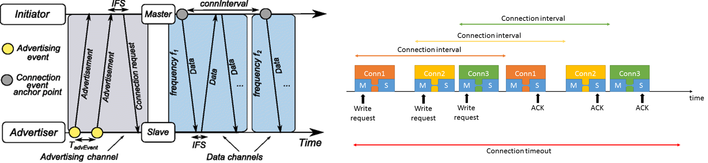

Ogni **piconet** ha due canali fisici: un canale **peer to peer** ad accesso  **probabilistico CSMA** detto  Canale di **Advertisement** ed un canale ad accesso **deterministico TDMA** detto **Canale Dati** regolato da un dispositivo **master**:
- Nel **canale dati**, dedicato alle comunicazioni **unicast**, i tempi sono stabiliti dal master.  Ogni comunicazione occupa slot temporali differenti da quelli di un'altra, e ciascuna con una propria periodicità detta **connInterval** che è un tempo  multiplo di 1.25 ms e sempre compreso tra 7.5ms e 4s.
- Nel **canale di advertising**, dedicato alle comunicazioni **broadcast**, i tempi sono stabiliti dagli advertiser ma questi possono essere in tanti a voler parlare contemporaneamente per cui l’**accesso** è a contesa e, per limitare le collisioni, si inizia a parlare dopo una sorta di backoff semicasuale ```T_advEvent = advInterval + advDelay``` dove advInterval è casuale compreso tra 0 e 10 ms mentre advDelay è un intero multiplo di 0.625 ms compreso tra 20 ms e 10.24 s (periodo di beacon). I devices che **trasmettono** pacchetti di advertising nei canali fisici sono detti **advertisers**. I devices che invece **ricevono** questi pacchetti, senza l'intenzione di aprire una connessione sono detti **scanners**.

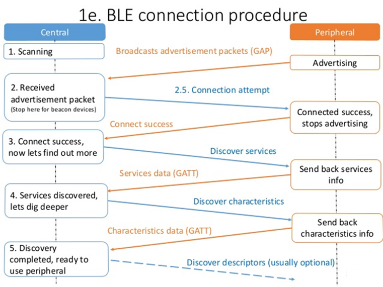

Una **connessione** può essere stabilita solo tra un dispositivo **advertiser** ed un dispositivo **initiator** e questi dispositivi diventeranno rispettivamente **slave** e **master** della piconet e, appena questa è formata, comunicheranno sul canale dati, terminando così l'**Advertising Event** ed iniziando un **Connection Event**.

**Connection Interval**: tempo tra connection events. Stabilisce un appuntamento regolare tra dispositive master e slave. Se non ci sono dati dell'applicazione da inviare o ricevere, i due dispositivi scambiano pacchetti di controllo per mantenere la connessione.
**Slave Latency**: il numero di eventi connection che lo slave può «saltare» cioè nei quali lo slave non è obbligato ad “ascoltare” il master e quindi può restare nello stato standby.
**Supervision Timeout**: tempo massimo tra due pacchetti di dati validi ricevuti prima che una connessione venga considerata "persa".

---

## **API di connessione** 

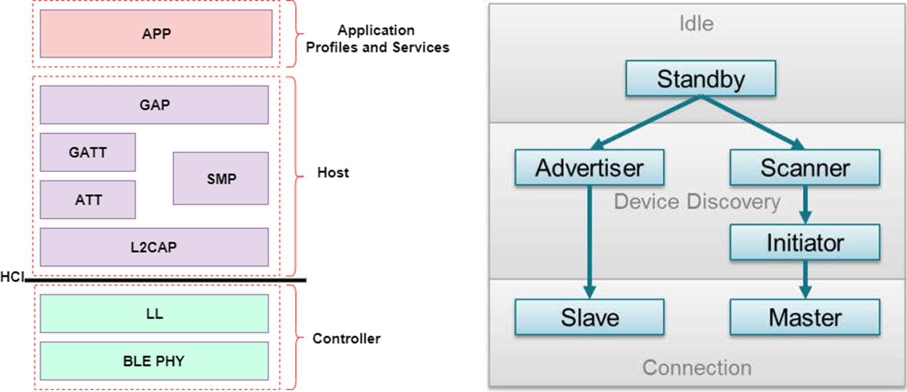

Il **livello GAP** dello stack BLE è il responsabile della funzione di connessione. Questo livello gestisce le modalità e le procedure di accesso del dispositivo, inclusi:
- **procedure di accesso**:
    - rilevamento del dispositivo
    - creazione del collegamento
    - interruzione del collegamento
    - avvio delle funzioni di sicurezza e configurazione del dispositivo
- **Standby**: è lo stato initiale dopo un reset.
- **Advertiser**: il dispositivo fa advetising con dati specifici che consentono a tutti i dispositivi initiator di sapere se è un dispositivo connettibile (contiene l'indirizzo del dispositivo e può contenere alcuni dati aggiuntivi come il nome del dispositivo).
- **Scanner**: quando riceve l’advertisement, il dispositivo scanner invia una scan request. L’advertiser risponde con una scan response. Questo processo si chiama discovery del dispositivo. Il dispositivo scanner è a conoscenza del dispositivo advertiser e può avviare una connessione con esso.
- **Initiator**: all'avvio, deve specificare l’indirizzo del dispositivo peer a cui vuole connettersi. Se viene ricevuto un advertisement corrispondente a quell’indirizzo, il dispositivo invia quindi una richiesta per stabilire una connessione con il dispositivo advertiser definendo i parametri della connessione (Connection Interval, Slave Latency, Supervision Timeout).
- **Slave/Master**: quando viene stabilita una connessione, il dispositivo funziona come uno slave se è l’advertiser, come un master se è l’initiator.

Si può accedere al livello GAP tramite **chiamate dirette** o tramite la API **GAPRole Task**. E’ consigliato utilizzare il metodo **GAPRole Task** anziché le **chiamate dirette** quando possibile.

La **configurazione diretta** del livello GAP descrive le funzioni e i parametri che non sono gestiti o configurati tramite le API GAPRole Task e che pertanto devono essere modificati direttamente tramite il livello GAP. GAPRole Task è un'attività separata che scarica l'applicazione della gestione della maggior parte delle funzionalità del livello GAP. Questa attività è abilitata e configurata dall'applicazione durante l'inizializzazione. Sulla base di questa configurazione, molti eventi dello stack BLE vengono gestiti direttamente dal GAPRole Task e non vengono mai passati all'applicazione. Esistono funzioni di callback che l'applicazione può registrare con l'attività GAPRole in modo che l'attività dell'applicazione possa essere notificata per determinati eventi e procedere di conseguenza.

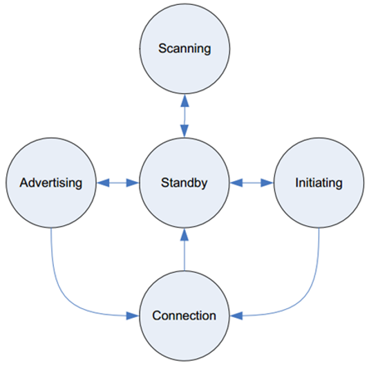

- **Standby** è lo stato di default in cui non ci sono scambi di pacchetti.
- Un dispositivo in stato advertising può avviare una ricerca tramite l’invio di pacchetti che saranno ricevuti da altri dispositivi in stato initiating o scanning. 
    - Dispositivo in stato advertising: è disponibile ad effettuare una connessione e quindi passare allo stato connection prendendo il ruolo di slaves 
    - Dispositivo in stato initiating: passerà allo stato connection con il ruolo di master della piconet.
- Dispositivo in stato **initiating**: passerà allo stato connection con il ruolo di master della piconet. I dispositivi in stato di advertising, scanning e initiating utilizzano i cosiddetti canali advertising per la loro comunicazione mentre i dispositivi in stato connection utilizzano i canali data.
- La possibilità di passare dallo stato di connessione attiva (**connection**) allo stato standby, permette allo slave di risparmiare energia durante gli intervalli di tempo tra una trasmissione e quella successiva. 
Dalla figura si vede che  questo passaggio possa avvenire però solo attraverso gli stati advertising e initiating; cioè la fase di connessione deve essere sempre preceduta da una fase di ricerca.

---

## **Modulazione**

BLE adopera una forma di FDM in cui trasmettitore e ricevitore non usano in una connessione sempre la stessa frequenza ma saltano, ad istanti prefissati, lungo 37 canali secondo uno schema reso noto ad entrambi in fase di setup. Ogni connessione avrà uno schema di salti che, istante per istante, non si sovrappone a quello delle altre connessioni.
In una connessione dati, viene utilizzato un algoritmo di salto di frequenza per scorrere i 37 canali di dati: 

```C++
fn+1=(fn+hop) mod 37
```

Dove fn+1 è la frequenza (canale) da utilizzare al prossimo evento di connessione e hop è un valore che può variare da 5-16 e viene impostato al momento del setup della connessione. Il meccanismo di salto è dinamico e può variare per adattarsi a sopraggiunte condizioni di interferenza con altri dispositivi.

Supponiamo, ad esempio, che un dispositivo BLE si trovi a coesistere con reti Wi-Fi sui canali 1, 6 e 11. Il dispositivo BLE contrassegna i canali 0-8, 11-20 e 24-32 come canali non buoni. 
Ciò significa che mentre i due dispositivi comunicano, rimapperanno i salti in maniera tale da evitare i canali con interferenza [Modulazione FHSS](accessoradio.md#fhss).

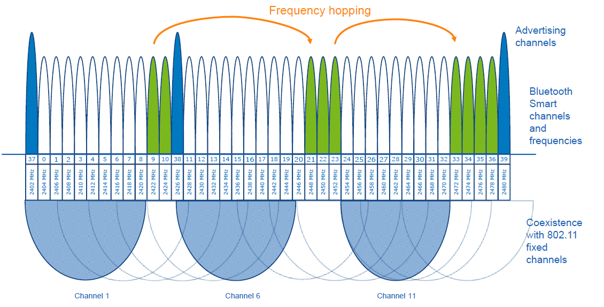

---

### **Pagine correlate:**

- [Dettaglio architettura Ethernet](archeth.md)
- [Dettaglio architettura zigbee](archzigbee.md)
- [Dettaglio architettura WiFi infrastruttura](archwifi.md)
- [Dettaglio architettura WiFi mesh](archmesh.md) 
- [Dettaglio architettura LoraWAN](lorawanclasses.md) 

**Sitografia**:

- (https://amslaurea.unibo.it/6599/1/fantini_enrico_tesi.pdf
- https://delgenio.jimdofree.com/app/download/6302381463/Tesi+F.DelGenio+Definitiva+30-11-2015.pdf?t=1466548571
- https://ieeexplore.ieee.org/stamp/stamp.jsp?tp=&arnumber=8355905
- https://www.silabs.com/documents/public/user-guides/ug103-14-fundamentals-ble.pdf
- https://www.oreilly.com/library/view/getting-started-with/9781491900550/ch01.html
- https://www.comarch.it/iot-ecosystem/asset-tracking/
- https://microchipdeveloper.com/wireless:ble-link-layer-connections
- https://microchipdeveloper.com/wireless:ble-link-layer-connections#toc0
- https://os.mbed.com/blog/entry/BLE-Beacons-URIBeacon-AltBeacons-iBeacon/
- https://nl.mathworks.com/help/comm/examples/modeling-of-ble-devices-with-heart-rate-profile.html
- https://www.google.com/imgres?imgurl=https%3A%2F%2Fwww.researchgate.net%2Fprofile%2FJonathan_Ruiz-de-Garibay%2Fpublication%2F231212227%2Ffigure%2Ftbl1%2FAS%3A669582813581312%401536652391081%2FRFID-vs-NFC-vs-Bluetooth.png&imgrefurl=https%3A%2F%2Fwww.researchgate.net%2Ffigure%2FRFID-vs-NFC-vs-Bluetooth_tbl1_231212227&tbnid=lhIjM06RjY13PM&vet=12ahUKEwiul4etl7zpAhURMuwKHSRcCIgQMygFegUIARDcAQ..i&docid=1LDoXFeY8V2bKM&w=850&h=267&q=ble%20vs%20rfid&safe=active&ved=2ahUKEwiul4etl7zpAhURMuwKHSRcCIgQMygFegUIARDcAQ
- https://www.assetinfinity.com/blog/asset-tracking-technologies
- https://nl.mathworks.com/help/comm/ug/what-is-bluetooth.html
- https://devzone.nordicsemi.com/nordic/short-range-guides/b/bluetooth-low-energy/posts/ble-characteristics-a-beginners-tutorial
- https://stackoverflow.com/questions/23735307/understanding-the-gatt-protocol-in-ble
- http://software-dl.ti.com/lprf/simplelink_cc2640r2_latest/docs/blestack/ble_user_guide/html/ble-stack-3.x/gaprole.html
- https://apagiaro.it/bluetooth-low-energy-presentation/
- http://www.lucadentella.it/2018/02/09/esp32-31-ble-gap/
- https://www.todaysoftmag.com/article/2225/bluetooth-beacon-tracking-it-works-both-ways
- https://github.com/KMuthumala/ESP32-BLE-Beaconing
- https://randomnerdtutorials.com/esp32-ble-server-client/

>[Torna a reti di sensori](sensornetworkshort.md#classificazione-delle-tecnologie-wsn-in-base-a-velocità-e-copertura)
