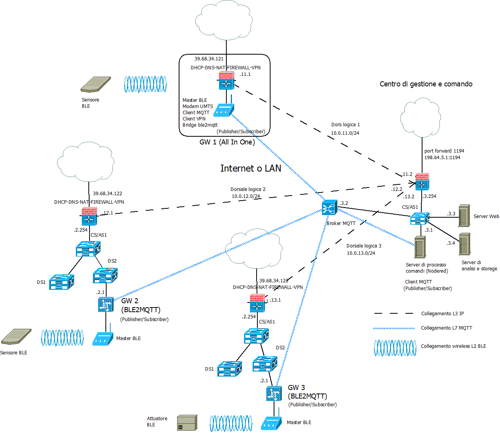
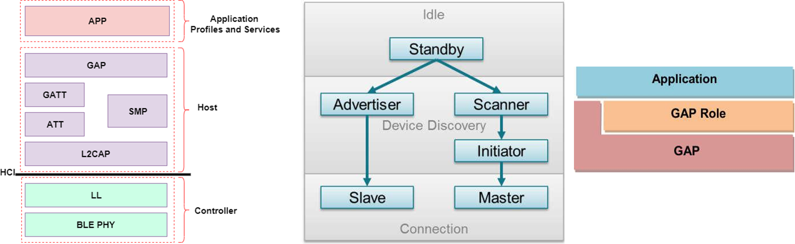

>[Torna a reti di sensori](sensornetworkshort.md#classificazione-delle-tecnologie-wsn-in-base-a-velocità-e-copertura)

Di seguito è riportata l'architettura generale di una rete BLE. Essa è composta, a **livello fisico**, essenzialmente di una **rete di accesso** ai sensori e da una **rete di distribuzione** che fa da collante di ciascuna rete di sensori.


La rete di sensori fisica è a stella dove il centro stella è il gateway. Un sensore può anche essere associato a più gateway ed inviare dati a tutti i gateway a cui esso è associato. I dati normalmente arrivano ad un certo dispositivo attraverso un solo gatew
I gateway utilizzano la rete internet (o una LAN) per realizzare un collegamento diretto **virtuale** con il network server, per cui, in definitiva, la topologia risultante è, **fisicamente**, quella di più **reti di accesso** a stella tenute insieme da una **rete di distribuzione** qualsiasi purchè sia di tipo TCP/IP (LAN o Internet).


### **Gateway standardizzati** 

**Riassumendo**, alla **rete di distribuzione IP** si collegano, quindi, una o più **reti secondarie** che servono da **rete di accesso** per i dispositivi sensori o attuatori con **interfacce** spesso di tipo **non ethernet** che necessitano di un **gateway** di confine con possibili funzioni di:     
  - **Inoltro**, cioè smistamento dei messaggi da un tipo di rete all'altro di tipo L3 (**routing**) o di tipo L2 (**bridging**). L'inoltro del messaggio di un sensore può essere:
       - **diretto** nella rete di distribuzione tramite link fisico verso il dispositivo di smistamento pubblico (router o switch) più vicino.
       - **indiretto** tramite una dorsale virtuale, cioè un **tunnel**, verso il network server o verso un router di una WAN privata, realizzato, ad esempio, in maniera cifrata tramite un **client di VPN**, oppure in maniera non cifrata tramite un client di tunnel generico **GRE**.
  - **Traduzione di formato** dei messaggi da rete a bus a rete ethernet con eventuale realizzazione del **bridge** L4 tra il livello applicativo in uso nella rete di sensori e quello in uso nella rete di distribuzione.
  - **Interrogazione periodica** (polling) dei dispositivi nella rete di sensori (master di una architettura master/slave)
  - **Raccolta e memorizzazione** delle informazioni per essere trasferite in un **secondo momento** al server di gestione
  - **Protezione della rete di sensori**, cioè di firewall, soprattutto quando questa, tramite il gateway, si connette direttamente alla rete **Internet** mediante un **IP pubblico**.

**Ble2mqtt** è un software open-source progettato per permettere ai dispositivi BLE di comunicare direttamente con un server MQTT (Message Queuing Telemetry Transport) senza la necessità di un hub proprietario.  [Ble2mqtt](https://github.com/devbis/ble2mqtt)


BLE è uno standard di comunicazione wireless utilizzato anche per il controllo e l'automazione domestica, mentre MQTT è un protocollo di messaggistica leggero utilizzato per il trasferimento di dati tra dispositivi. Utilizzando BLE2mqtt, gli utenti possono integrare facilmente dispositivi BLE di diversi produttori in un sistema di automazione domestica basato su MQTT, offrendo maggiore flessibilità e controllo.

**Ble2mqtt** opera a livello di **applicazione** della pila OSI in quanto **traduce** un **payload BLE** in un **payload JSON MQTT**  (gateway = router applicativo). Si tratta di un software che consente di integrare dispositivi BLE in un'infrastruttura di domotica basata su MQTT (Message Queuing Telemetry Transport). Ble2mqtt funge da **ponte** tra la rete BLE e il broker MQTT, consentendo agli utenti di interagire con i dispositivi BLE tramite messaggi MQTT.

## **Architetture di gestione dei sensori BLE** 

L'albero degli **apparati attivi** di una rete di sensori + rete di distribuzione + server di gestione e controllo potrebbe apparire:



Il **bridge BLE** (in realtà è un **gateway** e quindi pure un router) è normalmente anche il **master o centrale** della rete di sensori. 

Il **broker MQTT** può essere installato in cloud, in una Virtual Private network, oppure On Premise direttamente nel centro di gestione e controllo. 

## **Architetture basate sull'utilizzo di iBeacon** 

L'iBeacon di Apple è stata la prima tecnologia BLE Beacon a essere pubblicata, quindi la maggior parte dei beacon si ispira al formato dati iBeacon. Gli iBeacon sono abilitati in molti SDK di Apple e possono essere letti e trasmessi da qualsiasi iDevice abilitato per BLE. IBeacon è uno standard proprietario e chiuso. 
I beacon trasmettono quattro informazioni:
- Un UUID che identifica il beacon.
- Un numero maggiore che identifica un sottoinsieme di beacon all'interno di un grande gruppo.
- Un numero minore che identifica un beacon specifico.
- Un livello di potenza TX in complemento di 2, che indica la potenza del segnale a un metro dal dispositivo. Questo numero deve essere calibrato per ciascun dispositivo dall'utente o dal produttore.
  


Un'applicazione di scansione legge l'UUID, il numero maggiore e il numero minore e li usa come riferimento per ottenere informazioni sul beacon da un database; 
il beacon stesso non porta informazioni descrittive, richiede che questo database esterno sia raggiungibile. 
Il campo di potenza TX viene utilizzato con l'intensità del segnale misurata per determinare la distanza del dispositivo beacon dallo smartphone. Si noti che TxPower deve essere calibrato dall'utente per raggiungere una buona precisione.

### **Scopo iBeacon** 
Questo innovativo uso della tecnologia fa principalmente leva su due concetti chiave: 
- **Micro-location**: è noto che uno dei punti di forza dei Beacon che sfruttano Bluetooth LE è la possibilità di una localizzazione a corto raggio precisa e rapida (complementare al GPS):
     - **Posizionamento assoluto**, i GPS forniscono una posizione assoluta in termini di latitudine e longitudine ma ha difficoltà a raccogliere i segnali dei satelliti GPS all’interno degli edifici, soprattutto a più piani. Per questo il sistema di GPS è inadatto per fornire una localizzazione precisa in un raggio di 15-20 metri,
     - **Posizionamento relativo**. La Micro-location lavora semplicemente con la distanza relativa del device dai punti noti dove sono posizionati i Beacon. La geolocalizzazione basata su Ibeacon è ad un alto livello di granularità ed è appunto definita convenzionalmente con il termine «Micro-location».
     - **Possibilità di tracciamento**. Gli iBeacons sono traccianti, quando un device lascia l'area da loro coperta, sono capaci di monitorare la sua posizione nel tempo. Una rete di beacon può tracciare gli spostamenti di persone e manufatti in un intero edificio o sito aziendale.
- **Interaction/Engagement/Context**:
     - I segnali degli iBeacons possono interagire con le Apps, inviando notifiche (sia al sistema che all’utente) e facendo eseguire a queste ultime azioni specifiche in un tempo ed una locazione specifica. 
     - Sostanzialmente, il servizio fornito dai Beacons è quello di fornire un contesto esterno all'applicazione, che può ora conoscere cosa realmente circonda l'utilizzatore del device. Per questo motivo viene aperta la possibilità di far interagire le applicazioni mobile con il mondo fisico circostante senza alcuno sforzo (in maniera trasparente all’utente), in modo che l'utente finale possa davvero percepire il collegamento tra la realtà ed il device che tiene tra le mani. 

Importante sottolineare alcuni **dettagli pratici**: 
- **Trasparenza dell’utente**. Ogni device con una connessione Bluetooth attiva e l'App adeguata reagirà automaticamente ai Beacon circostanti, senza la necessità che l'utente intervenga, per esempio dovendo estrarre lo smartphone dalla tasca. L’attivazione dei beacon dovrebbe essere eseguita da una app che chieda esplicitamente all’utente il consenso a che il dispositivo possa attivare questo o quel servizio alla ricezione di un certo beacon, per evitare attivazioni inconsapevoli pericolose per la privacy.
- **Tracciamento spaziale e temporale**. Il negoziante inoltre potrà monitorare le aree di maggior interesse dei propri clienti ancora prima che questi acquistino qualcosa, in quanto i Beacon possono tracciare ogni spostamento all'interno del negozio, notificando al sistema davanti a quale scaffale i clienti si fermano di più. Inutile sottolineare come questo possa essere un'informazione utilissima in termini di marketing.
- **Interfacce di comando universale**. Gli hardware iBeacon saranno piccoli e sempre più economici: essi potranno inoltre venir programmati non solo per essere degli Advertiser ma anche Scanner, cosìcché un semplice Smartphone, che è a tutti gli effetti un Beacon, possa inviare comandi ai dispositivi installati per esempio in casa, per accendere le luci od elettrodomestici a distanza. 
- **Struttura autonoma**. Un altro punto fondamentale è che non è mai richiesta una connessione ad Internet: anche se poter accedere a risorse su cloud tramite la rete potrebbe ampliare ancora di più il range di attività possibili con BLE.

**In definitiva**, gli iBeacon utilizzano Bluetooth Low Energy per creare un'infrastruttura smart, orientata alla localizzazione, che i dispositivi mobile possono utilizzare per ricavare informazioni contestuali basate sull'ambiente stesso in cui si muovono, in tempo reale. 

Le applicazioni possono ora sapere esattamente dove si trovano e cosa le circonda, aprendo la strada ad un nuovo livello di interazione col mondo, senza bisogno di una connessione ad Internet.


### **Schema di cablagggio a beacon fisso** 

È l’approccio più comune. I beacon sono posizionati in posizioni fisse e note, rispetto a una mappa interna.  

I dispositivi mobili abilitati Bluetooth riconoscono questi beacon quando si trovano nel raggio della portata e determinano la posizione assoluta (latitudine e longitudine) del dispositivo sulla mappa, stimata la misura della distanza (usando l'intensità del segnale dei beacon) e nota la conoscenza delle posizioni assolute dei beacon.

I dati di tracciamento che possono essere raccolti da ciascun dispositivo mobile possono quindi essere inviati, via wifi o modem UMTS, a un sistema centralizzato a scopo analitico e ad altri servizi come la mappatura delle presenze in tempo reale.


Esempio: tour digitale in un museo, in cui ogni stanza o attrazione potrebbe avere un beacon fisso che emette un tag BLE specifico. Se una persona sceglie di installare l'app mobile del museo, il suo telefono, ogni qualvolta cammina vicino a un beacon, legge il tag e le informazioni pertinenti e mirate sull'esposizione potrebbero essere recuperate da ciascun dispositivo tramite il tag, consentendo un'esperienza più istruttiva e coinvolgente per i visitatori.

**Esempio ambulatorio.**


**Esempio shopping.**


**Esempio ospedale.**


### **Schema di cablagggio a scanner fisso** 

È un’approccio sempre più diffuso. Questi "ascoltatori" fissi raccolgono tutti i beacon Bluetooth nella loro portata e trasmettono le informazioni raccolte a un sistema centralizzato per l'analisi.

Il sistema centrale applicherà alcuni filtri di segnale e, in base alla posizione degli ascoltatori fissi che è stata programmata nel sistema, determina la posizione dei beacon
Utilizzando questo approccio, invece di tracciare un dispositivo mobile, si ottiene il tracciamento dei singoli beacon, che consente una serie di casi d'uso nuovi e innovativi:


Esempi:
- **Tracciamento** di risorse in una **fabbrica** (materie prime o prodotti) identificate da un tag univoco (trasponder):
beacon collegati alle risorse (tag) e  listener installati lungo la linea di produzione (forniscono la posizione).
dati di tracciamento in tempo reale non solo rispetto la posizione ma anche a quantità di tempo, ad esempio, il tempo in cui alcuni pezzi rimangono in un reparto di una fabbrica.
- **Tracciamento** partecipanti di una **fiera** a cui sono stati dati dei piccoli beacon BLE grandi come una moneta da portare con sé, che possono interagire con gli "ascoltatori" BLE posizionati presso gli stand dimostrativi e nelle sale riunioni dell'evento. A seconda dell'occasione, del caso d'uso e dell'obiettivo aziendale, tale sistema è in grado di raccogliere:
solo metriche anonime quali numero presenze e analisi degli eventi in tempo reale : potrebbe anche essere utile ai partecipanti (i gestori di beacon) che, una volta in prossimità di un evento, potrebbero tramite un'app interrogare il sistema centrale per prenotare i posti e accodarsi in tempo reale senza mettersi fisicamente in fila.
con l’esplicito accordo degli utenti, e solo nei limiti di dove sono stati collocati gli "ascoltatori", tracciare la posizione in tempo reale di specifiche persone.

**Esempio tracking assets industriali.**


### **Rete di sensori BLE** 


E’ una architettura a stella gerarchica (albero). E’ realizzata da un solo dispositivo master. Un master può essere contemporaneamente pure slave di un’altra piconet.

## **Topologie di connessione**

### **Beacon**

I beacon sono delle **sequenze di sincronizzazione** (dette preambolo) in grado sia di sincronizzare gli **orologi** dei dispositivi (Tx e Rx) che si accingono ad iniziare una comunicazione, ma anche di **indentificare** in maniera univoca i dispositivi che li emettono. Per dei dettagli vedi [preambolo di sincronizzazione](protocolli.md#preambolo-di-sincronizzazione).

La trama dati compresa tra due beacon consecutivi viene detta **supertrama** (superframe) ed è generalmente divisa in due zone con **politiche di accesso** al canale diverse:  
- una **deterministica** al riparo dalle collisioni detta **CFP** (Contention Free Period) e regolata dalla multiplazione statica TDMA, che viene usata per trasmettere i dati delle comunicazioni **unicast**.
- una **probabilistica** a contesa, in cui i tentativi di accesso dei dispositivi sono soggetti al **rischio di collisione** perchè regolata da un protocollo di tipo **CSMA/CA**, che invece serve per trasmettere delle particolari informazioni **broadcast** dette **advertisement**.

Nel contesto di BLE, un **centrale** può assumere un ruolo di **coordinamento**, simile a quello svolto dal PCF in una rete Wi-Fi, gestendo l'accesso al canale in modo master/slave in cui il centrale ha il ruolo di **master** che stabilisce **quale** stazione deve parlare, **quando** e **per quanto** tempo usando una politica di **turnazione** delle stazioni (**polling**).

Tutti i **dispositivi BLE** emettono beacon per cui il nome di beacon alla fine è finito per identificare anche un **generico dispositivo BLE**.

Le **superframe BLE** sono divise principalmente in tre zone:

- **Advertising Zone** (Zona di pubblicità): In questa zona, i dispositivi BLE trasmettono pacchetti di advertising per annunciare la propria presenza e offrire servizi ai dispositivi circostanti. Questa zona è utilizzata per l'inizializzazione delle connessioni e per il broadcasting di informazioni.

- **Connection Establishment Zone** (Zona di stabilità della connessione): Quando un dispositivo BLE desidera stabilire una connessione con un altro dispositivo, utilizza questa zona per scambiare pacchetti di connessione. Una volta stabilita la connessione, si passa alla terza zona.

- **Connection Events Zone** (Zona degli eventi di connessione): In questa zona avvengono gli eventi di trasmissione e ricezione di dati tra i **dispositivi connessi**. La struttura temporale di questa zona può variare in base alle necessità di trasmissione dei dati e al risparmio energetico.

Queste zone sono organizzate in un ciclo temporale che si ripete periodicamente per consentire la comunicazione tra i dispositivi BLE in modo efficiente e sincronizzato.

### **Topologia broadcast**

Il **beacon non collegabile** è un dispositivo Bluetooth (broadcaster) a bassa energia in modalità di trasmissione. Trasmette semplicemente informazioni **statiche** archiviate internamente senza ricevere alcunchè da un eventuale observer. Dato che la trasmissione è non connettibile non attiva alcuna risorsa HW di ricezione per cui ha il minor consumo energetico possibile. Il dispositivo deve semplicemente svegliarsi, trasmettere (pochi) dati e tornare a dormire (radiofaro).  Ciò comporta l'inconveniente che gli unici dati **dinamici** sono limitati a ciò che è noto al dispositivo o a ciò che è disponibile tramite altri canali di cui è dotato il dispositivo quali interfacce seriali RS232 (UART), periferiche 4-wire (SPI), bus seriale universale (USB) e così via:
- **Broadcaster**: Invia periodicamente pacchetti di advertise non connettibili a chiunque sia disposto a riceverli. 
- **Osservatore**: Esegue ripetutamente la scansione delle frequenze predefinite per ricevere eventuali pacchetti di advertisement non connettibili attualmente trasmessi (scanning passivo).


I pacchetti di **advertisement** sono periodici e sono messaggi di beacon trasmessi in broadcast da dispositivi broadcaster detti, per l’appunto, essi stessi beacon. Da questi l’osservatore ricava informazioni minimali (tag). A partire dalla versione 4.1 della specifica, sono possibili tutte le seguenti condizioni:
- Un dispositivo può fungere contemporaneamente da centrale e da periferica.
- Una centrale può essere connessa a più periferiche. Una periferica può essere connessa a più dispositivi centrali.

### **Topologia connessa**
Il **beacon collegabile** (o periferica) è un dispositivo Bluetooth a bassa energia in **modalità periferica**, il che significa che può non solo trasmettere, ma anche ricevere e quindi potrebbe anche essere interrogato periodicamente per effettuare, ad esempio il polling, di alcuni sensori.  Ciò consente a un dispositivo centrale (ad esempio uno smartphone) di connettersi e interagire con i **servizi** implementati sul dispositivo beacon. I servizi forniscono una o più caratteristiche che potrebbero essere modificate da un dispositivo peer. Un esempio di queste caratteristiche potrebbe essere la stringa di dati che rappresenta le informazioni trasmesse dal beacon. In questo modo è possibile avere un **beacon configurabile** che può essere facilmente aggiornato via etere proprio attraverso il bluetooth:
- **Dispositivo master o centrale**: Esegue periodicamente la scansione delle frequenze predefinite alla ricerca di pacchetti pubblicitari connettibili e, se ne trova uno adatto, avvia una connessione (scanning attivo). Una volta stabilita la connessione, il dispositivo centrale gestisce i tempi e avvia gli scambi periodici di dati, diventa, cioè, il master della comunicazione.
- **Dispositivo slave o periferica**: un dispositivo che invia periodicamente pacchetti pubblicitari (advertisement beacon) connettibili in broadcast e accetta connessioni in entrata. Una volta iniziata una connessione, la periferica segue i tempi del master centrale e scambia regolarmente dati con esso, quindi, dopo la connessione, assume il ruolo di slave della comunicazione.


La differenza tra la scansione dei beacon effettuata da un dispositivo centrale e quella effettuata da un semplice observer sta nel fatto che la prima è una ricerca che è abilitata ad instaurare una connessione bidirezionale con i dispositivi beacon periferici, mentre la seconda è una scansione che permette l’attivazione di connessioni di sola ricezione. 

### **Topologia mista**

Stanno iniziando a comparire dispositivi dual-mode e single-mode più avanzati, dispositivi in ​​grado di combinare più ruoli contemporaneamente. Ciò consente loro di partecipare a più connessioni contemporaneamente, mentre usano gli advertisement per trasmettere informazioni in broadcast.


## **Protocolli di accesso al canale**

La situazione può essere riassunta nel seguente modo:


Ogni **piconet** ha due canali fisici: un canale **peer to peer** ad accesso  **probabilistico CSMA** detto  Canale di **Advertisement** ed un canale ad accesso **deterministico TDMA** detto **Canale Dati** regolato da un dispositivo **master**:
- Nel **canale dati**, dedicato alle comunicazioni **unicast**, i tempi sono stabiliti dal master.  Ogni comunicazione occupa slot temporali differenti da quelli di un'altra, e ciascuna con una propria periodicità detta **connInterval** che è un tempo  multiplo di 1.25 ms e sempre compreso tra 7.5ms e 4s.
- Nel **canale di advertising**, dedicato alle comunicazioni **broadcast**, i tempi sono stabiliti dagli advertiser ma questi possono essere in tanti a voler parlare contemporaneamente per cui l’**accesso** è a contesa e, per limitare le collisioni, si inizia a parlare dopo una sorta di backoff semicasuale ```T_advEvent = advInterval + advDelay``` dove advInterval è casuale compreso tra 0 e 10 ms mentre advDelay è un intero multiplo di 0.625 ms compreso tra 20 ms e 10.24 s (periodo di beacon). I devices che **trasmettono** pacchetti di advertising nei canali fisici sono detti **advertisers**. I devices che invece **ricevono** questi pacchetti, senza l'intenzione di aprire una connessione sono detti **scanners**.


Una **connessione** può essere stabilita solo tra un dispositivo **advertiser** ed un dispositivo **initiator** e questi dispositivi diventeranno rispettivamente **slave** e **master** della piconet e, appena questa è formata, comunicheranno sul canale dati, terminando così l'**Advertising Event** ed iniziando un **Connection Event**.

**Connection Interval**: tempo tra connection events. Stabilisce un appuntamento regolare tra dispositive master e slave. Se non ci sono dati dell'applicazione da inviare o ricevere, i due dispositivi scambiano pacchetti di controllo per mantenere la connessione.
**Slave Latency**: il numero di eventi connection che lo slave può «saltare» cioè nei quali lo slave non è obbligato ad “ascoltare” il master e quindi può restare nello stato standby.
**Supervision Timeout**: tempo massimo tra due pacchetti di dati validi ricevuti prima che una connessione venga considerata "persa".


## **Messaggi MQTT**

### **Messaggi confermati**

La **conferma** dei messaggi inviati da parte del ricevente normalmente non è necessaria nel caso dei **sensori**. Infatti, se un invio da parte di un sensore non andasse a buon fine, è inutile richiedere la ritrasmissione di un dato che comunque a breve arriva con una misura più aggiornata. 

La conferma, invece, è prevista per funzioni di **comando** o **configurazione**.  Ad esempio  nel caso di pulsanti, rilevatori di transito o allarmi in cui l'invio del messaggiò avviene sporadicamente e in maniera del tutto **asincrona** (cioè non prevedibile dal ricevitore), potrebbe essere auspicabile avere un feedback da parte del protocollo mediante un meccanismo di conferma basato su **ack**. Ma non sempre ciò è possibile.

La **conferma**, però, potrebbe pure essere gestita soltanto dal **livello applicativo** (non dal protocollo) utilizzando un **topic di feeedback** (o stato) per inviare il valore dello stato corrente subito dopo che questo viene interessato da un comando in ingresso sul dispositivo. 

### **Definizione di topic e payload**

Sovente, nella rete di distribuzione IP è presente un server col ruolo di **broker MQTT** a cui sono associati:
- su un **topic di misura o attuazione (comando)**:
    - il dispositivo **sensore** è registrato sul broker col ruolo di **publisher** perchè vuole usare questo canale di output per **inviare il comando** verso l'attuatore 
    - il dispositivo **attuatore** è registrato sul broker con il ruolo di **subscriber** perchè è interessato a ricevere, su un canale di input, eventuali comandi di attuazione (motori, cancelli). 
-  su un **topic di feedback (stato)** (dal dispositivo terminale, verso il broker), utile al server applicativo per ricevere la conferma dell'avvenuto cambio di stato dell'attuatore ma anche utile all'utente per conoscere il nuovo stato:
    - il dispositivo **attuatore** è registrato sul broker con il ruolo di **publisher** perchè intende adoperare questo canale di output per **inviare il feedback** con il proprio stato ad un **display** associato al sensore di comando.
    - il dispositivo **sensore**, ma meglio dire il dispositivo **display** associato al dispositivo sensore (un led o uno schermo), è registrato sul broker con il ruolo di **subscriber** perchè è interessato a ricevere, su un canale di input, eventuali  **feedback** sullo stato dell'attuatore per **mostrarli** all'utente. In questo caso è demandato all'utente, e non al protocollo, **decidere** se e quante volte ripetere il comando, nel caso che lo stato del dispositivo non sia ancora quello voluto.
-  su un **topic di configurazione** dove può pubblicare solamente il server applicativo mentre tutti gli altri dispositivi IoT sono dei subscriber:
    - sia i dispositivi **sensori** che i dispositivi **attuatori** si registrano sul broker con il ruolo di **subscriber** perchè intendono adoperare questo canale di **input** per ricevere **comandi di configurazione** quali, per esempio, attivazione/disattivazione, frequenza di una misura, durata dello stand by, aggiornamenti del firmware via wirelesss (modo OTA), ecc.
    - il **server applicativo** è responsabile della definizione delle impostazioni di configurazione e decide **quali** mandare e a **chi**.

**In realtà**, il topic di configurazione, pur essendo teoricamente appropriato, potrebbe anche essere incorporato nel topic di comando, magari prevedendo un livello più alto di autorizzazione rispetto ai comandi relativi alle funzioni ordinarie.

Il **canale applicativo** su cui vengono inviati i messaggi sono quindi i **topic**. Su un certo **topic** il dispositivo con il ruolo di **output** agisce come un **publisher**, mentre quello con il ruolo di **input** agisce come un **subscriber**.

l'**ID MQTT** è un identificativo che permette di individuare un dispositivo ma non è un indirizzo di livello 3, non individua la macchina host in base al suo IP, piuttosto è un indirizzo di livello applicativo noto solo ad un server centrale, cioè il broker. Un dispositivo IoT non è tenuto a conoscere l'IP di tutti gli altri dispositivi ma solamente quello del broker. Il broker soltanto sa gli indirizzi di tutti i dispositivi, conoscenza che acquisisce durante la fase di **connessione** di un client al broker, momento in cui avviene anche il recupero del'**socket remoto** del client.

Il **broker**, dal canto suo, **associa** ogni **topic** con tutti gli **ID** che sono registrati presso di esso come **subscriber**. Questa associazione è utilizzata per smistare tutti i messaggi che arrivano con un certo topic verso tutti gli ID che ad esso sono associati. Il topic diventa così un **indirizzo di gruppo**. La particolarità di questo indirizzo è che è **gerarchico** secondo una struttura ad **albero**, cioè gruppi di dispositivi possono essere suddivisi in **sottogruppi** più piccoli estendendo il nome del path con un **ulteriore prefisso**, diverso per ciascun sottogruppo. L'operazione può essere ripetuta ulteriormente in maniera **ricorsiva**.

**Ad esempio**, posso individuare le lampade della casa con il path ```luci``` e accenderle e spegnerle tutte insieme, ma posso sezionarle ulteriormente con il path ```luci/soggiorno``` con il quale accendere o spegnere solo quelle del soggiorno oppure con il path ```luci/soggiorno/piantane``` con il quale fare la stessa cosa ma solo con le piantane del soggiorno.

### **Gestione dei topic di comando**

Potremmo a questo punto inserire il comando delle luci nel topic più generale delle misure ed attuazioni che chiameremo ```comandi``` e registrare i pulsanti del soggiorno al topic ```luci/soggiorno/comandi``` come pubblisher, mentre potremmo registrare le attuazioni delle lampade allo stesso topic come subscriber. Il comando potrebbe essere il JSON  ```{"toggle":"true"}```, per cui alla fine tutto intero il path diventerebbe ```luci/soggiorno/comandi/{"toggle":"true"}```. Se volessimo selezionare un solo dispositivo sono possibili due strade alternative:
- inserire il **prefisso mqtt** del dispositivo direttamente **nel path** ```luci/soggiorno/comandi/mydevice1-98F4ABF298AD/{"toggle":"true"}```
- inserire un **id** del dispositivo **nel JSON** ```luci/soggiorno/comandi/{"deviceid":"01", "toggle":"true"}```, dove con ```01``` ci indica un indirizzo univoco solamente all'interno del sottogruppo ```luci/soggiorno```. Con questa soluzione il dispositivo deve saper gestire un secondo livello di indirizzi indipendente dal meccanismo del path dei topic.

### **Gestione dei topic di stato**

Questo canale viene utilizzato per inviare lo **stato** di un dispositivo a tutti coloro che ne sono interessati. L'interesse potrebbe nascere per più motivi:
- **Conferma** dell'avvenuta **attuazione**. Alla **ricezione** di un comando (ad esempio "on":"true"), l'**attuatore** potrebbe essere tenuto a **notificare** (in modalità PUSH), al **display** associato al sensore (o al **server di processo**) trasmittente, il proprio **stato attuale**, in modo che l'**utente** (o il server di processo) possa verificare l'effettiva **efficacia** dell'ultimo comando di attuazione.
- **Sincronizzazione PULL** del **server di processo**. Il server di processo potrebbe **prelevare** sul topic di stato, tramite un **comando di richiesta** inviato al dispositivo terminale sul topic comandi, lo **stato** degli attuatori per aggiornare un pannello generale di comando o eseguire delle statistiche o per recuperare gli input di un algoritmo che deve eseguire.
- **Sincronizzazione PULL** di un **pannello di controllo**. Un **quadro di controllo web** potrebbe **prelevare** sul topic di stato, tramite un **comando di richiesta** inviato al dispositivo terminale sul topic comandi, lo **stato** degli attuatori:
    -  una **sola volta**, all'inizio, quando la pagina è stata **caricata/ricaricata** dall'utente
    -  **periodicamente**, per essere certi di avere sempre lo **stato più aggiornato**, anche a fronte di una eventuale **disconnessione** di rete che abbia impedito la registrazione dell'ultimo feedback da parte dell'attuatore.
- **Sincronizzazione PUSH**. Lo stesso attuatore potrebbe prendere l'iniziativa di **spedire periodicamente** il proprio stato a tutti coloro che ne sono interessati (server di processo o tutti i display web che lo comandano), senza che nessuno invii richieste esplicite sul topic di comando. E' un'**alternativa PUSH** alla sincronizzazione PULL periodica.
### **Gestione dei topic di configurazione**

Questo canale viene utilizzato per inviare **comandi di configurazione** al dispositivo da parte del server di processo. L'interesse potrebbe nascere per più motivi:
- effettuare un aggiornamento del FW di bordo via wireless.
- impostare qualche caratteristica nella definizione delle sue funzioni come, ad esempio, comportarsi come un apricancello o come comando per luci.
- impostare la frequenza di una misura, o l'intervallo di scatto di un allarme, ecc.
- cambiare la sintassi dei JSON di payload o quella di un path MQTT

Un esempio di **canale MQTT di stato** per, ad esempio, impostare il periodo di pubblicazione automatica dello stato potrebbe essere: 
- nel caso di **identificazione univoca** del dispositivo via  **path MQTT**: ```luci/soggiorno/config/mydevice1-98F4ABF298AD/{"stateperiod":"3000"}```
- nel caso di **identificazione univoca** del dispositivo nel **payload JSON**: ```luci/soggiorno/config/{"deviceid":"01", "stateperiod":"3000"}```

## **API di connessione** 



Il **livello GAP** dello stack BLE è il responsabile della funzione di connessione. Questo livello gestisce le modalità e le procedure di accesso del dispositivo, inclusi:
- **procedure di accesso**:
    - rilevamento del dispositivo
    - creazione del collegamento
    - interruzione del collegamento
    - avvio delle funzioni di sicurezza e configurazione del dispositivo
- **Standby**: è lo stato initiale dopo un reset.
- **Advertiser**: il dispositivo fa advetising con dati specifici che consentono a tutti i dispositivi initiator di sapere se è un dispositivo connettibile (contiene l'indirizzo del dispositivo e può contenere alcuni dati aggiuntivi come il nome del dispositivo).
- **Scanner**: quando riceve l’advertisement, il dispositivo scanner invia una scan request. L’advertiser risponde con una scan response. Questo processo si chiama discovery del dispositivo. Il dispositivo scanner è a conoscenza del dispositivo advertiser e può avviare una connessione con esso.
- **Initiator**: all'avvio, deve specificare l’indirizzo del dispositivo peer a cui vuole connettersi. Se viene ricevuto un advertisement corrispondente a quell’indirizzo, il dispositivo invia quindi una richiesta per stabilire una connessione con il dispositivo advertiser definendo i parametri della connessione (Connection Interval, Slave Latency, Supervision Timeout).
- **Slave/Master**: quando viene stabilita una connessione, il dispositivo funziona come uno slave se è l’advertiser, come un master se è l’initiator.

Si può accedere al livello GAP tramite **chiamate dirette** o tramite la API **GAPRole Task**. E’ consigliato utilizzare il metodo **GAPRole Task** anziché le **chiamate dirette** quando possibile.

La **configurazione diretta** del livello GAP descrive le funzioni e i parametri che non sono gestiti o configurati tramite le API GAPRole Task e che pertanto devono essere modificati direttamente tramite il livello GAP. GAPRole Task è un'attività separata che scarica l'applicazione della gestione della maggior parte delle funzionalità del livello GAP. Questa attività è abilitata e configurata dall'applicazione durante l'inizializzazione. Sulla base di questa configurazione, molti eventi dello stack BLE vengono gestiti direttamente dal GAPRole Task e non vengono mai passati all'applicazione. Esistono funzioni di callback che l'applicazione può registrare con l'attività GAPRole in modo che l'attività dell'applicazione possa essere notificata per determinati eventi e procedere di conseguenza.


- **Standby** è lo stato di default in cui non ci sono scambi di pacchetti.
- Un dispositivo in stato advertising può avviare una ricerca tramite l’invio di pacchetti che saranno ricevuti da altri dispositivi in stato initiating o scanning. 
    - Dispositivo in stato advertising: è disponibile ad effettuare una connessione e quindi passare allo stato connection prendendo il ruolo di slaves 
    - Dispositivo in stato initiating: passerà allo stato connection con il ruolo di master della piconet.
- Dispositivo in stato **initiating**: passerà allo stato connection con il ruolo di master della piconet. I dispositivi in stato di advertising, scanning e initiating utilizzano i cosiddetti canali advertising per la loro comunicazione mentre i dispositivi in stato connection utilizzano i canali data.
- La possibilità di passare dallo stato di connessione attiva (**connection**) allo stato standby, permette allo slave di risparmiare energia durante gli intervalli di tempo tra una trasmissione e quella successiva. 
Dalla figura si vede che  questo passaggio possa avvenire però solo attraverso gli stati advertising e initiating; cioè la fase di connessione deve essere sempre preceduta da una fase di ricerca.

## **Modulazione**

BLE adopera una forma di FDM in cui trasmettitore e ricevitore non usano in una connessione sempre la stessa frequenza ma saltano, ad istanti prefissati, lungo 37 canali secondo uno schema reso noto ad entrambi in fase di setup. Ogni connessione avrà uno schema di salti che, istante per istante, non si sovrappone a quello delle altre connessioni.
In una connessione dati, viene utilizzato un algoritmo di salto di frequenza per scorrere i 37 canali di dati: 

```C++
fn+1=(fn+hop) mod 37
```

Dove fn+1 è la frequenza (canale) da utilizzare al prossimo evento di connessione e hop è un valore che può variare da 5-16 e viene impostato al momento del setup della connessione. Il meccanismo di salto è dinamico e può variare per adattarsi a sopraggiunte condizioni di interferenza con altri dispositivi.

Supponiamo, ad esempio, che un dispositivo BLE si trovi a coesistere con reti Wi-Fi sui canali 1, 6 e 11. Il dispositivo BLE contrassegna i canali 0-8, 11-20 e 24-32 come canali non buoni. 
Ciò significa che mentre i due dispositivi comunicano, rimapperanno i salti in maniera tale da evitare i canali con interferenza [Link FHSS](accessoradio.md#fhss).


**Sitografia**:

- (https://amslaurea.unibo.it/6599/1/fantini_enrico_tesi.pdf
- https://delgenio.jimdofree.com/app/download/6302381463/Tesi+F.DelGenio+Definitiva+30-11-2015.pdf?t=1466548571
- https://ieeexplore.ieee.org/stamp/stamp.jsp?tp=&arnumber=8355905
- https://www.silabs.com/documents/public/user-guides/ug103-14-fundamentals-ble.pdf
- https://www.oreilly.com/library/view/getting-started-with/9781491900550/ch01.html
- https://www.comarch.it/iot-ecosystem/asset-tracking/
- https://microchipdeveloper.com/wireless:ble-link-layer-connections
- https://microchipdeveloper.com/wireless:ble-link-layer-connections#toc0
- https://os.mbed.com/blog/entry/BLE-Beacons-URIBeacon-AltBeacons-iBeacon/
- https://nl.mathworks.com/help/comm/examples/modeling-of-ble-devices-with-heart-rate-profile.html
- https://www.google.com/imgres?imgurl=https%3A%2F%2Fwww.researchgate.net%2Fprofile%2FJonathan_Ruiz-de-Garibay%2Fpublication%2F231212227%2Ffigure%2Ftbl1%2FAS%3A669582813581312%401536652391081%2FRFID-vs-NFC-vs-Bluetooth.png&imgrefurl=https%3A%2F%2Fwww.researchgate.net%2Ffigure%2FRFID-vs-NFC-vs-Bluetooth_tbl1_231212227&tbnid=lhIjM06RjY13PM&vet=12ahUKEwiul4etl7zpAhURMuwKHSRcCIgQMygFegUIARDcAQ..i&docid=1LDoXFeY8V2bKM&w=850&h=267&q=ble%20vs%20rfid&safe=active&ved=2ahUKEwiul4etl7zpAhURMuwKHSRcCIgQMygFegUIARDcAQ
- https://www.assetinfinity.com/blog/asset-tracking-technologies
- https://nl.mathworks.com/help/comm/ug/what-is-bluetooth.html
- https://devzone.nordicsemi.com/nordic/short-range-guides/b/bluetooth-low-energy/posts/ble-characteristics-a-beginners-tutorial
- https://stackoverflow.com/questions/23735307/understanding-the-gatt-protocol-in-ble
- http://software-dl.ti.com/lprf/simplelink_cc2640r2_latest/docs/blestack/ble_user_guide/html/ble-stack-3.x/gaprole.html
- https://apagiaro.it/bluetooth-low-energy-presentation/
- http://www.lucadentella.it/2018/02/09/esp32-31-ble-gap/
- https://www.todaysoftmag.com/article/2225/bluetooth-beacon-tracking-it-works-both-ways

>[Torna a reti di sensori](sensornetworkshort.md#classificazione-delle-tecnologie-wsn-in-base-a-velocità-e-copertura)
