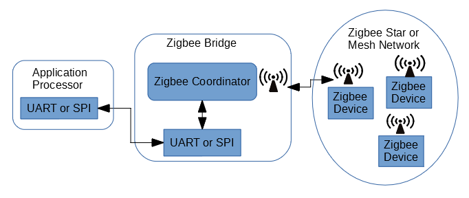
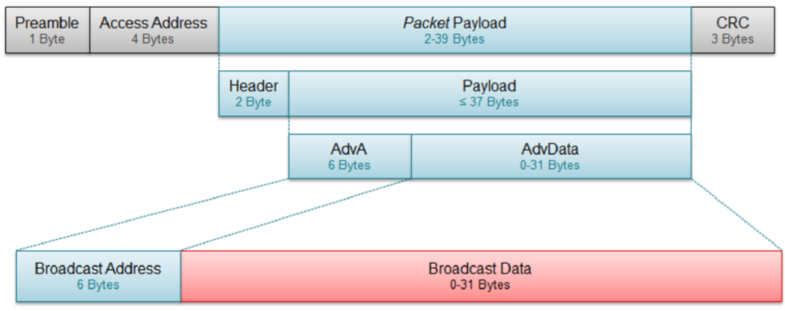
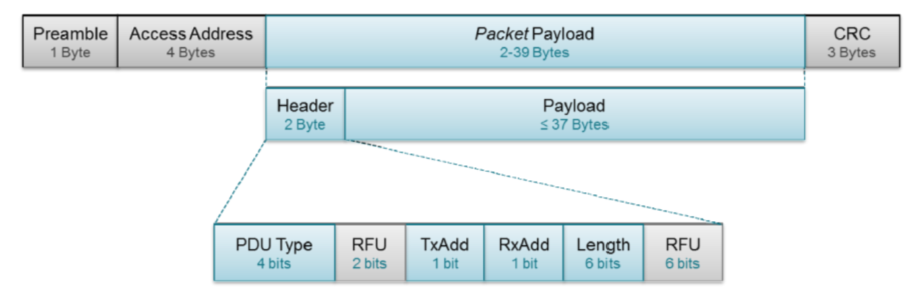

>[Torna a reti di sensori](sensornetworkshort.md#classificazione-delle-tecnologie-wsn-in-base-a-velocità-e-copertura)

Di seguito è riportata l'architettura generale di una rete Zigbee. Essa è composta, a **livello fisico**, essenzialmente di una **rete di accesso** ai sensori e da una **rete di distribuzione** che fa da collante di ciascuna rete di sensori.


La rete di sensori fisica è a stella dove il centro stella è il gateway. Un sensore può anche essere associato a più gateway ed inviare dati a tutti i gateway a cui esso è associato. I dati normalmente arrivano ad un certo dispositivo attraverso un solo gateway.

I gateway utilizzano la rete internet (o una LAN) per realizzare un collegamento diretto **virtuale** con il network server, per cui, in definitiva, la topologia risultante è, **fisicamente**, quella di più **reti di accesso** a stella tenute insieme da una **rete di distribuzione** qualsiasi purchè sia di tipo TCP/IP (LAN o Internet).

### **Gateway standardizzati** 

**Riassumendo**, alla **rete di distribuzione IP** si collegano, quindi, una o più **reti secondarie** che servono da **rete di accesso** per i dispositivi sensori o attuatori con **interfacce** spesso di tipo **non ethernet** che necessitano di un **gateway** di confine con possibili funzioni di:     
  - **Inoltro**, cioè smistamento dei messaggi da un tipo di rete all'altro di tipo L3 (**routing**) o di tipo L2 (**bridging**). L'inoltro del messaggio di un sensore può essere:
       - **diretto** nella rete di distribuzione tramite link fisico verso il dispositivo di smistamento pubblico (router o switch) più vicino.
       - **indiretto** tramite una dorsale virtuale, cioè un **tunnel**, verso il network server o verso un router di una WAN privata, realizzato, ad esempio, in maniera cifrata tramite un **client di VPN**, oppure in maniera non cifrata tramite un client di tunnel generico **GRE**.
  - **Traduzione di formato** dei messaggi da rete a bus a rete ethernet con eventuale realizzazione del **bridge** L4 tra il livello applicativo in uso nella rete di sensori e quello in uso nella rete di distribuzione.
  - **Interrogazione periodica** (polling) dei dispositivi nella rete di sensori (master di una architettura master/slave)
  - **Raccolta e memorizzazione** delle informazioni per essere trasferite in un **secondo momento** al server di gestione
  - **Protezione della rete di sensori**, cioè di firewall, soprattutto quando questa, tramite il gateway, si connette direttamente alla rete **Internet** mediante un **IP pubblico**.

**Zigbee2mqtt** è un software open-source progettato per permettere ai dispositivi Zigbee di comunicare direttamente con un server MQTT (Message Queuing Telemetry Transport) senza la necessità di un hub proprietario. 


Zigbee è uno standard di comunicazione wireless utilizzato per il controllo e l'automazione domestica, mentre MQTT è un protocollo di messaggistica leggero utilizzato per il trasferimento di dati tra dispositivi. Utilizzando Zigbee2mqtt, gli utenti possono integrare facilmente dispositivi Zigbee di diversi produttori in un sistema di automazione domestica basato su MQTT, offrendo maggiore flessibilità e controllo.


**Zigbee2mqtt** opera a livello di **applicazione** della pila OSI in quanto **traduce** un **payload zigbee** in un **payload JSON MQTT**  (gateway = router applicativo). Si tratta di un software che consente di integrare dispositivi Zigbee in un'infrastruttura di domotica basata su MQTT (Message Queuing Telemetry Transport). Zigbee2mqtt funge da **ponte** tra la rete Zigbee e il broker MQTT, consentendo agli utenti di interagire con i dispositivi Zigbee tramite messaggi MQTT.

L'albero degli **apparati attivi** di una rete di sensori + rete di distribuzione + server di gestione e controllo potrebbe apparire:


Il **bridge zigbee** (in realtà è un **gateway** e quindi pure un router) è normalmente anche il **coordinatore** della rete di sensori. 

Il **broker MQTT** può essere installato in cloud, in una Virtual Private network, oppure On Premise direttamente nel centro di getione e controllo. 

### **Rete di sensori BLE** 

   

E’ una architettura a stella gerarchica (albero). E’ realizzata da un solo dispositivo master. Un master può essere contemporaneamente pure slave di un’altra piconet.

## **Topologie di connessione**

### **Topologia broadcast**

**Broadcaster**: Invia periodicamente pacchetti di advertise non connettibili a chiunque sia disposto a riceverli. 

**Osservatore**: Esegue ripetutamente la scansione delle frequenze predefinite per ricevere eventuali pacchetti di advertisement non connettibili attualmente trasmessi (scanning passivo).


I pacchetti di **advertisement** sono periodici e sono messaggi di beacon trasmessi in broadcast da dispositivi broadcaster detti, per l’appunto, essi stessi beacon. Da questi l’osservatore ricava informazioni minimali (tag). A partire dalla versione 4.1 della specifica, sono possibili tutte le seguenti condizioni:
- Un dispositivo può fungere contemporaneamente da centrale e da periferica.
- Una centrale può essere connessa a più periferiche. Una periferica può essere connessa a più dispositivi centrali.

### **Topologia connessa**

**Dispositivo centrale**: Esegue periodicamente la scansione delle frequenze predefinite alla ricerca di pacchetti pubblicitari connettibili e, se ne trova uno adatto, avvia una connessione (scanning attivo). Una volta stabilita la connessione, il dispositivo centrale gestisce i tempi e avvia gli scambi periodici di dati, diventa, cioè, il master della comunicazione.

**Periferica**: Un dispositivo che invia periodicamente pacchetti pubblicitari (advertisement beacon) connettibili in broadcast e accetta connessioni in entrata. Una volta iniziata una connessione, la periferica segue i tempi del master centrale e scambia regolarmente dati con esso, quindi, dopo la connessione, assume il ruolo di slave della comunicazione.


La differenza tra la scansione dei beacon effettuata da un dispositivo centrale e quella effettuata da un semplice observer sta nel fatto che la prima è una ricerca che è abilitata ad instaurare una connessione bidirezionale con i dispositivi beacon periferici, mentre la seconda è una scansione che permette l’attivazione di connessioni di sola ricezione. 

## **Dispositivi Beacon**
I beacon sono delle **sequenze di sincronizzazione** in grado sia di sincronizzare gli orologi dei dispositivi Tx e Rx che si accingono ad iniziare una comunicazione ma anche di indentificare in maniera univoca i dispositivi che li emettono. La trama dati compresa tra due beacon consecutivi viene detta **supertrama** (superframe) ed è generalmente divisa in due zone con **politiche di accesso** al canale diverse:
- una **deterministica** al riparo dalle collisioni detta **CFP** (Contention Free period) e regolata dalla multiplazione statica TDMA.
- una **probabilistica** a contesa, in cui i tentativi di accesso dei dispositivi sono soggetti al **rischio di collisione**, regolata da un protocollo **CSMA/CA**.

### **Beacon non connettibili**

Il beacon non collegabile è un dispositivo Bluetooth (broadcaster) a bassa energia in modalità di trasmissione. Trasmette semplicemente informazioni **statiche** archiviate internamente senza ricevere alcunchè da un eventuale observer. Dato che la trasmissione è non connettibile non attiva alcuna risorsa HW di ricezione per cui ha il minor consumo energetico possibile. Il dispositivo deve semplicemente svegliarsi, trasmettere (pochi) dati e tornare a dormire (radiofaro).  Ciò comporta l'inconveniente che gli unici dati **dinamici** sono limitati a ciò che è noto al dispositivo o a ciò che è disponibile tramite altri canali di cui è dotato il dispositivo quali interfacce seriali RS232 (UART), periferiche 4-wire (SPI), bus seriale universale (USB) e così via.



### **Beacon connettibili**

Il **beacon collegabile** (o periferica) è un dispositivo Bluetooth a bassa energia in **modalità periferica**, il che significa che può non solo trasmettere, ma anche ricevere e quindi potrebbe anche essere interrogato periodicamente per effettuare, ad esempio il polling, di alcuni sensori. 
Ciò consente a un dispositivo centrale (ad esempio uno smartphone) di connettersi e interagire con i **servizi** implementati sul dispositivo beacon. I servizi forniscono una o più caratteristiche che potrebbero essere modificate da un dispositivo peer. Un esempio di queste caratteristiche potrebbe essere la stringa di dati che rappresenta le informazioni trasmesse dal beacon. In questo modo è possibile avere un **beacon configurabile** che può essere facilmente aggiornato via etere.



## **Protocolli di accesso al canale**

La situazione può essere riassunta nel seguente modo:


Ogni **piconet** ha due canali fisici: un canale **peer to peer** ad accesso  **probabilistico CSMA** detto  Canale di **Advertisement** ed un canale ad accesso **deterministico TDMA** detto **Canale Dati** regolato da un dispositivo **master**:
- Nel **canale dati**, dedicato alle comunicazioni **unicast**, i tempi sono stabiliti dal master.  Ogni comunicazione occupa slot temporali differenti da quelli di un'altra, e ciascuna con una propria periodicità detta **connInterval** che è un tempo  multiplo di 1.25 ms e sempre compreso tra 7.5ms e 4s.
- Nel **canale di advertising**, dedicato alle comunicazioni **broadcast**, i tempi sono stabiliti dagli advertiser ma questi possono essere in tanti a voler parlare contemporaneamente per cui l’**accesso** è a contesa e, per limitare le collisioni, si inizia a parlare dopo una sorta di backoff semicasuale ```T_advEvent = advInterval + advDelay``` dove advInterval è casuale compreso tra 0 e 10 ms mentre advDelay è un intero multiplo di 0.625 ms compreso tra 20 ms e 10.24 s (periodo di beacon). I devices che **trasmettono** pacchetti di advertising nei canali fisici sono detti **advertisers**. I devices che invece **ricevono** questi pacchetti, senza l'intenzione di aprire una connessione sono detti **scanners**.


Una **connessione** può essere stabilita solo tra un dispositivo **advertiser** ed un dispositivo **initiator** e questi dispositivi diventeranno rispettivamente **slave** e **master** della piconet e, appena questa è formata, comunicheranno sul canale dati, terminando così l'**Advertising Event** ed iniziando un **Connection Event**.

**Connection Interval**: tempo tra connection events. Stabilisce un appuntamento regolare tra dispositive master e slave. Se non ci sono dati dell'applicazione da inviare o ricevere, i due dispositivi scambiano pacchetti di controllo per mantenere la connessione.
**Slave Latency**: il numero di eventi connection che lo slave può «saltare» cioè nei quali lo slave non è obbligato ad “ascoltare” il master e quindi può restare nello stato standby.
**Supervision Timeout**: tempo massimo tra due pacchetti di dati validi ricevuti prima che una connessione venga considerata "persa".


## **Messaggi confermati**

La conferma dei messaggi è prevista per sia per messaggi in **uplink** che in **downlink**+funzioni di **comando** o **configurazione**, ad esempio pulsanti, rilevatori di transito, allarmi in cui l'invio del messaggiò avviene una tantum in maniera del tutto asincrona (cioè non prevedibile dal ricevitore) potrebbe essere auspicabile, invece, un feedback del protocollo mediante un meccanismo di conferma basato sui messaggi di **ack**.

La **conferma** potrebbe pure essere gestita soltanto dal **livello applicativo** (non dal protocollo Zigbee). Sovente, nella rete di distribuzione IP è presente un server col ruolo di **broker MQTT** a cui sono associati:
- su un **topic di misura o attuazione**:
    - il dispositivo **sensore** è registrato sul broker col ruolo di **publisher** perchè vuole usare questo canale di output per **inviare il comando** verso l'attuatore 
    - il dispositivo **attuatore** è registrato sul broker con il ruolo di **subscriber** perchè è interessato a ricevere, su un canale di input, eventuali comandi di attuazione (motori, cancelli). 
-  su un **topic di feedback** (dal dispositivo terminale, verso il broker), utile al server applicativo per ricevere la conferma dell'avvenuto cambio di stato dell'attuatore ma anche utile all'utente per conoscere il nuovo stato:
    - il dispositivo **attuatore** è registrato sul broker con il ruolo di **publisher** perchè intende adoperare questo canale di output per **inviare il feedback** con il proprio stato ad un **display** associato al sensore di comando.
    - il dispositivo **sensore**, ma meglio dire il dispositivo **display** associato al dispositivo sensore (un led o uno schermo), è registrato sul broker con il ruolo di **subscriber** perchè è interessato a ricevere, su un canale di input, eventuali  **feedback** sullo stato dell'attuatore per **mostrarli** all'utente. In questo caso è demandato all'utente, e non al protocollo, **decidere** se e quante volte ripetere il comando, nel caso che lo stato del dispositivo non sia ancora quello voluto.
-  su un **topic di configurazione** dove può pubblicare solamente il sever applicativo mentre tutti gli altri dispositivi IoT sono dei subscriber:
    - sia i dispositivi **sensori** che i dispositivi **attuatori** si registrano sul broker con il ruolo di **subscriber** perchè intendono adoperare questo canale di **input** per ricevere **comandi di configurazione** quali, per esempio, attivazione/disattivazione, frequenza di una misura, durata dello stand by, aggiornamenti del firmware via wirelesss (modo OTA), ecc.
    - il **server applicativo** è responsabile della definizione delle impostazioni di configurazione e decide **quali** mandare e a **chi**. 

## **API di connessione** 


Il **livello GAP** dello stack BLE è il responsabile della funzione di connessione. Questo livello gestisce le modalità e le procedure di accesso del dispositivo, inclusi:
- **procedure di accesso**:
    - rilevamento del dispositivo
    - creazione del collegamento
    - interruzione del collegamento
    - avvio delle funzioni di sicurezza e configurazione del dispositivo
- **Standby**: è lo stato initiale dopo un reset.
- **Advertiser**: il dispositivo fa advetising con dati specifici che consentono a tutti i dispositivi initiator di sapere se è un dispositivo connettibile (contiene l'indirizzo del dispositivo e può contenere alcuni dati aggiuntivi come il nome del dispositivo).
- **Scanner**: quando riceve l’advertisement, il dispositivo scanner invia una scan request. L’advertiser risponde con una scan response. Questo processo si chiama discovery del dispositivo. Il dispositivo scanner è a conoscenza del dispositivo advertiser e può avviare una connessione con esso.
- **Initiator**: all'avvio, deve specificare l’indirizzo del dispositivo peer a cui vuole connettersi. Se viene ricevuto un advertisement corrispondente a quell’indirizzo, il dispositivo invia quindi una richiesta per stabilire una connessione con il dispositivo advertiser definendo i parametri della connessione (Connection Interval, Slave Latency, Supervision Timeout).
- **Slave/Master**: quando viene stabilita una connessione, il dispositivo funziona come uno slave se è l’advertiser, come un master se è l’initiator.

Si può accedere al livello GAP tramite **chiamate dirette** o tramite la API **GAPRole Task**. E’ consigliato utilizzare il metodo **GAPRole Task** anziché le **chiamate dirette** quando possibile.

La **configurazione diretta** del livello GAP descrive le funzioni e i parametri che non sono gestiti o configurati tramite le API GAPRole Task e che pertanto devono essere modificati direttamente tramite il livello GAP. GAPRole Task è un'attività separata che scarica l'applicazione della gestione della maggior parte delle funzionalità del livello GAP. Questa attività è abilitata e configurata dall'applicazione durante l'inizializzazione. Sulla base di questa configurazione, molti eventi dello stack BLE vengono gestiti direttamente dal GAPRole Task e non vengono mai passati all'applicazione. Esistono funzioni di callback che l'applicazione può registrare con l'attività GAPRole in modo che l'attività dell'applicazione possa essere notificata per determinati eventi e procedere di conseguenza.


- **Standby** è lo stato di default in cui non ci sono scambi di pacchetti.
- Un dispositivo in stato advertising può avviare una ricerca tramite l’invio di pacchetti che saranno ricevuti da altri dispositivi in stato initiating o scanning. 
    - Dispositivo in stato advertising: è disponibile ad effettuare una connessione e quindi passare allo stato connection prendendo il ruolo di slaves 
    - Dispositivo in stato initiating: passerà allo stato connection con il ruolo di master della piconet.
- Dispositivo in stato **initiating**: passerà allo stato connection con il ruolo di master della piconet. I dispositivi in stato di advertising, scanning e initiating utilizzano i cosiddetti canali advertising per la loro comunicazione mentre i dispositivi in stato connection utilizzano i canali data.
- La possibilità di passare dallo stato di connessione attiva (**connection**) allo stato standby, permette allo slave di risparmiare energia durante gli intervalli di tempo tra una trasmissione e quella successiva. 
Dalla figura si vede che  questo passaggio possa avvenire però solo attraverso gli stati advertising e initiating; cioè la fase di connessione deve essere sempre preceduta da una fase di ricerca.

## **Modulazione**

BLE adopera una forma di FDM in cui trasmettitore e ricevitore non usano in una connessione sempre la stessa frequenza ma saltano, ad istanti prefissati, lungo 37 canali secondo uno schema reso noto ad entrambi in fase di setup. Ogni connessione avrà uno schema di salti che, istante per istante, non si sovrappone a quello delle altre connessioni.
In una connessione dati, viene utilizzato un algoritmo di salto di frequenza per scorrere i 37 canali di dati: 

```C++
fn+1=(fn+hop) mod 37
```

Dove fn+1 è la frequenza (canale) da utilizzare al prossimo evento di connessione e hop è un valore che può variare da 5-16 e viene impostato al momento del setup della connessione. Il meccanismo di salto è dinamico e può variare per adattarsi a sopraggiunte condizioni di interferenza con altri dispositivi.

Supponiamo, ad esempio, che un dispositivo BLE si trovi a coesistere con reti Wi-Fi sui canali 1, 6 e 11. Il dispositivo BLE contrassegna i canali 0-8, 11-20 e 24-32 come canali non buoni. 
Ciò significa che mentre i due dispositivi comunicano, rimapperanno i salti in maniera tale da evitare i canali con interferenza [Link FHSS](accessoradio.md#fhss).


**Sitografia**:

- https://ieeexplore.ieee.org/document/7042600
- https://en.wikipedia.org/wiki/Zigbee
- https://www.zigbee2mqtt.io/supported-devices/
- https://www.zigbee2mqtt.io/
- https://www.zigbee2mqtt.io/advanced/zigbee/05_create_a_cc2530_router.html#result
- https://www.zigbee2mqtt.io/guide/adapters/#recommended
- https://www.amazipoint.com/uart%20bridge%20en%204.html
- https://www.researchgate.net/figure/Zigbee-Gateway-architecture-It-must-be-remarked-that-Zigbee-Alliance-has-also-developed_fig4_41392302
- https://www.everythingrf.com/community/zigbee-frequency-bands#:~:text=In%20general%2C%20the%20common%20frequency,due%20to%20other%20Zigbee%20devices.

>[Torna a reti di sensori](sensornetworkshort.md#classificazione-delle-tecnologie-wsn-in-base-a-velocità-e-copertura)
