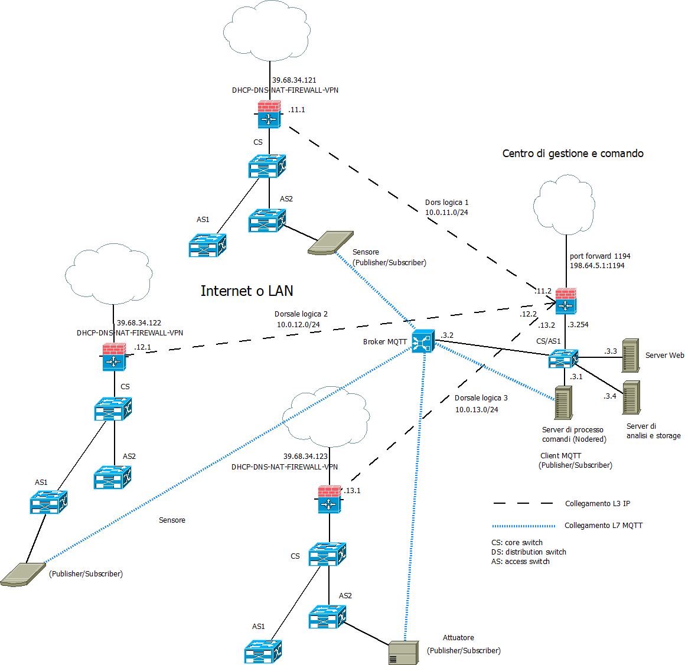
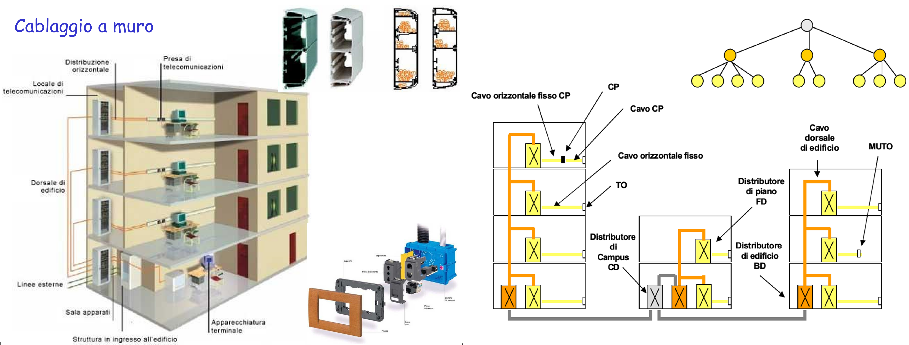
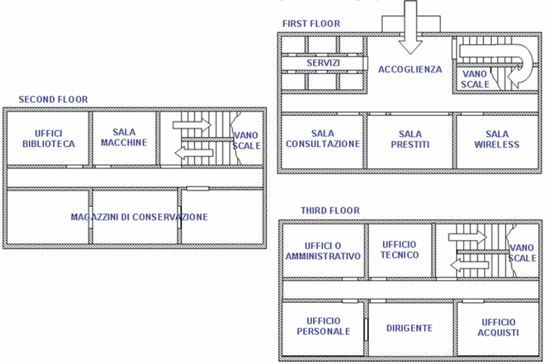
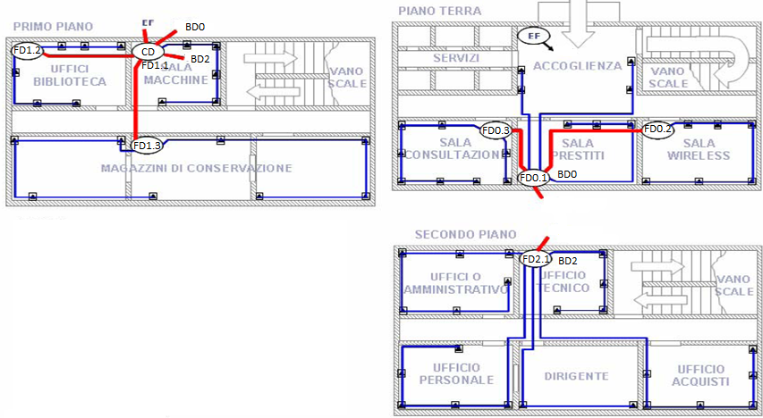

>[Torna a reti di sensori](sensornetworkshort.md#classificazione-delle-tecnologie-wsn-in-base-a-velocità-e-copertura)

- [Dettaglio architettura Zigbee](archzigbee.md)
- [Dettaglio architettura BLE](archble.md)
- [Dettaglio architettura WiFi infrastruttura](archwifi.md)
- [Dettaglio architettura WiFi mesh](archmesh.md) 
- [Dettaglio architettura LoraWAN](lorawanclasses.md)

Servizi:
- [Firewall](firewall.md).
- [Backup](backup.md).

## **Caso d'uso LAN Ethernet** 

Date le particolarità della tecnologia, i casi d'uso per la rete di sensori Ethernet sono quelli tipici per applicazioni **IoT indoor** a **medio raggio**, dove concorre con altre tecnologie di rete: Zigbee, BLE e, sotto certe condizioni, LoRaWAN. **Caratteristiche** della rete Ethernet di **tipo ufficio** sono essenzialmente:
- possibilità di realizzare **comandi** a distanza wireless anche relativamente piccoli con una **durata** delle batterie non troppo lunga rispetto ad altre tecnlogie ma con la possibilità di essere alimentati via POE (Power Over Ethernet).
- possibilità di realizzare **sensori** ambientali molto piccoli e alimentati via POE.
- **assenza di gateway** verso la rete LAN, essendo essi stessi collegati a questa.
- **rete di sensori** composta **dai dispositivi** della stessa rete LAN utilizzata per i **dati**. Gli unici dispositivi capaci di inoltro dei dati sono gli stessi della LAN (switch, router, bridge wifi).
- utilizzo di una rete **non ottimizzata** per la sensoristica ma pensata più per le prestazioni in bit rate elevate che per i bassi consumi. Consumi limitati si ottengono attivando funzioni di **deep sleep** di processore e radio tra un turno di misura dei sensori e il successivo.
- rete di sensori che ha la stessa **affidabilità** della rete dati.


### **Aspetti critici**

Elementi **critici** su cui **bilanciare convenienze** e saper fare delle **scelte argomentate** sono:
- schema fisico (**planimetria**) dell'infrastruttura con etichettatura univoca di tutti gli asset tecnologici di rete.
- tipologia di **divisione in gruppi** degli utenti.
- definizione delle **tecnologie dei dispositivi** chiave quali sensori/attuatori ([dispositivi terminali](sensornetworkshort.md#dispositivi-terminali-sensoriattuatori)), gateway, link (dual radio, three radio), accesso radio (allocazione di servizi sincroni TDM, asincroni CSMA/CA o a basso ritardo slotted CSMA/CA) e loro dimensionamento di  massima (quantità, numero di porte, banda, ecc.).
- eventuali vincoli normativi sulle tecnologie in uso come potenza, EIRP, ERP e duty cycle.
- schema logico (albero degli **apparati attivi**) di tutti i dispositivi di rete con il loro ruolo e i **link virtuali** astratti ai vari livelli della **pila ISO/OSI** (tipicamente L2, L3, L7)
- dislocazione di eventuali **gateway**.
- **subnetting** e definizione degli indirizzi dei vari gruppi di utenti, delle server farm, definizione degli indirizzi dei server.
- definizione del **tipo di routing** (statico o dinamico). In caso si scelga il **routing statico**, definizione delle **tabelle di routing** più significative.
- definizione della posizione del broker MQTT.
- definizione dei topic utili per i casi d'uso richiesti.
- definizione dei **messaggi JSON** per alcuni **dispositivi IoT** ritenuti significativi in merito a **comandi**, **stato** o **configurazione**.
- definizione (anche in pseudocodice) delle **funzioni del firmware** di bordo dei **dispositivi IoT**.

Per **maggiori dettagli** vedi [Punti critici cablaggio strutturato](punticablaggio.md).

Per una disamina degli errori più comuni nello sviluppo di una documentazione sul cablaggio strutturato vedi [Errori comuni cablaggio](erroricablaggio.md)

## **Architettura di una rete di reti** 

Di seguito è riportata l'architettura generale di una **rete di reti** di sensori. Essa è composta, a **livello fisico**, essenzialmente di una **rete di accesso** ai sensori e da una **rete di distribuzione** che fa da collante di ciascuna rete di sensori.


### **Rete di distribuzione** 

La **rete di distribuzione**, in questo caso, **coincide** con una **rete di reti IP**, in definitiva direttamente con **Internet** se le reti wifi sono **federate** e **remote**, cioè in luoghi sparsi in Internet. 

In questo caso non è necessario avere dei gateway con funzione di traduzione dalla rete di ditribuzione IP a quella dei sensori, dato che questa è anch'essa una rete IP.

### **Schema logico** 

L'albero degli **apparati attivi** di una rete di sensori + rete di distribuzione + server di gestione e controllo potrebbe apparire:



Il **broker MQTT** può essere **pubblico** installato in **cloud**, in una **Virtual Private network**, oppure **On Premise** direttamente nel centro di gestione e controllo. 

Una rete di reti di sensori sparsi nel mondo può essere tenuta insieme tramite Internet utilizzando un broker pubblico MQTT. In alternativa è possibile, nel caso di reti di sensori Ethernet, emulare una stessa LAN che le unisce mediante la tecnologia delle VPN site-to-site. I vantaggi sono:
- la possibilità di poter usare un **broker privato** interno alla LAN
- la possibilità di poter scambiare informazioni su un **canale cifrato** con qualunque tipo di broker MQTT (non per forza basato sui web socket o protetto con TLS).
- la possibilità di poter adoperare **altri servizi** centralizzati oltre la messaggistica MQTT.

Per il dettaglio sulle VPN pratiche vedi [VPN di reti Ethernet](ethvpn.md).

Per il dettaglio sulle impostazioni di un firewall [Firewall](firewall.md).

Per il dettaglio sulla realizzazione dei backup vedi [Backup](backup.md).

Per il dettaglio sulla realizzazione del firmware vedi [Firmware](sensorfw.md).


##  **Canali di comunicazione principali in una rete di sensori**

**In sintesi**, sono necessari almeno **due canali** di comunicazione che, insieme, complessivamente, realizzano la **comunicazione tra sensori e gestore** delle informazioni:
- **tra sensori e gateway** verso la LAN realizzato dalle **sottoreti dei sensori**:
    - **A filo** con accesso:,
        - **singolo dedicato**: un filo o un canale per sensore in tecnologia SDM o TDM (multiplexer, UART, porta analogica, porta digitale)
        - **multiplo condiviso** cioè tramite mezzo broadcast (BUS) con **arbitraggio** di tipo **master slave** (Modubus, Dallas, I2C, SPI) o **peer to peer** (CanBUS, KNX, ecc) o misto (ProfiBUS). 
        - Spesso **bidirezionale** specie se in presenza di attuatori
        
    - **Senza filo** cioè wireless con accesso:
        - **singolo dedicato**: link punto-punto analogico digitalizzato con AX25 oppure digitale con un radio modem (Yarm ACME Systems, 6LoWPAN, LoRa) resi full duplex con l'uso di multiplazioni FDM o TDM.
        - **Multiplo e condiviso** (BUS) di tipo half duplex reso bidirezionale (full duplex) tramite tecniche asincrone CSMA/CA (Zigbee, wifi, LoRa) o sincrone TDMA (Zigbee, Bluetooth).
- **Tra gateway e gestore** delle informazioni realizzato dalla **rete di distribuzione**:
     - Tipicamente tramite **LAN ethernet** e architettura **Client/Server**
     - Interazioni di tipo PUSH o PULL
     - Paradigma Request/Response (HTTPS, COAP), Publish/Subscriber (MQTT) oppure canale persistente bidirezionale (BSD socket o WebSocket)
       
## **Broker MQTT** 

Il **broker MQTT** è solo una delle tante soluzioni possibili per realizzare un **canale multicast** di livello **applicativo** tramite cui un utente col ruolo di **publisher** è in grado di notificare una **replica** dello stesso messaggio a più **subscribers**. E' utile per:
- inoltro dei comandi da un **sensore di comando** su una rete di tipo A (ad es. LoRaWAN) ad un attuatore su una rete diversa di tipo B (ad es. Zigbee)
- inoltro di una **misura** da un **sensore ambientale** su una rete di tipo A (ad es. LoRaWAN) ad un **pannello di controllo** su una rete diversa di tipo B (tipicamente IP)
- inoltro di una **misura** da un **sensore ambientale** su una rete di tipo A (ad es. LoRaWAN) ad un **server di gestione** su una rete diversa di tipo B (tipicamente IP)

Il **canale applicativo** su cui vengono inviati i messaggi sono quindi i **topic**. Su un certo **topic** il dispositivo con il ruolo di **output** agisce come un **publisher**, mentre quello con il ruolo di **input** agisce come un **subscriber**.

Gli utenti, in ogni caso, si comportano tutti come **client** poiché sono loro che **iniziano la connessione** con il broker e non il viceversa. 


**Fasi** del protocollo:
1. Il **Subscriber** dichiara presso il broker il proprio interesse a ricevere notifiche riguardo ad un certo argomento (topic) effettuando una chiamata **subscribe()**
2. il **publisher** pubblica un messaggio che riguarda un **certo topic** effettuando una chiamata **publish()**
3. Il **broker** inoltra il messaggio a tutti i subscriber interessati a **quel topic**

L'**ID MQTT** è un identificativo che permette di individuare un dispositivo ma non è un indirizzo di livello 3, non individua la macchina host in base al suo IP, piuttosto è un indirizzo di livello applicativo noto solo ad un server centrale, cioè il broker. Un dispositivo IoT non è tenuto a conoscere l'IP di tutti gli altri dispositivi ma solamente quello del broker. Il broker soltanto sa gli indirizzi di tutti i dispositivi, conoscenza che acquisisce durante la fase di **connessione** di un client al broker, momento in cui avviene anche il recupero del'**socket remoto** del client.

Il **broker**, dal canto suo, **associa** ogni **topic** con tutti gli **ID** che sono registrati presso di esso come **subscriber**. Questa associazione è utilizzata per smistare tutti i messaggi che arrivano con un certo topic verso tutti gli ID che ad esso sono associati. Il topic diventa così un **indirizzo di gruppo**. La particolarità di questo indirizzo è che è **gerarchico** secondo una struttura ad **albero**, cioè gruppi di dispositivi possono essere suddivisi in **sottogruppi** più piccoli estendendo il nome del path con un **ulteriore prefisso**, diverso per ciascun sottogruppo. L'operazione può essere ripetuta ulteriormente in maniera **ricorsiva**.

**Ad esempio**, posso individuare le lampade della casa con il path ```luci``` e accenderle e spegnerle tutte insieme, ma posso sezionarle ulteriormente con il path ```luci/soggiorno``` con il quale accendere o spegnere solo quelle del soggiorno oppure con il path ```luci/soggiorno/piantane``` con il quale fare la stessa cosa ma solo con le piantane del soggiorno.

Osservando l'albero degli **apparati attivi**, si vede bene che, in una **rete IP**, il **client MQTT** (con il ruolo di **publisher** o di **subscriber**) è sempre il **dispositivo IoT**. 

In **generale**, su reti **non IP**, i **client MQTT** (con il ruolo di **publisher** o di **subscriber**) sono sempre i **gateway di confine** della **rete di sensori**. Le uniche reti di sensori che non hanno bisogno di un gateway di confine che sia, nel contempo anche client MQTT, sono le reti IP. Esistono ancora i gateway nelle **reti IP** ma con **scopi diversi** da quello di **realizzare** un **client MQTT**. Nelle **reti IP**, il **client MQTT** è, normalmente, direttamente **a bordo** del **dispositivo** sensore dotato di indirizzo IP (**MCU**).

Il **vantaggio** del **broker MQTT** è quello di poter gestire in modo semplice e **standardizzato** lo **smistamento** (inoltro) delle **misure** e dei **comandi** tra i vari portatori di interesse (stakeholder) di un **cluster** di reti di sensori, siano essi utenti umani, interfacce grafiche, server applicativi diversi o altri dispositivi IoT.

### **Alternative ad MQTT**

Esistono molte altre soluzioni che magari sono più semplici e graficamente accattivanti ma che passano per portali proprietari o per servizi cloud a pagamento e nulla aggiungono di didatticamente rilevante ai nostri discorsi. Normalmente sono basate su webservices realizzati con protocolli Request/Response quali **HTTPS** e **COAP**.

## **Server di gestione** 

E' un **client** del **broker MQTT** con funzioni sia di **publisher** che di **subscriber** per:
- realizzazione delle **interfacce web** per la gestione e la visualizzazione dei dati dei dispositivi e delle applicazioni agli utenti.
- elaborazioni a **breve termine** quali la generazione di **statistiche** per la determinazione di **soglie** o **predizioni** per:
    - realizzazione da remoto della **logica di comando** (processo dei comandi) degli **attuatori**
    - **report** per l'assistenza alle decisioni
    - generazioni di **allarmi**
    - realizzazione di **ottimizzazioni** della gestione o del consumo di risorse, energia o materie prime
    - contabilizzazione dei consumi (**smart metering**)
    - controllo e sorveglianza in tempo reale dello **stato** di impianti o macchinari
    - segnalazione dei **guasti** o loro **analisi predittiva** prima che accadano
    - **consapevolezza situazionale** di ambienti remoti, difficili, pericolosi o ostili (https://it.wikipedia.org/wiki/Situational_awareness)
- elaborazioni a **lungo termine** quali:
    - analisi dei dati per la realizzazione di studi scientifici
    - elaborazione di nuovi modelli statistici o fisici o biologici dell'ambiente misurato

## **Sensore**

### Fasi Principali del Firmware di un Sensore che Utilizza MQTT

1. **Inizializzazione dei Parametri di Connessione**
   - Configurare i parametri del broker MQTT (indirizzo, porta, username, password).
   - Configurare il pin del sensore di temperatura e l'intervallo di lettura.

2. **Connessione al Broker MQTT**
   - Stabilire la connessione con il broker MQTT utilizzando i parametri configurati.

3. **Inizializzazione del Sensore di Temperatura**
   - Configurare il pin del sensore per la lettura della temperatura.

4. **Ciclo Principale**
   - Ottenere il tempo corrente.
   - Leggere il valore della temperatura dal sensore.
   - Creare un messaggio con il valore della temperatura.
   - Inviare il messaggio al broker MQTT se è trascorso l'intervallo prefissato.
   - Aggiornare il timestamp dell'ultima lettura inviata.

5. **Attesa Prima della Prossima Iterazione**
   - Attendere un breve periodo (ad esempio, 1 secondo) prima di ripetere il ciclo.

Per il dettaglio sulla realizzazione del firmware vedi [Firmware](sensorfw.md).

## **Rete Ethernet (LAN)** 

Gli **elementi** di base di una rete LAN sono:
- **Modem/Router** connesso all'ISP (Internet Service Provider) per l'accesso a Internet.
- **Router** connesso al modem per distribuire l'accesso a Internet e gestire il traffico di rete.
- **Switch di core** connesso al router per ampliare la capacità della rete, permettendo la connessione di più dispositivi.
- **Access Point** connesso al router o allo switch per fornire connettività wireless. 
- **Dispositivi finali** (computer, stampanti, smartphone) connessi al router/switch/access point tramite cavi Ethernet o connessione Wi-Fi.
- **Firewall** per la protezione della rete da minacce esterne.
- **Server di sistema** per la gestione delle risorse di rete, come DNS, DHCP, file server, e print server.
- un **controller** degli AP. E' un **server** che si occupa della creazione e gestione dei bridge nei vari AP, della impostazione centralizzata di interfacce logiche e parametri radio, della assegnazione centralizzata degli indirizzi IP, dell'assegnazione automatica dei canali in modo da minimizzare le interferenze reciproche tra gli AP, dell'aggiornamento centralizzato dei FW dei vari AP, della gestione dei protocolli di autenticazione, delle funzioni di logging, delle funzioni di firewall, della creazione di hotspot, ecc..

Gli **AP (Access Point)**, sono dei dispositivi di **aggregazione** dei client della rete LAN (PC, dispositivi IoT, smartphone, tablet, ecc.) che, attraverso gli AP, ottengono un accesso alla rete LAN aziendale. In modo infrastruttura, gli AP sono in realtà assimilabili a 2 dispositivi distinti:
- un **HUB wireless** che realizza un **mezzo broadcast** (multipunto) dove i client accedono mediante il protocllo **CSMA/CA** e sue ottimizzazioni per il WiFi (vedi [CSMA/CA](protocollidiaccesso.md#csmaca) per dettagli)
- un **bridge** tra l'hub wireless e una LAN cablata (vedi [Bridge AP](archwifi.md#bridge-group)). Un **bridge** è uno dispositivo di **commutazione** simile ad uno **switch** ma realizzato in **SW**, che **inoltra**, a livello L2, trame MAC dall'HUB alla LAN cablata e viceversa. Questi bridge, per ogni AP, possono essere più di uno e, in questo caso, sono tanti quante le **interfacce logiche** dell'AP e mappano ogni intefaccia su una **VLAN diversa**.

## **Architettura cablaggio**

Il **cablaggio** è articolato, come prevedono gli **standard TIA/EIA 568**B ed **ISO/IEC11801**, in: 
- centro stella di **comprensorio** (primo livello gerarchico), detto armadio CD o campus distributor, da cui si diramano le **dorsali di comprensorio**.
- centro stella di **edificio** (secondo livello gerarchico), detto armadio BD o building distributor, da cui si diramano le **dorsali di edificio**.
- centro stella (armadio) di **piano** (terzo livello gerarchico), detto armadio FD o floor distributor, da cui si diramano le **dorsali di piano**, dette anche **cablaggio orizzontale**.
- Prese, dette **TO** o telecommunication outlet.



Tendenzialmente, per risparmiare filo, vale la regola che gli armadi devono essere tutti in **posizione baricentrica** (non sempre rispettata nel disegno come nei progetti):
- L’**armadio di campus** deve essere al baricentro degli armadi di edificio
- L’**armadio di edificio** deve essere al baricentro degli armadi di piano
- L’**armadio di piano** deve essere al baricentro delle prese TO


## **Documentazione**

Consiste in:
1. Planimetria senza cablaggio
2. Planimetria con cablaggio
3. [Albero degli apparati passivi](dorsaliarmadi.md#albero-degli-apparati-passivi)
4. [Tabella delle dorsali](dorsaliarmadi.md#tabella-delle-dorsali)
5. Albero degli apparati attivi
6. [Schema degli armadi](dorsaliarmadi.md#schema-degli-armadi)

Lo scopo è realizzare un guida univoca (priva di ambiguità) per il personale installatore per definire:
- posa dei cavi affinchè si possa stabilire nel dettaglio posizione di armadi e prese TO e percorsi delle canalizzazioni all’interno dell’edificio
- Acquisizione di qualità e quantità dei materiali coinvolti

Per il personale che si occupa della ordinaria manutenzione della rete è una guida per:
- Il trouble shooting in caso di guasti
- Determinare l’allocazione dei dispositivi attivi nella struttura dell’impianto in quanto vengono definiti la loro posizione (nell’edificio e dentro gli armadi), la loro architettura di collegamento e i loro indirizzi IP 


## **Planimetria** 

### **Planimetria senza cablaggi**

Serve a dare una indicazione sulla destinazione d’uso degli ambienti, ovvero, le funzioni aziendali che li si svolgono da cui si potrebbero dedurre le esigenze degli utenti coinvolti (stakeholders).
Le esigenze dell’utente diventano i requisiti del sistema HW e SW che deve essere realizzato.



I requisiti del sistema si dividono in funzionali e non funzionali:
- I requisiti funzionali definiscono il «cosa» il sistema deve fare per l’utente e grossomodo impattano principalmente nella definizione del SW.
- I requisiti non funzionali definiscono il «come» il sistema deve realizzare le sue funzioni e sono caratterizzati per:
    - Essere di solito definiti dal cliente soltanto in maniera qualitativa
    - Riguardare essenzialmente le prestazioni e l’accuratezza con cui le funzioni vengono fornite. 


La maggior parte dei sistemi HW e SW è composta da moduli distribuiti, cioè delocalizzati, che collaborano comunicando in rete. Per cui, i requisiti non funzionali, oltre che sul SW, impattano molto proprio sui requisiti dell’infrastruttura di rete. 

### **Planimetria con cablaggio**

Nella planimetria vanno riportate con precisione:
- Le **dimensioni lineari** (lunghezza, larghezza e altezza) degli ambienti. Per l’altezza si può considerare quella standard (3m).
- La **posizione** di ogni **armadio** con etichetta
- **Posizione** di ogni **TO** con relativa etichetta
- **Percorso** delle **canalizzazioni** sia di cablaggio orizzontale che verticale indicando la posizione (soffitto, pavimenti, parete).
- **Legenda** delle **etichette** di **armadi** e **TO** scegliendo, sostanzialmente, tra due possibili opzioni:
    - **Numerazione piatta** con numeri di presa che non si ripetono per tutto l’impianto
    - **Numerazione gerarchica** in cui il numero del TO  si può ripetere a patto che sia distinto da un diverso prefisso di FD.
- I **prefissi** strettamente necessari sono: quelli di **FD** e quelli di **BD**. Il prefisso del CD è non necessario essendo unico.
- Valgono i **vincoli** stabiliti dallo **standard** riguardo a numero di postazioni, armadi e lunghezza dei cavi.

### **Vincoli del cablaggio**

Nella definizione quantitativa dei componenti si deve tenere conto dei seguenti vincoli obbligatori previsti dallo standard:
- Una **postazione** ogni 10m2 (se non diversamente richiesto dal cliente)
- Una **postazione** è composta da una **placchetta** con almeno **due TO** RJ45 (per PC e telefono)
- Un **armadio di piano** FD ogni 1000m2
- **Lunghezza massima** del cablaggio **orizzontale** (di piano) di 90m
- **Lunghezza massima** del cablaggio di **edificio** di 500m
- **Lunghezza massima** del cablaggio di **campus** di 1500m
- **Posizione baricentrica** degli armadi (rispetto alle prese o ad altri armadi)

### **Linee guida del cablaggio in planimetria**

Nella progettazione è raccomandabile seguire alcune linee guida:
- Stabilire se il progetto riguarda un edificio già esistente o da costruire ex novo 
- Sapere se i percorsi delle canalizzazioni sono su cavedii comuni (controsoffitto o sottopavimento) o su tubazioni sulle pareti delle stanze
- Prediligere più cavi e meno armadi se le distanze sono corte, e/o vi sono poche prese e/o vi sono cavedii comuni facilmente accessibili
- Prediligere più armadi e meno cavi se le distanze sono grandi, e/o vi sono molte prese e/o vi sono cavedii perimetrali non facilmente realizzabili per molti cavi.
- Utilizzare senza remora una dorsale in fibra ottica per distanze prossime o superiori ai 100m (minori interferenze, minori attenuazioni, massimizzazione della banda). Non esistono soluzioni ideali. 
- Ogni scelta è frutto di un compromesso tra esperienza, costo e disponibilità del materiale, costo e facilità della posa.

### **Disposizione degli armadi**

Non sempre esiste un unico armadio BD (di secondo livello) per edificio, come non sempre esiste un unico armadio FD di terzo livello per ciascun piano:
- In un piano potrebbero esserci più armadi di terzo livello FD ed uno di secondo BD (piano assimilabile ad un edificio).
- In un edificio potrebbero esserci più armadi di secondo livello BD (uno per piano) ed un solo di primo livello CD.
- Spesso, per risparmiare su armadi e dispositivi attivi, un armadio ha più ruoli collassati l’uno sull’altro.

Il CD può avere tre ruoli perché da esso si possono diramare dorsali di campus (verso altri BD), di edificio (verso altri FD) e di piano (verso prese TO).
Un BD può avere due ruoli perché da esso possono diramarsi dorsali di edificio (verso altri FD) e di piano (verso prese TO).



Nell’esempio:
- Al secondo piano vi è un unico armadio di piano FD che fa anche da BD2
- Al primo piano il CD fa anche da BD1 ma anche da FD1.1 collegando delle prese TO
- Al piano terra vi è un BD0 che fa anche da FD0.1 concentrando su di se dei TO
- Il resto degli armadi fa soltando da FD perché da essi si diramano soltanto dorsali di piano (in blu) e nessuna dorsale di edificio (di secondo livello) verso altri armadi FD

### **Topologia cavi vs topologia canalizzazioni**

- La topologia dei cavi UTP è sempre a stella nelle reti di ufficio e domestiche. Nella reti industriali e ferrotranviarie è possibile anche quella a BUS.
- La topologia delle canalizzazioni è, invece:
    - A BUS o, al limite, ad anello se realizzata a parete. 
    - A stella se realizzata sotto il pavimento (oppure in un controsoffitto) lungo percorsi comuni a più stanze. Talvolta si ha l’opportunità di realizzare i cavidotti a stella (mediante corrugati) prima di gettare il calcestruzzo del pavimento in fase di costruzione (o in fase di ristrutturazione) dell’edificio.
- All’interno di una canalizzazione normalmente vi sono più cavi UTP, uno per ogni presa TO servita da quella canalizzazione.
- Le canalizzazioni vanno etichettate e la loro molteplicità massima, cioè il numero massimo di cavi che conterranno lungo tutta la loro estensione, che va stabilita in fase di progetto insieme ad una stima di massima della loro lunghezza.

## **Messaggi MQTT**

### **Messaggi confermati**

La **conferma** dei messaggi inviati da parte del ricevente normalmente non è necessaria nel caso dei **sensori**. Infatti, se un invio da parte di un sensore non andasse a buon fine, è inutile richiedere la ritrasmissione di un dato che comunque a breve arriva con una misura più aggiornata. 

La conferma, invece, è prevista per funzioni di **comando** o **configurazione**.  Ad esempio  nel caso di pulsanti, rilevatori di transito o allarmi in cui l'invio del messaggiò avviene sporadicamente e in maniera del tutto **asincrona** (cioè non prevedibile dal ricevitore), potrebbe essere auspicabile avere un feedback da parte del protocollo mediante un meccanismo di conferma basato su **ack**. Ma non sempre ciò è possibile.

La **conferma**, però, potrebbe pure essere gestita soltanto dal **livello applicativo** (non dal protocollo) utilizzando un **topic di feeedback** (o stato) per inviare il valore dello stato corrente subito dopo che questo viene interessato da un comando in ingresso sul dispositivo. 

### **Definizione di topic e payload**

Sovente, nella rete di distribuzione IP è presente un server col ruolo di **broker MQTT** a cui sono associati:
- su un **topic di misura o attuazione (comando)**:
    - il dispositivo **sensore** è registrato sul broker col ruolo di **publisher** perchè vuole usare questo canale di output per **inviare il comando** verso l'attuatore 
    - il dispositivo **attuatore** è registrato sul broker con il ruolo di **subscriber** perchè è interessato a ricevere, su un canale di input, eventuali comandi di attuazione (motori, cancelli). 
-  su un **topic di feedback (stato)** (dal dispositivo terminale, verso il broker), utile al server applicativo per ricevere la conferma dell'avvenuto cambio di stato dell'attuatore ma anche utile all'utente per conoscere il nuovo stato:
    - il dispositivo **attuatore** è registrato sul broker con il ruolo di **publisher** perchè intende adoperare questo canale di output per **inviare il feedback** con il proprio stato ad un **display** associato al sensore di comando.
    - il dispositivo **sensore**, ma meglio dire il dispositivo **display** associato al dispositivo sensore (un led o uno schermo), è registrato sul broker con il ruolo di **subscriber** perchè è interessato a ricevere, su un canale di input, eventuali  **feedback** sullo stato dell'attuatore per **mostrarli** all'utente. In questo caso è demandato all'utente, e non al protocollo, **decidere** se e quante volte ripetere il comando, nel caso che lo stato del dispositivo non sia ancora quello voluto.
-  su un **topic di configurazione** dove può pubblicare solamente il server applicativo mentre tutti gli altri dispositivi IoT sono dei subscriber:
    - sia i dispositivi **sensori** che i dispositivi **attuatori** si registrano sul broker con il ruolo di **subscriber** perchè intendono adoperare questo canale di **input** per ricevere **comandi di configurazione** quali, per esempio, attivazione/disattivazione, frequenza di una misura, durata dello stand by, aggiornamenti del firmware via wirelesss (modo OTA), ecc.
    - il **server applicativo** è responsabile della definizione delle impostazioni di configurazione e decide **quali** mandare e a **chi**.

**In realtà**, il topic di configurazione, pur essendo teoricamente appropriato, potrebbe anche essere incorporato nel topic di comando, magari prevedendo un livello più alto di autorizzazione rispetto ai comandi relativi alle funzioni ordinarie.

### **Gestione dei topic di comando**

Potremmo a questo punto inserire il comando delle luci nel topic più generale delle misure ed attuazioni che chiameremo ```comandi``` e registrare i pulsanti del soggiorno al topic ```luci/soggiorno/comandi``` come pubblisher, mentre potremmo registrare le attuazioni delle lampade allo stesso topic come subscriber. Il comando potrebbe essere il JSON  ```{"toggle":"true"}```, per cui alla fine tutto intero il path diventerebbe ```luci/soggiorno/comandi/{"toggle":"true"}```. Se volessimo selezionare un solo dispositivo sono possibili due strade alternative:
- inserire il **prefisso mqtt** del dispositivo direttamente **nel path** ```luci/soggiorno/comandi/mydevice1-98F4ABF298AD/{"toggle":"true"}```
- inserire un **id** del dispositivo **nel JSON** ```luci/soggiorno/comandi/{"deviceid":"01", "toggle":"true"}```, dove con ```01``` ci indica un indirizzo univoco solamente all'interno del sottogruppo ```luci/soggiorno```. Con questa soluzione il dispositivo deve saper gestire un secondo livello di indirizzi indipendente dal meccanismo del path dei topic.

### **Gestione dei topic di stato**

Questo canale viene utilizzato per inviare lo **stato** di un dispositivo a tutti coloro che ne sono interessati. L'interesse potrebbe nascere per più motivi:
- **Conferma** dell'avvenuta **attuazione**. Alla **ricezione** di un comando (ad esempio "on":"true"), l'**attuatore** potrebbe essere tenuto a **notificare** (in modalità PUSH), al **display** associato al sensore (o al **server di processo**) trasmittente, il proprio **stato attuale**, in modo che l'**utente** (o il server di processo) possa verificare l'effettiva **efficacia** dell'ultimo comando di attuazione.
- **Sincronizzazione PULL** del **server di processo**. Il server di processo potrebbe **prelevare** sul topic di stato, tramite un **comando di richiesta** inviato al dispositivo terminale sul topic comandi, lo **stato** degli attuatori per aggiornare un pannello generale di comando o eseguire delle statistiche o per recuperare gli input di un algoritmo che deve eseguire.
- **Sincronizzazione PULL** di un **pannello di controllo**. Un **quadro di controllo web** potrebbe **prelevare** sul topic di stato, tramite un **comando di richiesta** inviato al dispositivo terminale sul topic comandi, lo **stato** degli attuatori:
    -  una **sola volta**, all'inizio, quando la pagina è stata **caricata/ricaricata** dall'utente
    -  **periodicamente**, per essere certi di avere sempre lo **stato più aggiornato**, anche a fronte di una eventuale **disconnessione** di rete che abbia impedito la registrazione dell'ultimo feedback da parte dell'attuatore.
- **Sincronizzazione PUSH**. Lo stesso attuatore potrebbe prendere l'iniziativa di **spedire periodicamente** il proprio stato a tutti coloro che ne sono interessati (server di processo o tutti i display web che lo comandano), senza che nessuno invii richieste esplicite sul topic di comando. E' un'**alternativa PUSH** alla sincronizzazione PULL periodica.

Un esempio di **canale MQTT di stato** potrebbe essere: 
- nel caso di **identificazione univoca** del dispositivo via  **path MQTT**: ```luci/soggiorno/stato/mydevice1-98F4ABF298AD/{"state":"on"}```
- nel caso di **identificazione univoca** del dispositivo nel **payload JSON**: ```luci/soggiorno/stato/{"deviceid":"01", "state":"on"}```

### **Gestione dei topic di configurazione**

Questo canale viene utilizzato per inviare **comandi di configurazione** al dispositivo da parte del server di processo. L'interesse potrebbe nascere per più motivi:
- effettuare un aggiornamento del FW di bordo via wireless.
- impostare qualche caratteristica nella definizione delle sue funzioni come, ad esempio, comportarsi come un apricancello o come comando per luci.
- impostare la frequenza di una misura, o l'intervallo di scatto di un allarme, ecc.
- cambiare la sintassi dei JSON di payload o quella di un path MQTT

Un esempio di **canale MQTT di configurazione** per, ad esempio, impostare il periodo di pubblicazione automatica dello stato potrebbe essere: 
- nel caso di **identificazione univoca** del dispositivo via  **path MQTT**: ```luci/soggiorno/config/mydevice1-98F4ABF298AD/{"stateperiod":"3000"}```
- nel caso di **identificazione univoca** del dispositivo nel **payload JSON**: ```luci/soggiorno/config/{"deviceid":"01", "stateperiod":"3000"}```


### **Pagine correlate:**

- [Dettaglio architettura Zigbee](archzigbee.md)
- [Dettaglio architettura BLE](archble.md)
- [Dettaglio architettura WiFi infrastruttura](archwifi.md)
- [Dettaglio architettura WiFi mesh](archmesh.md) 
- [Dettaglio architettura LoraWAN](lorawanclasses.md) 

### **Sitografia**:

>[Torna a reti di sensori](sensornetworkshort.md#classificazione-delle-tecnologie-wsn-in-base-a-velocità-e-copertura)
