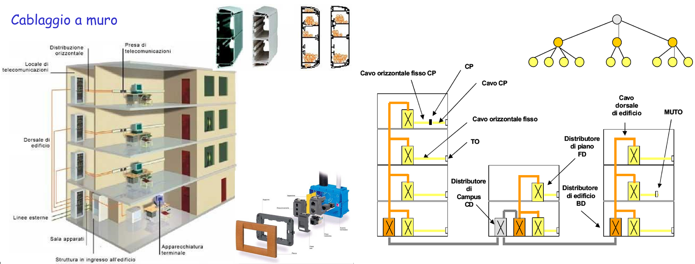
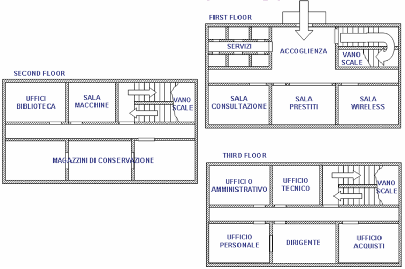
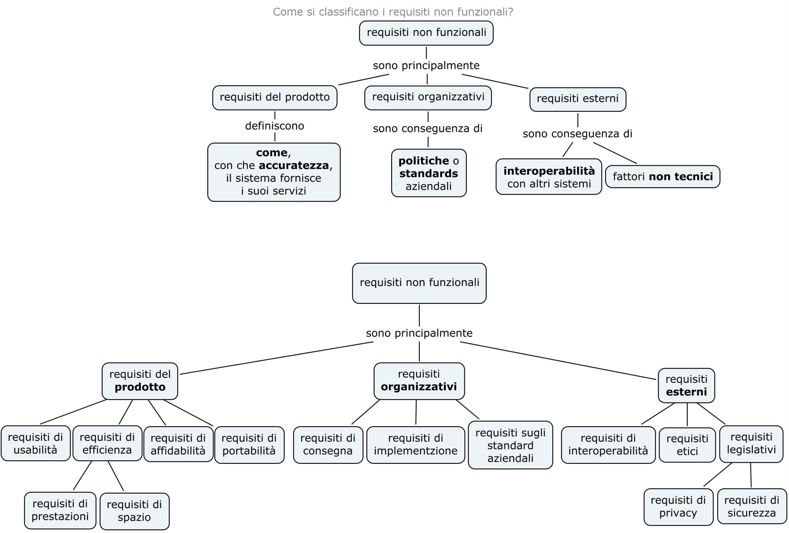

>[Torna a reti di sensori](sensornetworkshort.md#classificazione-delle-tecnologie-wsn-in-base-a-velocità-e-copertura)

- [Dettaglio architettura Zigbee](archzigbee.md)
- [Dettaglio architettura BLE](archble.md)
- [Dettaglio architettura WiFi infrastruttura](archwifi.md)
- [Dettaglio architettura WiFi mesh](archmesh.md) 
- [Dettaglio architettura LoraWAN](lorawanclasses.md)

Servizi:
- [VPN di reti Ethernet](ethvpn.md).
- [Firewall](firewall.md).
- [Backup](backup.md).
- [Autenticazione 802.1X](radius.md)
- [DNS](https://it.wikipedia.org/wiki/Domain_Name_System)
- [DHCP](https://it.wikipedia.org/wiki/Dynamic_Host_Configuration_Protocol)

## **Caso d'uso LAN Ethernet** 

Date le particolarità della tecnologia, i casi d'uso per la rete di sensori Ethernet sono quelli tipici per applicazioni **IoT indoor** a **medio raggio**, dove concorre con altre tecnologie di rete: Zigbee, BLE e, sotto certe condizioni, LoRaWAN. **Caratteristiche** della rete Ethernet di **tipo ufficio** sono essenzialmente:
- possibilità di realizzare **comandi** a distanza wireless anche relativamente piccoli con una **durata** delle batterie non troppo lunga rispetto ad altre tecnlogie ma con la possibilità di essere alimentati via POE (Power Over Ethernet).
- possibilità di realizzare **sensori** ambientali molto piccoli e alimentati via POE.
- **assenza di gateway** verso la rete LAN, essendo essi stessi collegati a questa.
- **rete di sensori** composta **dai dispositivi** della stessa rete LAN utilizzata per i **dati**. Gli unici dispositivi capaci di inoltro dei dati sono gli stessi della LAN (switch, router, bridge wifi).
- utilizzo di una rete **non ottimizzata** per la sensoristica ma pensata più per le prestazioni in bit rate elevate che per i bassi consumi. Consumi limitati si ottengono attivando funzioni di **deep sleep** di processore e radio tra un turno di misura dei sensori e il successivo.
- rete di sensori che ha la stessa **affidabilità** della rete dati.


### **Aspetti critici**

Elementi **critici** su cui **bilanciare convenienze** e saper fare delle **scelte argomentate** sono:
- schema fisico (**planimetria**) dell'infrastruttura con etichettatura univoca di tutti gli asset tecnologici di rete.
- tipologia di **divisione in gruppi** degli utenti.
- definizione delle **tecnologie dei dispositivi** chiave quali sensori/attuatori ([dispositivi terminali](sensornetworkshort.md#dispositivi-terminali-sensoriattuatori)), gateway, link (dual radio, three radio), accesso radio (allocazione di servizi sincroni TDM, asincroni CSMA/CA o a basso ritardo slotted CSMA/CA) e loro dimensionamento di  massima (quantità, numero di porte, banda, ecc.).
- eventuali vincoli normativi sulle tecnologie in uso come potenza, EIRP, ERP e duty cycle.
- schema logico (albero degli **apparati attivi**) di tutti i dispositivi di rete con il loro ruolo e i **link virtuali** astratti ai vari livelli della **pila ISO/OSI** (tipicamente L2, L3, L7)
- dislocazione di eventuali **gateway**.
- **subnetting** e definizione degli indirizzi dei vari gruppi di utenti, delle server farm, definizione degli indirizzi dei server.
- definizione del **tipo di routing** (statico o dinamico). In caso si scelga il **routing statico**, definizione delle **tabelle di routing** più significative.
- definizione della posizione del broker MQTT.
- definizione dei topic utili per i casi d'uso richiesti.
- definizione dei **messaggi JSON** per alcuni **dispositivi IoT** ritenuti significativi in merito a **comandi**, **stato** o **configurazione**.
- definizione (anche in pseudocodice) delle **funzioni del firmware** di bordo dei **dispositivi IoT**.

Per **maggiori dettagli** vedi [Punti critici cablaggio strutturato](punticablaggio.md).

Per una disamina degli errori più comuni nello sviluppo di una documentazione sul cablaggio strutturato vedi [Errori comuni cablaggio](erroricablaggio.md)

[Rete di reti Ethernet](/approfondimenti/eth_federation.md)
       
[Broker MQTT](/approfondimenti/broker_mqtt.md)

[Messaggi MQTT](/approfondimenti/messaggi_mqtt.md)

[Server di gestione](/approfondimenti/server_di_gestione.md)

[Sensori](/approfondimenti/sensore.md)


Per il dettaglio sulle VPN pratiche vedi [VPN di reti Ethernet](ethvpn.md).

Per il dettaglio sulle impostazioni di un firewall [Firewall](firewall.md).

Per il dettaglio sulla realizzazione dei backup vedi [Backup](backup.md).

Per il dettaglio sulla realizzazione dell'autenticazione 802.1X vedi [Autenticazione 802.1X](radius.md)

## **Rete Ethernet (LAN)** 

Gli **elementi** di base di una rete LAN sono:
- **Modem/Router** connesso all'ISP (Internet Service Provider) per l'accesso a Internet.
- **Router** connesso al modem per distribuire l'accesso a Internet e gestire il traffico di rete.
- **Switch di core** connesso al router per ampliare la capacità della rete, permettendo la connessione di più dispositivi.
- **Access Point** connesso al router o allo switch per fornire connettività wireless. 
- **Dispositivi finali** (computer, stampanti, smartphone) connessi al router/switch/access point tramite cavi Ethernet o connessione Wi-Fi.
- **Firewall** per la protezione della rete da minacce esterne.
- **Server di sistema** per la gestione delle risorse di rete, come DNS, DHCP, file server, e print server.
- un **controller** degli AP. E' un **server** che si occupa della creazione e gestione dei bridge nei vari AP, della impostazione centralizzata di interfacce logiche e parametri radio, della assegnazione centralizzata degli indirizzi IP, dell'assegnazione automatica dei canali in modo da minimizzare le interferenze reciproche tra gli AP, dell'aggiornamento centralizzato dei FW dei vari AP, della gestione dei protocolli di autenticazione, delle funzioni di logging, delle funzioni di firewall, della creazione di hotspot, ecc..

Gli **AP (Access Point)**, sono dei dispositivi di **aggregazione** dei client della rete LAN (PC, dispositivi IoT, smartphone, tablet, ecc.) che, attraverso gli AP, ottengono un accesso alla rete LAN aziendale. In modo infrastruttura, gli AP sono in realtà assimilabili a 2 dispositivi distinti:
- un **HUB wireless** che realizza un **mezzo broadcast** (multipunto) dove i client accedono mediante il protocllo **CSMA/CA** e sue ottimizzazioni per il WiFi (vedi [CSMA/CA](protocollidiaccesso.md#csmaca) per dettagli)
- un **bridge** tra l'hub wireless e una LAN cablata (vedi [Bridge AP](archwifi.md#bridge-group)). Un **bridge** è uno dispositivo di **commutazione** simile ad uno **switch** ma realizzato in **SW**, che **inoltra**, a livello L2, trame MAC dall'HUB alla LAN cablata e viceversa. Questi bridge, per ogni AP, possono essere più di uno e, in questo caso, sono tanti quante le **interfacce logiche** dell'AP e mappano ogni intefaccia su una **VLAN diversa**.

## **Architettura cablaggio**

Il **cablaggio** è articolato, come prevedono gli **standard TIA/EIA 568**B ed **ISO/IEC11801**, in: 
- centro stella di **comprensorio** (primo livello gerarchico), detto armadio CD o campus distributor, da cui si diramano le **dorsali di comprensorio**.
- centro stella di **edificio** (secondo livello gerarchico), detto armadio BD o building distributor, da cui si diramano le **dorsali di edificio**.
- centro stella (armadio) di **piano** (terzo livello gerarchico), detto armadio FD o floor distributor, da cui si diramano le **dorsali di piano**, dette anche **cablaggio orizzontale**.
- Prese, dette **TO** o telecommunication outlet.



Tendenzialmente, per risparmiare filo, vale la regola che gli armadi devono essere tutti in **posizione baricentrica** (non sempre rispettata nel disegno come nei progetti):
- L’**armadio di campus** deve essere al baricentro degli armadi di edificio
- L’**armadio di edificio** deve essere al baricentro degli armadi di piano
- L’**armadio di piano** deve essere al baricentro delle prese TO


## **Documentazione**

Consiste nell'**ordine**:
1. Planimetria senza cablaggio
2. [Planimetria con cablaggio](planimetriacon.md)
3. [Albero degli apparati passivi](dorsaliarmadi.md#albero-degli-apparati-passivi)
4. [Tabella delle dorsali](dorsaliarmadi.md#tabella-delle-dorsali)
5. [Albero degli apparati attivi](albapparatiattivi.md)
6. [Schema degli armadi](dorsaliarmadi.md#schema-degli-armadi)

### **Scopo**

Lo scopo è realizzare un **guida univoca** (priva di ambiguità) per il personale **installatore** per definire:
- **posa dei cavi** affinchè si possa stabilire nel dettaglio **posizione** di **armadi** e **prese TO** e **percorsi delle canalizzazioni** all’interno dell’edificio
- Acquisizione di **qualità** e **quantità** dei materiali coinvolti in **fase di progettazzione** di un impianto

Per il personale che si occupa della **ordinaria manutenzione** della rete è una guida per:
- Determinare l’allocazione dei dispositivi attivi nella struttura dell’impianto in quanto vengono definiti la loro posizione (nell’edificio e dentro gli armadi), la loro architettura di collegamento e i loro indirizzi IP 
- Il **trouble shooting** in caso di guasti, in quanto l'insieme di **subnetting fisico** e di **cablaggio strutturato** permette di  determinare la **posizione fisica** di un dispositivo guasto (nell’edificio e dentro gli armadi) una volta **noto** il suo **indirizzo IP**. 

### **Scelta dei documenti da compilare**

Non tutti i documenti sono necessari per la **definizione** di un **nuovo progetto**:
- **servono tutti** se si progetta il **cablaggio strutturato** di un **edificio** o di un **campus** e se si è direttamente responsabili della acquisizione, gestione e manutenzione delle macchine installate.
- serve essenzialmente solo lo **schema degli apparati attivi** se si progetta una rete in **ambito cloud** dove la maggior parte dei sistemi sono in pratica **virtualizzati** e gestiti **da remoto** secondo il modello cloud [IasS](https://cloud.google.com/learn/what-is-iaas?hl=it)
- servono essenzialmente **planimetria** e **schema degli apparati attivi** in contesti di **reti WiFi Mesh** o di **reti LPWA** o di reti dove però, è sempre importante definire con precisione la **posizione** dei vari **gateway** verso la rete pubblica (Internet) o privata (LAN) di distribuzione.
- servono essenzialmente **planimetria** e **schema degli apparati attivi** in ambito indoor o outdoor **Zigbee** se non è richiesto di definire il resto della rete ma, anche in questo caso, vanno definiti con precisione la **posizione** dei vari **gateway** verso la rete pubblica (Internet) o privata (LAN) di distribuzione.
- servono essenzialmente solo la **planimetria** e un **blando schema** degli **apparati attivi** in ambito indoor o outdoor **BLE con beacon fissi** se non è richiesto di definire il resto della rete ma, anche in questo caso, vanno definiti con precisione la **posizione** dei vari **gateway** verso la rete pubblica (Internet) o privata (LAN) di distribuzione.
- potrebbe servire grossomodo **definire tutto** nel caso di **reti BLE con listener** fissi dato che questi si configurano come veri e propri dispositivi di rete che vanno cablati assieme a tutto il resto. Una eccezione potrebbe essere realizzare l'infrastruttura in WIFi Mesh o modem LTE e allora potrebbero bastare **planimetrie** e **apparati attivi**.

### **Coerenza tra documenti**

Chiaramente i documenti di un cablaggio non sono scorrelati e, per di più, la definizione di alcuni è la base per la definizione dei successivi. L'**ordine** è essenzialmente quello proposto, con maggiore o minore enfasi su una parte piuttosto che su un'altra. Aspetti importanti sono:
- coerenza
- completezza
- assenza di ambiguità

Se queste **proprietà dovessero mancare** si potrebbero generare **inconsistenze** nella **documentazione** di parti dell'impianto che rimarrebbe quindi **non utilizzabile** per la **progettazione** di quelle parti.

### **Conclusioni**

**Riassumendo**, la **base** è sempre lo schema dettagliato del **cablaggio strutturato** con tutti i suoi documenti. A seconda del **contesto**, l'**enfasi** si sposta su alcuni documenti invece che su altri o perchè l'**infrastruttura è wireless** piuttosto che cablata o perchè la **responsabilità** di gestione di parte dell'infrastruttura è **delegata ad altri** (per esempio un cloud).

## **Planimetria** 

### **Planimetria senza cablaggi**

Serve a dare una indicazione sulla destinazione d’uso degli ambienti, ovvero, le funzioni aziendali che li si svolgono da cui si potrebbero dedurre le esigenze degli utenti coinvolti (stakeholders).
Le esigenze dell’utente diventano i requisiti del sistema HW e SW che deve essere realizzato.



I requisiti del sistema si dividono in funzionali e non funzionali:
- I requisiti funzionali definiscono il «cosa» il sistema deve fare per l’utente e grossomodo impattano principalmente nella definizione del SW.
- I requisiti non funzionali definiscono il «come» il sistema deve realizzare le sue funzioni e sono caratterizzati per:
    - Essere di solito definiti dal cliente soltanto in maniera qualitativa
    - Riguardare essenzialmente le prestazioni e l’accuratezza con cui le funzioni vengono fornite. 



La maggior parte dei sistemi HW e SW è composta da moduli distribuiti, cioè delocalizzati, che collaborano comunicando in rete. Per cui, i requisiti non funzionali, oltre che sul SW, impattano molto proprio sui requisiti dell’infrastruttura di rete. 

## **Messaggi MQTT**

### **Messaggi confermati**

La **conferma** dei messaggi inviati da parte del ricevente normalmente non è necessaria nel caso dei **sensori**. Infatti, se un invio da parte di un sensore non andasse a buon fine, è inutile richiedere la ritrasmissione di un dato che comunque a breve arriva con una misura più aggiornata. 

La conferma, invece, è prevista per funzioni di **comando** o **configurazione**.  Ad esempio  nel caso di pulsanti, rilevatori di transito o allarmi in cui l'invio del messaggiò avviene sporadicamente e in maniera del tutto **asincrona** (cioè non prevedibile dal ricevitore), potrebbe essere auspicabile avere un feedback da parte del protocollo mediante un meccanismo di conferma basato su **ack**. Ma non sempre ciò è possibile.

La **conferma**, però, potrebbe pure essere gestita soltanto dal **livello applicativo** (non dal protocollo) utilizzando un **topic di feeedback** (o stato) per inviare il valore dello stato corrente subito dopo che questo viene interessato da un comando in ingresso sul dispositivo. 

### **Definizione di topic e payload**

Molto spesso, nella rete di distribuzione IP è presente un server col ruolo di **broker MQTT** a cui sono associati:
- su un **topic di misura**:
    - il dispositivo **sensore** che è registrato sul broker col ruolo di **publisher** perchè vuole usare questo canale di output per **inviare le misure** verso il **server applicativo**
    - il **server applicativo** che è registrato come subscriber perchè è interessato a ricevere, su un canale di input, le misure di **tutti** i sensori distribuiti in rete.
- su un **topic di attuazione (comando)**:
    - il dispositivo **sensore** che è registrato sul broker col ruolo di **publisher** perchè vuole usare questo canale di output per **inviare il comando** verso l'attuatore 
    - il dispositivo **attuatore** che è registrato sul broker con il ruolo di **subscriber** perchè è interessato a ricevere, su un canale di input, eventuali comandi di attuazione (motori, cancelli). 
-  su un **topic di feedback (stato)** (dal dispositivo terminale, verso il broker), utile al server applicativo per ricevere la conferma dell'avvenuto cambio di stato dell'attuatore, ma anche utile all'utente per conoscere il nuovo stato:
    - il dispositivo **attuatore** che è registrato sul broker con il ruolo di **publisher** perchè intende adoperare questo canale di output per **inviare il feedback** con il proprio stato ad un **display** associato al sensore di comando.
    - il dispositivo **sensore**, ma meglio dire il dispositivo **display** che, associato al dispositivo sensore (un led o uno schermo), è registrato sul broker con il ruolo di **subscriber** perchè è interessato a ricevere, su un canale di input, eventuali  **feedback** sullo stato dell'attuatore per **mostrarli** all'utente. In questo caso è demandato all'utente, e non al protocollo, **decidere** se e quante volte ripetere il comando, nel caso che lo stato del dispositivo non sia ancora quello voluto.
-  su un **topic di configurazione** dove può pubblicare solamente il server applicativo mentre tutti gli altri dispositivi IoT sono dei subscriber:
    - sia i dispositivi **sensori** che i dispositivi **attuatori** che si registrano sul broker con il ruolo di **subscriber** perchè intendono adoperare questo canale di **input** per ricevere **comandi di configurazione** quali, per esempio, attivazione/disattivazione, frequenza di una misura, durata dello stand by, aggiornamenti del firmware via wirelesss (modo OTA), ecc.
    - il **server applicativo** che è responsabile della definizione delle impostazioni di configurazione e decide **quali** mandare e a **chi**.

**In realtà**, il topic di configurazione, pur essendo teoricamente appropriato, potrebbe anche essere incorporato nel topic di comando, magari prevedendo un livello più alto di autorizzazione rispetto ai comandi relativi alle funzioni ordinarie.

### **Gestione dei topic di comando**

Potremmo a questo punto inserire il comando delle luci nel topic più generale delle misure ed attuazioni che chiameremo ```comandi``` e registrare i pulsanti del soggiorno al topic ```luci/soggiorno/comandi``` come pubblisher, mentre potremmo registrare le attuazioni delle lampade allo stesso topic come subscriber. Il comando potrebbe essere il JSON  ```{"toggle":"true"}```, per cui alla fine tutto intero il path diventerebbe ```luci/soggiorno/comandi/{"toggle":"true"}```. Se volessimo selezionare un solo dispositivo sono possibili due strade alternative:
- inserire il **prefisso mqtt** del dispositivo direttamente **nel path** ```luci/soggiorno/comandi/mydevice1-98F4ABF298AD/{"toggle":"true"}```
- inserire un **id** del dispositivo **nel JSON** ```luci/soggiorno/comandi/{"deviceid":"01", "toggle":"true"}```, dove con ```01``` ci indica un indirizzo univoco solamente all'interno del sottogruppo ```luci/soggiorno```. Con questa soluzione il dispositivo deve saper gestire un secondo livello di indirizzi indipendente dal meccanismo del path dei topic.

### **Gestione dei topic di stato**

Questo canale viene utilizzato per inviare lo **stato** di un dispositivo a tutti coloro che ne sono interessati. L'interesse potrebbe nascere per più motivi:
- **Conferma** dell'avvenuta **attuazione**. Alla **ricezione** di un comando (ad esempio "on":"true"), l'**attuatore** potrebbe essere tenuto a **notificare** (in modalità PUSH), al **display** associato al sensore (o al **server di processo**) trasmittente, il proprio **stato attuale**, in modo che l'**utente** (o il server di processo) possa verificare l'effettiva **efficacia** dell'ultimo comando di attuazione.
- **Sincronizzazione PULL** del **server di processo**. Il server di processo potrebbe **prelevare** sul topic di stato, tramite un **comando di richiesta** inviato al dispositivo terminale sul topic comandi, lo **stato** degli attuatori per aggiornare un pannello generale di comando o eseguire delle statistiche o per recuperare gli input di un algoritmo che deve eseguire.
- **Sincronizzazione PULL** di un **pannello di controllo**. Un **quadro di controllo web** potrebbe **prelevare** sul topic di stato, tramite un **comando di richiesta** inviato al dispositivo terminale sul topic comandi, lo **stato** degli attuatori:
    -  una **sola volta**, all'inizio, quando la pagina è stata **caricata/ricaricata** dall'utente
    -  **periodicamente**, per essere certi di avere sempre lo **stato più aggiornato**, anche a fronte di una eventuale **disconnessione** di rete che abbia impedito la registrazione dell'ultimo feedback da parte dell'attuatore.
- **Sincronizzazione PUSH**. Lo stesso attuatore potrebbe prendere l'iniziativa di **spedire periodicamente** il proprio stato a tutti coloro che ne sono interessati (server di processo o tutti i display web che lo comandano), senza che nessuno invii richieste esplicite sul topic di comando. E' un'**alternativa PUSH** alla sincronizzazione PULL periodica.

Un esempio di **canale MQTT di stato** potrebbe essere: 
- nel caso di **identificazione univoca** del dispositivo via  **path MQTT**: ```luci/soggiorno/stato/mydevice1-98F4ABF298AD/{"state":"on"}```
- nel caso di **identificazione univoca** del dispositivo nel **payload JSON**: ```luci/soggiorno/stato/{"deviceid":"01", "state":"on"}```

### **Gestione dei topic di configurazione**

Questo canale viene utilizzato per inviare **comandi di configurazione** al dispositivo da parte del server di processo. L'interesse potrebbe nascere per più motivi:
- effettuare un aggiornamento del FW di bordo via wireless.
- impostare qualche caratteristica nella definizione delle sue funzioni come, ad esempio, comportarsi come un apricancello o come comando per luci.
- impostare la frequenza di una misura, o l'intervallo di scatto di un allarme, ecc.
- cambiare la sintassi dei JSON di payload o quella di un path MQTT

Un esempio di **canale MQTT di configurazione** per, ad esempio, impostare il periodo di pubblicazione automatica dello stato potrebbe essere: 
- nel caso di **identificazione univoca** del dispositivo via  **path MQTT**: ```luci/soggiorno/config/mydevice1-98F4ABF298AD/{"stateperiod":"3000"}```
- nel caso di **identificazione univoca** del dispositivo nel **payload JSON**: ```luci/soggiorno/config/{"deviceid":"01", "stateperiod":"3000"}```

SItografia:
- https://github.com/awesome-selfhosted/awesome-selfhosted

### **Pagine correlate:**

- [Dettaglio architettura Zigbee](archzigbee.md)
- [Dettaglio architettura BLE](archble.md)
- [Dettaglio architettura WiFi infrastruttura](archwifi.md)
- [Dettaglio architettura WiFi mesh](archmesh.md) 
- [Dettaglio architettura LoraWAN](lorawanclasses.md) 

### **Sitografia**:
- https://cloud.google.com/learn/what-is-iaas?hl=it

>[Torna a reti di sensori](sensornetworkshort.md#classificazione-delle-tecnologie-wsn-in-base-a-velocità-e-copertura)
