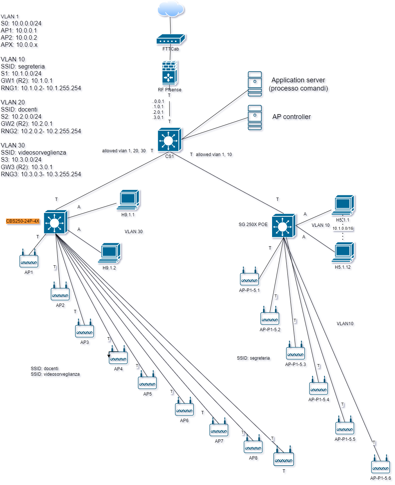

>[Torna a reti di sensori](sensornetworkshort.md#classificazione-delle-tecnologie-wsn-in-base-a-velocità-e-copertura)

- [Dettaglio architettura Zigbee](archzigbee.md)
- [Dettaglio architettura BLE](archble.md)
- [Dettaglio architettura WiFi infrastruttura](archwifi.md)
- [Dettaglio architettura WiFi mesh](archmesh.md) 
- [Dettaglio architettura LoraWAN](lorawanclasses.md) 

## **Caso d'uso LAN Ethernet** 

Date le particolarità della tecnologia, i casi d'uso per la rete di sensori Ethernet sono quelli tipici per applicazioni **IoT indoor** a **medio raggio**, dove concorre con altre tecnologie di rete: Zigbee, BLE e, sotto certe condizioni, LoRaWAN. **Caratteristiche** della rete Ethernet di **tipo ufficio** sono essenzialmente:
- possibilità di realizzare **comandi** a distanza wireless anche relativamente piccoli con una **durata** delle batterie non troppo lunga rispetto ad altre tecnlogie ma con la possibilità di essere alimentati via POE (Power Over Ethernet).
- possibilità di realizzare **sensori** ambientali molto piccoli e alimentati via POE.
- **assenza di gateway** verso la rete LAN, essendo essi stessi collegati a questa.
- **rete di sensori** composta **dai dispositivi** della stessa rete LAN utilizzata per i **dati**. Gli unici dispositivi capaci di inoltro dei dati sono gli stessi della LAN (switch, router, bridge wifi).
- utilizzo di una rete **non ottimizzata** per la sensoristica ma pensata più per le prestazioni in bit rate elevate che per i bassi consumi. Consumi limitati si ottengono attivando funzioni di **deep sleep** di processore e radio tra un turno di misura dei sensori e il successivo.
- rete di sensori che ha la stessa **affidabilità** della rete dati.


### **Aspetti critici**

Elementi **critici** su cui **bilanciare convenienze** e saper fare delle **scelte argomentate** sono:
- schema fisico (**planimetria**) dell'infrastruttura con etichettatura univoca di tutti gli asset tecnologici di rete.
- tipologia di **divisione in gruppi** degli utenti.
- definizione delle **tecnologie dei dispositivi** chiave quali sensori/attuatori ([dispositivi terminali](sensornetworkshort.md#dispositivi-terminali-sensoriattuatori)), gateway, link (dual radio, three radio), accesso radio (allocazione di servizi sincroni TDM, asincroni CSMA/CA o a basso ritardo slotted CSMA/CA) e loro dimensionamento di  massima (quantità, numero di porte, banda, ecc.).
- eventuali vincoli normativi sulle tecnologie in uso come potenza, EIRP, ERP e duty cycle.
- schema logico (albero degli **apparati attivi**) di tutti i dispositivi di rete con il loro ruolo e i **link virtuali** astratti ai vari livelli della **pila ISO/OSI** (tipicamente L2, L3, L7)
- dislocazione di eventuali **gateway**.
- **subnetting** e definizione degli indirizzi dei vari gruppi di utenti, delle server farm, definizione degli indirizzi dei server.
- definizione del **tipo di routing** (statico o dinamico). In caso si scelga il **routing statico**, definizione delle **tabelle di routing** più significative.
- definizione della posizione del broker MQTT.
- definizione dei topic utili per i casi d'uso richiesti.
- definizione dei **messaggi JSON** per alcuni **dispositivi IoT** ritenuti significativi in merito a **comandi**, **stato** o **configurazione**.
- definizione (anche in pseudocodice) delle **funzioni del firmware** di bordo dei **dispositivi IoT**.

Per **maggiori dettagli** vedi [Punti critici cablaggio strutturato](punticablaggio.md).

Per una disamina degli errori più comuni nello sviluppo di una documentazione sul cablaggio strutturato vedi [Errori comuni cablaggio](erroricablaggio.md)

## **Architettura di una rete di reti** 

Di seguito è riportata l'architettura generale di una **rete di reti** di sensori. Essa è composta, a **livello fisico**, essenzialmente di una **rete di accesso** ai sensori e da una **rete di distribuzione** che fa da collante di ciascuna rete di sensori.


### **Rete di distribuzione** 

La **rete di distribuzione**, in questo caso, **coincide** con una **rete di reti IP**, in definitiva direttamente con **Internet** se le reti wifi sono **federate** e **remote**, cioè in luoghi sparsi in Internet. 

In questo caso non è necessario avere dei gateway con funzione di traduzione dalla rete di ditribuzione IP a quella dei sensori, dato che questa è anch'essa una rete IP.

### **Schema logico** 

L'albero degli **apparati attivi** di una rete di sensori + rete di distribuzione + server di gestione e controllo potrebbe apparire:


Il **broker MQTT** può essere **pubblico** installato in **cloud**, in una **Virtual Private network**, oppure **On Premise** direttamente nel centro di gestione e controllo. 

Una rete di reti di sensori sparsi nel mondo può essere tenuta insieme tramite Internet utilizzando un broker pubblico MQTT. In alternativa è possibile, nel caso di reti di sensori Ethernet, emulare una stessa LAN che le unisce mediante la tecnologia delle VPN site-to-site. I vantaggi sono:
- la possibilità di poter usare un **broker privato** interno alla LAN
- la possibilità di poter scambiare informazioni su un **canale cifrato** con qualunque tipo di broker MQTT (non per forza basato sui web socket o protetto con TLS).
- la possibilità di poter adoperare **altri servizi** centralizzati oltre la messaggistica MQTT.

Per il dettaglio sulle VPN pratiche vedi [VPN di reti Ethernet](ethvpn.md).

##  **Canali di comunicazione principali in una rete di sensori**

**In sintesi**, sono necessari almeno **due canali** di comunicazione che, insieme, complessivamente, realizzano la **comunicazione tra sensori e gestore** delle informazioni:
- **tra sensori e gateway** verso la LAN realizzato dalle **sottoreti dei sensori**:
    - **A filo** con accesso:,
        - **singolo dedicato**: un filo o un canale per sensore in tecnologia SDM o TDM (multiplexer, UART, porta analogica, porta digitale)
        - **multiplo condiviso** cioè tramite mezzo broadcast (BUS) con **arbitraggio** di tipo **master slave** (Modubus, Dallas, I2C, SPI) o **peer to peer** (CanBUS, KNX, ecc) o misto (ProfiBUS). 
        - Spesso **bidirezionale** specie se in presenza di attuatori
        
    - **Senza filo** cioè wireless con accesso:
        - **singolo dedicato**: link punto-punto analogico digitalizzato con AX25 oppure digitale con un radio modem (Yarm ACME Systems, 6LoWPAN, LoRa) resi full duplex con l'uso di multiplazioni FDM o TDM.
        - **Multiplo e condiviso** (BUS) di tipo half duplex reso bidirezionale (full duplex) tramite tecniche asincrone CSMA/CA (Zigbee, wifi, LoRa) o sincrone TDMA (Zigbee, Bluetooth).
- **Tra gateway e gestore** delle informazioni realizzato dalla **rete di distribuzione**:
     - Tipicamente tramite **LAN ethernet** e architettura **Client/Server**
     - Interazioni di tipo PUSH o PULL
     - Paradigma Request/Response (HTTPS, COAP), Publish/Subscriber (MQTT) oppure canale persistente bidirezionale (BSD socket o WebSocket)
       
## **Broker MQTT** 

Il **broker MQTT** è solo una delle tante soluzioni possibili per realizzare un **canale multicast** di livello **applicativo** tramite cui un utente col ruolo di **publisher** è in grado di notificare una **replica** dello stesso messaggio a più **subscribers**. E' utile per:
- inoltro dei comandi da un **sensore di comando** su una rete di tipo A (ad es. LoRaWAN) ad un attuatore su una rete diversa di tipo B (ad es. Zigbee)
- inoltro di una **misura** da un **sensore ambientale** su una rete di tipo A (ad es. LoRaWAN) ad un **pannello di controllo** su una rete diversa di tipo B (tipicamente IP)
- inoltro di una **misura** da un **sensore ambientale** su una rete di tipo A (ad es. LoRaWAN) ad un **server di gestione** su una rete diversa di tipo B (tipicamente IP)

Il **canale applicativo** su cui vengono inviati i messaggi sono quindi i **topic**. Su un certo **topic** il dispositivo con il ruolo di **output** agisce come un **publisher**, mentre quello con il ruolo di **input** agisce come un **subscriber**.

Gli utenti, in ogni caso, si comportano tutti come **client** poiché sono loro che **iniziano la connessione** con il broker e non il viceversa. 


**Fasi** del protocollo:
1. Il **Subscriber** dichiara presso il broker il proprio interesse a ricevere notifiche riguardo ad un certo argomento (topic) effettuando una chiamata **subscribe()**
2. il **publisher** pubblica un messaggio che riguarda un **certo topic** effettuando una chiamata **publish()**
3. Il **broker** inoltra il messaggio a tutti i subscriber interessati a **quel topic**

L'**ID MQTT** è un identificativo che permette di individuare un dispositivo ma non è un indirizzo di livello 3, non individua la macchina host in base al suo IP, piuttosto è un indirizzo di livello applicativo noto solo ad un server centrale, cioè il broker. Un dispositivo IoT non è tenuto a conoscere l'IP di tutti gli altri dispositivi ma solamente quello del broker. Il broker soltanto sa gli indirizzi di tutti i dispositivi, conoscenza che acquisisce durante la fase di **connessione** di un client al broker, momento in cui avviene anche il recupero del'**socket remoto** del client.

Il **broker**, dal canto suo, **associa** ogni **topic** con tutti gli **ID** che sono registrati presso di esso come **subscriber**. Questa associazione è utilizzata per smistare tutti i messaggi che arrivano con un certo topic verso tutti gli ID che ad esso sono associati. Il topic diventa così un **indirizzo di gruppo**. La particolarità di questo indirizzo è che è **gerarchico** secondo una struttura ad **albero**, cioè gruppi di dispositivi possono essere suddivisi in **sottogruppi** più piccoli estendendo il nome del path con un **ulteriore prefisso**, diverso per ciascun sottogruppo. L'operazione può essere ripetuta ulteriormente in maniera **ricorsiva**.

**Ad esempio**, posso individuare le lampade della casa con il path ```luci``` e accenderle e spegnerle tutte insieme, ma posso sezionarle ulteriormente con il path ```luci/soggiorno``` con il quale accendere o spegnere solo quelle del soggiorno oppure con il path ```luci/soggiorno/piantane``` con il quale fare la stessa cosa ma solo con le piantane del soggiorno.

Osservando l'albero degli **apparati attivi**, si vede bene che, in una **rete IP**, il **client MQTT** (con il ruolo di **publisher** o di **subscriber**) è sempre il **dispositivo IoT**. 

In **generale**, su reti **non IP**, i **client MQTT** (con il ruolo di **publisher** o di **subscriber**) sono sempre i **gateway di confine** della **rete di sensori**. Le uniche reti di sensori che non hanno bisogno di un gateway di confine che sia, nel contempo anche client MQTT, sono le reti IP. Esistono ancora i gateway nelle **reti IP** ma con **scopi diversi** da quello di **realizzare** un **client MQTT**. Nelle **reti IP**, il **client MQTT** è, normalmente, direttamente **a bordo** del **dispositivo** sensore dotato di indirizzo IP (**MCU**).

Il **vantaggio** del **broker MQTT** è quello di poter gestire in modo semplice e **standardizzato** lo **smistamento** (inoltro) delle **misure** e dei **comandi** tra i vari portatori di interesse (stakeholder) di un **cluster** di reti di sensori, siano essi utenti umani, interfacce grafiche, server applicativi diversi o altri dispositivi IoT.

### **Alternative ad MQTT**

Esistono molte altre soluzioni che magari sono più semplici e graficamente accattivanti ma che passano per portali proprietari o per servizi cloud a pagamento e nulla aggiungono di didatticamente rilevante ai nostri discorsi. Normalmente sono basate su webservices realizzati con protocolli Request/Response quali **HTTPS** e **COAP**.

## **Server di gestione** 

E' un **client** del **broker MQTT** con funzioni sia di **publisher** che di **subscriber** per:
- realizzazione delle **interfacce web** per la gestione e la visualizzazione dei dati dei dispositivi e delle applicazioni agli utenti.
- elaborazioni a **breve termine** quali la generazione di **statistiche** per la determinazione di **soglie** o **predizioni** per:
    - realizzazione da remoto della **logica di comando** (processo dei comandi) degli **attuatori**
    - **report** per l'assistenza alle decisioni
    - generazioni di **allarmi**
    - realizzazione di **ottimizzazioni** della gestione o del consumo di risorse, energia o materie prime
    - contabilizzazione dei consumi (**smart metering**)
    - controllo e sorveglianza in tempo reale dello **stato** di impianti o macchinari
    - segnalazione dei **guasti** o loro **analisi predittiva** prima che accadano
    - **consapevolezza situazionale** di ambienti remoti, difficili, pericolosi o ostili (https://it.wikipedia.org/wiki/Situational_awareness)
- elaborazioni a **lungo termine** quali:
    - analisi dei dati per la realizzazione di studi scientifici
    - elaborazione di nuovi modelli statistici o fisici o biologici dell'ambiente misurato

## **Rete Ethernet (LAN)** 

Gli **elementi** di base di una rete LAN sono:
- **Modem/Router** connesso all'ISP (Internet Service Provider) per l'accesso a Internet.
- **Router** connesso al modem per distribuire l'accesso a Internet e gestire il traffico di rete.
- **Switch di core** connesso al router per ampliare la capacità della rete, permettendo la connessione di più dispositivi.
- **Access Point** connesso al router o allo switch per fornire connettività wireless. 
- **Dispositivi finali** (computer, stampanti, smartphone) connessi al router/switch/access point tramite cavi Ethernet o connessione Wi-Fi.
- **Firewall** per la protezione della rete da minacce esterne.
- **Server di sistema** per la gestione delle risorse di rete, come DNS, DHCP, file server, e print server.
- un **controller** degli AP. E' un **server** che si occupa della creazione e gestione dei bridge nei vari AP, della impostazione centralizzata di interfacce logiche e parametri radio, della assegnazione centralizzata degli indirizzi IP, dell'assegnazione automatica dei canali in modo da minimizzare le interferenze reciproche tra gli AP, dell'aggiornamento centralizzato dei FW dei vari AP, della gestione dei protocolli di autenticazione, delle funzioni di logging, delle funzioni di firewall, della creazione di hotspot, ecc..

Gli **AP (Access Point)**, sono dei dispositivi di **aggregazione** dei client della rete LAN (PC, dispositivi IoT, smartphone, tablet, ecc.) che, attraverso gli AP, ottengono un accesso alla rete LAN aziendale. In modo infrastruttura, gli AP sono in realtà assimilabili a 2 dispositivi distinti:
- un **HUB wireless** che realizza un **mezzo broadcast** (multipunto) dove i client accedono mediante il protocllo **CSMA/CA** e sue ottimizzazioni per il WiFi (vedi [CSMA/CA](protocollidiaccesso.md#csmaca) per dettagli)
- un **bridge** tra l'hub wireless e una LAN cablata (vedi [Bridge AP](archwifi.md#bridge-group)). Un **bridge** è uno dispositivo di **commutazione** simile ad uno **switch** ma realizzato in **SW**, che **inoltra**, a livello L2, trame MAC dall'HUB alla LAN cablata e viceversa. Questi bridge, per ogni AP, possono essere più di uno e, in questo caso, sono tanti quante le **interfacce logiche** dell'AP e mappano ogni intefaccia su una **VLAN diversa**.

## **Architettura cablaggio**

Il **cablaggio** è articolato, come prevedono gli **standard TIA/EIA 568**B ed **ISO/IEC11801**, in: 
- centro stella di **comprensorio** (primo livello gerarchico), detto armadio CD o campus distributor
- centro stella di **edificio** (secondo livello gerarchico), detto armadio BD o building distributor
- centro stella (armadio) di **piano** (terzo livello gerarchico), detto armadio FD o floor distributor
- Prese, dette **TO** o telecommunication outled

Tendenzialmente, per risparmiare filo, vale la regola che gli armadi devono essere tutti in **posizione baricentrica** (non sempre rispettata nel disegno come nei progetti):
- L’**armadio di campus** deve essere al baricentro degli armadi di edificio
- L’**armadio di edificio** deve essere al baricentro degli armadi di piano
- L’**armadio di piano** deve essere al baricentro delle prese TO


## **Documentazione**

Consiste in:
1. Planimetria senza cablaggio
2. Planimetria con cablaggio
3. [Albero degli apparati passivi](dorsaliarmadi.md#albero-degli-apparati-passivi)
4. [Tabella delle dorsali](dorsaliarmadi.md#tabella-delle-dorsali)
5. Albero degli apparati attivi
6. [Schema degli armadi](dorsaliarmadi.md#schema-degli-armadi)

Lo scopo è realizzare un guida univoca (priva di ambiguità) per il personale installatore per definire:
- posa dei cavi affinchè si possa stabilire nel dettaglio posizione di armadi e prese TO e percorsi delle canalizzazioni all’interno dell’edificio
- Acquisizione di qualità e quantità dei materiali coinvolti

Per il personale che si occupa della ordinaria manutenzione della rete è una guida per:
- Il trouble shooting in caso di guasti
- Determinare l’allocazione dei dispositivi attivi nella struttura dell’impianto in quanto vengono definiti la loro posizione (nell’edificio e dentro gli armadi), la loro architettura di collegamento e i loro indirizzi IP 


## **Planimetria** 

### **Planimetria senza cablaggi**

Serve a dare una indicazione sulla destinazione d’uso degli ambienti, ovvero, le funzioni aziendali che li si svolgono da cui si potrebbero dedurre le esigenze degli utenti coinvolti (stakeholders).
Le esigenze dell’utente diventano i requisiti del sistema HW e SW che deve essere realizzato.


I requisiti del sistema si dividono in funzionali e non funzionali:
- I requisiti funzionali definiscono il «cosa» il sistema deve fare per l’utente e grossomodo impattano principalmente nella definizione del SW.
- I requisiti non funzionali definiscono il «come» il sistema deve realizzare le sue funzioni e sono caratterizzati per:
    - Essere di solito definiti dal cliente soltanto in maniera qualitativa
    - Riguardare essenzialmente le prestazioni e l’accuratezza con cui le funzioni vengono fornite. 


La maggior parte dei sistemi HW e SW è composta da moduli distribuiti, cioè delocalizzati, che collaborano comunicando in rete. Per cui, i requisiti non funzionali, oltre che sul SW, impattano molto proprio sui requisiti dell’infrastruttura di rete. 

### **Planimetria con cablaggio**

Nella planimetria vanno riportate con precisione:
- Le **dimensioni lineari** (lunghezza, larghezza e altezza) degli ambienti. Per l’altezza si può considerare quella standard (3m).
- La **posizione** di ogni **armadio** con etichetta
- **Posizione** di ogni **TO** con relativa etichetta
- **Percorso** delle **canalizzazioni** sia di cablaggio orizzontale che verticale indicando la posizione (soffitto, pavimenti, parete).
- **Legenda** delle **etichette** di **armadi** e **TO** scegliendo, sostanzialmente, tra due possibili opzioni:
    - **Numerazione piatta** con numeri di presa che non si ripetono per tutto l’impianto
    - **Numerazione gerarchica** in cui il numero del TO  si può ripetere a patto che sia distinto da un diverso prefisso di FD.
- I **prefissi** strettamente necessari sono: quelli di **FD** e quelli di **BD**. Il prefisso del CD è non necessario essendo unico.
- Valgono i **vincoli** stabiliti dallo **standard** riguardo a numero di postazioni, armadi e lunghezza dei cavi.

### **Vincoli del cablaggio**

Nella definizione quantitativa dei componenti si deve tenere conto dei seguenti vincoli obbligatori previsti dallo standard:
- Una **postazione** ogni 10m2 (se non diversamente richiesto dal cliente)
- Una **postazione** è composta da una **placchetta** con almeno **due TO** RJ45 (per PC e telefono)
- Un **armadio di piano** FD ogni 1000m2
- **Lunghezza massima** del cablaggio **orizzontale** (di piano) di 90m
- **Lunghezza massima** del cablaggio di **edificio** di 500m
- **Lunghezza massima** del cablaggio di **campus** di 1500m
- **Posizione baricentrica** degli armadi (rispetto alle prese o ad altri armadi)

### **Linee guida del cablaggio in planimetria**

Nella progettazione è raccomandabile seguire alcune linee guida:
- Stabilire se il progetto riguarda un edificio già esistente o da costruire ex novo 
- Sapere se i percorsi delle canalizzazioni sono su cavedii comuni (controsoffitto o sottopavimento) o su tubazioni sulle pareti delle stanze
- Prediligere più cavi e meno armadi se le distanze sono corte, e/o vi sono poche prese e/o vi sono cavedii comuni facilmente accessibili
- Prediligere più armadi e meno cavi se le distanze sono grandi, e/o vi sono molte prese e/o vi sono cavedii perimetrali non facilmente realizzabili per molti cavi.
- Utilizzare senza remora una dorsale in fibra ottica per distanze prossime o superiori ai 100m (minori interferenze, minori attenuazioni, massimizzazione della banda). Non esistono soluzioni ideali. 
- Ogni scelta è frutto di un compromesso tra esperienza, costo e disponibilità del materiale, costo e facilità della posa.

### **Disposizione degli armadi**

Non sempre esiste un unico armadio BD (di secondo livello) per edificio, come non sempre esiste un unico armadio FD di terzo livello per ciascun piano:
- In un piano potrebbero esserci più armadi di terzo livello FD ed uno di secondo BD (piano assimilabile ad un edificio).
- In un edificio potrebbero esserci più armadi di secondo livello BD (uno per piano) ed un solo di primo livello CD.
- Spesso, per risparmiare su armadi e dispositivi attivi, un armadio ha più ruoli collassati l’uno sull’altro.

Il CD può avere tre ruoli perché da esso si possono diramare dorsali di campus (verso altri BD), di edificio (verso altri FD) e di piano (verso prese TO).
Un BD può avere due ruoli perché da esso possono diramarsi dorsali di edificio (verso altri FD) e di piano (verso prese TO).


Nell’esempio:
- Al secondo piano vi è un unico armadio di piano FD che fa anche da BD2
- Al primo piano il CD fa anche da BD1 ma anche da FD1.1 collegando delle prese TO
- Al piano terra vi è un BD0 che fa anche da FD0.1 concentrando su di se dei TO
- Il resto degli armadi fa soltando da FD perché da essi si diramano soltanto dorsali di piano (in blu) e nessuna dorsale di edificio (di secondo livello) verso altri armadi FD

### **Topologia cavi vs topologia canalizzazioni**

- La topologia dei cavi UTP è sempre a stella nelle reti di ufficio e domestiche. Nella reti industriali e ferrotranviarie è possibile anche quella a BUS.
- La topologia delle canalizzazioni è, invece:
    - A BUS o, al limite, ad anello se realizzata a parete. 
    - A stella se realizzata sotto il pavimento (oppure in un controsoffitto) lungo percorsi comuni a più stanze. Talvolta si ha l’opportunità di realizzare i cavidotti a stella (mediante corrugati) prima di gettare il calcestruzzo del pavimento in fase di costruzione (o in fase di ristrutturazione) dell’edificio.
- All’interno di una canalizzazione normalmente vi sono più cavi UTP, uno per ogni presa TO servita da quella canalizzazione.
- Le canalizzazioni vanno etichettate e la loro molteplicità massima, cioè il numero massimo di cavi che conterranno lungo tutta la loro estensione, che va stabilita in fase di progetto insieme ad una stima di massima della loro lunghezza.

## **Albero degli apparati attivi**

### **Albero degli apparati attivi e armadi**

Gli apparati attivi non fanno tecnicamente parte della definizione delle norme del cablaggio strutturato perché quella riguarda solo i componenti passivi (non alimentati) dello stesso.
In ogni caso, i dispositivi attivi sono progettati per essere interfacciati con gli elementi del cablaggio strutturato e in più i loro fattori di forma (combinazioni delle loro tre dimensioni) sono fatti per essere alloggiati nel rack di un armadio:
- La loro altezza è pari o multipla di una unità
- La loro larghezza sugli ancoraggi è esattamente di 19’’
- La loro profondità varia generalmente da 45 a 100 cm
- Persino i normali PC tower hanno una larghezza standard di 3 unità.

Normalmente (ma potrebbero esserci eccezioni) un armadio contiene uno o più SW così distribuiti:
- Uno o più CS (core switch) dentro un CD
- Uno o più DS (distribution switch) dentro un BD
- Uno o più AS (access switch) dentro un FD

Gli AS sono diventati i concentratori dei dispositivi client fissi per cui posseggono un numero elevato di porte (24 - 72).

I DS di base destinati a commutare dorsali e potrebbero essere realizzati:
- Con gli stessi SW in uso negli AS e in questo caso sono dei DS/AS
- Con SW dedicati solo alle dorsali con meno porte ma più prestanti (ad es. da 10Gbps), realizzate in RJ45 oppure in SFP

I CS sono i concentratori dei dispositivi server (sistema e business) e delle dorsali principali di campus e potrebbero essere realizzati:
- Con gli stessi SW in uso negli AS e in questo caso sono dei CD/AS
- Con gli stessi SW in uso nei DS e in questo caso sono dei CD/DS
- Con SW speciali dedicati solo alle dorsali con meno porte ma più prestanti (ad es. da 10Gbps), realizzate in RJ45 oppure in SFP. Spesso hanno anche funzioni di routing (SW L3) e assommano molti servizi di sistema ad uso di tutti i dispositivi della rete (DHCP, DNS).

### **Configurazioni switch tipiche**

- Il cablaggio orizzontale è in genere a 1Gbps
- Il cablaggio verticale di edificio è almeno a 10Gbps in fibra (MMF o SMF) o a 10Gbps in rame (UTP cat 6A o UTP cat 7A) 
- Il cablaggio verticale di campus è almeno a 10Gbps in fibra (MMF o SMF)

Switch di core CS:
- 12P 10Gbps + 4P SFP+ 
- 12P 10Gbps + 12P SFP+ 
- 24P 1Gbps + 4P SFP+ 
- 24P 1Gbps + 2P 10Gbps + 2P SFP+ 

Switch di distribuzione DS:
- 12P 10Gbps + 2P SFP+ 
- 12P 10Gbps + 12P SFP+ 
- 24P 1Gbps + 2P SFP+ 
- 24P 1Gbps + 2P 10Gbps + 2P SFP+ 

- Switch di accesso AS:
- 24P 1Gbps + 2P SFP 
- 24P 1Gbps + 2P 10Gbps + 2P SFP+ 

### **Albero degli apparati attivi e subnetting**

Per realizzarlo è opportuno eseguire un subnetting della rete tenendo conto:
- Che ogni link fisico o virtuale di un router genera una subnet
- Che gruppi di indirizzi come le subnet dovrebbero essere allocati a funzioni aziendali che tendenzialmente utilizzano, per la maggior parte del tempo, risorse a loro dedicate.

La realizzazione di un inter VLAN routing obbliga a far corrispondere (mappare) ogni VLAN ad una dorsale verso il router (virtuale o fisica) e quindi ad una corrispondente subnet.

Un **subnetting** definisce **sei proprietà** di una **subnet**:
- **VLAN ID** della vlan x (se previste le VLAN)
- **ISx**: indirizzo base della subnet x
- **SMx**: subnet mask della subnet x. E’ collegato a NSx (numero di indirizzi della sub. X)
- **BCx**: indirizzo di broadcast della subnet x
- **GWx**: indirizzo di gateway della subnet 
- **RNGx**: intervallo tra il primo indirizzo e l’ultimo indirizzo assegnabile ai client della subnet x

### **Indirizzi IP di client e server**

L’albero degli apparati attivi contiene dispositivi alimentati e dotati di indirizzo IP, indicati genericamente come host, sono:
- PC client fissi o portatili
- Server di vario tipo per funzioni di sistema o di business
- NAS (network Attached Storage) assimilabile ad un server di file condivisi tramite il protocollo NFS (Network File System) oppure tramite Samba (SMB).
- Telefoni IP
- Telefoni personali collegati alla rete wifi
- Tablet
- Videocamere IP
- Dispositivi IoT per sensoristica o telerilevamento

Normalmente i dispositivi client ottengono automaticamente l’indirizzo IP tramite il servizio DHCP. Al limite, gli indirizzi dei dispositivi fissi possono essere assegnati staticamente per ragioni di troubleshooting.

I dispositivi server posseggono indirizzi statici per poter essere associati più facilmente all’url di dominio presso cui i client possono connettersi per raggiungere i servizi che essi pubblicano. I loro indirizzi vanno sempre segnati sull’albero.

## **Divisione in gruppi di utenti o servizi**

### **Link che generano subnet**

- Il centro stella è sempre un router da cui si dirama una subnet a partire da ogni suo link fisico
- La possibilità di realizzare subnet mappate su LAN (stub o transit) può essere estesa anche alle VLAN
- La novità è che adesso da un router si può diramare una subnet anche a partire da un link virtuale
- Poiché più link virtuali possono condividere uno stesso collegamento fisico, esiste la possibilità di dislocare le subnet a «macchia di leopardo», cioè in modo che i loro dispositivi siano sparsi potenzialmente ovunque all’interno dell’infrastruttura fisica della rete (cade il vincolo di vicinanza fisica dei dispositivi di una subnet).


### **Modalità di segmentazione**

La **segmentazione** di una rete LAN parte sempre da un **router** che, essendo un **dispositivo L3**, è in grado di **bloccare** le trame MAC provenienti da dispositivi di livello inferiore come gli SW e i Bridge ad L2 oppure gli Hub ad L1.

Un router **reimbusta** le trame MAC su nuovi pacchetti IP ogni volta che effettua un **inoltro** su una porta di uscita. L'operazione di **inoltro** è **vincolata** ad alcune limitazioni che possono essere utili per la sicurezza:
- la **presenza di una rotta** nella routing table del router per l'indirizzo di destinazione del pacchetto. In **caso contrario**, il pacchetto viene **scartato**.
- la **presenza di una o più ACL** (Access Control List) che filtrino l'accesso da e verso alcune porte in base ad alcuni **criteri**. Ad ogni **porta** corrisponde un **link** e ad ogni link corrisponde univocamente una **subnet**. Le **ACL** sono pertanto **liste di regole** che permettono o bloccano il **passaggio** di un pacchetto IP da una **subnet ad un'altra**. Poichè le subnet tipicamente raggruppano utenti, si può dedurre che, le ACL basate sugli indirizzi IP, sono un metodo efficace per **limitare**, **permettere** o **bloccare** del tutto il traffico tra gruppi di utenti.
- 


- Una **VLAN** è una infrastruttura LAN speciale in grado di dividere una stessa LAN fisica in gruppi di host **separati logicamente** ma non fisicamente 
- Le LAN tradizionali, per dividere gli utenti in gruppi, devono utilizzare **LAN fisiche differenti**, cioè disposte in **luoghi diversi**
- Raggruppare logicamente significa scegliere un criterio di raggruppamento. Nelle LAN normali il **criterio di raggruppamento** è la **vicinanza fisica** degli host.
- Le VLAN invece organizzano i raggruppamenti solo in base alla **funzione** o al tipo di **servizio** (e non in base alla posizione nello spazio):
     - persone dello stesso dipartimento che sono dislocate su più sedi fisicamente separate (collegare logicamente host fisicamente separati)
     - Persone nello stesso luogo che devono essere selezionate per confluire in dipartimenti separati (separare logicamente host fisicamente collegati)

### **Segmentazione fisica**

- Le subnet sono generate sul router da due link fisici collegati a interfacce IP fisicamente distinte 
- Sui link fisici si diramano LAN fisicamente separate
- Subnet mappate su LAN con infrastruttura fisica distinta e quindi allocabili solo in ambienti diversi
- Subnets spazialmente allocate che comprendono gruppi di host separati in base alla dislocazione fisica degli apparati di rete


- Porte di uno stesso switch appartengono sempre allo stesso gruppo di macchine (quello della funzione F1 o F2)
- E’ necessaria la separazione fisica degli ambienti per dividere i gruppi F1 e F2
- Sul router ogni link fisico genera una subnet che si mappa 1:1 su una sottostante LAN fisica

#### **Esigenza di filtraggio: negare ad un PC della subnet officina di entrare nella subnet ufficio**

<table>
<tr><td> Soluzione senza le VLAN </td><td> Soluzione con le VLAN </td></tr>
<tr><td> 
    
```C++                   
  !Definizione lista di regole (blacklist)
  (config)# access-list 101 deny 10.0.2.0 0.0.0.255
  (config)# access-list 101 permit any
  ! Selezione interfaccia eth2
  (config)# interface eth2
  !Applicazione in ingress su eth2
  (config-if)# ip access-group 101 in
  (config-if)# exit
  ``` 
    
</td>
<td>

```C++     
! Definizione lista di regole (blacklist)
(config)# access-list 101 deny 10.0.2.0 0.0.0.255
(config)# access-list 101 permit any 
! Selezione interfaccia vlan 20
(config)# interface vlan20 
! Applicazione in ingress su vlan 20
(config-if)# ip access-group 101 in
(config-if)# exit
```
    
</td>
</tr>
</table>

### **Segmentazione logica**

- Le subnet sono generate sul router da due link virtuali collegati a interfacce IP logicamente distinte
- Sui link virtuali si diramano LAN logicamente separate (VLAN)
- Le VLAN condividono la stessa infrastruttura fisica e quindi sono allocabili in qualunque ambiente
- Subnet mappate su LAN logiche
- Subnets delocalizzate che comprendono gruppi di host separati in base alla funzione o al servizio


- Porte di uno stesso switch possono appartenere a gruppi di macchine diverse, sia F1 che F2
- è necessaria la colorazione delle porte per distinguere i gruppi
- Sul router ogni link virtuale genera una subnet che si mappa 1:1 su una sottostante LAN logica (VLAN)

#### **Esigenza di filtraggio:**
- Si vuole consentire agli host in Marketing di avviare e stabilire una sessione TCP per gli host in Produzione.
- solo ai pacchetti TCP di risposta e a quelli di dialogo è consentito entrare nell'interfaccia vlan 20 da Produzione verso Marketing 
- Pertanto, gli host in Marketing possono aprire connessioni verso gli host in Produzione, ma gli host in Produzione non possono aprire alcuna connessione diretta verso la subnet Marketing

#### **Soluzione**
<table>
<tr><td> Marketing --> Produzione </td></tr>
<tr><td> 
    
```C++                   
! Definizione lista di regole
(config)# access-list 102 permit tcp any any gt 1023 established
! Selezione interfaccia vlan20
(config)# interface ethernet0
! Applicazione in ingress su e0
(config-if)# ip access-group 102 in
``` 
    
</td>
</tr>
</table>

- Nota: established seleziona solo i pacchetti di risposta (solo flag ACK o flag RST settati)
- Nota: 1023 seleziona solo porte di destinazione di client (numerazione più alta di 1000)
- Nota: è una tecnica stateless dalla sicurezza relativa (possibile falsificazione dei flags)


### **Segmentazione fisica + logica**

- Le subnet sono generate sul router da due link virtuali collegati a interfacce IP logicamente distinte
- Sui link virtuali si diramano LAN logicamente separate (VLAN)
- Le VLAN 10 e 20 condividono la stessa infrastruttura fisica e quindi sono allocabili in qualunque ambiente
- La VLAN 30 si dirama CS con una sola dorsale fisica verso AS1 dove sono confinati tutti i suoi dispositivi
- nessun’altra dorsale logica può propagare la VLAN 30 perché nessun trunk 802.1q la possiede tra le VLAN ammesse (allowed), oltre quello verso il CS.
- Subnets delocalizzate che comprendono gruppi di host separati in base alla posizione e al servizio

#### **Esigenza di filtraggio:**
- consentire alla vlan 30 l'accesso ad Internet
- consentire alla vlan 30 l'accesso alla server farm
- non permettere l'accesso reciproco tra le vlan 30 e le vlan 10, 20
  


- Porte di uno stesso switch possono appartenere a gruppi di macchine diverse, sia F1 che F2
- è necessaria la colorazione delle porte per distinguere i gruppi
- Sul router ogni link virtuale genera una subnet che si mappa 1:1 su una sottostante LAN logica (VLAN)
- il **filtraggio** è realizzato direttamente a livello di linea L2 dall'impostazione ```allowed vlan 10, 20``` sulla porta di trunk che filtra le trame della vlan 30

### **Esempio**

Nel contesto di un istituto scolastico che si vuole servire con una rete WiFi, si vogliono separare i **servizi di segreteria** scolastica con i suoi **server** e i suoi **impiegati** localizzati in una subnet fisicamente dislocata in una **certa area**, dai **servizi di mobilità**, dispersi a **macchia di leopardo** in tutto il comprensorio, ai docenti dotati di supporti di loro proprietà (politica Byod) con i quali eseguono le loro attività giornaliere sul registro scolastico. Si vuole consentire anche una gestione separata al traffico dei **servizi di videosorveglianza** con propri **server**, a disposizione all'interno di una subnet separata. 



La **separazione** dei gruppi di utenti **solamente** in base alla **dislocazione fisica** sarebbe evidentemente impossibile, mentre sarebbe **effettiva** la separazione mediante **VLAN** dislocate su una infrastruttura **switched**.

### **Definizione dei gruppi mediante VLAN**

La **definizione** dei gruppi si può fare con una dislocazione a **macchia di leopardo** delle **interfacce** di accesso alla diverse VLAN, aventi **ssid statici** diversi o uno unico ma **dinamico** (autenticazione 802.1X). Gli **host** possono collegarsi all'**ssid** di una certa VLAN su **ogni AP**. La loro **separazione** avviene **dopo**, su un **router** di confine collegato al core switch con un link capace di creare il **trunking** dei flussi (**intervlan routing** in modo **router on a stick**). Le **dorsali** tra i vari bridge devono essere configurate come dorsali di **trunk** (802.1Q) in modo tale che portino il traffico aggregato di **tutte le VLAN**.

Si sarebbe potuto isolare in maniera ancora **più affidabile** la rete della segreteria servendola con uno SW dedicato collegato direttamente ad una porta del router, realizzando così una separazione fisica piuttosto che una logica, sfruttando il fatto che la dislocazione fisica dei suoi utenti è confinata in un'area esclusiva. Però, poichè il controller degli AP deve risiedere nella stessa subnet degli AP da controllare, sarebbe poi nata l'esigenza di doverne installare due, uno per la segreteria ed uno per la scuola. 

L'**inconveniente** viene superato adoperando le **VLAN** e la sicurezza viene mantenuta ugualmente alta (**like wire** in pratica) grazie ai **comandi**: ```allowed vlan 1, 20, 30``` e ```allowed vlan 1, 10``` che **confinano** il traffico delle **trame MAC** relative alla LAN della **segreteria** sul solo SW dove sono collegati i suoi dispositivi. Tutte le altre dorsali non possono essere interessate da questo traffico, mentre sono tutte interessate dal traffico della **subnet amministrativa** degli AP che possono così essere gestiti da un **unico controller**.

### **Esempio di Configurazione**

Per configurare una rete con 3 router WiFi mesh, in cui ogni router ha una dorsale (backhaul) con canale di comunicazione dedicato e due router aggregano sensori su due subnet diverse, possiamo seguire questo schema:

I Router per aggregazione dei sensori sono R2 e R3. Per le subnet possiamo usare un blocco di indirizzi privati come 10.0.0.0/8 e dividerlo, con un subnetting **FLSM classful**, come segue:

#### **Subnetting**

Subnet per la dorsale degli AP (VLAN amministrativa no ssid):
- VLAN 1
- S0: 10.0.0.0/24
- AP1: 10.0.0.1
- AP2: 10.0.0.2
- APX: 10.0.0.x

Subnet per la segreteria.
- VLAN 10
- SSID: segreteria
- S1: 10.1.0.0/24 
- GW1 (R2): 10.1.0.1
- RNG1: 10.1.0.2- 10.1.255.254

Subnet per i docenti.
- VLAN 20
- SSID: docenti
- S2: 10.2.0.0/24 
- GW2 (R2): 10.2.0.1
- RNG2: 10.2.0.2- 10.2.255.254

Subnet per la videosorveglienza.
- VLAN 30
- SSID: videosorveglienza
- S3: 10.3.0.0/24 
- GW3 (R2): 10.3.0.1
- RNG3: 10.3.0.3- 10.3.255.254

#### **Routing statico**

R1 possiede 3 indirizzi su ciascuna subnet:
- S0 (VLAN 1): 10.0.0.1  SM0: 255.255.0.0
- S1 (VLAN 10): 10.1.0.1  SM1: 255.255.0.0
- S2 (VLAN 20): 10.2.0.1  SM2: 255.255.0.0
- S3 (VLAN 30): 10.3.0.1  SM3: 255.255.0.0
  
Non è necessario impostare le tabelle di routing in quanto le subnet S0, S1, S2, S3 sono, su R1, direttamente connesse.


## **Messaggi MQTT**

### **Messaggi confermati**

La **conferma** dei messaggi inviati da parte del ricevente normalmente non è necessaria nel caso dei **sensori**. Infatti, se un invio da parte di un sensore non andasse a buon fine, è inutile richiedere la ritrasmissione di un dato che comunque a breve arriva con una misura più aggiornata. 

La conferma, invece, è prevista per funzioni di **comando** o **configurazione**.  Ad esempio  nel caso di pulsanti, rilevatori di transito o allarmi in cui l'invio del messaggiò avviene sporadicamente e in maniera del tutto **asincrona** (cioè non prevedibile dal ricevitore), potrebbe essere auspicabile avere un feedback da parte del protocollo mediante un meccanismo di conferma basato su **ack**. Ma non sempre ciò è possibile.

La **conferma**, però, potrebbe pure essere gestita soltanto dal **livello applicativo** (non dal protocollo) utilizzando un **topic di feeedback** (o stato) per inviare il valore dello stato corrente subito dopo che questo viene interessato da un comando in ingresso sul dispositivo. 

### **Definizione di topic e payload**

Sovente, nella rete di distribuzione IP è presente un server col ruolo di **broker MQTT** a cui sono associati:
- su un **topic di misura o attuazione (comando)**:
    - il dispositivo **sensore** è registrato sul broker col ruolo di **publisher** perchè vuole usare questo canale di output per **inviare il comando** verso l'attuatore 
    - il dispositivo **attuatore** è registrato sul broker con il ruolo di **subscriber** perchè è interessato a ricevere, su un canale di input, eventuali comandi di attuazione (motori, cancelli). 
-  su un **topic di feedback (stato)** (dal dispositivo terminale, verso il broker), utile al server applicativo per ricevere la conferma dell'avvenuto cambio di stato dell'attuatore ma anche utile all'utente per conoscere il nuovo stato:
    - il dispositivo **attuatore** è registrato sul broker con il ruolo di **publisher** perchè intende adoperare questo canale di output per **inviare il feedback** con il proprio stato ad un **display** associato al sensore di comando.
    - il dispositivo **sensore**, ma meglio dire il dispositivo **display** associato al dispositivo sensore (un led o uno schermo), è registrato sul broker con il ruolo di **subscriber** perchè è interessato a ricevere, su un canale di input, eventuali  **feedback** sullo stato dell'attuatore per **mostrarli** all'utente. In questo caso è demandato all'utente, e non al protocollo, **decidere** se e quante volte ripetere il comando, nel caso che lo stato del dispositivo non sia ancora quello voluto.
-  su un **topic di configurazione** dove può pubblicare solamente il server applicativo mentre tutti gli altri dispositivi IoT sono dei subscriber:
    - sia i dispositivi **sensori** che i dispositivi **attuatori** si registrano sul broker con il ruolo di **subscriber** perchè intendono adoperare questo canale di **input** per ricevere **comandi di configurazione** quali, per esempio, attivazione/disattivazione, frequenza di una misura, durata dello stand by, aggiornamenti del firmware via wirelesss (modo OTA), ecc.
    - il **server applicativo** è responsabile della definizione delle impostazioni di configurazione e decide **quali** mandare e a **chi**.

**In realtà**, il topic di configurazione, pur essendo teoricamente appropriato, potrebbe anche essere incorporato nel topic di comando, magari prevedendo un livello più alto di autorizzazione rispetto ai comandi relativi alle funzioni ordinarie.

### **Gestione dei topic di comando**

Potremmo a questo punto inserire il comando delle luci nel topic più generale delle misure ed attuazioni che chiameremo ```comandi``` e registrare i pulsanti del soggiorno al topic ```luci/soggiorno/comandi``` come pubblisher, mentre potremmo registrare le attuazioni delle lampade allo stesso topic come subscriber. Il comando potrebbe essere il JSON  ```{"toggle":"true"}```, per cui alla fine tutto intero il path diventerebbe ```luci/soggiorno/comandi/{"toggle":"true"}```. Se volessimo selezionare un solo dispositivo sono possibili due strade alternative:
- inserire il **prefisso mqtt** del dispositivo direttamente **nel path** ```luci/soggiorno/comandi/mydevice1-98F4ABF298AD/{"toggle":"true"}```
- inserire un **id** del dispositivo **nel JSON** ```luci/soggiorno/comandi/{"deviceid":"01", "toggle":"true"}```, dove con ```01``` ci indica un indirizzo univoco solamente all'interno del sottogruppo ```luci/soggiorno```. Con questa soluzione il dispositivo deve saper gestire un secondo livello di indirizzi indipendente dal meccanismo del path dei topic.

### **Gestione dei topic di stato**

Questo canale viene utilizzato per inviare lo **stato** di un dispositivo a tutti coloro che ne sono interessati. L'interesse potrebbe nascere per più motivi:
- **Conferma** dell'avvenuta **attuazione**. Alla **ricezione** di un comando (ad esempio "on":"true"), l'**attuatore** potrebbe essere tenuto a **notificare** (in modalità PUSH), al **display** associato al sensore (o al **server di processo**) trasmittente, il proprio **stato attuale**, in modo che l'**utente** (o il server di processo) possa verificare l'effettiva **efficacia** dell'ultimo comando di attuazione.
- **Sincronizzazione PULL** del **server di processo**. Il server di processo potrebbe **prelevare** sul topic di stato, tramite un **comando di richiesta** inviato al dispositivo terminale sul topic comandi, lo **stato** degli attuatori per aggiornare un pannello generale di comando o eseguire delle statistiche o per recuperare gli input di un algoritmo che deve eseguire.
- **Sincronizzazione PULL** di un **pannello di controllo**. Un **quadro di controllo web** potrebbe **prelevare** sul topic di stato, tramite un **comando di richiesta** inviato al dispositivo terminale sul topic comandi, lo **stato** degli attuatori:
    -  una **sola volta**, all'inizio, quando la pagina è stata **caricata/ricaricata** dall'utente
    -  **periodicamente**, per essere certi di avere sempre lo **stato più aggiornato**, anche a fronte di una eventuale **disconnessione** di rete che abbia impedito la registrazione dell'ultimo feedback da parte dell'attuatore.
- **Sincronizzazione PUSH**. Lo stesso attuatore potrebbe prendere l'iniziativa di **spedire periodicamente** il proprio stato a tutti coloro che ne sono interessati (server di processo o tutti i display web che lo comandano), senza che nessuno invii richieste esplicite sul topic di comando. E' un'**alternativa PUSH** alla sincronizzazione PULL periodica.

Un esempio di **canale MQTT di stato** potrebbe essere: 
- nel caso di **identificazione univoca** del dispositivo via  **path MQTT**: ```luci/soggiorno/stato/mydevice1-98F4ABF298AD/{"state":"on"}```
- nel caso di **identificazione univoca** del dispositivo nel **payload JSON**: ```luci/soggiorno/stato/{"deviceid":"01", "state":"on"}```

### **Gestione dei topic di configurazione**

Questo canale viene utilizzato per inviare **comandi di configurazione** al dispositivo da parte del server di processo. L'interesse potrebbe nascere per più motivi:
- effettuare un aggiornamento del FW di bordo via wireless.
- impostare qualche caratteristica nella definizione delle sue funzioni come, ad esempio, comportarsi come un apricancello o come comando per luci.
- impostare la frequenza di una misura, o l'intervallo di scatto di un allarme, ecc.
- cambiare la sintassi dei JSON di payload o quella di un path MQTT

Un esempio di **canale MQTT di configurazione** per, ad esempio, impostare il periodo di pubblicazione automatica dello stato potrebbe essere: 
- nel caso di **identificazione univoca** del dispositivo via  **path MQTT**: ```luci/soggiorno/config/mydevice1-98F4ABF298AD/{"stateperiod":"3000"}```
- nel caso di **identificazione univoca** del dispositivo nel **payload JSON**: ```luci/soggiorno/config/{"deviceid":"01", "stateperiod":"3000"}```


### **Pagine correlate:**

- [Dettaglio architettura Zigbee](archzigbee.md)
- [Dettaglio architettura BLE](archble.md)
- [Dettaglio architettura WiFi infrastruttura](archwifi.md)
- [Dettaglio architettura WiFi mesh](archmesh.md) 
- [Dettaglio architettura LoraWAN](lorawanclasses.md) 

### **Sitografia**:

>[Torna a reti di sensori](sensornetworkshort.md#classificazione-delle-tecnologie-wsn-in-base-a-velocità-e-copertura)
