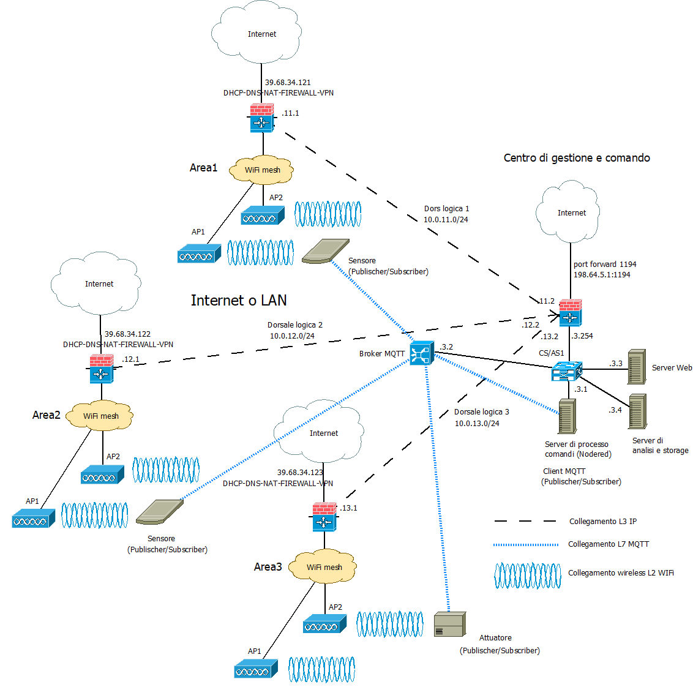
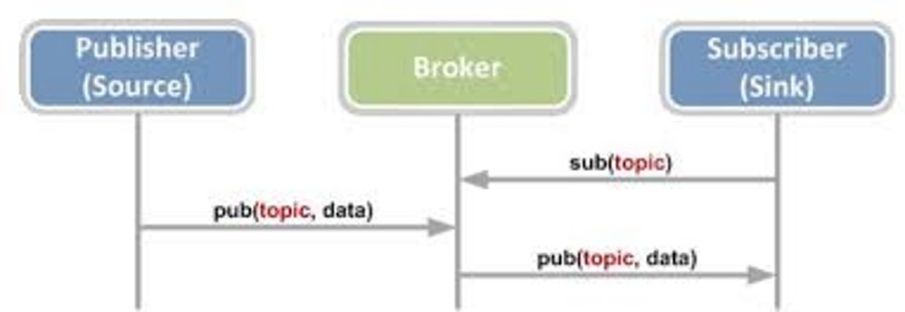

>[Torna a reti di sensori](sensornetworkshort.md#classificazione-delle-tecnologie-wsn-in-base-a-velocità-e-copertura)

- [Dettaglio architettura Ethernet](archeth.md)
- [Dettaglio architettura Zigbee](archzigbee.md)
- [Dettaglio architettura BLE](archble.md)
- [Dettaglio architettura WiFi infrastruttura](archwifi.md)
- [Dettaglio architettura LoraWAN](lorawanclasses.md) 


## **Caso d'uso rete wiFi Mesh**

Una rete **Wi-Fi mesh** è un sistema di rete wireless progettato per fornire una copertura Wi-Fi estesa che consiste di più AP che però non sono connessi all'infrastruttura di una LAN cablata tranne uno detto **gateway**. Una rete Wi-Fi mesh è una **soluzione avanzata** per estendere la copertura Wi-Fi e migliorare l'affidabilità della connessione in **ambienti complessi** nei quali risulta essere problematica la realizzazione di **dorsali cablate** verso gli AP. Con la capacità di **auto-configurarsi**, gestire il **roaming continuo** e fornire una **copertura scalabile**, le reti mesh rappresentano una scelta preferibile per chi necessita di una connettività robusta e senza interruzioni su aree estese.

Per il resto, ha le stesse caratteristiche di una rete WiFi di tipo infrastruttura, tranne che per la presenza di un **gateway** con mera funzione di inoltro dei pacchetti tra la rete mesh wireless e l'infrastruttura cablata.

**Componenti** di una Rete Wi-Fi Mesh sono:
- **Router Principale (Gateway)**: È il punto di ingresso alla rete e spesso è connesso direttamente al modem Internet. Gestisce la connessione tra la rete locale e Internet.
- **Nodi Mesh (Satellite o Extender)**: Sono dispositivi aggiuntivi che si collegano senza fili al router principale o tra di loro. I nodi cooperano per distribuire il segnale Wi-Fi in modo uniforme in tutta l'area di copertura.
- **Controller della rete mesh**, è un **server** che occupa della creazione e gestione delle funzioni di inoltro nei vari nodi (come bridge o come router), della gestione dell'indirizzamento di rete, della gestione dei protocolli di routing, della impostazione centralizzata di interfacce logiche e parametri radio, della assegnazione centralizzata degli indirizzi IP, dell'assegnazione automatica dei canali in modo da minimizzare le interferenze reciproche tra gli AP, dell'aggiornamento centralizzato dei FW dei vari AP, della gestione dei protocolli di autenticazione, delle funzioni di logging, delle funzioni di firewall, della creazione di hotspot, ecc..

A parità di architettura, le reti WiFi mesh si differenziano per il **tipo di inoltro** dei dati tra i vari nodi: **Bridge mesh** e **Mesh ad hoc routed**.


### **Aspetti critici**

Elementi **critici** su cui **bilanciare convenienze** e saper fare delle **scelte argomentate** sono:
- schema fisico (**planimetria**) dell'infrastruttura con etichettatura univoca di tutti gli asset tecnologici di rete.
- tipologia di **divisione in gruppi** degli utenti.
- definizione delle **tecnologie dei dispositivi** chiave quali sensori/attuatori (stella, bus, singolo), gateway, link (dual radio, three radio), accesso radio (allocazione di servizi sincroni TDM, asincroni CSMA/CA o a basso ritardo slotted CSMA/CA) e loro dimensiona mento di  massima (quantità, numero di porte, banda, ecc.).
- eventuali vincoli normativi sulle tecnologie in uso come potenza, EIRP, ERP e duty cycle.
- schema logico (albero degli **apparati attivi**) di tutti i dispositivi di rete con il loro ruolo e i **link virtuali** astratti ai vari livelli della **pila ISO/OSI** (tipicamente L2, L3, L7)
- dislocazione di eventuali **gateway**.
- **subnetting** e definizione degli indirizzi dei vari gruppi di utenti, delle server farm, definizione degli indirizzi dei server.
- definizione del **tipo di routing** (statico o dinamico). In caso si scelga il **routing statico**, definizione delle **tabelle di routing** più significative.
- definizione della posizione del broker MQTT.
- definizione dei topic utili per i casi d'uso richiesti.
- definizione dei **messaggi JSON** per alcuni **dispositivi IoT** ritenuti significativi in merito a **comandi**, **stato** o **configurazione**.
- definizione (anche in pseudocodice) delle **funzioni del firmware** di bordo dei **dispositivi IoT**.

La **rete di distribuzione**, in questo caso, **coincide** con una **rete di reti IP**, in definitiva direttamente con **Internet** se le reti wifi sono **federate** e **remote**, cioè in luoghi sparsi in Internet. 

In questo caso non è necessario avere dei gateway con funzione di traduzione dalla rete di ditribuzione IP a quella dei sensori, dato che questa è anch'essa una rete IP.

## **Architettura di una rete di reti** 

Di seguito è riportata l'architettura generale di una **rete di reti** di sensori. Essa è composta, a **livello fisico**, essenzialmente di una **rete di accesso** ai sensori e da una **rete di distribuzione** che fa da collante di ciascuna rete di sensori.


### **Rete di distribuzione** 

La **rete di distribuzione**, in questo caso, **coincide** con una **rete di reti IP**, in definitiva direttamente con **Internet** se le reti wifi sono **federate** e **remote**, cioè in luoghi sparsi in Internet. 

In questo caso non è necessario avere dei gateway con funzione di traduzione dalla rete di ditribuzione IP a quella dei sensori, dato che questa è anch'essa una rete IP.

## **Rete di reti wifi** 

L'albero degli **apparati attivi** di una rete di sensori + rete di distribuzione + server di gestione e controllo potrebbe apparire:



Il **broker MQTT** può essere installato in cloud, in una Virtual Private network, oppure On Premise direttamente nel centro di gestione e controllo. 

Il **gateway All-In-One** potrebbe essere un dispositivo con **doppia interfaccia**, modem **UMTS** per l'accesso alla rete di distribuzione su **Internet**, **WiFi** verso la **rete di sensori**. Può essere utile per realizzare un **gateway WiFi da campo** da adoperare:
- in **contesti occasionali** (fiere, eventi sportivi, infrastrutture di emergenza, grandi mezzi mobili).
- in contesti simili ma **dispersi** in aree geografiche molto distanti tra loro e coperte solo dalla **rete cellulare** terrestre della telefonia mobile o dai **satelliti in orbita bassa (LEO)**.
  
##  **Canali di comunicazione principali in una rete di sensori**

**In sintesi**, sono necessari almeno **due canali** di comunicazione che, insieme, complessivamente, realizzano la **comunicazione tra sensori e gestore** delle informazioni:
- **tra sensori e gateway** verso la LAN realizzato dalle **sottoreti dei sensori**:
    - **A filo** con accesso:,
        - **singolo dedicato**: un filo o un canale per sensore in tecnologia SDM o TDM (multiplexer, UART, porta analogica, porta digitale)
        - **multiplo condiviso** cioè tramite mezzo broadcast (BUS) con **arbitraggio** di tipo **master slave** (Modubus, Dallas, I2C, SPI) o **peer to peer** (CanBUS, KNX, ecc) o misto (ProfiBUS). 
        - Spesso **bidirezionale** specie se in presenza di attuatori
        
    - **Senza filo** cioè wireless con accesso:
        - **singolo dedicato**: link punto-punto analogico digitalizzato con AX25 oppure digitale con un radio modem (Yarm ACME Systems, 6LoWPAN, LoRa) resi full duplex con l'uso di multiplazioni FDM o TDM.
        - **Multiplo e condiviso** (BUS) di tipo half duplex reso bidirezionale (full duplex) tramite tecniche asincrone CSMA/CA (Zigbee, wifi, LoRa) o sincrone TDMA (Zigbee, Bluetooth).
- **Tra gateway e gestore** delle informazioni realizzato dalla **rete di distribuzione**:
     - Tipicamente tramite **LAN ethernet** e architettura **Client/Server**
     - Interazioni di tipo PUSH o PULL
     - Paradigma Request/Response (HTTPS, COAP), Publish/Subscriber (MQTT) oppure canale persistente bidirezionale (BSD socket o WebSocket)
       
## **Broker MQTT** 

Il **broker MQTT** è solo una delle tante soluzioni possibili per realizzare un **canale multicast** di livello **applicativo** tramite cui un utente col ruolo di **publisher** è in grado di notificare una **replica** dello stesso messaggio a più **subscribers**. E' utile per:
- inoltro dei comandi da un **sensore di comando** su una rete di tipo A (ad es. LoRaWAN) ad un attuatore su una rete diversa di tipo B (ad es. Zigbee)
- inoltro di una **misura** da un **sensore ambientale** su una rete di tipo A (ad es. LoRaWAN) ad un **pannello di controllo** su una rete diversa di tipo B (tipicamente IP)
- inoltro di una **misura** da un **sensore ambientale** su una rete di tipo A (ad es. LoRaWAN) ad un **server di gestione** su una rete diversa di tipo B (tipicamente IP)

Il **canale applicativo** su cui vengono inviati i messaggi sono quindi i **topic**. Su un certo **topic** il dispositivo con il ruolo di **output** agisce come un **publisher**, mentre quello con il ruolo di **input** agisce come un **subscriber**.

Gli utenti, in ogni caso, si comportano tutti come **client** poiché sono loro che **iniziano la connessione** con il broker e non il viceversa. 



**Fasi** del protocollo:
1. Il **Subscriber** dichiara presso il broker il proprio interesse a ricevere notifiche riguardo ad un certo argomento (topic) effettuando una chiamata **subscribe()**
2. il **publisher** pubblica un messaggio che riguarda un **certo topic** effettuando una chiamata **publish()**
3. Il **broker** inoltra il messaggio a tutti i subscriber interessati a **quel topic**

L'**ID MQTT** è un identificativo che permette di individuare un dispositivo ma non è un indirizzo di livello 3, non individua la macchina host in base al suo IP, piuttosto è un indirizzo di livello applicativo noto solo ad un server centrale, cioè il broker. Un dispositivo IoT non è tenuto a conoscere l'IP di tutti gli altri dispositivi ma solamente quello del broker. Il broker soltanto sa gli indirizzi di tutti i dispositivi, conoscenza che acquisisce durante la fase di **connessione** di un client al broker, momento in cui avviene anche il recupero del'**socket remoto** del client.

Il **broker**, dal canto suo, **associa** ogni **topic** con tutti gli **ID** che sono registrati presso di esso come **subscriber**. Questa associazione è utilizzata per smistare tutti i messaggi che arrivano con un certo topic verso tutti gli ID che ad esso sono associati. Il topic diventa così un **indirizzo di gruppo**. La particolarità di questo indirizzo è che è **gerarchico** secondo una struttura ad **albero**, cioè gruppi di dispositivi possono essere suddivisi in **sottogruppi** più piccoli estendendo il nome del path con un **ulteriore prefisso**, diverso per ciascun sottogruppo. L'operazione può essere ripetuta ulteriormente in maniera **ricorsiva**.

**Ad esempio**, posso individuare le lampade della casa con il path ```luci``` e accenderle e spegnerle tutte insieme, ma posso sezionarle ulteriormente con il path ```luci/soggiorno``` con il quale accendere o spegnere solo quelle del soggiorno oppure con il path ```luci/soggiorno/piantane``` con il quale fare la stessa cosa ma solo con le piantane del soggiorno.

Osservando l'albero degli **apparati attivi**, si vede bene che, nelle **reti WiFi**, il **client MQTT** (con il ruolo di **publisher** o di **subscriber**) è sempre il **dispositivo IoT**. 

In **generale**, su reti **non IP**, i **client MQTT** (con il ruolo di **publisher** o di **subscriber**) sono sempre i **gateway di confine** della **rete di sensori**. Le uniche reti di sensori che non hanno bisogno di un gateway di confine che sia, nel contempo anche client MQTT, sono le reti IP. Esistono ancora i gateway nelle **reti IP** ma con **scopi diversi** da quello di **realizzare** un **client MQTT**. Nelle **reti IP**, il **client MQTT** è, normalmente, direttamente **a bordo** del **dispositivo** sensore dotato di indirizzo IP (**MCU**).

Il **vantaggio** del **broker MQTT** è quello di poter gestire in modo semplice e **standardizzato** lo **smistamento** (inoltro) delle **misure** e dei **comandi** tra i vari portatori di interesse (stakeholder) di un **cluster** di reti di sensori, siano essi utenti umani, interfacce grafiche, server applicativi diversi o altri dispositivi IoT.

### **Alternative ad MQTT**

Esistono molte altre soluzioni che magari sono più semplici e graficamente accattivanti ma che passano per portali proprietari o per servizi cloud a pagamento e nulla aggiungono di didatticamente rilevante ai nostri discorsi. Normalmente sono basate su webservices realizzati con protocolli Request/Response quali **HTTPS** e **COAP**.

## **Server di gestione** 

E' un **client** del **broker MQTT** con funzioni sia di **publisher** che di **subscriber** per:
- realizzazione delle **interfacce web** per la gestione e la visualizzazione dei dati dei dispositivi e delle applicazioni agli utenti.
- elaborazioni a **breve termine** quali la generazione di **statistiche** per la determinazione di **soglie** o **predizioni** per:
    - realizzazione da remoto della **logica di comando** (processo dei comandi) degli **attuatori**
    - **report** per l'assistenza alle decisioni
    - generazioni di **allarmi**
    - realizzazione di **ottimizzazioni** della gestione o del consumo di risorse, energia o materie prime
    - contabilizzazione dei consumi (**smart metering**)
    - controllo e sorveglianza in tempo reale dello **stato** di impianti o macchinari
    - segnalazione dei **guasti** o loro **analisi predittiva** prima che accadano
    - **consapevolezza situazionale** di ambienti remoti, difficili, pericolosi o ostili (https://it.wikipedia.org/wiki/Situational_awareness)
- elaborazioni a **lungo termine** quali:
    - analisi dei dati per la realizzazione di studi scientifici
    - elaborazione di nuovi modelli statistici o fisici o biologici dell'ambiente misurato

## **Sensore**

### Fasi Principali del Firmware di un Sensore che Utilizza MQTT

1. **Inizializzazione dei Parametri di Connessione**
   - Configurare i parametri del broker MQTT (indirizzo, porta, username, password).
   - Configurare il pin del sensore di temperatura e l'intervallo di lettura.

2. **Connessione al Broker MQTT**
   - Stabilire la connessione con il broker MQTT utilizzando i parametri configurati.

3. **Inizializzazione del Sensore di Temperatura**
   - Configurare il pin del sensore per la lettura della temperatura.

4. **Ciclo Principale**
   - Ottenere il tempo corrente.
   - Leggere il valore della temperatura dal sensore.
   - Creare un messaggio con il valore della temperatura.
   - Inviare il messaggio al broker MQTT se è trascorso l'intervallo prefissato.
   - Aggiornare il timestamp dell'ultima lettura inviata.

5. **Attesa Prima della Prossima Iterazione**
   - Attendere un breve periodo (ad esempio, 1 secondo) prima di ripetere il ciclo.

Per il dettaglio sulla realizzazione del firmware vedi [Firmware](sensorfw.md).

## **Rete in modo infrastruttura** 

Una architettura di rete wireless WiFi è può essere realizzata in tre modalità:
- **Modalità Infrastruttura** di tipo master/slave
- **Modalità ad hoc** di tipo peer to peer 
- **Modalità Wifi Direct**  di tipo Punto – punto

Le architetture **più diffuse** in ambito aziendale ed **outdoor** sono di **tipo Modalità wifi mesh** e sono composte di una rete magliata di dispositivi (router o bridge wifi) collegati attraverso un nodo gateway ad un rete cablata o wireless che fornisce l'accesso ad Internet.

Gli **elementi** di una rete in modo infrastruttura sono:
- **nodi di aggregazione**, cioè nodi che, oltre alle **dorsali radio** verso altri nodi, hanno pure delle **interfacce radio** verso i dispositivi client. **Inoltrano** il traffico dati da/verso i dispositivi degli **utenti** finali. 
- **nodi di transito**, cioè nodi che posseggono solamente interfacce radio dedicate alle **dorsali radio** e che quindi svolgono solo le funzioni di **router**. **Inoltrano** il traffico dati solo verso altri **nodi**. 
- **un gateway**, è l'unico nodo della rete mesh che è **cablato** ed è il **punto di accesso** alla LAN aziendale attraverso la quale raggiungere il **router** di confine verso **Internet**.

### **Sistemi multicanale (multiradio)**


Architettura del sistema di rete Wireless Mesh multicanale. Il **numero minimo** di canali necessario **è 2**. Un sistema a **3 canali** offre maggiore **flessibilità** a prezzo di un maggiore costo.

Ogni **collegamento tra due nodi** rappresenta una comunicazione radio diretta e dedicata sul canale numerato con l'etichetta sul link. In questa esempio, ogni nodo è dotato di **2 NIC wireless**. Pertanto il numero di canali utilizzati da ciascun nodo contemporaneamente non può essere superiore a 2; la rete nel suo complesso utilizza **5 canali** distinti.

I router e i nodi mesh Wi-Fi 6 (802.11ax) spesso supportano più bande radio, tipicamente a 2.4 GHz, 5 GHz, e in alcuni casi 6 GHz (Wi-Fi 6E). Queste bande possono essere utilizzate in modo diverso per ottimizzare la rete:
1.	**Banda 2.4 GHz**: Ha una portata più lunga ma velocità inferiore, utile per dispositivi lontani o per attraversare ostacoli come muri.
2.	**Banda 5 GHz Band**: Ha una portata più corta ma velocità più alta, ideale per connessioni ad alta velocità a distanze moderate.
3.	**Banda 6 GHz (Wi-Fi 6E)**: Offre molte più canali e minore congestione, con velocità elevate e latenza ridotta, ma con una portata limitata.

Il **backhaul Wi-Fi** è il collegamento **wireless** tra i **nodi** che partecipano ad una **dorsale principale** ad alto traffico di una rete mesh e il **gateway**.

### **Tipi di Backhaul**

Il **backhaul Wi-Fi** è il collegamento **wireless** tra i **nodi** che partecipano ad una **dorsale principale** ad alto traffico di una rete mesh e il **gateway**. Il gateway è l'unico dispositivo della rete mesh che è **cablato** su una rete LAN, generalmente per ottenere l'accesso a Internet. In una rete mesh, i nodi (che possono essere router o access point) comunicano tra loro per estendere la copertura Wi-Fi, e il backhaul è essenziale per mantenere questa comunicazione fluida e efficiente. Le **Tipologie di Backhaul** sono:
- **Backhaul Wireless**: Utilizza la connessione Wi-Fi stessa per collegare i nodi mesh tra loro. E'Semplice da configurare, nessun cablaggio necessario. Ma larghezza di banda disponibile può essere ridotta, specie se il canale Wi-Fi è condiviso tra il traffico client e il traffico backhaul. Può anche essere soggetto a interferenze e degrado del segnale.
- **Backhaul Cablate (Ethernet)**: Utilizza cavi Ethernet per collegare i nodi della rete mesh. Offre una connessione stabile e ad alta velocità, non influenzata da interferenze wireless. Consente di riservare tutta la larghezza di banda Wi-Fi per i dispositivi client. Soluzione più costosa.
- **Backhaul Powerline**: Utilizza le linee elettriche esistenti per trasmettere dati tra i nodi mesh. E' facile da configurare, non richiede nuovi cablaggi ma velocità e l'affidabilità possono variare in base alla qualità dell'impianto elettrico.


### **Applicazione del CFP in Reti Mesh**

In una **rete mesh**, il controllo del tempo di trasmissione attraverso CFP o tecniche simili può essere implementato per migliorare l'**efficienza del backhaul** e delle comunicazioni client. Ecco come potrebbe funzionare:
- **Configurazione del CFP sui backaul**: Gli access point (AP) o i nodi mesh possono essere configurati per utilizzare periodi di trasmissione **senza contesa** (o CFP) per le comunicazioni **backhaul**. Durante questi periodi, **solo i nodi mesh** partecipanti possono trasmettere dati tra loro, in slot di tempo preassegnati, riducendo le interferenze e migliorando la qualità del collegamento. Si tratta, di fatto, di realizzare una multiplazione **TDM statica** solo per le **dorsali** verso il **gateway**.
- **Allocazione Dinamica**: Durante i periodi di contesa, i nodi mesh possono utilizzare tecniche come **OFDMA** (introdotto a partire dal wiFi6) per allocare dinamicamente subcanali e slot di tempo ai dispositivi client, ottimizzando l'uso dello spettro e **riducendo la latenza**.
- **Gestione della QoS**: Per applicazioni che richiedono alta qualità del servizio, come lo streaming video o le chiamate VoIP, i nodi mesh possono **riservare slot** di tempo specifici durante i CFP per garantire una trasmissione senza interruzioni e con bassa latenza.

### **Funzionalità Chiave di una implementazione multiradio**

Quando si vuole **selezionare** un AP Wi-Fi per una rete mesh ad **alte prestazioni**, potrebbe esse utile tenere in considerazione le seguenti funzionalità:
- **Tri-Band Support**: I sistemi mesh tri-band hanno tre radio: una per 2.4 GHz, una per 5 GHz, e una terza che può operare su 5 GHz o 6 GHz. Questo permette una maggiore flessibilità e prestazioni superiori, poiché una delle bande a 5 GHz o 6 GHz può essere utilizzata esclusivamente per il backhaul.
- **Beamforming**: il beamforming può migliorare la copertura e le prestazioni dei dispositivi collegati dirigendo il fascio radio verso determinati punti dello spazio. Questa capacità di modulare elettronicamente la direttività di un'antenna permette di estendere notevolmente la copertura fino a 200-250m. Vedi [Smart antenna](multiplazioni.md#sdm-nelle-smart-antenna).
- **Wi-Fi 6/6E**: dispositivi che supportano Wi-Fi 6 o 6E per beneficiare di tecnologie più recenti, come OFDMA, MU-MIMO, e canali a 160 MHz. che offrono il vantaggio decisivo delle **latenze molto basse** necessarie per le applicazioni di **controllo remoto**. Vedi [Modulazioni radio](accessoradio.md#ofdm).
- **Backhaul Dedicato**: alcuni sistemi mesh utilizzano una radio dedicata per il backhaul (la connessione tra i nodi mesh), mantenendo le altre radio libere per il traffico dei dispositivi client. Ad esempio, il backhaul potrebbe operare sulla banda a 5 GHz o 6 GHz per sfruttare velocità elevate e bassa interferenza.
- **Dynamic Band Steering**: La rete mesh può dirigere dinamicamente i dispositivi verso la banda più appropriata, migliorando l'efficienza della rete. I dispositivi più vicini ai nodi mesh possono essere indirizzati verso le bande a 5 GHz o 6 GHz, mentre quelli più lontani possono usare la banda a 2.4 GHz.
- **Facilità di Configurazione**: meglio scegliere dispositivi con app di gestione intuitive e supporto tecnico affidabile.

### **Autenticazione utente presso un nodo di aggregazione**

L'autenticazione di un nodo Wi-Fi è un processo fondamentale per garantire che solo gli utenti autorizzati possano connettersi alla rete. Ecco un elenco dei principali tipi di autenticazione utilizzati in un AP Wi-Fi, con una breve descrizione di ciascuno:

1. **Autenticazione Aperta (Open Authentication)**:È il metodo di autenticazione più semplice e non richiede alcuna chiave di sicurezza o password. Qualsiasi dispositivo può connettersi alla rete senza restrizioni. Uso comune: Reti pubbliche gratuite come quelle in caffè, biblioteche, o hotspot pubblici.
2. **Autenticazione con chiave condivisa (Shared Key Authentication)**: Utilizza una chiave di rete (password) condivisa tra l'AP e i client. Solo i dispositivi che conoscono questa chiave possono connettersi alla rete. Uso comune: Reti domestiche o piccole reti aziendali dove la sicurezza è basata su una singola chiave di rete.
3. **WEP (Wired Equivalent Privacy)**: Uno dei primi standard di sicurezza Wi-Fi, utilizza chiavi statiche per crittografare il traffico di rete. È considerato insicuro e obsoleto a causa delle sue vulnerabilità. Uso comune: Praticamente non più utilizzato a causa della sua insicurezza. È stato sostituito da metodi più sicuri.
4. **WPA (Wi-Fi Protected Access)**: Un miglioramento rispetto a WEP, utilizza chiavi dinamiche e un sistema di crittografia più robusto. Tuttavia, WPA è stato anch'esso superato da WPA2. Uso comune: Reti che non possono supportare WPA2 ma richiedono una maggiore sicurezza rispetto a WEP.
    - **WPA2 (Wi-Fi Protected Access 2)**: Standard di sicurezza attualmente più diffuso. Utilizza l'algoritmo di crittografia AES (Advanced Encryption Standard) e chiavi dinamiche. WPA2-Personal (PSK): Utilizza una chiave pre-condivisa (pre-shared key). Adatto per reti domestiche e piccole reti aziendali.
    - **WPA2-Enterprise**: Utilizza un server RADIUS per l'autenticazione degli utenti, fornendo una maggiore sicurezza. Adatto per grandi reti aziendali. Uso comune: La maggior parte delle reti Wi-Fi moderne, sia domestiche che aziendali.
    - **WPA3**: L'ultima versione del protocollo WPA, offre miglioramenti in termini di sicurezza rispetto a WPA2, inclusa una protezione più robusta contro gli attacchi a dizionario e Forward Secrecy. **WPA3-Personal**: Utilizza Simultaneous Authentication of Equals (SAE) per una maggiore sicurezza della chiave pre-condivisa.**WPA3-Enterprise**: Migliora la sicurezza rispetto a WPA2-Enterprise, offrendo una crittografia più robusta e una gestione delle chiavi più sicura. E' di uso comune nelle reti di nuova generazione che richiedono la massima sicurezza disponibile.
8. **802.1X/EAP (Extensible Authentication Protocol)**: Utilizzato principalmente nelle reti WPA2-Enterprise e WPA3-Enterprise. Richiede un server di autenticazione (RADIUS) e supporta vari metodi di autenticazione come certificati digitali, smart card, token hardware e credenziali di nome utente/password. Uso comune: Grandi reti aziendali e ambienti dove è necessaria una gestione avanzata delle credenziali di accesso e autenticazione forte. E' la più sofisticata, per dettagli vedi [Autenticazione 802.1X](radius.md)

### **Bridge mesh network**

Nelle reti Wifi **Bridge mesh**, si sfrutta la **proprietà** (comune a tutti i dispositivi WiFi) di possedere un **bridge interno**, realizato in SW, che collega i **link wireless** appartenenti ad interfacce **radio diverse** (per esempio, una a 2.4 GHz ed una a 5 GHz). Quindi, un **nodo WiFi** è, a tutti gli effetti, un dispositivo **IS** di **livello 2** della pila **ISO/OSI**. 

I **bridge**, in una rete dati, posseggono **funzioni** analoghe a quelle di uno switch HW (inoltro trame) e **tecnologie** analoghe a quelle degli switch HW (VLAN). La **disponibilità** delle **VLAN** permette di portare a **soluzione** una **esigenza tipica** anche nelle reti wired da ufficio: la **separazione** logica degli utenti in gruppi isolati in base al tipo di **servizio** piuttosto che in base alla **vicinanza** fisica nello spazio dei loro utenti. Le VLAN permettono agevolmente la gestione di **gruppi** di utenti sparsi a **macchia di leopardo** su **tutta** l'infrastruttura, **wired** o **wireless** che sia.


#### **Vantaggi**

In definitiva, i bridge **inoltrano** direttamente **trame MAC**, e la rete complessiva è una **LAN** gestita dal **protocollo STP** che evita i loop a livello data link (L2) pur mantenenedo la ridondanza al livello fisico (L1). I **vantaggi** di questa configurazione sono gli stessi di quella di una rete **wireless infrastruttura** composta da SW:
- di essere **autoconfigurante** e quindi molto semplice
- la possibilità di permettere di creare **una sola subnet** che includa tutti i dispositivi **client**.
- la possibilità di poter **partizionare** la rete per **gruppi di utenti** in base al **tipo di servizio** piuttosto che in base alla loro **dislocazione fisica** utilizzando la tecnologia delle **VLAN**. Le VLAN diventano la **scelta obbligata** quando i **gruppi di utenti** da separare sono **sparsi** a macchia di leopardo su tutta la rete.

#### **Esempio**

Si vogliono separare i **servizi di produzione** agricola con i suoi **sensori** sparsi su tutto l'agro, dai **servizi di mobilità** ai tecnici agronomi dotati di tablet sui loro mezzi con i quali eseguono il controllo giornaliero degli impianti di competenza, consentendo anche di dedicare una gestione separata al traffico dei **servizi di videosorveglianza**. 


La **separazione** dei gruppi di utenti in base alla **dislocazione fisica** sarebbe evidentemente impossibile, mentre sarebbe **effettiva** la separazione mediante **VLAN** dislocate su una infrastruttura **bridged**.

#### **Definizione dei gruppi mediante VLAN**

La **definizione** dei gruppi si può fare con una dislocazione a **macchia di leopardo** delle **interfacce** di accesso alla diverse VLAN, aventi **ssid statici** diversi o uno unico ma **dinamico** ([Autenticazione 802.1X](radius.md#gestione-dinamica-degli-ssid)). Gli **host** possono collegarsi all'**ssid** di una certa VLAN su **ogni bridge** wireless. La loro **separazione** avviene **dopo**, su un **router** di confine collegato con un **backaul** capace di creare il **trunking** dei flussi sul router (**inter vlan routing** in modo **router on a stick**). Le **dorsali** tra i vari bridge devono essere configurate come dorsali di **trunk** (802.1Q) in modo tale che portino il traffico aggregato di **tutte le VLAN**.

#### **Esempio di Configurazione**

Per configurare una rete con 3 router WiFi mesh, in cui ogni router ha una dorsale (backhaul) con canale di comunicazione dedicato e due router aggregano sensori su due subnet diverse, possiamo seguire questo schema:

I Router per aggregazione dei sensori sono R2 e R3. Per le subnet possiamo usare un blocco di indirizzi privati come 192.168.0.0/16 e dividerlo come segue:

##### **Subnetting**

Subnet per la dorsale dei router mesh (VLAN amministrativa):
- VLAN 10
- SSID: Mesh_Backhaul
- S1: 192.168.1.0/24
- R1: 192.168.1.1
- R2: 192.168.1.2
- R3: 192.168.1.3

Subnet per i sensori collegati a R2.
- VLAN 20
- SSID: Sensors_R2
- S2: 192.168.2.0/24 
- GW2 (R2): 192.168.2.254
- RNG2: 192.168.2.1 - 192.168.2.253

Subnet per i sensori collegati a R3.
- VLAN 30
- SSID: Sensors_R3
- S3: 192.168.3.0/24 
- GW3 (R3): 192.168.3.254
- RNG3: 192.168.3.1 - 192.168.3.253

##### **Routing statico**

R1 possiede 3 indirizzi su ciascuna subnet:
- S1 (VLAN 10): 192.168.1.254  SM1: 255.255.255.0
- S2 (VLAN 20): 192.168.2.254  SM2: 255.255.255.0
- S3 (VLAN 30): 192.168.3.254  SM3: 255.255.255.0

Non è necessario impostare le tabelle di routing in quanto le subnet S1, S2, S3 sono, su R1, direttamente connesse.


#### **Svantaggi**

Però, nonostante la sua semplicità, questa non è la configurazione preferita. Infatti, **pesano negativamente**:
- il fatto di realizzare un albero di **instradamento unico** che è ottimo solo per il gateway che di questo è la **radice**, mentre per gli altri nodi non calcola realmente il percorso minimo possibile.
- il fatto che gli **indirizzi MAC** non siano **gerarchici** non permette di **partizionare la rete** in subnet con **gruppi** di dispositivi dislocati in aree **delimitate** e presidiate da **router**, circostanza che impedisce di migliorare ulteriormente la **sicurezza** e il livello di **controllo** di accesso con **regole** di filtraggio basate sull'indirizzo di **sorgente**.


### **Routed ad hoc mesh network**

Nelle reti Wifi **Routed mesh**, si sfrutta la **proprietà** (comune a tutti i dispositivi WiFi) di possedere un **router interno**, realizato in SW, che collega i **link wireless** appartenenti ad interfacce **radio diverse** (per esempio, una a 2.4 GHz ed una a 5 GHz). Quindi, un **nodo WiFi** è, a tutti gli effetti, un dispositivo **IS** di **livello 3** della pila **ISO/OSI**. 


Il routing è basato su **indirizzi IP** che, essendo **gerarchici** , permettono di **partizionare la rete** in subnet con **gruppi** di dispositivi dislocati in aree **delimitate** e presidiate da **router**, cioè da dispositivi in grado filtrare gli accessi con **regole** basate sull'indirizzo di **sorgente**. Questo è un vantaggio di sicurezza perchè delle **ACL** sui router potrebbero abilitare l'accesso a certe **aree fisiche** (corrispondenti a certe subnet di destinazione) semplicemente controllando la **subnet di appartenenza** della sorgente.

### **Esempio**

Se si volessero separare un'**area di produzione** agricola con accesso riservato solamente ai **sensori/attuatori**, da un'area dedicata all'**accesso degli impiegati** amministrativi e da un altra ancora dedicata all'**accesso degli ospiti** esterni per le conferenze, allora la **separazione** dei gruppi di utenti in base alla **dislocazione fisica** potrebbe essere una **soluzione efficace**. 

#### **Definizione dei gruppi mediante router**

La **definizione** dei gruppi si può fare con una dislocazione **fisicamente contigua** degli host, cioè gli **host** di un **certo gruppo** sono vincolati ad effettuare l'accesso solo presso **un certo router**. La **separazione** avviene **subito**, sul **router** wireless di accesso, grazie all'assegnazione di indirizzi appartenenti a **subnet diverse**.
  
La **separazione** degli utenti nella soluzione **routed** può essere realizzata solamente se i **gruppi di host** da dividere sono racchiusi in **subnet IP** che fanno capo ad un certo gruppo di router di aggregazione (al limite uno solo) che coprono un'**area delimitata** della rete. A queste subnet si accede con **ssid dedicati** a ciascun gruppo e protetti da **password** per autenticare gli utenti del gruppo. Gli **host della subnet** hanno però il **vincolo** di dover essere **spazialmente prossimi** ai router di aggregazione loro assegnati per potere accedere alla rete mesh.

#### **Esempio di Configurazione**

Per configurare una rete con 3 router WiFi mesh, in cui ogni router ha una dorsale (backhaul) con canale di comunicazione dedicato e due router aggregano sensori su due subnet diverse, possiamo seguire questo schema:

I Router per aggregazione dei sensori sono R2 e R3. Per le subnet possiamo usare un blocco di indirizzi privati come 192.168.0.0/16 e dividerlo come segue:

##### **Subnetting**

Subnet per la dorsale dei router mesh:
- SSID: Mesh_Backhaul
- S1: 192.168.1.0/24
- R1: 192.168.1.1
- R2: 192.168.1.2
- R3: 192.168.1.3

Subnet per i sensori collegati a R2.
- SSID: Sensors_R2
- S2: 192.168.2.0/24 
- GW2 (R2): 192.168.2.254
- RNG2: 192.168.2.1 - 192.168.2.253

Subnet per i sensori collegati a R3.
- SSID: Sensors_R3
- S3: 192.168.3.0/24 
- GW3 (R3): 192.168.3.254
- RNG3: 192.168.3.1 - 192.168.3.253

##### **Routing statico**

Su R1 configurare:
- S2: 192.168.2.0/24 via 192.168.1.2
- S3: 192.168.3.0/24 via 192.168.1.3

Su R2 configurare:
- S3: 192.168.3.0/24 via 192.168.1.3

Su R3 configurare:
- S2: 192.168.2.0/24 via 192.168.1.2

#### **Vantaggi**

Una caratteristica delle reti ad hoc è di non essere statiche ma completamente **autoconfiguranti** nel senso che:
- l'assegnazione degli indirizzi IP dei nodi e dei link può avvenire automaticamente attraverso diversi metodi, inclusi meccanismi di:
    - protocolli di **auto-configurazione**. Si possono autoassegnare indirizzi **uguali** a link diversi di uno stesso **router** (semplificandone la gestione) utilizzando indirizzi di tipo **Link Local**.
    - protocolli di **Auto-configurazione Distribuita** come Stateless Address Autoconfiguration (**SLAAC**), possono essere utilizzati in reti IPv6 ad hoc per permettere ai nodi di generare autonomamente i propri indirizzi IP basati su prefissi Globali Comuni (**GUA**) e su identificatori di host locali unici (**EUI64**).
    - Indirizzamento **Basato su Algoritmi**. Alcuni algoritmi distribuiti possono essere utilizzati per assegnare indirizzi IP in modo **coordinato**. Questi algoritmi permettono ai nodi di **negoziare** indirizzi IP univoci basati su regole predefinite, riducendo il rischio di conflitti. Un esempio è il protocollo Ad Hoc IP Address Autoconfiguration (**AAP**), che facilita la distribuzione di indirizzi IP in modo dinamico e decentralizzato.
  
Queste soluzioni per la gestione degli indirizzi non rendono necessario impostare esplicitamente un **subnetting statico** per ogni dorsale, anche se è possibile, in qualche misura, introdurlo.

Inoltre, nelle reti mesh WiFi ad hoc, il **routing** è generalmente **automatico**, utilizzando protocolli di **routing dinamico**, che consentono ai nodi di scoprire e mantenere le rotte in modo dinamico, cioè adattandosi nel tempo ai cambiamenti nella topologia della rete, in modo da garantire  **resilienza** (in caso di guasti o interferenze) e **scalabilità** (in caso dell'aggiunta di nuovi nodi). Sono in genere di **due tipi** differenti:
- basati su protocolli **DV** (Distance Vector) di tipo **reattivo** poiché ricerca dei percorsi nella rete solo su richiesta, risparmiando l'energia di conoscere in anticipo il percorso verso nodi poco usati. Molto usato è **AODV** (Ad hoc On-Demand Distance Vector) o altri protocolli specifici per le reti mesh. Il vantaggio principale di AODV è l'**efficienza** perchè non  genera traffico nel caso di percorsi già stabiliti e funzionanti, proprietà che lo rende anche molto **economico** come consumo di energia.
- basati su protocolli **LSP** (Link State Packet) di tipo **pro-attivo**, cioè che conoscono in anticipo i percorsi **prima del loro uso**. Un protocollo disponibile su molti router è **OLSR** (Optimized Link State Routing), protocollo di routing IP ottimizzato per le reti mobili ad hoc, che può essere utilizzato anche su altre reti wireless ad hoc. Soluzione **più veloce** rispetto alla precedente, ma dispendiosa come calcolo ed energia.

### **Bridge group**

All'**interno** di ogni **AP**, in realtà, sono sempre presenti uno o più **bridge** realizzati in SW (creati  mediante il comando  bridge-group x) che hanno il compito di **associare** il traffico delle **interfacce wireless**  con le **interfacce Ethernet** della reta cablata.

Le **interfacce wireless** fisiche sono divise in più **sotto interfacce** logiche, ciascuna con il proprio **SSID** (veri e propri Hub wireless separati da un ssid).

Anche le interfacce ethernet fisiche sono divise in più **sotto interfacce** logiche, ciascuna con il proprio vlan id.


Partendo dall'alto verso il basso, possiamo vedere che:
- Gli SSID sono mappati alle VLAN.
- Le VLAN sono mappate alle sottointerfacce radio.
- Le sottointerfacce radio sono mappate ai gruppi bridge.
- Anche le sottointerfacce Ethernet sono mappate ai gruppi bridge.
- Al dispositivo viene assegnato un indirizzo IP legato al gruppo bridge 1 per renderlo raggiungibile per manutenzione.

Esempio di configurazione di due radio (a 2.4 GHz e 5 GHz) per gestire due SSID ciascuna associati a due VLAN diverse:

#### **Configurazione globale**
```C++
dot11 ssid Corporate
   vlan 10
!
dot11 ssid Guest
   vlan 20
!
bridge irb
```

Un **BVI (Bridge Virtual Interface)** in un Access Point WiFi è un'**interfaccia logica** del bridge utilizzata per ottenere un unico punto di gestione per l'**indirizzamento IP** e altre configurazioni di rete. Con 2 bridge accade che il **bridge group 1** avrà il suo **BVI1**, mentre il **bridge group 2** avrà il suo **BVI2**. 

Due funzioni rilevanti vengono eseguite nello snippet sopra. Innanzitutto, i nostri due SSID (Corporate e Guest) vengono definiti e associati alle VLAN. In secondo luogo, il **routing e il bridging integrati (IRB)** vengono **abilitati** con il comando bridge irb. Ciò consente di definire gruppi di bridge e un BVI.

#### **Configurazione radio 0**
```C++
interface Dot11Radio0
 no ip address
 !
 ssid Corporate
 !
 ssid Guest
 !
 mbssid
!
interface Dot11Radio0.10
 encapsulation dot1Q 10
 bridge-group 1
!
interface Dot11Radio0.20
 encapsulation dot1Q 20
 bridge-group 2
```

#### **Configurazione radio 1**
```C++
 interface Dot11Radio1
 no ip address
 !
 ssid Corporate
 !
 ssid Guest
 !
 mbssid
!
interface Dot11Radio1.10
 encapsulation dot1Q 10
 bridge-group 1
!
interface Dot11Radio1.20
 encapsulation dot1Q 20
 bridge-group 2
```

#### **Configurazione IP**
```C++
 interface BVI1
 ip address 192.168.10.123 255.255.255.0
 no ip route-cache
```
Questa configurazione mantiene il traffico wireless appartenente a un SSID isolato dal traffico appartenente all'altro mentre transita l'access point dall'interfaccia cablata all'interfaccia wireless e viceversa. Nota che poiché non c'è un'interfaccia BVI2, l'access point non ha alcun indirizzo IP raggiungibile direttamente dall'SSID Guest.

### **Link budget**

Tra un nodo e l'altro, soprattutto per grandi distanze (superiori al KM) potrebbe essere utile valutare il cosidetto **link budget**, overossia la somma dei guadagni e delle attenuazioni lungo il percorso fino al ricevitore. L'obiettivo è valutare il rispetto del **vincolo finale** sul ricevitore, cioè che la potenza ricevuta sia maggiore della **sensibilità minima** del ricevitore più un certo **margine di sicurezza** per tenere conto del **fading** ambientale (multipath oppure attenuazione atmosferica) che è una quantità che varia, più o meno rapidamente, col **tempo**. Per dettagli sul calcolo vedere https://www.vincenzov.net/tutorial/elettronica-di-base/Trasmissioni/link.htm. Oppure si possono usare dei calcolatori online di link budget LOS radio quali https://www.daycounter.com/Calculators/Friis-Calculator.phtml, oppure https://www.pasternack.com/t-calculator-friis.aspx. Rimane assodato che si tratta soltanto di un **calcolo di massima** che fornisce indicazioni sulla fattibilità teorica di un collegamento che, se positiva, richiede attente e ripetute **verifiche sul campo** nelle condizioni di esercizio previste per l'impianto.

## **Messaggi MQTT**

### **Messaggi confermati**

La **conferma** dei messaggi inviati da parte del ricevente normalmente non è necessaria nel caso dei **sensori**. Infatti, se un invio da parte di un sensore non andasse a buon fine, è inutile richiedere la ritrasmissione di un dato che comunque a breve arriva con una misura più aggiornata. 

La conferma, invece, è prevista per funzioni di **comando** o **configurazione**.  Ad esempio  nel caso di pulsanti, rilevatori di transito o allarmi in cui l'invio del messaggiò avviene sporadicamente e in maniera del tutto **asincrona** (cioè non prevedibile dal ricevitore), potrebbe essere auspicabile avere un feedback da parte del protocollo mediante un meccanismo di conferma basato su **ack**. Ma non sempre ciò è possibile.

La **conferma**, però, potrebbe pure essere gestita soltanto dal **livello applicativo** (non dal protocollo) utilizzando un **topic di feeedback** (o stato) per inviare il valore dello stato corrente subito dopo che questo viene interessato da un comando in ingresso sul dispositivo. 

### **Definizione di topic e payload**

Sovente, nella rete di distribuzione IP è presente un server col ruolo di **broker MQTT** a cui sono associati:
- su un **topic di misura o attuazione (comando)**:
    - il dispositivo **sensore** è registrato sul broker col ruolo di **publisher** perchè vuole usare questo canale di output per **inviare il comando** verso l'attuatore 
    - il dispositivo **attuatore** è registrato sul broker con il ruolo di **subscriber** perchè è interessato a ricevere, su un canale di input, eventuali comandi di attuazione (motori, cancelli). 
-  su un **topic di feedback (stato)** (dal dispositivo terminale, verso il broker), utile al server applicativo per ricevere la conferma dell'avvenuto cambio di stato dell'attuatore ma anche utile all'utente per conoscere il nuovo stato:
    - il dispositivo **attuatore** è registrato sul broker con il ruolo di **publisher** perchè intende adoperare questo canale di output per **inviare il feedback** con il proprio stato ad un **display** associato al sensore di comando.
    - il dispositivo **sensore**, ma meglio dire il dispositivo **display** associato al dispositivo sensore (un led o uno schermo), è registrato sul broker con il ruolo di **subscriber** perchè è interessato a ricevere, su un canale di input, eventuali  **feedback** sullo stato dell'attuatore per **mostrarli** all'utente. In questo caso è demandato all'utente, e non al protocollo, **decidere** se e quante volte ripetere il comando, nel caso che lo stato del dispositivo non sia ancora quello voluto.
-  su un **topic di configurazione** dove può pubblicare solamente il server applicativo mentre tutti gli altri dispositivi IoT sono dei subscriber:
    - sia i dispositivi **sensori** che i dispositivi **attuatori** si registrano sul broker con il ruolo di **subscriber** perchè intendono adoperare questo canale di **input** per ricevere **comandi di configurazione** quali, per esempio, attivazione/disattivazione, frequenza di una misura, durata dello stand by, aggiornamenti del firmware via wirelesss (modo OTA), ecc.
    - il **server applicativo** è responsabile della definizione delle impostazioni di configurazione e decide **quali** mandare e a **chi**.

**In realtà**, il topic di configurazione, pur essendo teoricamente appropriato, potrebbe anche essere incorporato nel topic di comando, magari prevedendo un livello più alto di autorizzazione rispetto ai comandi relativi alle funzioni ordinarie.

### **Gestione dei topic di comando**

Potremmo a questo punto inserire il comando delle luci nel topic più generale delle misure ed attuazioni che chiameremo ```comandi``` e registrare i pulsanti del soggiorno al topic ```luci/soggiorno/comandi``` come pubblisher, mentre potremmo registrare le attuazioni delle lampade allo stesso topic come subscriber. Il comando potrebbe essere il JSON  ```{"toggle":"true"}```, per cui alla fine tutto intero il path diventerebbe ```luci/soggiorno/comandi/{"toggle":"true"}```. Se volessimo selezionare un solo dispositivo sono possibili due strade alternative:
- inserire il **prefisso mqtt** del dispositivo direttamente **nel path** ```luci/soggiorno/comandi/mydevice1-98F4ABF298AD/{"toggle":"true"}```
- inserire un **id** del dispositivo **nel JSON** ```luci/soggiorno/comandi/{"deviceid":"01", "toggle":"true"}```, dove con ```01``` ci indica un indirizzo univoco solamente all'interno del sottogruppo ```luci/soggiorno```. Con questa soluzione il dispositivo deve saper gestire un secondo livello di indirizzi indipendente dal meccanismo del path dei topic.

### **Gestione dei topic di stato**

Questo canale viene utilizzato per inviare lo **stato** di un dispositivo a tutti coloro che ne sono interessati. L'interesse potrebbe nascere per più motivi:
- **Conferma** dell'avvenuta **attuazione**. Alla **ricezione** di un comando (ad esempio "on":"true"), l'**attuatore** potrebbe essere tenuto a **notificare** (in modalità PUSH), al **display** associato al sensore (o al **server di processo**) trasmittente, il proprio **stato attuale**, in modo che l'**utente** (o il server di processo) possa verificare l'effettiva **efficacia** dell'ultimo comando di attuazione.
- **Sincronizzazione PULL** del **server di processo**. Il server di processo potrebbe **prelevare** sul topic di stato, tramite un **comando di richiesta** inviato al dispositivo terminale sul topic comandi, lo **stato** degli attuatori per aggiornare un pannello generale di comando o eseguire delle statistiche o per recuperare gli input di un algoritmo che deve eseguire.
- **Sincronizzazione PULL** di un **pannello di controllo**. Un **quadro di controllo web** potrebbe **prelevare** sul topic di stato, tramite un **comando di richiesta** inviato al dispositivo terminale sul topic comandi, lo **stato** degli attuatori:
    -  una **sola volta**, all'inizio, quando la pagina è stata **caricata/ricaricata** dall'utente
    -  **periodicamente**, per essere certi di avere sempre lo **stato più aggiornato**, anche a fronte di una eventuale **disconnessione** di rete che abbia impedito la registrazione dell'ultimo feedback da parte dell'attuatore.
- **Sincronizzazione PUSH**. Lo stesso attuatore potrebbe prendere l'iniziativa di **spedire periodicamente** il proprio stato a tutti coloro che ne sono interessati (server di processo o tutti i display web che lo comandano), senza che nessuno invii richieste esplicite sul topic di comando. E' un'**alternativa PUSH** alla sincronizzazione PULL periodica.

Un esempio di **canale MQTT di stato** potrebbe essere: 
- nel caso di **identificazione univoca** del dispositivo via  **path MQTT**: ```luci/soggiorno/stato/mydevice1-98F4ABF298AD/{"state":"on"}```
- nel caso di **identificazione univoca** del dispositivo nel **payload JSON**: ```luci/soggiorno/stato/{"deviceid":"01", "state":"on"}```

### **Gestione dei topic di configurazione**

Questo canale viene utilizzato per inviare **comandi di configurazione** al dispositivo da parte del server di processo. L'interesse potrebbe nascere per più motivi:
- effettuare un aggiornamento del FW di bordo via wireless.
- impostare qualche caratteristica nella definizione delle sue funzioni come, ad esempio, comportarsi come un apricancello o come comando per luci.
- impostare la frequenza di una misura, o l'intervallo di scatto di un allarme, ecc.
- cambiare la sintassi dei JSON di payload o quella di un path MQTT

Un esempio di **canale MQTT di configurazione** per, ad esempio, impostare il periodo di pubblicazione automatica dello stato potrebbe essere: 
- nel caso di **identificazione univoca** del dispositivo via  **path MQTT**: ```luci/soggiorno/config/mydevice1-98F4ABF298AD/{"stateperiod":"3000"}```
- nel caso di **identificazione univoca** del dispositivo nel **payload JSON**: ```luci/soggiorno/config/{"deviceid":"01", "stateperiod":"3000"}```

## **Banda ISM**

Le **bande libere** sono le frequenze di **uso libero**, non tutelate, che non richiedono **concessioni** per il loro impiego. Sono spesso indicate come **ISM** (Industrial, Scientific and Medical)[Nota 1].

In realtà ISM è un sottogruppo di tutte le frequenze disponibili. La situazione è analoga a quella delle spiaggie. In tutto il territorio nazionale molti litorali sono stati dati in concessione a privati che possono consentirne l'accesso a chi vogliono purchè paghi. Solo alcune sono **libere**, cioè aperte a tutti senza pagare ma, in questo caso, è necessario tutelare il bene **pubblico condiviso** affinchè nessuno ne **monopolizzi l'uso** appropriandosene la maggiorparte per la maggiorparte del tempo.

L’uso di tali bande è regolamentato in modo da consentirne l’**impiego condiviso** ed evitare che un utente o un servizio possa **monopolizzare** la risorsa.

In tabella un elenco parziale con le principali **limitazioni** che riguardano principalmente **potenza**, **duty cycle**, **EIRP**, **ERP** e il **tipo di accesso** (ALOHA, LBT o AFA). Vedi [Banda ISM 800 MHz](ism.md) per dettagli.


Per le reti Wi-Fi che operano nella banda 2.4 GHz, i **limiti di EIRP** possono variare a seconda del canale utilizzato e sono generalmente compresi tra 20 dBm (100 mW) e 24 dBm (250 mW). Per la banda 5 GHz, i limiti possono essere più elevati e variano in base al canale e alla larghezza di banda utilizzati. Vedi [Gestione equa della banda WiFi](eirpwifi.md) per le definizioni e i dettagli.

Ogni **access point** utilizza un **singolo canale** (largo 22 MHz), che viene condiviso in TDMA-TDD (**CSMA/CA**) da tutti gli utenti.

La trasmissione avviene a **pacchetti** con **conferma** di ricezione.

### **Conclusioni**

Le reti mesh Wi-Fi 6 sfruttano la capacità multi-radio per ottimizzare le prestazioni e la copertura, utilizzando bande diverse per i link tra nodi e per le connessioni dei dispositivi. Questa tecnologia permette di ridurre la congestione e migliorare l'efficienza della rete, offrendo una connessione più stabile e veloce per tutti i dispositivi collegati. 

**Esempi** di Sistemi **Wi-Fi Mesh** sono:
- **Google Nest WiFi**: Sistema mesh facile da configurare, con un design elegante e funzionalità integrate di Google Assistant.
- **Netgear Orbi**: Offre prestazioni elevate con backhaul dedicato e supporto tri-band, ideale per case grandi.
- **Eero Pro 6**: Supporta Wi-Fi 6, offre alta velocità e copertura estesa, facile da configurare tramite app mobile.
- **Ubiquiti AmpliFi HD**: Un sistema potente con una gestione avanzata delle reti, ottimo per utenti più tecnici.

### **Pagine correlate:**

- [Dettaglio architettura Ethernet](archeth.md)
- [Dettaglio architettura Zigbee](archzigbee.md)
- [Dettaglio architettura BLE](archble.md)
- [Dettaglio architettura WiFi](archwifi.md) 
- [Dettaglio architettura LoraWAN](lorawanclasses.md) 

### **Sitografia**:
- www.master-iot.it Master Universitario di II Livello "Internet of Things and Big Data" A.A.2018-2019 Università degli Studi di Genova
- https://www.researchgate.net/publication/300111853_Long-Range_IoT_Technologies_The_Dawn_of_LoRa
- https://www.researchgate.net/figure/The-Wi-Fi-trilateration-Technique_fig4_277307295
- https://it.wikipedia.org/wiki/Trilaterazione
- https://en.wikipedia.org/wiki/Beacon_frame
- https://www.metageek.com/training/resources/design-dual-band-wifi.html
- http://mce.it/index.php/airmax-5-ghz
- https://www.semfionetworks.com/blog/co-channel-contention-ccc-explained-with-simple-drawings
- https://www.ekahau.com/blog/2019/04/18/channel-planning-best-practices-for-better-wi-fi/
- https://documentation.meraki.com/Architectures_and_Best_Practices/Cisco_Meraki_Best_Practice_Design/Best_Practice_Design_-_MR_Wireless/High_Density_Wi-Fi_Deployments
- https://7signal.com/802-11ac-migration-part-2-whats-nobodys-telling-you-about-80mhz-and-160mhz-channel-bonding/
- https://www.elettra2000.it/phocadownload/atti-convegni/andreuccetti.pdf
- https://community.cisco.com/t5/wireless/mesh-mode-vs-bridge-mode/td-p/4094691
- https://www.cisco.com/c/en/us/support/docs/wireless-mobility/wireless-lan-wlan/68087-bridges-pt-to-pt.html
- https://www.tp-link.com/it/support/faq/151/
- https://indomus.it/formazione/shelly-mqtt-e-http-comandi-utili/
- https://forum.inductiveautomation.com/t/shelly-relay-1-pro-mqtt-command-for-turn-switch-on-off/81137
- https://www.zeteon.com/www/pages/wireless-mesh/
- https://interline.pl/Information-and-Tips/Mesh-Routing-And-Wireless-Distribution-Systems-WDS
- https://www.researchgate.net/figure/System-architecture-of-Multi-channel-Wireless-Mesh-Network-End-users-mobile-devices_fig1_2911584
- https://www.researchgate.net/publication/324643692_SWAM_SDN-based_Wi-Fi_Small_Cells_with_Joint_Access-Backhaul_and_Multi-Tenant_Capabilities
- https://www.tp-link.com/us/blog/137/tp-link-usa-outdoor-solution-guide/
- https://it.wikipedia.org/wiki/Ad-hoc_On-demand_Distance_Vector
- https://it.wikipedia.org/wiki/Optimized_Link_State_Routing_Protocol
- https://www.draytek.com/support/knowledge-base/6002
- https://stevessmarthomeguide.com/wi-fi-mesh-networks/
- https://www.tp-link.com/cac/support/faq/418/
- https://www.researchgate.net/publication/277227642_Test_reports_-_Confrontation_between_experimental_and_numerical_results_Analysis_of_the_attenuation_of_the_WIFI_signals_inside_and_outside_a_railway_vehicle
- https://packetlife.net/blog/2012/feb/20/aironet-aps-bridge-groups-and-bvi/
- https://www.cisco.com/c/en/us/td/docs/wireless/controller/8-6/config-guide/b_cg86/workgroup_bridges.html
- https://www.cisco.com/c/en/us/td/docs/routers/access/wireless/software/guide/wireless_vlans.html
- https://www.cisco.com/c/en/us/td/docs/internetworking/design/guide/idg4.html
- https://www.cisco.com/c/en/us/td/docs/internetworking/design/guide/idg4.html

>[Torna a reti di sensori](sensornetworkshort.md#classificazione-delle-tecnologie-wsn-in-base-a-velocità-e-copertura)
