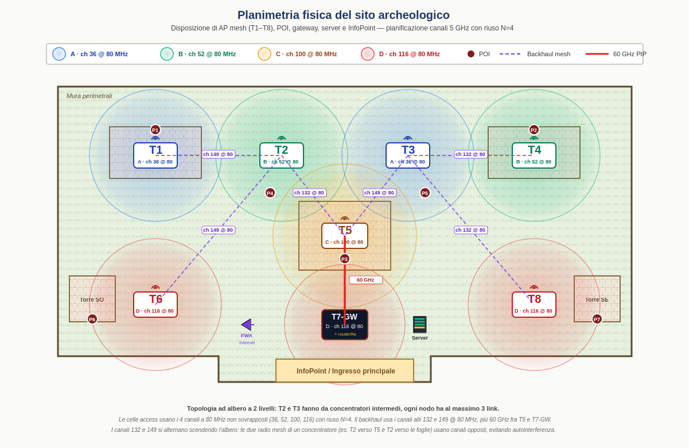
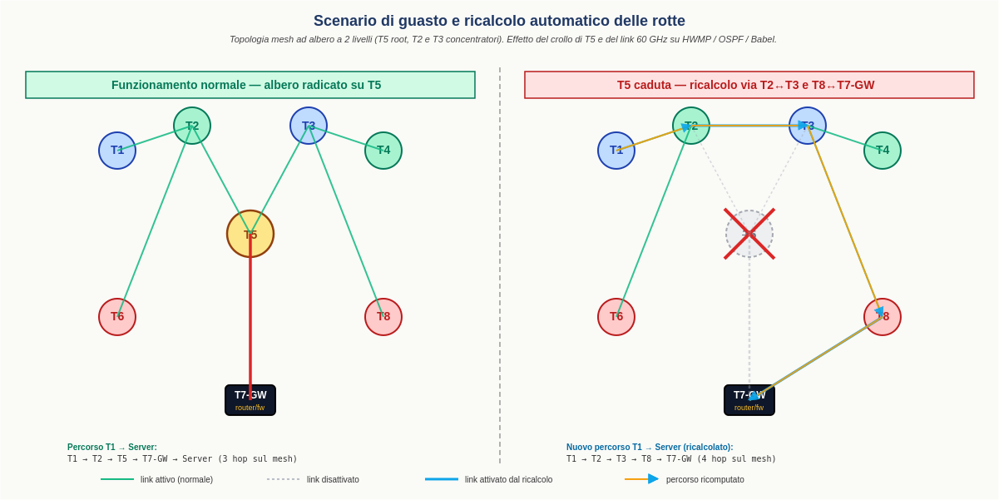
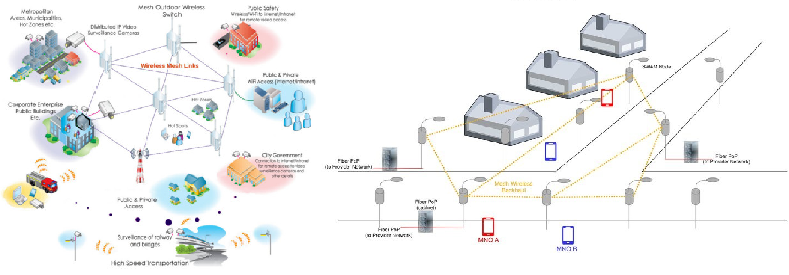
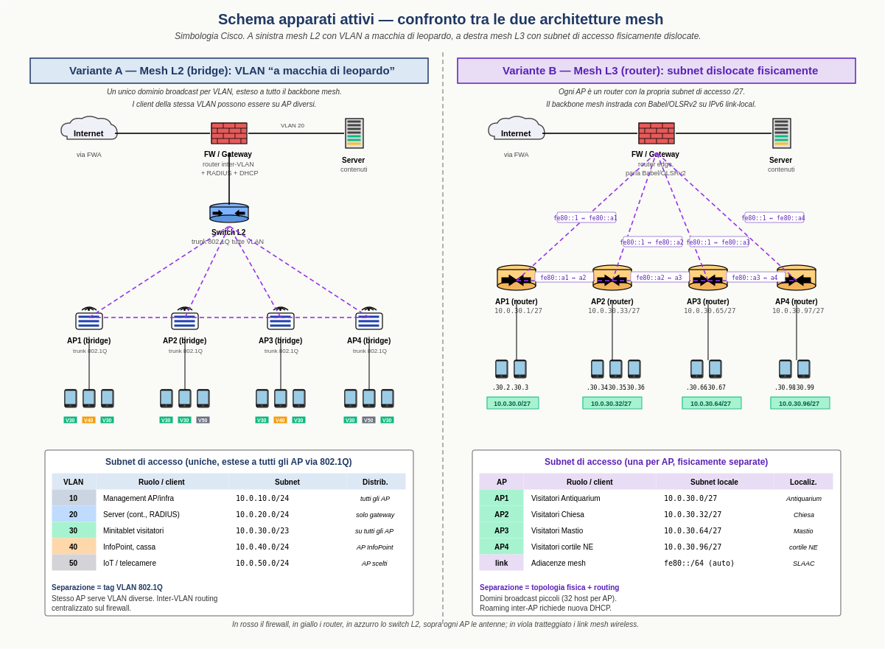
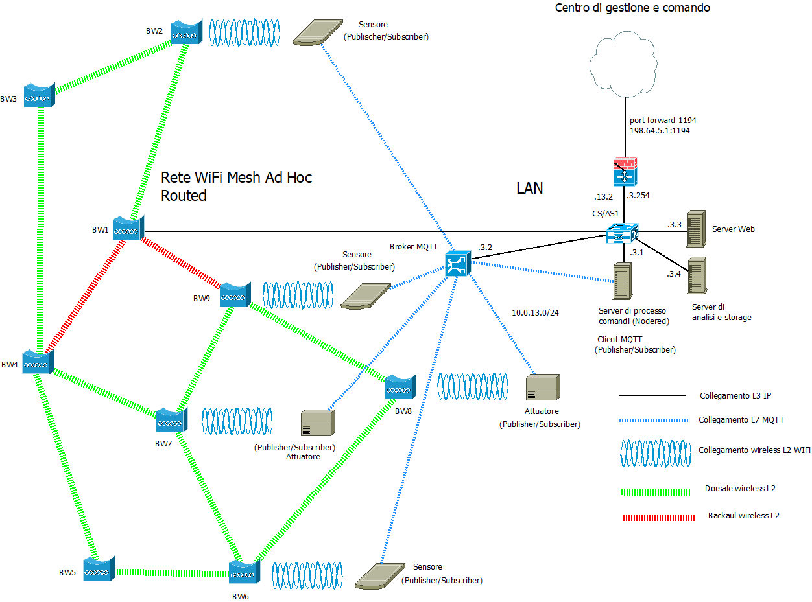
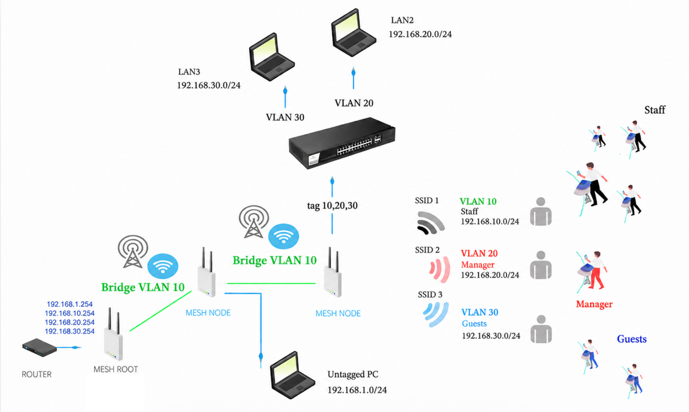
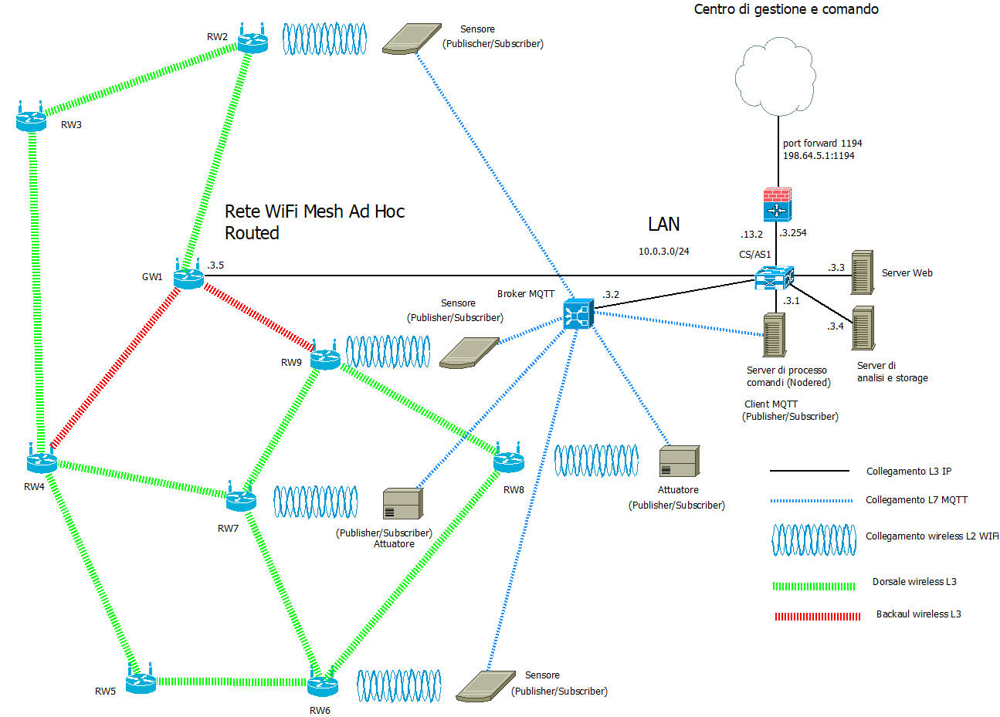

## **TECNOLOGIA LAN WIFI MESH**

>[Torna a reti di sensori](sensornetworkshort.md#classificazione-delle-tecnologie-wsn-in-base-a-velocità-e-copertura)

- [Dettaglio architettura Ethernet](archeth.md)
- [Dettaglio architettura Zigbee](archzigbee.md)
- [Dettaglio architettura BLE](archble.md)
- [Dettaglio architettura WiFi infrastruttura](archwifi.md)
- [Dettaglio architettura LoraWAN](lorawanclasses.md) 
- [Dettaglio architettura 5G/6G](ranprivata.md)
- [Dettaglio architettura RFID](archrfid.md)

Servizi:
- [DNS](https://it.wikipedia.org/wiki/Domain_Name_System)
- [DHCP](https://it.wikipedia.org/wiki/Dynamic_Host_Configuration_Protocol)
- [PVLAN](/approfondimenti/private_vlan.md)
- [VPN di reti Ethernet](ethvpn.md).
- [Secure network moderne](/approfondimenti/dispensa_reti_moderne.md)
- [Firewall](firewall.md).
- [ACL](approfondimenti/acl/dispensa_sistemi_reti.md)
- [Autenticazione 802.1X](radius.md)
- [Autenticazione SSO Active Directory](/approfondimenti/00_dispensa_principale.md)
- [Continuità di servizio](/approfondimenti/continuita_di_servizio.md)
- [Backup](backup.md)
- [Spillamento fibra](/esempi/progetti/dettaglio_spillamento_fibra.md) 

## **Caso d'uso rete wiFi Mesh**

Una rete **Wi-Fi mesh** è un sistema di rete wireless progettato per fornire una copertura Wi-Fi estesa che consiste di più AP che però non sono connessi all'infrastruttura di una LAN cablata tranne uno detto **gateway**. Una rete Wi-Fi mesh è una **soluzione avanzata** per estendere la copertura Wi-Fi e migliorare l'affidabilità della connessione in **ambienti complessi** nei quali risulta essere problematica la realizzazione di **dorsali cablate** verso gli AP. Con la capacità di **auto-configurarsi**, gestire il **roaming continuo** e fornire una **copertura scalabile**, le reti mesh rappresentano una scelta preferibile per chi necessita di una connettività robusta e senza interruzioni su aree estese.

Per il resto, ha le stesse caratteristiche di una rete WiFi di tipo infrastruttura, tranne che per la presenza di un **gateway** con mera funzione di inoltro dei pacchetti tra la rete mesh wireless e l'infrastruttura cablata.

**Componenti** di una Rete Wi-Fi Mesh sono:
- **Router Principale (Gateway)**: È il punto di ingresso alla rete e spesso è connesso direttamente al modem Internet. Gestisce la connessione tra la rete locale e Internet.
- **Nodi Mesh (Satellite o Extender)**: Sono dispositivi aggiuntivi che si collegano senza fili al router principale o tra di loro. I nodi cooperano per distribuire il segnale Wi-Fi in modo uniforme in tutta l'area di copertura.
- **Controller della rete mesh**, è un **server** che occupa della creazione e gestione delle funzioni di inoltro nei vari nodi (come bridge o come router), della gestione dell'indirizzamento di rete, della gestione dei protocolli di routing, della impostazione centralizzata di interfacce logiche e parametri radio, della assegnazione centralizzata degli indirizzi IP, dell'assegnazione automatica dei canali in modo da minimizzare le interferenze reciproche tra gli AP, dell'aggiornamento centralizzato dei FW dei vari AP, della gestione dei protocolli di autenticazione, delle funzioni di logging, delle funzioni di firewall, della creazione di hotspot, ecc..

A parità di architettura, le reti WiFi mesh si differenziano per il **tipo di inoltro** dei dati tra i vari nodi: **Bridge mesh** e **Mesh ad hoc routed**.

## **Aspetti critici**

- [Aspetti critici comuni per tutte le tecnologie](approfondimenti/aspetti_critici_generali.md)

- **Aspetti particolari per WiFi Mesh**
     - Posizionamento in planimetria dei **nodi** con relativa etichetta, avendo cura che tra essi esista
         almeno **un percorso LOS** (Line Of Sight) con dei vicini. Progettare dei **percorsi alternativi
         (backup)** in caso di guasto dei nodi centrali di traffico.
     - Tecnologie dei dispositivi: **topologia** (stella, bus, singolo), **link**, **accesso radio**
         (TDM / CSMA/CA / slotted CSMA/CA) con dimensionamento.
     - Definizione di **dorsali wireless** e di **punti di accesso e aggregazione** dei dispositivi utente.
     - Definizione di eventuali **link di backhaul** e della relativa tecnologia.
     - Definire le **interfacce radio** scegliendo tra **2-band** (dual channel) e **3-band** (three channel).
     - Definire i **canali dei link** scegliendoli tra quelli in banda **ISM** e pianificandone il
         **riuso nello spazio**, minimizzando l'**interferenza cocanale**.
     - **Subnetting e indirizzamento:** definizione degli indirizzi delle subnet di aggregazione per i vari gruppi di utenti (generalmente statica), definizione degli indirizzi delle subnet di dorsale (statica o automatica basata su Link Local) e definizione degli indirizzi delle subnet di servizio (server farm e DMZ).
     - Gestire i **vincoli di prossimità** (indoor/outdoor, controllo potenza/roaming) e i
         **vincoli di posizionamento** (trilaterazione).
     - Definizione degli **indirizzi dei server** e dei **range** di quelli dei **dispositivi client IP** (PC, smartphone, tablets, sensori/attuatori).
     - Definizione delle tecniche di **autenticazione dei nodi AP** (certificati, psw, preshared key, ecc.);
         reciproca (backhaul/link radio) o tra nodi e servizi (es. AP su RADIUS).
     - Definizione del **tipo di rete mesh**: **routed mesh** vs **bridged mesh**.
     - **Routing sempre automatico** (AODV, OLSR, Babel) con definizione automatica delle subnet dei link
         tra i nodi router (**LLA**, **SLAAC**). *(Sostituisce il routing statico/dinamico generale.)*
     - Se presenti VLAN, definizione del tipo di **associazione VLAN↔SSID** (statica o dinamica con
         **Tunnel-Private-Group-Id**).
     - Definizione della **posizione del controller degli AP**.

## **Progetto di esempio completo**

[Sito archeologico](/esempi/progetti/verifica_sistemi_reti_sito_archeologico.md)

## **Argomenti correlati**

[Rete di reti WiFi](/approfondimenti/wifi_federation.md)
       
[Broker MQTT](/approfondimenti/broker_mqtt.md)

[Messaggi MQTT](/approfondimenti/messaggi_mqtt.md)

[Server di gestione](/approfondimenti/server_di_gestione.md)

[Sensori](/approfondimenti/sensore.md)

[Cheat Sheet](/cheatsheet/cheatsheet.md)

## **Architetture delle reti WiFi** 

Una architettura di rete wireless WiFi è può essere realizzata in tre modalità:
- **Modalità Infrastruttura** di tipo master/slave
- **Modalità ad hoc** di tipo peer to peer 
- **Modalità Wifi Direct**  di tipo Punto – punto

## **Architettura WiFi Mesh** 

Le architetture **più diffuse** in ambito aziendale ed **outdoor** sono di **tipo Modalità wifi mesh** e sono composte di una rete magliata di dispositivi (router o bridge wifi) collegati attraverso un nodo gateway ad un rete cablata o wireless che fornisce l'accesso ad Internet.

Gli **elementi** di una rete in modo infrastruttura sono:
- **nodi di aggregazione**, cioè nodi che, oltre alle **dorsali radio** verso altri nodi, hanno pure delle **interfacce radio** verso i dispositivi client. **Inoltrano** il traffico dati da/verso i dispositivi degli **utenti** finali. 
- **nodi di transito**, cioè nodi che posseggono solamente interfacce radio dedicate alle **dorsali radio** e che quindi svolgono solo le funzioni di **router**. **Inoltrano** il traffico dati solo verso altri **nodi**. 
- **un gateway**, è l'unico nodo della rete mesh che è **cablato** ed è il **punto di accesso** alla LAN aziendale attraverso la quale raggiungere il **router** di confine verso **Internet**.

### **Sistemi multicanale (multiradio)**

Architettura del sistema di rete Wireless Mesh multicanale. Il **numero minimo** di canali necessario **è 2**. Un sistema a **3 canali** offre maggiore **flessibilità** a prezzo di un maggiore costo.

Ogni **collegamento tra due nodi** rappresenta una comunicazione radio diretta e dedicata sul canale numerato con l'etichetta sul link. In questa esempio, ogni nodo è dotato di **2 NIC wireless**. Pertanto il numero di canali utilizzati da ciascun nodo contemporaneamente non può essere superiore a 2; la rete nel suo complesso utilizza **5 canali** distinti.

I router e i nodi mesh Wi-Fi 6 (802.11ax) spesso supportano più bande radio, tipicamente a 2.4 GHz, 5 GHz, e in alcuni casi 6 GHz (Wi-Fi 6E). Queste bande possono essere utilizzate in modo diverso per ottimizzare la rete:
1.	**Banda 2.4 GHz**: Ha una portata più lunga ma velocità inferiore, utile per dispositivi lontani o per attraversare ostacoli come muri.
2.	**Banda 5 GHz Band**: Ha una portata più corta ma velocità più alta, ideale per connessioni ad alta velocità a distanze moderate.
3.	**Banda 6 GHz (Wi-Fi 6E)**: Offre molte più canali e minore congestione, con velocità elevate e latenza ridotta, ma con una portata limitata.

Il **backhaul Wi-Fi** è il collegamento **wireless** tra i **nodi** che partecipano ad una **dorsale principale** ad alto traffico di una rete mesh e il **gateway**.

Ecco la trattazione completa e strutturata, con la corretta integrazione del MU-MIMO all'interno della dimensione spaziale (SDM) e l'adozione delle tecnologie di multiplazione e accesso del Wi-Fi moderno (Wi-Fi 6/6E/7).

---

## **Collisioni nel Wi-Fi Moderno**

La tratta tra un dispositivo client (station) e un Access Point (AP) Wi-Fi è un collegamento radio che, essendo un **mezzo broadcast** (se uno parla, tutti ascoltano), è per sua natura soggetta al fenomeno delle collisioni (interferenza distruttiva tra i messaggi).

In generale, nel Wi-Fi moderno le **collisioni** tra messaggi di sorgenti diverse vengono evitate o ridotte sfruttando in modo combinato tutte le **dimensioni disponibili** della comunicazione radio.

Esistono due **direzioni** di trasmissione, entrambe soggette a collisione ma gestite con logiche differenti:

* **uplink**, dal dispositivo client fino all'Access Point.
* **downlink**, dall'Access Point fino al dispositivo client.

### **SDM: Separazione spaziale (Riuso e Multiplexing)**

A differenza del tempo o della frequenza, lo spazio permette di isolare i messaggi sfruttando la posizione geografica dei dispositivi e la direzionalità dei segnali. Nel Wi-Fi moderno, l'SDM opera su due livelli: inter-cella (macro) e intra-cella (micro).

* **Riuso spaziale inter-cella (BSS Coloring):** Dispositivi appartenenti a reti diverse (BSS diversi) ma geometricamente vicini rischierebbero di bloccarsi a vicenda pur non dovendo comunicare con lo stesso AP. Con il *BSS Coloring*, ogni pacchetto radio include un "colore" (un identificativo numerico) nel preambolo. Se un dispositivo rileva una trasmissione ma il colore è diverso da quello della propria rete (OBSS - Overlapping BSS), capisce che il traffico appartiene a un'altra cella. Sfruttando l'**attenuazione di spazio libero**, può alzare la soglia di tolleranza dell'interferenza e trasmettere comunque, permettendo il riuso delle frequenze in posizioni vicine.
* **Multiplexing spaziale intra-cella (MU-MIMO):** All'interno della stessa cella, l'AP sfrutta array di antenne multiple e tecniche avanzate di *beamforming* (manipolazione di fase del segnale) per non irradiare in modo omnidirezionale, ma per creare dei "fasci" direzionali indipendenti.

Questo permette a più dispositivi di trasmettere o ricevere contemporaneamente **sulla stessa identica frequenza e nello stesso istante**. L'AP separa matematicamente i flussi paralleli sfruttando le diverse impronte spaziali delle antenne dei client, azzerando le collisioni tra i dispositivi coinvolti.

### **FDM: Separazione in frequenza granulare (OFDMA)**

All'interno di un singolo canale principale (che può essere largo 20, 40, 80, 160 o fino a 320 MHz nelle bande a 5 e 6 GHz), il Wi-Fi moderno non è più obbligato a far trasmettere un solo dispositivo alla volta sull'intera banda. Tramite la tecnologia **OFDMA (Orthogonal Frequency Division Multiple Access)**, il canale viene suddiviso nel dominio della frequenza in sotto-canali più piccoli e ortogonali chiamati **Resource Units (RU)**.

L'Access Point può assegnare dinamicamente diverse RU a diversi client nello stesso istante. Un singolo dispositivo client dispone di una catena radio che, in quel momento, si concentra solo sulle frequenze della RU assegnata. Questo consente a più dispositivi di trasmettere o ricevere dati **in parallelo e simultaneamente su frequenze diverse**, riducendo drasticamente la probabilità di collisione rispetto alla vecchia trasmissione a canale intero.

### **CSMA e TDM: Separazione per tempo e accesso al mezzo**

L'ultima grandezza in grado di isolare i messaggi è il **Tempo**. Il Wi-Fi gestisce questa dimensione combinando un approccio asincrono/probabilistico (ereditato dal passato) e uno programmato/deterministico.

* **Accesso a contesa distribuito (CSMA/CA con Backoff):** Quando i dispositivi non sono coordinati centralmente, applicano una logica simile all'Aloha ma evoluta (*Listen Before Talk*). Prima di trasmettere, il dispositivo ascolta il canale: se è occupato, attende che torni libero e poi avvia un temporizzatore casuale (**Binary Exponential Backoff**). Se due dispositivi finiscono il backoff e trasmettono nello stesso identico istante, avviene una collisione. La mancata ricezione del pacchetto di conferma (ACK) farà scattare un backoff più lungo per il tentativo successivo. [Dettaglio CSMA/CA](protocollidiaccesso.md#csmaca) 

* **Target Wake Time (TWT):** Per evitare la contesa selvaggia del tempo, l'AP e i client possono negoziare preventivamente degli slot temporali specifici (finestre di attivazione). Il client si sveglia solo nel suo istante riservato per trasmettere o ricevere, rimanendo in uno stato di sonno profondo per il resto del tempo. Questo approccio quasi-deterministico azzera il rischio di collisione per i flussi di dati schedulati.

---

## **Beacon e Schedulazione Centralizzata (Trigger Frame)**

Nelle reti Wi-Fi, l'Access Point emette periodicamente (di norma ogni 102,4 ms) un frame di gestione speciale chiamato **Beacon**. Il Beacon è una sequenza di sincronizzazione fondamentale: serve a allineare gli **orologi interni** di tutte le stazioni collegate (garantendo la precisione dei meccanismi a tempo come il TWT) e annuncia la presenza e i parametri della rete. Per dei dettagli vedi [preambolo di sincronizzazione](protocolli.md#preambolo-di-sincronizzazione).

La trama temporale che si sviluppa tra i beacon può essere idealmente suddivisa in base alle **politiche di accesso** al canale imposte dall'AP:

* **Fase a contesa (EDCA):** Una zona probabilistica in cui i dispositivi competono per l'accesso al canale utilizzando i meccanismi di CSMA/CA ordinati dalle priorità del traffico, accettando il rischio di collisione.
* **Fase programmata (Trigger-Based):** Nello scenario moderno, l'Access Point assume un ruolo di **coordinamento centrale assoluto** (approccio master/slave). L'AP invia un pacchetto speciale chiamato **Trigger Frame**. Questo frame stabilisce in modo rigido e centralizzato **quale** stazione deve parlare in uplink, **quando**, per **quanto tempo** e definisce l'esatta combinazione di risorse da usare (assegnando a ciascuno una specifica *Resource Unit* in frequenza o un preciso *flusso spaziale* MU-MIMO).

Durante la trasmissione coordinata dal Trigger Frame, l'accesso distribuito viene temporaneamente sospeso: l'AP interroga le stazioni (polling dinamico) blindando la comunicazione uplink da qualsiasi collisione interna alla cella.

---

## Dimensionamento dei nodi

### Numero di AP

La regola pratica è copertura + capacità. Su 4 ettari con muri spessi:

- **Outdoor**: AP con antenne settoriali o omnidirezionali, raggio utile ~40–60 m in 5 GHz Wi-Fi 6 (802.11ax) → 8 AP outdoor.
- **Indoor (torri, antiquarium, chiesa)**: un AP per ambiente, perché i muri in pietra attenuano fortemente il segnale → 5 AP indoor.
- **Totale**: 13 nodi mesh + 1 nodo gateway presso l'InfoPoint.

### Criteri di posizionamento

- Ogni POI deve avere almeno un AP entro 15 m con linea di vista sufficiente per garantire RSSI ≥ −65 dBm (necessario per il vincolo di prossimità, vedi Q2).
- Ogni nodo mesh deve avere almeno due vicini visibili, per garantire la ridondanza HWMP.
- Gli AP outdoor vanno installati ad altezza intermedia (3–4 m) e non sulle sommità delle torri, per evitare copertura eccessiva oltre il perimetro (questo serve anche al vincolo di prossimità).

### Numero di radio per AP e pianificazione cellulare dei canali

Un nodo mesh fa contemporaneamente **access** (serve i client) e **backhaul** (parla con i vicini). Se queste due funzioni condividono la stessa radio si finisce nel classico problema dei single-radio mesh: il throughput utile si dimezza ad ogni hop, perché la radio non può trasmettere e ricevere contemporaneamente sullo stesso canale (CSMA/CA serializza tutto). La via standard per evitarlo è separare le funzioni su radio fisiche distinte.

**Apparati dual-band (2 radio).** Tipicamente una radio 2.4 GHz e una 5 GHz. Si può scegliere:

- mettere il backhaul sui 5 GHz e l'access sui 2.4 GHz: backhaul veloce ma access lento e congestionato (la banda 2.4 GHz ha solo 3 canali non sovrapposti — 1, 6, 11 — e tantissime sorgenti di interferenza);
- mettere access e backhaul entrambi sui 5 GHz, ma su canali diversi: la radio è una sola e va in time-sharing, quindi è la soluzione peggiore in termini di prestazioni.

In pratica gli apparati dual-band sono accettabili solo come ripiego economico per nodi periferici a basso carico.

**Apparati tri-band (3 radio).** Le tre radio coprono in genere 2.4 GHz, 5 GHz lower (canali 36–64) e 5 GHz upper (canali 100–144, DFS). La configurazione consigliata è:

- radio 1 — 2.4 GHz per access ai client legacy (Wi-Fi 4/5, IoT, smartphone vecchi);
- radio 2 — 5 GHz lower per access ai client moderni (minitablet Wi-Fi 6);
- radio 3 — 5 GHz upper DFS dedicata al backhaul mesh, su canali a 80 MHz con potenza più alta consentita dal regolatorio (in EU su DFS si raggiungono i 23 dBm EIRP indoor, 30 dBm outdoor).

Così access e backhaul lavorano in parallelo, non in time-sharing, e si recupera tutto il throughput utile sui multi-hop.

**Apparati con 4 radio o radio aggiuntiva 6 GHz / 60 GHz.** Su tratte punto-punto critiche (es. dal mastio al gateway) si può aggiungere una radio mmWave 60 GHz (802.11ad/ay) con antenna direttiva: throughput dell'ordine del Gbps, immune all'interferenza degli altri canali Wi-Fi, ma richiede line-of-sight. È la scelta classica per i due-tre link più importanti del backbone.

**Vantaggi/svantaggi a confronto:**

| Apparato | Vantaggi | Svantaggi |
|---|---|---|
| Dual-band (2 radio) | Costo basso; meno antenne da installare; alimentazione PoE inferiore. | Access e backhaul si contendono lo spettro; throughput utile dimezzato ad ogni hop; sopravvive solo per nodi foglia a basso carico. |
| Tri-band (3 radio) | Backhaul dedicato e parallelo all'access; throughput costante anche su 2–3 hop; sfrutta tutti i canali Wi-Fi disponibili in EU; supporta client legacy senza penalizzare i moderni. | Costo più alto; più antenne; maggiore consumo elettrico (PoE+ o PoE++); pianificazione canali più articolata. |
| Tri-band + radio 60 GHz | Backbone capace di Gbps su tratte critiche; nessuna interferenza con il resto della rete Wi-Fi; latenza minima. | Richiede line-of-sight perfetta; sensibile alla pioggia intensa; costo per link elevato; ha senso solo per i 2–3 link principali del backbone. |

**Scelta per il progetto:** apparati **tri-band** per tutti i nodi mesh, con eventuale aggiunta di un link 60 GHz dedicato tra il gateway dell'InfoPoint e il nodo di sommità del mastio (che è il punto di rilancio naturale verso il resto del sito).

### Pianificazione cellulare dei canali

Quando si dispongono più AP in un'area ristretta, va evitata l'interferenza co-canale (CCI), cioè AP vicini che trasmettono sullo stesso canale e si rubano tempo d'aria a vicenda. La tecnica consolidata, mutuata dalle reti cellulari, è il riuso di frequenza con schema esagonale: si assegnano i canali in modo che due AP che operano sulla stessa frequenza siano il più lontano possibile, mentre due AP fisicamente vicini ricevano canali ben separati nello spettro.

**Regola pratica:** dispositivi *vicini nello spazio* → frequenze *lontane*; dispositivi *lontani nello spazio* → frequenze anche *vicine* (il riuso diventa possibile perché l'attenuazione di propagazione li disaccoppia).

**Banda 2.4 GHz (access legacy).** 
- Solo 3 canali non sovrapposti in EU: 1, 6, 11. 

**Banda 5 GHz (access moderno e backhaul).** In EU lo spettro 5 GHz è diviso in canali base da 20 MHz. Per avere throughput maggiori si **aggregano canali adiacenti** in canali più larghi: 40 MHz (coppia), 80 MHz (quadrupla), 160 MHz (ottupla). Più ampio è il canale, più alto il throughput ma anche più spettro occupato.

In totale ci sono 19 canali base da 20 MHz, distribuiti in tre sotto-bande regolatorie:

- **U-NII-1** (non-DFS): canali 36, 40, 44, 48
- **U-NII-2A** (DFS): canali 52, 56, 60, 64
- **U-NII-2C** (DFS): canali 100, 104, 108, 112, 116, 120, 124, 128, 132, 136, 140

Aggregandoli si ottengono 9 canali a 40 MHz oppure **4 canali a 80 MHz non sovrapposti**, identificati dal numero del primo canale base che li compone:

| Colore (riuso N=4) | Nome breve | Slot da 20 MHz occupate | Sotto-banda | DFS |
|---|---|---|---|---|
| **A — azzurro** | **ch 36 @ 80 MHz** | 36, 40, 44, 48 | U-NII-1 | no |
| **B — verde** | **ch 52 @ 80 MHz** | 52, 56, 60, 64 | U-NII-2A | sì |
| **C — giallo** | **ch 100 @ 80 MHz** | 100, 104, 108, 112 | U-NII-2C | sì |
| **D — rosso** | **ch 116 @ 80 MHz** | 116, 120, 124, 128 | U-NII-2C | sì |

Questi 4 canali a 80 MHz sono spettralmente disgiunti: due AP che usano canali diversi della tabella non si interferiscono, indipendentemente da quanto siano vicini fisicamente. È esattamente quello che serve per il **riuso a 4 colori** della pianificazione cellulare: si associa un colore a ciascun canale e si distribuiscono i colori sulla griglia degli AP in modo che celle adiacenti abbiano colori diversi.

### **Canali Backhaul**

Restano disponibili, **fuori da questi 4 colori**, i canali alti **ch 132 @ 80 MHz** (occupa 132–144, ancora DFS) e **ch 149 @ 80 MHz** (occupa 149–161, banda U-NII-3 non-DFS, massima EIRP outdoor consentita): si usano per il backhaul mesh, completamente separati dallo spettro access.

**Strumenti operativi:** un site survey con strumenti come Ekahau o NetSpot consente di misurare RSSI e SNR effettivi nei punti critici, e di affinare la pianificazione iniziale. Molti controller WLAN moderni offrono anche un meccanismo di *Auto-RF* (es. Cisco RRM, Aruba ARM) che assegna e ribilancia i canali dinamicamente in base alle misure on-air; resta comunque buona pratica impostare manualmente i canali del backhaul (per non destabilizzare i link punto-punto), lasciando l'auto-RF solo sull'access.

*Figura 2 — Planimetria fisica del sito archeologico: disposizione di AP mesh (T1–T8), POI, gateway, server e InfoPoint. Le celle (access) sono circolari per via delle antenne omnidirezionali e usano i canali dei gruppi A/B/C/D (36/52/100/116) con riuso N=4. La topologia di backhaul è ad albero a due livelli: T5 (mastio centrale) è la radice, T2 e T3 sono concentratori intermedi che aggregano rispettivamente T1/T6 (settore ovest) e T4/T8 (settore est). I link backhaul usano canali 5 GHz alti (ch 132 e ch 149) alternati lungo l'albero, in modo che le due radio mesh di uno stesso concentratore non si interferiscano. Il link tra T5 e T7-GW è in 60 GHz direttivo (linea rossa). In Figura 3 si analizza il comportamento in caso di guasto di T5.*

#### Ridondanza e ricalcolo automatico delle rotte

La topologia di backhaul mostrata nella Figura 2 è un **albero a due livelli** radicato su T5 (mastio): T5 si collega al gateway via 60 GHz, e a sua volta serve due concentratori intermedi T2 e T3 che aggregano i quattro AP foglia (T1, T6 a ovest, T4, T8 a est). Questa struttura limita a 3 il numero di link backhaul incidenti su ciascun nodo, evitando interferenza co-canale eccessiva sul node centrale. T5 resta però un **single point of failure** apparente: se cade, sembrerebbe che le foglie restino isolate.

In realtà la rete sopravvive, perché alcuni AP perimetrali sono fisicamente vicini abbastanza da **sentirsi a vicenda**: in particolare T2 e T3 (i due concentratori, entrambi affacciati sul cortile centrale) e T8 e T7-GW (entrambi nel settore sud-est del sito). Fra di loro esistono **adiacenze radio potenziali** non disegnate in Figura 2 perché nel funzionamento normale il protocollo di routing le scarta in favore del percorso a minor costo. Sono comunque rilevabili dai messaggi *hello* periodici di HWMP, OSPF o Babel. Quando il protocollo rileva la caduta di T5 — tipicamente in pochi secondi, dopo qualche hello mancato — ricalcola le rotte attivando quelle adiacenze dormienti. La Figura 3 mostra l'effetto del ricalcolo: il percorso da T1 al gateway passa ora da T2 a T3 (riconnettendo le due metà del sito) e poi via T8 al gateway, con qualche hop in più ma la connettività preservata.

*Figura 3 — Effetto del crollo del nodo centrale T5 sul backbone mesh. A sinistra la topologia normale ad albero: T5 è la radice, T2 e T3 concentratori intermedi; il percorso da T1 al gateway compie 3 hop sul mesh. A destra: T5 caduta, i link verso il centro sono disattivati (grigi tratteggiati), il protocollo di routing dinamico ricalcola attivando le adiacenze dormienti T2↔T3 e T8↔T7-GW (azzurro). Il nuovo percorso T1→T2→T3→T8→T7-GW (frecce arancioni) compie 4 hop. La rete continua a funzionare in modalità degradata fino al ripristino del mastio.*

La ridondanza non richiede modifiche di progetto: dipende solo dal fatto che gli AP siano **abbastanza vicini** da poter dialogare anche senza il mastio. La pianificazione dei canali a riuso N=4 favorisce naturalmente questo scenario, perché i canali sono già pensati per limitare l'interferenza fra celle adiacenti.

---

## **Tipi di Backhaul**

Il **backhaul Wi-Fi** è il collegamento **wireless** tra i **nodi** che partecipano ad una **dorsale principale** ad alto traffico di una rete mesh e il **gateway**. Il gateway è l'unico dispositivo della rete mesh che è **cablato** su una rete LAN, generalmente per ottenere l'accesso a Internet. In una rete mesh, i nodi (che possono essere router o access point) comunicano tra loro per estendere la copertura Wi-Fi, e il backhaul è essenziale per mantenere questa comunicazione fluida e efficiente. Le **Tipologie di Backhaul** sono:
- **Backhaul Wireless**: Utilizza la connessione Wi-Fi stessa per collegare i nodi mesh tra loro. E'Semplice da configurare, nessun cablaggio necessario. Ma larghezza di banda disponibile può essere ridotta, specie se il canale Wi-Fi è condiviso tra il traffico client e il traffico backhaul. Può anche essere soggetto a interferenze e degrado del segnale.
- **Backhaul Cablate (Ethernet)**: Utilizza cavi Ethernet per collegare i nodi della rete mesh. Offre una connessione stabile e ad alta velocità, non influenzata da interferenze wireless. Consente di riservare tutta la larghezza di banda Wi-Fi per i dispositivi client. Soluzione più costosa.
- **Backhaul Powerline**: Utilizza le linee elettriche esistenti per trasmettere dati tra i nodi mesh. E' facile da configurare, non richiede nuovi cablaggi ma velocità e l'affidabilità possono variare in base alla qualità dell'impianto elettrico.

### **Applicazione del CFP in Reti Mesh**

In una **rete mesh**, il controllo del tempo di trasmissione attraverso CFP o tecniche simili può essere implementato per migliorare l'**efficienza del backhaul** e delle comunicazioni client. Ecco come potrebbe funzionare:
- **Configurazione del CFP sui backaul**: Gli access point (AP) o i nodi mesh possono essere configurati per utilizzare periodi di trasmissione **senza contesa** (o CFP) per le comunicazioni **backhaul**. Durante questi periodi, **solo i nodi mesh** partecipanti possono trasmettere dati tra loro, in slot di tempo preassegnati, riducendo le interferenze e migliorando la qualità del collegamento. Si tratta, di fatto, di realizzare una multiplazione **TDM statica** solo per le **dorsali** verso il **gateway**.
- **Allocazione Dinamica**: Durante i periodi di contesa, i nodi mesh possono utilizzare tecniche come **OFDMA** (introdotto a partire dal wiFi6) per allocare dinamicamente subcanali e slot di tempo ai dispositivi client, ottimizzando l'uso dello spettro e **riducendo la latenza**.
- **Gestione della QoS**: Per applicazioni che richiedono alta qualità del servizio, come lo streaming video o le chiamate VoIP, i nodi mesh possono **riservare slot** di tempo specifici durante i CFP per garantire una trasmissione senza interruzioni e con bassa latenza.

---

## **Funzionalità Chiave di una implementazione multiradio**

Quando si vuole **selezionare** un AP Wi-Fi per una rete mesh ad **alte prestazioni**, potrebbe esse utile tenere in considerazione le seguenti funzionalità:
- **Tri-Band Support**: I sistemi mesh tri-band hanno tre radio: una per 2.4 GHz, una per 5 GHz, e una terza che può operare su 5 GHz o 6 GHz. Questo permette una maggiore flessibilità e prestazioni superiori, poiché una delle bande a 5 GHz o 6 GHz può essere utilizzata esclusivamente per il backhaul.
- **Beamforming**: il beamforming può migliorare la copertura e le prestazioni dei dispositivi collegati dirigendo il fascio radio verso determinati punti dello spazio. Questa capacità di modulare elettronicamente la direttività di un'antenna permette di estendere notevolmente la copertura fino a 200-250m. Vedi [Smart antenna](multiplazioni.md#sdm-nelle-smart-antenna).
- **Wi-Fi 6/6E**: dispositivi che supportano Wi-Fi 6 o 6E per beneficiare di tecnologie più recenti, come OFDMA, MU-MIMO, e canali a 160 MHz. che offrono il vantaggio decisivo delle **latenze molto basse** necessarie per le applicazioni di **controllo remoto**. Vedi [Modulazioni radio](accessoradio.md#ofdm).
- **Backhaul Dedicato**: alcuni sistemi mesh utilizzano una radio dedicata per il backhaul (la connessione tra i nodi mesh), mantenendo le altre radio libere per il traffico dei dispositivi client. Ad esempio, il backhaul potrebbe operare sulla banda a 5 GHz o 6 GHz per sfruttare velocità elevate e bassa interferenza.
- **Dynamic Band Steering**: La rete mesh può dirigere dinamicamente i dispositivi verso la banda più appropriata, migliorando l'efficienza della rete. I dispositivi più vicini ai nodi mesh possono essere indirizzati verso le bande a 5 GHz o 6 GHz, mentre quelli più lontani possono usare la banda a 2.4 GHz.
- **Facilità di Configurazione**: meglio scegliere dispositivi con app di gestione intuitive e supporto tecnico affidabile.

---

## **Autenticazione utente presso un nodo di aggregazione**

L'autenticazione di un nodo Wi-Fi è un processo fondamentale per garantire che solo gli utenti autorizzati possano connettersi alla rete. Ecco un elenco dei principali tipi di autenticazione utilizzati in un AP Wi-Fi, con una breve descrizione di ciascuno:

1. **Autenticazione Aperta (Open Authentication)**:È il metodo di autenticazione più semplice e non richiede alcuna chiave di sicurezza o password. Qualsiasi dispositivo può connettersi alla rete senza restrizioni. Uso comune: Reti pubbliche gratuite come quelle in caffè, biblioteche, o hotspot pubblici.
2. **Autenticazione con chiave condivisa (Shared Key Authentication)**: Utilizza una chiave di rete (password) condivisa tra l'AP e i client. Solo i dispositivi che conoscono questa chiave possono connettersi alla rete. Uso comune: Reti domestiche o piccole reti aziendali dove la sicurezza è basata su una singola chiave di rete.
3. **WEP (Wired Equivalent Privacy)**: Uno dei primi standard di sicurezza Wi-Fi, utilizza chiavi statiche per crittografare il traffico di rete. È considerato insicuro e obsoleto a causa delle sue vulnerabilità. Uso comune: Praticamente non più utilizzato a causa della sua insicurezza. È stato sostituito da metodi più sicuri.
4. **WPA (Wi-Fi Protected Access)**: Un miglioramento rispetto a WEP, utilizza chiavi dinamiche e un sistema di crittografia più robusto. Tuttavia, WPA è stato anch'esso superato da WPA2. Uso comune: Reti che non possono supportare WPA2 ma richiedono una maggiore sicurezza rispetto a WEP.
    - **WPA2 (Wi-Fi Protected Access 2)**: Standard di sicurezza attualmente più diffuso. Utilizza l'algoritmo di crittografia AES (Advanced Encryption Standard) e chiavi dinamiche. WPA2-Personal (PSK): Utilizza una chiave pre-condivisa (pre-shared key). Adatto per reti domestiche e piccole reti aziendali.
    - **WPA2-Enterprise**: Utilizza un server RADIUS per l'autenticazione degli utenti, fornendo una maggiore sicurezza. Adatto per grandi reti aziendali. Uso comune: La maggior parte delle reti Wi-Fi moderne, sia domestiche che aziendali.
    - **WPA3**: L'ultima versione del protocollo WPA, offre miglioramenti in termini di sicurezza rispetto a WPA2, inclusa una protezione più robusta contro gli attacchi a dizionario e Forward Secrecy. **WPA3-Personal**: Utilizza Simultaneous Authentication of Equals (SAE) per una maggiore sicurezza della chiave pre-condivisa.**WPA3-Enterprise**: Migliora la sicurezza rispetto a WPA2-Enterprise, offrendo una crittografia più robusta e una gestione delle chiavi più sicura. E' di uso comune nelle reti di nuova generazione che richiedono la massima sicurezza disponibile.
8. **802.1X/EAP (Extensible Authentication Protocol)**: Utilizzato principalmente nelle reti WPA2-Enterprise e WPA3-Enterprise. Richiede un server di autenticazione (RADIUS) e supporta vari metodi di autenticazione come certificati digitali, smart card, token hardware e credenziali di nome utente/password. Uso comune: Grandi reti aziendali e ambienti dove è necessaria una gestione avanzata delle credenziali di accesso e autenticazione forte. E' la più sofisticata, per dettagli vedi [Autenticazione 802.1X](radius.md)

---

## Backhaul mesh: autenticazione fra AP

Sul lato backhaul — il "back office" della rete, dove gli AP si parlano fra loro per inoltrare il traffico mesh — il problema è diverso. Non c'è un "client" e un "server": ci sono N nodi paritari (peer) che devono potersi fidare reciprocamente prima di scambiarsi frame, altrimenti un AP rogue piazzato vicino al sito da un attaccante potrebbe inserirsi nella mesh e intercettare/manipolare il traffico.

Le tecnologie disponibili dipendono dallo standard mesh adottato.

### IEEE 802.11s — SAE (Simultaneous Authentication of Equals)

Lo standard 802.11s definisce **SAE**, lo stesso meccanismo introdotto da WPA3 per l'access lato client, ma applicato fra peer mesh. SAE è una variante del **Dragonfly key exchange** (RFC 7664) basata su una **passphrase pre-condivisa** fra i nodi mesh. Caratteristiche essenziali:

- **Simmetrico**: nessun nodo è "client" o "server", entrambi seguono lo stesso protocollo;
- **Resistente al dizionario offline**: anche se un attaccante cattura tutto lo scambio, non può provare password a velocità arbitraria contro l'hash, perché ogni tentativo richiede un'interazione attiva con un peer (Forward Secrecy garantita);
- **Negozia una chiave di sessione fresca** ad ogni associazione, usata poi per cifrare i frame con AES-CCMP a livello link.

Una volta autenticati con SAE, i due nodi mesh stabiliscono una **Mesh Peering Management** session (MPM), che è l'analogo dell'associazione client-AP ma fra peer paritari. Tutti i frame successivi sul link sono cifrati e autenticati.

La gestione è **distribuita**: ogni nodo mesh conserva la propria passphrase, configurata al momento dell'installazione (tipicamente dal controller WLAN). Non c'è un server centrale come il RADIUS: la passphrase deve essere la stessa su tutti i nodi della mesh.

### Soluzioni proprietarie (Cisco, Aruba, MikroTik, Ubiquiti)

I principali vendor offrono varianti più sofisticate per ambienti enterprise:

- **Cisco Adaptive Wireless Path Protocol (AWPP)** sui Mesh AP, con autenticazione mutua basata su certificati X.509 firmati dalla CA del controller WLAN. Ogni Mesh AP riceve un certificato univoco al momento del *zero-touch provisioning* contro il WLC.
- **Aruba InstantOS Mesh** usa certificati per l'autenticazione mesh, sempre gestiti dal controller (Mobility Conductor).
- **MikroTik CAPsMAN + nv2** usa chiavi condivise o certificati a discrezione, ma è meno automatizzato.
- **Ubiquiti UniFi Mesh** usa una chiave condivisa derivata dal sito UniFi e dalla password admin, gestita centralmente dal UniFi Controller.

Il **denominatore comune** di queste soluzioni proprietarie è la **gestione centralizzata** via controller WLAN: il sistemista non configura singolarmente ogni AP, ma adotta una policy a livello di sito che il controller applica via *zero-touch provisioning* su ciascun nuovo nodo che entra nella mesh. La rotazione delle chiavi, la revoca dei certificati, l'aggiunta di nuovi AP autorizzati si fanno tutte lì.

### IETF / mesh community — IPsec / WireGuard sopra il link mesh

In alternativa, o in aggiunta, all'autenticazione mesh nativa di 802.11s, si può **incapsulare** il traffico fra nodi in un tunnel IPsec o WireGuard che gestisce indipendentemente l'autenticazione mutua a livello IP:

- **IPsec con IKEv2** + certificati X.509: standard maturo, supportato da qualunque router serio. Adatto se si vuole isolare il piano di gestione (es. il traffico verso il controller WLAN) dentro un tunnel cifrato sopra il link mesh.
- **WireGuard**: più moderno, basato su chiavi pubbliche Curve25519, configurazione semplicissima (una chiave per peer). Sta diventando lo standard di fatto nelle mesh community come Freifunk.

Questa via è quella adottata tipicamente quando i nodi mesh sono macchine Linux generaliste (es. router OpenWRT) piuttosto che AP dedicati di un vendor, e la flessibilità prevale sulla semplicità.

---

## **Schema di principio degli apparati attivi**

*Figura 1 — Schema apparati attivi (simbologia Cisco): confronto fra mesh L2 (bridge, separazione a macchia di leopardo via 802.1Q) e mesh L3 (router, subnet di accesso fisicamente dislocate, link mesh autoconfigurati su IPv6 link-local).*

---

## **Bridge mesh network**

Nelle reti Wifi **Bridge mesh**, si sfrutta la **proprietà** (comune a tutti i dispositivi WiFi) di possedere un **bridge interno**, realizato in SW, che collega i **link wireless** appartenenti ad interfacce **radio diverse** (per esempio, una a 2.4 GHz ed una a 5 GHz). Quindi, un **nodo WiFi** è, a tutti gli effetti, un dispositivo **IS** di **livello 2** della pila **ISO/OSI**. 

I **bridge**, in una rete dati, posseggono **funzioni** analoghe a quelle di uno switch HW (inoltro trame) e **tecnologie** analoghe a quelle degli switch HW (VLAN). La **disponibilità** delle **VLAN** permette di portare a **soluzione** una **esigenza tipica** anche nelle reti wired da ufficio: la **separazione** logica degli utenti in gruppi isolati in base al tipo di **servizio** piuttosto che in base alla **vicinanza** fisica nello spazio dei loro utenti. Le VLAN permettono agevolmente la gestione di **gruppi** di utenti sparsi a **macchia di leopardo** su **tutta** l'infrastruttura, **wired** o **wireless** che sia.

#### **Vantaggi**

In definitiva, i bridge **inoltrano** direttamente **trame MAC**, e la rete complessiva è una **LAN** gestita dal **protocollo STP** che evita i loop a livello data link (L2) pur mantenenedo la ridondanza al livello fisico (L1). I **vantaggi** di questa configurazione sono gli stessi di quella di una rete **wireless infrastruttura** composta da SW:
- di essere **autoconfigurante** e quindi molto semplice
- la possibilità di permettere di creare **una sola subnet** che includa tutti i dispositivi **client**.
- la possibilità di poter **partizionare** la rete per **gruppi di utenti** in base al **tipo di servizio** piuttosto che in base alla loro **dislocazione fisica** utilizzando la tecnologia delle **VLAN**. Le VLAN diventano la **scelta obbligata** quando i **gruppi di utenti** da separare sono **sparsi** a macchia di leopardo su tutta la rete.
- **Roaming**: trasparente in L2 (il client non cambia IP né subnet)

#### **Inoltro L2**

Mesh L2 (bridge / HWMP). HWMP — Hybrid Wireless Mesh Protocol, definito da 802.11s — combina due modalità di path selection:
-	**Proattiva (tree-based)**: un root mesh STA (tipicamente il gateway) diffonde periodicamente messaggi PREQ a tutta la mesh; ogni nodo impara un percorso  verso il root, formando un albero **unico** per tuttii nodi. È ottimizzata per il traffico verso Internet/server, che nelle reti mesh è il flusso dominante.
-	**Reattiva (on-demand, AODV-like)**: quando un nodo deve raggiungere una destinazione interna alla mesh non coperta dall’albero, o vuole un percorso laterale migliore di quello via root, emette un PREQ in broadcast cercando proprio quella destinazione; la destinazione risponde con un PREP che torna lungo il percorso a metrica migliore, costruendo un path diretto specifico fra quella coppia (sorgente, destinazione). I messaggi PREQ/PREP sono identici a quelli di AODV (RFC 3561), che è a tutti gli effetti un distance-vector on-demand. La metrica standard è la Airtime Link Metric, radio-consapevole, che stima il tempo d’aria necessario per trasmettere un frame considerando bitrate, dimensione e tasso d’errore.

Se un nodo mesh intermedio **viene spento o perde l'alimentazione**, i nodi adiacenti se ne accorgono perché non ricevono più i segnali di conferma, la componente reattiva o proattiva di HWMP ricalcola istantaneamente una strada alternativa, il tutto in pochi millisecondi e senza che l'utente se ne accorga.

Quindi HWMP non è limitato a un albero unico: fornisce un **albero unico** per il traffico verso il root (tipicamente Internet) e, parallelamente, **percorsi diretti su richiesta** per il traffico interno. Quello che resta invariato è il livello del forwarding: il routing è a livello 2 sui MAC, l’intera mesh è un singolo dominio broadcast L2, le decisioni di inoltro sono prese dai mesh STA su un piano di forwarding bridge-like.

#### **Esempio**

Si vogliono separare i **servizi di produzione** agricola con i suoi **sensori** sparsi su tutto l'agro, dai **servizi di mobilità** ai tecnici agronomi dotati di tablet sui loro mezzi con i quali eseguono il controllo giornaliero degli impianti di competenza (staff e manager), consentendo anche di dedicare una gestione separata al traffico dei **servizi per gli ospiti**. 

La **separazione** dei gruppi di utenti in base alla **dislocazione fisica** sarebbe evidentemente impossibile, mentre sarebbe **effettiva** la separazione mediante **VLAN** dislocate su una infrastruttura **bridged**.

#### **Definizione dei gruppi mediante VLAN**

La **definizione** dei gruppi si può fare con una dislocazione a **macchia di leopardo** delle **interfacce** di accesso alla diverse VLAN, aventi **ssid statici** diversi o uno unico ma **dinamico** ([Autenticazione 802.1X](radius.md#gestione-dinamica-degli-ssid)). Gli **host** possono collegarsi all'**ssid** di una certa VLAN su **ogni bridge** wireless. La loro **separazione** avviene **dopo**, su un **router** di confine collegato con un **backaul** capace di creare il **trunking** dei flussi sul router (**inter vlan routing** in modo **router on a stick**). Le **dorsali** tra i vari bridge devono essere configurate come dorsali di **trunk** (802.1Q) in modo tale che portino il traffico aggregato di **tutte le VLAN**.

#### **Svantaggi**

Però, nonostante la sua semplicità, questa non è la configurazione preferita. Infatti, **pesano negativamente**:
- il fatto di realizzare un albero di **instradamento unico** che è ottimo solo per il gateway che di questo è la **radice**, mentre per gli altri nodi non calcola realmente il percorso minimo possibile.
- il fatto che gli **indirizzi MAC** non siano **gerarchici** non permette di **partizionare la rete** in subnet con **gruppi** di dispositivi dislocati in aree **delimitate** e presidiate da **router**, circostanza che impedisce di migliorare ulteriormente la **sicurezza** e il livello di **controllo** di accesso con **regole** di filtraggio basate sull'indirizzo di **sorgente**.

---

## **Routed ad hoc mesh network**

Nelle reti Wifi **Routed mesh**, si sfrutta la **proprietà** (comune a tutti i dispositivi WiFi) di possedere un **router interno**, realizato in SW, che collega i **link wireless** appartenenti ad interfacce **radio diverse** (per esempio, una a 2.4 GHz ed una a 5 GHz). Quindi, un **nodo WiFi** è, a tutti gli effetti, un dispositivo **IS** di **livello 3** della pila **ISO/OSI**. 

Inoltre, nelle reti mesh WiFi ad hoc, il **routing** è generalmente **automatico**, utilizzando protocolli di **routing dinamico**, che consentono ai nodi di scoprire e mantenere le rotte in modo dinamico, cioè adattandosi nel tempo ai cambiamenti nella topologia della rete, in modo da garantire  **resilienza** (in caso di guasti o interferenze) e **scalabilità** (in caso dell'aggiunta di nuovi nodi). Sono in genere di **due tipi** differenti:
- basati su protocolli **DV** (Distance Vector) di tipo **reattivo** poiché ricerca dei percorsi nella rete solo su richiesta, risparmiando l'energia di conoscere in anticipo il percorso verso nodi poco usati. Molto usato è **AODV** (Ad hoc On-Demand Distance Vector) o altri protocolli specifici per le reti mesh. Il vantaggio principale di AODV è l'**efficienza** perchè non  genera traffico nel caso di percorsi già stabiliti e funzionanti, proprietà che lo rende anche molto **economico** come consumo di energia.
- basati su protocolli **LSP** (Link State Packet) di tipo **pro-attivo**, cioè che conoscono in anticipo i percorsi **prima del loro uso**. Un protocollo disponibile su molti router è **OLSR** (Optimized Link State Routing), protocollo di routing IP ottimizzato per le reti mobili ad hoc, che può essere utilizzato anche su altre reti wireless ad hoc. Soluzione **più veloce** rispetto alla precedente, ma dispendiosa come calcolo ed energia.

**Caratteristiche:**
-	Livello del forwarding su indirizzi IP.
-	Dominio broadcast: uno per ciascun AP (L3) e per ciascun link.
-	Roaming: non trasparente perché in in L3 cambiando AP cambia subnet.
-	Stato per nodo: in OSPF link-state il nodo deve mantenere la topologia completa della rete (overhead maggiore, ma convergenza più rapida dopo eventi di topologia).

Il **link-local next hop** è l'indirizzo **IPv6 link-local** (che inizia sempre con fe80::) e viene utilizzato automaticamente come "prossimo salto" per inoltrare i pacchetti dati permettendo di evitare di configurare staticamente a mano le subnet delle dorsali. Quasi tutte le reti mesh moderne ne fanno uso: il protocollo di routing **Babel** di OpenWrt, e **OSPF** nelle versioni 2 e 3. Vale anche per reti con subnet di accesso IPv4. 

Ogni nodo possiede due indirizzi: **uno IPV6** link local quando è identificato come next hop per il routing e **uno IPV4** di loopback quando è necessario individuarlo per accedervi tramite un servizio IPv4 quale ping o ssh.

In **OSPF** sono possibili due soluzioni per definire il **subnetting statico** delle sole **subnet di accesso** delegando la definizione del **subnetting delle dorsali** (tramite indirizzi Link Local) al protocollo di routing:
- l'**estensione RFC 8950 di OSPFv2**. Questa estensione permette a protocolli di routing IPv4 (principalmente usato in BGP, ma supportato in alcune implementazioni di altri IGP) di usare un Next Hop IPv6 Link-Local per risparmiare indirizzi IPv4 sui link punto-punto.
- configurare **OSPFv3** (OSPF nativo IPv6) per annunciare prefissi IPv4 usando come next hop un indirizzo IPv6 link-local.
  
Il routing è basato su **indirizzi IP** che, essendo **gerarchici** , permettono di **partizionare la rete** in subnet con **gruppi** di dispositivi dislocati in aree **delimitate** e presidiate da **router**, cioè da dispositivi in grado filtrare gli accessi con **regole** basate sull'indirizzo di **sorgente**. Questo è un vantaggio di sicurezza perchè delle **ACL** sui router potrebbero abilitare l'accesso a certe **aree fisiche** (corrispondenti a certe subnet di destinazione) semplicemente controllando la **subnet di appartenenza** della sorgente.

## **Esempio**

Se si volessero separare un'**area di produzione** agricola con accesso riservato solamente ai **sensori/attuatori**, da un'area dedicata all'**accesso degli impiegati** amministrativi e da un altra ancora dedicata all'**accesso degli ospiti** esterni per le conferenze, allora la **separazione** dei gruppi di utenti in base alla **dislocazione fisica** potrebbe essere una **soluzione efficace**. 

#### Subnet di accesso (IPv4 statiche)

| Subnet | Rete | Gateway | SSID | DHCP |
|--------|------|---------|------|------|
| S2 (sensori R2) | `192.168.2.0/24` | `192.168.2.254` (R2) | `Sensors_R2` | `.1`–`.253` |
| S3 (sensori R3) | `192.168.3.0/24` | `192.168.3.254` (R3) | `Sensors_R3` | `.1`–`.253` |

[Soluzione con dorsali link local](/approfondimenti/mesh_linklocal_example.md)

[Soluzione con dorsali statiche](/approfondimenti/mesh_static_example.md)

#### **Definizione dei gruppi mediante router**

La **definizione** dei gruppi si può fare con una dislocazione **fisicamente contigua** degli host, cioè gli **host** di un **certo gruppo** sono vincolati ad effettuare l'accesso solo presso **un certo router**. La **separazione** avviene **subito**, sul **router** wireless di accesso, grazie all'assegnazione di indirizzi appartenenti a **subnet diverse**.
  
La **separazione** degli utenti nella soluzione **routed** può essere realizzata solamente se i **gruppi di host** da dividere sono racchiusi in **subnet IP** che fanno capo ad un certo gruppo di router di aggregazione (al limite uno solo) che coprono un'**area delimitata** della rete. A queste subnet si accede con **ssid dedicati** a ciascun gruppo e protetti da **password** per autenticare gli utenti del gruppo. Gli **host della subnet** hanno però il **vincolo** di dover essere **spazialmente prossimi** ai router di aggregazione loro assegnati per potere accedere alla rete mesh.

---

### **Bridge group**

All'**interno** di ogni **AP**, in realtà, sono sempre presenti uno o più **bridge** realizzati in SW (creati  mediante il comando  bridge-group x) che hanno il compito di **associare** il traffico delle **interfacce wireless**  con le **interfacce Ethernet** della reta cablata.

Le **interfacce wireless** fisiche sono divise in più **sotto interfacce** logiche, ciascuna con il proprio **SSID** (veri e propri Hub wireless separati da un ssid).

Anche le interfacce ethernet fisiche sono divise in più **sotto interfacce** logiche, ciascuna con il proprio vlan id.

Partendo dall'alto verso il basso, possiamo vedere che:
- Gli SSID sono mappati alle VLAN.
- Le VLAN sono mappate alle sottointerfacce radio.
- Le sottointerfacce radio sono mappate ai gruppi bridge.
- Anche le sottointerfacce Ethernet sono mappate ai gruppi bridge.
- Al dispositivo viene assegnato un indirizzo IP legato al gruppo bridge 1 per renderlo raggiungibile per manutenzione.

Esempio di configurazione di due radio (a 2.4 GHz e 5 GHz) per gestire due SSID ciascuna associati a due VLAN diverse: [Esempio bridge AP](esempi/es_bridge_ap.md)

---

### **Link budget**

Tra un nodo e l'altro, soprattutto per grandi distanze (superiori al KM) potrebbe essere utile valutare il cosidetto **link budget**, overossia la somma dei guadagni e delle attenuazioni lungo il percorso fino al ricevitore. L'obiettivo è valutare il rispetto del **vincolo finale** sul ricevitore, cioè che la potenza ricevuta sia maggiore della **sensibilità minima** del ricevitore più un certo **margine di sicurezza** per tenere conto del **fading** ambientale (multipath oppure attenuazione atmosferica) che è una quantità che varia, più o meno rapidamente, col **tempo**. Per dettagli sul calcolo vedere https://www.vincenzov.net/tutorial/elettronica-di-base/Trasmissioni/link.htm. Oppure si possono usare dei calcolatori online di link budget LOS radio quali https://www.daycounter.com/Calculators/Friis-Calculator.phtml, oppure https://www.pasternack.com/t-calculator-friis.aspx. Rimane assodato che si tratta soltanto di un **calcolo di massima** che fornisce indicazioni sulla fattibilità teorica di un collegamento che, se positiva, richiede attente e ripetute **verifiche sul campo** nelle condizioni di esercizio previste per l'impianto.

---

## **Banda ISM**

Le **bande libere** sono le frequenze di **uso libero**, non tutelate, che non richiedono **concessioni** per il loro impiego. Sono spesso indicate come **ISM** (Industrial, Scientific and Medical)[Nota 1].

In realtà ISM è un sottogruppo di tutte le frequenze disponibili. La situazione è analoga a quella delle spiaggie. In tutto il territorio nazionale molti litorali sono stati dati in concessione a privati che possono consentirne l'accesso a chi vogliono purchè paghi. Solo alcune sono **libere**, cioè aperte a tutti senza pagare ma, in questo caso, è necessario tutelare il bene **pubblico condiviso** affinchè nessuno ne **monopolizzi l'uso** appropriandosene la maggiorparte per la maggiorparte del tempo.

L’uso di tali bande è regolamentato in modo da consentirne l’**impiego condiviso** ed evitare che un utente o un servizio possa **monopolizzare** la risorsa.

In tabella un elenco parziale con le principali **limitazioni** che riguardano principalmente **potenza**, **duty cycle**, **EIRP**, **ERP** e il **tipo di accesso** (ALOHA, LBT o AFA). Vedi [Banda ISM 800 MHz](ism.md) per dettagli.

Per le reti Wi-Fi che operano nella banda 2.4 GHz, i **limiti di EIRP** possono variare a seconda del canale utilizzato e sono generalmente compresi tra 20 dBm (100 mW) e 24 dBm (250 mW). Per la banda 5 GHz, i limiti possono essere più elevati e variano in base al canale e alla larghezza di banda utilizzati. Vedi [Gestione equa della banda WiFi](eirpwifi.md) per le definizioni e i dettagli.

Ogni **access point** utilizza un **singolo canale** (largo 22 MHz), che viene condiviso in TDMA-TDD (**CSMA/CA**) da tutti gli utenti.

La trasmissione avviene a **pacchetti** con **conferma** di ricezione.

---

### **Conclusioni**

Le reti mesh Wi-Fi 6 sfruttano la capacità multi-radio per ottimizzare le prestazioni e la copertura, utilizzando bande diverse per i link tra nodi e per le connessioni dei dispositivi. Questa tecnologia permette di ridurre la congestione e migliorare l'efficienza della rete, offrendo una connessione più stabile e veloce per tutti i dispositivi collegati. 

**Esempi** di Sistemi **Wi-Fi Mesh** sono:
- **Google Nest WiFi**: Sistema mesh facile da configurare, con un design elegante e funzionalità integrate di Google Assistant.
- **Netgear Orbi**: Offre prestazioni elevate con backhaul dedicato e supporto tri-band, ideale per case grandi.
- **Eero Pro 6**: Supporta Wi-Fi 6, offre alta velocità e copertura estesa, facile da configurare tramite app mobile.
- **Ubiquiti AmpliFi HD**: Un sistema potente con una gestione avanzata delle reti, ottimo per utenti più tecnici.

### **Pagine correlate:**

- [Dettaglio architettura Ethernet](archeth.md)
- [Dettaglio architettura Zigbee](archzigbee.md)
- [Dettaglio architettura BLE](archble.md)
- [Dettaglio architettura WiFi](archwifi.md) 
- [Dettaglio architettura LoraWAN](lorawanclasses.md) 

### **Sitografia**:
- www.master-iot.it Master Universitario di II Livello "Internet of Things and Big Data" A.A.2018-2019 Università degli Studi di Genova
- https://www.researchgate.net/publication/300111853_Long-Range_IoT_Technologies_The_Dawn_of_LoRa
- https://www.researchgate.net/figure/The-Wi-Fi-trilateration-Technique_fig4_277307295
- https://it.wikipedia.org/wiki/Trilaterazione
- https://en.wikipedia.org/wiki/Beacon_frame
- https://www.metageek.com/training/resources/design-dual-band-wifi.html
- http://mce.it/index.php/airmax-5-ghz
- https://www.semfionetworks.com/blog/co-channel-contention-ccc-explained-with-simple-drawings
- https://www.ekahau.com/blog/2019/04/18/channel-planning-best-practices-for-better-wi-fi/
- https://documentation.meraki.com/Architectures_and_Best_Practices/Cisco_Meraki_Best_Practice_Design/Best_Practice_Design_-_MR_Wireless/High_Density_Wi-Fi_Deployments
- https://7signal.com/802-11ac-migration-part-2-whats-nobodys-telling-you-about-80mhz-and-160mhz-channel-bonding/
- https://www.elettra2000.it/phocadownload/atti-convegni/andreuccetti.pdf
- https://community.cisco.com/t5/wireless/mesh-mode-vs-bridge-mode/td-p/4094691
- https://www.cisco.com/c/en/us/support/docs/wireless-mobility/wireless-lan-wlan/68087-bridges-pt-to-pt.html
- https://www.tp-link.com/it/support/faq/151/
- https://indomus.it/formazione/shelly-mqtt-e-http-comandi-utili/
- https://forum.inductiveautomation.com/t/shelly-relay-1-pro-mqtt-command-for-turn-switch-on-off/81137
- https://www.zeteon.com/www/pages/wireless-mesh/
- https://interline.pl/Information-and-Tips/Mesh-Routing-And-Wireless-Distribution-Systems-WDS
- https://www.researchgate.net/figure/System-architecture-of-Multi-channel-Wireless-Mesh-Network-End-users-mobile-devices_fig1_2911584
- https://www.researchgate.net/publication/324643692_SWAM_SDN-based_Wi-Fi_Small_Cells_with_Joint_Access-Backhaul_and_Multi-Tenant_Capabilities
- https://www.tp-link.com/us/blog/137/tp-link-usa-outdoor-solution-guide/
- https://it.wikipedia.org/wiki/Ad-hoc_On-demand_Distance_Vector
- https://it.wikipedia.org/wiki/Optimized_Link_State_Routing_Protocol
- https://www.draytek.com/support/knowledge-base/6002
- https://stevessmarthomeguide.com/wi-fi-mesh-networks/
- https://www.tp-link.com/cac/support/faq/418/
- https://www.researchgate.net/publication/277227642_Test_reports_-_Confrontation_between_experimental_and_numerical_results_Analysis_of_the_attenuation_of_the_WIFI_signals_inside_and_outside_a_railway_vehicle
- https://packetlife.net/blog/2012/feb/20/aironet-aps-bridge-groups-and-bvi/
- https://www.cisco.com/c/en/us/td/docs/wireless/controller/8-6/config-guide/b_cg86/workgroup_bridges.html
- https://www.cisco.com/c/en/us/td/docs/routers/access/wireless/software/guide/wireless_vlans.html
- https://www.cisco.com/c/en/us/td/docs/internetworking/design/guide/idg4.html
- https://www.cisco.com/c/en/us/td/docs/internetworking/design/guide/idg4.html

>[Torna a reti di sensori](sensornetworkshort.md#classificazione-delle-tecnologie-wsn-in-base-a-velocità-e-copertura)
