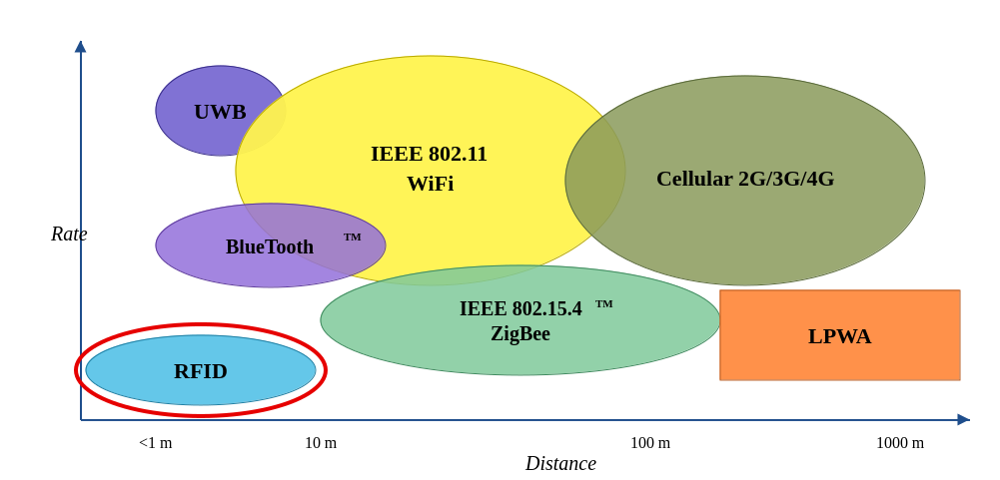
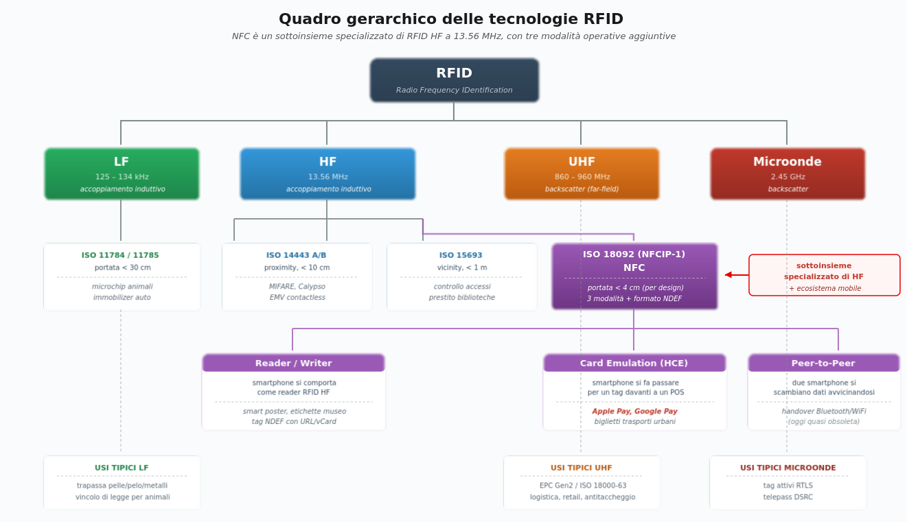
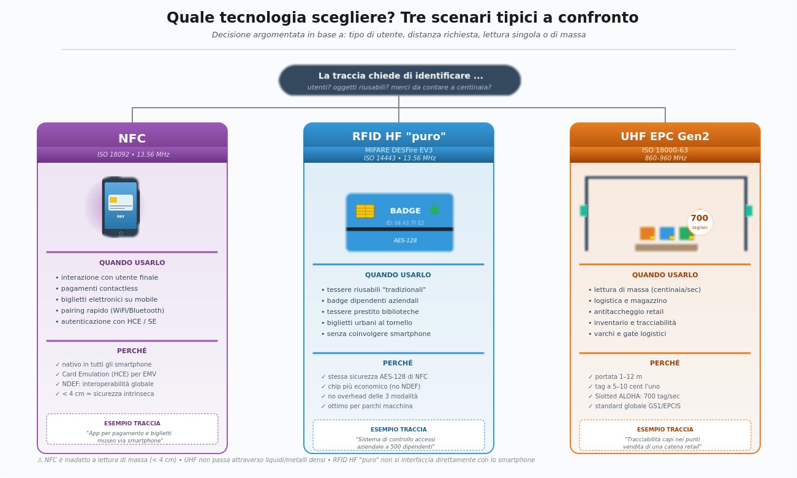

## **TECNOLOGIE RFID**

> [Torna a reti di sensori](https://github.com/sebastianomelita/ArduinoBareMetal/blob/master/sensornetworkshort.md)

- [Dettaglio architettura Ethernet](archeth.md)
- [Dettaglio architettura BLE](archble.md)
- [Dettaglio architettura zigbee](archzigbee.md)
- [Dettaglio architettura WiFi infrastruttura](archwifi.md)
- [Dettaglio architettura WiFi mesh](archmesh.md) 
- [Dettaglio architettura LoraWAN](lorawanclasses.md) 
- [Dettaglio architettura 5G/6G](ranprivata.md)

Servizi:
- [DNS](https://it.wikipedia.org/wiki/Domain_Name_System)
- [DHCP](https://it.wikipedia.org/wiki/Dynamic_Host_Configuration_Protocol)
- [PVLAN](/approfondimenti/private_vlan.md)
- [VPN di reti Ethernet](ethvpn.md)
- [Secure network moderne](/approfondimenti/dispensa_reti_moderne.md)
- [Firewall](firewall.md)
- [ACL](approfondimenti/acl/dispensa_sistemi_reti.md)
- [Autenticazione 802.1X](radius.md)
- [Autenticazione SSO Active Directory](/approfondimenti/00_dispensa_principale.md)
- [Continuità di servizio](/approfondimenti/continuita_di_servizio.md)
- [Backup](backup.md)
- [Spillamento fibra](/esempi/progetti/dettaglio_spillamento_fibra.md) 

## **Caso d'uso RFID**

L'**RFID** (Radio Frequency IDentification) non è una tecnologia di rete di sensori in senso stretto, ma una **tecnologia di identificazione automatica** (Auto-ID) che si pone come alternativa o complemento al **codice a barre**, al **QR code** e, in alcuni scenari, al **BLE beacon**. I casi d'uso tipici sono **identificazione**, **tracciamento** e **autenticazione** di oggetti o persone in scenari dove è richiesta una **lettura rapida**, **senza contatto** e potenzialmente **senza linea di vista** (NLOS).

A differenza di BLE, WiFi e LoRaWAN, l'RFID nella sua forma classica (passiva) **non trasmette dati di sensore** in modo autonomo: i tag passivi non hanno batteria, non si "svegliano" da soli e non collaborano in una rete mesh. Sono **dispositivi reattivi** che entrano in funzione **solo** quando illuminati dal campo elettromagnetico di un **reader** (interrogatore).

I casi d'uso tipici si dividono in **macro-categorie**:

- **Controllo accessi** (badge aziendali, ski-pass, chiavi alberghiere, telepass) — RFID HF/UHF a corto raggio.
- **Tracciamento di oggetti** in **catena logistica**, **magazzino**, **manufacturing** — RFID UHF a medio raggio (varchi, gate, scaffali smart).
- **Antitaccheggio** retail (EAS - Electronic Article Surveillance) — varchi UHF/HF.
- **Identificazione animali** (microchip sottocutanei) — RFID LF (134.2 kHz, ISO 11784/11785).
- **Pagamenti contactless** e **biglietti trasporti** — NFC (sottoinsieme di RFID HF a 13.56 MHz).
- **Autenticazione documenti** (passaporto elettronico, carta d'identità elettronica) — NFC/HF.
- **Tracciamento sanitario** (sacche di sangue, strumenti chirurgici, identificazione paziente) — HF/UHF.

L'RFID è dunque **complementare** alle reti di sensori: in molti scenari si **integra** con BLE, WiFi o LoRaWAN, dove i reader RFID svolgono il ruolo di **dispositivi terminali** che, a loro volta, si collegano a una **rete di distribuzione IP** tramite un **gateway**.

## **Aspetti critici**

- [Aspetti critici comuni per tutte le tecnologie](approfondimenti/aspetti_critici_generali.md)

- **Aspetti particolari per RFID**
     - **Tecnologie dei tag** da usare: **passivi**, **attivi**, **semi-passivi (BAP)**. La scelta determina
  **portata**, **costo** e **durata**.
     - **Scelta della frequenza di lavoro** (**LF**, **HF**, **UHF**, **microonde**) in funzione di
        **materiali**, **distanza** e **vincoli normativi nazionali**.
     - **Densità dei tag** simultanei nel campo (**dense reader environment**) e necessità di eventuali
        protocolli di **anticollisione**.
     - Posizionamento in planimetria dei **nodi** con relativa etichetta, avendo cura che tra essi esista
        almeno **un gateway** che permetta l'accesso a una rete IP. Progettare dei **percorsi alternativi
        (backup)** in caso di guasto del gateway principale.
       Gestire eventuali **vincoli di prossimità** (controllo di potenza o gestione del roaming) ed eventuali
        **vincoli di posizionamento** (trilaterazione).
     - Definizione del percorso dei dati tra sensori ed eventuali attuatori per stabilire la
        **sede dell'elaborazione dei comandi** più opportuna (locale/edge sul gateway vs remota on-premise/cloud).

[Cheat Sheet](/cheatsheet/cheatsheet.md)

---
## **Progetto di esempio completo 1**

[Testo della prova cassone Smart](/esempi/progetti/consegna_esame.pdf)

[Svolgimento Cassone Smart](/esempi/progetti/soluzione_scenario_C.md)

## **Progetto di esempio completo 2**

[Testo della prova rete RFID metropolitana](/esempi/progetti/1_simulazione_seconda_prova_informatica_ITIA_26.pdf)

[Svolgimento rete RFID metropolitana](/esempi/progetti/soluzione_seconda_prova_RFID.md)

---

## **Mappa degli approfondimenti**

Per ogni argomento è disponibile una **scheda di approfondimento** dedicata. Qui di seguito i **concetti chiave** di ciascuna sezione, con il link alla pagina completa.

### 📡 [Principi fisici](approfondimenti/rfid_principi_fisici.md)

Due principi distinti governano la trasmissione: **accoppiamento induttivo near-field** (LF/HF, fino a 1 m, immune a metalli) e **backscatter far-field** (UHF/microonde, fino a 12 m, sensibile a liquidi e metalli). Il **tag passivo** non ha batteria e ricava energia dal campo del reader (energy harvesting); ne consegue logica minimale, portata limitata e impossibilità di iniziare una comunicazione. I **tag attivi** (con batteria) e **semi-passivi** (BAP) superano questi limiti al costo di prezzo unitario maggiore. → [scheda completa](approfondimenti/rfid_principi_fisici.md)

### 🌊 [Frequenze di lavoro e NFC](approfondimenti/rfid_frequenze.md)

| Banda | Frequenza | Principio | Portata tipica | Velocità | Comportamento su metallo/acqua | Casi d'uso |
|---|---|---|---|---|---|---|
| **LF** | 125-134 kHz | Induttivo | < 10 cm | bassa (~1 kbps) | Ottimo: trapassa | Microchip animali, immobilizer auto |
| **HF / NFC** | 13.56 MHz | Induttivo | < 10 cm (NFC), fino 1 m (HF) | media (~106-848 kbps) | Buono | Pagamenti, ticketing, passaporti, biglietti, controllo accessi |
| **UHF** | 860-960 MHz | Backscatter | 1-12 m | alta (~640 kbps) | Pessimo: riflesso/assorbito | Logistica, retail, antitaccheggio |
| **Microonde** | 2.45 GHz | Backscatter | 1-2 m | molto alta | Pessimo | Telepass, tag attivi |

Quattro bande con caratteristiche complementari: **LF** (125-134 kHz, microchip animali), **HF** (13.56 MHz, controllo accessi, ticketing), **UHF** (860-960 MHz, logistica, retail), **microonde** (2.45 GHz, telepass). **NFC è un sottoinsieme specializzato di RFID HF** che aggiunge tre modalità (Reader/Writer, Card Emulation/HCE, Peer-to-Peer), il formato dati standardizzato **NDEF** e l'integrazione nativa in tutti gli smartphone. La banda UHF in Europa è **865-868 MHz** (ETSI EN 302 208), max 2 W ERP con LBT. → [scheda completa](approfondimenti/rfid_frequenze.md)

### 🏷️ [Tag e Reader](approfondimenti/rfid_tag_reader.md)

Il **tag** è composto da antenna, chip integrato (IC) e substrato; i tag UHF EPC Gen2 hanno quattro banchi di memoria (Reserved, EPC, **TID** non modificabile per anti-clonazione, User). I formati commerciali principali sono inlay, smart label, hard tag, on-metal, wearable, impiantabile. Il **reader** può essere **fisso** (varchi, smart shelf, alta potenza) o **handheld** (mobile, batteria). Le **antenne** vanno scelte per polarizzazione (lineare/circolare), guadagno, beamwidth e tipo di campo (near/far-field). → [scheda completa](approfondimenti/rfid_tag_reader.md)

### 📚 [Standard RFID](approfondimenti/rfid_standard.md)

Standard chiave: **ISO 11784/11785** (animali LF), **ISO 14443** (proximity HF, MIFARE/EMV), **ISO 15693** (vicinity HF), **ISO 18092** (NFC), **ISO 18000-63 / EPC Gen2 v2** (UHF logistica). Il ciclo di lettura EPC Gen2 si articola in **Select → Inventory → Access** e raggiunge ~700 tag/sec. **EPCIS** (GS1) è il vocabolario standard per scambiare eventi RFID di business tra aziende: ObjectEvent, AggregationEvent, TransactionEvent, TransformationEvent. Il protocollo standard reader-middleware è **LLRP** (binario su TCP/IP). → [scheda completa](approfondimenti/rfid_standard.md)

### 🏗️ [Architettura del sistema, middleware, gateway, MQTT](approfondimenti/rfid_architettura.md)

Architettura a **quattro strati**: tag fisico → reader → middleware → applicazione (ERP/WMS). Il **middleware** filtra, deduplica, smoothing, correla a trigger esterni e fa la **traduzione semantica** dell'EPC in dati di business. A differenza del BLE (semantica L7-aware nativa), l'RFID si ferma a L2 e la semantica va costruita dal middleware. Il **gateway** è il dispositivo di confine che traduce **LLRP → JSON/MQTT**, fa buffering in caso di link down, applica logica edge e protezione di rete. I **topic MQTT** seguono una gerarchia spaziale (es. `azienda/sede/area/reader/letture`). → [scheda completa](approfondimenti/rfid_architettura.md)

### 🗺️ [Topologie di lettura](approfondimenti/rfid_topologie.md)

Tre schemi possibili. **Reader fisso** (dominante in logistica): pochi reader costosi in punti strategici, tantissimi tag economici sugli oggetti, localizzazione a granularità di varco. **Tag attivo** (RTLS): tag con batteria che annunciano la propria presenza, scanner fissi distribuiti che ne calcolano la posizione per trilaterazione (oggi spesso sostituito da BLE 5.x con AoA o UWB). **Reader mobile (handheld)**: reader portatile in mano all'operatore, tag fissi sugli oggetti, tipico di inventario notturno e ricerca puntuale. → [scheda completa](approfondimenti/rfid_topologie.md)

### 🔄 [Anticollisione e accesso al canale](approfondimenti/rfid_anticollisione.md)

Il problema dell'RFID non è "chi parla quando" ma "**come distinguere tag che rispondono tutti insieme**" alla stessa interrogazione. **Slotted ALOHA / Q-protocol** (UHF EPC Gen2): probabilistico, velocissimo (~700 tag/sec) ma statistico — adatto a logistica massiva. **Binary Tree** (ISO 14443/15693): deterministico, più lento ma garantisce di leggere tutti i tag — adatto ad autenticazione affidabile (pagamenti, controllo accessi). In dense reader environment serve **LBT** (Listen Before Talk) e **frequency planning** sui 15 canali da 200 kHz disponibili in Europa. → [scheda completa](approfondimenti/rfid_anticollisione.md)

### 🔐 [Sicurezza e privacy](approfondimenti/rfid_sicurezza.md)

Minacce tipiche: **eavesdropping** (lettura UHF a 30-50 m), **clonazione** dei tag low-end, **tracking** spaziale, **tampering**, **DoS**, **replay**. Contromisure: **autenticazione mutua AES-128** (MIFARE DESFire EV3, NTAG 424 DNA), crittografia del payload, **TID univoco** per anti-clonazione, **kill command** per privacy alla vendita, schermatura fisica, rolling codes. Il **GDPR** richiede privacy by design: dati sul tag minimizzati, kill alla cessione, informativa visibile, log dei reader per audit. → [scheda completa](approfondimenti/rfid_sicurezza.md)

### 🆚 [Confronto con tecnologie alternative per scenari](approfondimenti/rfid_scenari.md)

Per ogni caso d'uso esistono alternative all'RFID che vanno valutate: **codice a barre/QR**, **BLE beacon**, **UWB**, **biometria**. Sei scenari analizzati con tabelle comparative: tracciamento merci, controllo accessi, pagamenti, ticketing, identificazione paziente, identificazione animali. **Sintesi rapida**: NFC se c'è uno smartphone in gioco, RFID HF "puro" (MIFARE DESFire EV3) se servono tessere riusabili senza smartphone, UHF EPC Gen2 se serve lettura di massa. → [scheda completa](approfondimenti/rfid_scenari.md)

### 📡 [Localizzazione Indoor: Trilaterazione e RSSI Fingerprinting](approfondimenti/position.md)

Il fingerprinting costruisce offline un database di firme RSSI per ogni punto noto dello spazio e, online, confronta la misura corrente con quelle memorizzate per stimare la posizione — senza bisogno di alcun modello di propagazione. La trilaterazione invece converte l'RSSI in distanze geometriche tramite un modello fisico, risultando fragile in ambienti indoor dove riflessioni e NLOS distorcono il segnale. Il fingerprinting eccelle proprio dove la trilaterazione fallisce: ambienti multipath densi, muri spessi, e soprattutto geometrie di AP sfavorevoli come la collinearità, che genera un'intersezione mal condizionata (*poor GDOP*). Il suo limite principale è il costo della raccolta dati e la sensibilità ai cambiamenti ambientali, che richiedono aggiornamenti periodici della mappa. → [scheda completa](approfondimenti/position.md)

### 📝 [Esempio di traccia svolta in stile seconda prova](approfondimenti/rfid_seconda_prova.md)

Soluzione completa di una traccia d'esame: **catena di abbigliamento con 50 punti vendita** che vuole inventario in tempo reale, antitaccheggio, velocità di cassa e integrazione cloud. Comprende: scelta tecnologica argomentata (UHF EPC Gen2), architettura del singolo store con 4 tipi di reader e gateway locale, architettura backend cloud, schema di subnetting con VLAN dedicata e VPN IPsec, gerarchia di topic MQTT, esempi di messaggi JSON (lettura scaffale, allarme antitaccheggio, kill alla cassa), pseudocodice del firmware del gateway con buffer di resilienza, contromisure di sicurezza e privacy by design GDPR. → [scheda completa](approfondimenti/rfid_seconda_prova.md)

---

## **Pagine correlate**

- [Dettaglio architettura Ethernet](archeth.md)
- [Dettaglio architettura BLE](archble.md)
- [Dettaglio architettura zigbee](archzigbee.md)
- [Dettaglio architettura WiFi infrastruttura](archwifi.md)
- [Dettaglio architettura WiFi mesh](archmesh.md) 
- [Dettaglio architettura LoraWAN](lorawanclasses.md) 
- [Dettaglio architettura 5G/6G](ranprivata.md)

## **Sitografia**

- <https://www.gs1.org/standards/epc-rfid>
- <https://www.gs1.org/standards/epcis>
- <https://www.epc-rfid.info/>
- <https://www.iso.org/standard/73599.html> (EPC Gen2 v2 / ISO 18000-63)
- <https://www.etsi.org/deliver/etsi_en/302200_302299/302208/> (ETSI EN 302 208 - normativa UHF Europa)
- <https://www.nxp.com/products/rfid-nfc>
- <https://www.impinj.com/products/readers>
- <https://nfc-forum.org/build/specifications>
- <https://www.garanteprivacy.it/temi/rfid>
- <https://en.wikipedia.org/wiki/Radio-frequency_identification>
- <https://en.wikipedia.org/wiki/EPCglobal>
- <https://learn.adafruit.com/adafruit-pn532-rfid-nfc>

> [Torna a reti di sensori](https://github.com/sebastianomelita/ArduinoBareMetal/blob/master/sensornetworkshort.md)
