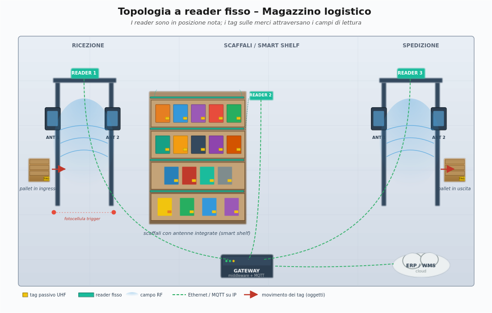
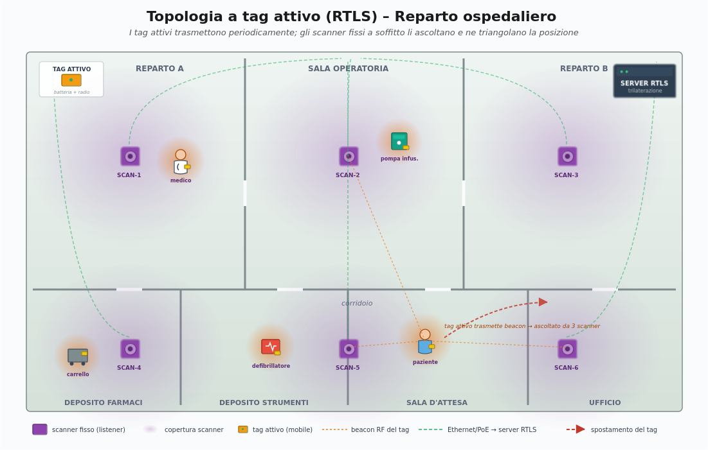

> [Torna a reti di sensori](https://github.com/sebastianomelita/ArduinoBareMetal/blob/master/sensornetworkshort.md)

- [Dettaglio architettura BLE](https://github.com/sebastianomelita/ArduinoBareMetal/blob/master/archble.md)
- [Dettaglio architettura zigbee](https://github.com/sebastianomelita/ArduinoBareMetal/blob/master/archzigbee.md)
- [Dettaglio architettura WiFi infrastruttura](https://github.com/sebastianomelita/ArduinoBareMetal/blob/master/archwifi.md)
- [Dettaglio architettura LoraWAN](https://github.com/sebastianomelita/ArduinoBareMetal/blob/master/lorawanclasses.md)

# **Architettura RFID**

## **Caso d'uso RFID**

L'**RFID** (Radio Frequency IDentification) non è una tecnologia di rete di sensori in senso stretto, ma una **tecnologia di identificazione automatica** (Auto-ID) che si pone come alternativa o complemento al **codice a barre**, al **QR code** e, in alcuni scenari, al **BLE beacon**. I casi d'uso tipici sono **identificazione**, **tracciamento** e **autenticazione** di oggetti o persone in scenari dove è richiesta una **lettura rapida**, **senza contatto** e potenzialmente **senza linea di vista** (NLOS).


A differenza di BLE, WiFi e LoRaWAN, l'RFID nella sua forma classica (passiva) **non trasmette dati di sensore** in modo autonomo: i tag passivi non hanno batteria, non si "svegliano" da soli e non collaborano in una rete mesh. Sono **dispositivi reattivi** che entrano in funzione **solo** quando illuminati dal campo elettromagnetico di un **reader** (interrogatore).

I casi d'uso tipici si dividono in **macro-categorie**:

- **Controllo accessi** (badge aziendali, ski-pass, chiavi alberghiere, telepass) — RFID HF/UHF a corto raggio.
- **Tracciamento di oggetti** in **catena logistica**, **magazzino**, **manufacturing** — RFID UHF a medio raggio (varchi, gate, scaffali smart).
- **Antitaccheggio** retail (EAS - Electronic Article Surveillance) — varchi UHF/HF.
- **Identificazione animali** (microchip sottocutanei) — RFID LF (134.2 kHz, ISO 11784/11785).
- **Pagamenti contactless** e **biglietti trasporti** — NFC (sottoinsieme di RFID HF a 13.56 MHz).
- **Autenticazione documenti** (passaporto elettronico, carta d'identità elettronica) — NFC/HF.
- **Tracciamento sanitario** (sacche di sangue, strumenti chirurgici, identificazione paziente) — HF/UHF.

L'RFID è dunque **complementare** alle reti di sensori: in molti scenari si **integra** con BLE, WiFi o LoRaWAN, dove i reader RFID svolgono il ruolo di **dispositivi terminali** che, a loro volta, si collegano a una **rete di distribuzione IP** tramite un **gateway**.

### **Aspetti critici**

Elementi **critici** su cui **bilanciare convenienze** e saper fare delle **scelte argomentate** in fase di progetto sono:

- schema fisico (**planimetria**) dell'infrastruttura con **posizionamento dei reader** (varchi, scaffali, gate logistici) ed **etichettatura univoca** di tutti gli asset taggati (EPC, UID).
- **classificazione dei tag** da usare: **passivi** (LF, HF, UHF), **attivi** (con batteria), **semi-passivi** (BAP, Battery-Assisted Passive). La scelta determina **portata**, **costo unitario** e **durata di vita**.
- **scelta della frequenza di lavoro** (LF 125-134 kHz, HF 13.56 MHz, UHF 860-960 MHz, microonde 2.45 GHz) in funzione del **materiale degli oggetti** (metalli, liquidi attenuano UHF), della **distanza di lettura** e dei **vincoli normativi nazionali** (in Europa la banda UHF RFID è 865-868 MHz secondo ETSI EN 302 208).
- **vincoli normativi** sulle tecnologie in uso come **potenza EIRP/ERP** e **duty cycle**. Per UHF in Europa: max **2 W ERP** con LBT (Listen Before Talk) o **0.5 W ERP** senza LBT.
- **densità dei tag** da leggere simultaneamente nello stesso campo (**dense reader environment**) e gestione delle **collisioni** tramite protocolli di **anticollisione** (Slotted ALOHA per EPC Gen2, Binary Tree per ISO 14443).
- definizione delle **tecnologie dei dispositivi chiave**: tag, reader (fissi o handheld), antenne (lineari, circolari, near-field), gateway/controller, server middleware.
- schema logico (albero degli **apparati attivi**) di tutti i dispositivi di rete con il loro ruolo e i **link virtuali** ai vari livelli della **pila ISO/OSI** (tipicamente L2, L3, L7).
- dislocazione di eventuali **gateway** tra rete RFID (seriale, USB, RS485, Ethernet industriale) e **rete IP di distribuzione**.
- **subnetting** e definizione degli indirizzi dei reader, dei controller, della server farm e dei server applicativi (middleware, ERP, WMS).
- definizione del **tipo di routing** (statico o dinamico).
- definizione della posizione del **broker MQTT** o del **middleware RFID** (es. server EPCIS).
- definizione dei **topic MQTT** utili per i casi d'uso richiesti (es. `azienda/magazzino/varco1/letture`).
- definizione dei **messaggi JSON** per le letture RFID, comprensivi di **EPC del tag**, **timestamp**, **ID reader**, **antenna**, **RSSI**.
- definizione (anche in pseudocodice) delle **funzioni del firmware** di bordo dei **reader** e del middleware (filtraggio, deduplica, smoothing).
- **considerazioni di sicurezza e privacy** (clonazione dei tag, eavesdropping, kill command, password di accesso al tag).

[Tag RFID](#caratteristiche-dei-tag)

[Reader RFID](#reader-rfid)

[Middleware RFID](#middleware-rfid)

[Anticollisione](#protocolli-di-accesso-al-canale)

## **Principi fisici**

L'RFID funziona grazie all'**accoppiamento elettromagnetico** tra un'antenna del reader e un'antenna del tag. Esistono **due principi fisici** distinti, che dipendono dalla **frequenza di lavoro** e quindi dalla **lunghezza d'onda** del campo:

- **Accoppiamento induttivo (near-field)**: usato a **LF e HF**. Reader e tag si comportano come due **bobine** di un trasformatore: il reader genera un **campo magnetico variabile** e induce una corrente nella bobina del tag. La distanza di lettura è limitata a **frazioni della lunghezza d'onda** (qualche cm fino a ~1 m). È il principio di **NFC** e di tutte le tessere contactless ISO 14443.
- **Accoppiamento elettromagnetico (far-field) per backscatter**: usato a **UHF e microonde**. Il reader emette un'**onda elettromagnetica** che raggiunge il tag, il quale **non genera** un proprio segnale ma **modula la propria impedenza d'antenna** (commutando tra "match" e "mismatch") riflettendo indietro una porzione dell'onda incidente. Il reader rileva queste variazioni di riflessione e ne estrae i dati. Distanze tipiche: **fino a 10-12 m** in spazio libero.

Questa differenza è **fondamentale** per la progettazione: il **near-field** è **immune** alle interferenze su lunghe distanze ma ha portata corta e richiede un **avvicinamento esplicito** dell'oggetto al reader; il **far-field** consente letture di **massa** a distanza ma soffre di **riflessioni** (multipath), assorbimenti da parte di **liquidi** (acqua, corpo umano) e schermature da parte di **metalli**.

### **Alimentazione del tag passivo**

Il **tag passivo** non ha batteria. La sua alimentazione è **prelevata direttamente dal campo elettromagnetico** del reader tramite un circuito di **rectenna** (antenna + raddrizzatore + condensatore di accumulo). Questo meccanismo, detto **energy harvesting RF**, è alla base del **bassissimo costo** del tag (pochi centesimi di euro per i tag UHF EPC Gen2) e della sua **durata illimitata** (non ci sono parti attive che si esauriscono).

Il **prezzo** di questa scelta è:

- il tag ha pochissima energia disponibile (tipicamente < 100 µW), per cui può eseguire solo logica **estremamente semplice** (un microcontroller dedicato a basso consumo).
- la **distanza di lettura** è limitata dall'**inverse-square law** del campo: raddoppiando la distanza, l'energia disponibile al tag si riduce di un fattore 4 (near-field: di un fattore 64, perché il campo magnetico decade con il cubo della distanza).
- il tag **non può iniziare** una comunicazione: parla solo se interrogato. Non può quindi fare polling autonomo, non può "svegliarsi" autonomamente, non può inviare allarmi.

### **Tag attivi e semi-passivi**

Per superare i limiti dei tag passivi sono nati i **tag attivi** e **semi-passivi**:

- **Tag attivo**: dotato di **batteria** propria (litio, durata 3-10 anni) e capace di **trasmettere autonomamente**. Può funzionare come un piccolo **beacon RFID** che annuncia periodicamente la propria presenza, raggiungendo distanze di **decine o centinaia di metri**. Costo unitario molto più alto (5-50 €). Usato in tracciamento container, **RTLS** (Real Time Location System) industriali, telepass autostradali (in realtà semi-passivi).
- **Tag semi-passivo (BAP)**: ha una **batteria** che alimenta solo l'**elettronica del tag** (ad esempio sensori di temperatura, accelerometri), ma la **comunicazione radio** continua ad avvenire per **backscatter** del segnale del reader. Compromesso utile per applicazioni di **cold chain** (catena del freddo) dove il tag deve **registrare la temperatura** anche in assenza di reader.

## **Classificazione per frequenza di lavoro**

La scelta della **frequenza** di lavoro è la **prima decisione progettuale** in un sistema RFID, perché determina **portata**, **velocità di lettura**, **comportamento in presenza di liquidi e metalli** e **costo dei tag**.

| Banda | Frequenza | Principio | Portata tipica | Velocità | Comportamento su metallo/acqua | Esempi |
|---|---|---|---|---|---|---|
| **LF** | 125-134 kHz | Induttivo | < 10 cm | bassa (~1 kbps) | Ottimo: trapassa | Microchip animali, immobilizer auto |
| **HF / NFC** | 13.56 MHz | Induttivo | < 10 cm (NFC), fino 1 m (HF) | media (~106-848 kbps) | Buono | Pagamenti, ticketing, passaporti, biglietti |
| **UHF** | 860-960 MHz | Backscatter | 1-12 m | alta (~640 kbps) | Pessimo: riflesso/assorbito | Logistica, retail, antitaccheggio |
| **Microonde** | 2.45 GHz | Backscatter | 1-2 m | molto alta | Pessimo | Telepass, tag attivi |

### **LF (Low Frequency, 125-134 kHz)**

È la frequenza **più antica** dell'RFID. Caratteristiche:

- **Portata** brevissima (qualche centimetro).
- **Immunità** quasi totale a metalli, liquidi e tessuti biologici (il campo magnetico a bassa frequenza penetra praticamente tutto).
- **Velocità** di trasferimento dati molto bassa.
- **Tag economici** ma fisicamente **più grandi** (la bobina deve avere molte spire).

Casi d'uso **dove queste caratteristiche sono vincenti**:

- **Identificazione animali**: il microchip sottocutaneo (FDX-B, ISO 11784/11785) deve funzionare attraverso pelle, tessuti e pelo dell'animale.
- **Immobilizer automobilistici**: la chiave dell'auto contiene un tag LF letto da un'antenna intorno al blocchetto di accensione.
- **Controllo accessi industriale** in ambienti sporchi (concerie, fabbriche metalmeccaniche) dove HF/UHF non funzionerebbero.

### **HF (High Frequency, 13.56 MHz) e NFC**

È la frequenza più **versatile** per l'identificazione "di prossimità":

- **Portata** corta (max 10 cm per NFC, fino a 1 m per HF "vicinity").
- **Velocità** medio-alta sufficiente per gestire **autenticazione crittografica**.
- **Standard maturi**: ISO 14443 (proximity, < 10 cm), ISO 15693 (vicinity, fino 1 m), ISO 18092 (NFC).
- **Tag** in formato **carta di credito**, **adesivo sottile**, **portachiavi**.
- Compatibilità con **smartphone**: tutti gli smartphone moderni hanno un'antenna NFC, il che rende HF la frequenza preferita per **applicazioni rivolte all'utente finale**.

**NFC** (Near Field Communication) è un **sottoinsieme** dell'HF a 13.56 MHz, standardizzato per garantire l'**interoperabilità** tra dispositivi mobili e tag. Aggiunge la modalità **peer-to-peer** (due smartphone che si scambiano dati avvicinandoli) e la modalità **card emulation** (lo smartphone si comporta come una carta contactless, alla base di Apple Pay e Google Pay).

Casi d'uso:

- **Pagamenti contactless** (carte di debito, smartphone).
- **Trasporti pubblici** (Oyster Card a Londra, Navigo a Parigi, biglietti ATM).
- **Documenti d'identità elettronici** (CIE, passaporto biometrico).
- **Controllo accessi sicuro** (badge aziendali con MIFARE DESFire).
- **Smart poster** e marketing interattivo.

### **UHF (Ultra High Frequency, 860-960 MHz)**

È la frequenza **dominante** nella **logistica**:

- **Portata** lunga (fino a 12 m con reader ad alta potenza e tag ottimizzati).
- **Lettura simultanea** di centinaia di tag al secondo (importante per leggere un pallet intero in un colpo solo).
- **Tag economici** in formato **inlay** (etichetta adesiva con antenna stampata).
- **Banda** non armonizzata globalmente: in Europa **865-868 MHz** (ETSI EN 302 208), negli USA **902-928 MHz** (FCC), in Giappone 916-921 MHz. Un tag UHF "regionale" non sempre funziona ottimamente in altre regioni.
- **Sensibilità** ai **metalli** (riflessione) e ai **liquidi** (assorbimento). Esistono tag **on-metal** progettati per essere applicati su superfici metalliche.

Lo standard di riferimento è **EPC Gen2 v2** (ISO 18000-63) gestito da **GS1**. Il tag contiene un **EPC** (Electronic Product Code), tipicamente di 96 bit, che identifica univocamente l'oggetto.

Casi d'uso:

- **Magazzino e logistica**: ricezione merce, inventario, picking.
- **Retail**: tracciamento dei capi di abbigliamento dalla produzione allo scaffale, antitaccheggio integrato.
- **Cantieri** e **manufacturing**: tracciamento utensili, materie prime, work-in-progress.
- **Telepass** autostradali (in molti casi tag attivi o semi-passivi a UHF/microonde).

### **Microonde (2.45 GHz)**

Banda meno usata, riservata a:

- **Tag attivi** per **RTLS** in cui si richiede maggiore velocità di lettura o tag con sensori complessi.
- **Telepass** in alcune realizzazioni (sebbene la tendenza sia migrare verso UHF a 5.8 GHz in DSRC).
- Applicazioni **militari** e **industriali** specializzate.

## **Caratteristiche dei tag**

### **Composizione interna**

Un tag RFID passivo è composto da:

- **Antenna**: ne determina **dimensioni**, **frequenza** di lavoro, **direttività** e quindi **distanza di lettura**. Le antenne **dipolo** UHF sono lunghe ~16 cm; le antenne HF sono **bobine** stampate.
- **Chip integrato (IC)**: contiene la **memoria** (32 bit - 64 KB), la **logica** di anticollisione, il **modulatore di backscatter** (UHF) o il **modulatore di carico** (HF/LF) e il **rectifier** per l'alimentazione.
- **Substrato**: pellicola plastica (PET, PVC), carta o materiale ceramico (per tag on-metal).

### **Memoria del tag**

I tag UHF EPC Gen2 hanno **quattro banchi di memoria**:

| Banco | Contenuto | Note |
|---|---|---|
| **Reserved (00)** | password di **kill** e di **access** | scrivibili, possono essere protetti |
| **EPC (01)** | codice EPC dell'oggetto + CRC + PC | tipicamente 96 bit, leggibile da chiunque |
| **TID (10)** | identificativo univoco del **chip**, scritto dal produttore | non riscrivibile, utile per anti-clonazione |
| **User (11)** | memoria utente libera | da 0 a 8 KB a seconda del modello |

Il **TID** è particolarmente importante per la **sicurezza**: è scritto in fabbrica e **non può essere modificato**, quindi può essere usato per verificare l'**autenticità** del tag (mentre l'EPC potrebbe essere copiato su un tag-clone, il TID no).

### **Tipologie commerciali**

I formati commerciali più diffusi sono:

- **Inlay**: chip + antenna su pellicola PET, pronto per essere incapsulato in un'**etichetta adesiva** stampabile. Il più economico, usato in retail e logistica.
- **Smart label**: inlay laminato in un'etichetta di carta stampabile con stampante termica.
- **Hard tag**: incapsulato in plastica rigida, riutilizzabile (es. tag antitaccheggio sui capi).
- **On-metal tag**: con strato isolante o ceramico, progettato per essere applicato su superfici metalliche.
- **Wearable**: braccialetti per ospedali, festival, parchi divertimento.
- **Impiantabile**: microchip in capsula di vetro biocompatibile per animali.

## **Reader RFID**

Il **reader** (o **interrogatore**) è il dispositivo **attivo** dell'architettura RFID. Contiene:

- un **trasmettitore** RF capace di erogare la potenza necessaria a illuminare i tag (fino a 2 W ERP in UHF Europa).
- uno o più **ricevitori** in grado di rilevare il debole segnale di backscatter dei tag.
- un **microcontroller** (o SoC ARM Cortex-A) che esegue il protocollo di anticollisione e gestisce la comunicazione verso il middleware.
- una o più **porte di antenna** (4-16 nei reader fissi industriali) per coprire varchi multipli o aree estese.
- **interfacce di rete**: Ethernet (RJ45, PoE), WiFi, USB, RS232/RS485, GPIO per integrazione con PLC industriali.

### **Reader fissi vs handheld**

I reader si dividono in due categorie principali:

- **Reader fissi**: installati in posizioni note (varchi, gate logistici, scaffali smart, nastri trasportatori). Hanno **potenza alta**, **antenne esterne** e **molteplici porte**. Sono i **listener** del sistema: stanno costantemente in ascolto di tag che attraversano il loro campo. **Esempio**: Impinj Speedway R420, Zebra FX9600.
- **Reader handheld**: dispositivi mobili con **batteria**, **antenna integrata** e spesso un **lettore di codici a barre** abbinato. Usati per inventario manuale, picking, ricerca di un singolo tag. **Esempio**: Zebra MC3300R, Honeywell IH40.
- **Reader integrati in smartphone**: tutti gli smartphone moderni hanno un **reader NFC** integrato (HF a 13.56 MHz). Per UHF esistono custodie e add-on con reader UHF (sled).

### **Antenne**

L'**antenna** è il componente **più critico** per la performance del sistema. Va scelta in base a:

- **Polarizzazione**: **lineare** (massima portata in una direzione precisa, ma il tag deve essere allineato) oppure **circolare** (portata leggermente inferiore ma indipendente dall'orientamento del tag — la scelta di default per logistica generica).
- **Guadagno**: tipicamente 6-9 dBi per antenne fisse UHF. Più alto = più portata ma campo più stretto.
- **Beamwidth**: l'angolo del **lobo principale**. Antenne strette (30°) per varchi puntuali, antenne larghe (70°-90°) per coprire un'area.
- **Near-field vs far-field**: per applicazioni come scaffali smart o casse retail si usano antenne **near-field** UHF che funzionano per accoppiamento induttivo a corto raggio, evitando di leggere tag fuori area.

### **Posizionamento delle antenne**

In una progettazione tipica si distinguono:

- **Varchi (portal)**: due antenne montate su un telaio ai lati di una porta di magazzino. Il tag viene letto mentre passa nel mezzo. Il **trigger** di inizio lettura è spesso una **fotocellula** o una **barriera ottica** che rileva il passaggio fisico, in modo da delimitare la finestra di lettura ed evitare letture di tag fermi nelle vicinanze.
- **Gate per nastri trasportatori**: antenne installate sopra e sotto il nastro, sincronizzate con la velocità del nastro per individuare la posizione esatta del tag.
- **Scaffali smart**: antenne distribuite sui ripiani per inventario continuo (smart shelf).
- **Cabine di lettura (tunnel)**: tunnel completamente schermato in cui il pallet entra per la registrazione completa del contenuto (utile per evitare false letture di pallet adiacenti).
- **Overhead**: antenne montate sul soffitto per coprire ampie aree (es. ingresso negozio).

## **Standard principali**

L'RFID è coperto da una galassia di standard. I più rilevanti per la **seconda prova** sono:

| Standard | Banda | Applicazione | Portata |
|---|---|---|---|
| **ISO 11784/11785** | LF (134.2 kHz) | Identificazione animali (FDX-B) | < 30 cm |
| **ISO 14443 A/B** | HF (13.56 MHz) | Carte contactless di prossimità (NFC card emulation, MIFARE, EMV contactless) | < 10 cm |
| **ISO 15693** | HF (13.56 MHz) | Vicinity card (libri, controllo accessi a media distanza) | fino 1 m |
| **ISO 18092 (NFCIP-1)** | HF (13.56 MHz) | NFC peer-to-peer | < 10 cm |
| **ISO 18000-63 / EPC Gen2 v2** | UHF (860-960 MHz) | Logistica, retail, antitaccheggio | 1-12 m |
| **ISO 18000-3** | HF | RFID HF "vendor neutral" | < 1 m |
| **ISO 24730** | varie | RTLS (Real Time Location Systems) | > 30 m |

La **scelta dello standard** vincola tutto il resto del progetto: tag, reader, middleware, ecologia di fornitori. È uno degli **aspetti critici** da motivare in fase di progetto.

### **EPC Gen2: anatomia di una lettura**

Per la seconda prova è utile conoscere il funzionamento di **EPC Gen2**, lo standard UHF più diffuso. Il reader segue un ciclo composto da tre fasi:

1. **Select**: il reader invia un comando per selezionare il sottoinsieme di tag su cui operare (es. solo i tag con un certo prefisso EPC).
2. **Inventory**: il reader esegue una **slotted ALOHA** per identificare uno alla volta tutti i tag selezionati. Manda un comando `Query` con un parametro `Q` che determina il numero di slot temporali (2^Q). Ogni tag estrae un numero casuale tra 0 e 2^Q-1 e risponde solo nel proprio slot. Le collisioni vengono risolte aggiustando dinamicamente Q.
3. **Access**: una volta identificato un tag, il reader può leggerne/scriverne la memoria, autenticarsi con password, eseguire un kill.

L'inventory di EPC Gen2 è straordinariamente veloce: un buon reader può identificare **fino a ~700 tag/secondo**.

## **Middleware RFID**

Le letture grezze prodotte dai reader sono **inutilizzabili direttamente** dalle applicazioni di business. Un tag fermo davanti a un'antenna può generare **migliaia di letture al secondo**, tutte identiche. Un'antenna può "vedere" un tag che è in realtà su un pallet adiacente. Un tag si può perdere e poi riapparire.

Per questo tra il **livello dei reader** e il **livello applicativo** (ERP, WMS, sistemi di tracciabilità) si interpone un **middleware RFID**, che svolge funzioni di:

- **Filtraggio**: scarta letture sotto una soglia di RSSI, o di antenne non interessanti per quell'evento.
- **Deduplica**: aggrega le centinaia di letture dello stesso tag in un **singolo evento** ("tag X visto al varco 1 alle 10:32:15").
- **Smoothing**: gestisce le **oscillazioni** dovute a riflessioni e angoli di lettura sfavorevoli (un tag visto, perso, riacquisito è in realtà sempre presente).
- **Correlazione con eventi esterni**: aggancia la lettura RFID al **trigger** della fotocellula del varco, allo **stato del PLC**, all'**ordine di lavoro** corrente.
- **Traduzione semantica**: converte l'**EPC binario** in un **identificativo di business** (codice articolo, lotto, scadenza) consultando il **database aziendale**.
- **Pubblicazione**: invia gli eventi raffinati al **broker MQTT**, al **server EPCIS** o direttamente all'**ERP** via API REST.

Il middleware può essere:

- **Embedded** nel reader stesso (i reader moderni hanno SoC Linux e permettono di eseguire script Python, Node.js o moduli Java direttamente a bordo).
- **On-edge** su un **gateway** dedicato collocato vicino ai reader (riduce traffico di rete e latenza).
- **Centralizzato** su un server di middleware (es. **Impinj ItemSense**, **Zebra MotionWorks**, **Mojix ViZix**, **soluzioni open-source come RFID-Edge o LLRP-toolkit**).

### **Standard EPCIS**

**EPCIS** (Electronic Product Code Information Services) è uno standard **GS1** che definisce **come** rappresentare e scambiare gli eventi RFID di business tra aziende. Definisce quattro tipi di evento:

- **ObjectEvent**: un singolo oggetto è stato osservato (es. "tag 123 letto al varco di ricezione").
- **AggregationEvent**: un oggetto è stato associato a un contenitore (es. "10 cartoni caricati su questo pallet").
- **TransactionEvent**: un oggetto è stato associato a una transazione di business (es. "questo articolo è parte dell'ordine #4567").
- **TransformationEvent**: un input è stato trasformato in output (es. "10 kg di farina + 5 L di acqua sono diventati 15 kg di pasta").

Per la **seconda prova**, è sufficiente sapere che l'EPCIS è il "vocabolario standard" con cui le aziende si scambiano informazioni RFID nelle filiere globali.

## **Architettura di sistema**

Lo schema architetturale tipico di un sistema RFID si compone di **quattro strati**:

```
                            ┌──────────────────────────────┐
   Strato applicativo  →    │  ERP / WMS / MES / Web App   │
                            └─────────────┬────────────────┘
                                          │  REST / MQTT / EPCIS
                            ┌─────────────┴────────────────┐
   Strato middleware   →    │  Filtraggio - Deduplica -    │
                            │  Smoothing - Traduzione      │
                            └─────────────┬────────────────┘
                                          │  LLRP / proprietario
                            ┌─────────────┴────────────────┐
   Strato di lettura   →    │  Reader fissi e handheld     │
                            └─────────────┬────────────────┘
                                          │  RF (LF/HF/UHF)
                            ┌─────────────┴────────────────┐
   Strato fisico       →    │  Tag RFID sugli oggetti      │
                            └──────────────────────────────┘
```

Il **protocollo standard** tra reader e middleware è **LLRP** (Low Level Reader Protocol, EPCglobal/ISO 19762), un protocollo binario su TCP/IP che permette al middleware di **configurare** i reader (potenza, antenne attive, modalità di inventory) e ricevere le letture in **formato standard**, indipendentemente dal vendor.

In alternativa, molti reader moderni offrono direttamente:

- una **interfaccia REST** o **WebSocket** per integrazioni semplici.
- un **client MQTT** integrato che pubblica le letture su un broker.


## **Semantica applicativa**

A differenza di **BLE**, dove la **semantica** dei dispositivi (lampade, termostati, pulsanti) è **standardizzata** dal protocollo fino al livello di **presentazione** della pila ISO/OSI, l'**RFID base** scambia esclusivamente **identificativi binari** (EPC, UID): è quindi un protocollo che si **ferma al livello 2** della pila ISO/OSI per quanto riguarda l'**accesso al tag**, e **non possiede** una semantica applicativa standard incorporata.

Si può quindi dire che:

- una **rete BLE** scambia **oggetti domotici strutturati** (lampada con stato on/off, termostato con setpoint, ecc.) il cui significato è noto allo stack del protocollo. È una rete **L7-aware**.
- una **rete RFID** scambia **codici identificativi** privi di significato applicativo intrinseco. Il "significato" dell'EPC `3035 0000 0000 1234 5678 ABCD` è dato da una **lookup table esterna** (database, ERP) che lo associa a un articolo specifico.
- la **traduzione semantica** è quindi un compito del **middleware**, non del protocollo radio.

### **Standard EPC: come si dà significato a un identificativo**

Lo standard **EPC** di GS1 introduce una **semantica strutturata** sopra l'identificativo binario. Un EPC SGTIN-96 (Serialized Global Trade Item Number) è composto da:

| Campo | Bit | Significato |
|---|---|---|
| Header | 8 | Tipo di EPC (es. 0x30 = SGTIN-96) |
| Filter | 3 | Tipo di unità logistica (item, case, pallet) |
| Partition | 3 | Indica come dividere i bit successivi tra Company Prefix e Item Reference |
| Company Prefix | 20-40 | Codice azienda assegnato da GS1 |
| Item Reference | 4-24 | Codice articolo all'interno dell'azienda |
| Serial Number | 38 | Numero seriale del singolo oggetto |

Esempio di rappresentazione URI:

```
urn:epc:id:sgtin:0614141.012345.62852
                  │       │      │
                  │       │      └── numero seriale del singolo capo
                  │       └────────  codice articolo (modello)
                  └────────────────  prefisso azienda GS1
```

Lo stesso codice si scrive in formato **binario tag** (96 bit, ciò che è effettivamente memorizzato sul tag) e in formato **EPC pure identity URI** (forma testuale leggibile usata dalle applicazioni). Il middleware si occupa della **conversione** tra le due rappresentazioni.

### **Esempio di evento RFID di business**

Una lettura grezza di reader produce qualcosa come:

```
Reader: 192.168.10.5
Antenna: 2
EPC (hex): 3035 0000 4D2 0000 CE54 D2A0
RSSI: -52
Timestamp: 2025-09-12T10:32:15.234Z
```

Dopo il passaggio nel **middleware**, l'evento viene tradotto in un **oggetto JSON** che include la **semantica di business**:

```json
{
  "eventTime": "2025-09-12T10:32:15.234Z",
  "eventType": "ObjectEvent",
  "epc": "urn:epc:id:sgtin:0614141.012345.62852",
  "businessStep": "urn:epcglobal:cbv:bizstep:receiving",
  "disposition": "urn:epcglobal:cbv:disp:in_progress",
  "readPoint": "urn:epc:id:sgln:0614141.00012.1",
  "bizLocation": "urn:epc:id:sgln:0614141.00012.0",
  "product": {
    "gtin": "00614141123459",
    "name": "T-shirt mod. Aurora taglia M colore blu",
    "lot": "L20250903"
  },
  "reader": {
    "id": "reader-magazzino-varco1",
    "antenna": 2,
    "rssi": -52
  }
}
```

Questo è il messaggio che viene pubblicato sul **broker MQTT** o inoltrato all'**ERP**.

## **Gateway**

### **Ruolo del gateway**

In una architettura RFID il **gateway** ha lo stesso ruolo concettuale che ha in una rete BLE: è il **dispositivo di confine** tra la **rete di accesso RFID** (che usa protocolli specializzati come **LLRP**, oppure interfacce **seriali RS232/RS485** dei reader low-end) e la **rete di distribuzione IP** dove vivono il broker MQTT, l'ERP, il middleware centrale.

Le funzioni tipiche del gateway sono:

- **Inoltro** (routing/bridging) dei messaggi tra reader e middleware:
  * **diretto** verso un middleware in **LAN aziendale**, con il gateway che possiede un **IP privato**.
  * **indiretto** tramite **VPN** o tunnel **GRE** verso un middleware **cloud** o **HQ aziendale**, con il gateway che possiede un **IP pubblico** sull'interfaccia Internet e un **IP privato** sul tunnel cifrato.
- **Traduzione di formato**: da messaggi LLRP (binari, su TCP) a messaggi MQTT (testuali, JSON, su TCP). Questa è la funzione principale che differenzia il gateway RFID dal gateway BLE: invece di tradurre **GATT → JSON**, qui si traduce **LLRP → JSON**.
- **Interrogazione periodica** (polling) dei reader: il gateway può configurare i reader per eseguire inventory continui o triggerati da GPI (General Purpose Input).
- **Raccolta e bufferizzazione** delle letture: in caso di **caduta del link** verso il middleware, il gateway può accumulare le letture in una **coda locale persistente** e ritrasmetterle quando la connessione è ripristinata. Funzionalità **fondamentale** in scenari logistici dove la perdita di una lettura significa la perdita di tracciabilità di un oggetto.
- **Esecuzione di logica di business "edge"**: filtraggio, deduplica, smoothing — cioè parte delle funzioni del middleware vengono eseguite a bordo del gateway per ridurre il traffico verso il backend.
- **Protezione della rete RFID**: firewall, segmentazione VLAN. Importante perché i reader RFID, essendo dispositivi embedded poco aggiornati, sono spesso un **vettore di attacco** verso la rete aziendale.

Il **gateway** è uno **snodo nevralgico** dei messaggi RFID, per cui la sua posizione dovrebbe essere **ben nota** e accuratamente **riportata in planimetria** per permettere una sua rapida manutenzione/sostituzione.

### **Gateway come Client MQTT**

In **generale**, su reti **non IP** (RFID, BLE, LoRaWAN), i **client MQTT** (con il ruolo di **publisher** o di **subscriber**) sono sempre i **gateway di confine** della **rete di sensori** o di Auto-ID. Nel caso RFID, il **client MQTT** è quasi sempre **a bordo del reader** (i reader Linux moderni includono client MQTT) oppure **a bordo del gateway** dedicato.

Le **uniche reti RFID** che non hanno bisogno di un gateway esterno sono quelle composte da **reader IP nativi** (Ethernet/WiFi) con client MQTT integrato, che possono pubblicare direttamente sul broker.

### **Gateway come router L7**

Avendo più interfacce su reti di tipo diverso sia in L1 che in L2, il gateway ha anche le funzioni di **router** e, se la rete di distribuzione è pubblica come **Internet**, anche di **firewall**.

Ma la funzione **più importante** che possiede nel contesto di una rete RFID è la **traduzione semantica** dei messaggi: l'**EPC binario** letto dal tag viene tradotto in un **oggetto JSON** che descrive l'**evento di business**, comprensivo di metadati (timestamp, ID reader, antenna, RSSI) e, opzionalmente, della **denormalizzazione** dell'EPC nei dati di prodotto consultando un **database locale**.

A differenza del caso BLE — dove la semantica applicativa standard delle entità (lampade, sensori) è **definita dal protocollo** — nell'RFID la semantica deve essere **costruita esplicitamente** dall'integratore, perché lo standard radio si limita a trasportare un identificativo.

### **Formato dei messaggi**

I **messaggi** sono attualmente definiti sotto forma di **oggetti JSON** in formato ASCII. Questo dovrebbe garantire da un lato l'interoperabilità tra reader RFID di vendor diversi, dall'altro l'interoperabilità con sistemi terzi che si occupano della pubblicazione dei dati o della loro elaborazione statistica.

Gli oggetti JSON scambiati nella rete di distribuzione vanno **progettati** in modo tale da includere tutti i campi necessari ai sistemi consumer:

```json
{
  "eventTime": "2025-09-12T10:32:15.234Z",
  "epc": "urn:epc:id:sgtin:0614141.012345.62852",
  "reader": "reader-magazzino-varco1",
  "antenna": 2,
  "rssi": -52,
  "direction": "IN",
  "businessStep": "receiving"
}
```

Il campo `direction` è un esempio di **arricchimento semantico** prodotto dal middleware: confrontando le **letture sequenziali** sulle antenne 1 e 2 di un varco, il middleware deduce se il pallet è entrato o uscito dal magazzino. Questa informazione **non è presente** nelle letture grezze: è una **costruzione di alto livello** del middleware.

### **Esempio di gerarchia di topic MQTT**

Sulla scorta dell'esempio BLE, una gerarchia tipica per un sistema RFID multi-sito potrebbe essere:

```
azienda/
  └── sede_milano/
        ├── magazzino/
        │     ├── varco_ricezione/
        │     │     ├── letture
        │     │     ├── stato
        │     │     └── config
        │     └── varco_spedizione/
        │           ├── letture
        │           ├── stato
        │           └── config
        └── produzione/
              └── linea_1/
                    ├── ingresso_materiale/letture
                    └── uscita_prodotto/letture
```

I **topic** seguono il principio **gerarchico-spaziale**: il prefisso identifica la **localizzazione** dell'evento, il suffisso specifica il **tipo di informazione** (letture, stato del reader, configurazione).

#### **Sottoscrizione di un'applicazione di tracciabilità**

Un'applicazione che vuole ricevere **tutte le letture di tutti i varchi del magazzino** si sottoscrive con il wildcard `+`:

```
mosquitto_sub -h broker.azienda.it -t 'azienda/sede_milano/magazzino/+/letture'
```

Un'applicazione di **monitoring** che vuole sapere **lo stato di salute** di tutti i reader dell'azienda si sottoscrive con il wildcard `#`:

```
mosquitto_sub -h broker.azienda.it -t 'azienda/+/+/+/stato'
```

#### **Configurazione remota di un reader**

Un comando di configurazione (es. cambio della potenza di trasmissione) viene pubblicato dal sistema di gestione:

```bash
mosquitto_pub -h broker.azienda.it \
  -t 'azienda/sede_milano/magazzino/varco_ricezione/config' \
  -m '{"txPower": 27.0, "antennas": [1, 2], "session": 1, "target": "A"}'
```

Il reader (o il gateway che lo controlla) è sottoscritto a questo topic e applica i parametri al volo.


## **Topologie di lettura**

Analogamente al caso del BLE — in cui distinguevamo tra **schema a beacon fisso** e **schema a scanner fisso** — nei sistemi RFID si possono individuare topologie analoghe, che corrispondono a **diverse responsabilità** dei componenti del sistema.

### **Topologia a reader fisso**

È l'approccio **dominante** nei sistemi RFID logistici. I **reader sono fissi**, posizionati in **punti strategici** noti a sistema (varchi, gate, scaffali smart) ed **etichettati univocamente**. I **tag** invece **si muovono** sugli oggetti, i quali entrano ed escono dai campi di lettura dei reader.



Si noti che in questo approccio:

- i **reader fissi** sono **collegati alla rete di distribuzione** (Ethernet/PoE/WiFi).
- i **tag** non hanno nessun collegamento di rete: sono **dispositivi isolati** la cui posizione viene inferita esclusivamente **dal punto in cui sono stati letti**.
- la **responsabilità** dell'elaborazione e del collegamento al server è **del reader** (o del gateway che lo serve).

La particolarità di questo approccio è:

- un **numero contenuto** di reader (relativamente costosi, 500-3000 €) installati nelle zone strategiche.
- un **numero potenzialmente enorme** di tag a basso costo (5 cent - 1 € l'uno) sugli oggetti.
- la **localizzazione** del tag è **a granularità di varco**: si sa che il tag X è passato per il varco Y al tempo Z, ma **non** se ne conosce la posizione tra un varco e l'altro.

**Esempio**: in un magazzino di e-commerce, si installano reader UHF su:

- **varchi di ricezione**: registrano l'ingresso delle merci dai fornitori.
- **stazioni di picking**: registrano la presa dell'articolo da parte dell'operatore.
- **varchi di spedizione**: registrano l'uscita verso il cliente.
- **eventuale tunnel di ribaltamento** per la verifica completa del contenuto di un pallet.

Il **WMS** (Warehouse Management System) ricostruisce la **storia** di ogni articolo correlando questi eventi.

### **Topologia a tag attivo**

Quando si vuole **localizzazione continua** invece di lettura **a varco**, si passa ai **tag attivi**: piccoli dispositivi a batteria che **trasmettono** periodicamente un beacon RFID (es. ogni 1-10 secondi). I **reader fissi** distribuiti nell'ambiente captano questi beacon e, tramite **trilaterazione** o **fingerprinting RSSI**, calcolano la posizione del tag.



Questa topologia è concettualmente analoga allo schema BLE a **scanner fisso**: anche qui i **dispositivi fissi** ascoltano i tag che si spostano. La differenza è che, mentre i beacon BLE sono **economici** e si possono distribuire a centinaia, i tag attivi RFID sono **più costosi** ma offrono **portate maggiori** (decine di metri vs i 5-15 m del BLE).

In molti sistemi **RTLS** moderni l'RFID attivo è stato **sostituito** da:

- **BLE attivo**: tag BLE 5.x con batteria e funzioni di Direction Finding (AoA/AoD) per localizzazione sub-metrica.
- **UWB**: localizzazione di precisione 10-30 cm grazie alla misurazione del **tempo di volo** (ToF) del segnale.

L'RFID attivo rimane competitivo solo in **scenari specifici** (lunga durata della batteria, ambienti con interferenze WiFi/BLE).

### **Topologia a reader mobile (handheld)**

In questo schema il **reader si muove** (handheld in mano all'operatore) e i **tag sono fissi** sugli oggetti. È l'approccio classico di:

- **inventario** periodico in negozi e magazzini: l'operatore "spazza" lo scaffale con il reader e raccoglie tutti gli EPC presenti.
- **ricerca puntuale** di un articolo specifico (modalità "Geiger counter": il reader emette un beep più rapido man mano che ci si avvicina al tag).
- **conta cespiti** in uffici e laboratori.

Si noti che in questo approccio:

- i **tag** sono fermi e isolati.
- il **reader** è mobile e si collega alla rete di distribuzione tramite **WiFi** o **4G/5G**, oppure raccoglie le letture in memoria locale e le scarica al rientro alla **base** via Ethernet/USB.

## **Protocolli di accesso al canale**

Il problema dell'**accesso al canale** in un sistema RFID è radicalmente diverso da quello di una rete di sensori IP, BLE o WiFi:

- nelle reti IoT classiche, **tutti i nodi sono attivi** e la sfida è **coordinarli** affinché parlino senza collidere.
- nell'RFID **passivo**, il **reader è l'unico iniziatore**: i tag rispondono solo se interrogati. Il problema non è quindi "chi parla quando" ma "**come distinguere centinaia di tag che rispondono tutti insieme**" alla stessa interrogazione.

Questo problema si chiama **anticollisione**.

### **Anticollisione Slotted ALOHA (UHF EPC Gen2)**

Lo standard **EPC Gen2** usa un meccanismo **probabilistico** noto come **Q-protocol**, una variante dello **Slotted ALOHA** dinamico:

1. Il reader trasmette un comando `Query` con un parametro `Q` (4 bit, valore 0-15).
2. Ogni tag estrae un **numero casuale** `s` nell'intervallo `[0, 2^Q - 1]`. Questo numero è il "**numero di slot**" che il tag deve attendere prima di rispondere.
3. Il reader incrementa di slot in slot un contatore con `QueryRep`. Quando il contatore raggiunge il valore `s` di un certo tag, quel tag risponde con un **RN16** (numero casuale di 16 bit).
4. **Tre casi possibili**:
    - **Slot vuoto**: nessun tag risponde → il reader passa allo slot successivo.
    - **Slot con un solo tag**: il reader riceve l'RN16 e rispedisce un `ACK(RN16)`. Il tag a questo punto trasmette il proprio **PC + EPC + CRC**, viene "**inventarizzato**" e rimane silente per il resto del round.
    - **Collisione** (più tag rispondono): il reader rileva un segnale corrotto e passa avanti.
5. Se ci sono **troppe collisioni**, il reader **aumenta** Q (più slot) per il prossimo round; se ci sono **troppi slot vuoti**, lo **diminuisce** (meno slot, round più veloce).

Questo meccanismo permette di leggere **centinaia di tag al secondo**, ma è **statistico**: in scenari molto densi (migliaia di tag) qualche lettura può richiedere **più round** per essere completata. Il middleware deve esserne consapevole e implementare strategie di **lettura ridondante**.

### **Anticollisione Binary Tree (HF, ISO 14443/15693)**

Negli standard HF ISO 14443 e 15693 si usa un meccanismo **deterministico** ad **albero binario**:

1. Il reader invia un comando di interrogazione.
2. Tutti i tag rispondono trasmettendo il proprio UID **bit a bit**, sincronizzati.
3. Quando il reader rileva una **collisione** in un certo bit (perché alcuni tag rispondono `0` e altri `1`), **biforca** la ricerca: continua interrogando solo i tag con prefisso `…0` e successivamente quelli con `…1`.
4. Il processo si ripete fino a isolare ciascun tag.

L'albero binario è **più lento** dello slotted ALOHA per popolazioni grandi, ma è **deterministico**: in tempo finito **garantisce** di leggere **tutti** i tag presenti. Per questo è preferito in scenari di **autenticazione** (pagamenti, controllo accessi) dove la lettura deve essere **affidabile** anche se più lenta.

### **Bande di frequenza e canalizzazione UHF**

In Europa la banda RFID UHF 865-868 MHz è suddivisa in **15 canali** larghi 200 kHz. Per evitare interferenze tra reader vicini (**dense reader environment**), i reader devono:

- usare il meccanismo di **LBT** (Listen Before Talk), simile al CSMA, per verificare che il canale sia libero prima di trasmettere.
- **saltare** tra canali (**channel hopping**) in modo casuale.
- rispettare il **duty cycle** stabilito dalla normativa (max 100% con LBT, 10% senza LBT su 200 kHz).

Questo è un altro **aspetto critico**: in un magazzino con **decine di reader** si deve fare un **piano dei canali** (frequency planning) e dimensionare correttamente il **timing degli inventory** per evitare che reader adiacenti si "rubino" i tag a vicenda.


## **Sicurezza e privacy**

L'RFID, per le caratteristiche stesse del mezzo (radio non confinata) e dei tag (logica minimale, no batteria), pone sfide di sicurezza **specifiche**.

### **Minacce principali**

- **Eavesdropping** (intercettazione): un attaccante con un'antenna direttiva può **leggere un tag UHF a 30-50 m** (molto più della distanza di lettura nominale del reader). Particolarmente grave per tag che memorizzano dati personali.
- **Clonazione**: i tag low-end (es. EM4100 LF, MIFARE Classic HF) hanno **memoria leggibile e riscrivibile** senza autenticazione. Un attaccante può leggere il tag della vittima e scrivere lo stesso UID/EPC su un tag vergine, ottenendo un **clone funzionalmente identico**.
- **Tracking** (sorveglianza): se un utente porta con sé tag UHF persistenti (es. tag cuciti nei vestiti acquistati al retail), può essere **tracciato** spazialmente da reader malevoli installati nelle vicinanze.
- **Tampering**: il tag può essere **fisicamente rimosso** dall'oggetto e applicato a un altro oggetto fraudolento (problema delle **swap attacks** nel retail).
- **Denial of service**: un trasmettitore malevolo nella stessa banda può **disturbare** la comunicazione tra reader e tag.
- **Replay attack**: registrare la comunicazione tra un tag legittimo e un reader e **riprodurla** in seguito davanti a un altro reader.

### **Contromisure**

Le contromisure si stratificano su livelli diversi:

- **Autenticazione mutua**: tag di fascia alta (MIFARE DESFire EV3, NTAG 424 DNA) implementano protocolli **challenge-response** basati su **AES-128**: il reader manda un nonce, il tag risponde con `AES_K(nonce)`, e solo se la risposta è corretta il reader concede l'accesso. Previene clonazione e replay.
- **Crittografia del payload**: i dati sensibili memorizzati sul tag sono cifrati. La chiave è custodita dal middleware/back-end, non dal reader.
- **Tag con TID univoco**: il **TID** scritto in fabbrica è non modificabile e crittograficamente firmato (es. **NXP UCODE 9** con autenticazione **Crypto-1.5**). Il reader può verificare il TID e rifiutare i cloni.
- **Kill command**: lo standard EPC Gen2 prevede un comando `Kill` protetto da password che **disabilita permanentemente** il tag. Usato per **disabilitare i tag al momento della vendita** in retail (privacy by design).
- **Access password**: alcune operazioni di scrittura sui tag richiedono una password di 32 bit, che deve essere conosciuta solo dal sistema legittimo.
- **Schermatura fisica**: portafogli e custodie **RFID-blocking** (con foglio metallico) impediscono a un attaccante di leggere tag NFC/HF ravvicinato.
- **Rolling codes**: per applicazioni di pagamento e telepass, ogni transazione usa una chiave **diversa** generata dinamicamente, vanificando il replay.

### **Privacy by design**

Il **Garante della Privacy** italiano e il **GDPR** europeo richiedono, per i sistemi RFID che trattano dati personali (carte di lealtà, badge dipendenti, biglietti integrati), di applicare il principio **privacy by design**:

- **minimizzare** i dati memorizzati sul tag (memorizzare solo un identificativo opaco; i dati personali stanno nel back-end protetto).
- prevedere il **kill** del tag quando l'utente lo richiede o al termine del ciclo (es. uscita dal negozio).
- **informare** l'utente della presenza del tag e della sua lettura (logo RFID visibile).
- **registrare i log** dei reader per audit.

Questo aspetto è **eticamente** importante e va citato esplicitamente nelle progettazioni della seconda prova quando si trattano scenari **rivolti al pubblico** (retail, trasporti, sanità).

## **Confronto con tecnologie alternative per scenari tipici**

Per ciascun caso d'uso tipico, l'RFID è una delle **possibili scelte tecnologiche**. Saper **giustificare la scelta** rispetto alle alternative è uno dei compiti centrali della seconda prova.

### **Scenario 1: tracciamento merci in magazzino**

| Tecnologia | Costo unitario tag | Portata | LoS richiesta | Lettura di massa | Scelta consigliata |
|---|---|---|---|---|---|
| **Codice a barre 1D** | quasi 0 | contatto | Sì | No, uno alla volta | inventario manuale di basso volume |
| **QR code** | quasi 0 | contatto | Sì | No, uno alla volta | beni con tracciabilità all'unità (farmaci, libri) |
| **RFID UHF (EPC Gen2)** | 5-15 cent | 1-12 m | No | Sì, centinaia/sec | **scelta principale** per logistica massiva |
| **BLE beacon** | 3-15 € | 5-30 m | No | Sì ma più lenta | per asset di alto valore, tracciamento continuo |
| **UWB** | 15-50 € | 50-100 m | No | Sì, con localizzazione precisa | RTLS di precisione su asset critici |

**Argomentazione tipica**: per tracciare migliaia di pallet/scatoloni al giorno in transito attraverso varchi di magazzino, **RFID UHF** è imbattibile per **costo del consumabile** e **velocità di lettura di massa**. Il BLE diventa preferibile solo per gli **asset di alto valore** che giustificano un tag attivo e per cui serve una **posizione continua** (es. carrelli elevatori, attrezzature riutilizzabili).

### **Scenario 2: controllo accessi in azienda**

| Tecnologia | Sicurezza | Costo lettore | UX (utente) | Note |
|---|---|---|---|---|
| **Tessera magnetica** | molto bassa | basso | strisciare la tessera | obsoleta, clonabile |
| **RFID LF (EM4100)** | bassa (no crypto) | basso | avvicinare la tessera | usata ancora ma vulnerabile a clone |
| **RFID HF MIFARE Classic** | bassa (Crypto-1 craccato dal 2008) | medio | avvicinare la tessera | da evitare in nuovi progetti |
| **RFID HF MIFARE DESFire EV3** | alta (AES-128) | medio | avvicinare la tessera | **scelta consigliata** per nuovi progetti |
| **NFC su smartphone** | alta (con HCE + Secure Element) | medio | avvicinare lo smartphone | comoda, integrabile con app |
| **Biometria** | molto alta | alto | dito/volto | richiede consenso GDPR esplicito |
| **BLE smart key** | alta | medio | tasca, hands-free | richiede batteria nel token |

**Argomentazione tipica**: per un nuovo impianto di controllo accessi si sceglie **MIFARE DESFire EV3** per la **sicurezza crittografica** (AES-128) e l'**ecosistema standardizzato**, eventualmente **affiancato** da **NFC su smartphone** (con HCE e tokenizzazione lato server) per gli utenti che preferiscono non portare un badge fisico.

### **Scenario 3: pagamenti contactless**

In questo scenario l'**NFC** (RFID HF a 13.56 MHz) è praticamente **monopolista**, perché:

- è **standardizzato globalmente** (ISO 14443, EMV contactless).
- ha un **modello di sicurezza** maturo (Secure Element + tokenization).
- è **integrato in tutti gli smartphone** moderni.
- il **corto raggio** (< 4 cm) è una **caratteristica di sicurezza**, non un limite: previene letture accidentali.

**Le alternative storiche sono cadute**:

- **codici QR dinamici** (modello cinese di Alipay/WeChat Pay) sono usati ma richiedono di aprire un'app e inquadrare un codice, UX inferiore.
- **BLE Beacons** sono stati provati (es. PayPal Beacon) ma abbandonati per problemi di sicurezza e di esperienza utente.

### **Scenario 4: ticketing trasporti**

| Tecnologia | Esempi | Vantaggi | Svantaggi |
|---|---|---|---|
| **RFID HF (Calypso, MIFARE)** | Navigo, Oyster, ATM Milano | Affidabilità, transazione offline, tempo < 300 ms | Costo della carta plastica |
| **NFC con smartphone** | Apple/Google Pay transit | Niente carta fisica, ricarica online | Richiede smartphone e batteria carica |
| **Codice QR** | Trenitalia, biglietti aerei | Niente hardware sui tornelli, stampabile | Più lento, sensibile a riflessi e schermi sporchi |
| **Tag UHF "wearable"** | Festival, parchi divertimento | Hands-free, lettura a distanza | Sicurezza ridotta, costo dispositivo |

**Argomentazione tipica**: per un sistema di ticketing urbano si scelgono **carte HF Calypso o MIFARE DESFire** per l'affidabilità in **ambiente offline** (i tornelli devono validare anche con rete temporaneamente caduta) e tempi di transazione **< 300 ms**. Si **affianca** il sistema con **NFC mobile** e **QR code** come canali alternativi per l'utenza che preferisce non portare la carta.

### **Scenario 5: identificazione paziente in ospedale**

| Tecnologia | Casi d'uso | Note |
|---|---|---|
| **Braccialetto QR/codice a barre** | matching paziente-farmaco al letto | richiede LoS, può strapparsi |
| **Braccialetto RFID HF** | accessi a reparti, identificazione al letto | lettura senza LoS, anche su paziente incosciente |
| **Tag RFID UHF** su sacche di sangue, strumenti chirurgici | tracciabilità fluidi e sterilizzazione | importante per reverse logistics in centrale di sterilizzazione |
| **BLE beacon** su strumenti di alto valore | localizzazione di defibrillatori, pompe infusione | RTLS reparto |
| **NFC su badge personale** | accesso a cartelle cliniche, somministrazioni | doppio fattore: badge + PIN |

In questo scenario è tipica una **architettura ibrida**: HF per identificazione persona, UHF per consumabili e materiali, BLE per RTLS di apparecchiature.

### **Scenario 6: identificazione di animali**

In questo scenario lo standard **ISO 11784/11785** **LF a 134.2 kHz** è **vincolante per legge** in molti Paesi (es. Italia per cani, in alcuni per equini e bovini). La banda LF è imposta perché:

- **trapassa** tessuti biologici, pelo, fango.
- è **immune** a interferenze in ambiente rurale.
- è **lo standard storico** dei lettori veterinari.

Le **alternative** (HF/UHF) non sono adottate perché esiste un **lock-in** internazionale dei lettori veterinari sui 134.2 kHz.

## **Esempio di traccia svolta in stile seconda prova**

### **Traccia**

> Una catena di abbigliamento intende rinnovare il proprio sistema di tracciabilità dei capi nei propri 50 punti vendita italiani. Si vogliono raggiungere i seguenti obiettivi:
> - **inventario in tempo reale** dello stock a scaffale (con accuratezza > 98%);
> - **antitaccheggio** automatico ai varchi di uscita;
> - **velocità della cassa** migliorata (lettura simultanea di più capi nel cestino senza sbarcodare uno alla volta);
> - **integrazione** con l'**ERP centrale** in cloud per analytics di vendita e riassortimento automatico.
>
> Il candidato proponga un'architettura completa del sistema, motivando le scelte tecnologiche, la dislocazione dei dispositivi, il protocollo di comunicazione tra negozio e centrale, il formato dei messaggi e le contromisure di sicurezza e privacy.

### **Soluzione proposta**

**Scelta della tecnologia di Auto-ID**

Si sceglie **RFID UHF EPC Gen2 v2** (ISO 18000-63) perché:

- consente **lettura di massa** rapida (centinaia di tag/secondo) — necessaria per la lettura del cestino in cassa e per l'inventario di scaffale.
- ha **costo per tag** compatibile con l'applicazione su ogni capo (5-10 cent), inferiore al costo del tag antitaccheggio EAS tradizionale.
- offre **portata** sufficiente per varchi (3-5 m) ed è già lo **standard del settore retail** (Decathlon, Zara/Inditex, Uniqlo lo usano).

Si scartano:
- **Codice a barre**: richiederebbe scansione manuale uno alla volta in cassa, incompatibile con l'obiettivo di velocità.
- **BLE beacon**: tag troppo costosi per essere applicati a capi venduti.
- **NFC HF**: portata troppo corta per varchi e scaffali smart.

**Architettura del singolo punto vendita**

Per ciascun punto vendita si prevede:

- **2 reader UHF a 4 antenne ciascuno** ai varchi di uscita per antitaccheggio (configurati a potenza ridotta per evitare letture in profondità nel negozio).
- **1 reader UHF "smart shelf"** dietro ogni scaffale (4-8 a negozio) per inventario continuo dello stock esposto.
- **1 reader UHF a basso campo** integrato nel piano cassa per lettura simultanea del cestino.
- **1 reader handheld** per inventario notturno e ricerca di articoli specifici.
- **1 gateway/controller locale** (industrial PC fanless) che esegue:
  * il **middleware RFID** (filtraggio, deduplica, smoothing);
  * il **client MQTT** verso il broker centrale;
  * un **buffer locale persistente** per gestire la **caduta del link** verso il cloud.

I reader si collegano al gateway via **Ethernet PoE+** su una **VLAN dedicata RFID**, separata dalla VLAN office del negozio.

**Architettura di backend**

Il backend è **cloud-based** e comprende:

- **Broker MQTT** (es. **EMQX** o **HiveMQ**) ridondato su due AZ.
- **Stream processor** (es. **Apache Kafka + Kafka Streams** o **AWS Kinesis**) che ingerisce gli eventi MQTT e li **persiste**.
- **Data lake** per analytics storiche.
- **API gateway REST** per l'integrazione con l'**ERP** e l'**e-commerce**.
- **Dashboard web** per i punti vendita.

**Schema di subnetting (esempio)**

| Sottorete | VLAN | Indirizzamento | Note |
|---|---|---|---|
| Reader RFID negozio Milano1 | VLAN 100 | 10.10.100.0/24 | gateway 10.10.100.1 |
| Office negozio Milano1 | VLAN 200 | 10.10.200.0/24 | dipendenti, casse |
| Voce | VLAN 300 | 10.10.30.0/24 | telefonia |
| Tunnel VPN verso cloud | — | 10.250.0.0/16 | tutti i negozi |

Tra il gateway e il cloud si stabilisce una **VPN IPsec** site-to-site permanente: tutto il traffico MQTT del negozio passa **cifrato** sul tunnel.

**Topic MQTT**

```
shop/<negozio_id>/<area>/<reader_id>/letture
shop/<negozio_id>/<area>/<reader_id>/stato
shop/<negozio_id>/<area>/<reader_id>/config
shop/<negozio_id>/cassa/<cassa_id>/transazioni
shop/<negozio_id>/varco/<varco_id>/allarmi
```

**Esempio di messaggi JSON**

*Lettura di un capo a scaffale:*

```json
{
  "eventTime": "2025-09-12T10:32:15.234Z",
  "eventType": "shelf_inventory",
  "epc": "urn:epc:id:sgtin:8004680.012345.62852",
  "shop": "MIL01",
  "reader": "shelf-uomo-camicie-3",
  "antenna": 2,
  "rssi": -48,
  "product": {
    "gtin": "08004680123459",
    "model": "Camicia Aurora",
    "size": "M",
    "color": "blu"
  }
}
```

*Allarme antitaccheggio al varco:*

```json
{
  "eventTime": "2025-09-12T18:45:02.001Z",
  "eventType": "eas_alarm",
  "epc": "urn:epc:id:sgtin:8004680.012345.62852",
  "shop": "MIL01",
  "varco": "varco-uscita-1",
  "soldStatus": "NOT_SOLD",
  "operatorAck": false
}
```

*Comando di disattivazione tag dalla cassa:*

```json
{
  "eventTime": "2025-09-12T18:30:00.000Z",
  "eventType": "tag_deactivate",
  "epcs": [
    "urn:epc:id:sgtin:8004680.012345.62852",
    "urn:epc:id:sgtin:8004680.012345.62853"
  ],
  "transactionId": "TX-2025-09-12-MIL01-00345"
}
```

**Pseudocodice del firmware del gateway**

```text
loop forever:
    eventi = leggi_da_reader_via_LLRP()      // batch da tutti i reader
    eventi_filtrati = filtra_per_RSSI(eventi, soglia=-65)
    eventi_dedup = aggrega_per_EPC_e_finestra(eventi_filtrati, finestra=500ms)
    for evt in eventi_dedup:
        evt.product = lookup_articolo_da_EPC(evt.epc)         // cache locale
        evt.direction = inferisci_direzione(evt.reader, evt.antenna, storia)
        json_msg = serializza(evt)
        if connessione_cloud_ok:
            mqtt_publish(topic_di(evt), json_msg, qos=1)
        else:
            buffer_locale.append(json_msg)
    if connessione_cloud_ok and not buffer_locale.vuoto():
        flush_buffer_su_cloud(buffer_locale)
```

**Sicurezza e privacy**

- **Crittografia** del traffico MQTT con **TLS 1.3** sul tunnel VPN.
- **Autenticazione** dei gateway al broker tramite **certificati X.509** mutual-TLS.
- I **tag UHF** dei capi sono **kilati alla cassa** (`Kill command` con password) al momento del pagamento, prima di consegnare il capo al cliente. Questo:
  * disabilita il tag in modo **permanente**;
  * impedisce il **tracking** del cliente fuori dal negozio;
  * elimina il rischio di **falsi allarmi** se il cliente rientra in negozio in seguito;
  * è una misura di **privacy by design** richiesta dal GDPR.
- **Logo RFID** visibile al cliente nei punti di lettura (varchi, casse) con informativa.
- **Log centralizzato** delle letture per **audit** e per gestione dei **diritti dell'interessato** (richieste di cancellazione GDPR).

**Considerazioni finali**

Si è scelta una soluzione **edge-cloud ibrida**: il gateway locale gestisce la latenza-critical logic (allarmi antitaccheggio in tempo reale), mentre il backend cloud gestisce analytics e replenishment. Questa separazione di responsabilità garantisce **continuità operativa** anche in caso di interruzione del link Internet (modalità degradata: il negozio continua a vendere, gli eventi vengono accumulati e sincronizzati al ripristino del link).

## **Pagine correlate:**

- [Dettaglio architettura BLE](https://github.com/sebastianomelita/ArduinoBareMetal/blob/master/archble.md)
- [Dettaglio architettura zigbee](https://github.com/sebastianomelita/ArduinoBareMetal/blob/master/archzigbee.md)
- [Dettaglio architettura WiFi infrastruttura](https://github.com/sebastianomelita/ArduinoBareMetal/blob/master/archwifi.md)
- [Dettaglio architettura LoraWAN](https://github.com/sebastianomelita/ArduinoBareMetal/blob/master/lorawanclasses.md)

**Sitografia**:

- <https://www.gs1.org/standards/epc-rfid>
- <https://www.gs1.org/standards/epcis>
- <https://www.epc-rfid.info/>
- <https://www.iso.org/standard/73599.html> (EPC Gen2 v2 / ISO 18000-63)
- <https://www.etsi.org/deliver/etsi_en/302200_302299/302208/> (ETSI EN 302 208 - normativa UHF Europa)
- <https://www.nxp.com/products/rfid-nfc> (NXP, principali produttori di chip RFID/NFC)
- <https://www.impinj.com/products/readers> (Impinj, reader UHF Speedway)
- <https://nfc-forum.org/build/specifications> (NFC Forum technical specifications)
- <https://www.garanteprivacy.it/temi/rfid> (Garante Privacy italiano sull'RFID)
- <https://en.wikipedia.org/wiki/Radio-frequency_identification>
- <https://en.wikipedia.org/wiki/EPCglobal>
- <https://learn.adafruit.com/adafruit-pn532-rfid-nfc> (tutorial NFC con Arduino/PN532)

> [Torna a reti di sensori](https://github.com/sebastianomelita/ArduinoBareMetal/blob/master/sensornetworkshort.md)

