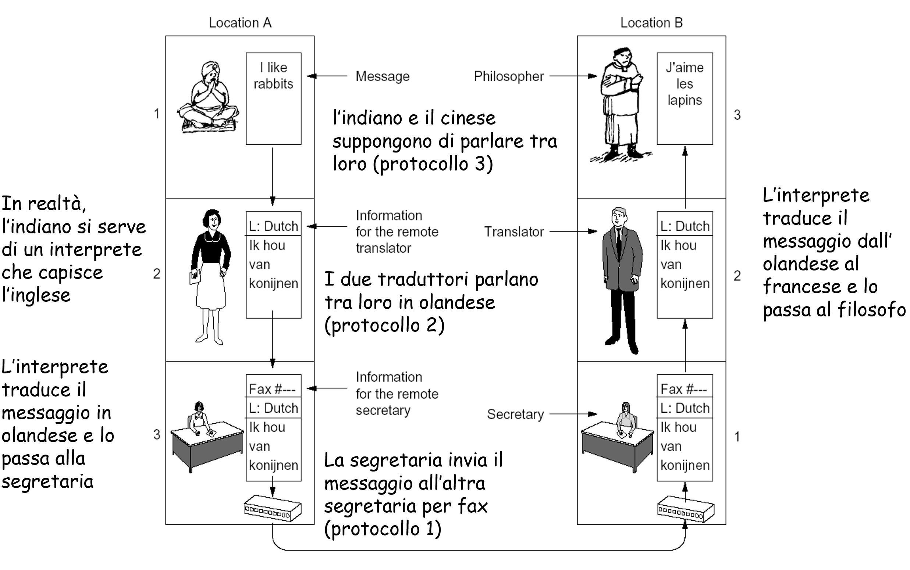

>[Torna a ISO/OSI](isoosi.md)

# **Architettura a strati**

Nell'informatica, esiste la necessità di una organizzazione adeguata delle funzioni per potere **gestire la complessità**. La soluzione trovata sta nel distribuire funzioni complessesecondo una architettura che segua una **organizzazione a strati** (o livelli). Un **vincolo dell'architettura** è che uno strato può dialogare solamente con quelli adiacenti, sopra o sotto di lui.

I principi sottostanti a questo tipo di architettura sono essenzialmente:
- **divide et impera**, cioè promuovere la scomposizione di un problema esageratamente complesso in una serie di problemi più semplici ed affrontabili
- **astrazione**, vuol dire che, man mano che **si sale**, ogni **livello** ha una visione del problema iniziale via via più **semplice e generale** che si occupa sempre meno dei **dettagli fisici** e, viceversa, sempre di più di problematiche concettuali. La **soluzione astratta** di un problema ha il decisivo **vantaggio** di poter essere utilizzata senza modifiche anche all'interno di **contesti differenti**, lì dove i **dettagli** per la sua applicazione vengono declinati in **maniera differente**. 

In genere, grossomodo accade che la soluzione astratta viene **adattata**, mentre quella di dettaglio viene **sostituita**.

## **Funzioni di uno strato**

Le reti di calcolatori sono organizzate secondo un modello a strati (livelli), con ogni strato costruito su quello inferiore, che ripartisce il numero e la complessità delle funzioni di rete su più livelli.
Ciascun livello è:
- fornitore del servizio al livello superiore N+1 
- utente del servizio offerto dal livello N-1
  
Ciascun livello fornisce delle primitive di servizio (funzioni di rete) dove una primitiva è una macrofunzione che realizza una semplificazione delle funzioni degli strati sottostanti (astrazione funzionale) che nasconde dettagli hardware e/o software della loro realizzazione (concetto di trasparenza o black-box)

I **servizi** di uno strato sono realizzati usando: 
- le proprie funzioni 
- i servizi del livello inferiore N-1 

Ciascun livello utilizza i **servizi** che sono offerti dal livello inferiore per generare servizi più complessi e potenti di livello superiore (servizi a **valore aggiunto**)

## **Metafora dei due filosofi**

La metafora dei "due filosofi" di Andrew S. Tanenbaum è una celebre illustrazione utilizzata per spiegare il concetto di comunicazione nella rete di calcolatori. Tanenbaum è noto per le sue opere sui sistemi operativi e le reti di calcolatori, e questa metafora è un modo efficace per semplificare e chiarire le dinamiche della comunicazione tra due nodi di una rete.

Immagina due filosofi che vogliono comunicare tra loro ma parlano lingue diverse. Uno parla francese e l'altro parla inglese. Per poter comunicare efficacemente, devono passare attraverso vari livelli di traduzione:
### Metafora dei Due Filosofi: Comunicazione con Traduzione

Immagina due filosofi che vogliono comunicare tra loro ma parlano lingue diverse. Uno parla francese e l'altro parla inglese. Per poter comunicare efficacemente, devono passare attraverso vari livelli di traduzione:

1. **Applicazione (Lingua originale)**:
   - Il primo filosofo scrive un messaggio in francese.
   - Il secondo filosofo scrive un messaggio in inglese.

2. **Presentazione (Traduzione)**:
   - Il primo filosofo ha bisogno di un traduttore che converta il messaggio dal francese all'olandese.
   - Il secondo filosofo ha bisogno di un traduttore che converta il messaggio dall'inglese all'olandese.

3. **Sessione (Formato di comunicazione)**:
   - I traduttori devono assicurarsi che il messaggio sia formattato correttamente e che la sessione di comunicazione sia stabilita.

4. **Fisico (Trasmissione effettiva)**:
   - I messaggi vengono trasmessi fisicamente attraverso il mezzo di comunicazione mediante un fax.

## **Metafora entità OSI come ruoli aziendali**

Ogni **canale logico** serve a collegare tra loro le **due entità**, moduli SW con un certo **ruolo** (analoghe a coppie di impiegati tra i tanti di una grande azienda), che sono deputate a risolvere solamente **certi problemi**, tutti e soli quelli che rientrano all'interno delle **mansioni** che competono a quelle entità. 

Esempio di analogie delle mansioni (fonte chatGPT. Provare a chiedere una analogia con le mansioni del personale scolastico):

| Livello | Nome                  | Mansione      | Funzioni svolte                      |
|---------|-----------------------|-------------------------------------------------------------------------------------------------------------------------|-----------------------------|
| 7       | Applicazione          | Gli impiegati del servizio clienti e delle vendite che interagiscono direttamente con i clienti, utilizzando le applicazioni per fornire supporto, rispondere a domande e vendere prodotti o servizi| Fornisce servizi di rete direttamente agli utenti finali, come la posta elettronica, il trasferimento di file e le applicazioni web |
| 6       | Presentazione         | I designer grafici e i responsabili del branding che formattano e presentano le informazioni in modo chiaro e accattivante, garantendo che i dati siano utilizzabili e comprensibili per gli utenti finali | Traduce i dati in un formato comprensibile per il livello applicativo, gestendo la cifratura e la compressione| 
| 5       | Sessione              | I project manager o coordinatori che organizzano e monitorano le sessioni di lavoro tra diversi dipartimenti o team, assicurandosi che le interazioni e le collaborazioni procedano senza intoppi | Gestisce e controlla le connessioni tra i processi, mantenendo e sincronizzando la comunicazione |          
| 4       | Trasporto             | I supervisori della qualità che assicurano che i prodotti o servizi forniti siano conformi agli standard e che eventuali problemi vengano identificati e risolti | Garantisce la trasmissione affidabile dei dati e il controllo degli errori tra due processi|                                                  
| 3       | Rete                  |Gli impiegati responsabili della logistica e della pianificazione dei percorsi di consegna, che decidono il modo migliore per far arrivare i prodotti o le informazioni da un punto A a un punto B |     Determina il percorso che i dati devono seguire per raggiungere la loro destinazione|                            
| 2       | Collegamento dati     | Gli amministratori di rete e gli specialisti di supporto IT che gestiscono le connessioni locali (LAN), risolvono i problemi di connessione e assicurano che i dati vengano trasmessi correttamente tra dispositivi all'interno dell'azienda | Fornisce il trasferimento dei dati tra due nodi su una rete e corregge gli errori che possono verificarsi a livello fisico.|
| 1       | Fisico   | Gli impiegati che si occupano della manutenzione fisica dell'infrastruttura aziendale, come elettricisti e tecnici delle telecomunicazioni, che garantiscono che i cavi, i router, i server e altre apparecchiature funzionino correttamente  | Trasmette i dati in forma di segnali elettrici, ottici o radio.  |

### **Trasparenza dei livelli**

La **trasparenza** dei livelli nel modello OSI (Open Systems Interconnection) si riferisce al principio secondo cui ciascun livello del modello fornisce servizi al livello immediatamente superiore **senza** che quest'ultimo debba conoscere i **dettagli specifici** dell'**implementazione** del livello inferiore.

La **trasparenza** dei livelli aggiunge proprietà di **flessibilità** all'architettura perchè, grazie a questa, è possibile **modificare** o **sostituire** uno o più livelli inferiori senza la necessità di modificare tutti quelli superiori, promuovendo così il **riuso** dei livelli più astratti. Ciò è sempre possibile a patto che l'**interfaccia** tra di essi rimanga **invariata**. Le interfacce standardizzano i servizi forniti da un livello all'altro e permettono:
- **Modularità**: ogni livello può essere sviluppato e aggiornato indipendentemente, facilitando la manutenzione e l'innovazione tecnologica.
- **Interoperabilità**: la trasparenza dei livelli permette a dispositivi e protocolli diversi di lavorare insieme, a patto che rispettino le interfacce standardizzate.
- **Semplicità di progettazione**: gli sviluppatori possono concentrarsi sulle funzionalità specifiche di un livello senza dover comprendere l'intera stack di protocolli.
- **Risoluzione dei problemi**: la suddivisione delle funzionalità in livelli separati rende più facile l'identificazione e la risoluzione dei problemi, poiché i problemi possono essere isolati a un livello specifico.
- **Economicità**: è possibile abbattere i costi di vendita dei dispositivi grazie alla **economia di scala** derivante dalla **dimensione mondiale** del **mercato** di riferimento.

### **Modello ISO-OSI: principi guida**

Principi guida adoperati  per lo sviluppo dei vari livelli (1983)
- Tramite l’organizzazione a livelli si definisce un grado di astrazione (semplificazione) via via crescente delle funzioni di rete.
- I livelli devono corrispondere a funzioni ben definite.
- Le funzioni devono essere aderenti a degli standard internazionali.
- I confini tra i livelli devono minimizzare il flusso delle informazioni tra un livello e l’altro (principio di massima coesione interna e di minimo accoppiamento tra i livelli). 
- Il numero di livelli deve essere ottimale (non troppi né troppo pochi).

Sitografia:
- https://csc-knu.github.io/sys-prog/books/Andrew%20S.%20Tanenbaum%20-%20Computer%20Networks.pdf

>[Torna a ISO/OSI](isoosi.md)
