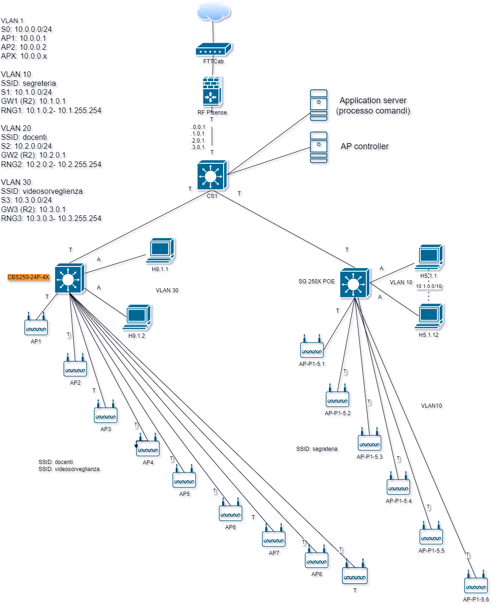
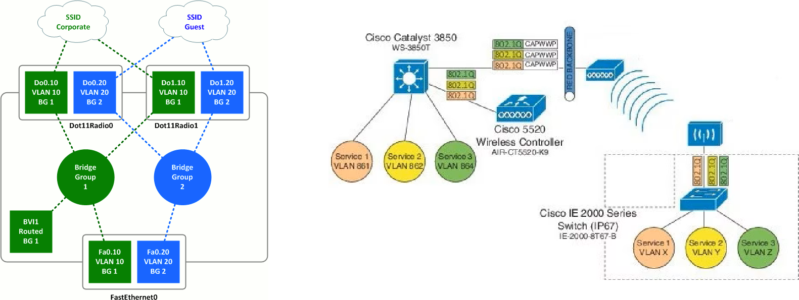

>[Torna a reti di sensori](sensornetworkshort.md#classificazione-delle-tecnologie-wsn-in-base-a-velocità-e-copertura)

- [Dettaglio architettura Ethernet](archeth.md)
- [Dettaglio architettura Zigbee](archzigbee.md)
- [Dettaglio architettura BLE](archble.md)
- [Dettaglio architettura WiFi infrastruttura](archwifi.md)
- [Dettaglio architettura WiFi mesh](archmesh.md) 
- [Dettaglio architettura LoraWAN](lorawanclasses.md) 

## **Caso d'uso WiFi infrastruttura** 

Date le particolarità della tecnologia, i casi d'uso per la rete di sensori WiFi di **tipo infrastruttura** sono quelli tipici applicazioni **IoT indoor** a **medio raggio**, dove concorre con altre tecnologie di rete: Zigbee, BLE e, sotto certe condizioni, LoRaWAN. **Caratteristiche** della rete WiFi di **tipo infrastruttura** sono essenzialmente:
- possibilità di realizzare **comandi** a distanza wireless anche relativamente piccoli con una **durata** delle batterie relativamente lunga (dell'ordine dei mesi).
- possibilità di realizzare **sensori** ambientali molto piccoli e alimentati con batterie che possono essere sostituite dopo mesi.
- **assenza di gateway** verso la rete LAN, essendo essi stessi collegati a questa.
- architettura ad **hop singolo** del collegamento verso la stazione radio base costituita, in questo caso, da un **AP WiFi** che deve essere in posizione **baricentrica** rispetto ai dispositivi ad esso collegati. Il **consumo** dei dispositivi è tanto minore quanto e breve la distanza degli AP.
- **rete di sensori** composta **dagli AP** della stessa rete wireless LAN utilizzata per i **dati**. Gli unici dispositivi capaci di inoltro dei dati sono gli stessi della LAN (switch, router, bridge wifi).
- utilizzo di una rete **non ottimizzata** per la sensoristica ma pensata più per le prestazioni in bit rate elevate che per i bassi consumi. Consumi limitati si ottengono attivando funzioni di **deep sleep** di processore e radio tra un turno di misura dei sensori e il successivo.
- rete di sensori che ha la stessa **affidabilità** della rete wifi.


## **Aspetti critici**

Elementi **critici** su cui **bilanciare convenienze** e saper fare delle **scelte argomentate** sono:
- schema fisico (**planimetria**) dell'infrastruttura con etichettatura univoca di tutti gli asset tecnologici di rete.
- tipologia di **divisione in gruppi** degli utenti.
- definizione delle **tecnologie dei dispositivi** chiave quali sensori/attuatori ([dispositivi terminali](sensornetworkshort.md#dispositivi-terminali-sensoriattuatori)), gateway, link (dual radio, three radio), accesso radio (allocazione di servizi sincroni TDM, asincroni CSMA/CA o a basso ritardo slotted CSMA/CA) e loro dimensionamento di  massima (quantità, numero di porte, banda, ecc.).
- eventuali vincoli normativi sulle tecnologie in uso come potenza, EIRP, ERP e duty cycle.
- schema logico (albero degli **apparati attivi**) di tutti i dispositivi di rete con il loro ruolo e i **link virtuali** astratti ai vari livelli della **pila ISO/OSI** (tipicamente L2, L3, L7)
- dislocazione di eventuali **gateway**.
- **subnetting** e definizione degli indirizzi dei vari gruppi di utenti, delle server farm, definizione degli indirizzi dei server.
- definizione del **tipo di routing** (statico o dinamico). In caso si scelga il **routing statico**, definizione delle **tabelle di routing** più significative.
- definizione della posizione del broker MQTT.
- definizione dei topic utili per i casi d'uso richiesti.
- definizione dei **messaggi JSON** per alcuni **dispositivi IoT** ritenuti significativi in merito a **comandi**, **stato** o **configurazione**.
- definizione (anche in pseudocodice) delle **funzioni del firmware** di bordo dei **dispositivi IoT**.


## **Architettura di una rete di reti** 

Di seguito è riportata l'architettura generale di una **rete di reti** di sensori. Essa è composta, a **livello fisico**, essenzialmente di una **rete di accesso** ai sensori e da una **rete di distribuzione** che fa da collante di ciascuna rete di sensori.


### **Rete di distribuzione** 

La **rete di distribuzione**, in questo caso, **coincide** con una **rete di reti IP**, in definitiva direttamente con **Internet** se le reti wifi sono **federate** e **remote**, cioè in luoghi sparsi in Internet. 

In questo caso non è necessario avere dei gateway con funzione di traduzione dalla rete di ditribuzione IP a quella dei sensori, dato che questa è anch'essa una rete IP.

##  **Canali di comunicazione principali in una rete di sensori**

**In sintesi**, sono necessari almeno **due canali** di comunicazione che, insieme, complessivamente, realizzano la **comunicazione tra sensori e gestore** delle informazioni:
- **tra sensori e gateway** verso la LAN realizzato dalle **sottoreti dei sensori**:
    - **A filo** con accesso:,
        - **singolo dedicato**: un filo o un canale per sensore in tecnologia SDM o TDM (multiplexer, UART, porta analogica, porta digitale)
        - **multiplo condiviso** cioè tramite mezzo broadcast (BUS) con **arbitraggio** di tipo **master slave** (Modubus, Dallas, I2C, SPI) o **peer to peer** (CanBUS, KNX, ecc) o misto (ProfiBUS). 
        - Spesso **bidirezionale** specie se in presenza di attuatori
        
    - **Senza filo** cioè wireless con accesso:
        - **singolo dedicato**: link punto-punto analogico digitalizzato con AX25 oppure digitale con un radio modem (Yarm ACME Systems, 6LoWPAN, LoRa) resi full duplex con l'uso di multiplazioni FDM o TDM.
        - **Multiplo e condiviso** (BUS) di tipo half duplex reso bidirezionale (full duplex) tramite tecniche asincrone CSMA/CA (Zigbee, wifi, LoRa) o sincrone TDMA (Zigbee, Bluetooth).
- **Tra gateway e gestore** delle informazioni realizzato dalla **rete di distribuzione**:
     - Tipicamente tramite **LAN ethernet** e architettura **Client/Server**
     - Interazioni di tipo PUSH o PULL
     - Paradigma Request/Response (HTTPS, COAP), Publish/Subscriber (MQTT) oppure canale persistente bidirezionale (BSD socket o WebSocket)
       
## **Broker MQTT** 

Il **broker MQTT** è solo una delle tante soluzioni possibili per:
- inoltro dei comandi da un **sensore di comando** su una rete di tipo A (ad es. LoRaWAN) ad un attuatore su una rete diversa di tipo B (ad es. Zigbee)
- inoltro di una **misura** da un **sensore ambientale** su una rete di tipo A (ad es. LoRaWAN) ad un **pannello di controllo** su una rete diversa di tipo B (tipicamente IP)
- inoltro di una **misura** da un **sensore ambientale** su una rete di tipo A (ad es. LoRaWAN) ad un **server di gestione** su una rete diversa di tipo B (tipicamente IP)

In **generale**, su reti **non IP**, i **client MQTT** (con il ruolo di **publisher** o di **subscriber**) sono sempre i **gateway di confine** della **rete di sensori**. Le uniche reti di sensori che non hanno bisogno di un gateway di confine che sia, nel contempo anche client MQTT, sono le reti IP. Esistono ancora i gateway nelle **reti IP** ma con **scopi diversi** da quello di **realizzare** un **client MQTT**. Nelle **reti IP**, il **client MQTT** è, normalmente, direttamente **a bordo** del **dispositivo** sensore dotato di indirizzo IP (**MCU**).

Il **vantaggio** del **broker MQTT** è quello di poter gestire in modo semplice e **standardizzato** lo **smistamento** (inoltro) delle **misure** e dei **comandi** tra i vari portatori di interesse (stakeholder) di un **cluster** di reti di sensori, siano essi utenti umani, interfacce grafiche, server applicativi diversi o altri dispositivi IoT.

Il **canale applicativo** su cui vengono inviati i messaggi sono quindi i **topic**. Su un certo **topic** il dispositivo con il ruolo di **output** agisce come un **publisher**, mentre quello con il ruolo di **input** agisce come un **subscriber**.

l'**ID MQTT** è un identificativo che permette di individuare un dispositivo ma non è un indirizzo di livello 3, non individua la macchina host in base al suo IP, piuttosto è un indirizzo di livello applicativo noto solo ad un server centrale, cioè il broker. Un dispositivo IoT non è tenuto a conoscere l'IP di tutti gli altri dispositivi ma solamente quello del broker. Il broker soltanto sa gli indirizzi di tutti i dispositivi, conoscenza che acquisisce durante la fase di **connessione** di un client al broker, momento in cui avviene anche il recupero del'**socket remoto** del client.

Il **broker**, dal canto suo, **associa** ogni **topic** con tutti gli **ID** che sono registrati presso di esso come **subscriber**. Questa associazione è utilizzata per smistare tutti i messaggi che arrivano con un certo topic verso tutti gli ID che ad esso sono associati. Il topic diventa così un **indirizzo di gruppo**. La particolarità di questo indirizzo è che è **gerarchico** secondo una struttura ad **albero**, cioè gruppi di dispositivi possono essere suddivisi in **sottogruppi** più piccoli estendendo il nome del path con un **ulteriore prefisso**, diverso per ciascun sottogruppo. L'operazione può essere ripetuta ulteriormente in maniera **ricorsiva**.

**Ad esempio**, posso individuare le lampade della casa con il path ```luci``` e accenderle e spegnerle tutte insieme, ma posso sezionarle ulteriormente con il path ```luci/soggiorno``` con il quale accendere o spegnere solo quelle del soggiorno oppure con il path ```luci/soggiorno/piantane``` con il quale fare la stessa cosa ma solo con le piantane del soggiorno.

### **Alternative ad MQTT**

Esistono molte altre soluzioni che magari sono più semplici e graficamente accattivanti ma che passano per portali proprietari o per servizi cloud a pagamento e nulla aggiungono di didatticamente rilevante ai nostri discorsi. Normalmente sono basate su webservices realizzati con protocolli Request/Response quali **HTTPS** e **COAP**.

## **Server di gestione** 

E' un **client** del **broker MQTT** con funzioni sia di **publisher** che di **subscriber** per:
-  elaborazioni a **breve termine** quali la generazione di **statistiche** per la determinazione di **soglie** o **predizioni** per:
    - realizzazione da remoto della **logica di comando** (processo dei comandi) degli **attuatori**
    - **report** per l'assistenza alle decisioni
    - generazioni di **allarmi**
    - realizzazione di **ottimizzazioni** della gestione o del consumo di risorse, energia o materie prime
    - contabilizzazione dei consumi (**smart metering**)
    - controllo e sorveglianza in tempo reale dello **stato** di impianti o macchinari
    - segnalazione dei **guasti** o loro **analisi predittiva** prima che accadano
    - **consapevolezza situazionale** di ambienti remoti, difficili, pericolosi o ostili (https://it.wikipedia.org/wiki/Situational_awareness)
-  elaborazioni a **lungo termine** quali:
    - analisi dei dati per la realizzazione di studi scientifici
    - elaborazione di nuovi modelli statistici o fisici o biologici dell'ambiente misurato

## **Rete di reti wifi** 

L'albero degli **apparati attivi** di una rete di sensori + rete di distribuzione + server di gestione e controllo potrebbe apparire:


Il **broker MQTT** può essere installato in cloud, in una Virtual Private network, oppure On Premise direttamente nel centro di gestione e controllo. 

## **Rete in modo infrastruttura** 

Una architettura di rete wireless WiFi è può essere realizzata in tre modalità:
- **Modalità Infrastruttura** di tipo master/slave
- **Modalità ad hoc** di tipo peer to peer 
- **Modalità Wifi Direct**  di tipo Punto – punto

Le architetture **più diffuse** in ambito aziendale ed **indoor** sono di **tipo infrastruttura** e sono composte di un dispositivo master centrale detto **Access Point (AP)** posto in posizione **baricentrica** rispetto a più dispositivi slave della rete wireless detti **Client**. 

Gli **elementi** di una rete in modo infrastruttura sono:
- gli **AP (Access Point)**, sono dei dispositivi di **aggregazione** dei client della rete LAN (PC, dispositivi IoT, smartphone, tablet, ecc.) che, attraverso gli AP, ottengono un accesso alla rete LAN aziendale. In modo infrastruttura, gli AP sono in realtà assimilabili a 2 dispositivi distinti:
    - un **HUB wireless** che realizza un **mezzo broadcast** (multipunto) dove i client accedono mediante il protocllo **CSMA/CA** e sue ottimizzazioni per il WiFi (vedi [CSMA/CA](protocollidiaccesso.md#csmaca) per dettagli)
    - un **bridge** tra l'hub wireless e una LAN cablata. Un **bridge** è uno dispositivo di **commutazione** simile ad uno **switch** ma realizzato in **SW**, che **inoltra**, a livello L2, trame MAC dall'HUB alla LAN cablata e viceversa. Questi bridge, per ogni AP, possono essere più di uno e, in questo caso, sono tanti quante le **interfacce logiche** dell'AP e mappano ogni intefaccia su una **VLAN diversa**.
- un **controller** degli AP. E' un **server** che si occupa della creazione e gestione dei bridge nei vari AP, della impostazione centralizzata di interfacce logiche e parametri radio, della assegnazione centralizzata degli indirizzi IP, dell'assegnazione automatica dei canali in modo da minimizzare le interferenze reciproche tra gli AP, dell'aggiornamento centralizzato dei FW dei vari AP, della gestione dei protocolli di autenticazione, delle funzioni di logging, delle funzioni di firewall, della creazione di hotspot, ecc..


## **Access point**

Il dispositivo AP è assimilabile ad un **Hub** che realizza un BUS broadcast che collega tutti i device client. Il mezzo radio è di tipo broadcast half duplex in cui uno parla e tutti ascoltano. Per realizzare un canale percepito dalle stazioni client come full duplex l’accesso di queste necessita di essere arbitrato. L'**arbitraggio** può essere di tipo:
- **Peer to peer**: è la soluzione più comune, l’accesso al mezzo degli interlocutori è gestita in maniera autonoma da ciascuno di essi tramite un  meccanismo di ack realizzato dal protocollo 802.11 di tipo CSMA/CA.
- **Master/Slave**: è la soluzione realizzata sotto l’arbitraggio centralizzato del dispositivo AP, che assume il ruolo di **master**. L’AP assegna un tempo prestabilito a ciascuna comunicazione per parlare e lo comunica periodicamente a tutte le stazioni tramite opportune trame di segnalazione (**beacon**). E' la modalità CFP (Contention Free Period) cioè, **senza collisioni**.

Per dettagli sulle tecniche di accesso al BUS in generale e per quelle utizzate dal WiFi in particolare vedi [Dettaglio mezzi a BUS](protocollidiaccesso.md)

La **disposizione** fisica degli AP dovrebbe essere il più possibile **uniforme** all'interno dell'area di copertura del servizio di connessione wireless e in **posizione baricentrica** rispetto ai potenziali utilizatori, almeno per quanto è reso possibile da **vincoli** insormontabili di altra natura. 

Per quanto riguarda il loro **collegamento** ai **dispositivi attivi** della rete **LAN cablata**, si potrebbero individuare alcune **possibilità**:
- il collegamento sulle porte di uno **switch di accesso** (AS) condiviso con i dispositivi fissi, che oltre ad aggregare le prese aggreghi gli AP. Soluzione per pochi AP con traffico limitato.
- il collegamento sulle porte di uno **switch di distribuzione** (DS) condiviso con le dorsali di piano che, oltre a diramare dorsali ad alta densità di traffico verso gli AS, dedicano anche dorsali ad alta capacità verso ogni singolo AP. Soluzione dimensionalmente adeguata tenedo conto del thoughput superiore al Gbit/sec  degli AP più recenti che permettono sia collegamenti ad **alte prestazioni** (200-300 Mbps/sec) che l'aggregazione di un **elevato numero** di client (superiore a 100). Soluzione desiderabile per grandi ambienti che basano i loro servizi su Internet quali alberghi, scuole, campus universitari, ecc.
- l'utilizzo, per entrambe le soluzioni precedenti, di **SW dedicati** solo per gli AP, soluzione che permette di dedicare una **dorsale dedicata**  (di piano o di campus) a ciascun **gruppo di AP**. Soluzione auspicabile per **servizi avanzati** ad alta **densità** di utenze (come luoghi pubblici) e alta **intensità** di traffico (come servizi multimediali avanzati).

### **Esempio**

Nel contesto di un istituto scolastico che si vuole servire con una rete WiFi, si vogliono separare i **servizi di segreteria** scolastica con i suoi **server** e i suoi **impiegati** localizzati in una subnet fisicamente dislocata in una **certa area**, dai **servizi di mobilità**, dispersi a **macchia di leopardo** in tutto il comprensorio, ai docenti dotati di supporti di loro proprietà (politica Byod) con i quali eseguono le loro attività giornaliere sul registro scolastico. Si vuole consentire anche una gestione separata al traffico dei **servizi di videosorveglianza** con propri **server**, a disposizione all'interno di una subnet separata. 



La **separazione** dei gruppi di utenti **solamente** in base alla **dislocazione fisica** sarebbe evidentemente impossibile, mentre sarebbe **effettiva** la separazione mediante **VLAN** dislocate su una infrastruttura **switched**.

### **Definizione dei gruppi mediante VLAN**

La **definizione** dei gruppi si può fare con una dislocazione a **macchia di leopardo** delle **interfacce** di accesso alla diverse VLAN, aventi **ssid statici** diversi o uno unico ma **dinamico** (autenticazione 802.1X). Gli **host** possono collegarsi all'**ssid** di una certa VLAN su **ogni AP**. La loro **separazione** avviene **dopo**, su un **router** di confine collegato al core switch con un link capace di creare il **trunking** dei flussi (**intervlan routing** in modo **router on a stick**). Le **dorsali** tra i vari bridge devono essere configurate come dorsali di **trunk** (802.1Q) in modo tale che portino il traffico aggregato di **tutte le VLAN**.

Si sarebbe potuto isolare in maniera ancora **più affidabile** la rete della segreteria servendola con uno SW dedicato collegato direttamente ad una porta del router, realizzando così una separazione fisica piuttosto che una logica, sfruttando il fatto che la dislocazione fisica dei suoi utenti è confinata in un'area esclusiva. Però, poichè il controller degli AP deve risiedere nella stessa subnet degli AP da controllare, sarebbe poi nata l'esigenza di doverne installare due, uno per la segreteria ed uno per la scuola. 

L'**inconveniente** viene superato adoperando le **VLAN** e la sicurezza viene mantenuta ugualmente alta (**like wire** in pratica) grazie ai **comandi**: ```allowed vlan 1, 20, 30``` e ```allowed vlan 1, 10``` che **confinano** il traffico delle **trame MAC** relative alla LAN della **segreteria** sul solo SW dove sono collegati i suoi dispositivi. Tutte le altre dorsali non possono essere interessate da questo traffico, mentre sono tutte interessate dal traffico della **subnet amministrativa** degli AP che possono così essere gestiti da un **unico controller**.

### **Esempio di Configurazione**

Per configurare una rete con 3 router WiFi mesh, in cui ogni router ha una dorsale (backhaul) con canale di comunicazione dedicato e due router aggregano sensori su due subnet diverse, possiamo seguire questo schema:

I Router per aggregazione dei sensori sono R2 e R3. Per le subnet possiamo usare un blocco di indirizzi privati come 10.0.0.0/8 e dividerlo, con un subnetting **FLSM classful**, come segue:

#### **Subnetting**

Subnet per la dorsale degli AP (VLAN amministrativa no ssid):
- VLAN 1
- S0: 10.0.0.0/24
- AP1: 10.0.0.1
- AP2: 10.0.0.2
- APX: 10.0.0.x

Subnet per la segreteria.
- VLAN 10
- SSID: segreteria
- S1: 10.1.0.0/24 
- GW1 (R2): 10.1.0.1
- RNG1: 10.1.0.2- 10.1.255.254

Subnet per i docenti.
- VLAN 20
- SSID: docenti
- S2: 10.2.0.0/24 
- GW2 (R2): 10.2.0.1
- RNG2: 10.2.0.2- 10.2.255.254

Subnet per la videosorveglienza.
- VLAN 30
- SSID: videosorveglienza
- S3: 10.3.0.0/24 
- GW3 (R2): 10.3.0.1
- RNG3: 10.3.0.3- 10.3.255.254

#### **Routing statico**

R1 possiede 3 indirizzi su ciascuna subnet:
- S0 (VLAN 1): 10.0.0.1  SM0: 255.255.0.0
- S1 (VLAN 10): 10.1.0.1  SM1: 255.255.0.0
- S2 (VLAN 20): 10.2.0.1  SM2: 255.255.0.0
- S3 (VLAN 30): 10.3.0.1  SM3: 255.255.0.0
  
Non è necessario impostare le tabelle di routing in quanto le subnet S0, S1, S2, S3 sono, su R1, direttamente connesse.

## **Struttura cellulare**

Una rete wifi è organizzata nelle zone di influenza di ciascun AP dette **cella**. A causa dell'**attenuazione** del segnale radio dovuta alla distanza o agli ostacoli un client raggiunge un AP solo fino ai confini della sua cella.
Il collegamento in **mobilità** di un client da una cella ad un’altra adiacente si chiama **roaming** e determina un passaggio della presa in carico di un utente da una cella a quella di transito vicina che viene detto in gergo **handover**. Un handover avviene generalmente, in maniera trasparente all’utente e **senza la cessazione** di eventuali connessioni in corso. 


Una organizzazione ottima della rete fa in modo di minimizzare la cosidetta **interferenza cocanale**. L’interferenza cocanale è il disturbo creato alle comunicazioni di un AP dalle comunicazioni di un altro AP che condivide la stessa frequenza. L’interferenza cocanale è minimizzata quando:
- Dispositivi adiacenti hanno frequenze molto diverse
- Frequenze uguali sono condivise da dispositivi molto lontani

La divisione in celle è una forma di **SDM** (Space Division Multiplation), infatti celle di uno stesso colore possono trasmettere senza interferirsi nella stessa frequenza e nello stesso istante purchè siano in posizioni differenti. 
Per dettagli vedi [multiplazioni statiche](multiplazioni.md)

## **Allocazione dei canali alle celle**


### **Allocazione canali a 2.4 GHz**

A 2.4GHz il WiFi adopera 11 canali FDM con sovrapposizione parziale dei vari canali. Solo tre canali di volta in volta non si sovrappongono.
Una disposizione di celle adiacenti ottima dovrebbe utilizzare possibilmente solo tre canali non sovrapposti per minimizzare l’interferenza cocanale.


Le possibilità sono: 1-6-11, 2-7-12, 3-8-13, 4-9, 5-10 ma rimangono solo 1-6-11 , 5-10 perché le frequenze 12, 13 e 14 non sono autorizzate in Europa (alcuni device supportano il canale 12).
quindi si hanno **più frequenze** solo usando la combinazione **1-6-11**

### **Allocazione canali a 5 GHz**

In questa banda è disponibile uno spettro significativamente più ampio ed anche possibile impostare la larghezza del canale. Cciascun canale occupa la propria sezione a 20 MHz senza sovrapposizioni con altri canali. 


802.11n fornisce la possibilità di utilizzare i canali a 40 MHz, 802.11ac consente canali larghi 80MHz e persino 160MHz. Maggiore ampiezza del canale consente, in teoria, bitrate notevolmente maggiori.
Questi canali più ampi vengono creati collegando insieme i canali a 20 MHz. Raddoppiare l’ampiezza dei canali ha però l’inconveniente di raddoppiare la quantità di rumore e di ridurre le combinazioni di canali che non si sovrappongono, entrambe le circostanze possono di fatto ridurre la bitrate.


### **Pattern di riuso a confronto**


## **Beacon**

I beacon sono delle **sequenze di sincronizzazione** (dette preambolo) in grado sia di sincronizzare gli **orologi** dei dispositivi (Tx e Rx) che si accingono ad iniziare una comunicazione, ma anche di **indentificare** in maniera univoca i dispositivi che li emettono. Per dei dettagli vedi [preambolo di sincronizzazione](protocolli.md#preambolo-di-sincronizzazione).

La trama dati compresa tra **due beacon** consecutivi viene detta **supertrama** (superframe) ed è generalmente divisa in due zone con **politiche di accesso** al canale diverse:  
- una **deterministica** al riparo dalle collisioni detta **CFP** (Contention Free Period) e regolata dalla multiplazione statica TDMA, che viene usata per trasmettere i dati delle comunicazioni **unicast**.
- una **probabilistica** a contesa, in cui i tentativi di accesso dei dispositivi sono soggetti al **rischio di collisione** perchè regolata da un protocollo di tipo **CSMA/CA**, che invece serve per trasmettere delle particolari informazioni **broadcast** dette **advertisement**.

Nel contesto di WiFi, un **Access Point (AP)** può assumere un ruolo di **coordinamento**, detto PCF, gestendo l'accesso al canale in modo master/slave in cui il centrale ha il ruolo di **master** che stabilisce **quale** stazione deve parlare, **quando** e **per quanto** tempo usando una politica di **turnazione** delle stazioni (**polling**).
  
Nel caso del WiFi, il **NAV CFP** (Contention Free Period) è un meccanismo che inibisce tutte le stazioni dal prendere l'**iniziativa di cominciare** una trasmissione. Finchè è valido le stazioni comunicheranno in modalità **master/slave**, cioè **risponderanno** solo **se interrogate**.


Fig 20

**Durante il CFP**, il PC invia messaggi di Polling a rotazione verso le stazioni, interrogandole a riguardo della **disponibilità** di dati da trasmettere. Questà modalità offre il vantaggio di adattarsi meglio alle **sorgenti** dati di tipo **real time** caratterizzate da trasmissioni di tipo **sincrono**. Sorgenti sincrone tipicamente sono: **sensori**, telefonia **VOIP**, **videoconferenza**, **streaming**, ecc.


Fig 21

**Riassumendo**, Normalmente i dispositivi AP lavorano in **modalità ibrida** DCF e PCF. Vengono trasmessi periodicamente dei beacon e l'intervallo temporale tra un beacon e l'altro viene suddiviso in **due zone**, una soggetta a trasmissioni di tipo **PCF** e quindi **intrinsecamente** al riparo dalle collisioni adatta a trasmissioni **sincrone** e un'altra di tipo **DCF**, soggetta a collisioni sugli RTS, dedicata alle trasmissioni **asincrone**.


## **Banda ISM**

Le **bande libere** sono le frequenze di **uso libero**, non tutelate, che non richiedono **concessioni** per il loro impiego. Sono spesso indicate come **ISM** (Industrial, Scientific and Medical)[Nota 1].

In realtà ISM è un sottogruppo di tutte le frequenze disponibili. La situazione è analoga a quella delle spiaggie. In tutto il territorio nazionale molti litorali sono stati dati in concessione a privati che possono consentirne l'accesso a chi vogliono purchè paghi. Solo alcune sono **libere**, cioè aperte a tutti senza pagare ma, in questo caso, è necessario tutelare il bene **pubblico condiviso** affinchè nessuno ne **monopolizzi l'uso** appropriandosene la maggiorparte per la maggiorparte del tempo.

L’uso di tali bande è regolamentato in modo da consentirne l’**impiego condiviso** ed evitare che un utente o un servizio possa **monopolizzare** la risorsa.

In tabella un elenco parziale con le principali **limitazioni** che riguardano principalmente **potenza**, **duty cycle**, **EIRP**, **ERP** e il **tipo di accesso** (ALOHA, LBT o AFA). Vedi [Banda ISM 800 MHz](ism.md) per dettagli.


Per le reti Wi-Fi che operano nella banda 2.4 GHz, i **limiti di EIRP** possono variare a seconda del canale utilizzato e sono generalmente compresi tra 20 dBm (100 mW) e 24 dBm (250 mW). Per la banda 5 GHz, i limiti possono essere più elevati e variano in base al canale e alla larghezza di banda utilizzati.

Ogni **access point** utilizza un **singolo canale** (largo 22 MHz), che viene condiviso in TDMA-TDD (**CSMA/CA**) da tutti gli utenti.

La trasmissione avviene a **pacchetti** con **conferma** di ricezione.

##  **Impatto ambientale**

La **potenza media** delle emissioni ambientali dipende dalle condizioni di servizio ed è influenzata dal duty cycle, a sua volta determinato da vari **fattori**:
- La bidirezionalità della trasmissione (attesa dell’OK di ricezione)
- La necessità di servire più terminali mobili (diminuisce il duty cycle di ogni singolo terminale mobile)
- Il duty cycle aumenta col volume di dati da trasferire, ma raramente ci si avvicina al 100%
- Il duty cycle dipende dalla velocità della connessione (connessioni più veloci richiedono tempi di trasmissione inferiori)
- Il duty cycle dipende anche dalla qualità del collegamento, a causa delle ritrasmissioni
- La presenza di più access point sullo stesso canale determina collisioni che fanno diminuire il duty cycle di un singolo access point
- La capacità di traffico della rete collegata influenza il duty cycle
- Il duty cycle minimo dell’access point è fissato dai segnali di servizio (beacon signals) ed è dell’ordine di 0.01%

Considerata la **bassa potenza** di uscita di **picco**, il bassissimo **guadagno d’antenna** e la riduzione operata dal **duty cycle**, gli access point delle reti Wi-Fi generano livelli di **densità di potenza** sempre molti ordini di grandezza sotto i **limiti normativi** ed anche significativamente inferiori alle **stazioni radio base** della telefonia cellulare.

##  **Gestione equa della banda**

I **parametri** e le **limitazioni** che vedremo sono dei criteri di accesso al mezzo radio volti a ridurre **disturbi mutui** fra i vari servizi dei vari utenti e la **monopolizzazione** di un canale da parte di un singolo utente.
- **Potenza disponibile massima**. La potenza in Watt. In genere dell’ordine dei millesimi di watt (mW) è spesso espressa in dBm.
In taluni casi, in relazione alla larghezza di banda, si fa riferimento alla densità di potenza, ovvero alla potenza, in milliwatt per MHz o per KHz. E’ il caso degli apparati WLAN E HiperLAN.
- **EIRP** e **ERP**. La potenza è generalmente riferita al **segnale irradiato** sotto forma di misura ERP o di misura EIRP. L’antenna è un componente passivo, ma possiede pur sempre una sorta di guadagno. Il guadagno quantifica la capacità dell’antenna di concentrare l’energia irradiata (o ricevuta) in una determinata direzione.
     - Un'antenna si dice **isotropa** quando emette la stessa potenza in tutte le direzioni in quanto non possiede direzioni di emissione privilegiate in cui emette più energia rispetto ad altre. Ciò equivale a dire che, in una sfera avente per centro l'antenna, la densità di potenza è la stessa in ogni punto sulla sua superficie. Ma si tratta solo di una approssimazione ideale. Le antenne reali, a parità di distanza, distribuiscono la loro energia in maniera non uniforme al variare della direzione di un punto nello spazio.
       
       
       
     - Le antenne cosidette **direttive** sono progettate proprio per introdurre di proposito un guadagno ulteriore sulla potenza fornita dal trasmettitore detto **guadagno di antenna** che è dovuto proprio alla capacità di concentrare la potenza irradiata in una **direzione privilegiata**. In realtà questa direzione è solo quella dove si concentra la **densità massima** di energia che rimane comunque ancora significativa (almeno la metà) in un cono nello spazio avente una apertura caratteristica detto **apertura a 3dB**. Infatti, 3dB è proprio la differenza di intensità del fascio tra la direzione privilegiata di massima emissione e i bordi del cono in cui la potenza misurata vale la metà di quella massima. Chiaramente, il guadagno elevato, raggiunto in un cono di apertura più o meno stretta, può avvenire solo al prezzo di una analoga perdita in tutte le altre direzioni. Si concentra in una direzione ciò che si perde in tutte le altre. La direzione di **minima intensità** (toricamente nulla) è sempre, paradossalmente, la base dove si alimenta l'antenna.
     - **Principio di reciprocità**. Collega il comportamento di un'antenna ricevente a quello che la stessa possiede quando è usata come trasmittente.  Stabilisce che le proprietà (ampiezza di banda, direttività, ecc.) di un'antenna ricevente sono le stesse che avrebbe la stessa antenna usata come trasmittente.
       
  
  
     - **Antenne direttive vs omnidirezionali**. Per ottenere il massimo guadagno di antenna complessivo di un **collegamento** è necessario **collimare** le antenne trasmittente e ricevente nella direzione di massimo guadagno. Si tenga conto che maggiore è la direttività delle antenne e più precisa e stabile nel tempo dovrà essere mantenuta questa collimazione (aspetto perlomeno critico praticamente), ciò va bene per collegamenti fissi **punto punto** come i **ponti radio**. Se invece, uno terminale è **mobile** o se il collegamento è **punto-multipunto** con un cluster di dispositivi sparpagliati in una certa area dello spazio, allora è più pratico utilizzare antenne con bassa direttività se non addirittura antenne ominidirezionali, cioè isotrope, almeno nel lato a uno del collegamento (gateway). Vedremo dopo che, nella banda ISM, per limitare le interferenze ad altri dispositivi posti in prossimità dell'antenna, si lasciano pressochè omnidirezionali anche le antenne del lato a molti (dispositivi terminali).
      
       
       
     - La potenza **EIRP** di una antenna direttiva è invece la potenza con cui dovrebbe essere alimentata un'antenna isotropica per irradiare la stessa potenza che viene emessa dall'antenna direttiva nella sua direzione di massimo irraggiamento.  La potenza **EIRP** è la somma della **potenza erogata** dal trasmettittore più il **guadagno di antenna** (al netto delle perdite sul cavo sempre presenti). 
     - Un'altra grandezza considerata nella pratica è la potenza **ERP**, analoga alla precedente ma riferita alla potenza emessa da un **dipolo orientato** normalmente alla direzione di massima intensità dell'antenna direttiva (di solito è considerata un'antenna verticale con propagazione orizzontale, parallela al piano terrestre). Stavolta si valuta il guadagno dell'antenna sotto test rispetto al guadagno di un dipolo standard a mezza lunghezza d'onda. In questo caso il valore ERP dBd è leggermente più basso rispetto al valore di un'antenna istropa EIRP dBi (dBi = dBd + 2,15dB) in quanto il dipolo guadagna 2,15dB in più rispetto al radiale isotropico, anche se soltanto lungo la direzione di massima irradiazione. Un limite comune stabilito dalle **regolamentazione** è di fissare l'ERP proprio esattamente uguale alla massima potenza disponibile ammessa sul morsetto di antenna, ciò implica che l'antenna **non debba guadagnare** per nulla rispetto ad un dipolo a mezz'onda o, equivalentemente, che guadagni soltanto **2.15 dB** rispetto ad una antenna isotropa alimentata con la stessa potenza disponibile.

  
## **Ponti radio WiFi**

Un ponte radio WiFi è una dorsale tra due tronchi di rete **cablata** realizzata mediante due o più **dispositivi wireless**. Può essere:
- **Punto-Punto**: un dispositivo in modo AP e collegato ad **un solo** dispositivo AP in modo Client o Bridge
- **Punto-Multipunto**: un dispositivo in modo AP è collegato **a più** dispositivi AP configurati in modo Client  o Bridge


**In genere**, i **dispositivi AP** coinvolti in una dorsale si comportano anche come router. Un **ponte radio wifi** potrebbe, ad esempio, **essere utile** quando:
- edifici di una stessa organizzazione sono separati dal **suolo pubblico** (ad es. una strada)
- **Vagoni** di uno stesso treno che non devono essere collegati attraverso cavi dati
- Si vuole realizzare un **ISP regionale** con dorsali wireless disponendo un **AP wireless** sul tetto delle case degli utenti. Alcuni di questi avranno anche funzione di **router di smistamento** tra dorsali wireless differenti. 

### **Link budget**

Tra trasmettitore e gateway potrebbe essere valutato il cosidetto **link budget**, overossia la somma dei guadagni e delle attenuazioni lungo il percorso fino al ricevitore. L'obiettivo è valutare il rispetto del **vincolo finale** sul ricevitore, cioè che la potenza ricevuta sia maggiore della **sensibilità minima** del ricevitore più un certo **margine di sicurezza** per tenere conto del **fading** ambientale (multipath oppure attenuazione atmosferica) che è una quantità che varia, più o meno rapidamente, col **tempo**. Per dettagli sul calcolo vedere https://www.vincenzov.net/tutorial/elettronica-di-base/Trasmissioni/link.htm. Rimane assodato che si tratta soltanto di un **calcolo di massima** che fornisce indicazioni sulla fattibilità teorica di un collegamento che, se positiva, richiede attente e ripetute **verifiche sul campo** nelle condizioni di esercizio previste per l'impianto.

### **WiFi in Bridge mode**

In **bridge mode**, il collegamento tra due AP è assimilabile ad una **dorsale L2**. Nessun altro dispositivo client può entrare a far parte del bridge oltre i due AP. I dispositivi possono essere connessi in modalità WDS oppure in modalità Ad Hoc. Gli host a monte e a valle dei due dispositivi si vedono reciprocamente. Il **bridge a monte** si chiama root bridge, è il bridge con il ruolo di radice nell'albero di **spanning tree** (protocollo STP). 

Il funzionamento della **modalità Bridge** in un dispositivo wireless coinvolge l'intercettazione del traffico wireless proveniente da una rete e il suo **inoltro** a un'altra rete, consentendo così la comunicazione tra le due reti senza fili come se fossero collegate tra loro tramite uno **switch**.

#### **Problema rete treno**

Si ha la necesità di dotare un treno di **accessi wifi** per i viaggiatori  e per i controllori, con il **vincolo** di non aggiungere **cavi** ai collegamenti tra un **vagone e l'altro**. All'**interno** dei singoli vagoni la rete potrebbe pure essere **cablata**. Le **reti** per **viaggiatori** e per i **controllori** sono richieste **isolate** una dall'altra. 

#### **Soluzione**

Se si fa la **scelta** di realizzare un **collegamento cablato** all'**interno** dei vagoni, allora si rientra nel caso d'uso di un **ponte radio wireless** tra tronchi di rete **LAN wired**. 

**In particolare**, nell'esempio dei vagoni, i dispositivi Wifi internamente realizzano un **bridge SW** tra **hub wireless** e un collegamento Ethernet. Il **collegamento ethernet** va verso gli **AP** e verso l'**altro bridge** all'altro capo dello **stesso vagone**. Il **collegamento wireless** realizzato dall'**hub** va verso il **bridge** posto nel **vagone adiacente**.


Per funzionare efficacemente dovrebbe avere:
- **almeno due radio wireless**: una per la connessione alla prima rete e una per la connessione alla seconda rete. Questo consente al dispositivo di ricevere dati da una rete e trasmetterli all'altra contemporaneamente, facilitando il trasferimento di dati tra le due reti.
- **uso di due canali diversi**:È importante selezionare canali wireless non sovrapposti per evitare interferenze e garantire prestazioni ottimali. Gli **stessi canali** possono essere riciclati nei due link verso **verso gli utenti** dato che questi, essendo dislocati in due zone differenti, **non** si **interferiscono**.

### **WiFi in client mode**

In **client mode** il collegamento tra due AP è assimilabile ad una **dorsale L3**. Altri dispositivi client possono entrare a far parte del link tra i due AP.


### **Esempio sottorete privata**

Si ha la necessità di unire due reti LAN della stessa azienda ma poste su edifici separati da una strada pubblica che non si vuole o non si può cablare. Non si vuole ricorrere a VPN per non dover pagare un secondo abbonamento ad internet.

### **Soluzione**

Il dispositivo client implementa un **router** ed un **NAT**. In genere, gli host sulla LAN del client utilizzano il server DHCP del router, poiché di fatto è una rete indipendente. 

Gli host del lato AP non vedono quelli del lato client ma solo un router (con indirizzo privato). Gli host del lato client vedono quelli del lato AP, ed accedono ad internet.

### **WiFi in repeater mode**

Il dispositivo **amplifica** il segnale estendendo la dimensione nello spazio del mezzo a BUS che comunque rimane unico per tutti i dispositivi. Ne consegue che il traffico sul primo hub wireless viene riportato sul secondo e vicerversa.  Dovendo rimanere uguale il throughput complessivo, ne consegue che la banda di ciascun hub wireless **non** potrà essere **superiore al 50%** del throughput di **uno solo**, se questi generano lo stesso volume di traffico.


**In sintesi**, la maggior parte dei **ripetitori wireless** opera con una **singola radio** e utilizza gli **stessi canali** e lo **stesso SSID** della rete principale per estendere la sua copertura. Questo semplifica la configurazione e consente una transizione fluida tra il segnale del router principale e quello del ripetitore, a costo di un sostanziale **dimezzamento del trhoughput** della rete principale.

Essendo parte di una unica LAN derivata dallo stesso hub esteso, tutti i dispositivi devono possedere **indirizzi IP** afferenti alla **medesima subnet**.

### **Bridge group**

All'**interno** di ogni **AP**, in realtà, sono sempre presenti uno o più **bridge** realizzati in SW (creati  mediante il comando  bridge-group x) che hanno il compito di **associare** il traffico delle **interfacce wireless**  con le **interfacce Ethernet** della reta cablata.

Le **interfacce wireless** fisiche sono divise in più **sotto interfacce** logiche, ciascuna con il proprio **SSID** (veri e propri Hub wireless separati da un ssid).

Anche le interfacce ethernet fisiche sono divise in più **sotto interfacce** logiche, ciascuna con il proprio vlan id.



Partendo dall'alto verso il basso, possiamo vedere che:
- Gli SSID sono mappati alle VLAN.
- Le VLAN sono mappate alle sottointerfacce radio.
- Le sottointerfacce radio sono mappate ai gruppi bridge.
- Anche le sottointerfacce Ethernet sono mappate ai gruppi bridge.
- Al dispositivo viene assegnato un indirizzo IP legato al gruppo bridge 1 per renderlo raggiungibile per manutenzione.

Esempio di configurazione di due radio (a 2.4 GHz e 5 GHz) per gestire due SSID ciascuna associati a due VLAN diverse:

#### **Configurazione globale**
```C++
dot11 ssid Corporate
   vlan 10
!
dot11 ssid Guest
   vlan 20
!
bridge irb
```

Un **BVI (Bridge Virtual Interface)** in un Access Point WiFi è un'**interfaccia logica** del bridge utilizzata per ottenere un unico punto di gestione per l'**indirizzamento IP** e altre configurazioni di rete. Con 2 bridge accade che il **bridge group 1** avrà il suo **BVI1**, mentre il **bridge group 2** avrà il suo **BVI2**. 

Due funzioni rilevanti vengono eseguite nello snippet sopra. Innanzitutto, i nostri due SSID (Corporate e Guest) vengono definiti e associati alle VLAN. In secondo luogo, il **routing e il bridging integrati (IRB)** vengono **abilitati** con il comando bridge irb. Ciò consente di definire gruppi di bridge e un BVI.

#### **Configurazione radio 0**
```C++
interface Dot11Radio0
 no ip address
 !
 ssid Corporate
 !
 ssid Guest
 !
 mbssid
!
interface Dot11Radio0.10
 encapsulation dot1Q 10
 bridge-group 1
!
interface Dot11Radio0.20
 encapsulation dot1Q 20
 bridge-group 2
```

#### **Configurazione radio 1**
```C++
 interface Dot11Radio1
 no ip address
 !
 ssid Corporate
 !
 ssid Guest
 !
 mbssid
!
interface Dot11Radio1.10
 encapsulation dot1Q 10
 bridge-group 1
!
interface Dot11Radio1.20
 encapsulation dot1Q 20
 bridge-group 2
```

#### **Configurazione IP**
```C++
 interface BVI1
 ip address 192.168.10.123 255.255.255.0
 no ip route-cache
```
Questa configurazione mantiene il traffico wireless appartenente a un SSID isolato dal traffico appartenente all'altro mentre transita l'access point dall'interfaccia cablata all'interfaccia wireless e viceversa. Nota che poiché non c'è un'interfaccia BVI2, l'access point non ha alcun indirizzo IP raggiungibile direttamente dall'SSID Guest.

## **Messaggi MQTT**

### **Messaggi confermati**

La **conferma** dei messaggi inviati da parte del ricevente normalmente non è necessaria nel caso dei **sensori**. Infatti, se un invio da parte di un sensore non andasse a buon fine, è inutile richiedere la ritrasmissione di un dato che comunque a breve arriva con una misura più aggiornata. 

La conferma, invece, è prevista per funzioni di **comando** o **configurazione**.  Ad esempio  nel caso di pulsanti, rilevatori di transito o allarmi in cui l'invio del messaggiò avviene sporadicamente e in maniera del tutto **asincrona** (cioè non prevedibile dal ricevitore), potrebbe essere auspicabile avere un feedback da parte del protocollo mediante un meccanismo di conferma basato su **ack**. Ma non sempre ciò è possibile.

La **conferma**, però, potrebbe pure essere gestita soltanto dal **livello applicativo** (non dal protocollo) utilizzando un **topic di feeedback** (o stato) per inviare il valore dello stato corrente subito dopo che questo viene interessato da un comando in ingresso sul dispositivo. 

### **Definizione di topic e payload**

Sovente, nella rete di distribuzione IP è presente un server col ruolo di **broker MQTT** a cui sono associati:
- su un **topic di misura o attuazione (comando)**:
    - il dispositivo **sensore** è registrato sul broker col ruolo di **publisher** perchè vuole usare questo canale di output per **inviare il comando** verso l'attuatore 
    - il dispositivo **attuatore** è registrato sul broker con il ruolo di **subscriber** perchè è interessato a ricevere, su un canale di input, eventuali comandi di attuazione (motori, cancelli). 
-  su un **topic di feedback (stato)** (dal dispositivo terminale, verso il broker), utile al server applicativo per ricevere la conferma dell'avvenuto cambio di stato dell'attuatore ma anche utile all'utente per conoscere il nuovo stato:
    - il dispositivo **attuatore** è registrato sul broker con il ruolo di **publisher** perchè intende adoperare questo canale di output per **inviare il feedback** con il proprio stato ad un **display** associato al sensore di comando.
    - il dispositivo **sensore**, ma meglio dire il dispositivo **display** associato al dispositivo sensore (un led o uno schermo), è registrato sul broker con il ruolo di **subscriber** perchè è interessato a ricevere, su un canale di input, eventuali  **feedback** sullo stato dell'attuatore per **mostrarli** all'utente. In questo caso è demandato all'utente, e non al protocollo, **decidere** se e quante volte ripetere il comando, nel caso che lo stato del dispositivo non sia ancora quello voluto.
-  su un **topic di configurazione** dove può pubblicare solamente il server applicativo mentre tutti gli altri dispositivi IoT sono dei subscriber:
    - sia i dispositivi **sensori** che i dispositivi **attuatori** si registrano sul broker con il ruolo di **subscriber** perchè intendono adoperare questo canale di **input** per ricevere **comandi di configurazione** quali, per esempio, attivazione/disattivazione, frequenza di una misura, durata dello stand by, aggiornamenti del firmware via wirelesss (modo OTA), ecc.
    - il **server applicativo** è responsabile della definizione delle impostazioni di configurazione e decide **quali** mandare e a **chi**.

**In realtà**, il topic di configurazione, pur essendo teoricamente appropriato, potrebbe anche essere incorporato nel topic di comando, magari prevedendo un livello più alto di autorizzazione rispetto ai comandi relativi alle funzioni ordinarie.

### **Gestione dei topic di comando**

Potremmo a questo punto inserire il comando delle luci nel topic più generale delle misure ed attuazioni che chiameremo ```comandi``` e registrare i pulsanti del soggiorno al topic ```luci/soggiorno/comandi``` come pubblisher, mentre potremmo registrare le attuazioni delle lampade allo stesso topic come subscriber. Il comando potrebbe essere il JSON  ```{"toggle":"true"}```, per cui alla fine tutto intero il path diventerebbe ```luci/soggiorno/comandi/{"toggle":"true"}```. Se volessimo selezionare un solo dispositivo sono possibili due strade alternative:
- inserire il **prefisso mqtt** del dispositivo direttamente **nel path** ```luci/soggiorno/comandi/mydevice1-98F4ABF298AD/{"toggle":"true"}```
- inserire un **id** del dispositivo **nel JSON** ```luci/soggiorno/comandi/{"deviceid":"01", "toggle":"true"}```, dove con ```01``` ci indica un indirizzo univoco solamente all'interno del sottogruppo ```luci/soggiorno```. Con questa soluzione il dispositivo deve saper gestire un secondo livello di indirizzi indipendente dal meccanismo del path dei topic.

### **Gestione dei topic di stato**

Questo canale viene utilizzato per inviare lo **stato** di un dispositivo a tutti coloro che ne sono interessati. L'interesse potrebbe nascere per più motivi:
- **Conferma** dell'avvenuta **attuazione**. Alla **ricezione** di un comando (ad esempio "on":"true"), l'**attuatore** potrebbe essere tenuto a **notificare** (in modalità PUSH), al **display** associato al sensore (o al **server di processo**) trasmittente, il proprio **stato attuale**, in modo che l'**utente** (o il server di processo) possa verificare l'effettiva **efficacia** dell'ultimo comando di attuazione.
- **Sincronizzazione PULL** del **server di processo**. Il server di processo potrebbe **prelevare** sul topic di stato, tramite un **comando di richiesta** inviato al dispositivo terminale sul topic comandi, lo **stato** degli attuatori per aggiornare un pannello generale di comando o eseguire delle statistiche o per recuperare gli input di un algoritmo che deve eseguire.
- **Sincronizzazione PULL** di un **pannello di controllo**. Un **quadro di controllo web** potrebbe **prelevare** sul topic di stato, tramite un **comando di richiesta** inviato al dispositivo terminale sul topic comandi, lo **stato** degli attuatori:
    -  una **sola volta**, all'inizio, quando la pagina è stata **caricata/ricaricata** dall'utente
    -  **periodicamente**, per essere certi di avere sempre lo **stato più aggiornato**, anche a fronte di una eventuale **disconnessione** di rete che abbia impedito la registrazione dell'ultimo feedback da parte dell'attuatore.
- **Sincronizzazione PUSH**. Lo stesso attuatore potrebbe prendere l'iniziativa di **spedire periodicamente** il proprio stato a tutti coloro che ne sono interessati (server di processo o tutti i display web che lo comandano), senza che nessuno invii richieste esplicite sul topic di comando. E' un'**alternativa PUSH** alla sincronizzazione PULL periodica.

Un esempio di **canale MQTT di stato** potrebbe essere: 
- nel caso di **identificazione univoca** del dispositivo via  **path MQTT**: ```luci/soggiorno/stato/mydevice1-98F4ABF298AD/{"state":"on"}```
- nel caso di **identificazione univoca** del dispositivo nel **payload JSON**: ```luci/soggiorno/stato/{"deviceid":"01", "state":"on"}```

### **Gestione dei topic di configurazione**

Questo canale viene utilizzato per inviare **comandi di configurazione** al dispositivo da parte del server di processo. L'interesse potrebbe nascere per più motivi:
- effettuare un aggiornamento del FW di bordo via wireless.
- impostare qualche caratteristica nella definizione delle sue funzioni come, ad esempio, comportarsi come un apricancello o come comando per luci.
- impostare la frequenza di una misura, o l'intervallo di scatto di un allarme, ecc.
- cambiare la sintassi dei JSON di payload o quella di un path MQTT

Un esempio di **canale MQTT di configurazione** per, ad esempio, impostare il periodo di pubblicazione automatica dello stato potrebbe essere: 
- nel caso di **identificazione univoca** del dispositivo via  **path MQTT**: ```luci/soggiorno/config/mydevice1-98F4ABF298AD/{"stateperiod":"3000"}```
- nel caso di **identificazione univoca** del dispositivo nel **payload JSON**: ```luci/soggiorno/config/{"deviceid":"01", "stateperiod":"3000"}```

### **Conclusioni**

Le reti mesh Wi-Fi 6 sfruttano la capacità multi-radio per ottimizzare le prestazioni e la copertura, utilizzando bande diverse per i link tra nodi e per le connessioni dei dispositivi. Questa tecnologia permette di ridurre la congestione e migliorare l'efficienza della rete, offrendo una connessione più stabile e veloce per tutti i dispositivi collegati. 

**Esempi** di Sistemi **Wi-Fi Mesh** sono:
- **Google Nest WiFi**: Sistema mesh facile da configurare, con un design elegante e funzionalità integrate di Google Assistant.
- **Netgear Orbi**: Offre prestazioni elevate con backhaul dedicato e supporto tri-band, ideale per case grandi.
- **Eero Pro 6**: Supporta Wi-Fi 6, offre alta velocità e copertura estesa, facile da configurare tramite app mobile.
- **Ubiquiti AmpliFi HD**: Un sistema potente con una gestione avanzata delle reti, ottimo per utenti più tecnici.

### **Pagine correlate:**

- [Dettaglio architettura Ethernet](archeth.md)
- [Dettaglio architettura Zigbee](archzigbee.md)
- [Dettaglio architettura BLE](archble.md)
- [Dettaglio architettura WiFi infrastruttura](archwifi.md)
- [Dettaglio architettura WiFi mesh](archmesh.md) 
- [Dettaglio architettura LoraWAN](lorawanclasses.md) 

### **Sitografia**:
- www.master-iot.it Master Universitario di II Livello "Internet of Things and Big Data" A.A.2018-2019 Università degli Studi di Genova
- https://www.researchgate.net/publication/300111853_Long-Range_IoT_Technologies_The_Dawn_of_LoRa
- https://www.researchgate.net/figure/The-Wi-Fi-trilateration-Technique_fig4_277307295
- https://it.wikipedia.org/wiki/Trilaterazione
- https://en.wikipedia.org/wiki/Beacon_frame
- https://www.metageek.com/training/resources/design-dual-band-wifi.html
- http://mce.it/index.php/airmax-5-ghz
- https://www.semfionetworks.com/blog/co-channel-contention-ccc-explained-with-simple-drawings
- https://www.ekahau.com/blog/2019/04/18/channel-planning-best-practices-for-better-wi-fi/
- https://documentation.meraki.com/Architectures_and_Best_Practices/Cisco_Meraki_Best_Practice_Design/Best_Practice_Design_-_MR_Wireless/High_Density_Wi-Fi_Deployments
- https://7signal.com/802-11ac-migration-part-2-whats-nobodys-telling-you-about-80mhz-and-160mhz-channel-bonding/
- https://www.elettra2000.it/phocadownload/atti-convegni/andreuccetti.pdf
- https://community.cisco.com/t5/wireless/mesh-mode-vs-bridge-mode/td-p/4094691
- https://www.cisco.com/c/en/us/support/docs/wireless-mobility/wireless-lan-wlan/68087-bridges-pt-to-pt.html
- https://www.tp-link.com/it/support/faq/151/
- https://indomus.it/formazione/shelly-mqtt-e-http-comandi-utili/
- https://forum.inductiveautomation.com/t/shelly-relay-1-pro-mqtt-command-for-turn-switch-on-off/81137
- https://www.zeteon.com/www/pages/wireless-mesh/
- https://interline.pl/Information-and-Tips/Mesh-Routing-And-Wireless-Distribution-Systems-WDS
- https://www.researchgate.net/figure/System-architecture-of-Multi-channel-Wireless-Mesh-Network-End-users-mobile-devices_fig1_2911584
- https://www.researchgate.net/publication/324643692_SWAM_SDN-based_Wi-Fi_Small_Cells_with_Joint_Access-Backhaul_and_Multi-Tenant_Capabilities
- https://www.tp-link.com/us/blog/137/tp-link-usa-outdoor-solution-guide/
- https://it.wikipedia.org/wiki/Ad-hoc_On-demand_Distance_Vector
- https://it.wikipedia.org/wiki/Optimized_Link_State_Routing_Protocol
- https://www.draytek.com/support/knowledge-base/6002
- https://stevessmarthomeguide.com/wi-fi-mesh-networks/
- https://www.tp-link.com/cac/support/faq/418/
- https://www.researchgate.net/publication/277227642_Test_reports_-_Confrontation_between_experimental_and_numerical_results_Analysis_of_the_attenuation_of_the_WIFI_signals_inside_and_outside_a_railway_vehicle
- https://packetlife.net/blog/2012/feb/20/aironet-aps-bridge-groups-and-bvi/
- https://www.cisco.com/c/en/us/td/docs/wireless/controller/8-6/config-guide/b_cg86/workgroup_bridges.html
- https://www.cisco.com/c/en/us/td/docs/routers/access/wireless/software/guide/wireless_vlans.html
- https://www.cisco.com/c/en/us/td/docs/internetworking/design/guide/idg4.html
- https://www.cisco.com/c/en/us/td/docs/internetworking/design/guide/idg4.html

>[Torna a reti di sensori](sensornetworkshort.md#classificazione-delle-tecnologie-wsn-in-base-a-velocità-e-copertura)
