## **TECNOLOGIA LAN WIFI INFRASTRUTTURA**

>[Torna a reti di sensori](sensornetworkshort.md#classificazione-delle-tecnologie-wsn-in-base-a-velocità-e-copertura)

- [Dettaglio architettura Ethernet](archeth.md)
- [Dettaglio architettura Zigbee](archzigbee.md)
- [Dettaglio architettura BLE](archble.md)
- [Dettaglio architettura WiFi mesh](archmesh.md) 
- [Dettaglio architettura LoraWAN](lorawanclasses.md) 
- [Dettaglio architettura 5G/6G](ranprivata.md)
- [Dettaglio architettura RFID](archrfid.md)
  
Servizi:
- [VPN di reti Ethernet](ethvpn.md).
- [Firewall](firewall.md).
- [Backup](backup.md).
- [Autenticazione 802.1X](radius.md)
- [DNS](https://it.wikipedia.org/wiki/Domain_Name_System)
- [DHCP](https://it.wikipedia.org/wiki/Dynamic_Host_Configuration_Protocol)


## **Caso d'uso WiFi infrastruttura** 

Date le particolarità della tecnologia, i casi d'uso per la rete di sensori WiFi di **tipo infrastruttura** sono quelli tipici applicazioni **IoT indoor** a **medio raggio**, dove concorre con altre tecnologie di rete: Zigbee, BLE e, sotto certe condizioni, LoRaWAN. **Caratteristiche** della rete WiFi di **tipo infrastruttura** sono essenzialmente:
- possibilità di realizzare **comandi** a distanza wireless anche relativamente piccoli con una **durata** delle batterie relativamente lunga (dell'ordine dei mesi).
- possibilità di realizzare **sensori** ambientali molto piccoli e alimentati con batterie che possono essere sostituite dopo mesi.
- **assenza di gateway** verso la rete LAN, essendo essi stessi collegati a questa.
- architettura ad **hop singolo** del collegamento verso la stazione radio base costituita, in questo caso, da un **AP WiFi** che deve essere in posizione **baricentrica** rispetto ai dispositivi ad esso collegati. Il **consumo** dei dispositivi è tanto minore quanto e breve la distanza degli AP.
- **rete di sensori** composta **dagli AP** della stessa rete wireless LAN utilizzata per i **dati**. Gli unici dispositivi capaci di inoltro dei dati sono gli stessi della LAN (switch, router, bridge wifi).
- utilizzo di una rete **non ottimizzata** per la sensoristica ma pensata più per le prestazioni in bit rate elevate che per i bassi consumi. Consumi limitati si ottengono attivando funzioni di **deep sleep** di processore e radio tra un turno di misura dei sensori e il successivo.
- rete di sensori che ha la stessa **affidabilità** della rete wifi.

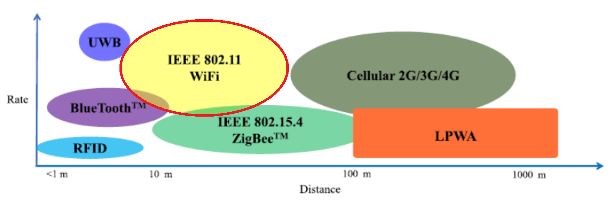

## **Aspetti critici**

Elementi **critici** su cui **bilanciare convenienze** e saper fare delle **scelte argomentate** sono:
- schema fisico (**planimetria**) dell'infrastruttura con etichettatura univoca di tutti gli asset tecnologici di rete.
- tipologia di **divisione in gruppi** degli utenti.
- definizione delle **tecnologie dei dispositivi** chiave quali sensori/attuatori ([dispositivi terminali](sensornetworkshort.md#dispositivi-terminali-sensoriattuatori)), gateway, link (dual radio, three radio), accesso radio (allocazione di servizi sincroni TDM, asincroni CSMA/CA o a basso ritardo slotted CSMA/CA) e loro dimensionamento di  massima (quantità, numero di porte, banda, ecc.).
- eventuali vincoli normativi sulle tecnologie in uso come potenza, EIRP, ERP e duty cycle.
- schema logico (albero degli **apparati attivi**) di tutti i dispositivi di rete con il loro ruolo e i **link virtuali** astratti ai vari livelli della **pila ISO/OSI** (tipicamente L2, L3, L7)
- dislocazione di eventuali **gateway**.
- **subnetting** e definizione degli indirizzi dei vari gruppi di utenti, delle server farm, definizione degli indirizzi dei server.
- definizione del **tipo di routing** (statico o dinamico). In caso si scelga il **routing statico**, definizione delle **tabelle di routing** più significative.
- definizione della posizione del broker MQTT.
- definizione dei topic utili per i casi d'uso richiesti.
- definizione dei **messaggi JSON** per alcuni **dispositivi IoT** ritenuti significativi in merito a **comandi**, **stato** o **configurazione**.
- definizione (anche in pseudocodice) delle **funzioni del firmware** di bordo dei **dispositivi IoT**.

[Rete di reti WiFi](/approfondimenti/wifi_infra_federation.md)
       
[Broker MQTT](/approfondimenti/broker_mqtt.md)

[Messaggi MQTT](/approfondimenti/messaggi_mqtt.md)

[Server di gestione](/approfondimenti/server_di_gestione.md)

[Sensori](/approfondimenti/sensore.md)


## **Rete in modo infrastruttura** 

## **Architetture delle reti WiFi** 

Una architettura di rete wireless WiFi è può essere realizzata in tre modalità:
- **Modalità Infrastruttura** di tipo master/slave
- **Modalità ad hoc** di tipo peer to peer 
- **Modalità Wifi Direct**  di tipo Punto – punto

## **Architettura WiFi Infrastruttura** 

Le architetture **più diffuse** in ambito aziendale ed **indoor** sono di **tipo infrastruttura** e sono composte di un dispositivo master centrale detto **Access Point (AP)** posto in posizione **baricentrica** rispetto a più dispositivi slave della rete wireless detti **Client**:
- La comunicazione tra client gestiti da uno **stesso AP** avviene direttamente attraverso l’hub wireless da lui creato
- La comunicazione tra client di **AP diversi**, o tra un **AP e host fissi** avviene sempre mediata dai dispositivi dell’infrastruttura di rete (switch e router)

Gli AP della stessa infrastruttura condividono lo stesso SSID, cioè l’SSID è una proprietà dell’infrastruttura wireless e non del singolo AP.

Gli **elementi** di una rete in modo infrastruttura sono:
- gli **AP (Access Point)**, sono dei dispositivi di **aggregazione** dei client della rete LAN (PC, dispositivi IoT, smartphone, tablet, ecc.) che, attraverso gli AP, ottengono un accesso alla rete LAN aziendale. In modo infrastruttura, gli AP sono in realtà assimilabili a 2 dispositivi distinti:
    - un **HUB wireless** che realizza un **mezzo broadcast** (multipunto) dove i client accedono mediante il protocllo **CSMA/CA** e sue ottimizzazioni per il WiFi (vedi [CSMA/CA](protocollidiaccesso.md#csmaca) per dettagli)
    - un **bridge** tra l'hub wireless e una LAN cablata (vedi [Bridge AP](archwifi.md#bridge-group)). Un **bridge** è uno dispositivo di **commutazione** simile ad uno **switch** ma realizzato in **SW**, che **inoltra**, a livello L2, trame MAC dall'HUB alla LAN cablata e viceversa. Questi bridge, per ogni AP, possono essere più di uno e, in questo caso, sono tanti quante le **interfacce logiche** dell'AP e mappano ogni intefaccia su una **VLAN diversa**.
- un **controller** degli AP. E' un **server** che si occupa della creazione e gestione dei bridge nei vari AP, della impostazione centralizzata di interfacce logiche e parametri radio, della assegnazione centralizzata degli indirizzi IP, dell'assegnazione automatica dei canali in modo da minimizzare le interferenze reciproche tra gli AP, dell'aggiornamento centralizzato dei FW dei vari AP, della gestione dei protocolli di autenticazione, delle funzioni di logging, delle funzioni di firewall, della creazione di hotspot, ecc..

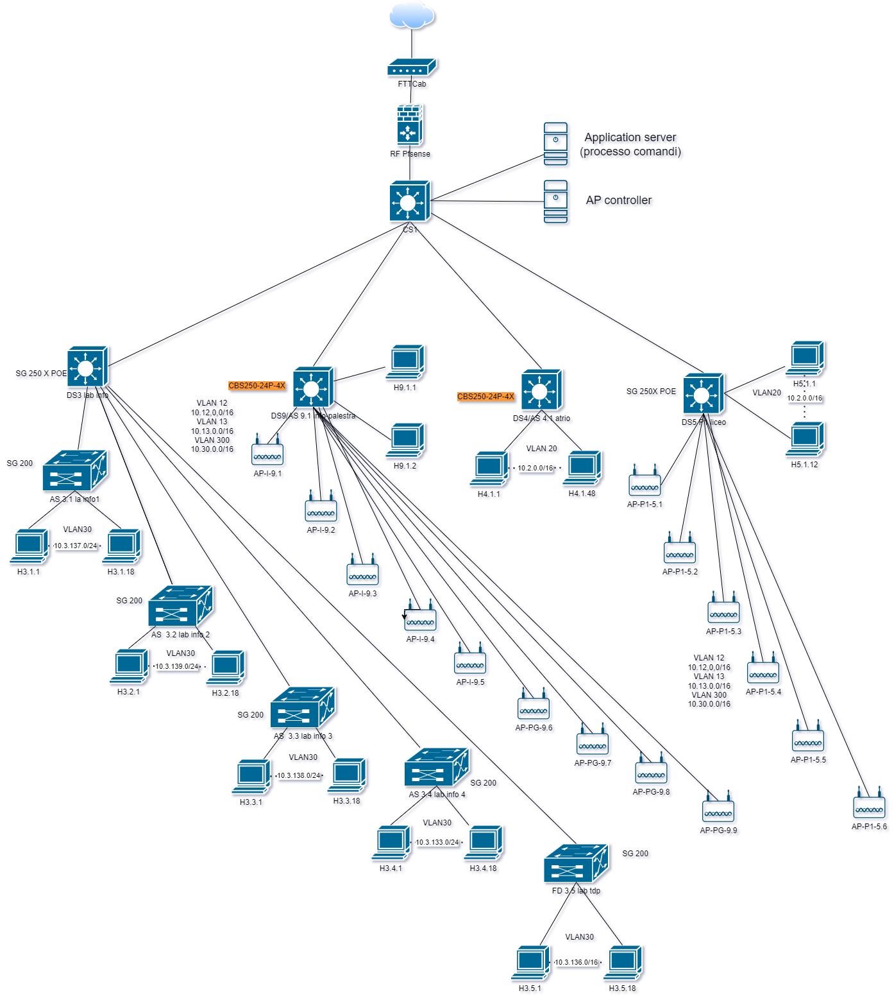

## **Access point**

Il dispositivo AP è assimilabile ad un **Hub** che realizza un BUS broadcast che collega tutti i device client. Il mezzo radio è di tipo broadcast half duplex in cui uno parla e tutti ascoltano. Per realizzare un canale percepito dalle stazioni client come full duplex l’accesso di queste necessita di essere arbitrato. L'**arbitraggio** può essere di tipo:
- **Peer to peer**: è la soluzione più comune, l’accesso al mezzo degli interlocutori è gestita in maniera autonoma da ciascuno di essi tramite un  meccanismo di ack realizzato dal protocollo 802.11 di tipo CSMA/CA.
- **Master/Slave**: è la soluzione realizzata sotto l’arbitraggio centralizzato del dispositivo AP, che assume il ruolo di **master**. L’AP assegna un tempo prestabilito a ciascuna comunicazione per parlare e lo comunica periodicamente a tutte le stazioni tramite opportune trame di segnalazione (**beacon**). E' la modalità CFP (Contention Free Period) cioè, **senza collisioni**.

Per dettagli sulle tecniche di accesso al BUS in generale e per quelle utizzate dal WiFi in particolare vedi [Dettaglio mezzi a BUS](protocollidiaccesso.md)

La **disposizione** fisica degli AP dovrebbe essere il più possibile **uniforme** all'interno dell'area di copertura del servizio di connessione wireless e in **posizione baricentrica** rispetto ai potenziali utilizatori, almeno per quanto è reso possibile da **vincoli** insormontabili di altra natura. 

Per quanto riguarda il loro **collegamento** ai **dispositivi attivi** della rete **LAN cablata**, si potrebbero individuare alcune **possibilità**:
- il collegamento sulle porte di uno **switch di accesso** (AS) condiviso con i dispositivi fissi, che oltre ad aggregare le prese aggreghi gli AP. Soluzione per pochi AP con traffico limitato.
- il collegamento sulle porte di uno **switch di distribuzione** (DS) condiviso con le dorsali di piano che, oltre a diramare dorsali ad alta densità di traffico verso gli AS, dedicano anche dorsali ad alta capacità verso ogni singolo AP. Soluzione dimensionalmente adeguata tenedo conto del thoughput superiore al Gbit/sec  degli AP più recenti che permettono sia collegamenti ad **alte prestazioni** (200-300 Mbps/sec) che l'aggregazione di un **elevato numero** di client (superiore a 100). Soluzione desiderabile per grandi ambienti che basano i loro servizi su Internet quali alberghi, scuole, campus universitari, ecc.
- l'utilizzo, per entrambe le soluzioni precedenti, di **SW dedicati** solo per gli AP, soluzione che permette di dedicare una **dorsale dedicata**  (di piano o di campus) a ciascun **gruppo di AP**. Soluzione auspicabile per **servizi avanzati** ad alta **densità** di utenze (come luoghi pubblici) e alta **intensità** di traffico (come servizi multimediali avanzati).

## **Autenticazione utente presso un AP**

L'autenticazione di un Access Point (AP) Wi-Fi è un processo fondamentale per garantire che solo gli utenti autorizzati possano connettersi alla rete. Ecco un elenco dei principali tipi di autenticazione utilizzati in un AP Wi-Fi, con una breve descrizione di ciascuno:

1. **Autenticazione Aperta (Open Authentication)**:È il metodo di autenticazione più semplice e non richiede alcuna chiave di sicurezza o password. Qualsiasi dispositivo può connettersi alla rete senza restrizioni. Uso comune: Reti pubbliche gratuite come quelle in caffè, biblioteche, o hotspot pubblici.
2. **Autenticazione con chiave condivisa (Shared Key Authentication)**: Utilizza una chiave di rete (password) condivisa tra l'AP e i client. Solo i dispositivi che conoscono questa chiave possono connettersi alla rete. Uso comune: Reti domestiche o piccole reti aziendali dove la sicurezza è basata su una singola chiave di rete.
3. **WEP (Wired Equivalent Privacy)**: Uno dei primi standard di sicurezza Wi-Fi, utilizza chiavi statiche per crittografare il traffico di rete. È considerato insicuro e obsoleto a causa delle sue vulnerabilità. Uso comune: Praticamente non più utilizzato a causa della sua insicurezza. È stato sostituito da metodi più sicuri.
4. **WPA (Wi-Fi Protected Access)**: Un miglioramento rispetto a WEP, utilizza chiavi dinamiche e un sistema di crittografia più robusto. Tuttavia, WPA è stato anch'esso superato da WPA2. Uso comune: Reti che non possono supportare WPA2 ma richiedono una maggiore sicurezza rispetto a WEP.
    - **WPA2 (Wi-Fi Protected Access 2)**: Standard di sicurezza attualmente più diffuso. Utilizza l'algoritmo di crittografia AES (Advanced Encryption Standard) e chiavi dinamiche. WPA2-Personal (PSK): Utilizza una chiave pre-condivisa (pre-shared key). Adatto per reti domestiche e piccole reti aziendali.
    - **WPA2-Enterprise**: Utilizza un server RADIUS per l'autenticazione degli utenti, fornendo una maggiore sicurezza. Adatto per grandi reti aziendali. Uso comune: La maggior parte delle reti Wi-Fi moderne, sia domestiche che aziendali.
    - **WPA3**: L'ultima versione del protocollo WPA, offre miglioramenti in termini di sicurezza rispetto a WPA2, inclusa una protezione più robusta contro gli attacchi a dizionario e Forward Secrecy. WPA3-Personal: Utilizza Simultaneous Authentication of Equals (SAE) per una maggiore sicurezza della chiave pre-condivisa. WPA3-Enterprise: Migliora la sicurezza rispetto a WPA2-Enterprise, offrendo una crittografia più robusta e una gestione delle chiavi più sicura. Uso comune: Reti di nuova generazione che richiedono la massima sicurezza disponibile.
8. **802.1X/EAP (Extensible Authentication Protocol)**: Utilizzato principalmente nelle reti WPA2-Enterprise e WPA3-Enterprise. Richiede un server di autenticazione (RADIUS) e supporta vari metodi di autenticazione come certificati digitali, smart card, token hardware e credenziali di nome utente/password. Uso comune: Grandi reti aziendali e ambienti dove è necessaria una gestione avanzata delle credenziali di accesso e autenticazione forte. E' la più sofisticata, per dettagli vedi [Autenticazione 802.1X](radius.md)

Ogni tipo di autenticazione ha i suoi pro e contro in termini di sicurezza, facilità d'uso e configurazione. La scelta del metodo di autenticazione dipende dalle esigenze specifiche della rete e dal livello di sicurezza richiesto.

## **Modi di un dispositivo wireless 802.11**

Un dispositivo AP commerciale può essere configurato in:
- **AP mode**: l’AP diventa un dispositivo master che crea un hub radio con un SSID che identifica l’infrastruttura wireless. L’AP diventa un aggregatore di client sulla LAN aziendale, al pari di uno SW di accesso. L’hub wireless è  collegato alla LAN mediante un bridge.
- **Client mode**: l’AP diventa un dispositivo che serve a permettere l’accesso ad una rete WiFi già esistente con un dato SSID da parte di un dispositivo client (PC, SW, router). Spesso possiede funzioni di routing e di NAT che impediscono sul lato client l’accesso da parte di host che stanno  sul lato AP.
- **Bridge mode**: l’AP realizza una condivisione del proprio Hub radio con uno diverso generato da un altro AP di cui condivide lo stesso SSID.  In altre parole, da due hub separati ne ottengo uno con lo stesso ssid. Se uno dei due hub è in bridge con una LAN allora anche il secondo lo diventa, i due hub e il bridge diventano una stessa LAN. Gli host a monte e a valle dei due AP si vedono reciprocamente (dorsale L2). In questo modo creo un collegamento diretto che non accetta l’accesso di dispositivi client.
- **WDS mode**: è una evoluzione del Bridge mode in cui i due bridge, oltre a creare la dorsale L2 tra di loro, hanno anche la funzione di un normale AP consentendo l’accesso ai dispositivi client.
- **Long range mode**: è la disinserzione forzata su un master della modalità peer to peer trasformandolo di fatto in un dispositivo con accesso TDMA (ack e contesa eliminati). Si utilizza per realizzare ponti radio fissi di centinaia di chilometri. Su dispositivi di fascia bassa, spesso non si realizza un TDMA ma ci si limita ad allungare i tempi degli RTT del sistema (contesa con ack ritardati).

## **Struttura cellulare**

Una rete wifi è organizzata nelle zone di influenza di ciascun AP dette **cella**. A causa dell'**attenuazione** del segnale radio dovuta alla distanza o agli ostacoli un client raggiunge un AP solo fino ai confini della sua cella.
Il collegamento in **mobilità** di un client da una cella ad un’altra adiacente si chiama **roaming** e determina un passaggio della presa in carico di un utente da una cella a quella di transito vicina che viene detto in gergo **handover**. Un handover avviene generalmente, in maniera trasparente all’utente e **senza la cessazione** di eventuali connessioni in corso. 

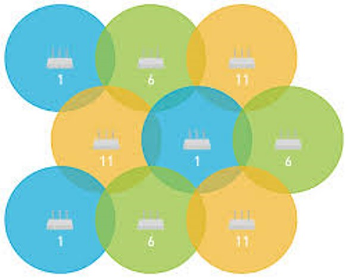

Una organizzazione ottima della rete fa in modo di minimizzare la cosidetta **interferenza cocanale**. L’interferenza cocanale è il disturbo creato alle comunicazioni di un AP dalle comunicazioni di un altro AP che condivide la stessa frequenza. L’interferenza cocanale è minimizzata quando:
- Dispositivi adiacenti hanno frequenze molto diverse
- Frequenze uguali sono condivise da dispositivi molto lontani

La divisione in celle è una forma di **SDM** (Space Division Multiplation), infatti celle di uno stesso colore possono trasmettere senza interferirsi nella stessa frequenza e nello stesso istante purchè siano in posizioni differenti. 
Per dettagli vedi [multiplazioni statiche](multiplazioni.md)

Si tenga conto poi che i dispositivi WiFi sono dei veri e propri **hub** e quindi dei **mezzi broadcast** assimilabili ad un **BUS a filo**:
- Il **riutilizzo** della **stessa frequenza** tra due dispositivi **vicini** unisce i bus a livello fisico causando la **condivisione** dei rispettivi **dominii di collision**e, circostanza che **dimezza di netto la banda** disponibile di entrambi.
- l'utilizzo di **frequenze diverse** permette di tenere gli **hub separati** e di lasciare al meccanismo del **roaming** del dispositivo la **scelta** di collegarsi ad uno piuttosto che all'altro. 

Per dettagli in merito alla canalizzazione delle celle vedi [Allocazione dei canali alle celle](wifichannels.md).

### **Esempio**

Nel contesto di un istituto scolastico che si vuole servire con una rete WiFi, si vogliono separare i **servizi di segreteria** scolastica con i suoi **server** e i suoi **impiegati** localizzati in una subnet fisicamente dislocata in una **certa area**, dai **servizi di mobilità**, dispersi a **macchia di leopardo** in tutto il comprensorio, ai docenti dotati di supporti di loro proprietà (politica Byod) con i quali eseguono le loro attività giornaliere sul registro scolastico. Si vuole consentire anche una gestione separata al traffico dei **servizi di videosorveglianza** con propri **server**, a disposizione all'interno di una subnet separata. 

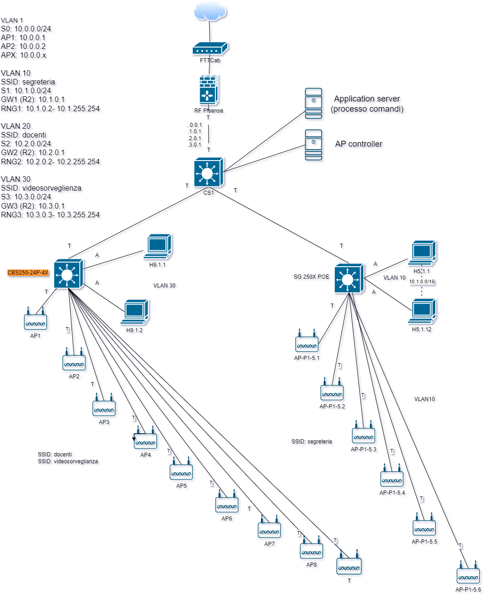

La **separazione** dei gruppi di utenti **solamente** in base alla **dislocazione fisica** sarebbe evidentemente impossibile, mentre sarebbe **effettiva** la separazione mediante **VLAN** dislocate su una infrastruttura **switched**.

### **Definizione dei gruppi mediante VLAN**

La **definizione** dei gruppi si può fare con una dislocazione a **macchia di leopardo** delle **interfacce** di accesso alla diverse VLAN, aventi **ssid statici** diversi o uno unico ma **dinamico** (autenticazione 802.1X). Gli **host** possono collegarsi all'**ssid** di una certa VLAN su **ogni AP**. La loro **separazione** avviene **dopo**, su un **router** di confine collegato al core switch con un link capace di creare il **trunking** dei flussi (**intervlan routing** in modo **router on a stick**). Le **dorsali** tra i vari bridge devono essere configurate come dorsali di **trunk** (802.1Q) in modo tale che portino il traffico aggregato di **tutte le VLAN**.

Si sarebbe potuto isolare in maniera ancora **più affidabile** la rete della segreteria servendola con uno SW dedicato collegato direttamente ad una porta del router, realizzando così una separazione fisica piuttosto che una logica, sfruttando il fatto che la dislocazione fisica dei suoi utenti è confinata in un'area esclusiva. Però, poichè il controller degli AP deve risiedere nella stessa subnet degli AP da controllare, sarebbe poi nata l'esigenza di doverne installare due, uno per la segreteria ed uno per la scuola. 

L'**inconveniente** viene superato adoperando le **VLAN** e la sicurezza viene mantenuta ugualmente alta (**like wire** in pratica) grazie ai **comandi**: ```allowed vlan 1, 20, 30``` e ```allowed vlan 1, 10``` che **confinano** il traffico delle **trame MAC** relative alla LAN della **segreteria** sul solo SW dove sono collegati i suoi dispositivi. Tutte le altre dorsali non possono essere interessate da questo traffico, mentre sono tutte interessate dal traffico della **subnet amministrativa** degli AP che possono così essere gestiti da un **unico controller**.

### **Esempio di Configurazione**

Per configurare una rete con 3 router WiFi mesh, in cui ogni router ha una dorsale (backhaul) con canale di comunicazione dedicato e due router aggregano sensori su due subnet diverse, possiamo seguire questo schema:

I Router per aggregazione dei sensori sono R2 e R3. Per le subnet possiamo usare un blocco di indirizzi privati come 10.0.0.0/8 e dividerlo, con un subnetting **FLSM classful**, come segue:

#### **Subnetting**

Subnet per la dorsale degli AP (VLAN amministrativa no ssid):
- VLAN 1
- S0: 10.0.0.0/24
- AP1: 10.0.0.1
- AP2: 10.0.0.2
- APX: 10.0.0.x

Subnet per la segreteria.
- VLAN 10
- SSID: segreteria
- S1: 10.1.0.0/24 
- GW1 (R2): 10.1.0.1
- RNG1: 10.1.0.2- 10.1.255.254

Subnet per i docenti.
- VLAN 20
- SSID: docenti
- S2: 10.2.0.0/24 
- GW2 (R2): 10.2.0.1
- RNG2: 10.2.0.2- 10.2.255.254

Subnet per la videosorveglienza.
- VLAN 30
- SSID: videosorveglienza
- S3: 10.3.0.0/24 
- GW3 (R2): 10.3.0.1
- RNG3: 10.3.0.3- 10.3.255.254

#### **Routing statico**

R1 possiede 3 indirizzi su ciascuna subnet:
- S0 (VLAN 1): 10.0.0.1  SM0: 255.255.0.0
- S1 (VLAN 10): 10.1.0.1  SM1: 255.255.0.0
- S2 (VLAN 20): 10.2.0.1  SM2: 255.255.0.0
- S3 (VLAN 30): 10.3.0.1  SM3: 255.255.0.0
  
Non è necessario impostare le tabelle di routing in quanto le subnet S0, S1, S2, S3 sono, su R1, direttamente connesse.


## **Beacon**

I beacon sono delle **sequenze di sincronizzazione** (dette preambolo) in grado sia di sincronizzare gli **orologi** dei dispositivi (Tx e Rx) che si accingono ad iniziare una comunicazione, ma anche di **indentificare** in maniera univoca i dispositivi che li emettono. Per dei dettagli vedi [preambolo di sincronizzazione](protocolli.md#preambolo-di-sincronizzazione).

La trama dati compresa tra **due beacon** consecutivi viene detta **supertrama** (superframe) ed è generalmente divisa in due zone con **politiche di accesso** al canale diverse:  
- una **deterministica** al riparo dalle collisioni detta **CFP** (Contention Free Period) e regolata dalla multiplazione statica TDMA, che viene usata per trasmettere i dati delle comunicazioni **unicast**.
- una **probabilistica** a contesa, in cui i tentativi di accesso dei dispositivi sono soggetti al **rischio di collisione** perchè regolata da un protocollo di tipo **CSMA/CA**, che invece serve per trasmettere delle particolari informazioni **broadcast** dette **advertisement**.

Nel contesto di WiFi, un **Access Point (AP)** può assumere un ruolo di **coordinamento**, detto PCF, gestendo l'accesso al canale in modo master/slave in cui il centrale ha il ruolo di **master** che stabilisce **quale** stazione deve parlare, **quando** e **per quanto** tempo usando una politica di **turnazione** delle stazioni (**polling**).
  
Nel caso del WiFi, il **NAV CFP** (Contention Free Period) è un meccanismo che inibisce tutte le stazioni dal prendere l'**iniziativa di cominciare** una trasmissione. Finchè è valido le stazioni comunicheranno in modalità **master/slave**, cioè **risponderanno** solo **se interrogate**.

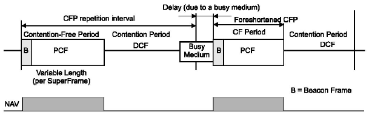

**Durante il CFP**, il PC invia messaggi di Polling a rotazione verso le stazioni, interrogandole a riguardo della **disponibilità** di dati da trasmettere. Questà modalità offre il vantaggio di adattarsi meglio alle **sorgenti** dati di tipo **real time** caratterizzate da trasmissioni di tipo **sincrono**. Sorgenti sincrone tipicamente sono: **sensori**, telefonia **VOIP**, **videoconferenza**, **streaming**, ecc.

**Riassumendo**, Normalmente i dispositivi AP lavorano in **modalità ibrida** DCF e PCF. Vengono trasmessi periodicamente dei beacon e l'intervallo temporale tra un beacon e l'altro viene suddiviso in **due zone**, una soggetta a trasmissioni di tipo **PCF** e quindi **intrinsecamente** al riparo dalle collisioni adatta a trasmissioni **sincrone** e un'altra di tipo **DCF**, soggetta a collisioni sugli RTS, dedicata alle trasmissioni **asincrone**.


## **Banda ISM**

Le **bande libere** sono le frequenze di **uso libero**, non tutelate, che non richiedono **concessioni** per il loro impiego. Sono spesso indicate come **ISM** (Industrial, Scientific and Medical)[Nota 1].

In realtà ISM è un sottogruppo di tutte le frequenze disponibili. La situazione è analoga a quella delle spiaggie. In tutto il territorio nazionale molti litorali sono stati dati in concessione a privati che possono consentirne l'accesso a chi vogliono purchè paghi. Solo alcune sono **libere**, cioè aperte a tutti senza pagare ma, in questo caso, è necessario tutelare il bene **pubblico condiviso** affinchè nessuno ne **monopolizzi l'uso** appropriandosene la maggiorparte per la maggiorparte del tempo.

L’uso di tali bande è regolamentato in modo da consentirne l’**impiego condiviso** ed evitare che un utente o un servizio possa **monopolizzare** la risorsa.

In tabella un elenco parziale con le principali **limitazioni** che riguardano principalmente **potenza**, **duty cycle**, **EIRP**, **ERP** e il **tipo di accesso** (ALOHA, LBT o AFA). Vedi [Banda ISM 800 MHz](ism.md) per dettagli.

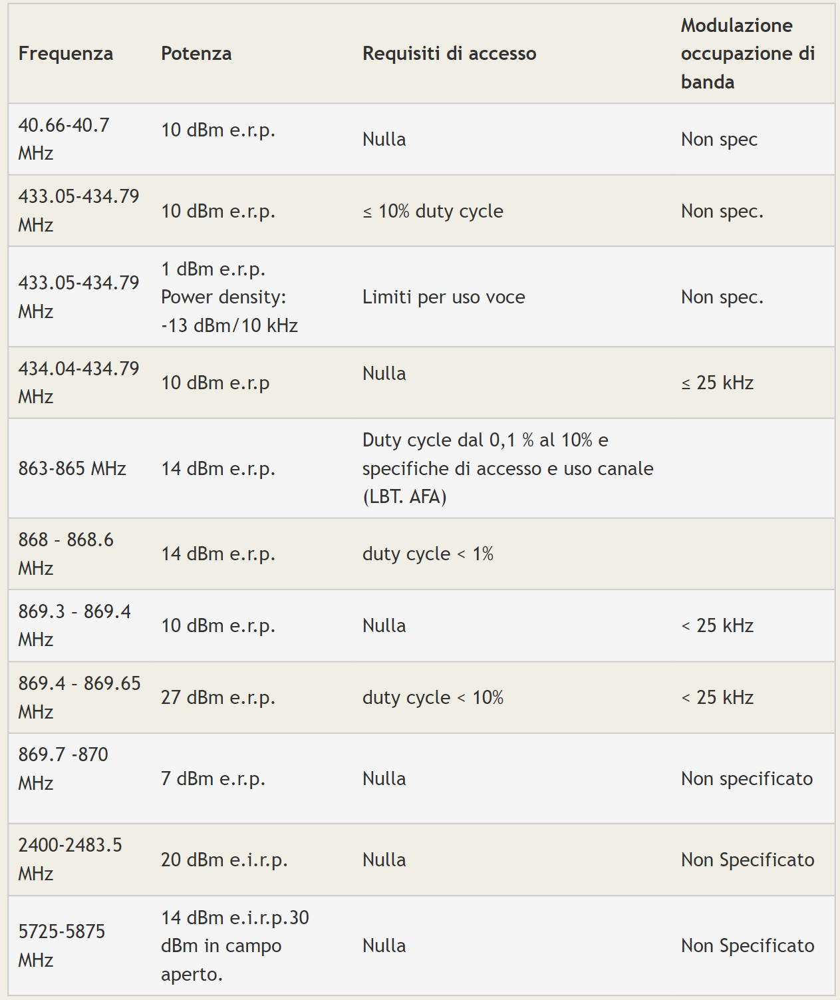

Per le reti Wi-Fi che operano nella banda 2.4 GHz, i **limiti di EIRP** possono variare a seconda del canale utilizzato e sono generalmente compresi tra 20 dBm (100 mW) e 24 dBm (250 mW). Per la banda 5 GHz, i limiti possono essere più elevati e variano in base al canale e alla larghezza di banda utilizzati. Vedi [Gestione equa della banda WiFi](eirpwifi.md) per le definizioni e i dettagli.

Ogni **access point** utilizza un **singolo canale** (largo 22 MHz), che viene condiviso in TDMA-TDD (**CSMA/CA**) da tutti gli utenti.

La trasmissione avviene a **pacchetti** con **conferma** di ricezione.

##  **Impatto ambientale**

La **potenza media** delle emissioni ambientali dipende dalle condizioni di servizio ed è influenzata dal duty cycle, a sua volta determinato da vari **fattori**:
- La bidirezionalità della trasmissione (attesa dell’OK di ricezione)
- La necessità di servire più terminali mobili (diminuisce il duty cycle di ogni singolo terminale mobile)
- Il duty cycle aumenta col volume di dati da trasferire, ma raramente ci si avvicina al 100%
- Il duty cycle dipende dalla velocità della connessione (connessioni più veloci richiedono tempi di trasmissione inferiori)
- Il duty cycle dipende anche dalla qualità del collegamento, a causa delle ritrasmissioni
- La presenza di più access point sullo stesso canale determina collisioni che fanno diminuire il duty cycle di un singolo access point
- La capacità di traffico della rete collegata influenza il duty cycle
- Il duty cycle minimo dell’access point è fissato dai segnali di servizio (beacon signals) ed è dell’ordine di 0.01%

Considerata la **bassa potenza** di uscita di **picco**, il bassissimo **guadagno d’antenna** e la riduzione operata dal **duty cycle**, gli access point delle reti Wi-Fi generano livelli di **densità di potenza** sempre molti ordini di grandezza sotto i **limiti normativi** ed anche significativamente inferiori alle **stazioni radio base** della telefonia cellulare.
 
## **Ponti radio WiFi**

Un ponte radio WiFi è una dorsale tra due tronchi di rete **cablata** realizzata mediante due o più **dispositivi wireless**. Può essere:
- **Punto-Punto**: un dispositivo in modo AP e collegato ad **un solo** dispositivo AP in modo Client o Bridge
- **Punto-Multipunto**: un dispositivo in modo AP è collegato **a più** dispositivi AP configurati in modo Client  o Bridge

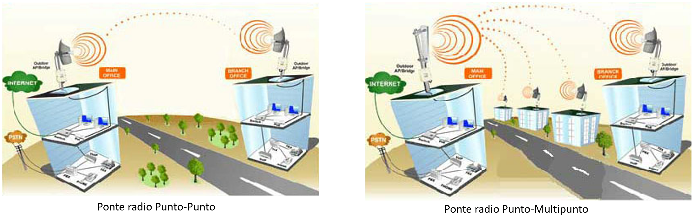

**In genere**, i **dispositivi AP** coinvolti in una dorsale si comportano anche come router. Un **ponte radio wifi** potrebbe, ad esempio, **essere utile** quando:
- edifici di una stessa organizzazione sono separati dal **suolo pubblico** (ad es. una strada)
- **Vagoni** di uno stesso treno che non devono essere collegati attraverso cavi dati
- Si vuole realizzare un **ISP regionale** con dorsali wireless disponendo un **AP wireless** sul tetto delle case degli utenti. Alcuni di questi avranno anche funzione di **router di smistamento** tra dorsali wireless differenti. 

### **Link budget**

Tra trasmettitore e gateway potrebbe essere valutato il cosidetto **link budget**, overossia la somma dei guadagni e delle attenuazioni lungo il percorso fino al ricevitore. L'obiettivo è valutare il rispetto del **vincolo finale** sul ricevitore, cioè che la potenza ricevuta sia maggiore della **sensibilità minima** del ricevitore più un certo **margine di sicurezza** per tenere conto del **fading** ambientale (multipath oppure attenuazione atmosferica) che è una quantità che varia, più o meno rapidamente, col **tempo**. Per dettagli sul calcolo vedere https://www.vincenzov.net/tutorial/elettronica-di-base/Trasmissioni/link.htm. Oppure si possono usare dei calcolatori online di link budget LOS radio quali https://www.daycounter.com/Calculators/Friis-Calculator.phtml, oppure https://www.pasternack.com/t-calculator-friis.aspx. Rimane assodato che si tratta soltanto di un **calcolo di massima** che fornisce indicazioni sulla fattibilità teorica di un collegamento che, se positiva, richiede attente e ripetute **verifiche sul campo** nelle condizioni di esercizio previste per l'impianto.

### **WiFi in Bridge mode**

In **bridge mode**, il collegamento tra due AP è assimilabile ad una **dorsale L2**. Nessun altro dispositivo client può entrare a far parte del bridge oltre i due AP. I dispositivi possono essere connessi in modalità WDS oppure in modalità Ad Hoc. Gli host a monte e a valle dei due dispositivi si vedono reciprocamente. Il **bridge a monte** si chiama root bridge, è il bridge con il ruolo di radice nell'albero di **spanning tree** (protocollo STP). 

Il funzionamento della **modalità Bridge** in un dispositivo wireless coinvolge l'intercettazione del traffico wireless proveniente da una rete e il suo **inoltro** a un'altra rete, consentendo così la comunicazione tra le due reti senza fili come se fossero collegate tra loro tramite uno **switch**.

#### **Problema rete treno**

Si ha la necesità di dotare un treno di **accessi wifi** per i viaggiatori  e per i controllori, con il **vincolo** di non aggiungere **cavi** ai collegamenti tra un **vagone e l'altro**. All'**interno** dei singoli vagoni la rete potrebbe pure essere **cablata**. Le **reti** per **viaggiatori** e per i **controllori** sono richieste **isolate** una dall'altra. 

#### **Soluzione**

Se si fa la **scelta** di realizzare un **collegamento cablato** all'**interno** dei vagoni, allora si rientra nel caso d'uso di un **ponte radio wireless** tra tronchi di rete **LAN wired**. 

**In particolare**, nell'esempio dei vagoni, i dispositivi Wifi internamente realizzano un **bridge SW** tra **hub wireless** e un collegamento Ethernet. Il **collegamento ethernet** va verso gli **AP** e verso l'**altro bridge** all'altro capo dello **stesso vagone**. Il **collegamento wireless** realizzato dall'**hub** va verso il **bridge** posto nel **vagone adiacente**.

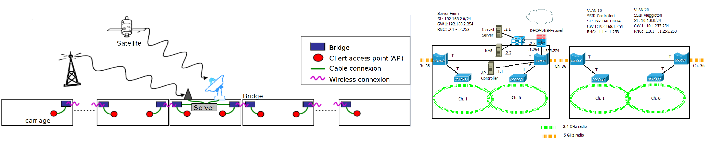

Per funzionare efficacemente dovrebbe avere:
- **almeno due radio wireless**: una per la connessione alla prima rete e una per la connessione alla seconda rete. Questo consente al dispositivo di ricevere dati da una rete e trasmetterli all'altra contemporaneamente, facilitando il trasferimento di dati tra le due reti.
- **uso di due canali diversi**:È importante selezionare canali wireless non sovrapposti per evitare interferenze e garantire prestazioni ottimali. Gli **stessi canali** possono essere riciclati nei due link verso **verso gli utenti** dato che questi, essendo dislocati in due zone differenti, **non** si **interferiscono**.

### **WiFi in client mode**

In **client mode** il collegamento tra due AP è assimilabile ad una **dorsale L3**. Altri dispositivi client possono entrare a far parte del link tra i due AP.

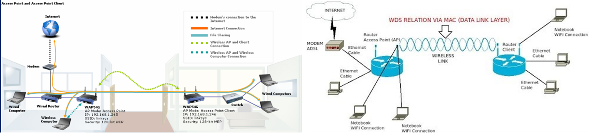

### **Esempio sottorete privata**

Si ha la necessità di unire due reti LAN della stessa azienda ma poste su edifici separati da una strada pubblica che non si vuole o non si può cablare. Non si vuole ricorrere a VPN per non dover pagare un secondo abbonamento ad internet.

### **Soluzione**

Il dispositivo client implementa un **router** ed un **NAT**. In genere, gli host sulla LAN del client utilizzano il server DHCP del router, poiché di fatto è una rete indipendente. 

Gli host del lato AP non vedono quelli del lato client ma solo un router (con indirizzo privato). Gli host del lato client vedono quelli del lato AP, ed accedono ad internet.

### **WiFi in repeater mode**

Il dispositivo **amplifica** il segnale estendendo la dimensione nello spazio del mezzo a BUS che comunque rimane unico per tutti i dispositivi. Ne consegue che il traffico sul primo hub wireless viene riportato sul secondo e vicerversa.  Dovendo rimanere uguale il throughput complessivo, ne consegue che la banda di ciascun hub wireless **non** potrà essere **superiore al 50%** del throughput di **uno solo**, se questi generano lo stesso volume di traffico.

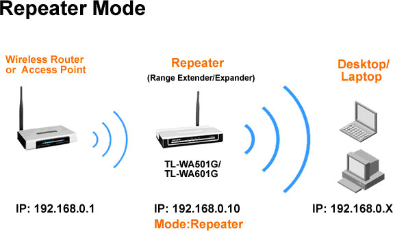

**In sintesi**, la maggior parte dei **ripetitori wireless** opera con una **singola radio** e utilizza gli **stessi canali** e lo **stesso SSID** della rete principale per estendere la sua copertura. Questo semplifica la configurazione e consente una transizione fluida tra il segnale del router principale e quello del ripetitore, a costo di un sostanziale **dimezzamento del trhoughput** della rete principale.

Essendo parte di una unica LAN derivata dallo stesso hub esteso, tutti i dispositivi devono possedere **indirizzi IP** afferenti alla **medesima subnet**.

### **Bridge group**

All'**interno** di ogni **AP**, in realtà, sono sempre presenti uno o più **bridge** realizzati in SW (creati  mediante il comando  bridge-group x) che hanno il compito di **associare** il traffico delle **interfacce wireless**  con le **interfacce Ethernet** della reta cablata.

Le **interfacce wireless** fisiche sono divise in più **sotto interfacce** logiche, ciascuna con il proprio **SSID** (veri e propri Hub wireless separati da un ssid).

Anche le interfacce ethernet fisiche sono divise in più **sotto interfacce** logiche, ciascuna con il proprio vlan id.

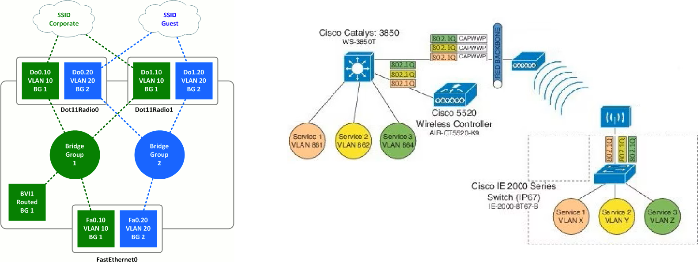

All'interno di ogni AP, in realtà, sono sempre presenti uno o più bridge realizzati in SW (creati mediante il comando bridge-group x) che hanno il compito di collegare il traffico delle interfacce wireless con le interfacce Ethernet della rete LAN
Le interfacce wireless fisiche sono divise in più sotto interfacce logiche, ciascuna con il proprio SSID (veri e propri Hub wireless separati da un ssid). Esiste un bridge diverso associato ad ogni VLAN che collega il traffico wireless 802.11 di una VLAN con il traffico Ethernet 802.3 della stessa VLAN.

Anche le interfacce ethernet fisiche (Trunk) sono divise in più sotto interfacce logiche, ciascuna con il proprio vlan id.

L'**associazione** di una interfaccia ad una VLAN può essere:
- **Statica** e si imposta sul controller degli AP
- **Dinamica** e si imposta sul server Radius con:
  - **Una ACL** sul file di configurazione users del server radius 
  - **Una impostazione** nel modulo eap in mods-available che setta use_tunneled_reply = yes

Esempio di configurazione di due radio (a 2.4 GHz e 5 GHz) per gestire due SSID ciascuna associati a due VLAN diverse:

#### **Configurazione globale**
```C++
dot11 ssid Corporate
   vlan 10
!
dot11 ssid Guest
   vlan 20
!
bridge irb
```

Un **BVI (Bridge Virtual Interface)** in un Access Point WiFi è un'**interfaccia logica** del bridge utilizzata per ottenere un unico punto di gestione per l'**indirizzamento IP** e altre configurazioni di rete. Con 2 bridge accade che il **bridge group 1** avrà il suo **BVI1**, mentre il **bridge group 2** avrà il suo **BVI2**. 

Due funzioni rilevanti vengono eseguite nello snippet sopra. Innanzitutto, i nostri due SSID (Corporate e Guest) vengono definiti e associati alle VLAN. In secondo luogo, il **routing e il bridging integrati (IRB)** vengono **abilitati** con il comando bridge irb. Ciò consente di definire gruppi di bridge e un BVI.

#### **Configurazione radio 0**
```C++
interface Dot11Radio0
 no ip address
 !
 ssid Corporate
 !
 ssid Guest
 !
 mbssid
!
interface Dot11Radio0.10
 encapsulation dot1Q 10
 bridge-group 1
!
interface Dot11Radio0.20
 encapsulation dot1Q 20
 bridge-group 2
```

#### **Configurazione radio 1**
```C++
 interface Dot11Radio1
 no ip address
 !
 ssid Corporate
 !
 ssid Guest
 !
 mbssid
!
interface Dot11Radio1.10
 encapsulation dot1Q 10
 bridge-group 1
!
interface Dot11Radio1.20
 encapsulation dot1Q 20
 bridge-group 2
```

#### **Configurazione IP**
```C++
 interface BVI1
 ip address 192.168.10.123 255.255.255.0
 no ip route-cache
```
Questa configurazione mantiene il traffico wireless appartenente a un SSID isolato dal traffico appartenente all'altro mentre transita l'access point dall'interfaccia cablata all'interfaccia wireless e viceversa. Nota che poiché non c'è un'interfaccia BVI2, l'access point non ha alcun indirizzo IP raggiungibile direttamente dall'SSID Guest.


### **Conclusioni**

Le reti mesh Wi-Fi 6 sfruttano la capacità multi-radio per ottimizzare le prestazioni e la copertura, utilizzando bande diverse per i link tra nodi e per le connessioni dei dispositivi. Questa tecnologia permette di ridurre la congestione e migliorare l'efficienza della rete, offrendo una connessione più stabile e veloce per tutti i dispositivi collegati. 

**Esempi** di Sistemi **Wi-Fi Mesh** sono:
- **Google Nest WiFi**: Sistema mesh facile da configurare, con un design elegante e funzionalità integrate di Google Assistant.
- **Netgear Orbi**: Offre prestazioni elevate con backhaul dedicato e supporto tri-band, ideale per case grandi.
- **Eero Pro 6**: Supporta Wi-Fi 6, offre alta velocità e copertura estesa, facile da configurare tramite app mobile.
- **Ubiquiti AmpliFi HD**: Un sistema potente con una gestione avanzata delle reti, ottimo per utenti più tecnici.

### **Pagine correlate:**

- [Dettaglio architettura Ethernet](archeth.md)
- [Dettaglio architettura Zigbee](archzigbee.md)
- [Dettaglio architettura BLE](archble.md)
- [Dettaglio architettura WiFi mesh](archmesh.md) 
- [Dettaglio architettura LoraWAN](lorawanclasses.md) 

### **Sitografia**:
- www.master-iot.it Master Universitario di II Livello "Internet of Things and Big Data" A.A.2018-2019 Università degli Studi di Genova
- https://www.researchgate.net/publication/300111853_Long-Range_IoT_Technologies_The_Dawn_of_LoRa
- https://www.researchgate.net/figure/The-Wi-Fi-trilateration-Technique_fig4_277307295
- https://it.wikipedia.org/wiki/Trilaterazione
- https://en.wikipedia.org/wiki/Beacon_frame
- https://www.metageek.com/training/resources/design-dual-band-wifi.html
- http://mce.it/index.php/airmax-5-ghz
- https://www.semfionetworks.com/blog/co-channel-contention-ccc-explained-with-simple-drawings
- https://www.ekahau.com/blog/2019/04/18/channel-planning-best-practices-for-better-wi-fi/
- https://documentation.meraki.com/Architectures_and_Best_Practices/Cisco_Meraki_Best_Practice_Design/Best_Practice_Design_-_MR_Wireless/High_Density_Wi-Fi_Deployments
- https://7signal.com/802-11ac-migration-part-2-whats-nobodys-telling-you-about-80mhz-and-160mhz-channel-bonding/
- https://www.elettra2000.it/phocadownload/atti-convegni/andreuccetti.pdf
- https://community.cisco.com/t5/wireless/mesh-mode-vs-bridge-mode/td-p/4094691
- https://www.cisco.com/c/en/us/support/docs/wireless-mobility/wireless-lan-wlan/68087-bridges-pt-to-pt.html
- https://www.tp-link.com/it/support/faq/151/
- https://indomus.it/formazione/shelly-mqtt-e-http-comandi-utili/
- https://forum.inductiveautomation.com/t/shelly-relay-1-pro-mqtt-command-for-turn-switch-on-off/81137
- https://www.zeteon.com/www/pages/wireless-mesh/
- https://interline.pl/Information-and-Tips/Mesh-Routing-And-Wireless-Distribution-Systems-WDS
- https://www.researchgate.net/figure/System-architecture-of-Multi-channel-Wireless-Mesh-Network-End-users-mobile-devices_fig1_2911584
- https://www.researchgate.net/publication/324643692_SWAM_SDN-based_Wi-Fi_Small_Cells_with_Joint_Access-Backhaul_and_Multi-Tenant_Capabilities
- https://www.tp-link.com/us/blog/137/tp-link-usa-outdoor-solution-guide/
- https://it.wikipedia.org/wiki/Ad-hoc_On-demand_Distance_Vector
- https://it.wikipedia.org/wiki/Optimized_Link_State_Routing_Protocol
- https://www.draytek.com/support/knowledge-base/6002
- https://stevessmarthomeguide.com/wi-fi-mesh-networks/
- https://www.tp-link.com/cac/support/faq/418/
- https://www.researchgate.net/publication/277227642_Test_reports_-_Confrontation_between_experimental_and_numerical_results_Analysis_of_the_attenuation_of_the_WIFI_signals_inside_and_outside_a_railway_vehicle
- https://packetlife.net/blog/2012/feb/20/aironet-aps-bridge-groups-and-bvi/
- https://www.cisco.com/c/en/us/td/docs/wireless/controller/8-6/config-guide/b_cg86/workgroup_bridges.html
- https://www.cisco.com/c/en/us/td/docs/routers/access/wireless/software/guide/wireless_vlans.html
- https://www.cisco.com/c/en/us/td/docs/internetworking/design/guide/idg4.html
- https://www.cisco.com/c/en/us/td/docs/internetworking/design/guide/idg4.html

>[Torna a reti di sensori](sensornetworkshort.md#classificazione-delle-tecnologie-wsn-in-base-a-velocità-e-copertura)
