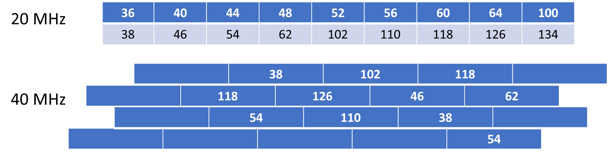

>[Torna a reti di sensori](sensornetworkshort.md#classificazione-delle-tecnologie-wsn-in-base-a-velocità-e-copertura)

Di seguito è riportata l'architettura generale di una rete Zigbee. Essa è composta, a **livello fisico**, essenzialmente di una **rete di accesso** ai sensori e da una **rete di distribuzione** che fa da collante di ciascuna rete di sensori.

La rete di sensori fisica è a stella dove il centro stella è il gateway. Un sensore può anche essere associato a più gateway ed inviare dati a tutti i gateway a cui esso è associato. I dati normalmente arrivano ad un certo dispositivo attraverso un solo gateway.

I gateway utilizzano la rete internet (o una LAN) per realizzare un collegamento diretto **virtuale** con il network server, per cui, in definitiva, la topologia risultante è, **fisicamente**, quella di più **reti di accesso** a stella tenute insieme da una **rete di distribuzione** qualsiasi purchè sia di tipo TCP/IP (LAN o Internet).

### **Gateway standardizzati** 

**Riassumendo**, alla **rete di distribuzione IP** si collegano, quindi, una o più **reti secondarie** che servono da **rete di accesso** per i dispositivi sensori o attuatori con **interfacce** spesso di tipo **non ethernet** che necessitano di un **gateway** di confine con possibili funzioni di:     
  - **Inoltro**, cioè smistamento dei messaggi da un tipo di rete all'altro di tipo L3 (**routing**) o di tipo L2 (**bridging**). L'inoltro del messaggio di un sensore può essere:
       - **diretto** nella rete di distribuzione tramite link fisico verso il dispositivo di smistamento pubblico (router o switch) più vicino.
       - **indiretto** tramite una dorsale virtuale, cioè un **tunnel**, verso il network server o verso un router di una WAN privata, realizzato, ad esempio, in maniera cifrata tramite un **client di VPN**, oppure in maniera non cifrata tramite un client di tunnel generico **GRE**.
  - **Traduzione di formato** dei messaggi da rete a bus a rete ethernet con eventuale realizzazione del **bridge** L4 tra il livello applicativo in uso nella rete di sensori e quello in uso nella rete di distribuzione.
  - **Interrogazione periodica** (polling) dei dispositivi nella rete di sensori (master di una architettura master/slave)
  - **Raccolta e memorizzazione** delle informazioni per essere trasferite in un **secondo momento** al server di gestione
  - **Protezione della rete di sensori**, cioè di firewall, soprattutto quando questa, tramite il gateway, si connette direttamente alla rete **Internet** mediante un **IP pubblico**.

L'albero degli **apparati attivi** di una rete di sensori + rete di distribuzione + server di gestione e controllo potrebbe apparire:

Il **bridge Wifi** (in realtà è un **gateway** e quindi pure un router) è normalmente anche il **coordinatore** della rete di sensori. 

Il **broker MQTT** può essere installato in cloud, in una Virtual Private network, oppure On Premise direttamente nel centro di getione e controllo. 

### **Rete di dispositivi WiFi** 

Una architettura di rete wireless WiFi è può essere realizzata in tre modalità:
- **Modalità Infrastruttura** di tipo master/slave
- **Modalità ad hoc** di tipo peer to peer 
- **Modalità Wifi Direct**  di tipo Punto – punto
  
Le architetture **più diffuse** in ambito aziendale sono di **tipo infrastruttura** e sono composte di un dispositivo master centrale detto **Access Point (AP)** posto in posizione **baricentrica** rispetto a più dispositivi slave della rete wireless detti **Client**.

Il dispositivo AP è assimilabile ad un **Hub** che realizza un BUS broadcast che collega tutti i device client. Il mezzo radio è di tipo broadcast half duplex in cui uno parla e tutti ascoltano. Per realizzare un canale percepito dalle stazioni client come full duplex l’accesso di queste necessita di essere arbitrato. L'**arbitraggio** può essere di tipo:
- **Peer to peer**: è la soluzione più comune, l’accesso al mezzo degli interlocutori è gestita in maniera autonoma da ciascuno di essi tramite un  meccanismo di ack realizzato dal protocollo 802.11 di tipo CSMA/CA.
- **Master/Slave**: è la soluzione realizzata sotto l’arbitraggio centralizzato del dispositivo AP, che assume il ruolo di **master**. L’AP assegna un tempo prestabilito a ciascuna comunicazione per parlare e lo comunica periodicamente a tutte le stazioni tramite opportune trame di segnalazione (**beacon**).

Per dettagli sulle tecniche di accesso al BUS in generale e per quelle utizzate dal WiFi in particolare vedi [Dettaglio mezzi a BUS](protocollidiaccesso.md)

### **Struttura cellulare**

Una rete wifi è organizzata nelle zone di influenza di ciascun AP dette **cella**. A causa dell'**attenuazione** del segnale radio dovuta alla distanza o agli ostacoli un client raggiunge un AP solo fino ai confini della sua cella.
Il collegamento in **mobilità** di un client da una cella ad un’altra adiacente si chiama **roaming** e determina un passaggio della presa in carico di un utente da una cella a quella di transito vicina che viene detto in gergo **handover**. Un handover avviene generalmente, in maniera trasparente all’utente e **senza la cessazione** di eventuali connessioni in corso. 

Una organizzazione ottima della rete fa in modo di minimizzare la cosidetta **interferenza cocanale**. L’interferenza cocanale è il disturbo creato alle comunicazioni di un AP dalle comunicazioni di un altro AP che condivide la stessa frequenza. L’interferenza cocanale è minimizzata quando:
- Dispositivi adiacenti hanno frequenze molto diverse
- Frequenze uguali sono condivise da dispositivi molto lontani

La divisione in celle è una forma di **SDM**, infatti celle di uno stesso colore possono trasmettere senza interferirsi nella stessa frequenza e nello stesso istante purchè siano in posizioni differenti. 
Per dettagli vedi [multiplazioni statiche](multiplazioni.md)

### **Allocazione dei canali alle celle**

### **Allocazione canali a 2.4 GHz**

A 2.4GHz il WiFi adopera 11 canali FDM con sovrapposizione parziale dei vari canali. Solo tre canali di volta in volta non si sovrappongono.
Una disposizione di celle adiacenti ottima dovrebbe utilizzare possibilmente solo tre canali non sovrapposti per minimizzare l’interferenza cocanale.

Le possibilità sono: 1-6-11, 2-7-12, 3-8-13, 4-9, 5-10 ma rimangono solo 1-6-11 , 5-10 perché le frequenze 12, 13 e 14 non sono autorizzate in Europa (alcuni device supportano il canale 12).
quindi si hanno **più frequenze** solo usando la combinazione **1-6-11**

### **Allocazione canali a 5 GHz**

In questa banda è disponibile uno spettro significativamente più ampio ed anche possibile impostare la larghezza del canale. Cciascun canale occupa la propria sezione a 20 MHz senza sovrapposizioni con altri canali. 

802.11n fornisce la possibilità di utilizzare i canali a 40 MHz, 802.11ac consente canali larghi 80MHz e persino 160MHz. Maggiore ampiezza del canale consente, in teoria, bitrate notevolmente maggiori.
Questi canali più ampi vengono creati collegando insieme i canali a 20 MHz. Raddoppiare l’ampiezza dei canali ha però l’inconveniente di raddoppiare la quantità di rumore e di ridurre le combinazioni di canali che non si sovrappongono, entrambe le circostanze possono di fatto ridurre la bitrate.

### **Pattern di riuso a confronto**

### **Tipologie di nodi** 

Le specifiche dello standard distinguono 3 tipi di dispositivi:
- Il **coordinatore**, che ha il compito di organizzare la rete e conservare le tabelle di routing. Svolge pure il ruolo di trust center e di archivio per le chiavi di sicurezza.
- I **router** (FFD o full function device), che possono parlare con tutti gli altri dispositivi
- I **dispositivi finali** (Reduced function devices o RFD), hanno funzionalità ridotte e possono parlare con in router e il coordinatore, ma non direttamente tra di loro. Non essendo router, non smistano mai i dati generati da altri. Possono restare inattivi per molto tempo, garantendo così una lunga durata della batteria

  
### **Messaggi confermati**

La conferma dei messaggi è prevista per sia per messaggi in **uplink** che in **downlink**+funzioni di **comando** o **configurazione**, ad esempio pulsanti, rilevatori di transito, allarmi in cui l'invio del messaggiò avviene una tantum in maniera del tutto asincrona (cioè non prevedibile dal ricevitore) potrebbe essere auspicabile, invece, un feedback del protocollo mediante un meccanismo di conferma basato sui messaggi di **ack**.

La **conferma** potrebbe pure essere gestita soltanto dal **livello applicativo** (non dal protocollo Zigbee). Sovente, nella rete di distribuzione IP è presente un server col ruolo di **broker MQTT** a cui sono associati:
- su un **topic di comando** (verso il dispositivo terminale):
    - il dispositivo **sensore** è registrato sul broker col ruolo di **publisher** perchè vuole usare questo canale di output per **inviare il comando** verso l'attuatore 
    - il dispositivo **attuatore** è registrato sul broker con il ruolo di **subscriber** perchè è interessato a ricevere, su un canale di input, eventuali comandi di attuazione (motori, cancelli). 
-  su un **topic di feedback** (dal dispositivo terminale, verso il broker):
    - il dispositivo **attuatore** è registrato sul broker con il ruolo di **publisher** perchè intende adoperare questo canale di output per **inviare il feedback** con il proprio stato ad un **display** associato al sensore di comando.
    - il dispositivo **sensore** è registrato sul broker con il ruolo di **subscriber** perchè è interessato a ricevere, su un canale di input, eventuali **feedback** sullo stato dell'attuatore per **mostrarli** all'utente. In questo caso è demandato all'utente, e non al protocollo, **decidere** se e quante volte ripetere il comando, nel caso che lo stato del dispositivo non sia ancora quello voluto.

## **Ponti radio WiFi**

Un ponte radio WiFi è una dorsale tra due tronchi di rete realizzata mediante due o più dispositivi wireless. Può essere:
- **Punto-Punto**: un dispositivo in modo AP e collegato ad **un solo** dispositivo AP in modo Client o Bridge
- **Punto-Multipunto**: un dispositivo in modo AP è collegato **a più** dispositivi AP configurati in modo Client  o Bridge

in genere i dispositivi AP coinvolti in una dorsale si comportano anche come router. Un ponte radio wifi è utile quando:
- edifici di una stessa organizzazione sono separati dal suolo pubblico (ad es. una strada)
- Vagoni di uno stesso treno non sono collegati da cavi dati
- Si vuole realizzare un ISP regionale con dorsali wireless disponendo un AP wireless sul tetto delle case degli utenti. Alcuni di questi avranno anche funzione di router di smistamento tra dorsali wireless differenti. 

### **Esempio treno: bridge mode**

In bridge mode il collegamento tra due AP è assimilabile ad una dorsale L2. Nessun altro dispositivo client può entrare a far parte del bridge oltre i due AP. I dispositivi possono essere connessi in modalità WDS oppure in modalità Ad Hoc. Gli host a monte e a valle dei due dispositivi si vedono reciprocamente. Il bridge a monte si chiama root bridge.

**Sitografia**:
- www.master-iot.it Master Universitario di II Livello "Internet of Things and Big Data" A.A.2018-2019 Università degli Studi di Genova
- https://www.researchgate.net/publication/300111853_Long-Range_IoT_Technologies_The_Dawn_of_LoRa
- https://www.researchgate.net/figure/The-Wi-Fi-trilateration-Technique_fig4_277307295
- https://it.wikipedia.org/wiki/Trilaterazione
- https://en.wikipedia.org/wiki/Beacon_frame
- https://www.metageek.com/training/resources/design-dual-band-wifi.html
- http://mce.it/index.php/airmax-5-ghz
- https://www.semfionetworks.com/blog/co-channel-contention-ccc-explained-with-simple-drawings
- https://www.ekahau.com/blog/2019/04/18/channel-planning-best-practices-for-better-wi-fi/
- https://documentation.meraki.com/Architectures_and_Best_Practices/Cisco_Meraki_Best_Practice_Design/Best_Practice_Design_-_MR_Wireless/High_Density_Wi-Fi_Deployments
- https://7signal.com/802-11ac-migration-part-2-whats-nobodys-telling-you-about-80mhz-and-160mhz-channel-bonding/

>[Torna a reti di sensori](sensornetworkshort.md#classificazione-delle-tecnologie-wsn-in-base-a-velocità-e-copertura)
