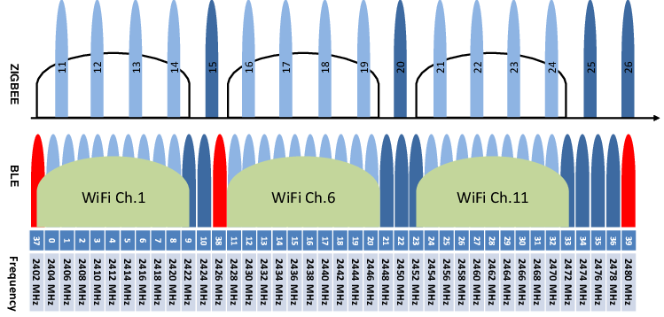
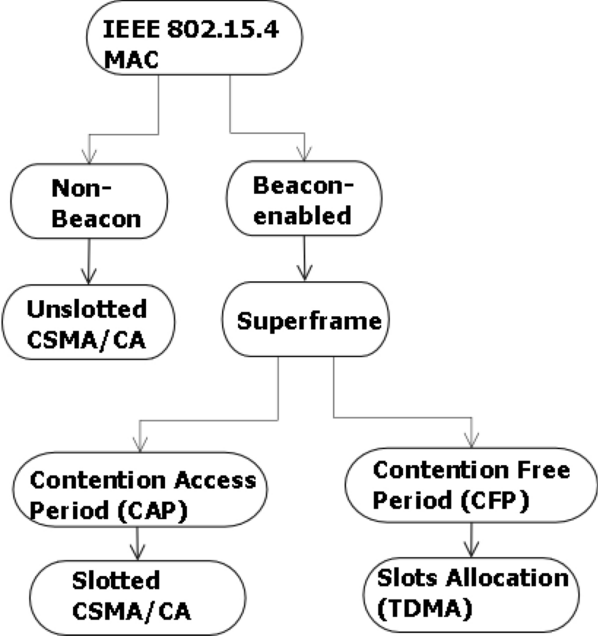

>[Torna a reti di sensori](sensornetworkshort.md#classificazione-delle-tecnologie-wsn-in-base-a-velocità-e-copertura)

Di seguito è riportata l'architettura generale di una rete Zigbee. Essa è composta, a **livello fisico**, essenzialmente di una **rete di accesso** ai sensori e da una **rete di distribuzione** che fa da collante di ciascuna rete di sensori.

La rete di sensori fisica è a stella dove il centro stella è il gateway. Un sensore può anche essere associato a più gateway ed inviare dati a tutti i gateway a cui esso è associato. I dati normalmente arrivano ad un certo dispositivo attraverso un solo gateway.

I gateway utilizzano la rete internet (o una LAN) per realizzare un collegamento diretto **virtuale** con il network server, per cui, in definitiva, la topologia risultante è, **fisicamente**, quella di più **reti di accesso** a stella tenute insieme da una **rete di distribuzione** qualsiasi purchè sia di tipo TCP/IP (LAN o Internet).

### **Gateway standardizzati** 

**Riassumendo**, alla **rete di distribuzione IP** si collegano, quindi, una o più **reti secondarie** che servono da **rete di accesso** per i dispositivi sensori o attuatori con **interfacce** spesso di tipo **non ethernet** che necessitano di un **gateway** di confine con possibili funzioni di:     
  - **Inoltro**, cioè smistamento dei messaggi da un tipo di rete all'altro di tipo L3 (**routing**) o di tipo L2 (**bridging**). L'inoltro del messaggio di un sensore può essere:
       - **diretto** nella rete di distribuzione tramite link fisico verso il dispositivo di smistamento pubblico (router o switch) più vicino.
       - **indiretto** tramite una dorsale virtuale, cioè un **tunnel**, verso il network server o verso un router di una WAN privata, realizzato, ad esempio, in maniera cifrata tramite un **client di VPN**, oppure in maniera non cifrata tramite un client di tunnel generico **GRE**.
  - **Traduzione di formato** dei messaggi da rete a bus a rete ethernet con eventuale realizzazione del **bridge** L4 tra il livello applicativo in uso nella rete di sensori e quello in uso nella rete di distribuzione.
  - **Interrogazione periodica** (polling) dei dispositivi nella rete di sensori (master di una architettura master/slave)
  - **Raccolta e memorizzazione** delle informazioni per essere trasferite in un **secondo momento** al server di gestione
  - **Protezione della rete di sensori**, cioè di firewall, soprattutto quando questa, tramite il gateway, si connette direttamente alla rete **Internet** mediante un **IP pubblico**.

L'albero degli **apparati attivi** di una rete di sensori + rete di distribuzione + server di gestione e controllo potrebbe apparire:

Il **bridge Wifi** (in realtà è un **gateway** e quindi pure un router) è normalmente anche il **coordinatore** della rete di sensori. 

Il **broker MQTT** può essere installato in cloud, in una Virtual Private network, oppure On Premise direttamente nel centro di getione e controllo. 

### **Rete di dispositivi WiFi** 

   

Una architettura di rete wireless WiFi è può essere realizzata in tre modalità:
- **Modalità Infrastruttura** di tipo master/slave
- **Modalità ad hoc** di tipo peer to peer 
- **Modalità Wifi Direct**  di tipo Punto – punto
  
Le architetture **più diffuse** in ambito aziendale sono di **tipo infrastruttura** e sono composte di un dispositivo master centrale detto **Access Point (AP)** posto in posizione **baricentrica** rispetto a più dispositivi slave della rete wireless detti **Client**.

Il dispositivo AP è assimilabile ad un **Hub** che realizza un BUS broadcast che collega tutti i device client. Il mezzo radio è di tipo broadcast half duplex in cui uno parla e tutti ascoltano. Per realizzare un canale percepito dalle stazioni client come full duplex l’accesso di queste necessita di essere arbitrato. L'**arbitraggio** può essere di tipo:
- **Peer to peer**: è la soluzione più comune, l’accesso al mezzo degli interlocutori è gestita in maniera autonoma da ciascuno di essi tramite un  meccanismo di ack realizzato dal protocollo 802.11 di tipo CSMA/CA.
- **Master/Slave**: è la soluzione realizzata sotto l’arbitraggio centralizzato del dispositivo AP, che assume il ruolo di **master**. L’AP assegna un tempo prestabilito a ciascuna comunicazione per parlare e lo comunica periodicamente a tutte le stazioni tramite opportune trame di segnalazione (**beacon**).

Una rete wifi è organizzata nelle zone di influenza di ciascun AP dette **cella**. A causa dell'**attenuazione** del segnale radio dovuta alla distanza o agli ostacoli un client raggiunge un AP solo fino ai confini della sua cella.
Il collegamento in **mobilità** di un client da una cella ad un’altra adiacente si chiama **roaming** e determina un passaggio della presa in carico di un utente da una cella a quella di transito vicina che viene detto in gergo **handover**. Un handover avviene generalmente, in maniera trasparente all’utente e **senza la cessazione** di eventuali connessioni in corso. 

Una organizzazione ottima della rete fa in modo di minimizzare la cosidetta **interferenza cocanale**. L’interferenza cocanale è il disturbo creato alle comunicazioni di un AP dalle comunicazioni di un altro AP che condivide la stessa frequenza. L’interferenza cocanale è minimizzata quando:
- Dispositivi adiacenti hanno frequenze molto diverse
- Frequenze uguali sono condivise da dispositivi molto lontani

Caratteristiche distintiva di questa tecnologia di rete di sensori  è la **topologia a maglia** che comporta che:
- qualunque dispositivo collegato **alla rete elettrica** diventa un **router**. Cioé, insieme ad un elettrodomestico (ad es. una lampadina) o ad una macchina industriale si compra pure un dispositivo di rete. Piú se ne mettono e piú la rete é estesa e affidabile.
- un **dispositivo di comand**o non deve spendere l'energia per arrivare al gateway o all'attuatore remoto, ma solamente quella necessaria a raggiungere il **primo router** (next hop), cioè il primo elettrodomestico domotizzato nelle vicinanze.

### **Tipologie di nodi** 

Le specifiche dello standard distinguono 3 tipi di dispositivi:
- Il **coordinatore**, che ha il compito di organizzare la rete e conservare le tabelle di routing. Svolge pure il ruolo di trust center e di archivio per le chiavi di sicurezza.
- I **router** (FFD o full function device), che possono parlare con tutti gli altri dispositivi
- I **dispositivi finali** (Reduced function devices o RFD), hanno funzionalità ridotte e possono parlare con in router e il coordinatore, ma non direttamente tra di loro. Non essendo router, non smistano mai i dati generati da altri. Possono restare inattivi per molto tempo, garantendo così una lunga durata della batteria

  
### **Consumo energetico** 

Bassissimo consumo dei **nodi di comando** dato che, per inviare un messaggio ad un nodo attuatore posto in un luogo remoto della rete, devono spendere sempre e soltanto l'energia necessaria a raggiungere il nodo router più vicino

Per minimizzare il consumo di potenza, e quindi massimizzare la durata delle batterie, i **dispositivi finali** passano la maggior parte del loro tempo “addormentati” (**sleep mode**), si svegliano soltanto quando hanno bisogno di comunicare, e poi si riaddormentano immediatamente.

Lo **standard** prevede invece che i **router** ed il **coordinatore** siano collegati alla rete elettrica e siano **sempre attivi**. Non hanno quindi dei vincoli sul consumo di potenza

### **Potenza e banda di trasmissione**

La potenza in trasmissione usata nella banda a 2.4GHz è compresa tra -3dBm e 10dBm con valore tipico 0dBm
Nella banda 915MHz il limite massimo è di 1000 mW (30dBm). Tuttavia, i terminali costruiti secondo la tecnologia “system-onchip” limitano la potenza intorno ai 10dBm.
Nella banda 868MHz il limite massimo è di circa 14dBm (25mW). La potenza minima deve essere almeno di -3dBm

In generale, la **banda di frequenza** usuale di Zigbee è 2,4 GHz. La specifica Zigbee definisce l'utilizzo di diverse tecniche di modulazione, tra cui Frequency-Hopping Spread Spectrum (FHSS) e Direct Sequence Spread Spectrum (DSSS):
- **FHSS**: Con FHSS, il segnale radio cambia frequenza in modo sincronizzato tra il trasmettitore e il ricevitore su una serie di frequenze specifiche all'interno della banda ISM. Questo aiuta a ridurre le interferenze e a migliorare la sicurezza della trasmissione. [Link FHSS](accessoradio.md#fhss)
- **DSSS**: DSSS, d'altra parte, suddivide i dati in segnali più piccoli, noti come chip, e li trasmette su una larghezza di banda molto più ampia rispetto al segnale originale. Questo aumenta la resistenza alle interferenze e migliora la qualità della trasmissione. [Link DSSS](accessoradio.md#dsss)

L'utilizzo del **FHSS**, in particolare, permette la selezione automatica dei canali in maniera da facilitare la **coesistenza** con un wifi domestico selezionando i salti di frequenza a ridosso degli avvallamenti sempre presenti tra un canale wifi e l'altro.

Zigbee utilizza 16 canali (da 11 a 26) nella banda 2,4 GHz in tutto il mondo, 13 canali nella banda 915 MHz in Nord America, e un unico canale nella banda 868 MHz in Europa. Alcuni dispositivi utilizzano anche la banda 784 MHz in Cina per Zigbee.

Attraverso questi canali, ogni dispositivo Zigbee utilizza una larghezza di banda fino a 2 MHz mentre due canali diversi sono separati da una banda di guardia di 5 MHz per prevenire interferenze dovute ad altri dispositivi Zigbee. La velocità dati che può essere raggiunta nella banda da 2,4 GHz è di 250 Kbps per canale, 40 Kbps per canale nella banda 915 MHz e 20 Kbps per canale nella banda 868 MHz. Tuttavia, il throughput effettivo che può essere fornito è inevitabilmente inferiore ai valori specificati, a causa di vari fattori come il sovraccarico dei pacchetti, i ritardi di elaborazione e la latenza del canale. Le radio Zigbee generalmente forniscono una potenza di uscita di 1-100 mW su queste bande di frequenza.

### **Protocolli di accesso al canale**

La situazione può essere riassunta nel seguente modo:

La **superframe** è una trama composta di **16 slot** temporali di uguale larghezza all'interno dei quali inviare i dati di una o più **applicazioni**. E' delimitata da una **coppia di beacons** e viene spedita dal **coordinatore**. 

I **beacons** sono usati per:  
 - sincronizzare i dispositivi
 - identificare il PAN coordinator
 - descrivere la struttura della superframe.
   
Il **PAN coordinator** può dedicare porzioni della superframe ad applicazioni a **bassa latenza** quali quelle multimediali. Queste porzioni sono chiamate garanteed time slot (**GTS**) e sono regolate in maniera deterministica frazie alla multiplazione statica TDM.

Il PAN coordinator può allocare fino 7 di questi GTS per una singola applicazione, ognuno dei quali può occupare più di un periodo di slot. Ad ogni dispositivo che sta trasmettendo in un GTS viene assicurato che la sua operazione venga completata prima dell’inizio del successivo GTS.

Tutte le transazioni basate su contesa saranno completate prima dell’inizio del CFP.

### **Slotted CSMA** 

Lo **slotted CSMA** (Carrier Sense Multiple Access) è un protocollo di accesso al canale utilizzato come via di mezzo tra il GTS e il CSMA/CA. E' comunque un protocollo a contesa probabilistico e funziona seguendo questi passaggi:

- **Divisione del tempo in slot**: Il tempo viene diviso in intervalli di tempo fissi, chiamati slot temporali. Ogni slot ha una durata predefinita e tutti i dispositivi nella rete sono sincronizzati su questi slot.
- **Ascolto del canale** (Carrier Sense): Prima di trasmettere dati, un dispositivo controlla se il canale è occupato o libero ascoltando il mezzo trasmissivo. 
- **Accesso al canale slotted**: Quando un dispositivo decide di trasmettere, aspetta fino all'inizio del prossimo slot temporale disponibile per inviare i dati. Questo significa che tutte le trasmissioni avvengono in momenti ben definiti, consentendo una gestione più ordinata del traffico.
- **Evitamento delle collisioni**: Il rilevamento del canale e l'accesso al canale slotted aiutano a evitare collisioni durante la trasmissione dei dati. Se più dispositivi tentano di trasmettere nello stesso slot, solo uno di essi avrà successo, mentre gli altri rileveranno la presenza di un segnale e ritenteranno la trasmissione in un momento successivo.

In genere, per reti a stella, il CSMA/CA senza slot è migliore del CSMA/CA con slot in termini di probabilità di successo del pacchetto, consumo di energia e ritardo. Mentre CSMA/CA con slot è migliore di CSMA/CA senza slot in termini di throughput, cioè capacità complessiva di traffico.

### **Tipologie di servizio** 

Molti sistemi (wifi, zigbee, bluetooth BLE, LoRaWan, Sigfox) permettono di impostare **contemporaneamente**, sulla **stessa interfaccia** radio, un **servizio sincrono** mediante **TDMA** per le sorgenti che eseguono il **polling** di sensori e un **servizio asincrono** con **ALOHA** o **CSMA/CA** per le sorgenti che devono inoltrare il **comando** di un pulsante di accensione di un attuatore. Ciò è ottenuto **attivando** sul canale la funzionalità **beacon** con le cosiddette **superframe**.

Le **tipologie di servizio** supportate da Zigbee sono:
- **Dati periodici**. Si utilizza tipicamente con sorgenti con rate definito che siano anche sincrone, cioè trasmesse regolarmente ad intervalli prestabiliti. Si utilizza una modalità di accesso senza contesa di tipo **TDM** basata sulle superframe delimitate da beacon.  Ad esempio, sensori ambientali potrebbero inviare dati di temperatura ogni minuto o ogni ora in modo periodico.
- **Dati intermittenti**. Si riferisce a dati trasmessi occasionalmente o in risposta a specifici eventi. Ad esempio, un sensore di movimento potrebbe inviare dati solo quando rileva un movimento, che può essere sporadico. La modalità di accesso al canale è a contesa basata su **CSMA/CA**. 
- **Dati ripetitivi a bassa latenza**. Questo tipo di messaggi potrebbe essere efficacemente supportato durante gli slot CAP (Contend Access period) delle superframe mediante un accesso multiplo CSMA/CA slottato.

### **Abilitazione ai beacon**

Nelle reti **abilitate ai beacon**, i router Zigbee trasmettono beacon periodici per confermare la loro presenza ad altri nodi di rete. I nodi possono rimanere inattivi in stato di sleep tra un beacon e l'altro, prolungando così la durata della batteria. Gli intervalli dei beacon dipendono dalla velocità dei dati; possono variare da 15,36 millisecondi a 251,65824 secondi a 250 kbit/s, da 24 millisecondi a 393,216 secondi a 40 kbit/s e da 48 millisecondi a 786,432 secondi a 20 kbit/s. Intervalli di segnale lunghi richiedono tempistiche precise, che possono essere costose da implementare in prodotti a basso costo.

I link radio nel **modo non abilitato al beacon** sono regolati dal CSMA/CA e, i nodi della rete con funzioni di smistamento (router), non essendo sincronizzati a ricevere su istanti prefissati, devono rimanere costantemente accesi e quindi alimentati.

Nel caso delle reti in **beacon mode**, i **link** sono regolati in maniera probabilistica con lo slotted CSMA/CA oppure in maniera deterministica con il GTS. I **router** possono beneficiare dei lunghi periodi di inattività tra due beacon per risparmiare energia massimizzando la durata di una eventuale alimentazione a batteria. Questa modalità di risparmio energetico è nota come "duty cycling" o "sleeping router". 

In generale, i protocolli Zigbee riducono al minimo il tempo di accensione della radio, così da ridurre il consumo energetico. Nelle reti di beacon, i nodi devono essere attivi solo durante la trasmissione di un beacon. Nelle reti non abilitate ai beacon, il consumo energetico è decisamente asimmetrico: alcuni dispositivi sono **sempre attivi** (generalmente i router) mentre altri passano la maggior parte del tempo a dormire (i nodi terminali RFD).

### **Messaggi confermati**

La conferma dei messaggi è prevista per sia per messaggi in **uplink** che in **downlink**+funzioni di **comando** o **configurazione**, ad esempio pulsanti, rilevatori di transito, allarmi in cui l'invio del messaggiò avviene una tantum in maniera del tutto asincrona (cioè non prevedibile dal ricevitore) potrebbe essere auspicabile, invece, un feedback del protocollo mediante un meccanismo di conferma basato sui messaggi di **ack**.

La **conferma** potrebbe pure essere gestita soltanto dal **livello applicativo** (non dal protocollo Zigbee). Sovente, nella rete di distribuzione IP è presente un server col ruolo di **broker MQTT** a cui sono associati:
- su un **topic di comando** (verso il dispositivo terminale):
    - il dispositivo **sensore** è registrato sul broker col ruolo di **publisher** perchè vuole usare questo canale di output per **inviare il comando** verso l'attuatore 
    - il dispositivo **attuatore** è registrato sul broker con il ruolo di **subscriber** perchè è interessato a ricevere, su un canale di input, eventuali comandi di attuazione (motori, cancelli). 
-  su un **topic di feedback** (dal dispositivo terminale, verso il broker):
    - il dispositivo **attuatore** è registrato sul broker con il ruolo di **publisher** perchè intende adoperare questo canale di output per **inviare il feedback** con il proprio stato ad un **display** associato al sensore di comando.
    - il dispositivo **sensore** è registrato sul broker con il ruolo di **subscriber** perchè è interessato a ricevere, su un canale di input, eventuali **feedback** sullo stato dell'attuatore per **mostrarli** all'utente. In questo caso è demandato all'utente, e non al protocollo, **decidere** se e quante volte ripetere il comando, nel caso che lo stato del dispositivo non sia ancora quello voluto.

**Sitografia**:

>[Torna a reti di sensori](sensornetworkshort.md#classificazione-delle-tecnologie-wsn-in-base-a-velocità-e-copertura)
