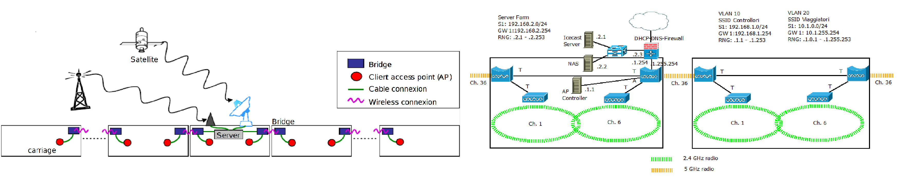
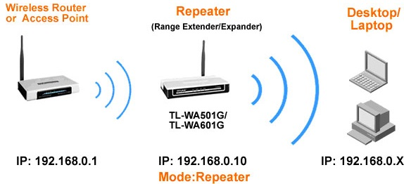
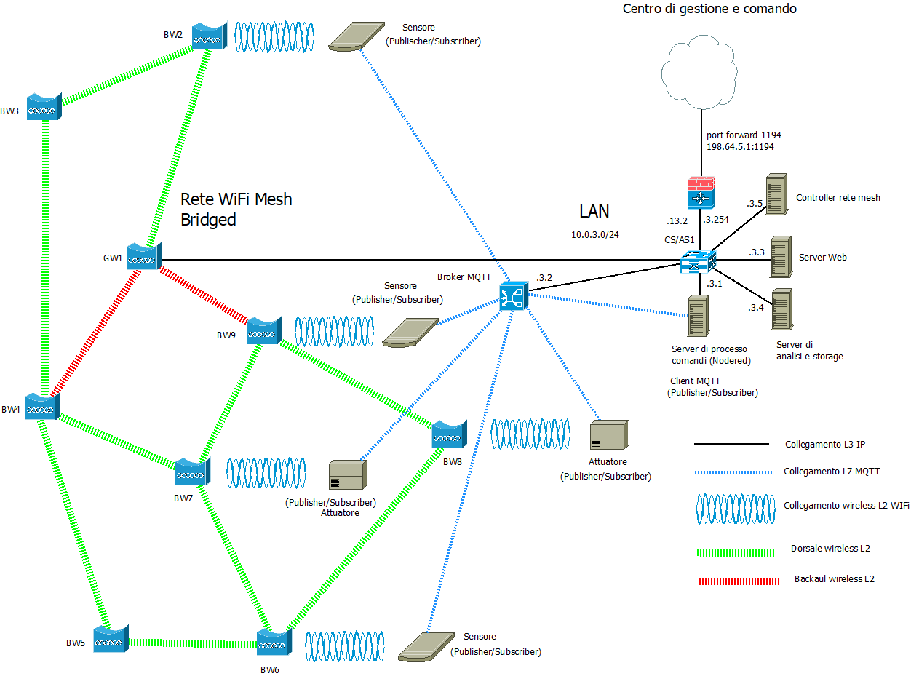
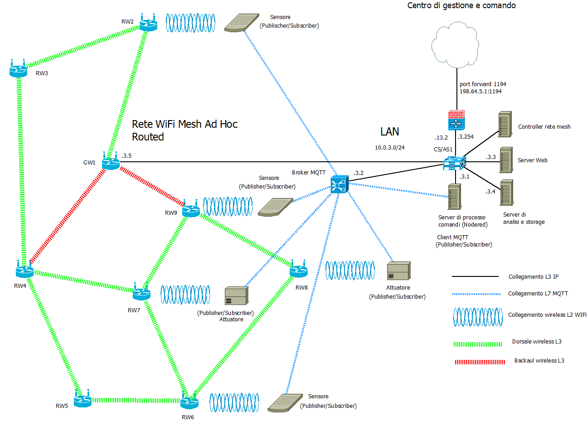

>[Torna a reti di sensori](sensornetworkshort.md#classificazione-delle-tecnologie-wsn-in-base-a-velocità-e-copertura)

### **Caso d'uso wiFi infrastruttura** 

Date le particolarità della tecnologia, i casi d'uso per la rete di sensori WiFi di **tipo infrastruttura** sono quelli tipici applicazioni **IoT indoor** a **medio raggio**, dove concorre con altre tecnologie di rete: Zigbee, BLE e, sotto certe condizioni, LoRaWAN. **Caratteristiche** della rete WiFi di **tipo infrastruttura** sono essenzialmente:
- possibilità di realizzare **comandi** a distanza wireless anche relativamente piccoli con una **durata** delle batterie relativamente lunga (dell'ordine dei mesi).
- possibilità di realizzare **sensori** ambientali molto piccoli e alimentati con batterie che possono essere sostituite dopo mesi.
- **assenza di gateway** verso la rete LAN, essendo essi stessi collegati a questa.
- architettura ad **hop singolo** del collegamento verso la stazione radio base costituita, in questo caso, da un **AP WiFi** che deve essere in posizione **baricentrica** rispetto ai dispositivi ad esso collegati. Il **consumo** dei dispositivi è tanto minore quanto e breve la distanza degli AP.
- **rete di sensori** composta **dagli AP** della stessa rete wireless LAN utilizzata per i **dati**. Gli unici dispositivi capaci di inoltro dei dati sono gli stessi della LAN (switch, router, bridge wifi).
- utilizzo di una rete **non ottimizzata** per la sensoristica ma pensata più per le prestazioni in bit rate elevate che per i bassi consumi. Consumi limitati si ottengono attivando funzioni di **deep sleep** di processore e radio tra un turno di misura dei sensori e il successivo.
- rete di sensori che ha la stessa **affidabilità** della rete wifi.


### **Architettura di una rete di reti** 

Di seguito è riportata l'architettura generale di una **rete di reti** di sensori. Essa è composta, a **livello fisico**, essenzialmente di una **rete di accesso** ai sensori e da una **rete di distribuzione** che fa da collante di ciascuna rete di sensori.


I **gateway** utilizzano la **rete internet** e/o una **LAN** per realizzare un collegamento verso il **broker MQTT**, per cui, in definitiva, la topologia risultante è, **fisicamente**, quella di più **reti di accesso** con tecnologia e topologia differente (a maglia nel caso di zigbee) tenute insieme da una **rete di distribuzione** qualsiasi purchè sia di tipo TCP/IP (LAN o Internet).

Avere a disposizione una **rete di distribuzione IP** per i comandi e le letture è utile perchè permette di creare interfacce web o applicazioni per smartphone o tablet per:
- eseguire, in un'unica interfaccia (form), comandi verso attuatori posti su reti con tecnologia differente.
- riassumere in un'unica interfaccia (report) letture di sensori provenienti da reti eterogenee per tecnologia e topologia

Il **broker MQTT** è solo una delle tante soluzioni possibili per:
- inoltro dei comandi da un **sensore di comando** su una rete di tipo A (ad es. LoRaWAN) ad un attuatore su una rete diversa di tipo B (ad es. Zigbee)
- inoltro di una **misura** da un **sensore ambientale** su una rete di tipo A (ad es. LoRaWAN) ad un **pannello di controllo** su una rete diversa di tipo B (tipicamente IP)
- inoltro di una **misura** da un **sensore ambientale** su una rete di tipo A (ad es. LoRaWAN) ad un **server di gestione** su una rete diversa di tipo B (tipicamente IP) per:
-  elaborazioni a **breve termine** quali la generazione di **statistiche** per la determinazione di **soglie** o **predizioni** per:
    - realizzazione da remoto della **logica di comando** (processo dei comandi) degli **attuatori**
    - **report** per l'assistenza alle decisioni
    - generazioni di **allarmi**
    - realizzazione di **ottimizzazioni** della gestione o del consumo di risorse, energia o materie prime
    - contabilizzazione dei consumi (**smart metering**)
    - controllo e sorveglianza in tempo reale dello **stato** di impianti o macchinari
    - segnalazione dei **guasti** o loro **analisi predittiva** prima che accadano
    - **consapevolezza situazionale** di ambienti remoti, difficili, pericolosi o ostili (https://it.wikipedia.org/wiki/Situational_awareness)
-  elaborazioni a **lungo termine** quali:
    - analisi dei dati per la realizzazione di studi scientifici
    - elaborazione di nuovi modelli statistici o fisici o biologici dell'ambiente misurato

Il **vantaggio** del **broker MQTT** è quello di poter gestire in modo semplice e **standardizzato** lo **smistamento** (inoltro) delle **misure** e dei **comandi** tra i vari portatori di interesse (stakeholder) di un **cluster** di reti di sensori, siano essi utenti umani, interfacce grafiche, server applicativi diversi o altri dispositivi IoT.

Esistono molte altre soluzioni che magari sono più semplici e graficamente accattivanti ma che passano per portali proprietari o per servizi cloud a pagamento e nulla aggiungono di didatticamente rilevante ai nostri discorsi.

### **Gateway standardizzati** 

**Riassumendo**, alla **rete di distribuzione IP** si collegano, quindi, una o più **reti secondarie** che servono da **rete di accesso** per i dispositivi sensori o attuatori con **interfacce** spesso di tipo **non ethernet** che necessitano di un **gateway** di confine con possibili funzioni di:     
  - **Inoltro**, cioè smistamento dei messaggi da un tipo di rete all'altro di tipo L3 (**routing**) o di tipo L2 (**bridging**). L'inoltro del messaggio di un sensore può essere:
       - **diretto** nella rete di distribuzione tramite link fisico verso il dispositivo di smistamento (router o switch) più vicino.
           - Nel caso di una LAN il gateway possiede un indirizzo IP privato.
           - Nel caso di una WAN il gateway possiede un indirizzo IP pubblico.
       - **indiretto** tramite una dorsale virtuale, cioè un **tunnel**, verso il network server o verso un router di una WAN privata, realizzato, ad esempio, in maniera cifrata tramite un **client di VPN**, oppure in maniera non cifrata tramite un client di tunnel generico **GRE**. In questo caso il gateway possiede un indirizzo IP pubblico nell'interfaccia in Internet ma anche un IP privato nell'interfaccia sul tunnel cifrato. Il tunnel cifrato, per VPN L3, è gestito con una subnet IP separata per ogni tunnel.
  - **Traduzione di formato** dei messaggi da rete a bus a rete ethernet con eventuale realizzazione del **bridge** L4 tra il livello applicativo in uso nella rete di sensori e quello in uso nella rete di distribuzione.
  - **Interrogazione periodica** (polling) dei dispositivi nella rete di sensori (master di una architettura master/slave)
  - **Raccolta e memorizzazione** delle informazioni per essere trasferite in un **secondo momento** al server di gestione
  - **Protezione della rete di sensori**, cioè di firewall, soprattutto quando questa, tramite il gateway, si connette direttamente alla rete **Internet** mediante un **IP pubblico**.


L'albero degli **apparati attivi** di una rete di sensori + rete di distribuzione + server di gestione e controllo potrebbe apparire:


Il **bridge Wifi** (in realtà è un **gateway** e quindi pure un router) è normalmente anche il **coordinatore** della rete di sensori. 

Il **broker MQTT** può essere installato in cloud, in una Virtual Private network, oppure On Premise direttamente nel centro di gestione e controllo. 

## **Rete di dispositivi WiFi** 

Una architettura di rete wireless WiFi è può essere realizzata in tre modalità:
- **Modalità Infrastruttura** di tipo master/slave
- **Modalità ad hoc** di tipo peer to peer 
- **Modalità Wifi Direct**  di tipo Punto – punto

### **Rete in modo infrastruttura** 

Le architetture **più diffuse** in ambito aziendale ed **indoor** sono di **tipo infrastruttura** e sono composte di un dispositivo master centrale detto **Access Point (AP)** posto in posizione **baricentrica** rispetto a più dispositivi slave della rete wireless detti **Client**. 

Gli **elementi** di una rete in modo infrastruttura sono:
- gli **AP (Access Point)**, sono dei dispositivi di **aggregazione** dei client della rete LAN (PC, dispositivi IoT, smartphone, tablet, ecc.) che, attraverso gli AP, ottengono un accesso alla rete LAN aziendale. In modo infrastruttura, gli AP sono in realtà assimilabili a 2 dispositivi distinti:
    - un **HUB wireless** che realizza un **mezzo broadcast** (multipunto) dove i client accedono mediante il protocllo **CSMA/CA** e sue ottimizzazioni per il WiFi (vedi [CSMA/CA](protocollidiaccesso.md#csmaca) per dettagli)
    - un **bridge** tra l'hub wireless e una LAN cablata. Un **bridge** è uno dispositivo di **commutazione** simile ad uno **switch** ma realizzato in **SW**, che **inoltra**, a livello L2, trame MAC dall'HUB alla LAN cablata e viceversa. Questi bridge, per ogni AP, possono essere più di uno e, in questo caso, sono tanti quante le **interfacce logiche** dell'AP e mappano ogni intefaccia su una **VLAN diversa**.
- un **controller** degli AP. E' un **server** che si occupa della creazione e gestione dei bridge nei vari AP, della impostazione centralizzata di interfacce logiche e parametri radio, della assegnazione centralizzata degli indirizzi IP, dell'assegnazione automatica dei canali in modo da minimizzare le interferenze reciproche tra gli AP, dell'aggiornamento centralizzato dei FW dei vari AP, della gestione dei protocolli di autenticazione, delle funzioni di logging, delle funzioni di firewall, della creazione di hotspot, ecc..


### **Access point**

Il dispositivo AP è assimilabile ad un **Hub** che realizza un BUS broadcast che collega tutti i device client. Il mezzo radio è di tipo broadcast half duplex in cui uno parla e tutti ascoltano. Per realizzare un canale percepito dalle stazioni client come full duplex l’accesso di queste necessita di essere arbitrato. L'**arbitraggio** può essere di tipo:
- **Peer to peer**: è la soluzione più comune, l’accesso al mezzo degli interlocutori è gestita in maniera autonoma da ciascuno di essi tramite un  meccanismo di ack realizzato dal protocollo 802.11 di tipo CSMA/CA.
- **Master/Slave**: è la soluzione realizzata sotto l’arbitraggio centralizzato del dispositivo AP, che assume il ruolo di **master**. L’AP assegna un tempo prestabilito a ciascuna comunicazione per parlare e lo comunica periodicamente a tutte le stazioni tramite opportune trame di segnalazione (**beacon**). E' la modalità CFP (Contention Free Period) cioè, **senza collisioni**.

Per dettagli sulle tecniche di accesso al BUS in generale e per quelle utizzate dal WiFi in particolare vedi [Dettaglio mezzi a BUS](protocollidiaccesso.md)

La **disposizione** fisica degli AP dovrebbe essere il più possibile **uniforme** all'interno dell'area di copertura del servizio di connessione wireless e in **posizione baricentrica** rispetto ai potenziali utilizzattori, almeno per quanto è reso possibile da **vincoli** insormontabili di altra natura. 

Per quanto riguarda il loro **collegamento** ai **dispositivi attivi** della rete **LAN cablata**, si potrebbero individuare alcune **possibilità**:
- il collegamento sulle porte di uno **switch di accesso** (AS) condiviso con i dispositivi fissi, che oltre ad aggregare le prese aggreghi gli AP. Soluzione per pochi AP con traffico limitato.
- il collegamento sulle porte di uno **switch di distribuzione** (DS) condiviso con le dorsali di piano che, oltre a diramare dorsali ad alta densità di traffico verso gli AS, dedicano anche dorsali ad alta capacità verso ogni singolo AP. Soluzione dimensionalmente adeguata tenedo conto del thoughput superiore al Gbit/sec  degli AP più recenti che permettono sia collegamenti ad **alte prestazioni** (200-300 Mbps/sec) che l'aggregazione di un **elevato numero** di client (superiore a 100). Soluzione desiderabile per grandi ambienti che basano i loro servizi su Internet quali alberghi, scuole, campus universitari, ecc.
- l'utilizzo, per entrambe le soluzioni precedenti, di **SW dedicati** solo per gli AP, soluzione che permette di dedicare una **dorsale dedicata**  (di piano o di campus) a ciascun **gruppo di AP**. Soluzione auspicabile per **servizi avanzati** ad alta **densità** di utenze (come luoghi pubblici) e alta **intensità** di traffico (come servizi multimediali avanzati).

### **Struttura cellulare**

Una rete wifi è organizzata nelle zone di influenza di ciascun AP dette **cella**. A causa dell'**attenuazione** del segnale radio dovuta alla distanza o agli ostacoli un client raggiunge un AP solo fino ai confini della sua cella.
Il collegamento in **mobilità** di un client da una cella ad un’altra adiacente si chiama **roaming** e determina un passaggio della presa in carico di un utente da una cella a quella di transito vicina che viene detto in gergo **handover**. Un handover avviene generalmente, in maniera trasparente all’utente e **senza la cessazione** di eventuali connessioni in corso. 


Una organizzazione ottima della rete fa in modo di minimizzare la cosidetta **interferenza cocanale**. L’interferenza cocanale è il disturbo creato alle comunicazioni di un AP dalle comunicazioni di un altro AP che condivide la stessa frequenza. L’interferenza cocanale è minimizzata quando:
- Dispositivi adiacenti hanno frequenze molto diverse
- Frequenze uguali sono condivise da dispositivi molto lontani

La divisione in celle è una forma di **SDM** (Space Division Multiplation), infatti celle di uno stesso colore possono trasmettere senza interferirsi nella stessa frequenza e nello stesso istante purchè siano in posizioni differenti. 
Per dettagli vedi [multiplazioni statiche](multiplazioni.md)

### **Allocazione dei canali alle celle**


### **Allocazione canali a 2.4 GHz**

A 2.4GHz il WiFi adopera 11 canali FDM con sovrapposizione parziale dei vari canali. Solo tre canali di volta in volta non si sovrappongono.
Una disposizione di celle adiacenti ottima dovrebbe utilizzare possibilmente solo tre canali non sovrapposti per minimizzare l’interferenza cocanale.


Le possibilità sono: 1-6-11, 2-7-12, 3-8-13, 4-9, 5-10 ma rimangono solo 1-6-11 , 5-10 perché le frequenze 12, 13 e 14 non sono autorizzate in Europa (alcuni device supportano il canale 12).
quindi si hanno **più frequenze** solo usando la combinazione **1-6-11**

### **Allocazione canali a 5 GHz**

In questa banda è disponibile uno spettro significativamente più ampio ed anche possibile impostare la larghezza del canale. Cciascun canale occupa la propria sezione a 20 MHz senza sovrapposizioni con altri canali. 


802.11n fornisce la possibilità di utilizzare i canali a 40 MHz, 802.11ac consente canali larghi 80MHz e persino 160MHz. Maggiore ampiezza del canale consente, in teoria, bitrate notevolmente maggiori.
Questi canali più ampi vengono creati collegando insieme i canali a 20 MHz. Raddoppiare l’ampiezza dei canali ha però l’inconveniente di raddoppiare la quantità di rumore e di ridurre le combinazioni di canali che non si sovrappongono, entrambe le circostanze possono di fatto ridurre la bitrate.


### **Pattern di riuso a confronto**


### **Beacon**

I beacon sono delle **sequenze di sincronizzazione** (dette preambolo) in grado sia di sincronizzare gli **orologi** dei dispositivi (Tx e Rx) che si accingono ad iniziare una comunicazione, ma anche di **indentificare** in maniera univoca i dispositivi che li emettono. Per dei dettagli vedi [preambolo di sincronizzazione](protocolli.md#preambolo-di-sincronizzazione).

La trama dati compresa tra **due beacon** consecutivi viene detta **supertrama** (superframe) ed è generalmente divisa in due zone con **politiche di accesso** al canale diverse:  
- una **deterministica** al riparo dalle collisioni detta **CFP** (Contention Free Period) e regolata dalla multiplazione statica TDMA, che viene usata per trasmettere i dati delle comunicazioni **unicast**.
- una **probabilistica** a contesa, in cui i tentativi di accesso dei dispositivi sono soggetti al **rischio di collisione** perchè regolata da un protocollo di tipo **CSMA/CA**, che invece serve per trasmettere delle particolari informazioni **broadcast** dette **advertisement**.

Nel contesto di WiFi, un **Access Point (AP)** può assumere un ruolo di **coordinamento**, detto PCF, gestendo l'accesso al canale in modo master/slave in cui il centrale ha il ruolo di **master** che stabilisce **quale** stazione deve parlare, **quando** e **per quanto** tempo usando una politica di **turnazione** delle stazioni (**polling**).
  
Nel caso del WiFi, il **NAV CFP** (Contention Free Period) è un meccanismo che inibisce tutte le stazioni dal prendere l'**iniziativa di cominciare** una trasmissione. Finchè è valido le stazioni comunicheranno in modalità **master/slave**, cioè **risponderanno** solo **se interrogate**.


Fig 20

**Durante il CFP**, il PC invia messaggi di Polling a rotazione verso le stazioni, interrogandole a riguardo della **disponibilità** di dati da trasmettere. Questà modalità offre il vantaggio di adattarsi meglio alle **sorgenti** dati di tipo **real time** caratterizzate da trasmissioni di tipo **sincrono**. Sorgenti sincrone tipicamente sono: **sensori**, telefonia **VOIP**, **videoconferenza**, **streaming**, ecc.


Fig 21

**Riassumendo**, Normalmente i dispositivi AP lavorano in **modalità ibrida** DCF e PCF. Vengono trasmessi periodicamente dei beacon e l'intervallo temporale tra un beacon e l'altro viene suddiviso in **due zone**, una soggetta a trasmissioni di tipo **PCF** e quindi **intrinsecamente** al riparo dalle collisioni adatta a trasmissioni **sincrone** e un'altra di tipo **DCF**, soggetta a collisioni sugli RTS, dedicata alle trasmissioni **asincrone**.


## **Messaggi MQTT**

### **Messaggi confermati**

La **conferma** dei messaggi inviati da parte del ricevente normalmente non è necessaria nel caso dei **sensori**. Infatti, se un invio da parte di un sensore non andasse a buon fine, è inutile richiedere la ritrasmissione di un dato che comunque a breve arriva con una misura più aggiornata. 

La conferma, invece, è prevista per funzioni di **comando** o **configurazione**.  Ad esempio  nel caso di pulsanti, rilevatori di transito o allarmi in cui l'invio del messaggiò avviene sporadicamente e in maniera del tutto **asincrona** (cioè non prevedibile dal ricevitore), potrebbe essere auspicabile avere un feedback da parte del protocollo mediante un meccanismo di conferma basato su **ack**. Ma non sempre ciò è possibile.

La **conferma**, però, potrebbe pure essere gestita soltanto dal **livello applicativo** (non dal protocollo) utilizzando un **topic di feeedback** (o stato) per inviare il valore dello stato corrente subito dopo che questo viene interessato da un comando in ingresso sul dispositivo. 

### **Definizione di topic e payload**

Sovente, nella rete di distribuzione IP è presente un server col ruolo di **broker MQTT** a cui sono associati:
- su un **topic di misura o attuazione (comando)**:
    - il dispositivo **sensore** è registrato sul broker col ruolo di **publisher** perchè vuole usare questo canale di output per **inviare il comando** verso l'attuatore 
    - il dispositivo **attuatore** è registrato sul broker con il ruolo di **subscriber** perchè è interessato a ricevere, su un canale di input, eventuali comandi di attuazione (motori, cancelli). 
-  su un **topic di feedback (stato)** (dal dispositivo terminale, verso il broker), utile al server applicativo per ricevere la conferma dell'avvenuto cambio di stato dell'attuatore ma anche utile all'utente per conoscere il nuovo stato:
    - il dispositivo **attuatore** è registrato sul broker con il ruolo di **publisher** perchè intende adoperare questo canale di output per **inviare il feedback** con il proprio stato ad un **display** associato al sensore di comando.
    - il dispositivo **sensore**, ma meglio dire il dispositivo **display** associato al dispositivo sensore (un led o uno schermo), è registrato sul broker con il ruolo di **subscriber** perchè è interessato a ricevere, su un canale di input, eventuali  **feedback** sullo stato dell'attuatore per **mostrarli** all'utente. In questo caso è demandato all'utente, e non al protocollo, **decidere** se e quante volte ripetere il comando, nel caso che lo stato del dispositivo non sia ancora quello voluto.
-  su un **topic di configurazione** dove può pubblicare solamente il server applicativo mentre tutti gli altri dispositivi IoT sono dei subscriber:
    - sia i dispositivi **sensori** che i dispositivi **attuatori** si registrano sul broker con il ruolo di **subscriber** perchè intendono adoperare questo canale di **input** per ricevere **comandi di configurazione** quali, per esempio, attivazione/disattivazione, frequenza di una misura, durata dello stand by, aggiornamenti del firmware via wirelesss (modo OTA), ecc.
    - il **server applicativo** è responsabile della definizione delle impostazioni di configurazione e decide **quali** mandare e a **chi**.

**In realtà**, il topic di configurazione, pur essendo teoricamente appropriato, potrebbe anche essere incorporato nel topic di comando, magari prevedendo un livello più alto di autorizzazione rispetto ai comandi relativi alle funzioni ordinarie.

Il **canale applicativo** su cui vengono inviati i messaggi sono quindi i **topic**. Su un certo **topic** il dispositivo con il ruolo di **output** agisce come un **publisher**, mentre quello con il ruolo di **input** agisce come un **subscriber**.

l'**ID MQTT** è un identificativo che permette di individuare un dispositivo ma non è un indirizzo di livello 3, non individua la macchina host in base al suo IP, piuttosto è un indirizzo di livello applicativo noto solo ad un server centrale, cioè il broker. Un dispositivo IoT non è tenuto a conoscere l'IP di tutti gli altri dispositivi ma solamente quello del broker. Il broker soltanto sa gli indirizzi di tutti i dispositivi, conoscenza che acquisisce durante la fase di **connessione** di un client al broker, momento in cui avviene anche il recupero del'**socket remoto** del client.

Il **broker**, dal canto suo, **associa** ogni **topic** con tutti gli **ID** che sono registrati presso di esso come **subscriber**. Questa associazione è utilizzata per smistare tutti i messaggi che arrivano con un certo topic verso tutti gli ID che ad esso sono associati. Il topic diventa così un **indirizzo di gruppo**. La particolarità di questo indirizzo è che è **gerarchico** secondo una struttura ad **albero**, cioè gruppi di dispositivi possono essere suddivisi in **sottogruppi** più piccoli estendendo il nome del path con un **ulteriore prefisso**, diverso per ciascun sottogruppo. L'operazione può essere ripetuta ulteriormente in maniera **ricorsiva**.

**Ad esempio**, posso individuare le lampade della casa con il path ```luci``` e accenderle e spegnerle tutte insieme, ma posso sezionarle ulteriormente con il path ```luci/soggiorno``` con il quale accendere o spegnere solo quelle del soggiorno oppure con il path ```luci/soggiorno/piantane``` con il quale fare la stessa cosa ma solo con le piantane del soggiorno.

### **Gestione dei topic di comando**

Potremmo a questo punto inserire il comando delle luci nel topic più generale delle misure ed attuazioni che chiameremo ```comandi``` e registrare i pulsanti del soggiorno al topic ```luci/soggiorno/comandi``` come pubblisher, mentre potremmo registrare le attuazioni delle lampade allo stesso topic come subscriber. Il comando potrebbe essere il JSON  ```{"toggle":"true"}```, per cui alla fine tutto intero il path diventerebbe ```luci/soggiorno/comandi/{"toggle":"true"}```. Se volessimo selezionare un solo dispositivo sono possibili due strade alternative:
- inserire il **prefisso mqtt** del dispositivo direttamente **nel path** ```luci/soggiorno/comandi/mydevice1-98F4ABF298AD/{"toggle":"true"}```
- inserire un **id** del dispositivo **nel JSON** ```luci/soggiorno/comandi/{"deviceid":"01", "toggle":"true"}```, dove con ```01``` ci indica un indirizzo univoco solamente all'interno del sottogruppo ```luci/soggiorno```. Con questa soluzione il dispositivo deve saper gestire un secondo livello di indirizzi indipendente dal meccanismo del path dei topic.

### **Gestione dei topic di stato**

Questo canale viene utilizzato per inviare lo **stato** di un dispositivo a tutti coloro che ne sono interessati. L'interesse potrebbe nascere per più motivi:
- **Conferma** dell'avvenuta **attuazione**. Alla **ricezione** di un comando (ad esempio "on":"true"), l'**attuatore** potrebbe essere tenuto a **notificare** (in modalità PUSH), al **display** associato al sensore (o al **server di processo**) trasmittente, il proprio **stato attuale**, in modo che l'**utente** (o il server di processo) possa verificare l'effettiva **efficacia** dell'ultimo comando di attuazione.
- **Sincronizzazione PULL** del **server di processo**. Il server di processo potrebbe **prelevare** sul topic di stato, tramite un **comando di richiesta** inviato al dispositivo terminale sul topic comandi, lo **stato** degli attuatori per aggiornare un pannello generale di comando o eseguire delle statistiche o per recuperare gli input di un algoritmo che deve eseguire.
- **Sincronizzazione PULL** di un **pannello di controllo**. Un **quadro di controllo web** potrebbe **prelevare** sul topic di stato, tramite un **comando di richiesta** inviato al dispositivo terminale sul topic comandi, lo **stato** degli attuatori:
    -  una **sola volta**, all'inizio, quando la pagina è stata **caricata/ricaricata** dall'utente
    -  **periodicamente**, per essere certi di avere sempre lo **stato più aggiornato**, anche a fronte di una eventuale **disconnessione** di rete che abbia impedito la registrazione dell'ultimo feedback da parte dell'attuatore.
- **Sincronizzazione PUSH**. Lo stesso attuatore potrebbe prendere l'iniziativa di **spedire periodicamente** il proprio stato a tutti coloro che ne sono interessati (server di processo o tutti i display web che lo comandano), senza che nessuno invii richieste esplicite sul topic di comando. E' un'**alternativa PUSH** alla sincronizzazione PULL periodica.

Un esempio di **canale MQTT di stato** potrebbe essere: 
- nel caso di **identificazione univoca** del dispositivo via  **path MQTT**: ```luci/soggiorno/stato/mydevice1-98F4ABF298AD/{"state":"on"}```
- nel caso di **identificazione univoca** del dispositivo nel **payload JSON**: ```luci/soggiorno/stato/{"deviceid":"01", "state":"on"}```

### **Gestione dei topic di configurazione**

Questo canale viene utilizzato per inviare **comandi di configurazione** al dispositivo da parte del server di processo. L'interesse potrebbe nascere per più motivi:
- effettuare un aggiornamento del FW di bordo via wireless.
- impostare qualche caratteristica nella definizione delle sue funzioni come, ad esempio, comportarsi come un apricancello o come comando per luci.
- impostare la frequenza di una misura, o l'intervallo di scatto di un allarme, ecc.
- cambiare la sintassi dei JSON di payload o quella di un path MQTT

Un esempio di **canale MQTT di configurazione** per, ad esempio, impostare il periodo di pubblicazione automatica dello stato potrebbe essere: 
- nel caso di **identificazione univoca** del dispositivo via  **path MQTT**: ```luci/soggiorno/config/mydevice1-98F4ABF298AD/{"stateperiod":"3000"}```
- nel caso di **identificazione univoca** del dispositivo nel **payload JSON**: ```luci/soggiorno/config/{"deviceid":"01", "stateperiod":"3000"}```

## **Banda ISM**

Le **bande libere** sono le frequenze di **uso libero**, non tutelate, che non richiedono **concessioni** per il loro impiego. Sono spesso indicate come **ISM** (Industrial, Scientific and Medical)[Nota 1].

In realtà ISM è un sottogruppo di tutte le frequenze disponibili. La situazione è analoga a quella delle spiaggie. In tutto il territorio nazionale molti litorali sono stati dati in concessione a privati che possono consentirne l'accesso a chi vogliono purchè paghi. Solo alcune sono **libere**, cioè aperte a tutti senza pagare ma, in questo caso, è necessario tutelare il bene **pubblico condiviso** affinchè nessuno ne **monopolizzi l'uso** appropriandosene la maggiorparte per la maggiorparte del tempo.

L’uso di tali bande è regolamentato in modo da consentirne l’**impiego condiviso** ed evitare che un utente o un servizio possa **monopolizzare** la risorsa.

In tabella un elenco parziale con le principali **limitazioni** che riguardano principalmente **potenza**, **duty cycle**, **EIRP**, **ERP** e il **tipo di accesso** (ALOHA, LBT o AFA). Vedi [Banda ISM 800 MHz](ism.md) per dettagli.


Per le reti Wi-Fi che operano nella banda 2.4 GHz, i **limiti di EIRP** possono variare a seconda del canale utilizzato e sono generalmente compresi tra 20 dBm (100 mW) e 24 dBm (250 mW). Per la banda 5 GHz, i limiti possono essere più elevati e variano in base al canale e alla larghezza di banda utilizzati.

Ogni **access point** utilizza un **singolo canale** (largo 22 MHz), che viene condiviso in TDMA-TDD (**CSMA/CA**) da tutti gli utenti.

La trasmissione avviene a **pacchetti** con **conferma** di ricezione.

###  **Impatto ambientale**

La **potenza media** delle emissioni ambientali dipende dalle condizioni di servizio ed è influenzata dal duty cycle, a sua volta determinato da vari **fattori**:
- La bidirezionalità della trasmissione (attesa dell’OK di ricezione)
- La necessità di servire più terminali mobili (diminuisce il duty cycle di ogni singolo terminale mobile)
- Il duty cycle aumenta col volume di dati da trasferire, ma raramente ci si avvicina al 100%
- Il duty cycle dipende dalla velocità della connessione (connessioni più veloci richiedono tempi di trasmissione inferiori)
- Il duty cycle dipende anche dalla qualità del collegamento, a causa delle ritrasmissioni
- La presenza di più access point sullo stesso canale determina collisioni che fanno diminuire il duty cycle di un singolo access point
- La capacità di traffico della rete collegata influenza il duty cycle
- Il duty cycle minimo dell’access point è fissato dai segnali di servizio (beacon signals) ed è dell’ordine di 0.01%

Considerata la **bassa potenza** di uscita di **picco**, il bassissimo **guadagno d’antenna** e la riduzione operata dal **duty cycle**, gli access point delle reti Wi-Fi generano livelli di **densità di potenza** sempre molti ordini di grandezza sotto i **limiti normativi** ed anche significativamente inferiori alle **stazioni radio base** della telefonia cellulare.

###  **Gestione equa della banda**

I **parametri** e le **limitazioni** che vedremo sono dei criteri di accesso al mezzo radio volti a ridurre **disturbi mutui** fra i vari servizi dei vari utenti e la **monopolizzazione** di un canale da parte di un singolo utente.
- **Potenza disponibile massima**. La potenza in Watt. In genere dell’ordine dei millesimi di watt (mW) è spesso espressa in dBm.
In taluni casi, in relazione alla larghezza di banda, si fa riferimento alla densità di potenza, ovvero alla potenza, in milliwatt per MHz o per KHz. E’ il caso degli apparati WLAN E HiperLAN.
- **EIRP** e **ERP**. La potenza è generalmente riferita al **segnale irradiato** sotto forma di misura ERP o di misura EIRP. L’antenna è un componente passivo, ma possiede pur sempre una sorta di guadagno. Il guadagno quantifica la capacità dell’antenna di concentrare l’energia irradiata (o ricevuta) in una determinata direzione.
     - Un'antenna si dice **isotropa** quando emette la stessa potenza in tutte le direzioni in quanto non possiede direzioni di emissione privilegiate in cui emette più energia rispetto ad altre. Ciò equivale a dire che, in una sfera avente per centro l'antenna, la densità di potenza è la stessa in ogni punto sulla sua superficie. Ma si tratta solo di una approssimazione ideale. Le antenne reali, a parità di distanza, distribuiscono la loro energia in maniera non uniforme al variare della direzione di un punto nello spazio.
       
       
       
     - Le antenne cosidette **direttive** sono progettate proprio per introdurre di proposito un guadagno ulteriore sulla potenza fornita dal trasmettitore detto **guadagno di antenna** che è dovuto proprio alla capacità di concentrare la potenza irradiata in una **direzione privilegiata**. In realtà questa direzione è solo quella dove si concentra la **densità massima** di energia che rimane comunque ancora significativa (almeno la metà) in un cono nello spazio avente una apertura caratteristica detto **apertura a 3dB**. Infatti, 3dB è proprio la differenza di intensità del fascio tra la direzione privilegiata di massima emissione e i bordi del cono in cui la potenza misurata vale la metà di quella massima. Chiaramente, il guadagno elevato, raggiunto in un cono di apertura più o meno stretta, può avvenire solo al prezzo di una analoga perdita in tutte le altre direzioni. Si concentra in una direzione ciò che si perde in tutte le altre. La direzione di **minima intensità** (toricamente nulla) è sempre, paradossalmente, la base dove si alimenta l'antenna.
     - **Principio di reciprocità**. Collega il comportamento di un'antenna ricevente a quello che la stessa possiede quando è usata come trasmittente.  Stabilisce che le proprietà (ampiezza di banda, direttività, ecc.) di un'antenna ricevente sono le stesse che avrebbe la stessa antenna usata come trasmittente.
       
  
  
     - **Antenne direttive vs omnidirezionali**. Per ottenere il massimo guadagno di antenna complessivo di un **collegamento** è necessario **collimare** le antenne trasmittente e ricevente nella direzione di massimo guadagno. Si tenga conto che maggiore è la direttività delle antenne e più precisa e stabile nel tempo dovrà essere mantenuta questa collimazione (aspetto perlomeno critico praticamente), ciò va bene per collegamenti fissi **punto punto** come i **ponti radio**. Se invece, uno terminale è **mobile** o se il collegamento è **punto-multipunto** con un cluster di dispositivi sparpagliati in una certa area dello spazio, allora è più pratico utilizzare antenne con bassa direttività se non addirittura antenne ominidirezionali, cioè isotrope, almeno nel lato a uno del collegamento (gateway). Vedremo dopo che, nella banda ISM, per limitare le interferenze ad altri dispositivi posti in prossimità dell'antenna, si lasciano pressochè omnidirezionali anche le antenne del lato a molti (dispositivi terminali).
      
       
       
     - La potenza **EIRP** di una antenna direttiva è invece la potenza con cui dovrebbe essere alimentata un'antenna isotropica per irradiare la stessa potenza che viene emessa dall'antenna direttiva nella sua direzione di massimo irraggiamento.  La potenza **EIRP** è la somma della **potenza erogata** dal trasmettittore più il **guadagno di antenna** (al netto delle perdite sul cavo sempre presenti). 
     - Un'altra grandezza considerata nella pratica è la potenza **ERP**, analoga alla precedente ma riferita alla potenza emessa da un **dipolo orientato** normalmente alla direzione di massima intensità dell'antenna direttiva (di solito è considerata un'antenna verticale con propagazione orizzontale, parallela al piano terrestre). Stavolta si valuta il guadagno dell'antenna sotto test rispetto al guadagno di un dipolo standard a mezza lunghezza d'onda. In questo caso il valore ERP dBd è leggermente più basso rispetto al valore di un'antenna istropa EIRP dBi (dBi = dBd + 2,15dB) in quanto il dipolo guadagna 2,15dB in più rispetto al radiale isotropico, anche se soltanto lungo la direzione di massima irradiazione. Un limite comune stabilito dalle **regolamentazione** è di fissare l'ERP proprio esattamente uguale alla massima potenza disponibile ammessa sul morsetto di antenna, ciò implica che l'antenna **non debba guadagnare** per nulla rispetto ad un dipolo a mezz'onda o, equivalentemente, che guadagni soltanto **2.15 dB** rispetto ad una antenna isotropa alimentata con la stessa potenza disponibile.

  
## **Ponti radio WiFi**

Un ponte radio WiFi è una dorsale tra due tronchi di rete realizzata mediante due o più dispositivi wireless. Può essere:
- **Punto-Punto**: un dispositivo in modo AP e collegato ad **un solo** dispositivo AP in modo Client o Bridge
- **Punto-Multipunto**: un dispositivo in modo AP è collegato **a più** dispositivi AP configurati in modo Client  o Bridge


**In genere**, i **dispositivi AP** coinvolti in una dorsale si comportano anche come router. Un **ponte radio wifi** è utile quando:
- edifici di una stessa organizzazione sono separati dal **suolo pubblico** (ad es. una strada)
- **Vagoni** di uno stesso treno non sono collegati da cavi dati
- Si vuole realizzare un **ISP regionale** con dorsali wireless disponendo un **AP wireless** sul tetto delle case degli utenti. Alcuni di questi avranno anche funzione di **router di smistamento** tra dorsali wireless differenti. 

**Link budget**. Tra trasmettitore e gateway potrebbe essere valutato il cosidetto link budget, overossia la somma dei guadagni e delle attenuazioni lungo il percorso fino al ricevitore. L'obiettivo è valutare il rispetto del **vincolo finale** sul ricevitore, cioè che la potenza ricevuta sia maggiore della **sensibilità minima** del ricevitore più un certo **margine di sicurezza** per tenere conto del **fading** ambientale (multipath oppure attenuazione atmosferica) che è una quantità che varia, più o meno rapidamente, col **tempo**. Per dettagli sul calcolo vedere https://www.vincenzov.net/tutorial/elettronica-di-base/Trasmissioni/link.htm. Rimane assodato che si tratta soltanto di un **calcolo di massima** che fornisce indicazioni sulla fattibilità teorica di un collegamento che, se positiva, richiede attente e ripetute **verifiche sul campo** nelle condizioni di esercizio previste per l'impianto.

### **Esempio treno: bridge mode**

In bridge mode il collegamento tra due AP è assimilabile ad una dorsale L2. Nessun altro dispositivo client può entrare a far parte del bridge oltre i due AP. I dispositivi possono essere connessi in modalità WDS oppure in modalità Ad Hoc. Gli host a monte e a valle dei due dispositivi si vedono reciprocamente. Il bridge a monte si chiama root bridge. 

**In generale**, il funzionamento della **modalità Bridge** in un dispositivo wireless coinvolge l'intercettazione del traffico wireless proveniente da una rete e il suo **inoltro** a un'altra rete, consentendo così la comunicazione tra le due reti senza fili come se fossero collegate tra loro tramite uno **switch**. I dispositivi internamente realizzano un **bridge SW** che **inoltra** pacchetti tra due **hub wireless distinti**: il primo **collega gli utenti** mentre il secondo realizza la **dorsale L2** con gli altri bridge.

Il **risultato** è la **fusione** a livello 2, proprio attraverso quei due bridge, di **due tronconi** di LAN cablata remoti.



Per funzionare efficacemente dovrebbe avere:
- **almeno due radio wireless**: una per la connessione alla prima rete e una per la connessione alla seconda rete. Questo consente al dispositivo di ricevere dati da una rete e trasmetterli all'altra contemporaneamente, facilitando il trasferimento di dati tra le due reti.
- **uso di due canali diversi**:È importante selezionare canali wireless non sovrapposti per evitare interferenze e garantire prestazioni ottimali. Gli **stessi canali** possono essere riciclati nei due link verso **verso gli utenti** dato che questi, essendo dislocati in due zone differenti, **non** si **interferiscono**.

Essendo parte di una **unica LAN** composta dalla cascata hub1---bridge1---hub2---bridge2---hub3, tutti i dispositivi devono possedere **indirizzi IP** afferenti alla **medesima subnet**.

### **Esempio sottorete privata: client mode**

In **client mode** il collegamento tra due AP è assimilabile ad una **dorsale L3**. Altri dispositivi client possono entrare a far parte del link tra i due AP.


Il dispositivo client implementa un **router** ed un **NAT**. In genere, gli host sulla LAN del client utilizzano il server DHCP del router, poiché di fatto è una rete indipendente. 

Gli host del lato AP non vedono quelli del lato client ma solo un router (con indirizzo privato). Gli host del lato client vedono quelli del lato AP, ed accedono ad internet.

### **Esempio sottorete privata: repeater mode**

Il dispositivo **amplifica** il segnale estendendo la dimensione nello spazio del mezzo a BUS che comunque rimane unico per tutti i dispositivi. Ne consegue che il traffico sul primo hub wireless viene riportato sul secondo e vicerversa.  Dovendo rimanere uguale il throughput complessivo, ne consegue che la banda di ciascun hub wireless **non** potrà essere **superiore al 50%** del throughput di **uno solo**, se questi generano lo stesso volume di traffico.



**In sintesi**, la maggior parte dei **ripetitori wireless** opera con una **singola radio** e utilizza gli **stessi canali** e lo **stesso SSID** della rete principale per estendere la sua copertura. Questo semplifica la configurazione e consente una transizione fluida tra il segnale del router principale e quello del ripetitore, a costo di un sostanziale **dimezzamento del trhoughput** della rete principale.

Essendo parte di una unica LAN derivata dallo stesso hub esteso, tutti i dispositivi devono possedere **indirizzi IP** afferenti alla **medesima subnet**.

## **Reti Wifi Mesh**

### **Caso d'uso rete wiFi Mesh** 

Una rete **Wi-Fi mesh** è un sistema di rete wireless progettato per fornire una copertura Wi-Fi estesa che consiste di più AP che però non sono connessi all'infrastruttura di una LAN cablata tranne uno detto **gateway**. Una rete Wi-Fi mesh è una **soluzione avanzata** per estendere la copertura Wi-Fi e migliorare l'affidabilità della connessione in **ambienti complessi** nei quali risulta essere problematica la realizzazione di **dorsali cablate** verso gli AP. Con la capacità di **auto-configurarsi**, gestire il **roaming continuo** e fornire una **copertura scalabile**, le reti mesh rappresentano una scelta preferibile per chi necessita di una connettività robusta e senza interruzioni su aree estese.

Per il resto, ha le stesse caratteristiche di una rete WiFi di tipo infrastruttura, tranne che per la presenza di un **gateway** con mera funzione di inoltro dei pacchetti tra la rete mesh wireless e l'infrastruttura cablata.

**Componenti** di una Rete Wi-Fi Mesh sono:
- **Router Principale (Gateway)**: È il punto di ingresso alla rete e spesso è connesso direttamente al modem Internet. Gestisce la connessione tra la rete locale e Internet.
- **Nodi Mesh (Satellite o Extender)**: Sono dispositivi aggiuntivi che si collegano senza fili al router principale o tra di loro. I nodi cooperano per distribuire il segnale Wi-Fi in modo uniforme in tutta l'area di copertura.
- **Controller della rete mesh**, è un **server** che occupa della creazione e gestione delle funzioni di inoltro nei vari nodi (come bridge o come router), della gestione dell'indirizzamento di rete, della gestione dei protocolli di routing, della impostazione centralizzata di interfacce logiche e parametri radio, della assegnazione centralizzata degli indirizzi IP, dell'assegnazione automatica dei canali in modo da minimizzare le interferenze reciproche tra gli AP, dell'aggiornamento centralizzato dei FW dei vari AP, della gestione dei protocolli di autenticazione, delle funzioni di logging, delle funzioni di firewall, della creazione di hotspot, ecc..

A parità di architettura, le reti WiFi mesh si differenziano per il **tipo di inoltro** dei dati tra i vari nodi: **Bridge mesh** e **Mesh ad hoc routed**.

### **Sistemi multicanale (multiradio)**

Architettura del sistema di rete Wireless Mesh multicanale. Il **numero minimo** di canali necessario **è 2**. Un sistema a **3 canali** offre maggiore **flessibilità** a prezzo di un maggiore costo.


Nello schema a destra, sono presenti:
- **nodi di aggregazione**, cioè nodi che, oltre alle **dorsali radio** verso altri nodi, hanno pure delle **interfacce radio** verso i dispositivi client. **Inoltrano** il traffico dati da/verso i dispositivi degli **utenti** finali. 
- **nodi di transito**, cioè nodi che posseggono solamente interfacce radio dedicate alle **dorsali radio** e che quindi svolgono solo le funzioni di **router**. **Inoltrano** il traffico dati solo verso altri **nodi**. 
- **un gateway**, è l'unico nodo della rete mesh che è **cablato** ed è il **punto di accesso** alla LAN aziendale attraverso la quale raggiungere il **router** di confine verso **Internet**.

Ogni **collegamento tra due nodi** rappresenta una comunicazione radio diretta e dedicata sul canale numerato con l'etichetta sul link. In questa esempio, ogni nodo è dotato di **2 NIC wireless**. Pertanto il numero di canali utilizzati da ciascun nodo contemporaneamente non può essere superiore a 2; la rete nel suo complesso utilizza **5 canali** distinti.

Il **backhaul Wi-Fi** è il collegamento **wireless** tra i **nodi** che partecipano ad una **dorsale principale** ad alto traffico di una rete mesh e il **gateway**.

### **Bridge mesh network**

**Bridge mesh**, se i nodi collegano internamente **link wireless** appartenenti ad interfacce **radio diverse** (per esempio, una a 2.4 GHz ed una a 5 GHz) mediante un **bridge**, cioè un IS di livello 2 della pila ISO/OSI. 



#### **Vantaggi**

In definitiva, i bridge **inoltrano** direttamente **trame MAC**, e la rete complessiva è una **LAN** gestita dal **protocollo STP** che evita i loop a livello data link (L2) pur mantenenedo la ridondanza al livello fisico (L1). I **vantaggi** di questa configurazione sono gli stessi di quella di una rete **wireless infrastruttura** composta da SW:
- di essere **autoconfigurante** e quindi molto semplice
- la possibilità di permettere di creare **una sola subnet** che includa tutti i dispositivi **client**.
- la possibilità di poter **partizionare** la rete per **gruppi di utenti** in base al **tipo di servizio** piuttosto che in base alla loro **dislocazione fisica** utilizzando la tecnologia delle **VLAN**. Le VLAN diventano la **scelta obbligata** quando i **gruppi di utenti** da separare sono **sparsi** a macchia di leopardo su tutta la rete.

#### **Definizione dei gruppi mediante VLAN**

La **definizione** dei gruppi si può fare con una dislocazione a **macchia di leopardo** delle **interfacce** di accesso alla diverse VLAN, aventi **ssid statici** diversi o uno unico ma **dinamico** (autenticazione 802.1X). Gli **host** possono collegarsi all'**ssid** di una certa VLAN su **ogni bridge** wireless. La loro **separazione** avviene **dopo**, su un **router** di confine collegato con un **backaul** capace di creare il **trunking** dei flussi sul router (**gateway** in modo **router on a stick**). Le **dorsali** tra i vari bridge devono essere configurate come dorsali di **trunk** (802.1Q) in modo tale che portino il traffico aggregato di **tutte le VLAN**.

Esempio:


Se si volessero separare i **servizi di produzione** agricola con i suoi **sensori** dai **servizi di mobilità** agli impiegati dotati di tablet sui loro mezzi, consentendo anche di dedicare una gestione separata al traffico dei **servizi di videosorveglianza**, allora la **separazione** dei gruppi di utenti in base alla **dislocazione fisica** sarebbe impossibile, mentre sarebbe **effettiva** la separazione mediante **VLAN** dislocate su una infrastruttura **bridged**.

#### **Svantaggi**

Però, nonostante la sua semplicità, questa non è la configurazione preferita. Infatti, **pesano negativamente**:
- il fatto di realizzare un albero di **instradamento unico** che è ottimo solo per il gateway che di questo è la **radice**, mentre per gli altri nodi non calcola realmente il percorso minimo possibile.
- il fatto che gli **indirizzi MAC** non siano **gerarchici** non permette di **partizionare la rete** in subnet con **gruppi** di dispositivi dislocati in aree **delimitate** e presidiate da **router**, circostanza che impedisce di migliorare ulteriormente la **sicurezza** e il livello di **controllo** di accesso con **regole** di filtraggio basate sull'indirizzo di **sorgente**.


### **Routed ad hoc mesh network**

**Routed mesh ad hoc**, se i nodi collegano internamente **link wireless** appartenenti ad interfacce **radio diverse** (per esempio, una a 2.4 GHz ed una a 5 GHz) mediante un **router**, cioè un IS di livello 3 della pila ISO/OSI.



Il routing è basato su **indirizzi IP** che, essendo **gerarchici** , permettono di **partizionare la rete** in subnet con **gruppi** di dispositivi dislocati in aree **delimitate** e presidiate da **router**, cioè da dispositivi in grado filtrare gli accessi con **regole** basate sull'indirizzo di **sorgente**.

#### **Definizione dei gruppi mediante router**

La **definizione** dei gruppi si può fare con una dislocazione **fisicamente contigua** degli host, cioè gli **host** di un **certo gruppo** sono vincolati ad effettuare l'accesso solo presso **certi router**.  La **separazione** avviene **subito**, sul **router** wireless di accesso, grazie all'assegnazione di indirizzi appartenenti a **subnet diverse**.
  
La **separazione** degli utenti nella soluzione **routed** può essere realizzata solamente se i **gruppi di host** da dividere sono racchiusi in **subnet IP** che fanno capo ad un certo gruppo di router di aggregazione (al limite uno solo) che coprono un'**area delimitata** della rete. A queste subnet si accede con **ssid dedicati** a ciascun gruppo e protetti da **password** per autenticare gli utenti del gruppo. Gli **host della subnet** hanno però il **vincolo** di dover essere **spazialmente prossimi** ai router di aggregazione loro assegnati per accedere alla rete mesh.

Esempio:

Se si volessero separare un'**area di produzione** agricola con i suoi **sensori** da un'area dedicata all'**accesso agli impiegati** e da un altra ancora dedicata all'**accesso degli ospiti** esterni per le conferenze, allora la **separazione** dei gruppi di utenti in base alla **dislocazione fisica** sarebbe efficace. 

#### **Esempio di Configurazione**

Per configurare una rete con 3 router WiFi mesh, in cui ogni router ha una dorsale (backhaul) con canale di comunicazione dedicato e due router aggregano sensori su due subnet diverse, possiamo seguire questo schema:

I Router per aggregazione dei sensori sono R2 e R3. Per le subnet possiamo usare un blocco di indirizzi privati come 192.168.0.0/16 e dividerlo come segue:

##### **Subnetting**

Subnet per la dorsale dei router mesh:
- SSID: Mesh_Backhaul
- S1: 192.168.1.0/24
- R1: 192.168.1.1
- R2: 192.168.1.2
- R3: 192.168.1.3

Subnet per i sensori collegati a R2.
- SSID: Sensors_R2
- S2: 192.168.2.0/24 
- GW2 (R2): 192.168.2.254
- RNG2: 192.168.2.1 - 192.168.2.253

Subnet per i sensori collegati a R3.
- SSID: Sensors_R3
- S3: 192.168.3.0/24 
- GW3 (R3): 192.168.3.254
- RNG3: 192.168.3.1 - 192.168.3.253

##### **Routing statico**

Su R1 configurare:
- S2: 192.168.2.0/24 via 192.168.1.2
- S3: 192.168.3.0/24 via 192.168.1.3

Su R2 configurare:
- Route per 192.168.3.0/24 via 192.168.1.3

Su R3 configurare:
- Route per 192.168.2.0/24 via 192.168.1.2

#### **Vantaggi**

Una caratteristica delle reti ad hoc è di non essere statiche ma completamente **autoconfiguranti** nel senso che:
- l'assegnazione degli indirizzi IP dei nodi e dei link può avvenire automaticamente attraverso diversi metodi, inclusi meccanismi di:
    - protocolli di **auto-configurazione**. Si possono autoassegnare indirizzi **uguali** a link diversi di uno stesso **router** (semplificandone la gestione) utilizzando indirizzi di tipo **Link Local**.
    - protocolli di **Auto-configurazione Distribuita** come Stateless Address Autoconfiguration (**SLAAC**), possono essere utilizzati in reti IPv6 ad hoc per permettere ai nodi di generare autonomamente i propri indirizzi IP basati su prefissi Globali Comuni (**GUA**) e su identificatori di host locali unici (**EUI64**).
    - Indirizzamento **Basato su Algoritmi**. Alcuni algoritmi distribuiti possono essere utilizzati per assegnare indirizzi IP in modo **coordinato**. Questi algoritmi permettono ai nodi di **negoziare** indirizzi IP univoci basati su regole predefinite, riducendo il rischio di conflitti. Un esempio è il protocollo Ad Hoc IP Address Autoconfiguration (**AAP**), che facilita la distribuzione di indirizzi IP in modo dinamico e decentralizzato.
  
Queste soluzioni per la gestione degli indirizzi non rendono necessario impostare esplicitamente un **subnetting statico** per ogni dorsale, anche se è possibile, in qualche misura, introdurlo.

Inoltre, nelle reti mesh WiFi ad hoc, il **routing** è generalmente **automatico**, utilizzando protocolli di **routing dinamico**, che consentono ai nodi di scoprire e mantenere le rotte in modo dinamico, cioè adattandosi nel tempo ai cambiamenti nella topologia della rete, in modo da garantire  **resilienza** (in caso di guasti o interferenze) e **scalabilità** (in caso dell'aggiunta di nuovi nodi). Sono in genere di **due tipi** differenti:
- basati su protocolli **DV** (Distance Vector) di tipo **reattivo** poiché ricerca dei percorsi nella rete solo su richiesta, risparmiando l'energia di conoscere in anticipo il percorso verso nodi poco usati. Molto usato è **AODV** (Ad hoc On-Demand Distance Vector) o altri protocolli specifici per le reti mesh. Il vantaggio principale di AODV è l'**efficienza** perchè non  genera traffico nel caso di percorsi già stabiliti e funzionanti, proprietà che lo rende anche molto **economico** come consumo di energia.
- basati su protocolli **LSP** (Link State Packet) di tipo **pro-attivo**, cioè che conoscono in anticipo i percorsi **prima del loro uso**. Un protocollo disponibile su molti router è **OLSR** (Optimized Link State Routing), protocollo di routing IP ottimizzato per le reti mobili ad hoc, che può essere utilizzato anche su altre reti wireless ad hoc. Soluzione **più veloce** rispetto alla precedente, ma dispendiosa come calcolo ed energia.

### **Tecnologia Multi-Banda**

I router e i nodi mesh Wi-Fi 6 (802.11ax) spesso supportano più bande radio, tipicamente a 2.4 GHz, 5 GHz, e in alcuni casi 6 GHz (Wi-Fi 6E). Queste bande possono essere utilizzate in modo diverso per ottimizzare la rete:
1.	**Banda 2.4 GHz**: Ha una portata più lunga ma velocità inferiore, utile per dispositivi lontani o per attraversare ostacoli come muri.
2.	**Banda 5 GHz Band**: Ha una portata più corta ma velocità più alta, ideale per connessioni ad alta velocità a distanze moderate.
3.	**Banda 6 GHz (Wi-Fi 6E)**: Offre molte più canali e minore congestione, con velocità elevate e latenza ridotta, ma con una portata limitata.

### **Tipi di Backhaul**

Il **backhaul Wi-Fi** è il collegamento **wireless** tra i **nodi** che partecipano ad una **dorsale principale** ad alto traffico di una rete mesh e il **gateway**. Il gateway è l'unico dispositivo della rete mesh che è **cablato** su una rete LAN, generalmente per ottenere l'accesso a Internet. In una rete mesh, i nodi (che possono essere router o access point) comunicano tra loro per estendere la copertura Wi-Fi, e il backhaul è essenziale per mantenere questa comunicazione fluida e efficiente. Le **Tipologie di Backhaul** sono:
- **Backhaul Wireless**: Utilizza la connessione Wi-Fi stessa per collegare i nodi mesh tra loro. E'Semplice da configurare, nessun cablaggio necessario. Ma larghezza di banda disponibile può essere ridotta, specie se il canale Wi-Fi è condiviso tra il traffico client e il traffico backhaul. Può anche essere soggetto a interferenze e degrado del segnale.
- **Backhaul Cablate (Ethernet)**: Utilizza cavi Ethernet per collegare i nodi della rete mesh. Offre una connessione stabile e ad alta velocità, non influenzata da interferenze wireless. Consente di riservare tutta la larghezza di banda Wi-Fi per i dispositivi client. Soluzione più costosa.
- **Backhaul Powerline**: Utilizza le linee elettriche esistenti per trasmettere dati tra i nodi mesh. E' facile da configurare, non richiede nuovi cablaggi ma velocità e l'affidabilità possono variare in base alla qualità dell'impianto elettrico.


### **Applicazione del CFP in Reti Mesh**

In una **rete mesh**, il controllo del tempo di trasmissione attraverso CFP o tecniche simili può essere implementato per migliorare l'**efficienza del backhaul** e delle comunicazioni client. Ecco come potrebbe funzionare:
- **Configurazione del CFP sui backaul**: Gli access point (AP) o i nodi mesh possono essere configurati per utilizzare periodi di trasmissione **senza contesa** (o CFP) per le comunicazioni **backhaul**. Durante questi periodi, **solo i nodi mesh** partecipanti possono trasmettere dati tra loro, in slot di tempo preassegnati, riducendo le interferenze e migliorando la qualità del collegamento. Si tratta, di fatto, di realizzare una multiplazione **TDM statica** solo per le **dorsali** verso il **gateway**.
- **Allocazione Dinamica**: Durante i periodi di contesa, i nodi mesh possono utilizzare tecniche come **OFDMA** (introdotto a partire dal wiFi6) per allocare dinamicamente subcanali e slot di tempo ai dispositivi client, ottimizzando l'uso dello spettro e **riducendo la latenza**.
- **Gestione della QoS**: Per applicazioni che richiedono alta qualità del servizio, come lo streaming video o le chiamate VoIP, i nodi mesh possono **riservare slot** di tempo specifici durante i CFP per garantire una trasmissione senza interruzioni e con bassa latenza.

### **Funzionalità Chiave di una implementazione multiradio**

Quando si vuole **selezionare** un AP Wi-Fi per una rete mesh ad **alte prestazioni**, potrebbe esse utile tenere in considerazione le seguenti funzionalità:
- **Tri-Band Support**: I sistemi mesh tri-band hanno tre radio: una per 2.4 GHz, una per 5 GHz, e una terza che può operare su 5 GHz o 6 GHz. Questo permette una maggiore flessibilità e prestazioni superiori, poiché una delle bande a 5 GHz o 6 GHz può essere utilizzata esclusivamente per il backhaul.
- **Beamforming**: il beamforming può migliorare la copertura e le prestazioni dei dispositivi collegati dirigendo il fascio radio verso determinati punti dello spazio. Questa capacità di modulare elettronicamente la direttività di un'antenna permette di estendere notevolmente la copertura fino a 200-250m. Vedi [Smart antenna](multiplazioni.md#sdm-nelle-smart-antenna).
- **Wi-Fi 6/6E**: dispositivi che supportano Wi-Fi 6 o 6E per beneficiare di tecnologie più recenti, come OFDMA, MU-MIMO, e canali a 160 MHz. che offrono il vantaggio decisivo delle **latenze molto basse** necessarie per le applicazioni di **controllo remoto**. Vedi [Modulazioni radio](accessoradio.md#ofdm).
- **Backhaul Dedicato**: alcuni sistemi mesh utilizzano una radio dedicata per il backhaul (la connessione tra i nodi mesh), mantenendo le altre radio libere per il traffico dei dispositivi client. Ad esempio, il backhaul potrebbe operare sulla banda a 5 GHz o 6 GHz per sfruttare velocità elevate e bassa interferenza.
- **Dynamic Band Steering**: La rete mesh può dirigere dinamicamente i dispositivi verso la banda più appropriata, migliorando l'efficienza della rete. I dispositivi più vicini ai nodi mesh possono essere indirizzati verso le bande a 5 GHz o 6 GHz, mentre quelli più lontani possono usare la banda a 2.4 GHz.
- **Facilità di Configurazione**: meglio scegliere dispositivi con app di gestione intuitive e supporto tecnico affidabile.

### **Conclusioni**

Le reti mesh Wi-Fi 6 sfruttano la capacità multi-radio per ottimizzare le prestazioni e la copertura, utilizzando bande diverse per i link tra nodi e per le connessioni dei dispositivi. Questa tecnologia permette di ridurre la congestione e migliorare l'efficienza della rete, offrendo una connessione più stabile e veloce per tutti i dispositivi collegati.

**Esempi** di Sistemi **Wi-Fi Mesh** sono:
- **Google Nest WiFi**: Sistema mesh facile da configurare, con un design elegante e funzionalità integrate di Google Assistant.
- **Netgear Orbi**: Offre prestazioni elevate con backhaul dedicato e supporto tri-band, ideale per case grandi.
- **Eero Pro 6**: Supporta Wi-Fi 6, offre alta velocità e copertura estesa, facile da configurare tramite app mobile.
- **Ubiquiti AmpliFi HD**: Un sistema potente con una gestione avanzata delle reti, ottimo per utenti più tecnici.

### **Sitografia**:
- www.master-iot.it Master Universitario di II Livello "Internet of Things and Big Data" A.A.2018-2019 Università degli Studi di Genova
- https://www.researchgate.net/publication/300111853_Long-Range_IoT_Technologies_The_Dawn_of_LoRa
- https://www.researchgate.net/figure/The-Wi-Fi-trilateration-Technique_fig4_277307295
- https://it.wikipedia.org/wiki/Trilaterazione
- https://en.wikipedia.org/wiki/Beacon_frame
- https://www.metageek.com/training/resources/design-dual-band-wifi.html
- http://mce.it/index.php/airmax-5-ghz
- https://www.semfionetworks.com/blog/co-channel-contention-ccc-explained-with-simple-drawings
- https://www.ekahau.com/blog/2019/04/18/channel-planning-best-practices-for-better-wi-fi/
- https://documentation.meraki.com/Architectures_and_Best_Practices/Cisco_Meraki_Best_Practice_Design/Best_Practice_Design_-_MR_Wireless/High_Density_Wi-Fi_Deployments
- https://7signal.com/802-11ac-migration-part-2-whats-nobodys-telling-you-about-80mhz-and-160mhz-channel-bonding/
- https://www.elettra2000.it/phocadownload/atti-convegni/andreuccetti.pdf
- https://community.cisco.com/t5/wireless/mesh-mode-vs-bridge-mode/td-p/4094691
- https://www.cisco.com/c/en/us/support/docs/wireless-mobility/wireless-lan-wlan/68087-bridges-pt-to-pt.html
- https://www.tp-link.com/it/support/faq/151/
- https://indomus.it/formazione/shelly-mqtt-e-http-comandi-utili/
- https://forum.inductiveautomation.com/t/shelly-relay-1-pro-mqtt-command-for-turn-switch-on-off/81137
- https://www.zeteon.com/www/pages/wireless-mesh/
- https://interline.pl/Information-and-Tips/Mesh-Routing-And-Wireless-Distribution-Systems-WDS
- https://www.researchgate.net/figure/System-architecture-of-Multi-channel-Wireless-Mesh-Network-End-users-mobile-devices_fig1_2911584
- https://www.researchgate.net/publication/324643692_SWAM_SDN-based_Wi-Fi_Small_Cells_with_Joint_Access-Backhaul_and_Multi-Tenant_Capabilities
- https://www.tp-link.com/us/blog/137/tp-link-usa-outdoor-solution-guide/
- https://it.wikipedia.org/wiki/Ad-hoc_On-demand_Distance_Vector
- https://it.wikipedia.org/wiki/Optimized_Link_State_Routing_Protocol
- https://www.draytek.com/support/knowledge-base/6002
- https://stevessmarthomeguide.com/wi-fi-mesh-networks/
- https://www.tp-link.com/cac/support/faq/418/

>[Torna a reti di sensori](sensornetworkshort.md#classificazione-delle-tecnologie-wsn-in-base-a-velocità-e-copertura)
